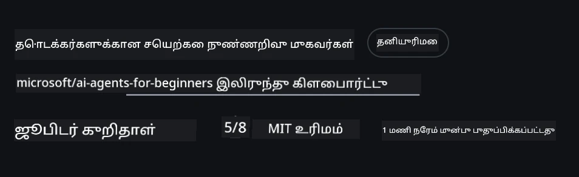
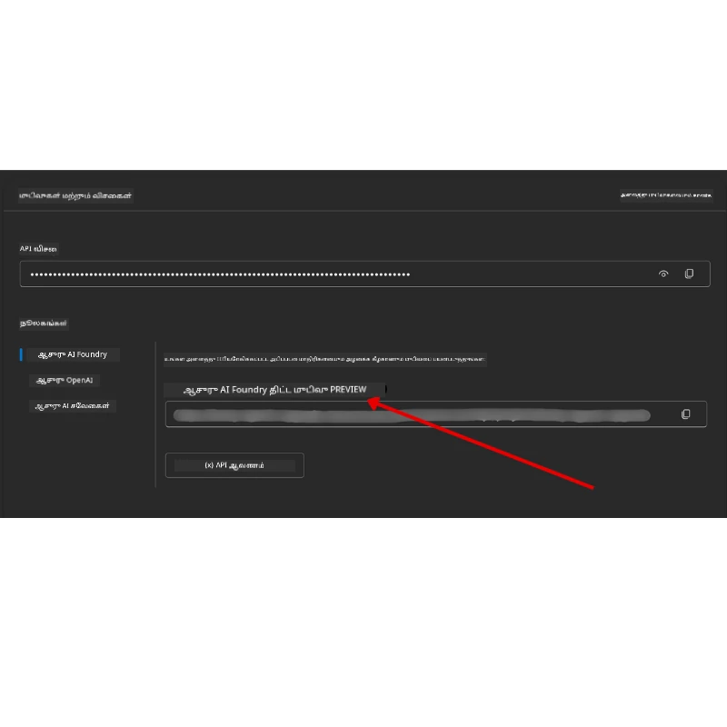

# பாடநெறி அமைக்குதல்

## அறிமுகம்

இந்த பாடத்தில், இந்த பாடநெறியின் குறியீட்டு மாதிரிகளை எப்படி இயக்கு என்பதை கையாளும்.

## மற்ற மாணவர்களுடன் சேரவும் மற்றும் உதவி பெறவும்

உங்கள் ரெப்போவை கிளோன் செய்வதற்கு முன்னர், அமைப்பில் உதவி பெடுக்க, பாடநெறி குறித்து கேள்விகள் கேட்க, அல்லது மற்ற கற்றுநர்களுடன் தொடர்பு கொள்ள [AI Agents For Beginners Discord சேனலில்](https://aka.ms/ai-agents/discord) சேருங்கள்.

## இந்த ரெப்போவை கிளோன் அல்லது ஃபார்க் செய்யவும்

தொடங்கி, தயவுசெய்து GitHub ரெப்பொசிட்டரியை கிளோன் அல்லது ஃபார்க் செய்யவும். இது உங்கள் சொந்த பதிப்பை உருவாக்கும், அதனால் நீங்கள் குறியீட்டை இயக்க, சோதிக்க, மற்றும் திருத்த செய்ய முடியும்!

This can be done by clicking the link to <a href="https://github.com/microsoft/ai-agents-for-beginners/fork" target="_blank">ரெப்போவை ஃபார்க்க் செய்யவும்</a>

You should now have your own forked version of this course in the following link:



### Shallow Clone (workshop / Codespaces க்கு பரிந்துரைக்கப்படுகிறது)

  >குழுமத்தின் முழு வரலாறு மற்றும் அனைத்து கோப்புகளையும் பதிவிறக்கும்போது முழு ரெப்பொசிட்டரி பெரியது (~3 GB) ஆக இருக்க முடியும். நீங்கள் only workshopஐ மட்டுமே கலந்துகொள்கிறீர்களானால் அல்லது சில பாடநெறி கோப்புறை மட்டுமே தேவையானால், ஒரு shallow clone (அல்லது sparse clone) வரலாற்றை சுருக்குவதாலும் மற்றும்/அல்லது ப்ளாப்களை தவிர்ப்பதாலும் அவ்விதமான பதிவிறக்கத்தை தவிர்க்கும்.

#### விரைவான shallow clone — குறைந்த வரலாறு, அனைத்து கோப்புகளும்

கீழுள்ள கட்டளைகளில் `<your-username>` ஐ உங்கள் ஃபார்க் URL (அல்லது நீங்கள் விரும்பினால் upstream URL) கொண்டு மாற்றவும்.

To clone only the latest commit history (small download):

```bash|powershell
git clone --depth 1 https://github.com/<your-username>/ai-agents-for-beginners.git
```

To clone a specific branch:

```bash|powershell
git clone --depth 1 --branch <branch-name> https://github.com/<your-username>/ai-agents-for-beginners.git
```

#### பகுதி (sparse) கிளோன் — குறைந்த ப்ளாப்கள் + தேர்ந்தெடுக்கப்பட்ட கோப்புறைகள் மட்டும்

இது பகுதி கிளோன் மற்றும் sparse-checkout ஐ பயன்படுத்துகிறது (Git 2.25+ தேவை மற்றும் partial clone ஆதரவு கொண்ட சமகால Git பரிந்துரை செய்யப்படுகிறது):

```bash|powershell
git clone --depth 1 --filter=blob:none --sparse https://github.com/<your-username>/ai-agents-for-beginners.git
```

Traverse into the repo folder:

```bash|powershell
cd ai-agents-for-beginners
```

Then specify which folders you want (example below shows two folders):

```bash|powershell
git sparse-checkout set 00-course-setup 01-intro-to-ai-agents
```

After cloning and verifying the files, if you only need files and want to free space (no git history), please delete the repository metadata (💀irreversible — you will lose all Git functionality: no commits, pulls, pushes, or history access).

```bash
# zsh/பாஷ்
rm -rf .git
```

```powershell
# பவர் ஷெல்
Remove-Item -Recurse -Force .git
```

#### GitHub Codespaces பயன்படுத்துதல் (உள்ளூர் பெரிய பதிவிறக்கங்களைத் தவிர்க்க பரிந்துரை செய்யப்படுகிறது)

- இந்த ரெப்போவிற்காக [GitHub UI](https://github.com/codespaces) மூலம் புதிய Codespace ஒன்றை உருவாக்கவும்.  

- புதிய Codespace இன் டெர்மினலில், Codespace வேலைப்பகுதிக்கு தேவையான பாடநெறி கோப்புறைகள் மட்டும் கொண்டு வர மேலே உள்ள shallow/sparse clone கட்டளைகளில் ஒன்றை இயக்கவும்.
- விருப்பமாக: Codespaces உள்ளே கிளோன் செய்த பிறகு, கூடுதலான இடத்தை மீட்டதற்கு .git ஐ அகற்றவும் (மேலே காணப்படும் அகற்றுதல் கட்டளைகளைப் பார்க்கவும்).
- குறிப்பு: நீங்கள் ரெப்போவை நேரடியாக Codespaces இல் திறக்க விரும்பினால் (கூடுதல் கிளோன் இல்லாமல்), Codespaces devcontainer சுற்றுப்புறத்தை கட்டமைக்கும் மற்றும் நீங்கள் தேவையானதைவிட கூடுதலாக வழங்கலாம். ஒரு புதிய Codespace உள்ளே ஒரு shallow copy ஐ கிளோன் செய்வது டிஸ்க் பயன்பாட்டை மேலாண்மை செய்ய அதிக கட்டுப்பாட்டை வழங்கும்.

#### குறிப்புகள்

- திருத்தம்/கமிட் செய்ய விரும்பினால், எப்போதும் கிளோன் URL ஐ உங்கள் ஃபார்க்கால் மாற்றவும்.
- பின்னர் மேலும் வரலாறு அல்லது கோப்புகள் தேவையானால், அவற்றை fetch செய்யலாம் அல்லது sparse-checkout ஐ மாற்றி மேலதிக கோப்புறைகளை சேர்க்கலாம்.

## குறியீட்டை இயக்குதல்

இந்த பாடநெறி கைகோர்மான அனுபவம் பெற Jupyter நோட்புக்குகள் தொடர் வழங்குகிறது.

குறியீட்டு மாதிரிகள் **Microsoft Agent Framework (MAF)** ஐ பயன்படுத்துகின்றன மற்றும் `AzureAIProjectAgentProvider` ஐக் கொண்டு **Microsoft Foundry** வழியாக **Azure AI Agent Service V2** (Responses API) உடன் இணைகிறது.

முழு Python நோட்புக்குகள் `*-python-agent-framework.ipynb` என்ற லேபிள் அடங்கும்.

## தேவைகள்

- Python 3.12+
  - **குறிப்பு**: உங்களிடம் Python3.12 இல்லையெனில், தயவுசெய்து அதை நிறுவுங்கள். பின்னர் requirements.txt கோப்பில் இருந்து சரியான பதிப்புகள் நிறுவப்படுவது உறுதி செய்ய python3.12 பயன்படுத்தி உங்கள் venv ஐ உருவாக்கவும்.
  
    >ಉதாரணம்

    Python venv அடிக்கடி உருவாக்கவும்:

    ```bash|powershell
    python -m venv venv
    ```

    பின்னர் venv சூழலை செயல்படுத்த:

    ```bash
    # zsh/பாஷ்
    source venv/bin/activate
    ```
  
    ```dos
    # Command Prompt for Windows
    venv\Scripts\activate
    ```

- .NET 10+: .NET க்கு பயன்படும் மாதிரிகளுக்காக, [.NET 10 SDK](https://dotnet.microsoft.com/download/dotnet/10.0) அல்லது அதற்குப் பிறகு பதிப்பை நிறுவியிருப்பதை உறுதிசெய்க. பின்னர், உங்கள் நிறுவிய .NET SDK பதிப்பை சரிபார்க்கவும்:

    ```bash|powershell
    dotnet --list-sdks
    ```

- **Azure CLI** — அடையாளப்படுத்தலுக்குத் தேவை. Install from [aka.ms/installazurecli](https://aka.ms/installazurecli).
- **Azure Subscription** — Microsoft Foundry மற்றும் Azure AI Agent Service க்கு அணுகுவதற்காக.
- **Microsoft Foundry Project** — ஒரு deployed model உடன் (உதாரணத்திற்கு, `gpt-4o`) ஒரு project. கீழே [படி 1](../../../00-course-setup) ஐப் பார்க்கவும்.

இந்த ரெப்போவின் ரூட்டில் ஒரு `requirements.txt` கோப்பு உள்ளது, இது குறியீட்டு மாதிரிகளை இயக்க தேவையான அனைத்து Python தொகுதிகளையும் கொண்டுள்ளது.

கீழுள்ள கட்டளை கொண்டு அவற்றை நிறுவப்படலாம்:

```bash|powershell
pip install -r requirements.txt
```

தடுக்கல்கள் மற்றும் சிக்கல்களைத் தவிர்க்க Python வெர்ச்சுவல் சூழலை உருவாக்க பரிந்துரைக்கிறோம்.

## VSCode அமைப்பு

VSCode இல் நீங்கள் சரியான Python பதிப்பைப் பயன்படுத்துகிறீர்கள் என்பதை உறுதிசெய்க.


## Microsoft Foundry மற்றும் Azure AI Agent Service அமைக்குதல்

### படி 1: Microsoft Foundry திட்டத்தை உருவாக்கவும்

நோட்புக்குகளை இயக்க, நீங்கள் deployed model உடன் Azure AI Foundry **hub** மற்றும் **project** வேண்டும்.

1. உங்கள் Azure கணக்கில் உள்நுழைய [ai.azure.com](https://ai.azure.com) சென்று உள்நுழையவும்.
2. ஒரு **hub** உருவாக்கவும் (அல்லது இருப்பின் ஒன்றைப் பயன்படுத்தவும்). பார்க்கவும்: [Hub resources overview](https://learn.microsoft.com/azure/ai-foundry/concepts/ai-resources).
3. hub உள்ளே, ஒரு **project** உருவாக்கவும்.
4. **Models + Endpoints** → **Deploy model** இல் இருந்து ஒரு மாதிரியை (உதா., `gpt-4o`) தளமவைத்து deploy செய்யவும்.

### படி 2: உங்கள் Project Endpoint மற்றும் Model Deployment Name ஐப் பெறவும்

Microsoft Foundry போர்டலில் உங்கள் திட்டத்திலிருந்து:

- **Project Endpoint** — **Overview** பக்கத்திற்கு செல்லவும் மற்றும் endpoint URL ஐ நகலெடுக்கவும்.



- **Model Deployment Name** — **Models + Endpoints** இல் செல்லவும், உங்கள் deployed மாதிரியைத் தேர்ந்தெடுக்கவும், மற்றும் **Deployment name** ஐ குறியீட்டு எடுக்கவும் (உதாரணம்: `gpt-4o`).

### படி 3: `az login` மூலம் Azure இல் உள்நுழையவும்

அனைத்து நோட்புக்குகள் அடையாளப்பதிவு க்காக **`AzureCliCredential`** ஐ பயன்படுத்துகின்றன — API திறவுகோல்கள் நிர்வகிக்க தேவையில்லை. இது Azure CLI வழியாக உள்நுழைவது அவசியமாகும்.

1. **Azure CLI** ஐ நிறுவவில்லை என்றால் நிறுவவும்: [aka.ms/installazurecli](https://aka.ms/installazurecli)

2. **உள்நுழைய** கீழ்காணும் கட்டளையை ஓட்டவும்:

    ```bash|powershell
    az login
    ```

    அல்லது உங்கள் சுற்றுப்புறம் remote/Codespace மற்றும் உலாவி இல்லாமல் இருந்தால்:

    ```bash|powershell
    az login --use-device-code
    ```

3. நீங்கள் உள்நுழைந்தால், சரிபார்க்க உங்கள் subscription ஐ தேர்ந்தெடுக்கவும் — உங்கள் Foundry திட்டம் உள்ளதைக் கண்டுபிடிக்க அதன் subscription ஐ தேர்வு செய்யவும்.

4. **சரிபார்க்கவும்** நீங்கள் உள்நுழைந்துள்ளீர்கள் என:

    ```bash|powershell
    az account show
    ```

> **ஏன் `az login`?** நோட்புக்குகள் `azure-identity` தொகுதியில் இருந்து `AzureCliCredential` ஐப் பயன்படுத்தி அடையாளப்பதிவைக் கொள்கின்றன. இதன் பொருள் உங்கள் Azure CLI session தான் குறியீடுகளை வழங்கும் — `.env` கோப்பில் API திறவுகோல்கள் அல்லது ரகசியங்கள் தேவையில்லை. இது ஒரு [பாதுகாப்பு சிறந்த நடைமுறை](https://learn.microsoft.com/azure/developer/ai/keyless-connections).

### படி 4: உங்கள் `.env` கோப்பை உருவாக்கவும்

உதாரண கோப்பை நகலெடுக்கவும்:

```bash
# zsh/bash
cp .env.example .env
```

```powershell
# பவர்ஷெல்
Copy-Item .env.example .env
```

`.env` ஐத் திறந்து கீழ்காணும் இரண்டு மதிப்புகளை நிரப்பவும்:

```env
AZURE_AI_PROJECT_ENDPOINT=https://<your-project>.services.ai.azure.com/api/projects/<your-project-id>
AZURE_AI_MODEL_DEPLOYMENT_NAME=gpt-4o
```

| Variable | எங்கு காணலாம் |
|----------|-----------------|
| `AZURE_AI_PROJECT_ENDPOINT` | Foundry போர்டல் → உங்கள் project → **Overview** பக்கம் |
| `AZURE_AI_MODEL_DEPLOYMENT_NAME` | Foundry போர்டல் → **Models + Endpoints** → உங்கள் deployed மாதிரியின் பெயர் |

அது தான் பெரும்பாலான பாடங்களுக்கு! நோட்புக்குகள் உங்கள் `az login` session மூலம் தானாகவே அடையாளமளிக்கும்.

### படி 5: Python Dependencies ஐ நிறுவவும்

```bash|powershell
pip install -r requirements.txt
```

மேலில் உருவாக்கிய virtual environment இல் இது ஓட வேண்டும் என்று பரிந்துரைக்கிறோம்.

## பாடம் 5 க்கு கூடுதல் அமைப்பு (Agentic RAG)

பாடம் 5 **Azure AI Search** ஐ retrieval-augmented generation க்கு பயன்படுத்துகின்றது. நீங்கள் அந்த பாடத்தை இயக்க திட்டமிட்டால், இவை உங்கள் `.env` கோப்பில் சேர்க்கப்பட வேண்டும்:

| Variable | எங்கு காணலாம் |
|----------|-----------------|
| `AZURE_SEARCH_SERVICE_ENDPOINT` | Azure போர்டல் → உங்கள் **Azure AI Search** resource → **Overview** → URL |
| `AZURE_SEARCH_API_KEY` | Azure போர்டல் → உங்கள் **Azure AI Search** resource → **Settings** → **Keys** → primary admin key |

## பாடம் 6 மற்றும் பாடம் 8 க்கு கூடுதல் அமைப்பு (GitHub Models)

பாடம் 6 மற்றும் 8 இன் சில நோட்புக்குகள் Azure AI Foundry இடமாற்றம் தவிர **GitHub Models** ஐ பயன்படுத்துகின்றன. நீங்கள் அந்த மாதிரிகளை இயக்க திட்டமிட்டால், உங்கள் `.env` கோப்பில் இவை சேர்க்கவும்:

| Variable | எங்கு காணலாம் |
|----------|-----------------|
| `GITHUB_TOKEN` | GitHub → **Settings** → **Developer settings** → **Personal access tokens** |
| `GITHUB_ENDPOINT` | Use `https://models.inference.ai.azure.com` (default value) |
| `GITHUB_MODEL_ID` | பயன்படுத்த வேண்டிய மாதிரியின் பெயர் (உதா., `gpt-4o-mini`) |

## பாடம் 8 க்கு கூடுதல் அமைப்பு (Bing Grounding Workflow)

பாடம் 8 இல் உள்ள conditional workflow நோட்புக் **Bing grounding** ஐ Azure AI Foundry வழியாக பயன்படுத்துகிறது. நீங்கள் அந்த உதாரணத்தை இயக்க திட்டமிட்டால், உங்கள் `.env` கோப்பில் இந்த மாறியை சேர்க்கவும்:

| Variable | எங்கு காணலாம் |
|----------|-----------------|
| `BING_CONNECTION_ID` | Azure AI Foundry போர்டல் → உங்கள் project → **Management** → **Connected resources** → உங்கள் Bing connection → connection ID ஐ நகலெடுக்கவும் |

## சிக்கல்களைத் தீர்க்குதல்

### macOS இல் SSL சான்றிதழ் சரிபார்ப்பு பிழைகள்

macOS இல் நீங்கள் கீழ்க்காணும் போன்ற பிழையை சந்தித்தால்:

```plaintext
ssl.SSLCertVerificationError: [SSL: CERTIFICATE_VERIFY_FAILED] certificate verify failed: self-signed certificate in certificate chain
```

இது macOS இல் Python உடன் ஏற்படும் நன்கு அறியப்பட்ட பிரச்சனை, இதில் சிஸ்டம் SSL சான்றிதழ்கள் தானாக நம்பப்படவில்லை. கீழ்காணும் தீர்வுகளை கட்டுப்பாட்டிற்குக் கொண்டு முயற்சிக்கவும்:

**விருப்பம் 1: Python இன் Install Certificates ஸ்கிரிப்ட்டை இயக்கு (பரிந்துரைக்கப்படுகிறது)**

```bash
# 3.XX ஐ உங்கள் நிறுவிய Python பதிப்பாக மாற்றவும் (எ.கா., 3.12 அல்லது 3.13):
/Applications/Python\ 3.XX/Install\ Certificates.command
```

**விருப்பம் 2: உங்கள் நோட்புக்கில் `connection_verify=False` பயன்படுத்தவும் (GitHub Models நோட்புக்குகள் மட்டுமே)**

Lesson 6 நோட்புக் (`06-building-trustworthy-agents/code_samples/06-system-message-framework.ipynb`) இல் ஒரு கருத்து வில்லான workaround ஏற்கெனவே சேர்க்கப்பட்டுள்ளது. கிளையன்டை உருவாக்கும்போது `connection_verify=False` என்பதனை அகமதிப்பதனை நீக்கவும்:

```python
client = ChatCompletionsClient(
    endpoint=endpoint,
    credential=AzureKeyCredential(token),
    connection_verify=False,  # உங்களுக்கு சான்று பிழைகள் ஏற்பட்டால் SSL சரிபார்ப்பை முடக்கவும்
)
```

> **⚠️ எச்சரிக்கை:** SSL சரிபார்ப்பை அணைத்துவைக்க (`connection_verify=False`) செய்வது சான்றிதழ் சரிபார்ப்பை தவிர்த்து பாதுகாப்பை குறைக்கிறது. இது வளர்ச்சி சூழல்களில் தற்காலிக ஊக்கமாக மட்டும் பயன்படுத்தவும், உற்பத்தியில் ஒருபோதும் பயன்முறை ஆகாது.

**விருப்பம் 3: `truststore` ஐ நிறுவி பயன்படுத்தவும்**

```bash
pip install truststore
```

பின்னர் உங்கள் நோட்புக் அல்லது ஸ்கிரிப்டின் மேல் இதைச் சேர்க்கவும், எந்த நெட்வொர்க் அழைப்பும் செய்வதற்கு முன்:

```python
import truststore
truststore.inject_into_ssl()
```

## எங்காவது சிக்கலில் சிக்கினீர்களா?

இந்த அமைப்பை இயக்கும்போது ஏதாவது பிரச்சனை இருந்தால், எங்களுடைய <a href="https://discord.gg/kzRShWzttr" target="_blank">Azure AI Community Discord</a> இல் குழுவுடன் சேர்ந்துகொள்ளவும் அல்லது <a href="https://github.com/microsoft/ai-agents-for-beginners/issues?WT.mc_id=academic-105485-koreyst" target="_blank">ஒரு issue உருவாக்கவும்</a>.

## அடுத்த பாடம்

இப்பொழுது நீங்கள் இந்த பாடநெறிக்கான குறியீட்டை இயக்க தயாராக இருக்கிறீர்கள். AI Agents பற்றிய மேலும் கற்றலுக்காக மகிழ்ச்சியான பயணம்! 

[AI முகவர்களுக்கான அறிமுகம் மற்றும் முகவர் பயன்பாட்டு வழிமுறைகள்](../01-intro-to-ai-agents/README.md)

---

<!-- CO-OP TRANSLATOR DISCLAIMER START -->
மறுப்பு:
இந்த ஆவணம் செயற்கை நுண்ணறிவு (AI) மொழிபெயர்ப்பு சேவை Co‑op Translator (https://github.com/Azure/co-op-translator) மூலம் மொழிபெயர்க்கப்பட்டது. நாங்கள் துல்லியத்திற்காக முயற்சித்தாலும், தானியங்கி மொழிபெயர்ப்புகளில் பிழைகள் அல்லது தவறுகள் இருக்கக்கூடும் என்பதை தயவுசெய்து கவனிக்கவும். மூல ஆவணம் அதன் இயல்பான (மூல) மொழியிலேயே அதிகாரப்பூர்வ ஆதாரமாகக் கருதப்பட வேண்டும். முக்கியமான தகவல்களுக்காக, தொழில்முறை மனித மொழிபெயர்ப்பை பரிந்துரைக்கிறோம். இந்த மொழிபெயர்ப்பைப் பயன்படுத்தியதனால் ஏற்படும் எந்த தவறான புரிதல்களுக்கும் அல்லது தவறான விளக்கங்களுக்கும் நாங்கள் பொறுப்பேற்கமாட்டோம்.
<!-- CO-OP TRANSLATOR DISCLAIMER END -->