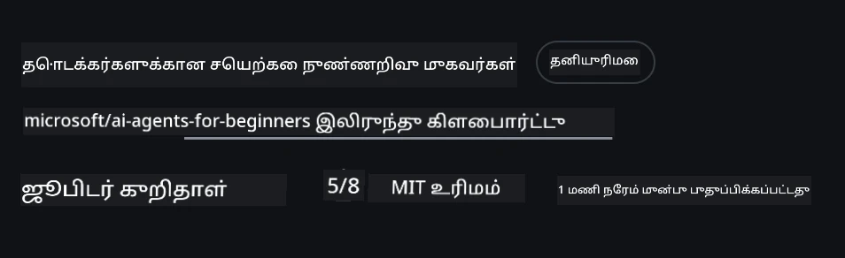
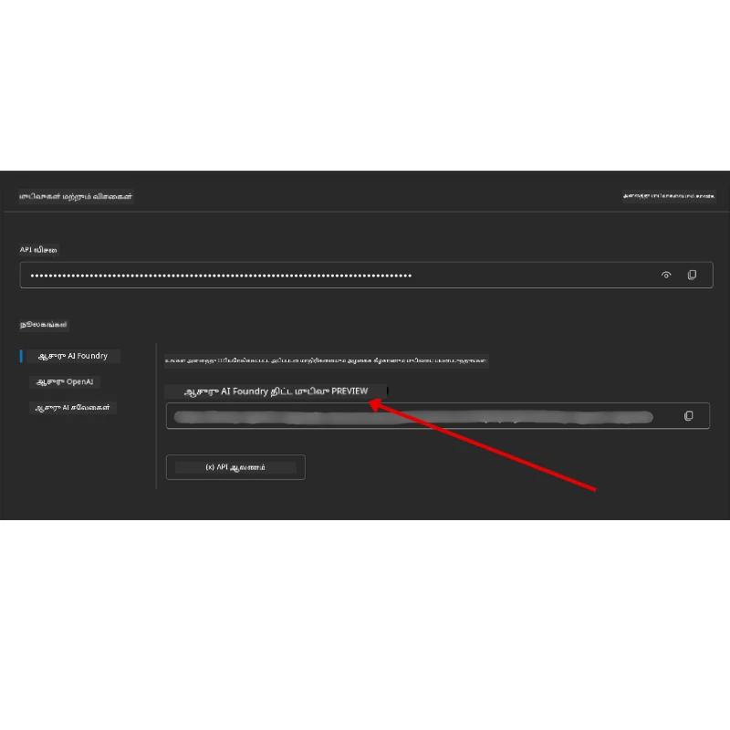

# பாடத்திட்ட அமைப்பு

## அறிமுகம்

இந்த பாடத்தில் இந்த பாடத்திட்டத்தின் குறியீட்டு எடுத்துக்காட்டுகளை எப்படி இயக்குவது என்பதைப் பற்றிக் கூறப்படும்.

## பிற கற்றாளர்களுடன் இணைந்து உதவி பெறுங்கள்

உங்கள் ரெப்போவை கிளோன் செய்வதற்கு முன், அமைப்புக்கான உதவி, பாடத்திட்டத்தில் உள்ள கேள்விகள், அல்லது பிற கற்றாளர்களுடன் இணைவதற்காக [AI Agents For Beginners Discord channel](https://aka.ms/ai-agents/discord)வில் இணைக.

## இந்த ரெப்போவை கிளோன் அல்லது ஃபோர்க் செய்யவும்

தொடங்க, GitHub ரெப்போசிடரியை கிளோன் அல்லது ஃபோர்க் செய்யவும். இது உங்கள் சொந்த பதிப்பாக பாடத் தகவல்களை உருவாக்கி, குறியீட்டை இயக்கவும், சோதனை செய்யவும், திருத்தவும் உதவும்!

இது <a href="https://github.com/microsoft/ai-agents-for-beginners/fork" target="_blank">ரெப்போவை ஃபோர்க் செய்ய</a> இணைப்பை கிளிக் செய்ததன் மூலம் செய்யலாம்

இப்போது இந்த பாடத்திட்டத்தின் உங்கள் சொந்த ஃபோர்க் செய்யப்பட்ட பதிப்பு நீங்கள் பெற்றிருக்கும்:



### கெதுவான (Shallow) கிளோன் (பயிற்சி அறை / கோட்ஸ்பேசுக்கு பரிந்துரைக்கப்படுகிறது)

  >முழு ரெப்போசிடரி முழு வரலாறு மற்றும் அனைத்து கோப்புகளுடன் загрузчல் செய்யப்படும் போது பெரியதாக (~3 GB) இருக்கலாம். நீங்கள் பயிற்சிக்கு மட்டும் கலந்து கொண்டால் அல்லது சில பாடப் பைல்கள் மட்டும் தேவைப்பட்டால், கெதுவான கிளோன் (அல்லது sparse clone) மிகவும் குறைவான டவுன்லோடு செய்யும்.

#### விரைவான கெதுவான கிளோன் — குறைந்த வரலாறு, அனைத்து கோப்புகள்

கீழுள்ள கட்டளைகளில் `<your-username>` என்பதனை உங்கள் ஃபோர்க் URL-ஆக (அல்லது மேல்நிலை URL-ஆக விரும்பினால்) மாற்றவும்.

புதிய கட்டளை வரலாற்றை மட்டும் கிளோன் செய்ய (சிறிய டவுன்லோடு):

```bash
git clone --depth 1 https://github.com/<your-username>/ai-agents-for-beginners.git
```

குறிப்பிட்ட கிளையை கிளோன் செய்ய:

```bash
git clone --depth 1 --branch <branch-name> https://github.com/<your-username>/ai-agents-for-beginners.git
```

#### பகுதி (sparse) கிளோன் — குறைந்த ப்லாப்ஸ் + தேர்ந்தெடுத்த கோப்புறைகள் மட்டும்

இதன் மூலம் பகுதி கிளோன் மற்றும் sparse-checkout பயன்படுத்தப்படுகிறது (Git 2.25+ தேவையானது மற்றும் பகுதி கிளோன் ஆதரவு கொண்ட புதிய Git பரிந்துரைக்கப்படுகிறது):

```bash
git clone --depth 1 --filter=blob:none --sparse https://github.com/<your-username>/ai-agents-for-beginners.git
```

ரெப்போ கோப்புறைக்குள் செல்லவும்:

```bash
cd ai-agents-for-beginners
```

பின்னர் நீங்கள் வேண்டுமென்ற கோப்புறைகளை குறிப்பிடவும் (கீழ்காணும் எடுத்துக்காட்டு இரண்டு கோப்புறைகளை காட்டுகிறது):

```bash
git sparse-checkout set 00-course-setup 01-intro-to-ai-agents
```

கிளோன் செய்ததும் மற்றும் கோப்புகளை சரிபார்த்ததும், நீங்கள் கோப்புகள் மட்டுமே தேவைப்பட்டால் மற்றும் இடத்தை விடுவிக்க வேண்டும் (கிட் வரலாறு இல்லை), ரெப்போ மெட்டாடேட்டாவை அழிக்கவும் (💀மறுக்க முடியாதது — அனைத்து கிட் செயல்பாடுகளும் இழக்கப்படும்):

```bash
# zsh/bash
rm -rf .git
```

```powershell
# பவர்ஷெல்
Remove-Item -Recurse -Force .git
```

#### GitHub Codespaces பயன்படுத்துவது (அருவாய் பெரிய டவுன்லோடுகளைத் தவிர்க்க பரிந்துரைக்கப்படுகிறது)

- இந்த ரெப்போவுக்கான புதிய Codespace ஐ [GitHub UI](https://github.com/codespaces) மூலம் உருவாக்கவும்.  

- புதிய Codespace டெர்மினலில், மேலே உள்ள கெதுவான/பாகிலான கிளோன் கட்டளைகளை இயக்கி தேவையான பாடப் பைல்களை மட்டும் Codespace பணித் தளத்தில் கொண்டு வாருங்கள்.
- விருப்பமாக: Codespaces இல் கிளோன் செய்தபின், மேலே உள்ள .git அகற்றும் கட்டளைகளை பயன்படுத்தி கூடுதல் இடத்தை மீட்டெடுக்க .git கைப்பற்றவும்.
- குறிப்பு: Codespaces இல் நேரடியாக ரெப்போவை திறக்க விரும்பினால் (கிளோன் இல்லாமல்), Codespaces devcontainer சூழலை அமைக்கும் என்பதால் தேவைக்கேற்றதைவிட அதிகத்தை உருவாக்கலாம்.

#### குறிப்புகள்

- திருத்தம் / கடவுச்சொல்லைச் செய்முறை செய்ய விரும்பினால், எப்போதும் கிளோன் URL-ஐ உங்கள் ஃபோர்க் URL-ஆக மாற்றவும்.
- பின்னர் அதிக வரலாறு அல்லது கோப்புகள் தேவைப்பட்டால், அவற்றை பெறவும் அல்லது sparse-checkout-ஐ மாற்றி கூடுதல் கோப்புறைகள் சேர்க்கவும்.

## குறியீட்டை இயக்குதல்

இந்த பாடத்திட்டத்தில் நீங்கள் இயக்கக்கூடிய வெவ்வேறு Jupyter நோட்புக்குகளின் தொடர்கள் உள்ளன, அவை மூலம் AI முகவரிகள் உருவாக்குவதற்கு நடைமுறை அனுபவத்தை பெறலாம்.

குறியீட்டு எடுத்துக்காட்டுகள் **Microsoft Agent Framework (MAF)** ஐ `FoundryChatClient` உடன் பயன்படுத்துகிறது, இது **Microsoft Foundry Agent Service V2** (Responses API) மூலம் **Microsoft Foundry**யை இணைக்கிறது.

அனைத்து Python நோட்புக்குகளும் `*-python-agent-framework.ipynb` என்ற லேபிள் உள்ளது.

## தேவைகள்

- Python 3.12+
  - **குறிப்பு**: உங்கள் கணினியில் Python3.12 நிறுவப்படவில்லை என்றால், அதை நிறுவி கொள்ளவும். அதன்பின் python3.12 பயன்படுத்தி venv உருவாக்கி requirements.txt கோப்பிலிருந்து சரியான பதிப்புகளை நிறுவவும்.
  
    >எடுத்துக்காட்டு

    Python venv கோப்புறையை உருவாக்கவும்:

    ```bash
    python -m venv venv
    ```

    பின்னர் கீழும் venv சூழலை செயல்படுத்தவும்:

    ```bash
    # zsh/bash
    source venv/bin/activate
    ```
  
    ```dos
    # Command Prompt for Windows
    venv\Scripts\activate
    ```

- .NET 10+: .NET பயன்படுத்தும் எடுத்துக்காட்டுக் குறியீடுகளுக்கு, [.NET 10 SDK](https://dotnet.microsoft.com/download/dotnet/10.0) அல்லது அதற்கு மேல் பதிப்புகளை நிறுவ உறுதி செய்யவும். பிறகு நிறுவப்பட்ட .NET SDK பதிப்பை சரிபார்க்கவும்:

    ```bash
    dotnet --list-sdks
    ```

- **Azure CLI** — அங்கீகரிப்புக்காக அவசியம். [aka.ms/installazurecli](https://aka.ms/installazurecli) இல் இருந்து நிறுவவும்.
- **Azure சந்தா** — Microsoft Foundry மற்றும் Microsoft Foundry Agent Service அணுகலுக்கு.
- **Microsoft Foundry திட்டம்** — அமர்த்தப்பட்ட மாதிரியுடன் ஒரு திட்டம் (எ.கா. `gpt-5-mini`). கீழே உள்ள [படி 1](#படி-1-microsoft-foundry-திட்டம்-உருவாக்குக) காண்க.

இந்த ரெப்போசிடரி வேர் கோப்பில் code சாம்பிள்களை இயக்க தேவையான அனைத்து Python பாக்கேஜ்களும் உள்ள `requirements.txt` கோப்பை சேர்த்துள்ளோம்.

ரெப்போசிடரி வேர் கோப்பில் கீழுள்ள கட்டளையை இயக்கி அவற்றை நிறுவலாம்:

```bash
pip install -r requirements.txt
```

எந்தவிதத் தடைகளை தவிர்க்க Python மெய்நிகர் சூழலை உருவாக்க பரிந்துரைக்கப்படுகிறது.

## VSCode அமைக்கவும்

நீங்கள் VSCode இல் சரியான Python பதிப்பைப் பயன்படுத்துகிறீர்கள் என்பதை உறுதிப்படுத்துங்கள்.


## Microsoft Foundry மற்றும் Microsoft Foundry Agent Service ஐ அமைக்கவும்

### படி 1: Microsoft Foundry திட்டம் உருவாக்குக

நோட்புக்குகளை இயக்க Microsoft Foundry **ஹப்** மற்றும் **திட்டம்** ஒரு அமர்த்தப்பட்ட மாதிரியுடன் தேவை.

1. [ai.azure.com](https://ai.azure.com) சென்று உங்கள் Azure கணக்கில் உள்நுழையவும்.
2. **ஹப்** உருவாக்கவும் (அல்லது ஏற்கனவே உள்ளதைப் பயன்படுத்தவும்). பார்த்தல்: [Hub resources overview](https://learn.microsoft.com/azure/ai-foundry/concepts/ai-resources).
3. ஹப்புக்குள், **திட்டம்** உருவாக்கவும்.
4. **மாதிரிகள் + முடிச்சுகள்** → **மாதிரியை அமர்த்து** இல் இருந்து மாதிரியை (எ.கா. `gpt-5-mini`) அமர்த்தவும்.

### படி 2: உங்கள் திட்டத்தின் இறுதி முகவரியும் மாதிரி அமர்த்தல் பெயரும் பெறுக

Microsoft Foundry போர்டலில் உங்கள் திட்டத்திலிருந்து:

- **திட்ட இறுதி முகவரி** — **மேலோட்டம்** பக்கத்திற்கு சென்று இறுதி URL ஐ நகலெடுக்கவும்.



- **மாதிரி அமர்த்தல் பெயர்** — **மாதிரிகள் + முடிச்சுகள்** சென்று உங்கள் அமர்த்தப்பட்ட மாதிரியை தேர்வு செய்து **அமர்த்தல் பெயர்** (எ.கா. `gpt-5-mini`) குறிக்கவும்.

### படி 3: `az login` மூலம் Azure இல் உள்நுழையவும்

பெரும்பாலான நோட்புக்குகள் உங்கள் **Azure CLI உள்நுழைவின்** மூலம் ஆண்டன்டிகேட் செய்கின்றன — `AzureCliCredential` அல்லது `DefaultAzureCredential` (இரண்டும் உங்கள் `az login` அமர்வைக் கொண்டு சரிபார்க்கின்றன) `azure-identity` தொகுப்பில் இருந்து — ஆகவே API விசைகள் தேவையில்லை. சில பாகங்கள் மற்றும் விருப்ப இணைப்புகள் API விசைகளைப் பயன்படுத்தலாம்; கிளாசுக்கான அவசியங்களை சரிபார்க்கவும். Azure CLI மூலமாக உள்நுழைவது அவசியம்.

1. **Azure CLI ஐ நிறுவு** இதுவரை இல்லையெனில்: [aka.ms/installazurecli](https://aka.ms/installazurecli)

2. **உள்நுழைய** கீழ்கண்ட கட்டளையை இயக்கவும்:

    ```bash
    az login
    ```

    உங்களிடம் உலாவி இல்லாத தொலை/கோட்ஸ்பேஸ் சூழலில் இருப்பின்:

    ```bash
    az login --use-device-code
    ```

3. **உங்கள் சந்தாவை தேர்வுசெய்யவும்** (ஏதேனும் கேட்கப்பட்டால்) — உங்கள் Foundry திட்டம் அடங்கிய ஒன்றைத் தேர்ந்தெடுக்கவும்.

4. **உள்நுழைந்துள்ளீர்கள் என உறுதிப்படுத்தவும்:**

    ```bash
    az account show
    ```

> **ஏன் `az login`?** நோட்புக்குகள் `AzureCliCredential` (அல்லது `DefaultAzureCredential`, இது உங்கள் Azure CLI உள்நுழைவையும் எடுக்கும்) மூலம் அங்கீகரிக்கின்றன. இதனால் உங்கள் Azure CLI அமர்வு அங்கீகாரங்களை வழங்குகிறது — உங்கள் `.env` கோப்பில் எதுவும் API விசைகள் அல்லது ரகசியங்கள் தேவையில்லை. இது ஒரு [பாதுகாப்பு சிறந்த நடைமுறை](https://learn.microsoft.com/azure/developer/ai/keyless-connections).

### படி 4: `.env` கோப்பை உருவாக்கவும்

எடுத்துக்காட்டு கோப்பை நகலெடுக்கவும்:

```bash
# zsh/bash
cp .env.example .env
```

```powershell
# பவர்ஷெல்
Copy-Item .env.example .env
```

`.env` திறந்து இதை இரண்டு மதிப்புகளுடன் நிரப்பவும்:

```env
AZURE_AI_PROJECT_ENDPOINT=https://<your-project>.services.ai.azure.com/api/projects/<your-project-id>
AZURE_AI_MODEL_DEPLOYMENT_NAME=gpt-5-mini
```

| மாறி | எங்கே காணலாம் |
|----------|-----------------|
| `AZURE_AI_PROJECT_ENDPOINT` | Foundry போர்டல் → உங்கள் திட்டம் → **மேலோட்டம்** பக்கம் |
| `AZURE_AI_MODEL_DEPLOYMENT_NAME` | Foundry போர்டல் → **மாதிரிகள் + முடிச்சுகள்** → உங்கள் அமர்த்தப்பட்ட மாதிரி பெயர் |

பெரும்பாலான பாடங்களுக்கு இதுவே போதுமே! குறிகளுக்கான அங்கீகாரம் உங்கள் `az login` அமர்வின் மூலம் தானாகவே செய்யப்படும்.

### படி 5: Python சார்ந்த சார்புகளை நிறுவவும்

```bash
pip install -r requirements.txt
```

இதை நீங்கள் முன்பு உருவாக்கிய மெய்நிகர் சூழலில் இயக்க பரிந்துரைக்கப்படுகிறது.

## விருப்பமான அமைப்பு: Azure AI தேடல் (பாடங்கள் 5 மற்றும் 16)

பாடம் 5 (Agentic RAG) மற்றும் பாடம் 16 நோட்புக்குகள் **நினைவக அறிவுத் தளத்துடன்** உடனடியாக இயங்குகின்றன — கூடுதல் Azure வளங்கள் தேவையில்லை. உண்மையான **Azure AI தேடல்** குறியீடு எதிர்பார்க்குமெனில், பாடம் 16 நோட்புக்குகள் தற்போது விசையுடன் அடையாளப்படுத்தப்படுவதாக உள்ளது: அது ```AZURE_SEARCH_SERVICE_ENDPOINT``` மற்றும் ```AZURE_SEARCH_API_KEY``` இரண்டுமே அமைக்கப்பட்டால் மட்டுமே நினைவக தேடலிலிருந்து Azure AI தேடலுக்கு மாறும், இல்லையெனில் நினைவக தேடலில் தொடர்ந்து இருக்கும் — ஆகவே உண்மையான குறியீட்டுக்கு நிர்வாக விசையை அமைக்க வேண்டும். விசையில்லா Azure Entra ID (RBAC) அடையாளப்படுத்துவதை உங்களுடைய உற்பத்தி குறியீட்டிற்கு பரிந்துரைக்கப்படுகிறது, இது இந்த பாடத்தொகையில் used `az login` முறையை பின்பற்றி இருக்கிறது.

கீழுள்ள RBAC படிகள் அமைப்பு-வகுப்புக்கான சாம்பிள்கள் மற்றும் உங்கள் சொந்த குறியீட்டிற்கு பொருந்தும். பாடம் 16 நோட்புக்கில் விசையற்ற அடையாளப்படுத்தியை இயக்கு கூடாது; பாடம் 16க்கு Azure AI தேடலை பயன்படுத்த இரண்டும்: இறுதி முகவரியும் நிர்வாக விசையும் தேவையாகும்.

1. உங்கள் தேடல் சேவையில் **பங்கு அடிப்படையிலான அணுகலை** இயக்கு:

    ```bash
    az search service update --name <service-name> --resource-group <resource-group> --auth-options aadOrApiKey
    ```

2. உங்களுக்கு தேவையான பங்குகளை வழங்குக (சரிபார்ப்பு / இண்டெக்ஸ்கள் உருவாக்குதல் மற்றும் கேள்விகள்):

    ```bash
    az role assignment create --assignee <your-user-or-principal-id> --role "Search Service Contributor" --scope $(az search service show -g <resource-group> -n <service-name> --query id -o tsv)
    az role assignment create --assignee <your-user-or-principal-id> --role "Search Index Data Contributor" --scope $(az search service show -g <resource-group> -n <service-name> --query id -o tsv)
    ```

3. `.env` கோப்பில் இறுதி முகவரியைச் சேர்க்கவும்:

| மாறி | எங்கே காணலாம் |
|----------|-----------------|
| `AZURE_SEARCH_SERVICE_ENDPOINT` | Azure போர்டல் → உங்கள் **Azure AI Search** வளம் → **மேலோட்டம்** → URL |
| `AZURE_SEARCH_API_KEY` | பாடம் 16 நோட்புக்கில் Azure AI தேடலை இயக்க நிர்வாக விசை (இறுதி முகவரியுடன்) தேவை. Azure போர்டல் → **அமைப்புகள்** → **விசைகள்** → முதன்மை நிர்வாக விசை |

> **ஏன் விசையில்லா?** நிர்வாக விசைகள் முழுமையான எழுதும் அணுகலை வழங்கி, .env கோப்புகளில் கசிவடைவதற்கான வாய்ப்பு உள்ளது. RBAC மூலம் உங்கள் `az login` அடையாளம் பயன்படுத்தப்படுகிறது — பாடத்தொகையில் இருப்பது போல் (via `AzureCliCredential` / `DefaultAzureCredential`). பார்க்கவும் [Azure AI தேடலை பங்குகளின் மூலம் இணைக்க](https://learn.microsoft.com/azure/search/search-security-rbac).

முழு குறியீடு உதாரணங்களுக்கு [Azure AI Search அமைப்பு வழிகாட்டி](./AzureSearch.md) பார்க்கவும், Python மற்றும் .NET.

## Azure OpenAI ஐ நேரடியாக கையாளும் பாடங்களுக்கும் கூடுதல் அமைப்புகள் (பாடங்கள் 6 மற்றும் 8)

பாடங்கள் 6 மற்றும் 8 இல் சில நோட்புக்குகள் நேரடியாக **Azure OpenAI** ஐ (Responses API மூலம்) அழைக்கின்றன, Microsoft Foundry திட்டம் வழியாக இல்லாமல். இந்த எடுத்துக்காட்டுகள் முன்பு GitHub மாதிரிகள் பயன்படுத்தியன, அவை தற்போது பயன்பாடற்றவை மற்றும் Responses APIஐ ஆதரிக்காது. உங்கள் `.env` கோப்பில் இந்த மாறிகள் சேர்க்கப்பட வேண்டும்:

| மாறி | எங்கே காணலாம் |
|----------|-----------------|
| `AZURE_OPENAI_ENDPOINT` | Azure போர்டல் → உங்கள் **Azure OpenAI** வளம் → **Keys and Endpoint** → இறுதி முகவரி (எ.கா. `https://<your-resource>.openai.azure.com`) |
| `AZURE_OPENAI_DEPLOYMENT` | Responses API ஐ ஆதரிக்கும் உங்கள் அமர்த்தப்பட்ட மாதிரி பெயர் (எ.கா. `gpt-5-mini`) |
| `AZURE_OPENAI_API_KEY` | விருப்பமானது — `az login` / Entra ID பதிலாக விசையுடன் அடையாளப்படுத்தல் பயன்படுமானால் |

> Responses API நிலையான `/openai/v1/` இறுதியை பயன்படுத்துகிறது, ஆகையால் `api-version` தேவையில்லை. விசையற்ற Entra ID அடையாளப்படுத்த Azure CLI உள்நுழைந்திருப்பது அவசியம்.

## மாற்று வழங்குபவர்: MiniMax (OpenAI-போன்ற)

[MiniMax](https://platform.minimaxi.com/) பெரிய நிரலாக்க மாதிரிகள் (204K குறியிடக்கூடிய அதிகபட்ச உருப்படிகள்) OpenAI-போன்ற API மூலம் வழங்குகிறது. Microsoft Agent Framework இன் `OpenAIChatClient` OpenAI-போன்ற எந்த இறுதியையும் வேலை செய்யும் என்பதால், MiniMax ஐ `OpenAIChatClient` பயன்படுத்தும் பாடங்களுக்கு மாற்றாக பயன்படுத்தலாம்.

உங்கள் `.env` கோப்பில் கீழுள்ள மாறிகள் சேர்க்கவும்:

| மாறி | எங்கே காணலாம் |
|----------|-----------------|
| `MINIMAX_API_KEY` | [MiniMax தளம்](https://platform.minimaxi.com/) → API விசைகள் |
| `MINIMAX_BASE_URL` | `https://api.minimax.io/v1` (இயல்புநிலை மதிப்பு) பயன்படுத்தவும் |
| `MINIMAX_MODEL_ID` | பயன்படுத்த வேண்டிய மாதிரி பெயர் (எ.கா. `MiniMax-M3`) |

**எடுத்துக்காட்டு மாதிரிகள்**: `MiniMax-M3` (பரிந்துரைக்கப்படும்), `MiniMax-M2.7`, `MiniMax-M2.7-highspeed` (வேகமான பதில்கள்). மாதிரி பெயர்கள் மற்றும் கிடைக்கும் நிலைகள் காலப்போக மாற்றம் அடையும், மாதிரிக்கு அணுகல் உங்கள் கணக்கின்மேல் சார்ந்தது.

`OpenAIChatClient` பயன்படுத்தும் குறியீட்டுக்காட்சி (எ.கா. பாடம் 14 ஹோட்டல் முன்பதிவு வேலைப்பாடு) `MINIMAX_API_KEY` அமைக்கப்பட்டால் தானாக MiniMax அமைப்பை கண்டறிந்து பயன்படுத்தும்.


## மாற்றுச் சேவை வழங்குநர்: Foundry Local (மாதிரிகளை சாதனத்தில் இயக்கவும்)

[Foundry Local](https://foundrylocal.ai) என்பது ஒரு எளிய ஓட்டுநர் சுற்றுச்சூழல் ஆகும், இது OpenAI-க்கு இணக்கமான API மூலம் மொழி மாதிரிகளை **முழுமையாக உங்கள் சொந்த இயந்திரத்தில்** பதிவிறக்கி, நிர்வகித்து, சேவை செய்கிறது — எந்த கிளவுட் தேவையில்லை.

மைக்ரோசாஃப்ட் ஏஜென்ட் கட்டமைப்பின் `OpenAIChatClient` எந்த OpenAI-க்கு இணக்கமான அளவுகோலுக்கும் செயல்படுவதால், Foundry Local என்பது Azure OpenAIக்கு ஒரு உள்ளூர் மாற்று ஆகும்.

**1. Foundry Local ஐ நிறுவுக**

```bash
# விண்டோஸ்
winget install Microsoft.FoundryLocal

# மக்ஓஎஸ்
brew install foundrylocal
```

**2. ஒரு மாதிரியை பதிவிறக்கம் செய்து இயக்கவும்** (இது உள்ளூர் சேவையையும் தொடக்குகிறது):

```bash
foundry model list          # கிடைக்கும் மாதிரிகள் பார்க்கவும்
foundry model run phi-4-mini
```

**3. உள்ளூர் அளவுகோலை கண்டறிய பயன்படுத்தப்படும் Python SDK ஐ நிறுவுக:**

```bash
pip install foundry-local-sdk
```

**4. மைக்ரோசாஃப்ட் ஏஜென்ட் கட்டமைப்பை உங்கள் உள்ளூர் மாதிரிக்குச் சுட்டுக:**

```python
from foundry_local import FoundryLocalManager
from agent_framework.openai import OpenAIChatClient

# மாடலை உள்ளூர் பதிவிறக்கம் செய்து (தேவையானால்) சேவை புரிகிறது, பிறகு எண்ட்பாயின்ட்/போர்ட்டை கண்டறிகிறது.
manager = FoundryLocalManager("phi-4-mini")

chat_client = OpenAIChatClient(
    base_url=manager.endpoint,      # உதாரணமாக http://localhost:<port>/v1
    api_key=manager.api_key,        # Foundry Local க்கானது எப்போதும் "தேவை இல்லை"
    model_id=manager.get_model_info("phi-4-mini").id,
)

agent = chat_client.as_agent(
    name="LocalAgent",
    instructions="You are a helpful assistant running fully on-device.",
)
```

> **குறிப்பு:** Foundry Local ஒரு OpenAI-க்கு இணக்கமான **Chat Completions** அளவுகோலை வெளிப்படுத்துகிறது. உள்ளூர் அபிவிருத்தி மற்றும் ஆஃப்லைன் சூழல்களுக்கு இதனை பயன்படுத்தவும். முழு **Responses API** அம்சங்களுக்குப் (நிலையான உரையாடல்கள், முதலியன) Azure OpenAI அல்லது ஒரு Microsoft Foundry திட்டத்தைப் பயன்படுத்தவும்.

## பாடம் 8க்கு கூடுதல் அமைப்பு (Bing நிலை நாட்டல் பணிமுறை)

பாடம் 8 இல் உள்ள நிபந்தனை அடிப்படையிலான பணிமுறை Microsoft Foundry மூலம் **Bing நிலை நாட்டல்** ஐ பயன்படுத்துகிறது. நீங்கள் அந்த மாதிரியை இயக்க திட்டமிட்டால், உங்கள் `.env` கோப்பில் இந்த மாறியைச் சேர்ப்பது அவசியம்:

| மாறி | எங்கே காணுவது |
|----------|-----------------|
| `BING_CONNECTION_ID` | Microsoft Foundry போர்டல் → உங்கள் திட்டம் → **Management** → **Connected resources** → உங்கள் Bing இணைப்பு → இணைப்பு ஐடியை நகலெடுக்கவும் |

## பிழைசெய்தி தீர்வு

### macOSல் SSL சான்றிதழ் சரிபார்ப்பு பிழைகள்

நீங்கள் macOS உபயோகிப்பவர் என்றால் மற்றும் இத்தகைய பிழைச் செய்தியை எதிர்கொண்டால்:

```plaintext
ssl.SSLCertVerificationError: [SSL: CERTIFICATE_VERIFY_FAILED] certificate verify failed: self-signed certificate in certificate chain
```

இது macOSஇல் Python-க்கு தெரிந்த பிரச்சனை; ஆனால் கணினியின் SSL சான்றிதழ்கள் தானாக நம்பப்படவில்லை. கீழ்க்காணும் தீர்வுகளை வரிசையாக முயற்சிக்கவும்:

**முதல் விருப்பம்: Python இன் Install Certificates ஸ்கிரிப்டை இயக்கவும் ( பரிந்துரைக்கப்படுகிறது)**

```bash
# உங்கள் நிறுவிய Python பதிப்பை 3.XX என்ற இடத்தில் மாற்றவும் (எவ்வாறு 3.12 அல்லது 3.13):
/Applications/Python\ 3.XX/Install\ Certificates.command
```

**இரண்டாம் விருப்பம்: `connection_verify=False` ஐ உங்கள் நோட்புக் ல் பயன்படுத்தவும் (GitHub Models நோட்புக் க்கே மட்டுமே)**

பாடம் 6 நோட்புக் (`06-building-trustworthy-agents/code_samples/06-system-message-framework.ipynb`) இல், ஒரு கருத்துப்படுத்தப்பட்ட மாற்று முன்னேற்பாடு ஏற்கனவே உள்ளதாகும். சான்றிதழ் பிழைகள் வந்தாலே `connection_verify=False` ஐ கருத்துப்பட்டியலில் இருந்து மாற்றி விடவும்:

```python
client = ChatCompletionsClient(
    endpoint=endpoint,
    credential=AzureKeyCredential(token),
    connection_verify=False,  # சான்றிதழ் பிழைகள் ஏற்பட்டால் SSL சரிபார்ப்பை முடக்கு
)
```

> **⚠️ எச்சரிக்கை:** SSL சரிபார்ப்பை முடக்குவது (`connection_verify=False`) சான்றிதழ் சரிபார்ப்பு தாண்டி பாதுகாப்பை குறைக்கிறது. இது அபிவிருத்தி சூழல்களில் தற்காலிக மாற்று மாதிரியாக மட்டுமே பயன்படுத்தவும். தயாரிப்பில் ஒருபோதும் பயன்படுத்த வேண்டாம்.

**மூன்றாவது விருப்பம்: `truststore` ஐ நிறுவி பயன்படுத்தவும்**

```bash
pip install truststore
```

பின்னர் உங்கள் நோட்புக் அல்லது ஸ்கிரிப்டின் மேல் பகுதி எங்கும் எந்த நெட்வொர்க் அழைப்புகளுக்கும் முன் இதனை சேர்க்கவும்:

```python
import truststore
truststore.inject_into_ssl()
```

## எங்கோ சிக்கியுள்ளீர்களா?

இந்த அமைப்பை இயக்குவதில் ஏதேனும் சிக்கல்கள் இருந்தால், எங்கள் <a href="https://discord.gg/kzRShWzttr" target="_blank">Azure AI Community Discord</a> இல் கலந்து கொள்ளவும் அல்லது <a href="https://github.com/microsoft/ai-agents-for-beginners/issues?WT.mc_id=academic-105485-koreyst" target="_blank">பதிவேலை ஒன்றை உருவாக்கவும்</a>.

## அடுத்த பாடம்

தற்போது நீங்கள் இந்த பாடத்திற்கான குறியீட்டை இயக்க தயாராக உள்ளீர்கள். AI ஏஜெண்ட்ஸ் உலகத்தைப் பற்றி மேலும் கற்றுக்கொள்வதில் மகிழ்ச்சி! 

[AI ஏஜெண்ட்ஸ் அறிமுகம் மற்றும் ஏஜெண்ட் பயன்பாடு வழிகள்](../01-intro-to-ai-agents/README.md)

---

<!-- CO-OP TRANSLATOR DISCLAIMER START -->
**மறுப்பு**:
இந்த ஆவணம் AI மொழிபெயர்ப்பு சேவை [Co-op Translator](https://github.com/Azure/co-op-translator) பயன்படுத்தி மொழிபெயர்க்கப்பட்டுள்ளது. நாங்கள் துல்லியத்திற்காக முயற்சி செய்துள்ளோம், ஆனால் தானாக செய்யப்படும் மொழிபெயர்ப்புகளில் பிழைகள் அல்லது தவறுகள் இருக்கலாம் என்பதை கவனத்தில் கொள்ளவும். அசல் ஆவணம் அதன் தாய்மொழியில் அதிகாரப்பூர்வ ஆதாரமாக கருதப்பட வேண்டும். முக்கியமான தகவல்களுக்கு, தொழில்நுட்பமான மனித மொழிபெயர்ப்பு பரிந்துரைக்கப்படுகிறது. இந்த மொழிபெயர்ப்பைப் பயன்படுத்துவதால் ஏற்படும் எந்த தவறான புரிதல்கள் அல்லது தவறான விளக்கத்திற்கும் நாங்கள் பொறுப்பில்வில்லை.
<!-- CO-OP TRANSLATOR DISCLAIMER END -->