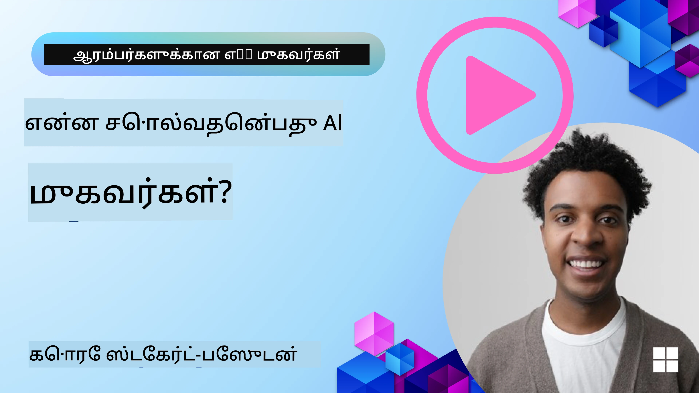
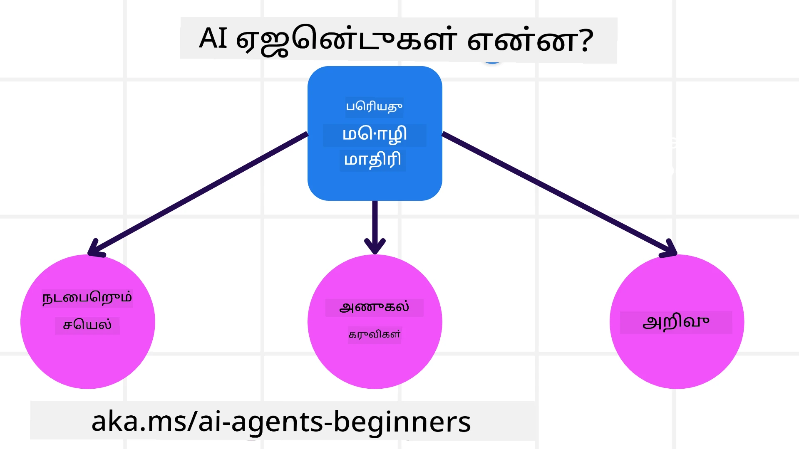
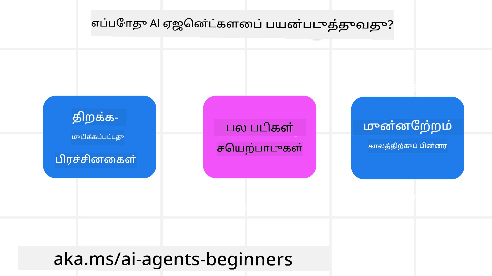

> _(இந்த பாடத்தின் வீடியோவை காண மேலுள்ள படத்தை கிளிக் செய்யவும்)_

# AI முகவர்கள் மற்றும் அவற்றின் பயன்பாட்டு வழக்குகள்

Welcome to the "AI Agents for Beginners" course! இந்த பாடநெறி AI முகவர்கள் உருவாக்க அடிப்படை அறிவு மற்றும் பயன்படுத்தக்கூடிய எடுத்துக்காட்டுகளை வழங்குகிறது.

Join the <a href="https://discord.gg/kzRShWzttr" target="_blank">Azure AI Discord Community</a> to meet other learners and AI Agent Builders and ask any questions you have about this course.

To start this course, we begin by getting a better understanding of what AI Agents are and how we can use them in the applications and workflows we build.

## அறிமுகம்

இந்த பாடம் உள்ளவை:

- AI முகவர்கள் என்றால் என்ன மற்றும் வெவ்வேறு வகை முகவர்கள் எவை?
- AI முகவர்களுக்கு ஏற்ற சிறந்த பயன்பாட்டு வழக்குகள் என்ன மற்றும் அவை எவ்வாறு உதவுகின்றன?
- Agentic தீர்வுகளை வடிவமைக்கும் போது சில அடிப்படை கட்டுமான அலகுகள் என்னென்ன?

## கற்றல் இலக்குகள்
இந்த பாடத்தை முடித்த பிறகு, நீங்கள் பின்வரும் திறன்களை பெறுவீர்கள்:

- AI முகவர்களின் கருத்துக்களை மற்றும் அவை மற்ற AI தீர்வுகளிலிருந்து எப்படி வேறுபடுகின்றன என்பதை புரிந்துகொள்ள முடியும்.
- AI முகவர்களை மிகவும் செயல்திறனுடன் பயன்படுத்த முடியும்.
- பயனாளர்களுக்கும் வாடிக்கையாளர்களுக்கும் பயன்படுமாறு Agentic தீர்வுகளை பயனுள்ளதாக வடிவமைக்க முடியும்.

## AI முகவர்களின் வரையறை மற்றும் AI முகவர்களின் வகைகள்

### AI முகவர்கள் என்றால் என்ன?

AI முகவர்கள் என்பது **அமைப்புகள்** ஆகும்; அவை **பெரிய மொழி மாதிரிகள் (LLMs)** இன் திறன்களை விரிவூட்டி LLMகளை **செயல்களை நிறைவேற்ற** உதவுவதற்காக **கருவிகளுக்கு அணுகல்** மற்றும் **அறிவு** ஆகியவற்றை வழங்குகின்றன.

இந்த வரையறையை சிறு பகுதிகளாகப் பிரிப்போம்:

- **அமைப்பு** - முகவர்களை ஒரு ஒரே கூறாக அல்லாமல் பல கூறுகளை கொண்ட ஒரு அமைப்பாக நினைத்துச் செல்லுவது முக்கியம். அடிப்படை நிலையில், ஒரு AI முகவரியின் கூறுகள்:
  - **சூழல்** - AI முகவர் செயல்படும் வரையறுக்கப்பட்ட பரப்பிடம். உதாரணமாக, ஒரு பயண முன்பதிவு AI முகவரின் சூழல் என்பது அந்த AI முகவர் பணிகளை நிறைவேற்ற பயன்படுத்தும் பயண முன்பதிவு அமைப்பாக இருக்கலாம்.
  - **சென்சார்கள்** - சூழலுக்கு தொடர்புடைய தகவல்களை மற்றும் பின்னூட்டத்தை வழங்கும். AI முகவர்கள் சூழலின் தற்போதைய நிலை பற்றிய இந்த தகவலை சேகரிக்க மற்றும் பிரையோக்கியப்படுத்த சென்சார்களைப் பயன்படுத்துகின்றன. பயண முன்பதிவு முகவர் எடுத்துக்காட்டில், முன்பதிவு அமைப்பு ஹோட்டல் கிடைக்கும் தன்மை அல்லது விமானப் பயணங்களின் விலைகள் போன்ற தகவல்களை வழங்கலாம்.
  - **அமல்படுத்திகள்** - ஒரு முறை AI முகவர் சூழலின் தற்போதைய நிலையைக் கோர்ந்து கொண்டவுடன், தற்போதைய பணிக்காக சூழலை மாற்ற எந்த நடவடிக்கையை மேற்கொள்ள வேண்டும் என்று முகவர் நிர்ணயிக்கிறது. பயண முன்பதிவு முகவரின் உதாரணத்தில், அது பயனருக்காக கிடைக்கும் அறையை ஆர்ஜி செய்வது இருக்கலாம்.

**பெரிய மொழி மாதிரಿಗಳು (LLMs)** - முகவர்களின் கான்செப்ட் LLMகள் உருவாகும் முன்பே இருந்தது. LLMகளுடன் AI முகவர்களை கட்டமைப்பதன் நன்மை மனித மொழி மற்றும் தரவுகளைப் பகுத்தறிய அவர்களுடைய திறனாகும். இந்த திறன் LLMகளை சூழல் தகவலைப் புரிந்து கொண்டு சூழலை மாற்ற திட்டமிட ஊக்குவிக்கிறது.

**செயல்களை நிறைவேற்ற** - AI முகவர் அமைப்புகளுக்குப் புறமாக, LLMகள் பயனரின் கோரிக்கையின்போது உள்ளடக்கம் அல்லது தகவலை உருவாக்குவது போன்ற நடவடிக்கைகள்வரை மட்டுமே வரையறுக்கப்படும். AI முகவர் அமைப்புகளுக்குள், LLMகள் பயனரின் கோரிக்கையை பகுத்தறிந்து அவற்றின் சூழலில் கிடைக்கும் கருவிகளைப் பயன்படுத்தி பணிகளை நிறைவேற்ற முடிகிறது.

**கருவிகளுக்கு அணுகல்** - LLMக்கு என்னென்ன கருவிகள் அணுகலாக இருக்கும் என்பது 1) அது செயல்படும் சூழலால் மற்றும் 2) AI முகவரியை உருவாக்கும் டெவலப்பரால் நிர்ணயிக்கப்படுகிறது. பயண முகவர் எடுத்துக்காட்டில், முகவரியின் கருவிகள் முன்பதிவு அமைப்பில் கிடைக்கும் செயல்பாடுகளால் வரையறுக்கப்படலாம், மற்றும்/அல்லது டெவலப்பர் முகவரியின் கருவி அணுகலை விமானங்களுக்கு மட்டுப்படுத்தலாம்.

**நினைவு + அறிவு** - உரையாடல் சூழலில் நினைவு குறுகியகாலமாக இருக்கலாம். நீண்டகாலமாக, சூழல் வழங்கிய தகவலுக்குப் புறமாக, AI முகவர்கள் மற்ற அமைப்புகள், சேவைகள், கருவிகள் மற்றும் கூட மற்ற முகவர்களிடமிருந்து அறிவை மீட்டெடுக்கலாம். பயண முகவர் எடுத்துக்காட்டில், இந்த அறிவு பயனரின் பயண முன்னுரிமைகள் குறித்த வாடிக்கையாளர் தரவுத்தளத்தில் உள்ள தகவலாக இருக்கலாம்.

### முகவர்களின் வெவ்வேறு வகைகள்

இப்போது AI முகவர்களின் ஒரு பொது வரையறை உள்ளதால், சில குறிப்பிட்ட முகவர் வகைகளை மற்றும் அவை பயண முன்பதிவு AI முகவெரில் எவ்வாறு பயன்படுத்தப்படுவதைப் பார்ப்போம்.

| **முகவர் வகை**                | **விளக்கம்**                                                                                                                       | **எடுத்துக்காட்டு**                                                                                                                                                                                                                   |
| ----------------------------- | ------------------------------------------------------------------------------------------------------------------------------------- | ----------------------------------------------------------------------------------------------------------------------------------------------------------------------------------------------------------------------------- |
| **எளிமையான பிரதிபலிப்பு முகவர்கள்**      | முன்னிலையாக நிர்ணயிக்கப்பட்ட விதிகளின் அடிப்படையில் உடனடி நடவடிக்கைகளை மேற்கொள்கின்றன.                                                                                  | பயண முகவர் மின்னஞ்சலின் சூழ்நிலையைப் படித்து பயணப் புகார்களை வாடிக்கையாளர் சேவைக்குத் திருப்பி அனுப்புகிறது.                                                                                                                          |
| **மாதிரி அடிப்படையிலான பிரதிபலிப்பு முகவர்கள்** | உலகத்தின் மாதிரியும் அதில் நிகழும் மாற்றங்களின் அடிப்படையில் நடவடிக்கைகள் மேற்கொள்கின்றன.                                                              | வரலாற்று விலை தரவுகளை அணுகுவதின் அடிப்படையில் முக்கிய விலை மாற்றங்கள் உள்ள வழிமுறைகளை முதன்மைப்படுத்துகிறது.                                                                                                             |
| **நோக்கு அடிப்படையிலான முகவர்கள்**         | இலக்கை பகுத்தறிந்து அதை எட்ட தேவையான நடவடிக்கைகளை தீர்மானித்து குறிப்பிட்ட இலக்குகளை அடைய திட்டங்களை உருவாக்குகின்றன.                                  | தற்போதைய இடத்திலிருந்து இலக்குக்கு செல்ல தேவையான பயண ஏற்பாடுகள் (கார், பொது போக்குவரத்து, விமானங்கள்) ஆகியவற்றை தீர்மானித்து பயணத்தை முன்பதிவு செய்கிறது.                                                                                |
| **நன்மை அடிப்படையிலான முகவர்கள்**      | முன்னுரிமைகளை கருத்தில் கொண்டு, இலக்குகளை எவ்வாறு அடைய என்பதை எண்கணக்கில் பரிசீலித்து தீர்மானிக்கின்றன.                                               | பயணத்தை முன்பதிவு செய்யும்போது வசதியையும் செலவையும் ஒப்பிட்டு பயன்திறனைக் அதிகப்படுத்துகிறது.                                                                                                                                          |
| **கற்றல் முகவர்கள்**           | பின்னூட்டத்திற்கு பதிலளித்து நடவடிக்கைகளை சரிசெய்து காலத்துடன் மேம்படுகின்றன.                                                        | பயணத்தின் பின் வழங்கப்படும் வாடிக்கையாளர் கருத்து தரவுகளைப் பயன்படுத்தி எதிர்கால முன்பதிவுகளை சரிசெய்ய மேம்பட்டு கொள்கிறது.                                                                                                               |
| **வரிசை அடுக்கிலான முகவர்கள்**       | பல நிலைகளில் இடைநிலையாக பணிகளை பிரித்து மேல்நிலை முகவர்கள் அதை அடிப்படை பணிகளாகப் பிரித்து கீழ்நிலை முகவர்கள் அவற்றை நிறைவேற்றுவதாக அமைந்த அமைப்பைக் கொண்டவை. | பயணத்தை ரத்துசெய்தல் போன்ற செயல்களை செயல்படுத்தும்போது (உதாரணத்திற்கு குறிப்பிட்ட முன்பதிவுகளை ரத்து செய்தல்) பணியை துணை பணிகளாக பிரித்து கீழ்நிலை முகவர்களால் அவற்றை நிறைவேற்றச் செய்து மேல்நிலை முகவருக்குத் தகவலளிக்கும்.                                     |
| **பல முகவர் அமைப்புகள் (MAS)** | முகவர்கள் ஒத்துழைந்தோ அல்லது போட்டியிலோ இறுதியாக சுயமாகவே பணிகளை நிறைவேற்றுகின்றன.                                                           | ஒத்துழைப்பு: பல முகவர்கள் ஓரிடத்தில் ஹோட்டல்கள், விமானங்கள் மற்றும் பொழுதுபோக்கு போன்ற குறிப்பிட்ட பயண சேவைகளை முன்பதிவு செய்கின்றன. போட்டி: பல முகவர்கள் பகிர்ந்து கொள்ளப்பட்ட ஹோட்டல் முன்பதிவு காலண்டரில் வாடிக்கையாளர்களை இடநிலைப்படுத்தும் நோக்கில் நிர்வகித்தும் போட்டியிடுகின்றன. |

## எப்போது AI முகவர்களைப் பயன்படுத்துவது

மேற்கண்ட பகுதியில், பயண முகவர் பயன்பாட்டு உதாரணத்தைப் பயன்படுத்தி வெவ்வேறு முகவர் வகைகள் பயண முன்பதிவு நிலைகளில் எவ்வாறு பயன்படுத்தப்படும் என்பதை விளக்கியோம். இந்த பயன்பாட்டைப் பாடநெறி முழுவதும் தொடர்ந்து பயன்படுத்துவோம்.

AI முகவர்கள் மிகவும் பொருத்தமான பயன்பாட்டு வகைகள்:

- **திறந்த முடிவுகளுக்கான பிரச்சினைகள்** - ஒரு பணியை முடிக்க தேவையான படிகளை LLM தான் தீர்மானிக்க விடுவதை அனுமதிப்பது, ஏனெனில் அதை எப்போதும் ஒரு ஒரே வழியாக ஒரு வேலைசெய்யவைவில் குறியிடமுடியாது.
- **பல படி செயல்முறைகள்** - ஒரு வேலை பல சுற்றுகளில் கருவிகள் அல்லது தகவல்களைப் பயன்படுத்த வேண்டிய கம்பிளெக்ஸிட்டியைக் கொண்டதாயினால், AI முகவர் ஒற்றை முறை பெறுமதிக்கும் பதிலுக்குப் பதிலாக பல படிகளில் இதை செயல்படுத்தும்.
- **காலத்தோடு மேம்பாடு** - முகவர் தனது சூழல் அல்லது பயனர்களிடமிருந்து பெறும் பின்னூட்டங்களின் மூலம் காலத்தோடு மேம்பட்டு சிறந்த பயன்பன்திறனை வழங்கக்கூடிய பணிகள்.

AI முகவர்களைப் பயன்படுத்துவதற்கான கூடுதல் கருதுகோள்களை "Building Trustworthy AI Agents" பாடத்தில் பார்க்கிறோம்.

## Agentic தீர்வுகளின் அடிப்படைகள்

### முகவர் வளர்ச்சி

AI முகவர் அமைப்பை வடிவமைக்கும் முதன்மையான படி கருவிகள், நடவடிக்கைகள் மற்றும் நடத்தை ஆகியவற்றை வரையறுக்க வேண்டியதே ஆகும். இந்த பாடத்தில், நாங்கள் எங்கள் முகவர்களை வரையறுக்க **Azure AI Agent Service** ஐ பயன்படுத்துவதை மையமாகக் கொள்கிறோம். இது கீழ்காணும் அம்சங்களை வழங்குகிறது:

- OpenAI, Mistral மற்றும் Llama போன்ற திறந்த மாதிரிகள் தேர்வு செய்யுதல்
- Tripadvisor போன்ற வழங்குநர்களின் வாயிலாக உரிமம் பெற்ற தரவுகளைப் பயன்படுத்துதல்
- தரநிலைமையாக்கப்பட்ட OpenAPI 3.0 கருவிகளின் பயன்பாடு

### Agentic முறைகள்

LLMக்களுடன் தொடர்பு prompts மூலம் நடைபெறுகிறது. AI முகவர்கள் அரை-சுயாதீன இயல்பினால், சூழலில் ஏற்பட்ட மாற்றத்துக்கு பிறகு LLM ஐ கைமுறையாக மீண்டும் prompt செய்வது எப்போதும் சாத்தியமோ அல்லது அவசியமோ இருக்காது. நாங்கள் பல படிகளில் LLM ஐ prompt செய்ய அதிக அளவிலான வழியைக் கொடுக்கும் **Agentic முறைகள்** ஐப் பயன்படுத்துகிறோம்.

இந்த பாடநெறி தற்போதைய பிரபலமான சில Agentic முறைகளில் பிரிக்கப்பட்டுள்ளது.

### Agentic கட்டமைப்புகள்

Agentic கட்டமைப்புகள் டெவலப்பர்களுக்கு குறியீடு மூலம் agentic முறைகளை நடைமுறைப்படுத்த உதவுகின்றன. இந்நிலைகள் சிறந்த முகவர் ஒத்துழைப்புக்காக கூடைமையப்பட்ட வார்ப்புருக்கள் (templates), பிளக்கின்கள் மற்றும் கருவிகள் வழங்குகின்றன. இவை AI முகவர் அமைப்புகளின் மேற்பார்வை மற்றும் பிழைதிருத்த திறனை மேம்படுத்துகின்றன.

இந்த பாடத்தில்,.production-திறனுள்ள AI முகவர்கள் கட்டமைக்க Microsoft Agent Framework (MAF) ஐ நாம் ஆராய்வோம்.

## மாதிரி குறியீடுகள்

- Python: [முகவர் கட்டமைப்பு](./code_samples/01-python-agent-framework.ipynb)
- .NET: [முகவர் கட்டமைப்பு](./code_samples/01-dotnet-agent-framework.md)

## AI முகவர்கள் பற்றிய மேலும் கேள்விகள் உள்ளதா?

Join the [Microsoft Foundry Discord](https://aka.ms/ai-agents/discord) to meet with other learners, attend office hours and get your AI Agents questions answered.

## முந்தைய பாடம்

[பாடநெறி அமைப்பு](../00-course-setup/README.md)

## அடுத்த பாடம்

[Agentic கட்டமைப்புகளை ஆராய்தல்](../02-explore-agentic-frameworks/README.md)

---

<!-- CO-OP TRANSLATOR DISCLAIMER START -->
மறுப்பு:
இந்த ஆவணம் AI மொழிபெயர்ப்பு சேவை Co‑op Translator (https://github.com/Azure/co-op-translator) மூலம் மொழியாக்கம் செய்யப்பட்டதாகும். நாங்கள் துல்லியத்திற்காக முயற்சித்தாலும், தானியங்கி மொழிபெயர்ப்புகளில் பிழைகள் அல்லது தவறான தகவல்கள் இருக்கக்கூடும் என்பதை தயவு செய்து கவனத்தில் கொள்ளவும். மூல ஆவணம் அதன் சொந்த மொழியிலேயே அதிகாரப்பூர்வ ஆதாரமாகக் கருதப்பட வேண்டும். முக்கிய தகவல்களுக்கு தொழில்முறை மனித மொழிபெயர்ப்பு பரிந்துரைக்கப்படுகிறது. இந்த மொழிபெயர்ப்பின் பயன்பாட்டால் ஏற்படும் எந்தவொரு தவறான புரிதலும் அல்லது தவறான விளக்கங்களுக்குமான பொறுப்பையும் நாங்கள் ஏற்க மாட்டோம்.
<!-- CO-OP TRANSLATOR DISCLAIMER END -->