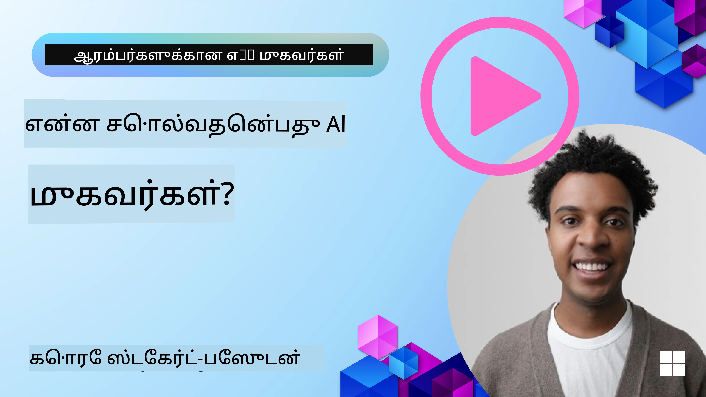
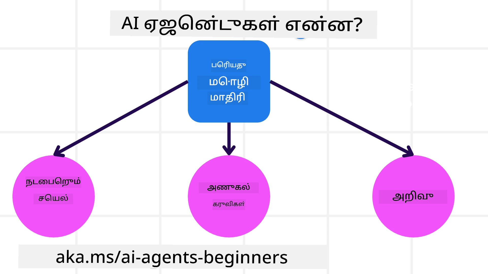
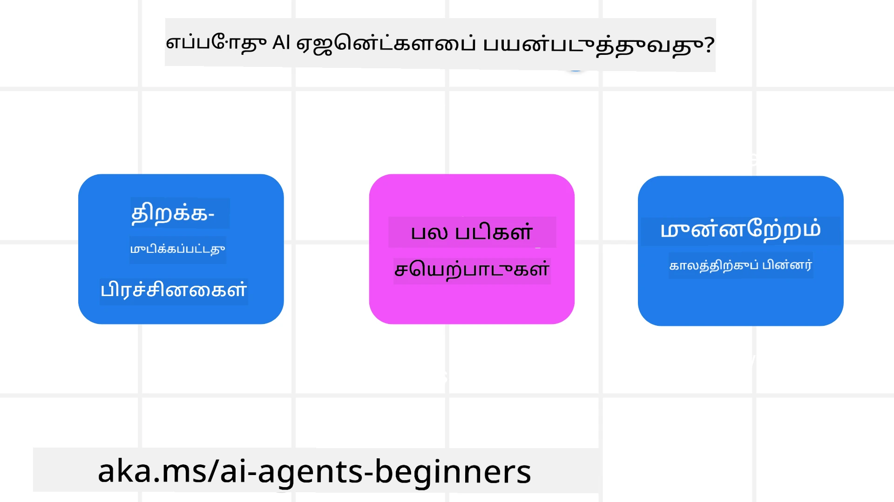

> _(இந்த பாடத்திற்கான வீடியோவைப் பார்க்க மேலுள்ள படத்தை கிளிக் செய்யவும்)_

# AI முகவர்கள் மற்றும் முகவர் பயன்பாட்டுகள் அறிமுகம்

**தொடக்கத்தினருக்கான AI முகவர்கள்** பாடத்துக்கு வரவேற்கிறோம்! இந்த கற்கைதிட்டம் உங்கள் தளப்பொருள் அறிவையும் — மற்றும் உண்மையான செயல்பாட்டு குறியீட்டையும் — வழங்குகிறது, இதன் மூலம் நீங்கள் AI முகவர்களை ஆரம்பத்திலிருந்து கட்டமைக்க தொடங்க முடியும்.

<a href="https://discord.gg/kzRShWzttr" target="_blank">Azure AI Discord சமூகத்தில்</a> வரவேற்கிறோம் — இது கற்றலாளர்கள் மற்றும் AI கட்டுமானிகளால் நிரம்பியுள்ளது, அவர்கள் கேள்விகளுக்கு மகிழ்மிகு பதில் அளிப்பர்.

உருவாக்கத் துள்ளுவதற்கு முன், நிஜமாகவே AI முகவர் *என்ன* என்பதையும், எப்போது அதைப் பயன்படுத்துவது உண்மையில் பொருந்தும் என்பதை உறுதி செய்யலாம்.

---

## அறிமுகம்

இந்த பாடம்:

- AI முகவர்கள் என்ன என்று, மற்றும் அதில் உள்ள வகைகள் என்னென்ன என்பதைக் கொண்டுள்ளது
- AI முகவர்கள் எந்தவகையான பணிகளை மிகவும் பொருத்தமாகச் செய்ய முடியும் என்பதை விளக்குகிறது
- ஒரு முகவர் தீர்வை வடிவமைக்கும் போது நீங்கள் பயன்படுத்தப்போகும் அடிப்படை மூலக்கட்டுகளைக் கூறுகிறது

## கற்றல் இலக்குகள்

இந்த பாடத்தின் முடிவில், நீங்கள்:

- AI முகவர் என்ன என்பது மற்றும் சாதாரண AI தீர்வு என்பதிலிருந்து எப்படி வேறுபடுகிறது என்பதைக் கூற இயலும்
- எப்போது AI முகவருக்காக அணுகுவது (மற்றும் எப்போது அல்ல) என்பதை தெரிந்துகொள்வீர்கள்
- ஒரு நிஜ உலகப் பிரச்சினைக்கான அடிப்படை முகவர் தீர்வு வடிவமைப்பை வரைபடம் செய்வீர்கள்

---

## AI முகவர்களை வரையறுத்தல் மற்றும் AI முகவர்களின் வகைகள்

### AI முகவர்கள் என்றால் என்ன?

இதைப் பற்றி சுருக்கமாகப் புரிந்துகொள்ள:

> **AI முகவர்கள் என்பது பெரிய மொழி மாதிரிகள் (LLMs) உண்மையில் *செயல்பட* உதவுகிற அமைப்புகள் — அவற்றுக்கு உலகுடன் செயல்பட கருவிகள் மற்றும் அறிவு கொடுக்கும், கேள்விகளுக்கு பதிலளிப்பதற்கு மட்டுமல்ல.**

இதை சிறிது தெளிவுபடுத்துவோம்:

- **அமைப்பு** — ஒரு AI முகவர் ஒரு விஷயமாக மட்டும் இல்லை. அது ஒன்றாக வேலை செய்யும் கூறுகளின் தொகுப்பு. அதன் மையத்தில், ஒவ்வொரு முகவரிலும் மூன்று பகுதிகள் உள்ளன:
  - **சூழல்** — முகவர் செயல்படும் இடம். ஒரு பயணத் தளம் முகவருக்கான சூழல் அதுதான்.
  - **சென்சார்கள்** — முகவர் தனது சூழலின் தற்போதைய நிலையை எவ்வாறு வாசிக்கிறான் என்பதைக் குறிப்பது. பயண முகவர் ஹோட்டல் கிடைக்கும் நிலை அல்லது விமானம் விலையில் பார்ப்பான்.
  - **செயலியக்கிகள்** — முகவர் செயல்படுகிற வழி. பயண முகவர் ஒரு அறையை பதிவு செய்தல், உறுதிப்பத்திரம் அனுப்புதல் அல்லது முன்பதிவு ரத்து செய்தல் ஆகியவற்றை செய்யலாம்.

- **பெரிய மொழி மாதிரிகள்** — முகவர்கள் LLM- கள் வந்ததற்கு முன்பு இருந்தாலும், LLM கள் நவீன முகவர்களை மிக வலுவாகவும் செய்கின்றன. அவை இயல்பான மொழியை புரிந்துகொள்கின்றன, சூழலை உணர்கின்றன, மற்றும் எளிய பயனர் கோரிக்கையை சரியான செயல்திட்டமாக மாற்றுகின்றன.

- **செயல்களை மேற்கொள்ளுதல்** — முகவர் அமைப்பின்றி, LLM வெறும் உரையை உருவாக்கும். முகவர் அமைப்புக்குள், LLM உண்மையில் *செயற்பட* முடியும் — தரவுத்தளம் தேடல், API அழைப்பு, செய்தி அனுப்பல்.

- **கருவிகளுக்கு அணுகல்** — முகவர் பயன்படுத்தும் கருவிகள் (1) அது இயங்கும் சூழல் மற்றும் (2) டெவலப்பர் எதை வழங்கினான் என்பதில் منحصر. ஒரு பயண முகவர் விமானங்களை தேட முடியும் ஆனால் வாடிக்கையாளர் பதிவுகளைத் திருத்த முடியாது — எல்லாம் நீங்கள் இணைக்கும் முறையில் தான்.

- **நினைவுத்திறன் + அறிவு** — முகவர்கள் குறுகியகால நினைவுத்திறன் (தற்போதைய உரையாடல்) மற்றும் நீண்டகால நினைவுத்திறன் (வாடிக்கையாளர் தரவுத்தளம், கடந்த தொடர்புகள்) இரண்டும் கொண்டிருக்க முடியும். பயண முகவர் நீங்கள் ஜன்னல் இருக்கையை விரும்புவீர்கள் என்பதைக் "சிறப்பாக நினைவில்" வைத்திருக்கலாம்.

---

### AI முகவர்களின் வகைகள்

எல்லா முகவர்களும் ஒரே மாதிரி இல்லை. பயண முகவர் எடுத்துக்காட்டு மூலம் முக்கிய வகைகளைப் பார்ப்போம்:

| **முகவர் வகை** | **என்ன செய்கிறது** | **பயண முகவர் எடுத்துக்காட்டு** |
|---|---|---|
| **எளிய பிரதிபலிப்பு முகவர்கள்** | கடுமையான விதிகளைக் பின்பற்றுகின்றனர் — நினைவாற்றல் இல்லை, திட்டமிடல் இல்லை. | புகார் மின்னஞ்சலைப் பார்க்கிறது → வாடிக்கையாளர் சேவைக்கு அனுப்புகிறது. அதுவே முடிவு. |
| **மாதிரியிலான பிரதிபலிப்பு முகவர்கள்** | உலகத்தின் உள்நிலையில் ஒரு மாதிரியை வைத்திருக்கும் மற்றும் அவ்வாறு மாறும் போது அதனை புதுப்பிக்கும். | கடந்த விமான விலையை கவனித்து, திடீரென அதிகமான பாதைகளைக் குறிக்கிறது. |
| **இலக்குக் கொண்ட முகவர்கள்** | ஒரு இலக்கை மனதில் வைத்து அதனை அடைந்தற்கான படிகளை ஒரு படியே கண்டுபிடிக்கும். | உங்கள் தற்போதைய இடத்திலிருந்து உங்கள் இலக்கிற்கு போய்ச் செல்ல முழு பயணத்தையும் (விமானம், கார், ஹோட்டல்) பதிவு செய்கிறது. |
| **உதவிச்செலவின் அடிப்படையிலான முகவர்கள்** | ஒரு *தீர்வை* மட்டுமல்ல — பரிமாற்றங்களை பரிசீலித்து சிறந்ததைக் கண்டுபிடிக்கும். | செலவு மற்றும் வசதியை சமநிலை செய்து, உங்கள் விருப்பங்களுக்கு உகந்த பயணத்தை தேடும். |
| **கற்றல் முகவர்கள்** | பின்னூட்டத்திலிருந்து கற்றுக்கொண்டு காலத்தோடு மேம்படும். | பயணத்திற்குப் பின் கருத்துக் கணக்கெடுப்பு முடிவுகளின் அடிப்படையில் எதிர்கால முன்பதிவினையிட்டு மாற்றம் செய்கிறது. |
| **வரிசைப்படுத்தப்பட்ட முகவர்கள்** | ஒரு உயர் நிலை முகவர் பணியை துணை பணிகளாக பிரித்து குறைந்த நிலை முகவர்களுக்கு ஒப்படைக்கும். | "பயணத்தை ரத்து செய்தல்" கோரிக்கை விமானம், ஹோட்டல், கார் வாடகை ஒவ்வொன்றாக ரத்து செய்வதாக பிரிக்கப்படுகிறது — ஒவ்வொன்றும் துணை முகவர் மூலம் கையாளப்படுகிறது. |
| **பல-முகவர் அமைப்புகள் (MAS)** | பல சுயாதீன முகவர்கள் ஒன்றாக (அல்லது போட்டியோடாக) பணியாற்றுகிறார். | ஒத்துழைப்பு: தனித்தனியே ஹோட்டல்கள், விமானங்கள், மற்றும் பொழுதுபோக்கு முகவர்கள் கையாள்கிறார்கள். போட்டி: பல முகவர்கள் சிறந்த விலையில் ஹோட்டல் அறைகளை நிரப்பும் போட்டியில் ஈடுபடுகிறார்கள். |

---

## AI முகவர்களை எப்போது பயன்படுத்த வேண்டும்

நீங்கள் *பயன்படுத்த முடியும்* என்றதால் எல்லாம் *பயன்படுத்தவேண்டும்* என்று அல்ல. முகவர்கள் மிகவும் பிரகாசிப்பதற்கான நிலைகள் இங்கே:

- **திறந்த முடிவுள்ள பிரச்சினைகள்** — பிரச்சினையைச் சரிசெய்ய படிகள் முன்கூட்டியே நிரலாக்க முடியாத போது. LLM வழியை உயிரோட்டமாக கண்டுபிடிக்க வேண்டும்.
- **பல படிகளில் செயல்பாடுகள்** — பல சுற்றுகளில் கருவிகளை பயன்படுத்த வேண்டிய பணிகள், வெறும் ஒரு தகவல் தேடல் அல்லது உருவாக்க்வு தவிர.
- **காலத்தோடு மேம்பாடு** — பயனர் பின்னூட்டம் அல்லது சூழல் சமிக்ஞைகளின் அடிப்படையில் அமைப்பு புத்திசாலி ஆகவேண்டுமானால்.

இந்த பாடத்தின்அடுத்த பிறகு **நம்பகமான AI முகவர்கள் கட்டமைத்தல்** பாடத்தில் எப்போது (மற்றும் எப்போது *இல்ல*) AI முகவர்களை பயன்படுத்த வேண்டும் என்பதைக் விரிவாகப் பார்க்கப்போுகிறோம்.

---

## முகவர் தீர்வுகளின் அடிப்படைகள்

### முகவர் மேம்பாடு

ஒரு முகவரைக் கட்டும்போது முதலில் நீங்கள் செய்வது *அவன் என்ன செய்ய முடியும்* என்பதைக் குறிப்பிடுவது — அவனுடைய கருவிகள், செயல்கள் மற்றும் நடத்தை.

இந்த பாடத்தில், நாம் **Microsoft Foundry Agent Service** ஐ முக்கிய தளமாக பயன்படுத்துகிறோம். இது ஆதரிக்கிறது:

- OpenAI, Mistral, மற்றும் Meta (Llama) போன்ற வழங்குநர்களின் மாதிரிகள்
- Tripadvisor போன்ற வழங்குநர்களிடமிருந்து உரிமம் பெற்ற தரவு
- ஒப்பனைபடுத்தப்பட்ட OpenAPI 3.0 கருவि வரைவுகள்

### முகவர் மாதிரிகள்

நீங்கள் LLM களை வழிகாட்டல்களால் தொடர்பு கொள்கிறீர்கள். முகவர்களுடன், ஒவ்வொரு வழிகாட்டலையும் கைமுறை தயார் செய்வது சாத்தியமில்லை — முகவர் பல படிகளைக் கடந்து செயல்பட வேண்டும். அங்கே **முகவர் மாதிரிகள்** உதவும். அவை LLM களை ஒரு அளவிலான, நம்பகமான முறையில் வழிநடத்தும் மீண்டும் பயன்படுத்தக்கூடிய நடைமுறைகள்.

இந்தக் கடமை மிகவும் பொதுவான மற்றும் பயனுள்ள முகவர் மாதிரிகளின் அடிப்படையில் அமைக்கப்பட்டுள்ளது.

### முகவர் கட்டமைப்புகள்

முகவர் கட்டமைப்புகள் டெவலப்பர்களுக்கு முன்தயாரான டெம்ப்ளேட்கள், கருவிகள் மற்றும் அடித்தளங்கள் கொடுக்கும். இதனால்:

- கருவிகள் மற்றும் திறன்களை இணைக்க
- முகவர் என்ன செய்கிறதென்று கவனிக்க (பிழை சரிசெய்யும் போது)
- பல முகவர்களுடன் இணைந்து பணியாற்ற

இந்த பாடத்தில், நாம் **Microsoft Agent Framework (MAF)** ஐ உற்பத்திக்கு தயாரான முகவர்களை கட்டுவதற்கு கவனம் செலுத்துகிறோம்.

---

## குறியீடு எடுத்துக்காடுகள்

இதை செயல்பாட்டில் காண தயாரா? இந்த பாடத்திற்கான குறியீடு எடுத்துக்காடுகள் இவை:

- 🐍 Python: [Agent Framework](./code_samples/01-python-agent-framework.ipynb)
- 🔷 .NET: [Agent Framework](./code_samples/01-dotnet-agent-framework.md)

---

## கேள்விகள் உள்ளதா?

மற்ற கற்றலாளர்களுடன் இணைய, அலுவலக நேரங்களில் கலந்துகொள், மற்றும் உங்கள் AI முகவர் கேள்விகளுக்கு சமூகத்தால் பதில்கள் பெற [Microsoft Foundry Discord](https://discord.com/invite/ATgtXmAS5D) இல் சேரவும்.

---

## முன் பாடம்

[பாட திட்ட அமைப்பு](../00-course-setup/README.md)

## அடுத்த பாடம்

[Agentic கட்டமைப்புகளை ஆராய்தல்](../02-explore-agentic-frameworks/README.md)

---

<!-- CO-OP TRANSLATOR DISCLAIMER START -->
**மறுப்பு**:
இந்த ஆவணம் AI மொழிபெயர்ப்பு சேவை [Co-op Translator](https://github.com/Azure/co-op-translator) பயன்படுத்தி மொழிபெயர்க்கப்பட்டுள்ளது. நாங்கள் துல்லியத்திற்காக முயற்சி செய்துள்ளோம், ஆனால் தானாக செய்யப்படும் மொழிபெயர்ப்புகளில் பிழைகள் அல்லது தவறுகள் இருக்கலாம் என்பதை கவனத்தில் கொள்ளவும். அசல் ஆவணம் அதன் தாய்மொழியில் அதிகாரப்பூர்வ ஆதாரமாக கருதப்பட வேண்டும். முக்கியமான தகவல்களுக்கு, தொழில்நுட்பமான மனித மொழிபெயர்ப்பு பரிந்துரைக்கப்படுகிறது. இந்த மொழிபெயர்ப்பைப் பயன்படுத்துவதால் ஏற்படும் எந்த தவறான புரிதல்கள் அல்லது தவறான விளக்கத்திற்கும் நாங்கள் பொறுப்பில்வில்லை.
<!-- CO-OP TRANSLATOR DISCLAIMER END -->