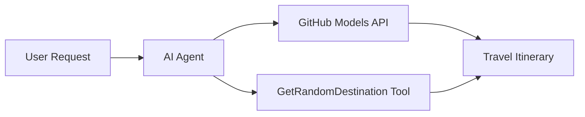

# 🌍 Microsoft Agent Framework (.NET) மூலம் AI பயண முகவர்

## 📋 சூழல் கண்ணோட்டம்

இந்த நோட்புக் Microsoft Agent Framework for .NET பயன்படுத்தி புத்திசாலி பயண திட்டமிடும் முகவரை உருவாக்குவது எப்படி என்பதை விளக்குகிறது. இந்த முகவர் உலகம் முழுவதும் சீரற்ற இடங்களில் தனிப்பயன் நாள் பயண திட்டங்களை தானாக உருவாக்க முடியும்.

**முக்கிய திறன்கள்:**
- 🎲 **சீரற்ற இடத் தேர்வு**: விடுமுறை இடங்களை தேர்வு செய்ய தனிப்பயன் கருவியைப் பயன்படுத்துகிறது
- 🗺️ **புத்திசாலி பயண திட்டமிடல்**: விரிவான நாள்-தோறும் திட்டங்களை உருவாக்குகிறது
- 🔄 **உடனடி ஸ்ட்ரீமிங்**: உடனடி மற்றும் ஸ்ட்ரீமிங் பதில்களை ஆதரிக்கிறது
- 🛠️ **தனிப்பயன் கருவி ஒருங்கிணைப்பு**: முகவர் திறன்களை விரிவாக்குவது எப்படி என்பதை விளக்குகிறது

## 🔧 தொழில்நுட்ப கட்டமைப்பு

### முக்கிய தொழில்நுட்பங்கள்
- **Microsoft Agent Framework**: AI முகவர் மேம்பாட்டிற்கான .NET இன் சமீபத்திய செயல்பாடு
- **GitHub Models Integration**: GitHub இன் AI மாடல் தீர்மான சேவையைப் பயன்படுத்துகிறது
- **OpenAI API இணக்கத்தன்மை**: தனிப்பயன் முடிவுகளுடன் OpenAI கிளையன்ட் நூலகங்களைப் பயன்படுத்துகிறது
- **பாதுகாப்பான கட்டமைப்பு**: சூழல் அடிப்படையிலான API விசை மேலாண்மை

### முக்கிய கூறுகள்
1. **AIAgent**: உரையாடல் ஓட்டத்தை கையாளும் முக்கிய முகவர் ஒருங்கிணைப்பாளர்
2. **தனிப்பயன் கருவிகள்**: `GetRandomDestination()` செயல்பாடு முகவருக்கு கிடைக்கிறது
3. **Chat Client**: GitHub Models ஆதரவு கொண்ட உரையாடல் இடைமுகம்
4. **ஸ்ட்ரீமிங் ஆதரவு**: நேரடி பதில் உருவாக்கும் திறன்கள்

### ஒருங்கிணைப்பு முறை


## 🚀 தொடங்குவது எப்படி

**முன்னோட்டங்கள்:**
- .NET 9.0 அல்லது அதற்கு மேல்
- GitHub Models API அணுகல் டோக்கன்
- `.env` கோப்பில் சூழல் மாறிகள் அமைக்கப்பட்டுள்ளன

**தேவையான சூழல் மாறிகள்:**
```env
GITHUB_TOKEN=your_github_token
GITHUB_ENDPOINT=https://models.inference.ai.azure.com
GITHUB_MODEL_ID=gpt-4o-mini
```

கீழே உள்ள செறிவுகளை வரிசையாக இயக்கி பயண முகவரின் செயல்பாட்டை பாருங்கள்!

---

## .NET Single File App: AI Travel Agent Example

See `01-dotnet-agent-framework.cs` for the complete runnable code sample.

கீழே உள்ள குறியீடு மாதிரியை இயக்கவும்:

```bash
dotnet run 01-dotnet-agent-framework.cs
```

### Sample Code

```csharp
static string GetRandomDestination()
{
    var destinations = new List<string>
    {
        "Paris, France",
        "Tokyo, Japan",
        "New York City, USA",
        "Sydney, Australia",
        "Rome, Italy",
        "Barcelona, Spain",
        "Cape Town, South Africa",
        "Rio de Janeiro, Brazil",
        "Bangkok, Thailand",
        "Vancouver, Canada"
    };
    var random = new Random();
    int index = random.Next(destinations.Count);
    return destinations[index];
}

// Extract configuration from environment variables
var github_endpoint = Environment.GetEnvironmentVariable("GITHUB_ENDPOINT") ?? throw new InvalidOperationException("GITHUB_ENDPOINT is not set.");
var github_model_id = Environment.GetEnvironmentVariable("GITHUB_MODEL_ID") ?? "gpt-4o-mini";
var github_token = Environment.GetEnvironmentVariable("GITHUB_TOKEN") ?? throw new InvalidOperationException("GITHUB_TOKEN is not set.");

// Configure OpenAI Client Options
var openAIOptions = new OpenAIClientOptions()
{
    Endpoint = new Uri(github_endpoint)
};

// Initialize OpenAI Client with GitHub Models Configuration
var openAIClient = new OpenAIClient(new ApiKeyCredential(github_token), openAIOptions);

// Create AI Agent with Travel Planning Capabilities
AIAgent agent = openAIClient
    .GetChatClient(github_model_id)
    .CreateAIAgent(
        instructions: "You are a helpful AI Agent that can help plan vacations for customers at random destinations",
        tools: [AIFunctionFactory.Create(GetRandomDestination)]
    );

// Execute Agent: Plan a Day Trip (Non-Streaming)
Console.WriteLine(await agent.RunAsync("Plan me a day trip"));

// Execute Agent: Plan a Day Trip (Streaming Response)
await foreach (var update in agent.RunStreamingAsync("Plan me a day trip"))
{
    Console.Write(update);
}
```
