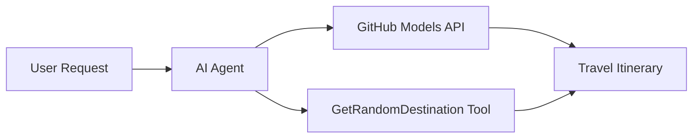

<!--
CO_OP_TRANSLATOR_METADATA:
{
  "original_hash": "23afd9be7b6ba5b69a44c3b6a78e07f6",
  "translation_date": "2025-11-06T10:07:43+00:00",
  "source_file": "01-intro-to-ai-agents/code_samples/01-dotnet-agent-framework.md",
  "language_code": "ta"
}
-->
# 🌍 Microsoft Agent Framework (.NET) மூலம் AI பயண முகவர்

## 📋 சூழல் கண்ணோட்டம்

இந்த நோட்புக் ஒரு புத்திசாலி பயண திட்டமிடும் முகவரை Microsoft Agent Framework for .NET மூலம் உருவாக்குவது எப்படி என்பதை விளக்குகிறது. இந்த முகவர் உலகம் முழுவதும் உள்ள இடங்களுக்கு தனிப்பயன் தினசரி பயண திட்டங்களை தானாக உருவாக்க முடியும்.

**முக்கிய திறன்கள்:**
- 🎲 **சீரற்ற இடத் தேர்வு**: விடுமுறை இடங்களை தேர்வு செய்ய தனிப்பயன் கருவியைப் பயன்படுத்துகிறது
- 🗺️ **புத்திசாலி பயண திட்டமிடல்**: விரிவான தினசரி திட்டங்களை உருவாக்குகிறது
- 🔄 **உடனடி ஸ்ட்ரீமிங்**: உடனடி மற்றும் ஸ்ட்ரீமிங் பதில்களை ஆதரிக்கிறது
- 🛠️ **தனிப்பயன் கருவி ஒருங்கிணைப்பு**: முகவரின் திறன்களை விரிவாக்குவது எப்படி என்பதை விளக்குகிறது

## 🔧 தொழில்நுட்ப கட்டமைப்பு

### முக்கிய தொழில்நுட்பங்கள்
- **Microsoft Agent Framework**: AI முகவர் மேம்பாட்டுக்கான .NET இன் சமீபத்திய செயல்பாடு
- **GitHub Models Integration**: GitHub இன் AI மாடல் தீர்மான சேவையைப் பயன்படுத்துகிறது
- **OpenAI API இணக்கத்தன்மை**: தனிப்பயன் முடிவுகளுடன் OpenAI கிளையன்ட் நூலகங்களைப் பயன்படுத்துகிறது
- **பாதுகாப்பான கட்டமைப்பு**: சூழல் அடிப்படையிலான API விசை மேலாண்மை

### முக்கிய கூறுகள்
1. **AIAgent**: உரையாடல் ஓட்டத்தை கையாளும் முக்கிய முகவர் ஒருங்கிணைப்பாளர்
2. **தனிப்பயன் கருவிகள்**: `GetRandomDestination()` செயல்பாடு முகவருக்கு கிடைக்கிறது
3. **Chat Client**: GitHub Models ஆதரவு கொண்ட உரையாடல் இடைமுகம்
4. **ஸ்ட்ரீமிங் ஆதரவு**: நேரடி பதில் உருவாக்கும் திறன்கள்

### ஒருங்கிணைப்பு முறை


## 🚀 தொடங்குவது எப்படி

**முன்னோட்ட தேவைகள்:**
- .NET 10.0 அல்லது அதற்கு மேல்
- GitHub Models API அணுகல் டோக்கன்
- `.env` கோப்பில் சூழல் மாறிகள் அமைக்கப்பட்டுள்ளன

**தேவையான சூழல் மாறிகள்:**
```env
GITHUB_TOKEN=your_github_token
GITHUB_ENDPOINT=https://models.inference.ai.azure.com
GITHUB_MODEL_ID=gpt-4o-mini
```

கீழே உள்ள குறியீட்டு மாதிரியை வரிசையாக இயக்கி பயண முகவரின் செயல்பாட்டை பாருங்கள்!

---

## .NET ஒற்றை கோப்பு பயன்பாடு: AI பயண முகவர் எடுத்துக்காட்டு

முழு இயக்கக்கூடிய குறியீட்டு மாதிரிக்கான `01-dotnet-agent-framework.cs` ஐப் பார்க்கவும்.

```bash
dotnet run 01-dotnet-agent-framework.cs
```

### மாதிரி குறியீடு

```csharp
static string GetRandomDestination()
{
    var destinations = new List<string>
    {
        "Paris, France",
        "Tokyo, Japan",
        "New York City, USA",
        "Sydney, Australia",
        "Rome, Italy",
        "Barcelona, Spain",
        "Cape Town, South Africa",
        "Rio de Janeiro, Brazil",
        "Bangkok, Thailand",
        "Vancouver, Canada"
    };
    var random = new Random();
    int index = random.Next(destinations.Count);
    return destinations[index];
}

// Extract configuration from environment variables
var github_endpoint = Environment.GetEnvironmentVariable("GITHUB_ENDPOINT") ?? throw new InvalidOperationException("GITHUB_ENDPOINT is not set.");
var github_model_id = Environment.GetEnvironmentVariable("GITHUB_MODEL_ID") ?? "gpt-4o-mini";
var github_token = Environment.GetEnvironmentVariable("GITHUB_TOKEN") ?? throw new InvalidOperationException("GITHUB_TOKEN is not set.");

// Configure OpenAI Client Options
var openAIOptions = new OpenAIClientOptions()
{
    Endpoint = new Uri(github_endpoint)
};

// Initialize OpenAI Client with GitHub Models Configuration
var openAIClient = new OpenAIClient(new ApiKeyCredential(github_token), openAIOptions);

// Create AI Agent with Travel Planning Capabilities
AIAgent agent = openAIClient
    .GetChatClient(github_model_id)
    .CreateAIAgent(
        instructions: "You are a helpful AI Agent that can help plan vacations for customers at random destinations",
        tools: [AIFunctionFactory.Create(GetRandomDestination)]
    );

// Execute Agent: Plan a Day Trip (Non-Streaming)
Console.WriteLine(await agent.RunAsync("Plan me a day trip"));

// Execute Agent: Plan a Day Trip (Streaming Response)
await foreach (var update in agent.RunStreamingAsync("Plan me a day trip"))
{
    Console.Write(update);
}
```

---

**குறிப்பு**:  
இந்த ஆவணம் AI மொழிபெயர்ப்பு சேவை [Co-op Translator](https://github.com/Azure/co-op-translator) பயன்படுத்தி மொழிபெயர்க்கப்பட்டுள்ளது. நாங்கள் துல்லியத்திற்காக முயற்சிக்கிறோம், ஆனால் தானியங்கி மொழிபெயர்ப்புகளில் பிழைகள் அல்லது தவறுகள் இருக்கக்கூடும் என்பதை கவனத்தில் கொள்ளவும். அதன் தாய்மொழியில் உள்ள அசல் ஆவணம் அதிகாரப்பூர்வ ஆதாரமாக கருதப்பட வேண்டும். முக்கியமான தகவல்களுக்கு, தொழில்முறை மனித மொழிபெயர்ப்பு பரிந்துரைக்கப்படுகிறது. இந்த மொழிபெயர்ப்பைப் பயன்படுத்துவதால் ஏற்படும் எந்த தவறான புரிதல்கள் அல்லது தவறான விளக்கங்களுக்கு நாங்கள் பொறுப்பல்ல.