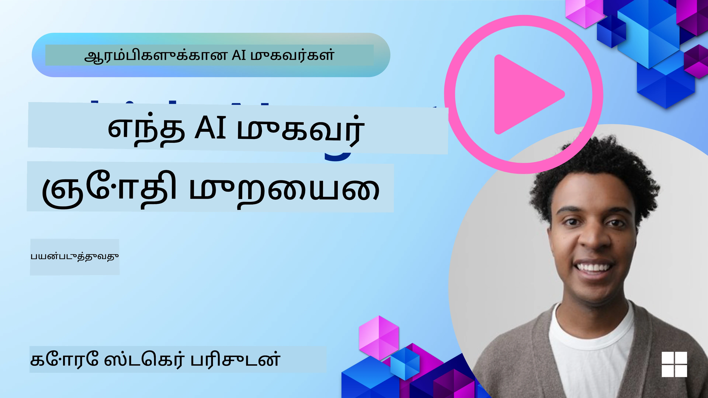

[](https://youtu.be/ODwF-EZo_O8?si=1xoy_B9RNQfrYdF7)

> _(இந்த பாடத்தின் வீடியோவை பார்க்க மேல் உள்ள படத்தை தட்டவும்)_

# AI ஏஜென்ட் கட்டமைப்புகளை ஆராய்வு

AI ஏஜென்ட் கட்டமைப்புகள் என்பது AI ஏஜென்டுகளை உருவாக்க, பிரசாரிக்க மற்றும் மேலாண்மை செய்ய எளிதாக்குவதற்காக வடிவமைக்கப்பட்ட மென்பொருள் தளங்களாகும். இந்த கட்டமைப்புகள் அபிவிருத்தியாளர்களுக்கு முன்-பொருத்தப்பட்ட கூறுகள், abstraction-கள் மற்றும் கருவிகளை வழங்கி, சிக்கலான AI அமைப்புகளை உருவாக்குவதைக் குறைந்த முயற்சியுடன் செய்து கொள்கின்றன.

இந்த கட்டமைப்புகள் சாதாரண சவால்களுக்கு தரமான அணுகுமுறைகளை வழங்குவதன் மூலம் அபிவிருத்தியாளர்கள் தங்கள் செயலிகளின் தனித்துவமான அம்சங்களில் கவனம் செலுத்த உதவுகின்றன. அவை AI அமைப்புகளை கட்டமைப்பதில் அளவீடு, அணுக்திறன் மற்றும் திறமையை மேம்படுத்துகின்றன.

## அறிமுகம்

இந்த பாடத்தில் பின்வற்றவை கवर செய்யப்படும்:

- AI ஏஜென்ட் கட்டமைப்புகள் என்னவென்று, அவைகள் அபிவிருத்தியாளர்களுக்கு என்னச் செய்ய முடிய வைக்கின்றன?
- எந்த வகையில் குழுக்கள் இவற்றை பயன்படுத்தி விரைவாக prototype, iteration மற்றும் ஏஜெண்டின் திறன்களை மேம்படுத்த முடியும்?
- Microsoft (<a href="https://aka.ms/ai-agents-beginners/ai-agent-service" target="_blank">Azure AI Agent சேவை</a> மற்றும் <a href="https://learn.microsoft.com/azure/ai-services/openai/how-to/responses" target="_blank">Microsoft Agent Framework</a>) உருவாக்கிய கட்டமைப்புகள் மற்றும் கருவிகளுக்கு இடையில் என்ன வேறுபாடுகள் உள்ளன?
- நான் எனது இருக்கும் Azure சூழல்பட்டு கருவிகளை நேரடியாக இணைக்க முடியுமா, அல்லது தனிநிலை தீர்வுகள் தேவைபடுமா?
- Azure AI Agents சேவை என்ன மற்றும் இது என்னபடி உதவி செய்கிறது?

## கற்றல் குறிக்கோள்

இந்த பாடத்தின் குறிக்கோள்கள் உங்களுக்கு உதவ உள்ளன:

- AI அபிவிருத்தியில் AI ஏஜென்ட் கட்டமைப்புகளின் பங்கு என்னவென்பதை புரிந்துகொள்ள.
- புத்திசாலி ஏஜென்டுகளை கட்டமைக்க AI ஏஜென்ட் கட்டமைப்புகளை எப்படி பயன்படுத்துவது.
- AI ஏஜென்ட் கட்டமைப்புகள் மூலம் கிடைக்கும் முக்கிய திறன்கள்.
- Microsoft Agent Framework மற்றும் Azure AI Agent Service இடையிலான வேறுபாடுகள்.

## AI ஏஜென்ட் கட்டமைப்புகள் என்னவென்று, அவை அபிவிருத்தியாளர்களுக்கு என்ன செய்யச் செய்ய உதவுகின்றன?

பாரம்பரிய AI கட்டமைப்புகள் உங்கள் செயலிகளில் AI ஐ இணைக்க மற்றும் அவற்றை மேம்படுத்த பின்வரும் வழிகளில் உதவலாம்:

- **தனிப்பயனாக்கம்**: AI பயனாளர் நடத்தை மற்றும் விருப்பங்களை பகுப்பாய்வு செய்து தனிப்பட்ட பரிந்துரைகள், உள்ளடக்கம் மற்றும் அனுபவங்களை வழங்க முடியும்.
  உதாரணம்: Netflix போன்ற ஸ்ட்ரீமிங் சேவைகள் நோக்க காட்சித் tarixத்தை அடிப்படையாக கொண்டு படங்கள் மற்றும் தொடர்கள் பரிந்துரைக்கும், இது பயனர் ஈடுபாட்டு மற்றும் திருப்தியை அதிகரிக்கிறது.
- **தானியக்கமும் செயல்திறனும்**: AI முடிக்கக்கூடிய மீண்டும் மறு செயல்கள் தானாக செய்யப்பட, பணி ஓட்டைகளை முறைப்படுத்த, மற்றும் செயல்பாட்டு திறனை மேம்படுத்த உதவிறது.
  உதாரணம்: வாடிக்கையாளர் சேவை செயலிகள் பொதுவான கேள்விகளை கையாளுவதற்கு AI இயக்கப்படும் chatbot-களைப் பயன்படுத்துகின்றன, பதில் நேரத்தை குறைத்தலும் மனித முகவர்களை சிக்கலான விஷயங்களுக்கு விடுவிப்பதும்.
- **பயனர் அனுபவத்தை மேம்படுத்துதல்**: குரல் அடையாளம், இயற்கை மொழி கையாளுதல், முன்னறிவிப்பு உரை போன்ற புத்திசாலி அம்சங்களை வழங்குவதன் மூலம் மொத்த பயனர் அனுபவத்தை மேம்படுத்தலாம்.
  உதாரணம்: Siri மற்றும் Google Assistant போன்ற மெய்யியல் உதவியாளர்கள் குரல் கட்டளைகளை புரிந்து பதிலளிக்க AI ஐப் பயன்படுத்தி, சாதனங்களோடு தொடர்பு கொள்ள எளிதாக்குகின்றன.

### இவை அருமையாகத் தோன்றுகின்றன, எனவே AI ஏஜென்ட் கட்டமைப்புகள் ஏன் தேவை?

AI ஏஜெண்ட் கட்டமைப்புகள் சாதாரண AI கட்டமைப்புகளுக்கு மேலாக மேலும் பல திறன்களை வழங்கும் வகையில் வடிவமைக்கப்பட்டுள்ளன. அவை பயனர்களுடனும், பிற ஏஜென்ட்களுடனும், சூழலோடான தொடர்பு கொண்டு குறிப்பிட்ட நோக்கங்களை அடைய அதிகாரம் பெற்ற புத்திசாலி ஏஜெண்டுகளை உருவாக்க உதவுகின்றன. இவை தன்னிச்சையான நடத்தை காட்சி அளிக்க, முடிவுகளை எடுக்க மற்றும் மாறும் சூழலுக்கு ஏற்ப தானாக தகுந்தகொள்கின்றன. AI ஏஜெண்ட் கட்டமைப்புகள் மூலம் கிடைக்கும் சில முக்கிய திறன்களை பார்ப்போம்:

- **ஏஜென்ட் ஒத்துழைப்பு மற்றும் ஒருங்கிணைப்பு**: பல AI ஏஜெண்ட்களை ஒன்றாக இணைத்து, தொடர்பு கொண்டு, ஒருங்கிணைந்து சிக்கலான பணிகளை தீர்க்க உதவுகிறது.
- **பணி தானியக்கமும் மேலாண்மையும்**: பல படி வேலைப்பாடுகளை தானாகச் செய்தல், பணிகளை ஒதுக்கீடு செய்தல் மற்றும் ஏஜெண்ட்களுக்கு இடையில் இயக்ககக் கண்காணிப்புகளை வழங்கும் முறைகளை அரைபடுத்துகிறது.
- **சூழ்நிலை சார்ந்த புரிதலும் ஏற்றமைவும**: ஏஜெண்ட்களுக்கு சூழலைப் புரிந்து கொள்ளும் திறனை, மாறுபடும் சூழலுக்கு ஏற்ப தகுந்த முறையில் செயல்பட உதவும் திறன்களை வழங்குகிறது.

சுருக்கமாகச் சொன்னால், ஏஜெண்ட்கள் உங்கள் செயல்திறனில் மேலும் வளர்ச்சி செய்யலாம்; தானியக்கத்தை அடுத்த நிலைக்கே கொண்டு செல்ல முடியும்; சூழலிடம் இருந்து கற்றுக் கொண்டு தக்கமாறுபாடுகளை ஏற்று மிகவும் புத்திசாலியான அமைப்புகளை உருவாக்க முடியும்.

## ஏஜெண்டின் திறன்களை விரைவாக prototype செய்ய, iteration செய்ய மற்றும் மேம்படுத்த எப்படி?

இது விரைவாக மாறும் துறைவாய்ப்பு, இருப்பினும் பெரும்பாலான AI ஏஜெண்ட் கட்டமைப்புகளில் சில பொதுவான அம்சங்கள் உள்ளன, அவை module கூறுகள், ஒத்துழைப்புக் கருவிகள் மற்றும் நேரடி கற்றல் போன்றவை. இவற்றை பார்க்கலாம்:

- **மொஜுலார் கூறுகளைப் பயன்படுத்தவும்**: AI SDK-கள் AI மற்றும் நினைவகம் (Memory) இணைப்புகள், function calling (இயங்கு அழைப்பு) இயல்புகள் அல்லது குறியீடு plugin-கள், prompt templates மற்றும் மேலும் பல நான்கொன்று முன்பே தயாரிக்கப்பட்ட கூறுகளை வழங்குகின்றன.
- **ஒத்துழைப்பு கருவிகளைக் கையாளவும்**: குறிப்பிட்ட பங்கு மற்றும் பணிகளுடன் ஏஜெண்டுகளை வடிவமைத்து, ஒத்துழைப்பு வேலைநடவடிக்கைகளை சோதித்து மேம்படுத்தலாம்.
- **நேரடி கற்றல்**: ஏஜெண்ட்கள் தொடர்புகளிலிருந்து கற்றுக்கொண்டு தங்களின் நடத்தை தானாகத் திருத்திக் கொள்ளும் feedback loop-களை அமல்படுத்துங்கள்.

இவை குறித்து விரிவாகப் பார்க்கலாம்:

### மொஜுலார் கூறுகளைப் பயன்படுத்தவும்

Microsoft Agent Framework போன்ற SDK-கள் AI இணைப்பாளர்கள், கருவி வரையறைகள், மற்றும் ஏஜெண்ட் மேலாண்மை போன்ற முன்பே உருவாக்கப்பட்ட கூறுகளை வழங்குகின்றன.

**குழுக்கள் இதை எப்படி பயன்படுத்தலாம்**: குழுக்கள் இந்த கூறுகளைத் тезமாக சேர்ந்துகொண்டு முறையாக prototype ஒன்றை உருவாக்கி, பூமியில் தொடங்காமல் வெகு விரைவில் சோதனை மற்றும் iteration செய்துகொள்ளலாம்.

**நடவடிக்கையில் இது எப்படி செயல்படுகிறது**: பயனர் உள்ளீட்டில் இருந்து தகவலைப் பெற ஒரு முன்-உருவாக்கப்பட்ட பார்(பார்சர்) பயன்படுத்தலாம், தரவை சேமித்து மீண்டும் பெற நினைவு (memory) மொட்யூலை பயன்படுத்தலாம், மற்றும் பயனர்களுடன் தொடர்பு கொள்ள prompt generator-ஐப் பயன்படுத்தலாம் — இவை அனைத்தும் தானாகத் தொடக்கமாகத் தொடங்க வேண்டியதில்லை.

**எடுத்துக்காட்டு குறியீடு**. `AzureAIProjectAgentProvider` உடன் Microsoft Agent Framework பயன்படுத்தி மாதிரி பயனர் உள்ளீட்டுக்கு tool calling மூலம் எவ்வாறு பதிலளிக்க வைக்கலாம் என்று கீழே பார்க்கலாம்:

``` python
# மைக்ரோசாஃப்ட் எஜென்ட் கட்டமைப்பு பைதான் உதாரணம்

import asyncio
import os
from typing import Annotated

from agent_framework.azure import AzureAIProjectAgentProvider
from azure.identity import AzureCliCredential


# பயணத்தை பதிவு செய்ய ஒரு மாதிரித் கருவி செயல்பாடை வரையறுக்கவும்
def book_flight(date: str, location: str) -> str:
    """Book travel given location and date."""
    return f"Travel was booked to {location} on {date}"


async def main():
    provider = AzureAIProjectAgentProvider(credential=AzureCliCredential())
    agent = await provider.create_agent(
        name="travel_agent",
        instructions="Help the user book travel. Use the book_flight tool when ready.",
        tools=[book_flight],
    )

    response = await agent.run("I'd like to go to New York on January 1, 2025")
    print(response)
    # எடுத்துக்காட்டு வெளியீடு: 2025 ஜனவரி 1 ஆம் தேதி நியூயார்க்குக்கு உங்கள் விமானம் வெற்றிகரமாக பதிவு செய்யப்பட்டுள்ளது. பாதுகாப்பாக பயணம் செய்யுங்கள்! ✈️🗽


if __name__ == "__main__":
    asyncio.run(main())
```

இந்த எடுத்துக்காட்டிலிருந்து நீங்கள் ஏற்கனவே உருவாக்கப்பட்ட parser-ஐ பயன்படுத்தி பயனர் உள்ளீட்டிலிருந்து உதாரணமாக origin, destination மற்றும் தேதியை போன்ற முக்கிய தகவல்களை எடுப்பதைப் பார்க்கலாம். இந்த மொஜுலார் அணுகுமுறை உங்களுக்கு உயர்மட்ட தர்க்கத்தில் கவனம் செலுத்த உதவுகிறது.

### ஒத்துழைப்பு கருவிகளைப் பயன்படுத்தல்வே

Microsoft Agent Framework போன்ற கட்டமைப்புகள் ஒன்றுக்கு மேற்பட்ட ஏஜெண்ட்களை உருவாக்கி அவை ஒன்றாக வேலைசெய்ய உதவுகின்றன.

**குழுக்கள் இதை எப்படி பயன்படுத்தலாம்**: குழுக்கள் குறிப்பிட்ட பங்கை மற்றும் பணிகளை கொண்ட ஏஜெண்டுகளை வடிவமைத்து, ஒத்துழைப்புக் வேலைநடவடிக்கைகளை சோதிக்கவும் நுட்பப்படுத்தவும் இதில் உதவ முடியும்.

**நடவடிக்கையில் இது எப்படி செயல்படுகிறது**: தரவு மீட்பு, பகுப்பாய்வு அல்லது முடிவெடுக்கும் போன்ற நுணுக்கப் பணிகளை ஒவ்வொரு ஏஜெண்டும் சிறப்பு முறையில் செய்யும்படி ஒரு ஏஜெண்ட் குழுவை உருவாக்கலாம். இந்த ஏஜெண்ட்கள் தகவலைப் பகிர்ந்து பொதுவான இலக்கை அடைந்துகொள்ள ஒருங்கிணைந்து செயல்படலாம், உதாரணமாக பயனர் வினாவிற்கு பதிலளித்தல் அல்லது ஒரு பணி முடித்தல்.

**எடுத்துக்காட்டு குறியீடு (Microsoft Agent Framework)**:

```python
# மைக்ரோசாஃப்ட் ஏஜன்ட் கட்டமைப்பை பயன்படுத்தி ஒரே நேரத்தில் பல ஏஜன்ட்கள் ஒன்றாக செயல்படுத்தப்படுகிறது

import os
from agent_framework.azure import AzureAIProjectAgentProvider
from azure.identity import AzureCliCredential

provider = AzureAIProjectAgentProvider(credential=AzureCliCredential())

# தரவுகள் மீட்டெடுக்கும் ஏஜன்ட்
agent_retrieve = await provider.create_agent(
    name="dataretrieval",
    instructions="Retrieve relevant data using available tools.",
    tools=[retrieve_tool],
)

# தரவு பகுப்பாய்வு ஏஜன்ட்
agent_analyze = await provider.create_agent(
    name="dataanalysis",
    instructions="Analyze the retrieved data and provide insights.",
    tools=[analyze_tool],
)

# ஒரு பணியில் ஏஜன்ட்களை வரிசைப்படுத்தி இயக்கு
retrieval_result = await agent_retrieve.run("Retrieve sales data for Q4")
analysis_result = await agent_analyze.run(f"Analyze this data: {retrieval_result}")
print(analysis_result)
```

மேலே உள்ள குறியீட்டில் நீங்கள் ஒரு பணியை பல ஏஜெண்ட்கள் ஒரობლோ வேலை செய்து தரவைக் பகுப்பாய்வு செய்வதற்கு எப்படி அமைக்கலாம் என்பதை பார்கிறீர்கள். ஒவ்வொரு ஏஜெண்டும் ஒரு குறிப்பிட்ட பொறுப்பு வைபாக செய்கிறது, மற்றும் தேவையான முடிவை அடைய ஏஜெண்ட்களை ஒருங்கிணைத்து பணி நிறைவேற்றப்படுகிறது. சிறப்புப் பணிகளுடன் அர்ப்பணிக்கப்பட்ட ஏஜெண்ட்களை உருவாக்குவதன் மூலம் பணி திறன் மற்றும் செயல்பாடு மேம்படும்.

### நேரடி கற்றல்

முன்னேற்றமான கட்டமைப்புகள் நேரடி சூழ்நிலை புரிதல் மற்றும் ஏற்றமைவுக்கான திறன்களை வழங்குகின்றன.

**குழுக்கள் இதை எப்படி பயன்படுத்தலாம்**: குழுக்கள் ஏஜெண்ட்கள் தொடர்பிலிருந்து கற்றுக் கொண்டு தங்களின் நடத்தை தானாக திருத்தும் feedback loop-களை அமல்படுத்தலாம், இதனால் திறன்களில் தொடர்ச்சியான மேம்பாடு மற்றும் நுட்பப்படுத்தல் ஏற்படும்.

**நடவடிக்கையில் இது எப்படி செயல்படுகிறது**: ஏஜெண்ட்கள் பயனர் கருத்து, சூழல் தரவுகள் மற்றும் பணி முடிவுகளை பகுப்பாய்வு செய்து தங்கள் அறிவுத்தளத்தை புதுப்பிக்க, முடிவெடுக்கும் அல்காரிதங்களை சரிசெய்து காலத்திலோடு செயல்திறனை மேம்படுத்தக்கூடும். இந்த மீள்-முறைமை கற்றல் செயல்முறை ஏஜெண்ட்களை மாறும் நிலைகளுக்கு மற்றும் பயனர் விருப்பங்களுக்கு ஏற்ப பொருத்தமாக்கு செய்கிறது, மொத்த அமைப்பின் செயல்திறனை உயர்த்துகிறது.

## Microsoft Agent Framework மற்றும் Azure AI Agent Service இடையிலான வேறுபாடுகள் என்ன?

இந்த அணுகுமுறைகளை ஒப்பிட இயற்கையாக பல வழிகள் உள்ளன, ஆனால் அவற்றின் வடிவமைப்பு, திறன்கள் மற்றும் இலக்கு பயன்பாடு நிலைகளை கருத்தில் கொண்டு சில முக்கிய வேறுபாடுகளை பார்ப்போம்:

## Microsoft Agent Framework (MAF)

Microsoft Agent Framework ஒரு எளிமையான SDK ஐ வழங்குகிறது, இது `AzureAIProjectAgentProvider` பயன்படுத்தி AI ஏஜெண்ட்களை உருவாக்க உதவுகிறது. இது Azure OpenAI மாதிரிகளை பயன்படுத்தி உல்ட்டோ-நிலை tool calling, உரையாடல் மேலாண்மை மற்றும் Azure அடையாளமூலம் நிறுவன தர நெருக்கடியற்ற பாதுகாப்பை வழங்குகிறது.

**பயன்பாட்டு நிலைகள்**: tool பயன்பாடு, பல படி வேலைப்பாடுகள் மற்றும் நிறுவன ஒருங்கிணைவு சூழ்நிலைகளுடன் தயாரிப்பு-தரமான AI ஏஜெண்டுகளை உருவாக்குதல்.

Microsoft Agent Framework-இன் சில முக்கிய கோரக்கூறுகள்:

- **Agents**. ஒரு ஏஜெண்ட் `AzureAIProjectAgentProvider` மூலமாக உருவாக்கப்படு, ஒரு பெயர், வழிமுறைகள் மற்றும் கருவிகளுடன் கட்டமைக்கப்படும். ஏஜெண்ட்:
  - **பயனர் செய்திகளை செயலாக்கி** Azure OpenAI மாதிரிகளை பயன்படுத்தி பதில்கள் உருவாக்கலாம்.
  - **கருவிகளை அழைக்க** உரையாடல் சூழ்நிலைக்கு ஏற்ப தானாக.
  - **பல தொடர்புகளுக்கு இடையே உரையாடல் நிலையை பராமரிக்க** முடியும்.

  இதோ ஒரு ஏஜெண்ட் உருவாக்கும் குறியீடு துண்டு:

    ```python
    import os
    from agent_framework.azure import AzureAIProjectAgentProvider
    from azure.identity import AzureCliCredential

    provider = AzureAIProjectAgentProvider(credential=AzureCliCredential())
    agent = await provider.create_agent(
        name="my_agent",
        instructions="You are a helpful assistant.",
    )

    response = await agent.run("Hello, World!")
    print(response)
    ```

- **Tools**. கட்டமைப்பு கருவிகளை Python functions என்று வரையறுத்து ஏஜெண்ட் தானாக அழைக்கும் வகையில் ஆதரிக்கிறது. ஏஜெண்ட் உருவாக்கும்போது கருவிகள் பதிவு செய்யப்படுகின்றன:

    ```python
    def get_weather(location: str) -> str:
        """Get the current weather for a location."""
        return f"The weather in {location} is sunny, 72\u00b0F."

    agent = await provider.create_agent(
        name="weather_agent",
        instructions="Help users check the weather.",
        tools=[get_weather],
    )
    ```

- **பல்வேறு ஏஜெண்ட் ஒருங்கிணைப்பு**. வெவ்வேறு நிபுணத்துவங்களைக் கொண்ட பல ஏஜெண்ட்களை உருவாக்கி அவற்றின் பணிகளை ஒருங்கிணைக்கலாம்:

    ```python
    planner = await provider.create_agent(
        name="planner",
        instructions="Break down complex tasks into steps.",
    )

    executor = await provider.create_agent(
        name="executor",
        instructions="Execute the planned steps using available tools.",
        tools=[execute_tool],
    )

    plan = await planner.run("Plan a trip to Paris")
    result = await executor.run(f"Execute this plan: {plan}")
    ```

- **Azure அடையாள ஒருங்கிணைப்பு**. கட்டமைப்பு பாதுகாப்பான, keyless அங்கீகாரத்திற்காக `AzureCliCredential` (அல்லது `DefaultAzureCredential`) பயன்படுத்துகிறது, நேரடியாக API எண்ணிகளை நிர்வகிக்க வேண்டிய அவசியத்தை அகற்றுகிறது.

## Azure AI Agent Service

Azure AI Agent Service என்பது Microsoft Ignite 2024 இல் அறிமுகப்படுத்தப்பட்ட புதிய சேவையாகும். இது Llama 3, Mistral, Cohere போன்ற open-source LLM-களை நேரடியாக அழைக்க முடியும் போன்ற மிகவும் நெகிழ்வான மாதிரிகளுடன் AI ஏஜெண்டுகளை உருவாக்கவும் பிரசாரிக்கவும் அனுமதிக்கிறது.

Azure AI Agent Service நிறுவனம் தரமான பாதுகாப்பு வசதிகள் மற்றும் தரவு சேமிப்பு முறைகளை வழங்குகிறது, இது நிறுவன பயன்பாடுகளுக்குத் தகுதியாக மாற்றுகிறது.

இது Microsoft Agent Framework உடன் கூடியே பணியாற்றும் வகையில் வேலை செய்கிறது, ஏஜெண்டுகளை கட்டமைக்கவும் பிரசாரிக்கவும் உதவுகிறது.

இது தற்போது Public Preview-ல் உள்ளது மற்றும் ஏஜெண்டு உருவாக்கத்திற்கு Python மற்றும் C# ஐ ஆதரிக்கிறது.

Azure AI Agent Service Python SDK-ஐ பயன்படுத்தி, பயனரால் வரையறுக்கப்பட்ட கருவியுடன் ஒரு ஏஜெண்டை உருவாக்கலாம்:

```python
import asyncio
from azure.identity import DefaultAzureCredential
from azure.ai.projects import AIProjectClient

# கருவி செயல்பாடுகளை வரையறுக்கவும்
def get_specials() -> str:
    """Provides a list of specials from the menu."""
    return """
    Special Soup: Clam Chowder
    Special Salad: Cobb Salad
    Special Drink: Chai Tea
    """

def get_item_price(menu_item: str) -> str:
    """Provides the price of the requested menu item."""
    return "$9.99"


async def main() -> None:
    credential = DefaultAzureCredential()
    project_client = AIProjectClient.from_connection_string(
        credential=credential,
        conn_str="your-connection-string",
    )

    agent = project_client.agents.create_agent(
        model="gpt-4o-mini",
        name="Host",
        instructions="Answer questions about the menu.",
        tools=[get_specials, get_item_price],
    )

    thread = project_client.agents.create_thread()

    user_inputs = [
        "Hello",
        "What is the special soup?",
        "How much does that cost?",
        "Thank you",
    ]

    for user_input in user_inputs:
        print(f"# User: '{user_input}'")
        message = project_client.agents.create_message(
            thread_id=thread.id,
            role="user",
            content=user_input,
        )
        run = project_client.agents.create_and_process_run(
            thread_id=thread.id, agent_id=agent.id
        )
        messages = project_client.agents.list_messages(thread_id=thread.id)
        print(f"# Agent: {messages.data[0].content[0].text.value}")


if __name__ == "__main__":
    asyncio.run(main())
```

### முக்கிய கோரக்கூறுகள்

Azure AI Agent Service-க்கு பின்வரும் முக்கிய கோரக்கூறுகள் உள்ளன:

- **Agent**. Azure AI Agent Service Microsoft Foundry உடன் ஒருங்கிணைக்கிறது. AI Foundry-வின் உள்ளே, ஒரு AI ஏஜெண்ட் ஒரு "சிறந்த" மைக்ரோசேவைசாக (microservice) செயல்பட்டு கேள்விகளுக்கு பதிலளித்தல் (RAG), செயல்களை நிகழ்த்துதல் அல்லது முழுமையாக வேலைநடவடிக்கைகளை தானாகச் செய்தல் என்பவற்றை செய்ய முடியும். இது உருவாக்க தன்மை மற்றும் கருவிகளை இணைத்து உண்மையான தரவுத் தரவுத்தளங்களுடன் அணுகவும் தொடர்பு கொள்ளவும் அனுமதிப்பதன் மூலம் சாதிக்கப்படுகிறது. இதோ ஒரு ஏஜெண்ட் எடுத்துக்காட்டு:

    ```python
    agent = project_client.agents.create_agent(
        model="gpt-4o-mini",
        name="my-agent",
        instructions="You are helpful agent",
        tools=code_interpreter.definitions,
        tool_resources=code_interpreter.resources,
    )
    ```

    இந்த எடுத்துக்காட்டில், `gpt-4o-mini` மாதிரியைப் பயன்படுத்தி `my-agent` என்ற பெயருடன் `You are helpful agent` என்ற வழிமுறையுடன் ஒரு ஏஜெண்ட் உருவாக்கப்பட்டுள்ளது. இந்த ஏஜெண்ட் குறியீடு விளக்க பணிகளை செய்ய கருவிகள் மற்றும் வளங்களுடன் சீரமைக்கப்பட்டுள்ளது.

- **Thread மற்றும் செய்திகள்**. உரையாடல் அல்லது பயனர்-ஏஜெண்ட் இடையிலான தொடர்பை தாங்க thread என்பது ஒரு முக்கியக் கருத்தாகும். Thread-கள் உரையாடலின் முன்னேற்றத்தை கண்காணிக்க, சூழல் தகவல்களை சேமிக்க மற்றும் தொடர்பின் நிலையை நிர்வகிக்க பயன்படுத்தப்படுகின்றன. இதோ ஒரு thread எடுத்துக்காட்டு:

    ```python
    thread = project_client.agents.create_thread()
    message = project_client.agents.create_message(
        thread_id=thread.id,
        role="user",
        content="Could you please create a bar chart for the operating profit using the following data and provide the file to me? Company A: $1.2 million, Company B: $2.5 million, Company C: $3.0 million, Company D: $1.8 million",
    )
    
    # Ask the agent to perform work on the thread
    run = project_client.agents.create_and_process_run(thread_id=thread.id, agent_id=agent.id)
    
    # Fetch and log all messages to see the agent's response
    messages = project_client.agents.list_messages(thread_id=thread.id)
    print(f"Messages: {messages}")
    ```

    முந்தைய குறியீட்டில் ஒரு thread உருவாக்கப்பட்டுள்ளது. அதன்பின் ஒரு செய்தி thread க்கு அனுப்பப்படுகிறது. `create_and_process_run` அழைப்பை செயல்படுத்துவதன் மூலம், thread-இல் ஏஜெண்ட் ஒரு பணியைச் செய்ய கேட்கப்படுகிறது. கடைசியாக செய்திகள் எடுத்துக் கொள்ளப்பட்டு ஏஜெண்டின் பதிலை பார்க்க பதிவு செய்யப்படுகின்றன. செய்திகள் பயனர் மற்றும் ஏஜெண்ட் இடையேயான உரையாடலின் முன்னேற்றத்தை குறிக்கின்றன. மேலும், செய்திகள் உரை, படம் அல்லது கோப்பு போன்ற வெவ்வேறு வகைகளாக இருக்க முடியும் — உதாரணமாக ஏஜெண்ட் ஒரு படம் அல்லது உரை பதிலை உருவாக்கியிருக்கலாம். அபிவிருத்தியாளராக நீங்கள் பின்னர் இந்த தகவலை பயன்படுத்தி பதிலை மேலும் செயலாக்கவோ அல்லது பயனருக்கு வழங்கவோ செய்யலாம்.

- **Microsoft Agent Framework உடன் ஒருங்கிணைப்பு**. Azure AI Agent Service Microsoft Agent Framework உடன் ஈடுபடுவதில் சீரானவாறு செயல்படுகிறது, அதாவது `AzureAIProjectAgentProvider` ஐப் பயன்படுத்தி ஏஜெண்ட்களை உருவாக்கி வன்பொருள் நிலைத்தில் Agent Service மூலம் பிரசாரிக்கலாம்.

**பயன்பாட்டு நிலைகள்**: Azure AI Agent Service பாதுகாப்பான, அளவிடக்கூடிய மற்றும் நெகிழ்வான AI ஏஜெண்டு பிரசாரத்திற்காக வடிவமைக்கப்பட்டுள்ளது.

## இந்த அணுகுமுறைகளுக்கு இடையிலான வேறுபாடு என்ன?

இவை ஒவ்வொன்றும் சில அளவுகளில் எதிரொலிக்கும் போதும், வடிவமைப்பு, திறன்கள் மற்றும் இலக்கு பயன்பாட்டு நிலைகளின் அடிப்படையில் சில முக்கிய வேறுபாடுகள் உள்ளன:

- **Microsoft Agent Framework (MAF)**: AI ஏஜெண்ட்களை கட்டமைப்பதற்கான தயாரிப்பு-தர SDK ஆகும். இது tool calling, உரையாடல் மேலாண்மை மற்றும் Azure அடையாள ஒருங்கிணைப்புடன் உடனடி API-ஐ வழங்குகிறது.
- **Azure AI Agent Service**: Agents-க்கான ஒரு தளம் மற்றும் பிரசார சேவை, Azure Foundry-இல். இது Azure OpenAI, Azure AI Search, Bing Search மற்றும் குறியீடு இயக்கம் போன்ற சேவைகளுக்கு உட்பட்ட இணைப்புகளை உள்ளடக்கியிருக்கிறது.

இவை வேறுபாடுகள் இருப்பினும், ஒரே நேரத்தில் எந்த ஒன்றை தேர்வு செய்வது என்பது உங்கள் தேவைகளின் அடிப்படையிலேயே தீர்மானிக்கப்படும்.

### பயன்பாட்டு நிலைகள்

சில பொதுவான பயன்பாட்டு நிலைகளை 통해 உங்களுக்கு உதவுமோ என்று பார்ப்போம்:

> Q: நான் தயாரிப்பு AI ஏஜெண்ட் செயலிகளை உருவாக்கி விரைவாக தொடங்க விரும்புகிறேன்
>

>A: Microsoft Agent Framework ஒரு சிறந்த தேர்வு. இது `AzureAIProjectAgentProvider` மூலம் எளிமையான, Python வடிவி API-ஐ வழங்கி, சில வரிகளில் கருவிகள் மற்றும் வழிமுறைகளுடன் ஏஜெண்ட்களை வரையறுக்க அனுமதிக்கிறது.

>Q: எனக்கு Azure Search மற்றும் குறியீடு இயக்கம் போன்ற Azure ஒருங்கிணைப்புகளுடன் நிறுவன தரமான பிரசாரத் தேவைகள் இருக்கின்றன
>
> A: Azure AI Agent Service சிறந்த பொருத்தம். இது பல மாதிரிகள், Azure AI Search, Bing Search மற்றும் Azure Functions போன்ற பல நிறுவன சேவைகளுடன் உட்பட கூறுகளை வழங்கும் தளம். Foundry Portal-இல் உங்கள் ஏஜெண்ட்களை எளிதாக உருவாக்கி பெரிய அளவிற்கு பிரசாரம் செய்ய முடியும்.
 
> Q: நான் இன்னும் குழப்பமாக இருக்கிறேன், ஒரே ஒரு தேர்வை சொல்வீர்களா
>
> A: முதலில் Microsoft Agent Framework உடன் உங்கள் ஏஜெண்ட்களை கட்டமைக்கத் தொடங்குங்கள், பிறகு தயாரிப்பில் deploy மற்றும் scale செய்ய Azure AI Agent Service ஐப் பயன்படுத்துங்கள். இந்த அணுகுமுறை உங்கள் ஏஜெண்ட் தர்க்கத்தில் வேகமான iteration செய்ய உதவுவதுடன் நிறுவன பிரசாரத்திற்கு தெளிவான பாதையை தரும்.

கீழே முக்கிய வேறுபாடுகளை ஒரு அட்டவணையில் சுருக்கியுள்ளோம்:

| Framework | Focus | Core Concepts | Use Cases |
| --- | --- | --- | --- |
| Microsoft Agent Framework | Tool calling உடன் streamlined agent SDK | Agents, Tools, Azure Identity | AI ஏஜெண்ட்களை கட்டமைத்தல், கருவி பயன்பாடு, பல படி வேலைப்பாடுகள் |
| Azure AI Agent Service | நெகிழ்வான மாதிரிகள், நிறுவன பாதுகாப்பு, குறியீடு உருவாக்கம், Tool calling | மொஜ்யுலிட்டி, ஒத்துழைப்பு, செயல்முறை ஒருங்கிணைப்பு | பாதுகாப்பான, அளவிடக்கூடிய மற்றும் நெகிழ்வான AI ஏஜெண்ட் பிரசாரம் |

## நான் இருப்பு Azure ஈகோஸிஸ்டம் கருவிகளை நேரடியாக இணைக்க முடிகிறதா, அல்லது தனித்தொரு தீர்வுகள் தேவைமா?
பதில்: ஆம் — உங்கள் தற்போதைய Azure சூழலியல் கருவிகளை குறிப்பாக Azure AI Agent Service உடன் நேரடியாக ஒருங்கிணைக்க முடியும், ஏனெனில் இது மற்ற Azure சேவைகளோடு சீராக வேலை செய்வதற்கு உருவாக்கப்பட்டுள்ளது. உதாரணமாக, நீங்கள் Bing, Azure AI Search மற்றும் Azure Functions-ஐ ஒருங்கிணைக்கலாம். Microsoft Foundry-உடன் ஆழமான ஒருங்கிணைப்பு கூட உள்ளது.

Microsoft Agent Framework மேலும் `AzureAIProjectAgentProvider` மற்றும் Azure identity மூலம் Azure சேவைகளுடன் ஒருங்கிணைக்கப்படுகிறது, இதனால் உங்கள் ஏஜெண்ட் கருவிகளிலிருந்து நேரடியாக Azure சேவைகளை அழைக்க முடியும்.

## மாதிரி குறியீடுகள்

- Python: [Agent Framework](./code_samples/02-python-agent-framework.ipynb)
- .NET: [Agent Framework](./code_samples/02-dotnet-agent-framework.md)

## AI ஏஜெண்ட் கட்டமைப்புகள் பற்றி மேலும் கேள்விகளா?

[Microsoft Foundry Discord](https://aka.ms/ai-agents/discord) இல் சேர்ந்திடுங்கள் — பிற கற்றலாளர்களை சந்திக்க, ஆபிஸ் நேரங்களில் கலந்து கொள்ளவும் மற்றும் உங்கள் AI ஏஜெண்ட் தொடர்பான கேள்விகளுக்கு பதில்கள் பெறவும்.

## மேற்கோள்கள்

- <a href="https://techcommunity.microsoft.com/blog/azure-ai-services-blog/introducing-azure-ai-agent-service/4298357" target="_blank">Azure Agent Service</a>
- <a href="https://learn.microsoft.com/azure/ai-services/openai/how-to/responses" target="_blank">Microsoft Agent Framework - Azure OpenAI Responses</a>
- <a href="https://learn.microsoft.com/azure/ai-services/agents/overview" target="_blank">Azure AI Agent service</a>

## முந்தைய பாடம்

[AI ஏஜெண்ட்கள் மற்றும் ஏஜெண்ட் பயன்பாட்டு வழக்குகளுக்கான அறிமுகம்](../01-intro-to-ai-agents/README.md)

## அடுத்த பாடம்

[Agentic வடிவமைப்பு முறைகளைப் புரிந்துகொள்ளுதல்](../03-agentic-design-patterns/README.md)

---

<!-- CO-OP TRANSLATOR DISCLAIMER START -->
பொறுப்புமறுப்பு:
இந்த ஆவணம் AI மொழிபெயர்ப்பு சேவையான [Co-op Translator](https://github.com/Azure/co-op-translator) மூலம் மொழிபெயர்க்கப்பட்டுள்ளது. நாங்கள் துல்லியத்திற்காக 최선을 முயலினாலும், தன்னாட்சி மொழிபெயர்ப்புகளில் பிழைகள் அல்லது தவறுகள் இருக்கக்கூடும் என்பதை தயவுசெய்து கருத்தில் கொள்ளவும். ஆவணத்தின் சொந்த மொழியில் உள்ள மூலப் பதிப்பே அதிகாரபூர்வ ஆதாரமாகக் கருதப்பட வேண்டும். முக்கியமான தகவல்களுக்கு, தொழில்முறை மனித மொழிபெயர்ப்பாளர் மூலம் மொழிபெயர்ப்பு செய்ய பரிந்துரைக்கப்படுகிறது. இந்த மொழிபெயர்ப்பின் பயன்பாட்டால் உருவாகக்கூடிய எந்தவொரு தவறான புரிதல்களுக்கோ அல்லது தவறான பொருள் எடுத்துக் கொள்வுக்களுக்கோ நாங்கள் பொறுப்பல்ல.
<!-- CO-OP TRANSLATOR DISCLAIMER END -->