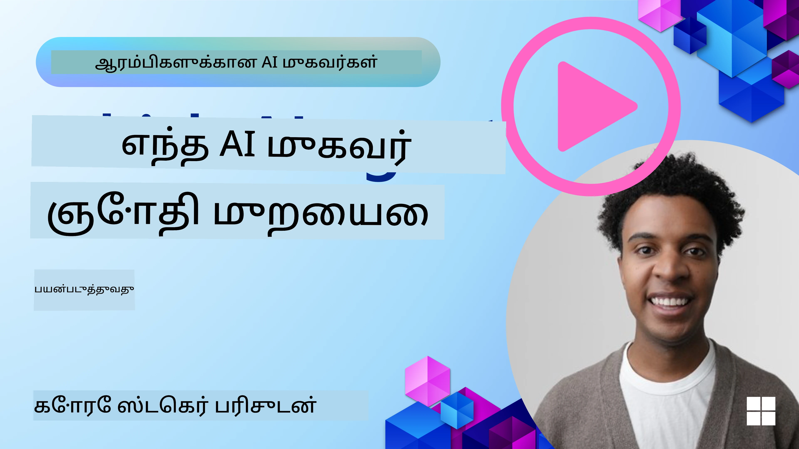

[](https://youtu.be/ODwF-EZo_O8?si=1xoy_B9RNQfrYdF7)

> _(இந்த பாடத்தின் வீடியோவைப் பார்க்க மேலே உள்ள படத்தை கிளிக் செய்யவும்)_

# AI முகவர் கட்டமைப்புகளை ஆராய்வு செய்யவும்

AI முகவர் கட்டமைப்புகள் என்பது AI முகவர்களின் உருவாக்கம், வெளியீடு மற்றும் நிர்வாகத்தை எளிமையாக்க வடிவமைக்கப்பட்ட மென்பொருள் தளங்கள் ஆகும். இவை வளர்ப்பாளர்களுக்கு முன்பே தயாரிக்கப்பட்ட கூறுகள், கூறுகளின் சாரம், மற்றும் கருவிகளை வழங்கி சிக்கலான AI அமைப்புகளின் உருவாக்கத்தை நேர்த்தியாக்குகின்றன.

இந்த கட்டமைப்புகள் வளர்ப்பாளர்களை அவர்களது பயன்பாடுகளின் தனி அம்சங்களுக்குப் பணியாற்ற உதவுகின்றன, AI முகவர் உருவாக்கத்தில் பொதுவான சவால்களுக்கு நிலையான அணுகுமுறைகளை வழங்கி. இவை AI அமைப்புகளை உருவாக்குவதில் பரிமாணம், அணுகல் திறன் மற்றும் செயல்திறனை முன்னேற்றுகின்றன.

## அறிமுகம்

இந்த பாடத்தில் விவரிக்கப்படும் விஷயங்கள்:

- AI முகவர் கட்டமைப்புகள் என்னவென்று மற்றும் இவை வளர்ப்பாளர்களுக்கு என்ன சாதிக்கச் செய்யும்?
- குழுக்கள் தங்கள் முகவர்களுடைய திறன்களை விரைவாக உருவாக்க, திருத்த மற்றும் மேம்படுத்த எந்தவாறு பயன்படுத்த முடியும்?
- Microsoft (<a href="https://aka.ms/ai-agents-beginners/ai-agent-service" target="_blank">Microsoft Foundry Agent Service</a> மற்றும் <a href="https://learn.microsoft.com/azure/ai-services/openai/how-to/responses" target="_blank">Microsoft Agent Framework</a>) உருவாக்கிய கட்டமைப்புகள் மற்றும் கருவிகளுக்கு இடையேயான வேறுபாடுகள் என்ன?
- நான் என்னுடைய ஏற்கனவே உள்ள Azure சூழல் கருவிகளை நேரடியாக இணைக்க முடியுமா, இல்லையெனில் தனி தீர்வுகள் தேவைவையா?
- Microsoft Foundry Agent Service என்றால் என்ன மற்றும் இது எனக்கு எப்படி உதவுகிறது?

## கற்றல் குறிக்கோள்கள்

இந்த பாடத்தின் குறிக்கோள்கள்:

- AI வளர்ச்சியில் AI முகவர் கட்டமைப்புகளின் பங்கு.
- புத்திசாலித்தனமான முகவர்களை உருவாக்க AI முகவர் கட்டமைப்புகளை பயன்படுத்துவது எப்படி.
- AI முகவர் கட்டமைப்புகள் வழங்கும் முக்கிய திறன்கள்.
- Microsoft Agent Framework மற்றும் Microsoft Foundry Agent Service இடையேயான வேறுபாடுகள்.

## AI முகவர் கட்டமைப்புகள் என்னவென்று மற்றும் இவை வளர்ப்பாளர்களுக்கு என்ன செய்ய அனுமதிக்கின்றன?

பாரம்பரிய AI கட்டமைப்புகள் உங்கள் செயலிகளில் AI ஐ ஒருங்கிணைத்து, இவற்றை மேம்படுத்த பின்வருமாறு உதவுகின்றன:

- **தனிப்பயனாக்கல்**: AI பயனர் நடத்தை மற்றும் விருப்பங்களை பகுப்பாய்வு செய்து தனிப்பயன் பரிந்துரைகள், உள்ளடக்கம் மற்றும் அனுபவங்களை வழங்குகிறது.
உதாரணம்: Netflix போன்ற ஸ்ட்ரீமிங் சேவைகள் பார்க்கும் வரலாற்றின் அடிப்படையில் திரைப்படங்கள் மற்றும் நிகழ்ச்சிகளை பரிந்துரைக்க AI ஐ பயன்படுத்தி பயனர் ஈடுபாடு மற்றும் பூர்த்தியை மேம்படுத்துகின்றன.
- **தானியங்கி மற்றும் செயல்திறன்**: AI மீண்டும் மீண்டும் செய்யப்படும் பணிகளை தானியக்கமாக்கி, பணிச்சுறுக்களை நேர்த்தியாக்கி, செயல்பாட்டு திறனை மேம்படுத்துகிறது.
உதாரணம்: வாடிக்கையாளர் சேவை செயலிகள் பொதுவான கேள்விகளை கையாள AI சார்ந்த சாட்பாட்களைப் பயன்படுத்தி பதில் நேரத்தை குறைத்து, மனித முகவர்களை சிக்கலான பிரச்சனைகளுக்கு விடுவிக்கின்றன.
- **பயனர் அனுபவத்தை மேம்படுத்தல்**: AI மூலமாக குரல் அங்கீகாரம், இயற்கை மொழி செயலாக்கம், முன்னறிவிப்பு உரை போன்ற புத்திசாலி அம்சங்கள் பயனர் அனுபவத்தை மேம்படுத்துகின்றன.
உதாரணம்: Siri மற்றும் Google Assistant போன்ற மெய்நிகர் உதவியாளர்கள் குரல் கட்டளைகளை புரிந்து பதிலளிக்க AI யைப் பயன்படுத்தி சாதனங்களுடன் எளிதாக தொடர்பு கொள்ள உதவுகின்றன.

### எல்லாம் அருமையாக இருக்கிறது, அப்படியென்றால் நமக்கு ஏன் AI முகவர் கட்டமைப்பு தேவை?

AI முகவர் கட்டமைப்புகள் என்பது AI கட்டமைப்புகளை விட வேறு ஒன்றை பிரதிபலிக்கின்றன. இவை பயனர்களுடன், பிற முகவர்களுடன் மற்றும் சூழலுடன் தொடர்பு கொண்டு குறிப்பிட்ட குறிக்கோள்களை அடைய திறன் வாய்ந்த புத்திசாலி முகவர்களை உருவாக்க உருவாக்கப்பட்டவை. இவை சுய இயக்கக்கூடிய அணுகுமுறை, முடிவெடுக்கும் திறன் ஆகியவற்றை விரிவாக்கி, மாறும் சூழல்களுக்கு ஏற்ப தழுவிக் கொள்கின்றன. AI முகவர் கட்டமைப்புகள் வழங்கும் முக்கிய திறன்களைப் பார்ப்போம்:

- **முகவர் ஒத்துழைப்பு மற்றும் ஒருங்கிணைப்பு**: பல AI முகவர்களை ஒன்றாக பணியாற்ற, தொடர்பு கொண்டு, சிக்கலான பணிகளை தீர்க்க ஒருங்கிணைக்க அனுமதிக்கிறது.
- **பணி தானியக்கம் மற்றும் நிர்வாகம்**: பல படிகள் கொண்ட பணிச்சுருக்களை தானியக்கமாக்க, பணிகளை ஒதுக்க, மற்றும் முகவர்களிடையே கையளிப்பு பணிகளை நிர்வகிப்பதற்கான கருவிகளை வழங்குகிறது.
- **சூழல் புரிதல் மற்றும் தழுவல்**: முகவர்களுக்கு சூழலைப் புரிந்து, மாறும் சூழலுக்கு ஏற்றாற்படியே தழுவி, நேரடி தகவல்களின் அடிப்படையில் முடிவெடுக்கத் திறனளிக்கிறது.

சுருக்கமாக, முகவர்கள் தானியக்கத்தை அடுத்த நிலைக்கு கொண்டுசெல்ல நாம் இவற்றை பயன்படுத்தி, சூழலில் இருந்து கற்று தழுவக்கூடிய புத்திசாலியுடைய அமைப்புகளை உருவாக்க முடியும்.

## முகவர்களின் திறன்களை விரைவில் உருவாக்க, திருத்த, மேம்படுத்த எப்படி?

இது ஒரு வேகமாக மாறும் சூழல், ஆனால் பெரும்பாலான AI முகவர் கட்டமைப்புகளில் பொதுவானவை சில இருக்கின்றன, அவை என்பதை விரைவில் தயாரித்து திருத்த உதவும்: கூறுகள், ஒத்துழைப்பு கருவிகள் மற்றும் நேரடி கற்றல். இவை பற்றி விரிவாக பார்ப்போம்:

- **மாட்யூல் கூறுகளைப் பயன்படுத்தவும்**: AI SDKகள் முனைப்பாக தயாரிக்கப்பட்ட கூறுகள் (AI மற்றும் நினைவுக் கூடிகள், இயற்கை மொழி அல்லது குறியீட்டு பிளக்-இன்கள் மூலம் செயல்பாட்டு அழைப்புகள், ஊக்கம் வடிவுகள் மற்றும் பல) வழங்குகின்றன.
- **ஒத்துழைப்பு கருவிகளை பாவனையாக்கவும்**: குறிப்பிட்ட பங்கை மற்றும் பணிகளை கொண்ட முகவர்களை வடிவமைத்து, ஒத்துழைப்புக் கொள்கைகள் ஆகியவற்றை சோதனை செய்து மேம்படுத்தவும்.
- **நேரடியாக கற்றல் செய்யவும்**: முகவர்கள் தொடர்புகளிலிருந்து கற்று, தங்கள் நடத்தை மாற்றுமாறி செயல்பட வட்டச்சுழற்சிகளை செயல்படுத்தவும்.

### மாட்யூல் கூறுகளைப் பயன்படுத்துதல்

Microsoft Agent Framework போன்ற SDKகள் முன்புடைத கூறுகள் (AI கூடிகள், கருவி வரையறைகள் மற்றும் முகவர் நிர்வாகம் போன்றவை) வழங்குகின்றன.

**குழுக்கள் இதை எப்படி பயன்படுத்தலாம்**: குழுக்கள் இவை மூலம் வேறு இடத்தில் தொடங்காமலேயே வேகமாக செயல்பாட்டு மாதிரிகள் உருவாக்கி பரிசோதனை மற்றும் திருத்தம் செய்ய முடியும்.

**உயிரோட்டத்தில் இது எப்படி இயங்குகிறது**: பயனர் உள்ளீட்டிலிருந்து தகவல்களை எடுக்கும் முன்-உணர்வி பகுப்பாய்வாளர், தரவை சேமித்து மீட்டெடுக்கும் நினைவு கூறு, பயனர்களுடன் தொடர்பு கொள்ள ஊக்க முறை தயாரிப்பாளரை நீங்கள் பயன்படுத்தலாம், எல்லாம் ஆரம்பத்திலிருந்து கட்டாமலேயே.

**எடுத்துக்காட்டு குறியீடு**. Microsoft Agent Framework ஐ `FoundryChatClient` உடன் எப்படி பயன்படுத்தி, கருவி அழைப்புக் கொண்டு பயனர் உள்ளீட்டிற்கு பதில் அளிக்கலாம் என்பதை பார்ப்போம்:

``` python
# மைக்ரோசாஃப்ட் ஏஜென்ட் கட்டமைப்பு பைத்தான் உதாரணம்

import asyncio
import os

from agent_framework import tool
from agent_framework.foundry import FoundryChatClient
from azure.identity import AzureCliCredential


# பயணத்தை முன்பதிவு செய்ய ஒரு மாதிரி கருவி செயல்பாட்டினை வரையறுக்கவும்
@tool(approval_mode="never_require")
def book_flight(date: str, location: str) -> str:
    """Book travel given location and date."""
    return f"Travel was booked to {location} on {date}"


async def main():
    provider = FoundryChatClient(
        project_endpoint=os.environ["AZURE_AI_PROJECT_ENDPOINT"],
        model=os.environ["AZURE_AI_MODEL_DEPLOYMENT_NAME"],
        credential=AzureCliCredential(),
    )
    agent = provider.as_agent(
        name="travel_agent",
        instructions="Help the user book travel. Use the book_flight tool when ready.",
        tools=[book_flight],
    )

    response = await agent.run("I'd like to go to New York on January 1, 2025")
    print(response)
    # உதாரண வெளியீடு: உங்கள் 2025 ஜனவரி 1-ஆம் தேதி நியூயார்க்குக்கு விமானம் வெற்றிகரமாக முன்பதிவு செய்யப்பட்டுள்ளது. பாதுகாப்பான பயணம்வேணுங்கள்! ✈️🗽


if __name__ == "__main__":
    asyncio.run(main())
```

இந்த எடுத்துக்காட்டிலிருந்து நீங்கள் சந்திப்பது என்னவென்றால், பயனர் உள்ளீட்டில் இருந்து முக்கியமான தகவல்களைப் பெற முனைப்பாக உருவாக்கப்பட்ட பகுப்பாய்வாளரை எப்படி பயன்படுத்தலாம், உதாரணமாக ஒரு விமான முன்பதிவு கோரிக்கையின் மூலம், ஆரம்பம், இலக்கு மற்றும் தேதி போன்றவை எடுக்கும். இந்த கூறுக் கோளம் உங்களைக் கூடிய உயர்தர லாஜிக் மீது கவனம் செலுத்த அனுமதிக்கிறது.

### ஒத்துழைப்பு கருவிகளை பயன்படுத்துதல்

Microsoft Agent Framework போன்ற கட்டமைப்புகள் பல முகவர்களை ஒன்றாக செயல்பட செய்ய உதவுகின்றன.

**குழுக்கள் இதை எப்படி பயன்படுத்தலாம்**: குழுக்கள் குறிப்பிட்ட பங்கு மற்றும் பணிகளுடன் முகவர்களை வடிவமைத்து, ஒத்துழைப்பு பணிச்சிறப்புகளை சோதிக்க மற்றும் மேம்படுத்தலாம்.

**உயிரோட்டத்தில் இது எப்படி இயங்குகிறது**: ஒரு குழுவில் உள்ள முகவர்கள் குறிப்பிட்ட பணி செய்பவராக இருக்கலாம், உதாரணத்திற்கு தரவு மீட்கல், பகுப்பாய்வு அல்லது முடிவெடுக்கும். இவர்கள் தகவலை பரிமாறிக் கொண்டு, உதாரணமாக பயனர் கேள்விக்கு பதிலளித்தல் அல்லது பணியை நிறைவேற்றல் போன்ற பொதுவான குறிக்கோளை அடைகின்றனர்.

**எடுத்துக்காட்டு குறியீடு (Microsoft Agent Framework)**:

```python
# மைக்ரோசாஃப்ட் ஏஜென்ட் கட்டமைப்பைப் பயன்படுத்தி ஒன்றாக வேலை செய்யும் பல ஏஜென்டுகளை உருவாக்குதல்

import os
from agent_framework.foundry import FoundryChatClient
from azure.identity import AzureCliCredential

provider = FoundryChatClient(
    project_endpoint=os.environ["AZURE_AI_PROJECT_ENDPOINT"],
    model=os.environ["AZURE_AI_MODEL_DEPLOYMENT_NAME"],
    credential=AzureCliCredential(),
)

# தரவுப் பெறல் ஏஜென்ட்
agent_retrieve = provider.as_agent(
    name="dataretrieval",
    instructions="Retrieve relevant data using available tools.",
    tools=[retrieve_tool],
)

# தரவு பகுப்பாய்வு ஏஜென்ட்
agent_analyze = provider.as_agent(
    name="dataanalysis",
    instructions="Analyze the retrieved data and provide insights.",
    tools=[analyze_tool],
)

# ஒரு பணியில் ஏஜெண்டுகளை வரிசையாக இயக்குக
retrieval_result = await agent_retrieve.run("Retrieve sales data for Q4")
analysis_result = await agent_analyze.run(f"Analyze this data: {retrieval_result}")
print(analysis_result)
```

இந்த முன் குறியீட்டில் நீங்கள் காண்கிறீர்கள் என்றால், பல முகவர்கள் ஒன்றாக பணியாற்றி தரவை பகுப்பாய்வு செய்கிற செயல்பாடு உருவாக்கப்படுகிறது. ஒவ்வொரு முகவரும் தனித்துறையில் செயல்பட்டு, ஒருங்கிணைத்து செயல்படுவதன் மூலம் அந்த பணி நிறைவேற்கிறது. குறிப்பிட்ட பங்கு கொண்ட முகவர்களுடன் பணியை மேம்படுத்தலாம்.

### நேரடியாக கற்றல் செய்யல்

மேம்பட்ட கட்டமைப்புகள் நேரடி சூழல் புரிதல் மற்றும் தழுவலை வழங்குகின்றன.

**குழுக்கள் இதை எப்படி பயன்படுத்தலாம்**: முகவர்கள் தொடர்புகளிலிருந்து கற்றுக் கொண்டு தங்கள் நடத்தை தானாக மாறும் வட்டச்சுழற்சிகளை குழுக்கள் நடைமுறைப்படுத்தும், இது திறன்களில் தொடர்ச்சி மேம்பாட்டை ஏற்படுத்தும்.

**உயிரோட்டத்தில் இது எப்படி இயங்குகிறது**: முகவர்கள் பயனர் கருத்துக்கள், சூழல் தரவுகள், பணியின் முடிவுகள் போன்றவற்றை பகுப்பாய்வு செய்து தங்கள் அறிவுத்தளத்தை புதுப்பித்து, முடிவு எடுக்கும் ஆல்காரிதங்களையும் மேம்படுத்தி காலப்போக்கில் செயல்திறனை வளர்க்கின்றனர். இந்த தொடர்ச்சியான கற்றல் முகவர்களை மாறும் சூழல் மற்றும் பயனர் விருப்பங்களுக்கு ஏற்ப தழுவச் செய்கிறது, அமைப்பின் முழுமையான திறனை அதிகரிக்கிறது.

## Microsoft Agent Framework மற்றும் Microsoft Foundry Agent Service இடையேயான வேறுபாடுகள் என்ன?

இவை ஒப்பிட பல வழிகள் உள்ளன, ஆனால் வடிவமைப்பு, திறன்கள், மற்றும் இலக்கு பயன்பாடுகளின் அடிப்படையில் சில முக்கிய வேறுபாடுகளை பார்ப்போம்:

## Microsoft Agent Framework (MAF)

Microsoft Agent Framework `FoundryChatClient` பயன்படுத்தி AI முகவர்களை உருவாக்க ஒரு எளிய SDK வழங்குகிறது. இது Azure OpenAI மாதிரிகள் கொண்டு கருவி அழைப்புகள், உரையாடல் நிர்வாகம் மற்றும் Azure அடையாளத்தின் மூலம் நிறுவன தரம் பாதுகாப்பை வழங்குகிறது.

**பயன்பாட்டு வழிகள்**: கருவி பயன்படுத்தல், பல படி பணிச்சுருக்கள் மற்றும் நிறுவன ஒருங்கிணைப்பு வசதிகளைக் கொண்ட தயாரிப்பு தயாரிக்க உட்பட AI முகவர்களை உருவாக்குதல்.

Microsoft Agent Framework இன் முக்கியக் கருத்துக்கள் சில:

- **முகவர்கள்**. ஒரு முகவர் `FoundryChatClient` மூலம் உருவாக்கப்பட்டு பெயர், அறிவுரைகள் மற்றும் கருவிகளுடன் கட்டமைக்கப்படுகிறது. முகவர் செய்யக்கூடியவை:
  - **பயனர் செய்திகளை செயலாக்கி** Azure OpenAI மாதிரிகள் மூலம் பதில்களை உருவாக்குதல்.
  - **உரையாடல் சூழலை சார்ந்து கருவிகளை தானாக அழைக்கிறது**.
  - **பல தொடர்புகளில் உரையாடல் நிலையை பராமரிக்கிறது**.

  முகவர்களை உருவாக்கும் குறியீடு எடுத்துக்காட்டு:

    ```python
    import os
    from agent_framework.foundry import FoundryChatClient
    from azure.identity import AzureCliCredential

    provider = FoundryChatClient(
        project_endpoint=os.environ["AZURE_AI_PROJECT_ENDPOINT"],
        model=os.environ["AZURE_AI_MODEL_DEPLOYMENT_NAME"],
        credential=AzureCliCredential(),
    )
    agent = provider.as_agent(
        name="my_agent",
        instructions="You are a helpful assistant.",
    )

    response = await agent.run("Hello, World!")
    print(response)
    ```

- **கருவிகள்**. இந்த கட்டமைப்பு முகவர் தானாக அழைக்கும் Python செயல்பாடுகளாக கருவிகளை வரையறுக்க ஆதரிக்கிறது. முகவர் உருவாக்கும்போது கருவிகள் பதிவு செய்யப்படுகின்றன:

    ```python
    def get_weather(location: str) -> str:
        """Get the current weather for a location."""
        return f"The weather in {location} is sunny, 72\u00b0F."

    agent = provider.as_agent(
        name="weather_agent",
        instructions="Help users check the weather.",
        tools=[get_weather],
    )
    ```

- **பல முகவர் ஒருங்கிணைப்பு**. வேறுபட்ட திறன்களுக்கான பல முகவர்களை உருவாக்கி, அவர்கள் பணிக்கான ஒருங்கிணைப்பை செய்ய முடியும்:

    ```python
    planner = provider.as_agent(
        name="planner",
        instructions="Break down complex tasks into steps.",
    )

    executor = provider.as_agent(
        name="executor",
        instructions="Execute the planned steps using available tools.",
        tools=[execute_tool],
    )

    plan = await planner.run("Plan a trip to Paris")
    result = await executor.run(f"Execute this plan: {plan}")
    ```

- **Azure அடையாள ஒருங்கிணைப்பு**. பாதுகாப்பான, சாவி இல்லா தொடர்புக்காக `AzureCliCredential` (அல்லது `DefaultAzureCredential`) பயன்படுத்தப்படுகிறது, சரவணை நிர்வகிப்பு தேவையில்லை.

## Microsoft Foundry Agent Service

Microsoft Foundry Agent Service 2024-இல் Microsoft Ignite இல் அறிமுகப்படுத்தப்பட்டது. இது Llama 3, Mistral, Cohere போன்ற திறந்த மூல LLMகளை நேரடியாக அழைக்கும் வசதியுடன், அதிகமான மாறுபாடான மாதிரிகள் கொண்டு AI முகவர்களை உருவாக்கவும் வெளியிடவும் அனுமதிக்கிறது.

Microsoft Foundry Agent Service வலுவான நிறுவன தர பாதுகாப்பு வசதிகள் மற்றும் தரவு சேமிப்பு முறைகளை வழங்குகிறது, இதனால் நிறுவன பயன்பாடுகளுக்குத் தகுந்தது.

Microsoft Agent Framework உடன் 'ஆர் பாக்சிங்' (out-of-the-box) வேலை செய்யும் முகவர்களை வடிவமைத்து வெளியிட உதவுகிறது.

இச்சேவை தற்போது பொதுப் பார்வையில் உள்ளது மற்றும் Python மற்றும் C# ஆகியவைக்கு ஆதரவு வழங்குகிறது.

Microsoft Foundry Agent Service Python SDK பயன்படுத்தி, பயனர் வரையறுக்கப்பட்ட கருவியுடன் ஒரு முகவர்களை உருவாக்கலாம்:

```python
import asyncio
from azure.identity import DefaultAzureCredential
from azure.ai.projects import AIProjectClient

# கருவி செயல்பாடுகளை வரையறு
def get_specials() -> str:
    """Provides a list of specials from the menu."""
    return """
    Special Soup: Clam Chowder
    Special Salad: Cobb Salad
    Special Drink: Chai Tea
    """

def get_item_price(menu_item: str) -> str:
    """Provides the price of the requested menu item."""
    return "$9.99"


async def main() -> None:
    credential = DefaultAzureCredential()
    project_client = AIProjectClient.from_connection_string(
        credential=credential,
        conn_str="your-connection-string",
    )

    agent = project_client.agents.create_agent(
        model="gpt-4o-mini",
        name="Host",
        instructions="Answer questions about the menu.",
        tools=[get_specials, get_item_price],
    )

    thread = project_client.agents.create_thread()

    user_inputs = [
        "Hello",
        "What is the special soup?",
        "How much does that cost?",
        "Thank you",
    ]

    for user_input in user_inputs:
        print(f"# User: '{user_input}'")
        message = project_client.agents.create_message(
            thread_id=thread.id,
            role="user",
            content=user_input,
        )
        run = project_client.agents.create_and_process_run(
            thread_id=thread.id, agent_id=agent.id
        )
        messages = project_client.agents.list_messages(thread_id=thread.id)
        print(f"# Agent: {messages.data[0].content[0].text.value}")


if __name__ == "__main__":
    asyncio.run(main())
```

### முக்கியக் கருத்துக்கள்

Microsoft Foundry Agent Service இன் பல முக்கியக் கருத்துக்கள்:

- **முகவர்**. Microsoft Foundry Agent Service Microsoft Foundry உடன் ஒருங்கிணைக்கப்படுகிறது. இந்த அமைப்பில் AI முகவர் "விரிவான" மைக்ரோசர்வீஸ் ஒருவகை ஆகும், இது கேள்விகளுக்கு பதிலளிப்பதற்கு (RAG), செயல்களை செய்யவும் அல்லது முழுமையாக பணிச்சுருக்களை தானாகச் செய்யவும் பயன்படுகிறது. இது உருவாக்கப்பட்ட AI மாதிரிகளின் சக்தியோடு உண்மைப் பொருள்களிலிருந்து தரவுகளை அணுகவும் தொடர்புகொள்ளவும் கருவிகளை இணைத்து செயல்படுகிறது. ஒரு முகவரின் எடுத்துக்காட்டு:

    ```python
    agent = project_client.agents.create_agent(
        model="gpt-4o-mini",
        name="my-agent",
        instructions="You are helpful agent",
        tools=code_interpreter.definitions,
        tool_resources=code_interpreter.resources,
    )
    ```

    இந்த எடுத்துக்காட்டில், `gpt-4o-mini` என்ற மாதிரி, `my-agent` என்ற பெயர், மற்றும் `You are helpful agent` என்ற அறிவுரைகளுடன் ஒரு முகவர் உருவாக்கப்பட்டுள்ளது. முகவர் குறியீடு புரிதல் பணிகள் செய்ய தேவையான கருவிகளுடன் தகுந்தவாறு உபகரிக்கப்பட்டுள்ளது.

- **தொடர் மற்றும் செய்திகள்**. தொடர் என்பது மற்றொரு முக்கியக் கருத்தாகும். இது முகவர் மற்றும் பயனர் இடையேயான உரையாடல் அல்லது தொடர்பை பிரதிபலிக்கிறது. தொடர்களை உரையாடல் முன்னேற்றம், சூழல் தகவல் சேமிப்பு மற்றும் தொடர்பின் நிலையை நிர்வகிக்க பயன்படுத்தலாம். தொடரின் எடுத்துக்காட்டு:

    ```python
    thread = project_client.agents.create_thread()
    message = project_client.agents.create_message(
        thread_id=thread.id,
        role="user",
        content="Could you please create a bar chart for the operating profit using the following data and provide the file to me? Company A: $1.2 million, Company B: $2.5 million, Company C: $3.0 million, Company D: $1.8 million",
    )
    
    # ஏஜென்டை திரையில் பணிகளை செய்ய கேட்கவும்
    run = project_client.agents.create_and_process_run(thread_id=thread.id, agent_id=agent.id)
    
    # ஏஜென்டின் பதிலை பார்க்க அனைத்து செய்திகளையும் பெற்றுக் பதிவு செய்க
    messages = project_client.agents.list_messages(thread_id=thread.id)
    print(f"Messages: {messages}")
    ```

    மேலுள்ள குறியீட்டில் ஒரு தொடர் உருவாக்கப்பட்டுள்ளது. பிறகு தொடருக்கு செய்தி அனுப்பப்படுகிறது. `create_and_process_run` அழைப்பால் முகவரிடம் தொடரில் பணியாற்றக் கோரப்படுகிறது. இறுதியில், செய்திகள் பெற்றுக் கொள்ளப்பட்டு முகவரின் பதில்கள் பதிவுசெய்யப்படுகின்றன. செய்திகள் பயனர் மற்றும் முகவர் இடையேயான உரையாடல் முன்னேற்றத்தை காட்டுகின்றன. மேலும், செய்திகள் இயல், படம் அல்லது கோப்பு போன்ற பலவகையாக இருக்கலாம், அதாவது முகவரின் வேலைப் படமாக அல்லது உரை பதிலாக வெளிப்படலாம். வளர்ப்பாளராக, நீங்கள் இதை பயன்படுத்தி பதிலை மேலதிகமாக செயலாக்கவோ அல்லது பயனருக்கு காட்சிப்படுத்தவோ முடியும்.

- **Microsoft Agent Framework உடன் ஒருங்கிணைப்பு**. Microsoft Foundry Agent Service Microsoft Agent Framework உடன் நேர்ச்சேர்க்கை கொண்டுள்ளது, அதனால் `FoundryChatClient` மூலம் முகவர்களை உருவாக்கி Agent Service மூலம் வெளியிட முடியும்.

**பயன்பாடு வழிகள்**: Microsoft Foundry Agent Service பாதுகாப்பான, பரிமாணக்கூடிய மற்றும் மாறுபாடான AI முகவர் வெளியீட்டுக்கு வடிவமைக்கப்பட்ட நிறுவன பயன்பாடுகள்.

## இவ்விரு அணுகுமுறைகளுக்கு இடையேயான வெவ்வேறு அம்சங்கள் என்ன?
 
ஒத்துப்போட்டிருக்கின்றன என்றால் கூட வடிவமைப்பு, திறன் மற்றும் இலக்கு பயன்பாட்டில் சில முக்கிய வேறுபாடுகள் உள்ளன:
 
- **Microsoft Agent Framework (MAF)**: AI முகவர்களை உருவாக்கும் தயாரிப்பு-தயார் SDK. கருவி அழைப்புகள், உரையாடல் நிர்வாகம் மற்றும் Azure அடையாள ஒருங்கிணைப்பை கொண்ட எளிய API.
- **Microsoft Foundry Agent Service**: Microsoft Foundry இல் முகவர்களுக்கு ஒரு தளம் மற்றும் வெளியீட்டு சேவை. Azure OpenAI, Azure AI Search, Bing Search மற்றும் குறியீட்டு செயல்பாட்டிற்கு கருவி உள்ளது.
 
இன்னும் எது தேர்வது என்று குழப்பமா?

### பயன்பாட்டு வழிகள்
 
சில பொதுவான பயன்பாடுகளை பார்ப்போம்:
 
> கேள்வி: நான் தயாரிப்பு AI முகவர் பயன்பாடுகளை உருவாக்க விரும்புகிறேன் மற்றும் விரைவில் துவங்க விரும்புகிறேன்
>

> பதில்: Microsoft Agent Framework சிறந்த தேர்வு. இது `FoundryChatClient` மூலம் உள்ளிட்ட கருவிகள் மற்றும் அறிவுரைகளை சில வரிகள் குறியீட்டில் வரையலாம் என்று எளிமையான Python API வழங்குகிறது.

> கேள்வி: நான் Azure ஒருங்கிணைப்புகளுடன் நிறுவன தர வெளியீடு (சோச் மற்றும் குறியீட்டு செயல்பாடு போன்றவை) விரும்புகிறேன்
>
> பதில்: Microsoft Foundry Agent Service சிறந்ததாகும். இது பல மாதிரிகள், Azure AI Search, Bing Search மற்றும் Azure Functions உடன் பணிசெய்யும் தளம் சேவையாகும். Foundry போர்டல் மூலம் முகவர்களை உருவாக்கி பரவலாக வெளியிட உதவுகிறது.
 
> கேள்வி: இன்னும் குழப்பமாக இருக்கிறது, நான் ஒரு தேர்வு சொல்லுங்கள்
>
> பதில்: முதலில் Microsoft Agent Framework மூலம் முகவர்களை உருவாக்கி, பிறகு நிறுவனத்தில் வெளியிடுவதே தேவையெனில் Microsoft Foundry Agent Service பயன்படுத்துங்கள். இதனால் முகவர் தர்க்கத்தில் விரைவாக திருத்தங்கள் செய்யும் போது, நிறுவன வெளியீட்டுக்கு தெளிவான பாதையை பெறலாம்.
 
விசாரணைகள் சுருக்கமாக அட்டவணையில்:

| கட்டமைப்பு | கவனம் | முக்கியக் கருத்துக்கள் | பயன்பாட்டு வழிகள் |
| --- | --- | --- | --- |
| Microsoft Agent Framework | கருவி அழைப்புடன் நேர்த்தியான முகவர் SDK | முகவர்கள், கருவிகள், Azure அடையாளம் | AI முகவர்களை கட்டமைக்க, கருவி பயன்படுத்த, பல படி பணிகள் |
| Microsoft Foundry Agent Service | மாறுபாடான மாதிரிகள், நிறுவன பாதுகாப்பு, குறியீடு உருவாக்கம், கருவி அழைப்பு | கூறாக்கல், ஒத்துழைப்பு, செயல்முறை ஒருங்கிணைப்பு | பாதுகாப்பான, பரிமாணக்கூடிய மற்றும் மாறுபாடான AI முகவர் வெளியீடு |

## எனது ஏற்கனவே உள்ள Azure சூழல் கருவிகளை நேரடியாக இணைக்கலாமா, தனி தீர்வுகள் தேவைவையா?


விடை ஆம், உங்கள் உள்ளமைக்கப்பட்ட Azure சுற்றுச்சூழல் கருவிகளை நேரடியாக Microsoft Foundry Agent சேவையுடன் இணைக்கலாம், முக்கியமாக இது மற்ற Azure சேவைகளுடன் தடைமீறிப் பணியாற்ற உருவாக்கப்பட்டது. உதாரணமாக, நீங்கள் Bing, Azure AI Search மற்றும் Azure Functions-ஐ இணைக்கலாம். Microsoft Foundry-உடும் ஆழ்ந்த இணைப்பு உள்ளது.

Microsoft Agent Framework மீண்டும் `FoundryChatClient` மற்றும் Azure அடையாளத்தின் மூலம் Azure சேவைகளுடன் இணைகிறது, இதனால் உங்கள் முகவரியின் கருவிகளிலிருந்து நேரடியாக Azure சேவைகளை அழைக்க முடியும்.

## மாதிரியான குறியீடுகள்

- Python: [Agent Framework (Microsoft Foundry)](./code_samples/02-python-agent-framework.ipynb)
- Python: [Agent Framework (Azure OpenAI Responses API)](./code_samples/02-python-agent-framework-azure-openai.ipynb)
- .NET: [Agent Framework](./code_samples/02-dotnet-agent-framework.md)

## AI முகவர் கட்டமைப்புகளுக்கு கூடுதல் கேள்விகள் உண்டா?

மற்ற கற்றல் பெருங்களுக்கு சந்திக்க, அலுவலக நேரங்களில் கலந்துகொள்ள மற்றும் உங்கள் AI முகவரி கேள்விகளுக்கு பதில்களை பெற [Microsoft Foundry Discord](https://discord.com/invite/ATgtXmAS5D)-ஐ சேர்ந்துகொள்ளுங்கள்.

## மேற்கோள்கள்

- <a href="https://techcommunity.microsoft.com/blog/azure-ai-services-blog/introducing-azure-ai-agent-service/4298357" target="_blank">Azure Agent சேவை</a>
- <a href="https://learn.microsoft.com/azure/ai-services/openai/how-to/responses" target="_blank">Microsoft Agent Framework - Azure OpenAI Responses</a>
- <a href="https://learn.microsoft.com/azure/ai-services/agents/overview" target="_blank">Microsoft Foundry Agent சேவை</a>

## முந்தைய பாடம்

[AI முகவரிகளுக்கான அறிமுகம் மற்றும் முகவர் பயன்பாட்டு வழக்குகள்](../01-intro-to-ai-agents/README.md)

## அடுத்த பாடம்

[Agentic வடிவமைப்பு வடிவங்கள் புரிதல்](../03-agentic-design-patterns/README.md)

---

<!-- CO-OP TRANSLATOR DISCLAIMER START -->
**மறுப்பு**:
இந்த ஆவணம் AI மொழிபெயர்ப்பு சேவை [Co-op Translator](https://github.com/Azure/co-op-translator) பயன்படுத்தி மொழிபெயர்க்கப்பட்டுள்ளது. நாங்கள் துல்லியத்திற்காக முயற்சி செய்துள்ளோம், ஆனால் தானாக செய்யப்படும் மொழிபெயர்ப்புகளில் பிழைகள் அல்லது தவறுகள் இருக்கலாம் என்பதை கவனத்தில் கொள்ளவும். அசல் ஆவணம் அதன் தாய்மொழியில் அதிகாரப்பூர்வ ஆதாரமாக கருதப்பட வேண்டும். முக்கியமான தகவல்களுக்கு, தொழில்நுட்பமான மனித மொழிபெயர்ப்பு பரிந்துரைக்கப்படுகிறது. இந்த மொழிபெயர்ப்பைப் பயன்படுத்துவதால் ஏற்படும் எந்த தவறான புரிதல்கள் அல்லது தவறான விளக்கத்திற்கும் நாங்கள் பொறுப்பில்வில்லை.
<!-- CO-OP TRANSLATOR DISCLAIMER END -->