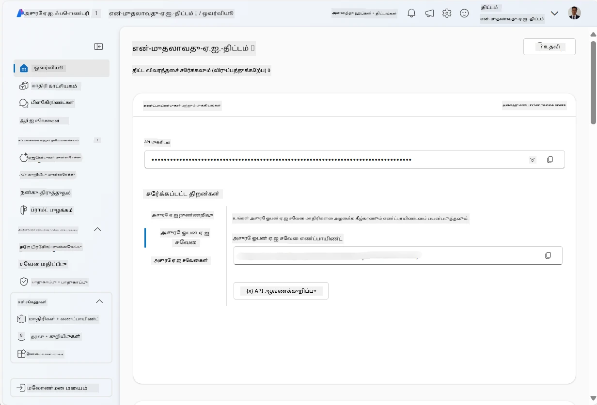
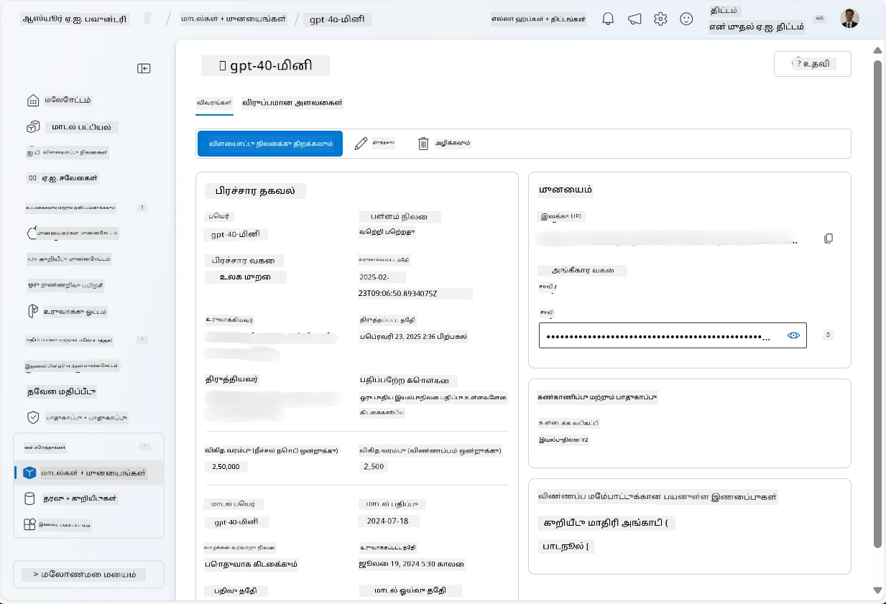
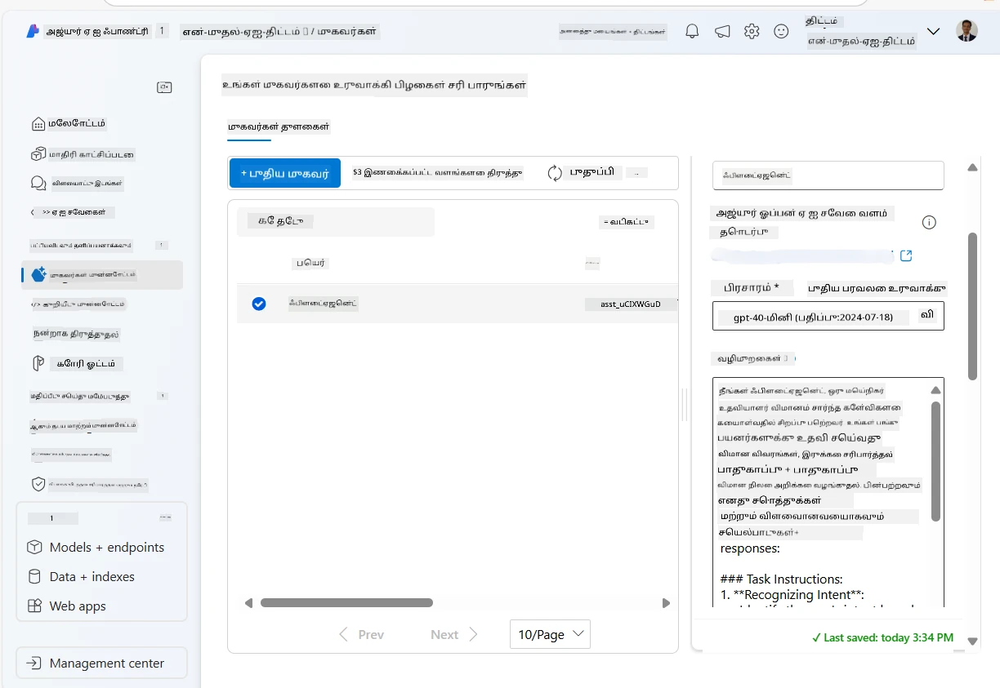
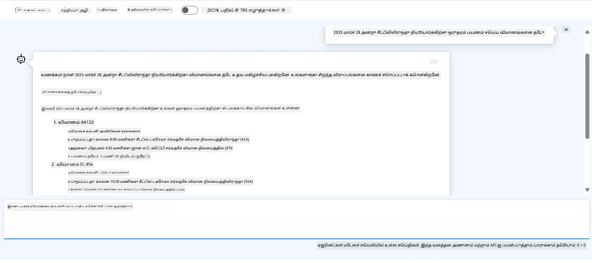

# Microsoft Foundry முகவர் சேவை மேம்பாடு

இந்த பயிற்சியில், நீங்கள் [Microsoft Foundry போர்டல்](https://ai.azure.com/?WT.mc_id=academic-105485-koreyst) இல் Microsoft Foundry முகவர் சேவை கருவிகளை பயன்படுத்தி Flight Booking க்கான ஒரு முகவரை உருவாக்குவீர்கள். முகவர் பயனர்களுடன் தொடர்பு கொண்டு விமானங்களுக்கான தகவல்களை வழங்க முடியும்.

## முன் தேவைகள்

இந்த பயிற்சியை முடிக்க, கீழ்காணும் தேவைகள் உள்ளன:
1. செயற்பாட்டுள்ள சந்தா கொண்ட Azure கணக்கு. [இலவசமாக கணக்கு உருவாக்கவும்](https://azure.microsoft.com/free/?WT.mc_id=academic-105485-koreyst).
2. Microsoft Foundry ஹப் உருவாக்கும் அனுமதிகள் அல்லது உங்களுக்காக ஏற்கனவே ஹப் உருவாக்கப்பட்டுள்ளது.
    - உங்கள் பங்கு Contributor அல்லது Owner ஆக இருந்தால், இந்த பாடமுறையில் உள்ள படிகளை பின்பற்றலாம்.

## Microsoft Foundry ஹப் உருவாக்கவும்

> **குறிப்பு:** Microsoft Foundry முன்பு Azure AI Studio என்ற பெயரில் இருந்தது.

1. Microsoft Foundry ஹப் உருவாக்க [Microsoft Foundry](https://learn.microsoft.com/en-us/azure/ai-studio/?WT.mc_id=academic-105485-koreyst) பதிவு செய்தியில் உள்ள வழிகாட்டுதல்களை பின்பற்றவும்.
2. உங்கள் திட்டம் உருவாக்கப்பட்டவுடன், காட்டப்பட்டுள்ள எந்த டிப்ஸ் இருந்தாலும் மூடி Microsoft Foundry போர்டலில் திட்டப் பக்கத்தை பரிசீலிக்கவும். இது கீழ்க்காணும் படத்துடன் ஒத்திருக்க வேண்டும்:

    

## மாதிரியை இயக்கு

1. உங்கள் திட்டத்தின் இடது பக்கத்தில் உள்ள பேனில், **My assets** பகுதியில், **Models + endpoints** பக்கத்தை தேர்ந்தெடுக்கவும்.
2. **Models + endpoints**ப் பக்கத்தில், **Model deployments** தாவலை தேர்ந்தெடுத்து, **+ Deploy model** பட்டியில் **Deploy base model** என்பதனை தேர்ந்தெடுக்கவும்.
3. பட்டியலில் `gpt-4o-mini` மாதிரியை தேடி, அதை தேர்ந்தெடுத்து உறுதிப்படுத்தவும்.

    > **குறிப்பு**: TPM ஐ குறைப்பது, நீங்கள் பயன்படுத்தும் சந்தாவில் கிடைக்கும் கொள்ளை குவாட்டாவை சொல்கும் தவிர்க்க உதவும்.

    

## முகவரை உருவாக்கவும்

மாதிரி இயக்கப்பட்ட பிறகு, நீங்கள் ஒரு முகவரை உருவாக்கலாம். முகவர் என்பது பயனர்களுடன் உரையாடும் AI மாதிரி ஆகும்.

1. உங்கள் திட்டத்தின் இடது பக்க பேனில், **Build & Customize** பகுதியில், **Agents** பக்கத்தை தேர்ந்தெடுக்கவும்.
2. புதிய முகவரை உருவாக்க **+ Create agent** ஐ கிளிக் செய்யவும். **Agent Setup** உரையாடல் பெட்டியில்:
    - முகவருக்கு `FlightAgent` போன்ற ஒரு பெயரை இடவும்.
    - முந்தையதாக நீங்கள் உருவாக்கிய `gpt-4o-mini` மாதிரி இல் உள்ளடக்கத்துடன் இருப்பதை உறுதிப்படுத்தவும்
    - முகவரி பின்பற்று வேண்டிய அறிவுறுத்தல்களை **Instructions** என்பதை அமைக்கவும். உதாரணமாக:
    ```
    You are FlightAgent, a virtual assistant specialized in handling flight-related queries. Your role includes assisting users with searching for flights, retrieving flight details, checking seat availability, and providing real-time flight status. Follow the instructions below to ensure clarity and effectiveness in your responses:

    ### Task Instructions:
    1. **Recognizing Intent**:
       - Identify the user's intent based on their request, focusing on one of the following categories:
         - Searching for flights
         - Retrieving flight details using a flight ID
         - Checking seat availability for a specified flight
         - Providing real-time flight status using a flight number
       - If the intent is unclear, politely ask users to clarify or provide more details.
        
    2. **Processing Requests**:
        - Depending on the identified intent, perform the required task:
        - For flight searches: Request details such as origin, destination, departure date, and optionally return date.
        - For flight details: Request a valid flight ID.
        - For seat availability: Request the flight ID and date and validate inputs.
        - For flight status: Request a valid flight number.
        - Perform validations on provided data (e.g., formats of dates, flight numbers, or IDs). If the information is incomplete or invalid, return a friendly request for clarification.

    3. **Generating Responses**:
    - Use a tone that is friendly, concise, and supportive.
    - Provide clear and actionable suggestions based on the output of each task.
    - If no data is found or an error occurs, explain it to the user gently and offer alternative actions (e.g., refine search, try another query).
    
    ```
> [!NOTE]
> விரிவான அறிவுறுத்தலுக்கு, [இந்த சேமிப்பகம்](https://github.com/ShivamGoyal03/RoamMind) ஐ பார்க்கலாம்.
    
> மேலும், முகவரின் திறன்களை மேம்படுத்த **Knowledge Base** மற்றும் **Actions** ஐச் சேர்க்கலாம், இது பயனர் கோரிக்கைகளை அடிப்படையாகக் கொண்டு கூடுதல் தகவல்களை வழங்க மற்றும் தானியங்கி நடவடிக்கைகளை செய்ய உதவும். இந்த பயிற்சிக்கு நீங்கள் இவ்வாறு செய்யாமல் வழியாகலாம்.
    


3. புதிய பல AI முகவரை உருவாக்க, வெறும் **New Agent** ஐ கிளிக் செய்யவும். புதிய உருவாக்கப்பட்ட முகவர் Agents பக்கத்தில் காணப்படும்.


## முகவரைக் சோதிக்கவும்

முகவரை உருவாக்கிய பின்னர், அதனை Microsoft Foundry போர்டல் விளையாட்டு பகுதியில் பயனர் கேள்விகளுக்கு எப்படி பதிலளிக்கும் என்பதை சோதிக்கலாம்.

1. உங்கள் முகவருக்கான **Setup** பேனின் மேல் பகுதியில், **Try in playground** ஐ தேர்ந்தெடுக்கவும்.
2. **Playground** பேனில், உரையாடல் ஜன்னலில் கேள்விகளை டைப் செய்து முகவருடன் தொடர்பு கொள்ளலாம். உதாரணமாக, முகவரிடம் 28-ஆம் தேதி சீயாட்டிலில் இருந்து நியூயார்க் வரை விமானங்களை தேட கேட்கலாம்.

    > **குறிப்பு**: இந்த பயிற்சியில் நேரடி தரவு பயன்படுத்தப்படவில்லை என்பதால் முகவர் சரியான பதில்களை வழங்காது இருக்கலாம். முகவரின் திறன் பயனர் கேள்விகளுக்கு அறிவுறுத்தல்களின் அடிப்படையில் புரிந்து பதிலளிக்கும் தன்மையை சோதிப்பதே இச்செயலின் நோக்கம்.

    

3. முகவரைக் சோதித்த பிறகு, அதனை மேலும் உருப்படி எண்ணங்களை, பயிற்சி தரவை மற்றும் நடவடிக்கைகளைச் சேர்க்க கைப்பயிற்சி செய்யலாம்.

## வளங்களை சுத்தம் செய்யவும்

முகவரைக் சோதனை முடிந்தவுடன், கூடுதல் செலவுகளைக் குறைக்க அதை நீக்கலாம்.
1. [Azure போர்டல்](https://portal.azure.com) ஐ திறந்து, இந்த பயிற்சியில் பயன்படுத்திய ஹப் வளங்கள் உள்ள வளக் குழுவின் உள்ளடக்கத்தை பார்வையிடவும்.
2. கருவிப்பட்டியில், **Delete resource group** ஐ தேர்ந்தெடுக்கவும்.
3. வளக் குழு பெயரை உள்ளிடி, நீக்க விரும்புகிறீர்கள் என்பதை உறுதிப்படுத்தவும்.

## வளங்கள்

- [Microsoft Foundry ஆவணங்கள்](https://learn.microsoft.com/en-us/azure/ai-studio/?WT.mc_id=academic-105485-koreyst)
- [Microsoft Foundry போர்டல்](https://ai.azure.com/?WT.mc_id=academic-105485-koreyst)
- [Microsoft Foundry மூலம் துவக்கம்](https://techcommunity.microsoft.com/blog/educatordeveloperblog/getting-started-with-azure-ai-studio/4095602?WT.mc_id=academic-105485-koreyst)
- [Azure இல் AI முகவர்களின் அடிப்படைகள்](https://learn.microsoft.com/en-us/training/modules/ai-agent-fundamentals/?WT.mc_id=academic-105485-koreyst)
- [Azure AI Discord](https://aka.ms/AzureAI/Discord)

---

<!-- CO-OP TRANSLATOR DISCLAIMER START -->
**மறுப்பு**:
இந்த ஆவணம் AI மொழிபெயர்ப்பு சேவை [Co-op Translator](https://github.com/Azure/co-op-translator) பயன்படுத்தி மொழிபெயர்க்கப்பட்டுள்ளது. நாங்கள் துல்லியத்திற்காக முயற்சி செய்துள்ளோம், ஆனால் தானாக செய்யப்படும் மொழிபெயர்ப்புகளில் பிழைகள் அல்லது தவறுகள் இருக்கலாம் என்பதை கவனத்தில் கொள்ளவும். அசல் ஆவணம் அதன் தாய்மொழியில் அதிகாரப்பூர்வ ஆதாரமாக கருதப்பட வேண்டும். முக்கியமான தகவல்களுக்கு, தொழில்நுட்பமான மனித மொழிபெயர்ப்பு பரிந்துரைக்கப்படுகிறது. இந்த மொழிபெயர்ப்பைப் பயன்படுத்துவதால் ஏற்படும் எந்த தவறான புரிதல்கள் அல்லது தவறான விளக்கத்திற்கும் நாங்கள் பொறுப்பில்வில்லை.
<!-- CO-OP TRANSLATOR DISCLAIMER END -->