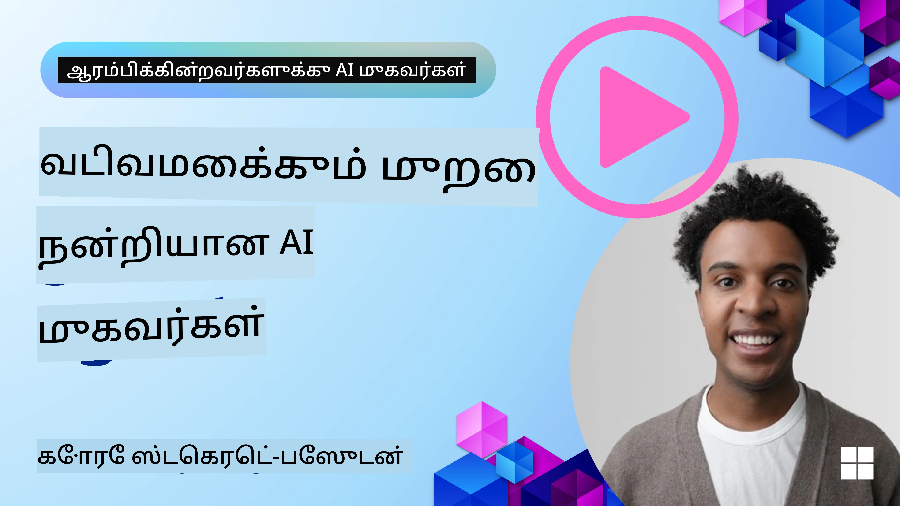
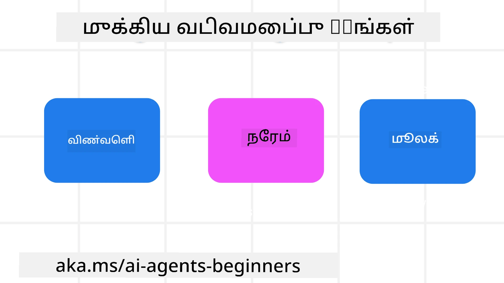

> _(இந்த பாடத்தின் வீடியோவைப் பார்வையிட மேலே உள்ள படத்தை அழுத்தவும்)_
# AI முகவர் வடிவமைப்பு கொள்கைகள்

## அறிமுகம்

AI முகவர் அமைப்புகளை உருவாக்குவதற்கு பல வழிகள் உள்ளன. ஜெனரேட்டிவ் AI வடிவமைப்பில் அஸ்பஷ்டம் என்பது ஒரு பிழை அல்ல என்பது ஒரு அம்சமாக இருப்பதால், எந்த இடத்தில் தொடங்குவது என்று பொறியியல் வல்லுநர்களுக்கு சில சமயங்களில் கவலை ஏற்படுகிறது. வாடிக்கையாளர் மையமான முகவரி அமைப்புகளை உருவாக்குவதற்கு devs ஊக்குவிக்க மனித மையமான UX வடிவமைப்பு கொள்கைகளை நாங்கள் உருவாக்கியுள்ளோம். இந்த வடிவமைப்பு கொள்கைகள் கட்டாயமான கட்டமைப்புகள் அல்ல, ஆனால் முகவர் அனுபவங்களை வரையறுக்கவும் வடிவமைக்கவும் குழுக்களுக்கு ஒரு தொடக்கமாக இருக்கின்றன.

பொதுவாக, முகவர்கள்:

- மனித திறன்களை விரிவாக்கவும் வலுவாக்கவும் (தோன்றும் யோசனை, பிரச்சனை தீர்க்க, தானாக செயல்படுத்தல், போன்றவை)
- அறிவு பற்றாக்குறைகளை பூர்த்தி செய்யவும் (அறிவு துறைகளில் என்னை புதுப்பித்துக் கொள்ளவும், மொழிபெயர்ப்பு, போன்றவை)
- தனிப்பட்ட முறையில் மற்றவர்களுடன் வேலை செய்ய விரும்பும் வழிகளில் ஒத்துழைப்பு மற்றும் ஆதரவு வழங்கவும்
- நம்மை மேம்படுத்தவும் (உதாரணமாக, வாழ்க்கை பயிற்சியாளர்/பணி நடைமுறை நெறி, உணர்ச்சி கட்டுப்பாடு மற்றும் கவனச்சிதறல் கலைகளை கற்றல், மன உறுதியை உருவாக்குதல், போன்றவை)

## இந்த பாடத்தில் பேசப்பட உள்ளவை

- முகவர் வடிவமைப்பு கொள்கைகள் என்ன
- இந்த வடிவமைப்பு கொள்கைகளை செயல்படுத்தும் போது பின்பற்ற வேண்டிய வழிகாட்டுதல்கள் என்ன
- வடிவமைப்பு கொள்கைகள் பயன்படுத்திய எடுத்துக்காட்டுகள் என்ன

## கற்றல் இலக்குகள்

இந்த பாடத்தை முடித்த பிறகு, நீங்கள் செய்ய முடியும்:

1. முகவர் வடிவமைப்பு கொள்கைகள் என்ன என்பதை விளக்கவும்
2. முகவர் வடிவமைப்பு கொள்கைகளை பயன்படுத்தும் வழிகாட்டுதல்களை விளக்கவும்
3. முகவர் வடிவமைப்பு கொள்கைகளை பயன்படுத்தி ஒரு முகவரை எப்படி கட்டி உருவாக்குவது என்பதை புரிந்து கொள்வது

## முகவர் வடிவமைப்பு கொள்கைகள்

### முகவர் (இடம்)

முகவர் செயல்படும் சூழல் இது. இயற்கை மற்றும் டிஜிட்டல் உலகங்களில் ஈடுபடுவதற்கான முகவர்களை வடிவமைப்பதில் இந்த கொள்கைகள் உதவுகின்றன.

- **இணைக்குதல், விழுந்து சேராமல்** – தொழிலாளர் மற்றும் பயனுள்ள அறிவை இணைக்க உதவவும்.
- முகவர்கள் நிகழ்வுகள், அறிவு மற்றும் மக்கள் ஆகியவற்றை இணைக்க உதவுகின்றனர்.
- முகவர்கள் மக்களை ஒன்றுக்கொன்று நெருக்கமாக வைத்திருக்கின்றனர். மக்கள் மாற்ற அல்லது தாழ்த்த அவர் வடிவமைக்கப்படவில்லை.
- **எளிதில் அணுகக்கூடியதும், சில நேரங்களில் மறைந்தும் இருக்க வேண்டும்** – முகவர் பெரும்பாலும் பின்னணியில் செயல்பட்டு, தொடர்புடையதும் சரியானதும் ஆகும்போது மட்டுமே உதவுகிறது.
  - முகவர் எந்த சாதனம் அல்லது தளத்தில் அங்கீகாரம் பெற்ற பயனர்கள் எளிதில் கண்டுபிடிக்கக்கூடியதும் அணுகக்கூடியதும் ஆக வேண்டும்.
  - முகவர் பலவகை உள்ளீடு மற்றும் வெளியீட்டை ஆதரிக்கிறது (ஒலி, குரல், உரை, போன்றவை).
  - முகவர் முன்னணி மற்றும் பின்னணி இடையே; செயலில் மற்றும் பிரதிபலனாய் இடையே தடை இல்லாமல் மாறக்கூடியது; பயனர் தேவைகளை உணர்ந்து செயல்படும்.
  - முகவர் மறைவு வடிவத்தில் செயல்படலாம், ஆனால் அதன் பின்னணி செயல்முறை பாதை மற்றும் மற்ற முகவர்களுடன் ஒத்துழைப்பு பயனருக்கு திறந்ததும் கட்டுப்பாடுடைமையும் ஆகும்.

### முகவர் (நேரம்)

முகவர் நேரம் முழுவதும் எப்படி செயல்படுகிறான் என்பது. கடந்த காலம், நிகழ்காலம் மற்றும் எதிர்காலம் முழுவதும் முகவரை வடிவமைப்பதில் இந்த கொள்கைகள் உதவுகின்றன.

- **கடந்தது**: நிலை மற்றும் சூழலை உள்ளடக்கிய வரலாற்றை பிரதிபலித்தல்.
  - முகவர் நிகழ்வு, மக்கள், நிலைகள் ஆகியவற்றை தாண்டி வளமான வரலாற்று தரவுத்தளத்தின் பகுப்பாய்வின் அடிப்படையில் தொடர்புடைய முடிவுகளை வழங்குகிறது.
  - முகவர் கடந்த நிகழ்வுகளிலிருந்து இணைப்புகளை உருவாக்கி, நினைவுகளை செயலில் எடுத்துக்கொண்டு தற்போதைய சூழலுடன் ஈடுபடுகிறது.
- **இப்போது**: அறிவித்தலுக்கு மேலான தூண்டுதல்.
  - முகவர் மக்கள் உடன் தொடர்பு கொள்ள முழுமையான அணுகுமுறையை எடுத்துக்கொள்கிறது. ஒரு நிகழ்வு நடந்தால், முகவர் நிலையான அறிவிப்பு அல்லது மற்ற நிலையான முறையை தாண்டி செயல்படுகிறது. முகவர் பயனர் கவனத்தை சரியான நேரத்தில் திருப்ப வழிகாட்டிகள் அல்லது எளிமையாக்கப்பட்ட முறைகளை உருவாக்கக்கூடியது.
  - முகவர் சூழல், சமூக மற்றும் கலாச்சார மாற்றங்கள் அடிப்படையில் மற்றும் பயனர் நோக்கத்தோடு ஏற்புடையத் தகவலை வழங்குகிறது.
  - முகவர் தொடர்பு மெல்ல முறைபடுத்தப்படலாம், காலப்போக்கில் அதிகரித்து பயனர்களுக்கு அதிகாரம் வழங்கக்கூடியது.
- **எதிர்காலம்**: மாற்றம் மற்றும் வளர்ச்சி.
  - முகவர் பல சாதனங்கள், தளங்கள் மற்றும் முறைகளுக்கு ஏற்ப மாறக்கூடியது.
  - முகவர் பயனர் நடத்தை, அணுகல் தேவைகள் போன்றவற்றுக்கு ஏற்ப நுட்பமாக வடிவமைக்கக்கூடியது.
  - முகவர் பயனர் தொடர்பு தொடர்ச்சியாக வடிவமைக்கப்படவும் வளர்ந்துகொள்ளவும் செய்கிறது.

### முகவர் (மையம்)

இது முகவரின் வடிவமைப்பின் முக்கிய கூறுகள்.

- **அனிச்சைத்தன்மையை ஏற்றுக் கொண்டு, நம்பிக்கையை நிலைநிறுத்தவும்**.
  - முகவருக்குள் ஒரு அளவுக்கான அனிச்சைத்தன்மை எதிர்பார்க்கப்படுகிறது. அனிச்சைத்தன்மை முகவர் வடிவமைப்பின் முக்கிய கூறாகும்.
  - நம்பிக்கை மற்றும் வெளிப்படைத்தன்மை முகவர் வடிவமைப்பின் அடிப்படையான அடுக்குகள் ஆகும்.
  - மனிதர்கள் முகவரின் செயல்பாட்டை (ஆன்கள்/ஆஃப்கள்) கட்டுப்படுத்திக்கொள்கின்றனர் மற்றும் முகவர் நிலை எப்போதும் தெளிவாகக் காட்சியளிக்கிறது.

## இந்த கொள்கைகளை செயல்படுத்தும் வழிகாட்டுதல்கள்

முன்னேயுள்ள வடிவமைப்பு கொள்கைகளை பயன்படுத்தும் பொழுது, கீழ்க்கண்ட வழிகாட்டுதல்களை பின்பற்றவும்:

1. **வெளிப்படைத்தன்மை**: AI ஈடுபட்டுள்ளது என்பதை பயனருக்கு தெரிவிக்கவும், அது எப்படி செயல்படுகிறது (கடந்த நடவடிக்கைகள் உட்பட), பின்னூட்டம் எப்படி அளிக்க வேண்டும் மற்றும் அமைப்பை எப்படி மாற்றுவது என்பதைக் கூறவும்.
2. **கட்டுப்பாடு**: பயனருக்கு தனிப்பயனாக்க, விருப்பங்களை தெளிவுபடுத்த மற்றும் அமைப்பின் அம்சங்களைக் (மறக்கும் திறனை உட்பட) கட்டுப்படுத்த அனுமதிக்கவும்.
3. **ஒத்திசைவு**: சாதனங்கள் மற்றும் முடிவுகளில் தொடர்ச்சியான, பன்முக அனுபவங்களை நோக்கி செயல்படவும். பரிச்சயமான UI/UX கூறுகளை (எ.கு, குரல் தொடர்புக்கு மைக்ரோபோன் ஐகான்) பயன்படுத்தவும் மற்றும் வாடிக்கையாளர் கருத்துவாய்க்கையை குறைக்கவும் (எ.கு, சுருக்கமான பதில்கள், காட்சி உதவிகள், மற்றும் 'மேலும் கற்றுக்கொள்ள' உள்ளடக்கம்).

## இந்த கொள்கைகள் மற்றும் வழிகாட்டுதல்களை பயன்படுத்தி ஒரு பயண முகவரைக் கொள்ள வடிவமைப்பு செய்வது எப்படி

நீங்கள் ஒரு பயண முகவரை வடிவமைக்கிறீர்கள் என கற்பனை செய்யுங்கள், வடிவமைப்பு கொள்கைகள் மற்றும் வழிகாட்டுதல்களை பயன்படுத்தும் வழி பின்வருமாறு இருக்கலாம்:

1. **வெளிப்படைத்தன்மை** – பயனர் பயண முகவர் AI இயங்குமுகவர் என்பதை அறிவிக்கவும். தொடங்க அடிப்படை வழிமுறைகள் கொடுக்கவும் (எ.கு, “வணக்கம்” செய்தி, மாதிரிப் ப்ராம்ப்டுகள்). இதை தயாரிப்பு பக்கத்தில் தெளிவாக வரையறுக்கவும். பயனர் கடந்தபோது கேட்ட ப்ராம்ப்டுகள் பட்டியலை காட்டு. பின்னூட்டம் அளிப்பதும் எப்படி என்பது தெளிவாக தெரிவி (லைக்/டிஸ்லைக், பின்னூட்டம் அனுப்பும் பொத்தான்கள், போன்றவை). முகவருக்கு பயன்பாட்டு அல்லது தலைப்பு கட்டுப்படுகளை தெளிவாக குறிப்பிடவும்.
2. **கட்டுப்பாடு** – முகவரின் உருவாக்கத்திற்கு பிறகு, பயனர் எப்படிச் சரிசெய்யமுடியும் என்பதை தெளிவாகக் காட்டு (சிஸ்டம் ப்ராம்ப்ட் போன்றவற்றால்). முகவர் எவ்வளவு விரிவாக பேசும், அதன் எழுதும் பாணி மற்றும் எந்தவொரு கட்டுப்பாடுகளையும் பயனர் தேர்வு செய்ய அனுமதி அளிக்கவும். பயனருக்கு தொடர்புடைய கோப்புகள் அல்லது தரவுகள், ப்ராம்ப்டுகள் மற்றும் கடந்த உரையாடல்களைப் பார்க்கவும், அழிக்கவும் அனுமதிக்கவும்.
3. **ஒத்திசைவு** – பங்கு பகிர்தல் ப்ராம்ப்ட், கோப்போ படம் சேர்க்கும், யாராவது அல்லது எதையாவது குறிக்க விடும் ஐகான்கள் வழக்கமானதும் அறிய கூடியதும் ஆக வேண்டும். முகவருடன் கோப்பு பதிவேற்றம்/பகிர்தலை காட்ட காகிதகிளிப்கள் ஐகான் பயன்படுத்தவும், பட விவரக் குறியீட்டு ஐகான் கிராபிக்ஸ் பதிவேற்றம் மூலம்.

## மாதிரி குறியீடுகள்

- Python: [Agent Framework](./code_samples/03-python-agent-framework.ipynb)
- .NET: [Agent Framework](./code_samples/03-dotnet-agent-framework.md)

## AI முகவர் வடிவமைப்பு முறைபாடுகள் தொடர்பான கூடுதல் கேள்விகள் உள்ளதா?

மற்ற பயில்பவர்கள் சந்திக்க, அலுவலக நேரங்களில் கலந்துகொள்ள மற்றும் உங்கள் AI முகவர் கேள்விகளுக்கு பதில் பெற [Microsoft Foundry Discord](https://discord.com/invite/ATgtXmAS5D) இல் சேர்ந்துகொள்ளவும்.

## கூடுதல் வளங்கள்

- <a href="https://openai.com" target="_blank">Agentic AI அமைப்புகளுக்கு ஆளுகை நடைமுறைகள் | OpenAI</a>
- <a href="https://microsoft.com" target="_blank">HAX கருவிமாலை திட்டம் - Microsoft Research</a>
- <a href="https://responsibleaitoolbox.ai" target="_blank">எண்ணப்பொறுப்பான AI கருவிமாலை</a>

## முந்தைய பாடம்

[முகவர் உட்பட வடிவமைப்புகளை ஆராய்தல்](../02-explore-agentic-frameworks/README.md)

## அடுத்த பாடம்

[கருவி பயன்பாட்டு வடிவமுறை](../04-tool-use/README.md)

---

<!-- CO-OP TRANSLATOR DISCLAIMER START -->
**மறுப்பு**:
இந்த ஆவணம் AI மொழிபெயர்ப்பு சேவை [Co-op Translator](https://github.com/Azure/co-op-translator) பயன்படுத்தி மொழிபெயர்க்கப்பட்டுள்ளது. நாங்கள் துல்லியத்திற்காக முயற்சி செய்துள்ளோம், ஆனால் தானாக செய்யப்படும் மொழிபெயர்ப்புகளில் பிழைகள் அல்லது தவறுகள் இருக்கலாம் என்பதை கவனத்தில் கொள்ளவும். அசல் ஆவணம் அதன் தாய்மொழியில் அதிகாரப்பூர்வ ஆதாரமாக கருதப்பட வேண்டும். முக்கியமான தகவல்களுக்கு, தொழில்நுட்பமான மனித மொழிபெயர்ப்பு பரிந்துரைக்கப்படுகிறது. இந்த மொழிபெயர்ப்பைப் பயன்படுத்துவதால் ஏற்படும் எந்த தவறான புரிதல்கள் அல்லது தவறான விளக்கத்திற்கும் நாங்கள் பொறுப்பில்வில்லை.
<!-- CO-OP TRANSLATOR DISCLAIMER END -->