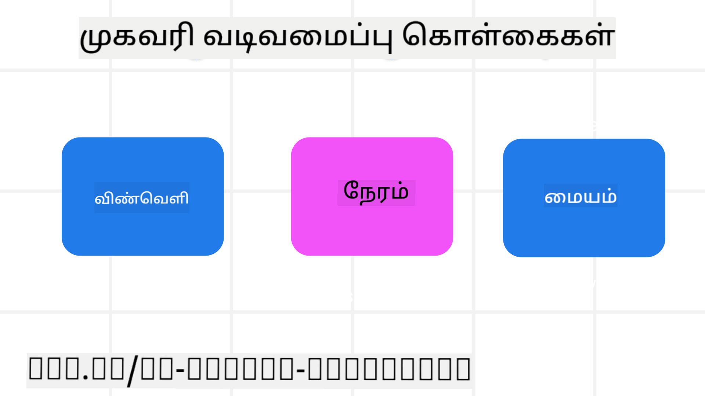

<!--
CO_OP_TRANSLATOR_METADATA:
{
  "original_hash": "4c46e4ff9e349c521e2b0b17f51afa64",
  "translation_date": "2025-10-11T11:20:58+00:00",
  "source_file": "03-agentic-design-patterns/README.md",
  "language_code": "ta"
}
-->

> _(மேலே உள்ள படத்தை கிளிக் செய்து இந்த பாடத்தின் வீடியோவைப் பாருங்கள்)_
# AI முகவர்களின் வடிவமைப்பு கொள்கைகள்

## அறிமுகம்

AI முகவர்களை உருவாக்க பல வழிகள் உள்ளன. Generative AI வடிவமைப்பில் தெளிவின்மை ஒரு பிழை அல்ல, ஆனால் ஒரு அம்சமாக இருப்பதால், பொறியாளர்கள் எங்கு தொடங்குவது என்று கண்டுபிடிக்க சில நேரங்களில் சிரமமாக இருக்கிறது. வாடிக்கையாளர் மையமாக செயல்படும் முகவர்களை உருவாக்குவதற்கான UX வடிவமைப்பு கொள்கைகளை உருவாக்கியுள்ளோம், இது அவர்களின் வணிக தேவைகளை தீர்க்க உதவுகிறது. இந்த வடிவமைப்பு கொள்கைகள் ஒரு கட்டாய கட்டமைப்பாக அல்ல, ஆனால் முகவர் அனுபவங்களை வரையறுத்து உருவாக்கும் குழுக்களுக்கு ஒரு தொடக்க புள்ளியாக உள்ளது.

பொதுவாக, முகவர்கள்:

- மனித திறன்களை விரிவாக்கி, அளவீடு செய்ய வேண்டும் (கலந்துரையாடல், சிக்கல் தீர்வு, தானியங்கி செயல்பாடு, போன்றவை)
- அறிவு இடைவெளிகளை நிரப்ப வேண்டும் (அறிவியல் துறைகள், மொழிபெயர்ப்பு, போன்றவற்றில் எனக்கு விரைவாக உதவி செய்ய வேண்டும்)
- ஒவ்வொருவரும் மற்றவர்களுடன் வேலை செய்ய விரும்பும் முறையில் ஒத்துழைப்பை எளிதாக்கி, ஆதரிக்க வேண்டும்
- நம்மை சிறந்தவர்களாக மாற்ற வேண்டும் (உதாரணமாக, வாழ்க்கை பயிற்சியாளர்/கடமை மேலாளர், நம்மை உணர்ச்சி கட்டுப்பாடு மற்றும் மன அமைதி திறன்களை கற்றுக்கொடுக்க உதவுதல், மன உறுதியை உருவாக்குதல், போன்றவை)

## இந்த பாடத்தில் நீங்கள் கற்றுக்கொள்ளுவது

- முகவர்களின் வடிவமைப்பு கொள்கைகள் என்ன
- இந்த வடிவமைப்பு கொள்கைகளை செயல்படுத்தும்போது பின்பற்ற வேண்டிய வழிகாட்டுதல்கள் என்ன
- இந்த வடிவமைப்பு கொள்கைகளை பயன்படுத்தும் சில உதாரணங்கள் என்ன

## கற்றல் இலக்குகள்

இந்த பாடத்தை முடித்த பிறகு, நீங்கள்:

1. முகவர்களின் வடிவமைப்பு கொள்கைகள் என்ன என்பதை விளக்க முடியும்
2. முகவர்களின் வடிவமைப்பு கொள்கைகளை பயன்படுத்துவதற்கான வழிகாட்டுதல்களை விளக்க முடியும்
3. முகவர்களின் வடிவமைப்பு கொள்கைகளை பயன்படுத்தி ஒரு முகவரை உருவாக்குவது எப்படி என்பதை புரிந்து கொள்ள முடியும்

## முகவர்களின் வடிவமைப்பு கொள்கைகள்

### முகவர் (இடம்)

இது முகவர் செயல்படும் சூழல். இந்த கொள்கைகள் முகவர்களை உட்புற மற்றும் வெளிப்புற உலகங்களில் ஈடுபடுவதற்காக வடிவமைப்பதற்கான வழிகாட்டுதல்களை வழங்குகின்றன.

- **இணைக்கும், சுருக்காமல்** – மக்கள், நிகழ்வுகள் மற்றும் செயல்படக்கூடிய அறிவுடன் இணைக்க உதவுதல், ஒத்துழைப்பை எளிதாக்குதல்.
  - முகவர்கள் நிகழ்வுகள், அறிவு மற்றும் மக்களை இணைக்க உதவுகின்றன.
  - முகவர்கள் மக்களை ஒன்றாக இணைக்கின்றன. அவர்கள் மக்களை மாற்ற அல்லது குறைக்க வடிவமைக்கப்படவில்லை.
- **எளிதாக அணுகக்கூடியது, ஆனால் சில நேரங்களில் மறைந்திருக்கும்** – முகவர் பெரும்பாலும் பின்னணியில் செயல்படுகிறது மற்றும் அது தொடர்புடைய மற்றும் பொருத்தமானது என்றால் மட்டுமே நம்மை தூண்டுகிறது.
  - முகவர் எந்த சாதனத்திலும் அல்லது தளத்திலும் அங்கீகரிக்கப்பட்ட பயனர்களுக்கு எளிதாக கண்டுபிடிக்கக்கூடிய மற்றும் அணுகக்கூடியதாக உள்ளது.
  - முகவர் பலவகை உள்ளீடுகள் மற்றும் வெளியீடுகளை ஆதரிக்கிறது (ஒலி, குரல், உரை, போன்றவை).
  - முகவர் முன்னணி மற்றும் பின்னணி இடையே, செயல்பாட்டிற்கும் எதிர்வினைக்கும் இடையே பயனர் தேவைகளை உணர்ந்து எளிதாக மாற முடியும்.
  - முகவர் மறைந்த வடிவத்தில் செயல்படலாம், ஆனால் அதன் பின்னணி செயல்முறை பாதை மற்றும் பிற முகவர்களுடன் ஒத்துழைப்பு பயனருக்கு வெளிப்படையாகவும் கட்டுப்படுத்தக்கூடியதாகவும் இருக்கும்.

### முகவர் (நேரம்)

இது முகவர் காலத்தின் மீது எப்படி செயல்படுகிறது என்பதை குறிக்கிறது. இந்த கொள்கைகள் கடந்த காலம், நிகழ்காலம் மற்றும் எதிர்காலம் ஆகியவற்றில் முகவர்கள் எப்படி தொடர்பு கொள்ள வேண்டும் என்பதை வடிவமைக்க உதவுகின்றன.

- **கடந்த காலம்**: நிலை மற்றும் சூழலை உள்ளடக்கிய வரலாற்றை பிரதிபலித்தல்.
  - முகவர் நிகழ்வு, மக்கள் அல்லது நிலைகள் மட்டுமின்றி, செறிவான வரலாற்று தரவின் பகுப்பாய்வின் அடிப்படையில் மேலும் பொருத்தமான முடிவுகளை வழங்குகிறது.
  - முகவர் கடந்த நிகழ்வுகளிலிருந்து இணைப்புகளை உருவாக்கி, தற்போதைய சூழலுடன் ஈடுபட நினைவுகளைச் செயல்படுத்துகிறது.
- **இப்போது**: அறிவிப்பதை விட தூண்டுதல்.
  - முகவர் மக்களுடன் தொடர்பு கொள்ள விரிவான அணுகுமுறையை கொண்டுள்ளது. ஒரு நிகழ்வு நடந்தால், முகவர் நிலையான அறிவிப்பு அல்லது பிற நிலையான முறையைத் தாண்டி செயல்படுகிறது. முகவர் செயல்பாடுகளை எளிமைப்படுத்தவோ அல்லது பயனரின் கவனத்தை சரியான தருணத்தில் திருப்புவதற்கான குறிப்புகளை தானாக உருவாக்கவோ முடியும்.
  - முகவர் தகவலை சூழலியல் சூழல், சமூக மற்றும் கலாச்சார மாற்றங்கள் மற்றும் பயனர் நோக்கத்திற்கு ஏற்ப வழங்குகிறது.
  - முகவர் தொடர்பு تدريجيயாக, நீண்ட காலத்தில் பயனர்களை அதிகாரமளிக்க வளர்ந்து/மாறுகிறது.
- **எதிர்காலம்**: தழுவுதல் மற்றும் வளர்ச்சி.
  - முகவர் பல சாதனங்கள், தளங்கள் மற்றும் முறைகளுக்கு தழுவுகிறது.
  - முகவர் பயனர் நடத்தை, அணுகல் தேவைகள் மற்றும் சுதந்திரமாக தனிப்பயனாக்கப்படுவதற்கு தழுவுகிறது.
  - முகவர் தொடர்ச்சியான பயனர் தொடர்பு மூலம் வடிவமைக்கப்படுகிறது மற்றும் வளர்கிறது.

### முகவர் (மையம்)

இவை ஒரு முகவரின் வடிவமைப்பின் முக்கிய கூறுகள்.

- **தெளிவின்மையை ஏற்கவும், ஆனால் நம்பிக்கையை உருவாக்கவும்**.
  - ஒரு குறிப்பிட்ட அளவிலான முகவர் தெளிவின்மை எதிர்பார்க்கப்படுகிறது. தெளிவின்மை முகவர் வடிவமைப்பின் முக்கிய கூறாகும்.
  - நம்பிக்கை மற்றும் வெளிப்படைத்தன்மை முகவர் வடிவமைப்பின் அடிப்படை அடுக்குகளாகும்.
  - முகவர் எப்போது இயக்க/நிறுத்த வேண்டும் என்பதை மனிதர்கள் கட்டுப்படுத்துகின்றனர், மேலும் முகவர் நிலை எப்போதும் தெளிவாக தெரியும்.

## இந்த கொள்கைகளை செயல்படுத்த வழிகாட்டுதல்கள்

முந்தைய வடிவமைப்பு கொள்கைகளை பயன்படுத்தும்போது, பின்வரும் வழிகாட்டுதல்களை பின்பற்றவும்:

1. **வெளிப்படைத்தன்மை**: AI தொடர்புடையது, அது எப்படி செயல்படுகிறது (கடந்த செயல்பாடுகள் உட்பட), மற்றும் கருத்து தெரிவிக்கவும், அமைப்பை மாற்றவும் எப்படி என்பதை பயனருக்கு தெரிவிக்கவும்.
2. **கட்டுப்பாடு**: பயனருக்கு அமைப்பை தனிப்பயனாக்க, விருப்பங்களை குறிப்பிட, மற்றும் அமைப்பு மற்றும் அதன் பண்புகளை கட்டுப்படுத்த (மறக்கவும்) அனுமதிக்கவும்.
3. **நிலைத்தன்மை**: சாதனங்கள் மற்றும் முடிவுகளுக்கு இடையே நிலையான, பலவகை அனுபவங்களை நோக்கி முயற்சிக்கவும். சாத்தியமான இடங்களில் பரிச்சயமான UI/UX கூறுகளை பயன்படுத்தவும் (உதாரணமாக, குரல் தொடர்புக்கு மைக்ரோஃபோன் ஐகான்) மற்றும் வாடிக்கையாளர் மன அழுத்தத்தை ככל முடிந்தவரை குறைக்கவும் (உதாரணமாக, சுருக்கமான பதில்கள், காட்சித் துணைகள், மற்றும் ‘மேலும் கற்றுக்கொள்ள’ உள்ளடக்கம்).

## இந்த கொள்கைகள் மற்றும் வழிகாட்டுதல்களை பயன்படுத்தி ஒரு பயண முகவரை வடிவமைப்பது எப்படி

நீங்கள் ஒரு பயண முகவரை வடிவமைக்கிறீர்கள் என்று கற்பனை செய்யுங்கள், இந்த வடிவமைப்பு கொள்கைகள் மற்றும் வழிகாட்டுதல்களை பயன்படுத்துவது எப்படி என்று இங்கே சிந்திக்கலாம்:

1. **வெளிப்படைத்தன்மை** – பயண முகவர் AI-இயக்கப்பட்ட முகவர் என்பதை பயனருக்கு தெரிவிக்கவும். தொடங்குவதற்கான சில அடிப்படை வழிமுறைகளை வழங்கவும் (உதாரணமாக, ஒரு “வணக்கம்” செய்தி, மாதிரி உத்தேசங்கள்). இதை தயாரிப்பு பக்கத்தில் தெளிவாக ஆவணப்படுத்தவும். பயனர் கடந்த காலத்தில் கேட்ட உத்தேசங்களின் பட்டியலைக் காட்டவும். கருத்து தெரிவிக்க எப்படி (தலைகீழ் மற்றும் மேலே, கருத்து தெரிவிக்கவும் பொத்தானை அனுப்பவும், போன்றவை) தெளிவாக தெரிவிக்கவும். முகவருக்கு பயன்பாடு அல்லது தலைப்பு கட்டுப்பாடுகள் உள்ளதா என்பதை தெளிவாக விளக்கவும்.
2. **கட்டுப்பாடு** – முகவர் உருவாக்கப்பட்ட பிறகு அதை எப்படி மாற்றுவது என்பதை பயனருக்கு தெளிவாக தெரிவிக்கவும், உதாரணமாக, அமைப்பு உத்தேசம் போன்றவை. முகவர் எவ்வளவு விரிவாக இருக்க வேண்டும், அதன் எழுதும் பாணி, மற்றும் முகவர் பேசக்கூடாத தலைப்புகள் போன்றவற்றை தேர்வு செய்ய பயனருக்கு அனுமதி அளிக்கவும். தொடர்புடைய கோப்புகள் அல்லது தரவுகள், உத்தேசங்கள், மற்றும் கடந்த உரையாடல்களைப் பார்க்கவும், நீக்கவும் பயனருக்கு அனுமதி அளிக்கவும்.
3. **நிலைத்தன்மை** – பகிரும் உத்தேசம், கோப்பு அல்லது புகைப்படத்தைச் சேர்க்கவும், மற்றும் ஒருவரை அல்லது ஒன்றை குறிக்கவும் ஆகியவற்றுக்கான ஐகான்கள் நிலையான மற்றும் பரிச்சயமானவை என்பதை உறுதிசெய்க. முகவருடன் கோப்பு பதிவேற்ற/பகிர்வை குறிக்க காகித கிளிப்பை ஐகானை பயன்படுத்தவும், மற்றும் கிராஃபிக்ஸ் பதிவேற்றத்தை குறிக்க பட ஐகானை பயன்படுத்தவும்.

### AI முகவர்களின் வடிவமைப்பு முறைகள் குறித்து மேலும் கேள்விகள் உள்ளதா?

மற்ற கற்றலாளர்களை சந்திக்கவும், அலுவலக நேரங்களில் பங்கேற்கவும், மற்றும் உங்கள் AI முகவர்களின் கேள்விகளுக்கு பதிலளிக்கவும் [Azure AI Foundry Discord](https://aka.ms/ai-agents/discord) இல் சேரவும்.

## கூடுதல் வளங்கள்

- <a href="https://openai.com" target="_blank">Agentic AI அமைப்புகளை நிர்வகிக்க சிறந்த நடைமுறைகள் | OpenAI</a>
- <a href="https://microsoft.com" target="_blank">HAX டூல்கிட் திட்டம் - Microsoft Research</a>
- <a href="https://responsibleaitoolbox.ai" target="_blank">பொறுப்பான AI டூல்பாக்ஸ்</a>

## முந்தைய பாடம்

[Agentic Frameworks ஆராய்வு](../02-explore-agentic-frameworks/README.md)

## அடுத்த பாடம்

[கருவி பயன்பாட்டு வடிவமைப்பு முறை](../04-tool-use/README.md)

---

**குறிப்பு**:  
இந்த ஆவணம் [Co-op Translator](https://github.com/Azure/co-op-translator) என்ற AI மொழிபெயர்ப்பு சேவையைப் பயன்படுத்தி மொழிபெயர்க்கப்பட்டுள்ளது. நாங்கள் துல்லியத்திற்காக முயற்சிக்கின்றோம், ஆனால் தானியக்க மொழிபெயர்ப்புகளில் பிழைகள் அல்லது தவறான தகவல்கள் இருக்கக்கூடும் என்பதை கவனத்தில் கொள்ளவும். அதன் தாய்மொழியில் உள்ள மூல ஆவணம் அதிகாரப்பூர்வ ஆதாரமாக கருதப்பட வேண்டும். முக்கியமான தகவல்களுக்கு, தொழில்முறை மனித மொழிபெயர்ப்பு பரிந்துரைக்கப்படுகிறது. இந்த மொழிபெயர்ப்பைப் பயன்படுத்துவதால் ஏற்படும் எந்த தவறான புரிதல்கள் அல்லது தவறான விளக்கங்களுக்கு நாங்கள் பொறுப்பல்ல.