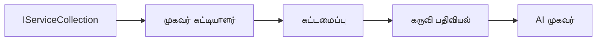

# 🎨 Azure OpenAI (Responses API) உடன் Agentic வடிவமைப்பு மாதிரிகள் (.NET)

## 📋 கற்றல் குறிக்கோள்கள்

இந்த எடுத்துக்காட்டு Microsoft Agent Framework ஐ .NET இல் Azure OpenAI (Responses API) ஒருங்கிணைப்புடன் நுண்ணறிவு முகவர்கள் உருவாக்குவதற்கான தொழிற்சாலை தரம் கொண்ட வடிவமைப்பு மாதிரிகளை வெளிப்படுத்துகிறது. முகவர்கள் தயாரிப்பு சீரமைக்கக்கூடிய, பராமரிக்கக்கூடிய மற்றும் விரிவாக்கக்கூடிய ஆக்குவதற்கான தொழிற்பண்புகளையும் கட்டமைப்பு முறைகளையும் நீங்கள் கற்றுக்கொள்ளுவீர்கள்.

### தொழிற்சாலை வடிவமைப்பு மாதிரிகள்

- 🏭 **Factory Pattern**: சார்புகளின் உள்ளீடு மூலம் ஒருங்கிணைந்த முகவர் உருவாக்கம்
- 🔧 **Builder Pattern**: எளிதில் முகவர்களை அமைக்கும் மற்றும் உருவாக்கும் நடைமுறை
- 🧵 **Thread-Safe Patterns**: ஒரே நேரத்தில் உரையாடலை நிர்வகிப்பதற்கான பாதுகாப்பான முறைகள்
- 📋 **Repository Pattern**: கருவிகள் மற்றும் திறன்களை ஒழுங்குபடுத்தல்

## 🎯 .NET-க்கு தனித்துவமான கட்டமைப்பு நன்மைகள்

### தொழிற்சாலை அம்சங்கள்

- **தீவிரமான টাইப்பிங்**: தொகுத்து நேரத்தில் சரிபார்த்தல் மற்றும் IntelliSense ஆதரவு
- **Dependency Injection**: உட்பிரவேச DI கன்டெய்னர் ஒருங்கிணைப்பு
- **கட்டமைப்பு நிர்வாகம்**: IConfiguration மற்றும் Options மாதிரிகள்
- **Async/Await**: நெருங்கிய சமயத்தில் நிரல் எழுத ஆதரவு

### தயாரிப்பு சீரமைக்கக்கூடிய மாதிரிகள்

- **Logging Integration**: ILogger மற்றும் கட்டமைக்கப்பட்ட பதிவு ஆதரவு
- **Health Checks**: உட்பிரவேச மேற்பார்வை மற்றும் கண்டறிதல்
- **Configuration Validation**: தரவுக் குறிச்சொற்களுடனான தீவிரமான টাইப்பிங்
- **Error Handling**: கட்டமைக்கப்பட்ட தவறு மேலாண்மை

## 🔧 தொழில்நுட்ப கட்டமைப்பு

### βασικά .NET கூறுகள்

- **Microsoft.Extensions.AI**: ஒருங்கிணைந்த AI சேவை தற்போது காட்டல்கள்
- **Microsoft.Agents.AI**: தொழிற்சாலை முகவர் ஒருங்கிணைப்பு கட்டமைப்பு
- **Azure OpenAI (Responses API)**: உயர் செயல்திறனுடைய API கிளையண்ட் மாதிரிகள்
- **கட்டமைப்பு அமைப்பு**: appsettings.json மற்றும் சுற்றுச்சூழல் ஒருங்கிணைப்பு

### வடிவமைப்பு மாதிரி செயல்முறை



## 🏗️ தொழிற்சாலை மாதிரிகள் வரைவில்

### 1. **உருவாக்கும் மாதிரிகள்**

- **Agent Factory**: ஒருங்கிணைந்த முகவர்களை ஒரே இடத்தில் தொடக்கம் செய்தல்
- **Builder Pattern**: கடினமான முகவர் கட்டமைப்புக்கு Fluent API
- **Singleton Pattern**: பங்கிடப்படும் வளங்கள் மற்றும் கட்டமைப்பு நிர்வாகம்
- **Dependency Injection**: இலகுவான இணைப்பு மற்றும் சோதனைக்கான தகுதி

### 2. **நடவடிக்கை மாதிரிகள்**

- **Strategy Pattern**: மாற்றக்கூடிய கருவி செயல்பாட்டு திட்டங்கள்
- **Command Pattern**: மூடல்/திரும்புதல் கொண்ட முகவர் செயல்கள் ஒட்டி நிரப்பல்
- **Observer Pattern**: நிகழ்வு உந்துவோர் முகவர் வாழ்நாள் மேலாண்மை
- **Template Method**: ஒருங்கிணைந்த முகவர் செயல்பாட்டு வேலைப்பாடுகள்    

### 3. **கட்டமைப்புக் மாதிரிகள்**

- **Adapter Pattern**: Azure OpenAI (Responses API) ஒருங்கிணைப்பு அடுக்கு
- **Decorator Pattern**: முகவர் திறன் மேம்பாடு
- **Facade Pattern**: எளிமையான முகவர் தொடர்பு இடைமுகங்கள்
- **Proxy Pattern**: செயல்திறன் மேம்படுத்த அழுக்குண்டு மற்றும் கேசிங்

## 📚 .NET வடிவமைப்பு கோட்பாடுகள்

### SOLID கோட்பாடுகள்

- **ஒரே பொறுப்பு**: ஒவ்வொரு கூறிற்கும் தெளிவான நோக்கம் ஒன்று
- **திறந்திருக்கும்/மூடியது**: மாற்றமின்றி விரிவாக்கக்கூடியது
- **Liskov மாற்றீடு**: இடைமுக அடிப்படையிலான கருவி செயலாக்கங்கள்
- **இடைமுக பிரிவாக்கம்**: கவனிக்கப்பட்ட, ஒருங்கிணைந்த இடைமுகங்கள்
- **சார்பு மாற்று**: முறைமைகள் பற்றிய சார்புகளை அமையல், தெளிவுகளை அல்ல

### தூய்மையான கட்டமைப்பு

- **Domain அடுக்கு**: முக்கிய முகவர் மற்றும் கருவி தற்பாட்டங்கள்
- **Application அடுக்கு**: முகவர் ஒருங்கிணைப்பு மற்றும் வேலைபாடுகள்
- **உள்கட்டமைப்பு அடுக்கு**: Azure OpenAI (Responses API) ஒருங்கிணைப்பு மற்றும் வெளிப்புற சேவைகள்
- **Presentation அடுக்கு**: பயனர் தொடர்பு மற்றும் பதில் வடிவமைப்பு

## 🔒 தொழிற்சாலை கவனத்துவங்கள்

### பாதுகாப்பு

- **அடையாள முகவரி நிர்வாகம்**: IConfiguration உடன் பாதுகாப்பான API விசை கையாள்தல்
- **உள்ளீடு சரிபார்ப்பு**: தீவிரமான டைப்பிங் மற்றும் தரவுக் குறிச்சொல் சரிபார்ப்பு
- **வெளியீடு சுத்திகரிப்பு**: பாதுகாப்பான பதில் செயலாக்கம் மற்றும் வடிகட்டு
- **ஆடிட் பதிவு**: விரிவான செயல்பாட்டு கண்காணிப்பு

### செயல்திறன்

- **Async மாதிரிகள்**: தடையில்லாத I/O செயல்முறைகள்
- **தொடர்பு குளம்**: திறமையான HTTP கிளையண்ட் நிர்வாகம்
- **கேசிங்**: மேம்பட்ட செயல்திறனுக்கான பதில் சேமிப்பு
- **வளம் மேலாண்மை**: சரியான சேகரிப்பு மற்றும் சுத்தம் மேற்பார்வை

### விரிவாக்கக்கூடிய தன்மை

- **Thread பாதுகாப்பு**: ஒரே நேரத்தில் முகவர் செயல்படுதலை ஆதரவு
- **வளம் குளம்**: திறமையான வள பயன்பாடு
- **ஏற்றுமதி மேலாண்மை**: வீதத்தை கட்டுப்படுத்தல் மற்றும் பின்னுறுத்தல் கையாள்தல்
- **மேற்பார்வை**: செயல்திறன் அளவுகோல்களும் உடல்நிலை சோதனைகளும்

## 🚀 தயாரிப்பு முன்னேற்றம்

- **கட்டமைப்பு நிர்வாகம்**: சுற்றுச்சூழல்-சொத்தான அமைப்புகள்
- **பதிவு நடைமுறை**: ஒத்திசைவுள்ள பதிவுகள் மற்றும் தொடர்புடைய ஐடிஸ்
- **தவறு மேலாண்மை**: சிறந்த மீட்பு கொண்ட גלובל தவறு மேலாண்மை
- **மேற்பார்வை**: செயலி பார்வைகள் மற்றும் செயல்திறன் அளவைகளை கண்காணித்தல்
- **சோதனை**: அலகு சோதனைகள், ஒருங்கிணைப்பு சோதனைகள் மற்றும் அதிகப்படியான சோதனை மாதிரிகள்

.NET உடன் தொழிற்சாலை தர நுண்ணறிவு முகவர்களை உருவாக்க தயாரா? வலுவான ஒரு கட்டமைப்பை உருவாக்கலாம்! 🏢✨

## 🚀 தொடக்க வழிகாட்டி

### முன்னோக்குக் கூறுகள்

- [.NET 10 SDK](https://dotnet.microsoft.com/download/dotnet/10.0) அல்லது அதற்கு மேல்
- [Azure சந்தா](https://azure.microsoft.com/free/) Azure OpenAI வளத்துடன் மற்றும் மாதிரி வெளியீடு ஒன்றுடன்
- [Azure CLI](https://learn.microsoft.com/cli/azure/install-azure-cli) — `az login` கொண்டு உள் நுழையவும்

### தேவையான சுற்றுச்சூழல் மாறிலிகள்

```bash
# zsh/bash
export AZURE_OPENAI_ENDPOINT=https://<your-resource>.openai.azure.com
export AZURE_OPENAI_DEPLOYMENT=gpt-4o-mini
# பிறகு AzureCliCredential ஒரு டோக்கனைப் பெற உள்நுழையவும்
az login
```

```powershell
# பவர்ஷெல்
$env:AZURE_OPENAI_ENDPOINT = "https://<your-resource>.openai.azure.com"
$env:AZURE_OPENAI_DEPLOYMENT = "gpt-4o-mini"
# பின்னர், AzureCliCredential டோக்கன் பெற உள்நுழையவும்
az login
```

### மாதிரி குறியீடு

குறியீடு எடுத்துக்காட்டை இயக்க,

```bash
# zsh/bash
chmod +x ./03-dotnet-agent-framework.cs
./03-dotnet-agent-framework.cs
```

அல்லது dotnet CLI பயன்படுத்தி:

```bash
dotnet run ./03-dotnet-agent-framework.cs
```

முழுமையான குறியீட்டுக்கான [`03-dotnet-agent-framework.cs`](../../../../03-agentic-design-patterns/code_samples/03-dotnet-agent-framework.cs) ஐ பார்.

```csharp
#!/usr/bin/dotnet run

#:package Microsoft.Extensions.AI@10.*
#:package Microsoft.Agents.AI.OpenAI@1.*-*
#:package Azure.AI.OpenAI@2.1.0
#:package Azure.Identity@1.13.1

using System.ComponentModel;

using Microsoft.Agents.AI;
using Microsoft.Extensions.AI;

using Azure.AI.OpenAI;
using Azure.Identity;

// Tool Function: Random Destination Generator
// This static method will be available to the agent as a callable tool
// The [Description] attribute helps the AI understand when to use this function
// This demonstrates how to create custom tools for AI agents
[Description("Provides a random vacation destination.")]
static string GetRandomDestination()
{
    // List of popular vacation destinations around the world
    // The agent will randomly select from these options
    var destinations = new List<string>
    {
        "Paris, France",
        "Tokyo, Japan",
        "New York City, USA",
        "Sydney, Australia",
        "Rome, Italy",
        "Barcelona, Spain",
        "Cape Town, South Africa",
        "Rio de Janeiro, Brazil",
        "Bangkok, Thailand",
        "Vancouver, Canada"
    };

    // Generate random index and return selected destination
    // Uses System.Random for simple random selection
    var random = new Random();
    int index = random.Next(destinations.Count);
    return destinations[index];
}

// Azure OpenAI with the Responses API (stable v1 endpoint). Sign in with `az login`.
var azureEndpoint = Environment.GetEnvironmentVariable("AZURE_OPENAI_ENDPOINT")
    ?? throw new InvalidOperationException("AZURE_OPENAI_ENDPOINT is not set.");
var deployment = Environment.GetEnvironmentVariable("AZURE_OPENAI_DEPLOYMENT") ?? "gpt-4o-mini";

var azureClient = new AzureOpenAIClient(new Uri(azureEndpoint), new AzureCliCredential());

// Define Agent Identity and Comprehensive Instructions
// Agent name for identification and logging purposes
var AGENT_NAME = "TravelAgent";

// Detailed instructions that define the agent's personality, capabilities, and behavior
// This system prompt shapes how the agent responds and interacts with users
var AGENT_INSTRUCTIONS = """
You are a helpful AI Agent that can help plan vacations for customers.

Important: When users specify a destination, always plan for that location. Only suggest random destinations when the user hasn't specified a preference.

When the conversation begins, introduce yourself with this message:
"Hello! I'm your TravelAgent assistant. I can help plan vacations and suggest interesting destinations for you. Here are some things you can ask me:
1. Plan a day trip to a specific location
2. Suggest a random vacation destination
3. Find destinations with specific features (beaches, mountains, historical sites, etc.)
4. Plan an alternative trip if you don't like my first suggestion

What kind of trip would you like me to help you plan today?"

Always prioritize user preferences. If they mention a specific destination like "Bali" or "Paris," focus your planning on that location rather than suggesting alternatives.
""";

// Create AI Agent with Advanced Travel Planning Capabilities
// Get the Responses client for the deployment and create the AI agent
// Configure agent with name, detailed instructions, and available tools
// This demonstrates the .NET agent creation pattern with full configuration
AIAgent agent = azureClient
    .GetOpenAIResponseClient(deployment)
    .CreateAIAgent(
        name: AGENT_NAME,
        instructions: AGENT_INSTRUCTIONS,
        tools: [AIFunctionFactory.Create(GetRandomDestination)]
    );

// Create New Conversation Thread for Context Management
// Initialize a new conversation thread to maintain context across multiple interactions
// Threads enable the agent to remember previous exchanges and maintain conversational state
// This is essential for multi-turn conversations and contextual understanding
AgentThread thread = agent.GetNewThread();

// Execute Agent: First Travel Planning Request
// Run the agent with an initial request that will likely trigger the random destination tool
// The agent will analyze the request, use the GetRandomDestination tool, and create an itinerary
// Using the thread parameter maintains conversation context for subsequent interactions
await foreach (var update in agent.RunStreamingAsync("Plan me a day trip", thread))
{
    await Task.Delay(10);
    Console.Write(update);
}

Console.WriteLine();

// Execute Agent: Follow-up Request with Context Awareness
// Demonstrate contextual conversation by referencing the previous response
// The agent remembers the previous destination suggestion and will provide an alternative
// This showcases the power of conversation threads and contextual understanding in .NET agents
await foreach (var update in agent.RunStreamingAsync("I don't like that destination. Plan me another vacation.", thread))
{
    await Task.Delay(10);
    Console.Write(update);
}
```

---

<!-- CO-OP TRANSLATOR DISCLAIMER START -->
**மறுப்பு**:
இந்த ஆவணம் AI மொழிபெயர்ப்பு சேவை [Co-op Translator](https://github.com/Azure/co-op-translator) பயன்படுத்தி மொழிபெயர்க்கப்பட்டுள்ளது. நாங்கள் துல்லியத்திற்காக முயற்சி செய்துள்ளோம், ஆனால் தானாக செய்யப்படும் மொழிபெயர்ப்புகளில் பிழைகள் அல்லது தவறுகள் இருக்கலாம் என்பதை கவனத்தில் கொள்ளவும். அசல் ஆவணம் அதன் தாய்மொழியில் அதிகாரப்பூர்வ ஆதாரமாக கருதப்பட வேண்டும். முக்கியமான தகவல்களுக்கு, தொழில்நுட்பமான மனித மொழிபெயர்ப்பு பரிந்துரைக்கப்படுகிறது. இந்த மொழிபெயர்ப்பைப் பயன்படுத்துவதால் ஏற்படும் எந்த தவறான புரிதல்கள் அல்லது தவறான விளக்கத்திற்கும் நாங்கள் பொறுப்பில்வில்லை.
<!-- CO-OP TRANSLATOR DISCLAIMER END -->