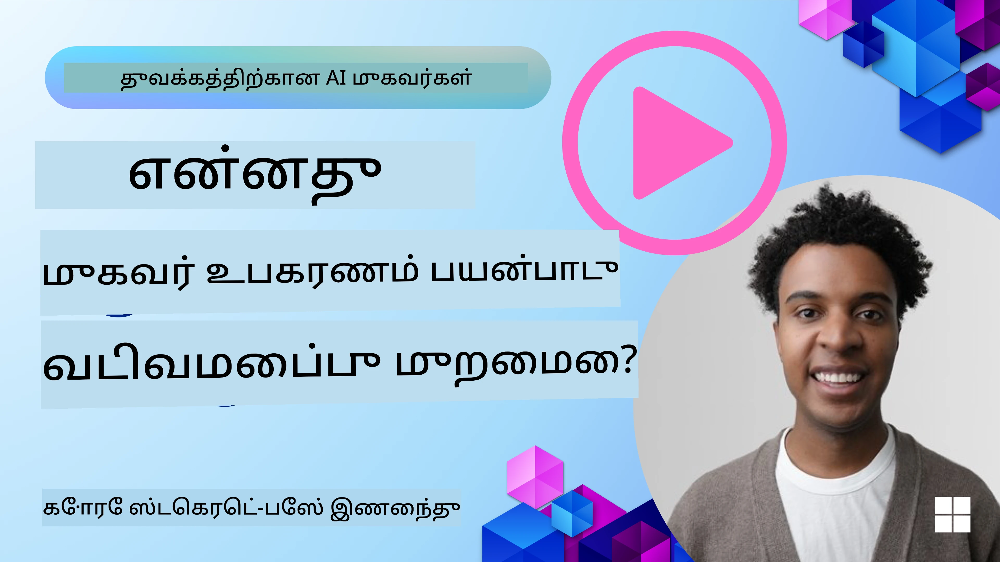
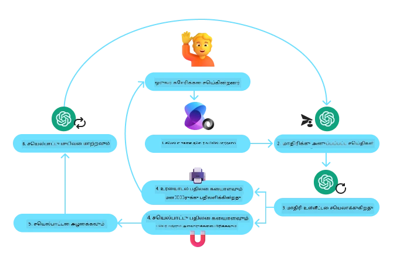
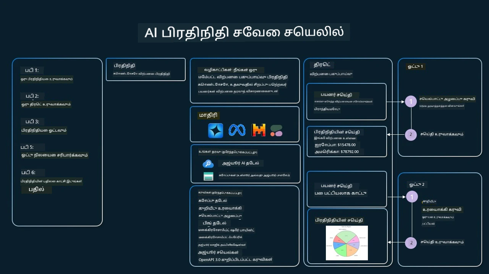

[](https://youtu.be/vieRiPRx-gI?si=cEZ8ApnT6Sus9rhn)

> _(இந்த பாடத்தின் வீடியோக்களைப் பார்க்க மேல் உள்ள படத்தை கிளிக் செய்யவும்)_

# கருவி பயன்பாட்டுக் வடிவமைப்பு முறை

கருவிகள் சுவாரஸ்யமானவை, ஏனெனில் அவை AI முகவர்களுக்கு விரிவான திறன்களை அனுமதிக்கின்றன. முகவர் செய்யக்கூடிய குறிக்கப்பட்ட செயல்களின் தொகுப்பிற்கு பதிலாக, ஒரு கருவியைச் சேர்ப்பதன் மூலம், முகவர் இப்போது பரவலான செயல்களை செய்ய இயலும். இந்த அதிகாரத்தில், AI முகவர்கள் தங்கள் இலக்குகளைச் சாதிக்க குறிப்பிட்ட கருவிகளை எப்படி பயன்படுத்தலாம் என்பதைக் குறிக்கும் கருவி பயன்பாட்டுக் வடிவமைப்பு முறையை பார்ப்போம்.

## அறிமுகம்

இந்த பாடத்தில் நாம் பின்வரும் கேள்விகளுக்கு பதில் காண முயற்சிக்கிறோம்:

- கருவி பயன்பாட்டுக் வடிவமைப்பு முறை என்றால் என்ன?
- இது எந்த பயன்பாடுகளில் பயன்படுத்தப்படலாம்?
- வடிவமைப்பு முறையை செயல்படுத்த தேவையான கூறுகள்/கட்டுமானகல் என்ன?
- நம்பகமான AI முகவர்களை உருவாக்க கருவி பயன்பாட்டுக் வடிவமைப்பு முறையை பயன்படுத்துவதில் പ്രത്യേക கவனிக்க வேண்டியவை என்ன?

## கற்றல் இலக்குகள்

இந்த பாடத்தை முடித்த பிறகு, நீங்கள் செய்யக்கூடியவை:

- கருவி பயன்பாட்டுக் வடிவமைப்பு முறை மற்றும் அதன் நோக்கத்தை வரையறுத்தல்.
- கருவி பயன்பாட்டுக் வடிவமைப்பு முறை பொருந்தும் பயன்பாடுகளை அடையாளம் காணுதல்.
- வடிவமைப்பு முறையை செயல்படுத்த தேவையான முக்கிய கூறுகளை புரிந்து கொள்வது.
- இந்த வடிவமைப்பு முறையைப் பயன்படுத்தும் AI முகவர்களில் நம்பகத்தன்மை உறுதிப்படுத்த தேவையான கவனிக்கப்பட வேண்டிய அம்சங்களை அறிதல்.

## கருவி பயன்பாட்டுக் வடிவமைப்பு முறை என்றால் என்ன?

**கருவி பயன்பாட்டுக் வடிவமைப்பு முறை** LLM-களுக்கு குறிப்பிட்ட இலக்குகளை அடைய வெளிப்புற கருவிகளுடன் தொடர்பு கொள்ளும் திறனை அளிப்பதில் கவனம் செலுத்துகிறது. கருவிகள் என்பது முகவர் செயல்படுத்தக்கூடிய செயல்கள். ஒரு கருவி ஒரு கணக்குப்படுத்தி போன்ற எளிய செயலாக்கம் அல்லது பங்குச் சந்தை விலை தேடல், காலநிலை தகவல் போன்ற மூன்றாம் தரப்புச் சேவைக்கு API அழைப்பு ஆக இருக்கலாம். AI முகவர்களின் சூழலில், கருவிகள் **மாதிரி-உருவாக்கப்படுவோர் செயல்பாட்டு அழைப்புகளுக்கு** பதிலளிப்பதற்காக முகவர்களால் செயல்படுத்தப்பட வடிவமைக்கப்படுகின்றன.

## இது எந்த பயன்பாடுகளில் பயன்படுத்தப்படலாம்?

AI முகவர்கள் சிக்கலான பணிகளை முடிக்க, தகவல்களை பெற, அல்லது முடிவுகளை எடுக்க கருவிகளைப் பயன்படுத்தலாம். கருவி பயன்பாட்டுக் வடிவமைப்பு முறை பொதுவாக, தரவுத்தளங்கள், வலை சேவைகள் அல்லது குறியீடு விளக்கிகள் போன்ற வெளிப்புற அமைப்புகளுடன் உற்சாகமான தொடர்பு தேவைப்படும் சூழல்களில் பயன்படுத்தப்படுகிறது. இந்த திறன் பல்வேறு பயன்பாடுகளில் பயனுள்ளதாக உள்ளது, அவை:

- **கட்டமைக்கக்கூடிய தகவல் மீட்பு:** முகவர்கள் தெறித்து வரும் தரவுகளை பெற வெளிப்புற APIs அல்லது தரவுத்தளங்களை கேள்வி செய்யலாம் (எ.கா., தரவுகள் பகுப்பாய்வுக்காக SQLite தரவுத்தளத்தை கேள்வி செய்தல், பங்கு விலை அல்லது காலநிலை தகவல் பெறல்).
- **குறியீடு இயக்கம் மற்றும் விளக்கம்:** முகவர்கள் கணிதப் பிரச்சனைகளை தீர்க்க, அறிக்கை உருவாக்க, அல்லது சிமுலேஷன்களை செய்ய குறியீடு அல்லது ஸ்கிரிப்ட்களை இயக்கலாம்.
- **வேலைமேற்பாட்டுத் தானியங்கி:** பணிகளை திட்டமிடும் கருவிகள், மின்னஞ்சல் சேவைகள், தரவு குழாய்கள் போன்ற கருவிகளை ஒருங்கிணைத்து பல அடுக்கு அல்லது மீண்டும் மீண்டும் செய்யவேண்டிய வேலைநிரலை தானியங்கி செய்யல்.
- **வாடிக்கையாளர் ஆதரவு:** CRM அமைப்புகள், டிக்கெட் தளங்கள் அல்லது அறிவு ஆதாரங்களுடன் தொடர்பு கொண்டு பயனர் கேள்விகளுக்கு பதிலளித்தல்.
- **உள்ளடக்க உருவாக்கம் மற்றும் தொகுப்பு:** உரை குறைந்துகோள்ப்பவர்கள், உரை சுருக்கிகள் அல்லது உள்ளடக்க பாதுகாப்பு மதிப்பீட்டாளர்கள் போன்ற கருவிகளை பயன்படுத்தி உள்ளடக்கம் உருவாக்க உதவி.

## கருவி பயன்பாட்டுக் வடிவமைப்பு முறையை செயல்படுத்த தேவையான கூறுகள்/கட்டுமானங்கள் என்ன?

இந்த கட்டுமானங்கள் AI முகவர்களுக்கு பரவலான பணிகளைச் செய்ய உதவுகின்றன. கருவி பயன்பாட்டுக் வடிவமைப்பு முறையை செயல்படுத்த தேவையான முக்கிய கூறுகள்:

- **செயல்பாடு/கருவி விளக்கப்படிகள்**: செயல்பாடுகளின் பெயர், நோக்கம், தேவையான அளவுருக்கள் மற்றும் எதிர்பார்க்கப்படும் வெளியீடுகளுடன் கொண்ட விரிவான கருவி வரையறைகள். இவை LLMக்கு எந்த கருவிகள் உள்ளன என்று புரிந்து கொண்டு சரியான கோரிக்கைகளை உருவாக்க உதவுகின்றன.

- **செயல்பாடு செயலாக்கத் துறைமுகம்**: பயனர் ஆசையை மற்றும் உரையாடல் சூழலைப் பொறுத்து கருவிகளை எப்போது மற்றும் எப்படி அழைப்பது என்பதைக் கட்டுப்படுத்தும் திட்டமிடல், வழி நிர்வாகம், அல்லது நிபந்தனை அடிப்படையிலான ஓட்டங்கள் போன்றவை இதனை அடக்கம் செய்கின்றன.

- **செய்தி கையாளல் சிஸ்டம்**: பயனர் உள்ளீடுகள், LLM பதில்கள், கருவி அழைப்புகள் மற்றும் வெளியீடுகளுக்கு இடையேயான உரையாடல் ஓட்டத்தை நிர்வகிக்கும் கூறுகள்.

- **கருவி ஒருங்கிணைப்பு கட்டமைப்பு**: முகவரைக் கருவிகளுடன் இணைக்கும் கட்டமைப்பு, எது எளிய செயல்பாடுகளோ அல்லது கடுமையான வெளிப்புற சேவைகளோ ஆனாலும்.

- **பிழை கையாளல் மற்றும் சரிபார்த்தல்**: கருவி செயல்பாட்டில் தோல்விகள், அளவுருக்கள் சரிபார்ப்பு மற்றும் எதிர்பாராத பதில்களை கையாளும் முறைகள்.

- **நிலை மேலாண்மை**: உரையாடல் சூழல், முந்தைய கருவி தொடர்புகள் மற்றும் நிலைத்த தரவை தடவுகிறது; பலமுறை உரையாடல்களின் தலைமை ஒத்திசைவை உறுதி செய்கிறது.

அடுத்ததாக, செயல்பாடு/கருவி அழைப்பைப் பற்றி விரிவாக பார்ப்போம்.

### செயல்பாடு/கருவி அழைப்பு

செயல்பாடு அழைப்பு என்பது LLMகளுக்கு கருவிகளுடன் தொடர்பு கொள்ள முதன்மையான வழி. "செயல்பாடு" மற்றும் "கருவி" என்ற சொற்கள் ஒரே பொருளில் பயன்படுத்தப்படலாம், ஏனெனில் 'செயல்பாடுகள்' (மீள பயன் பெற்றுக்கொள்ளக்கூடிய குறியீட்டு தொகுதிகள்) என்பது முகவர்கள் பணிகளைச் செய்ய பயன்படுத்தும் 'கருவிகள்' ஆகும். ஒரு செயல்பாட்டின் குறியீட்டை அழைக்க LLM பயனர் கோரிக்கையை செயல்பாடுகளின் விளக்கம் தொடர்பாக ஒப்பிடவேண்டும். எல்லா செயல்பாடுகளின் விளக்கங்களை ஒருங்கிணைக்கும் வரையறை தொகுப்பை (schema) LLMக்கு அனுப்புகிறோம். LLM அதன் பணிக்கேற்ற சிறந்த செயல்பாட்டைத் தேர்ந்தெடுத்து, பெயர் மற்றும் அளவுருக்களை அனுப்புகிறது. தேர்ந்தெடுக்கப்பட்ட செயல்பாடு இயக்கப்படுகிறது; அதன் பதில் LLMக்கு அனுப்பப்படுகிறது; அதனால் LLM பயனரின் கோரிக்கைக்கு பதிலளிக்க உதவுகிறது.

முகவர்களுக்கு செயல்பாடு அழைப்பை செயல்படுத்த டெவலப்பர்கள் தேவையானவை:

1. செயல்பாடு அழைப்பை ஆதரிக்கும் LLM மாதிரி
2. செயல்பாடு விளக்கங்களைக் கொண்ட வரையறை தொகுப்பு
3. விளக்கப்பட்ட ஒவ்வொரு செயல்பாடுக்கும் குறியீடு

சென்னையில் தற்போதைய நேரத்தை பெறுவதற்கான உதாரணத்தைப் பார்ப்போம்:

1. **செயல்பாடு அழைப்பை ஆதரிக்கும் LLM ஐத் தொடக்கம் செய்யவும்:**

    எல்லா மாதிரிகளும் செயல்பாடு அழைப்பை ஆதரிப்பதில்லை, ஆகவே நீங்கள் பயன்படுத்தும் LLM இதை ஆதரிக்கிறதா என்பதை சரிபார்க்க வேண்டும். <a href="https://learn.microsoft.com/azure/ai-services/openai/how-to/function-calling" target="_blank">Azure OpenAI</a> செயல்பாடு அழைப்பை ஆதரிக்கிறது. நாங்கள் Azure OpenAI கிளையண்டைப் ஆரம்பிக்கலாம்.

    ```python
    # Azure OpenAI கிளையண்டைத் தொடங்கவும்
    client = AzureOpenAI(
        azure_endpoint = os.getenv("AZURE_AI_PROJECT_ENDPOINT"), 
        api_key=os.getenv("AZURE_OPENAI_API_KEY"),  
        api_version="2024-05-01-preview"
    )
    ```

1. **செயல்பாடு விளக்கப்படியை உருவாக்கவும்:**

    அடுத்ததாக செயல்பாட்டின் பெயர், அதன் செயல் விளக்கம், செயல்பாட்டின் அளவுருக்களின் பெயர்கள் மற்றும் விளக்கங்களையும் கொண்ட JSON வரையறை உாமை செய்கின்றோம்.
    பின்னர் இதை கடந்த தடவை உருவாக்கிய கிளையண்டிற்கு மற்றும் பயனர் ‘San Francisco இல் நேரம் என்ன?’ என்ற கோரிக்கைக்கான அளவுருக்களுடன் அனுப்புவோம். முக்கியமாக, **கருவி அழைப்பு** திருப்பி வருகிறது, **கேள்விக்கு இறுதி பதில் இல்லை**. முன்பே கூறியபடி, LLM தேர்ந்தெடுத்த செயல்பாட்டின் பெயரை மற்றும் அளவுருக்களை தவிர வேறு எதுவும் திருப்பி அளிக்காது.

    ```python
    # மாடல் வாசிக்க செயல்பாடு விளக்கம்
    tools = [
        {
            "type": "function",
            "function": {
                "name": "get_current_time",
                "description": "Get the current time in a given location",
                "parameters": {
                    "type": "object",
                    "properties": {
                        "location": {
                            "type": "string",
                            "description": "The city name, e.g. San Francisco",
                        },
                    },
                    "required": ["location"],
                },
            }
        }
    ]
    ```
   
    ```python
  
    # ஆரம்ப பயனர் செய்தி
    messages = [{"role": "user", "content": "What's the current time in San Francisco"}] 
  
    # முதல் API அழைப்பு: செயலியை பயன்படுத்த மாடலை கேடு
      response = client.chat.completions.create(
          model=deployment_name,
          messages=messages,
          tools=tools,
          tool_choice="auto",
      )
  
      # மாடலின் பதிலை செயலாக்கு
      response_message = response.choices[0].message
      messages.append(response_message)
  
      print("Model's response:")  

      print(response_message)
  
    ```

    ```bash
    Model's response:
    ChatCompletionMessage(content=None, role='assistant', function_call=None, tool_calls=[ChatCompletionMessageToolCall(id='call_pOsKdUlqvdyttYB67MOj434b', function=Function(arguments='{"location":"San Francisco"}', name='get_current_time'), type='function')])
    ```
  
1. **பணியைச் செய்ய தேவையான செயல்பாடு குறியீடு:**

    இப்போது LLM வேண்டிய செயல்பாட்டைத் தேர்ந்தெடுத்திருப்பதால், பணியைச் செய்வதற்கான குறியீட்டை செயல்படுத்தி இயக்கவேண்டும்.
    Python-ல் நகரத்தின் தற்போதைய நேரத்தைப் பெற குறியீட்டை எழுதலாம். மேலும், பதிலிலிருந்து பெயர் மற்றும் அளவுருக்களை எடுத்து இறுதி முடிவை பெறும் குறியீட்டை எழுத வேண்டியிருக்கும்.

    ```python
      def get_current_time(location):
        """Get the current time for a given location"""
        print(f"get_current_time called with location: {location}")  
        location_lower = location.lower()
        
        for key, timezone in TIMEZONE_DATA.items():
            if key in location_lower:
                print(f"Timezone found for {key}")  
                current_time = datetime.now(ZoneInfo(timezone)).strftime("%I:%M %p")
                return json.dumps({
                    "location": location,
                    "current_time": current_time
                })
      
        print(f"No timezone data found for {location_lower}")  
        return json.dumps({"location": location, "current_time": "unknown"})
    ```

     ```python
     # செயல்பாட்டு அழைப்புகளை கையாளவும்
      if response_message.tool_calls:
          for tool_call in response_message.tool_calls:
              if tool_call.function.name == "get_current_time":
     
                  function_args = json.loads(tool_call.function.arguments)
     
                  time_response = get_current_time(
                      location=function_args.get("location")
                  )
     
                  messages.append({
                      "tool_call_id": tool_call.id,
                      "role": "tool",
                      "name": "get_current_time",
                      "content": time_response,
                  })
      else:
          print("No tool calls were made by the model.")  
  
      # இரண்டாவது API அழைப்பு: மாதிரியில் இருந்து இறுதி பதிலை பெறவும்
      final_response = client.chat.completions.create(
          model=deployment_name,
          messages=messages,
      )
  
      return final_response.choices[0].message.content
     ```

     ```bash
      get_current_time called with location: San Francisco
      Timezone found for san francisco
      The current time in San Francisco is 09:24 AM.
     ```
  
செயல்பாடு அழைப்பு பெரும்பாலான, அல்லது அனைத்து முகவர் கருவி பயன்பாட்டுக் வடிவமைப்புகளின் மையமாக உள்ளது; இருப்பினும் இதை ஆரம்பத்திலிருந்து செயல்படுத்துவது சிரமம் தரக்கூடும்.  
[பாடம் 2](../../../02-explore-agentic-frameworks)ல் கற்றபடி, முகவர் கட்டமைப்புக்கள் முறைகளை முன்கூட்டியே கொடுத்து கருவி பயன்பாட்டை எளிதாக்குகின்றன.

## முகவர் கட்டமைப்புகளுடன் கருவி பயன்பாட்டு உதாரணங்கள்

வெவ்வேறு முகவர் கட்டமைப்புகளைப் பயன்படுத்தி கருவி பயன்பாட்டுக் வடிவமைப்பு முறையை எவ்வாறு செயல்படுத்தலாம் என சில உதாரணங்கள்:

### Microsoft முகவர் கட்டமைப்பு

<a href="https://learn.microsoft.com/azure/ai-services/agents/overview" target="_blank">Microsoft Agent Framework</a> என்பது AI முகவர்களை உருவாக்கும் திறந்தவெளி கட்டமைப்பு. இது `@tool` அலங்கார இயக்கி உடன் Python செயல்பாடுகளை கருவிகளாக வரையறுத்து, செயல்பாடு அழைப்பை எளிமைப்படுத்துகிறது. மாதிரி செயல் மற்றும் குறியீட்டிற்கு இடையேயான தொடர்பை இது பராமரிக்கிறது. மேலும், `AzureAIProjectAgentProvider` வழியாக கோப்பு தேடல் மற்றும் குறியீடு விளக்கி போன்ற முன்-கட்டமைக்கப்பட்ட கருவிகளுக்கு அணுகலை வழங்குகிறது.

கீழே Microsoft Agent Framework இல் செயல்பாடு அழைப்பின் செயல்முறை விளக்கப்படம்:



Microsoft Agent Framework இல் கருவிகள் அலங்காரப்படுத்தப்பட்ட செயல்பாடுகளாக வரையறுக்கப்படுகின்றன. முன்பு பார்த்த `get_current_time` செயல்பாட்டை `@tool` அலங்காரத்தைப் பயன்படுத்தி கருவியாக மாற்ற முடியும். கட்டமைப்பு தானாகவே செயல்பாடு மற்றும் அதன் அளவுருக்களை குறியாக்கி LLMக்கு அனுப்பும் வரையறையை உருவாக்கும்.

```python
from agent_framework import tool
from agent_framework.azure import AzureAIProjectAgentProvider
from azure.identity import AzureCliCredential

@tool
def get_current_time(location: str) -> str:
    """Get the current time for a given location"""
    ...

# கிளையன்டைக் உருவாக்கவும்
provider = AzureAIProjectAgentProvider(credential=AzureCliCredential())

# ஒரு முகவர் உருவாக்கி கருவியுடன் ஓட்டவும்
agent = await provider.create_agent(name="TimeAgent", instructions="Use available tools to answer questions.", tools=get_current_time)
response = await agent.run("What time is it?")
```
  
### Azure AI Agent சேவை

<a href="https://learn.microsoft.com/azure/ai-services/agents/overview" target="_blank">Azure AI Agent Service</a> என்பது உருவாக்குநர்களுக்கு பாதுகாப்பாக உயர்தர மற்றும் விரிவாக்கக்கூடிய AI முகவர்கள் உருவாக்க அனுமதிக்கும் சமீபத்திய முகவர் கட்டமைப்பு ஆகும். அடிப்படை கணினி மற்றும் சேமிப்பு வளங்களை நிர்வகிக்க தேவையில்லை, எனவே இது தொழில்முறை பயன்பாடுகளுக்கு மிகவும் பயனுள்ளதாக உள்ளது.

நேரடியாக LLM API-யுடன் உருவாக்குவதைவிட, Azure AI Agent Service கொடுக்கும் சில நன்மைகள்:

- தானாக கருவி அழைப்பு - கருவி அழைப்பை பின்னர் பிரித்து, கருவியை இயக்கி பதிலை கையாள தேவையில்லை; எல்லாம் சேவையகப்புறம் நடைபெறும்
- பாதுகாப்பான தரவு நிர்வாகம் - உரையாடல் நிலையை நீங்கள் நிர்வகிக்காமல், வரிசைகள் மூலமாக அனைத்து தகவல்களையும் சேமிக்க முடியும்
- உடனடி தயாராக உள்ள கருவிகள் – Bing, Azure AI Search, Azure Functions போன்ற தரவுத்தளங்களுடன் தொடர்பு கொள்ள பயன்படும் கருவிகள்.

Azure AI Agent Service இல் கிடைக்கும் கருவிகள் இரண்டு வகைகளாக பிரிக்கப்படுகின்றன:

1. அறிவு கருவிகள்:
    - <a href="https://learn.microsoft.com/azure/ai-services/agents/how-to/tools/bing-grounding?tabs=python&pivots=overview" target="_blank">Bing Search உடன் அடித்தளம் அமைத்தல்</a>
    - <a href="https://learn.microsoft.com/azure/ai-services/agents/how-to/tools/file-search?tabs=python&pivots=overview" target="_blank">கோப்பு தேடல்</a>
    - <a href="https://learn.microsoft.com/azure/ai-services/agents/how-to/tools/azure-ai-search?tabs=azurecli%2Cpython&pivots=overview-azure-ai-search" target="_blank">Azure AI Search</a>

2. செயல்பாட்டு கருவிகள்:
    - <a href="https://learn.microsoft.com/azure/ai-services/agents/how-to/tools/function-calling?tabs=python&pivots=overview" target="_blank">செயல்பாடு அழைப்பு</a>
    - <a href="https://learn.microsoft.com/azure/ai-services/agents/how-to/tools/code-interpreter?tabs=python&pivots=overview" target="_blank">குறியீடு விளக்கி</a>
    - <a href="https://learn.microsoft.com/azure/ai-services/agents/how-to/tools/openapi-spec?tabs=python&pivots=overview" target="_blank">OpenAPI வரையறுக்கப்பட்ட கருவிகள்</a>
    - <a href="https://learn.microsoft.com/azure/ai-services/agents/how-to/tools/azure-functions?pivots=overview" target="_blank">Azure Functions</a>

Agent சேவையினால் இந்த கருவிகளைப் `toolset` ஆகப் பயன்படுத்த முடிகிறது. மேலும் ஒரு உரையாடலின் செய்தி வரலாற்றை கவனிக்கும் `threads` கண்டுபிடிக்கப்பட்டது.

நீங்கள் Contoso என்ற நிறுவனத்தில் ஒரு விற்பனை முகவர் என்று கற்பனை செய்யவும். உங்கள் விற்பனை தரவுகளைப் பற்றி கேள்விகளுக்கு பதிலளிக்கும் உரையாடல் முகவரியை உருவாக்க விரும்புகிறீர்கள்.

Azure AI Agent Service-ஐ பயன்படுத்தி உங்கள் விற்பனை தரவை பகுப்பாய்வு செய்வது எப்படி என்பது கீழே விளக்கப்படம்:



சேவையுடன் எந்த கருவியையும் பயன்படுத்த, கிளையண்டை உருவாக்கி கருவி அல்லது கருவிசேட்டை வரையறுக்கலாம். கீழேயுள்ள Python குறியீடு அதற்கான செயல்முறையை காட்டுகிறது. LLM கருவிசேட்டை பார்த்து பயனர் `fetch_sales_data_using_sqlite_query` என்ற செயல்பாட்டை அல்லது முன்-கட்டமைக்கப்பட்ட குறியீடு விளக்கியைப் பயன்படுத்தத் தீர்மானிக்கலாம்.

```python 
import os
from azure.ai.projects import AIProjectClient
from azure.identity import DefaultAzureCredential
from fetch_sales_data_functions import fetch_sales_data_using_sqlite_query # fetch_sales_data_using_sqlite_query என்ற செயற்கூறு which fetch_sales_data_functions.py கோப்பில் காணலாம்.
from azure.ai.projects.models import ToolSet, FunctionTool, CodeInterpreterTool

project_client = AIProjectClient.from_connection_string(
    credential=DefaultAzureCredential(),
    conn_str=os.environ["PROJECT_CONNECTION_STRING"],
)

# கருவி தொகுப்பை துவக்கம் செய்க
toolset = ToolSet()

# fetch_sales_data_using_sqlite_query செயல்பாட்டுடன் function calling agent-ஐ துவங்கி அதை கருவி தொகுப்புக்கு சேர்க்கவும்
fetch_data_function = FunctionTool(fetch_sales_data_using_sqlite_query)
toolset.add(fetch_data_function)

# Code Interpreter கருவியை துவக்கி அதை கருவி தொகுப்புக்கு சேர்க்கவும்.
code_interpreter = code_interpreter = CodeInterpreterTool()
toolset.add(code_interpreter)

agent = project_client.agents.create_agent(
    model="gpt-4o-mini", name="my-agent", instructions="You are helpful agent", 
    toolset=toolset
)
```

## நம்பகமான AI முகவர்களை உருவாக்க கருவி பயன்பாட்டுக் வடிவமைப்பு முறையைப் பயன்படுத்துவதில் சிறப்பு கவனிக்க வேண்டியவை?

LLMகளால் உருவாக்கப்படும் SQL குறியீட்டின் பொதுவான கவலை பாதுகாப்பு, குறிப்பாக SQL எழுமொழி தாக்குதல்கள் அல்லது தரவுத்தளத்துடன் கெடுபிடி செயல்கள் போன்ற தீய செயல்களின் அபாயம். இந்த கவலைகள் உண்மையானவை என்றாலும், தரவுத்தள அணுகல் அனுமதிகளைக் சரியாக அமைத்தால் இவை குறைக்கப்படும். பெரும்பாலான தரவுத்தளங்களுக்கு இது படிப்பான் மட்டுமே அணுகல் அமைப்பை உள்ளடக்கியது. PostgreSQL அல்லது Azure SQL போன்ற சேவைகளுக்கு, பயன்பாட்டுக்கு படிப்பான் (SELECT) உரிமை வழங்க வேண்டும்.

பயன்பாட்டை பாதுகாப்பான சூழலில் இயக்குவது மேலதிக பாதுகாப்பை ஏற்படுத்தும். நிறுவன சூழல்களில், தரவு இயங்கும் அமைப்புகளிலிருந்து படிப்பான் தளவியல் அல்லது தரவு கூடங்களுக்கு மாற்றப்படுவதும் மாற்றப்பட்டு பாதுகாப்பாகவும், செயல்திறனுக்காக மற்றும் எளிதான அணுகலுக்கு ஏற்ப உருவாக்கப்படுகிறது. இதில் பயன்பாட்டுக்கு படிப்பான் அணுகல் மட்டுமே உள்ளது.

## மாதிரி குறியீடுகள்

- Python: [Agent Framework](./code_samples/04-python-agent-framework.ipynb)
- .NET: [Agent Framework](./code_samples/04-dotnet-agent-framework.md)

## கருவி பயன்பாட்டுக் வடிவமைப்புகள் பற்றிய மேலதிக கேள்விகள் உள்ளனவா?

[Microsoft Foundry Discord](https://aka.ms/ai-agents/discord) இல் சேர்ந்து மற்ற கற்றலாளர்களுடன் சந்தி, அலுவலக நேரங்களில் கலந்து உங்கள் AI முகவர் கேள்விகளுக்கு பதிலளிக்கவும்.

## கூடுதல் வளங்கள்

- <a href="https://microsoft.github.io/build-your-first-agent-with-azure-ai-agent-service-workshop/" target="_blank">Azure AI Agents Service பணிமனை</a>
- <a href="https://github.com/Azure-Samples/contoso-creative-writer/tree/main/docs/workshop" target="_blank">Contoso Creative Writer Multi-Agent பணிமனை</a>
- <a href="https://learn.microsoft.com/azure/ai-services/agents/overview" target="_blank">Microsoft Agent Framework அறிமுகம்</a>

## முந்தைய பாடம்

[எஜென்டிக் வடிவமைப்புகள் புரிதல்](../03-agentic-design-patterns/README.md)

## அடுத்த பாடம்
[காரணி RAG](../05-agentic-rag/README.md)

---

<!-- CO-OP TRANSLATOR DISCLAIMER START -->
**முகவரி**:  
இந்த ஆவணம் AI மொழிபெயர்ப்பு சேவை [Co-op Translator](https://github.com/Azure/co-op-translator) பயன்படுத்தி மொழிபெயர்க்கப்பட்டுள்ளது. நாங்கள் துல்லியத்திற்காக முயலினாலும், தானாக விரைவில் மொழிபெயர்ப்புகளில் தவறுகள் அல்லது தவறுதல்கள் இருக்கலாம் என்பதை தயவுசெய்து கவனிக்கவும். உள்ளூர் மொழியில் உள்ள அசல் ஆவணம் அதிகாரப்பூர்வ மூலமாக கருதப்பட வேண்டும். முக்கியமான தகவல்களுக்கு, தொழில்முறை மனித மொழிபெயர்ப்பை பரிந்துரைக்கப்படுகிறது. இந்த மொழிபெயர்ப்பின் பயன்படுத்தலால் ஏற்படும் எந்தவொரு புரிதலிறப்பு அல்லது தவிர்ப்புகளுக்குப் பற்றுப்பட்டு நாங்கள் பொறுப்பாக இருப்பதில்லை.
<!-- CO-OP TRANSLATOR DISCLAIMER END -->