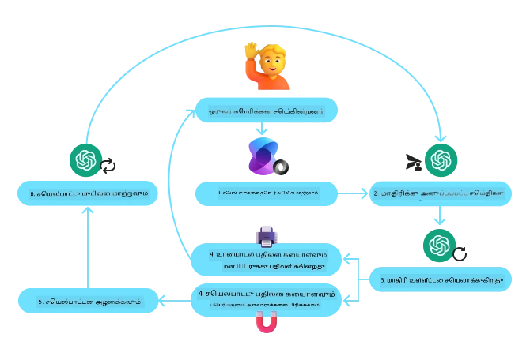
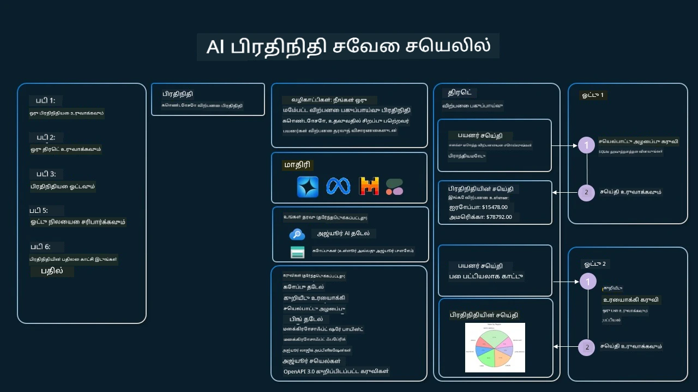

[](https://youtu.be/vieRiPRx-gI?si=cEZ8ApnT6Sus9rhn)

> _(இந்த பாடத்தின் வீடியோக்களை பார்க்க மேலே உள்ள படத்தை கிளிக் செய்யவும்)_

# கருவி பயன்பாட்டு வடிவமைப்பு முறை

கருவிகள் ஆர்வமுள்ளவை ஏனெனில் அவை செயற்கை நுண்ணறிவு முகவர்களுக்கு அதிகமான திறன்களை வழங்குகின்றன. முகவர் செய்யக்கூடிய செயல்களின் ஒரு வரம்புள்ள தொகுப்பை உடையதற்கு பதிலாக, ஒரு கருவியை சேர்ப்பதன் மூலம், முகவர் இப்போது பலவிதமான செயல்களை செய்ய முடியும். இந்த அத்தியாயத்தில், நாங்கள் கருவி பயன்பாட்டு வடிவமைப்பு முறையைப் பார்ப்போம், இது AI முகவர்கள் குறிப்பிட்ட கருவியைப் பயன்படுத்தி தங்களுடைய இலக்குகளை எவ்வாறு அடைவதற்கான முறையை விவரிக்கிறது.

## அறிமுகம்

இந்த பாடத்தில், நாம் பின்வரும் கேள்விகளுக்குப் பதில் காணப்போகிறோம்:

- கருவி பயன்பாட்டு வடிவமைப்பு முறை என்றால் என்ன?
- அது எந்த பயன்படுத்தல் நிலைகளுக்கு பொருந்தும்?
- வடிவமைப்பு முறையை செயல்படுத்த தேவையான கூறுகள்/அடிப்படைக் கட்டங்கள் என்ன?
- நம்பகமான AI முகவர்களை உருவாக்க கருவி பயன்பாட்டு வடிவமைப்பு முறையைப் பயன்படுத்துவதற்கான சிறப்பு கவனிப்புக்கள் என்ன?

## கற்றல் இலக்குகள்

இந்த பாடத்தை முடிந்த பின்பு, நீங்கள் பின்வருபவைகளை செய்யக்கூடும்:

- கருவி பயன்பாட்டு வடிவமைப்பு முறை மற்றும் அதன் நோக்கத்தை வரையறுக்க.
- கருவி பயன்பாட்டு வடிவமைப்பு முறை பொருந்தும் பயன்படுத்தல் நிலைகளை அறிதல்.
- வடிவமைப்பு முறையை செயல்படுத்த தேவையான முக்கிய கூறுகளை புரிந்துகொள்ள.
- இந்த வடிவமைப்பு முறையைப் பயன்படுத்தும் AI முகவர்களில் நம்பகத் தன்மையை உறுதி செய்யும் கவனிப்புக்களை அறிய.

## கருவி பயன்பாட்டு வடிவமைப்பு முறை என்றால் என்ன?

**கருவி பயன்பாட்டு வடிவமைப்பு முறை** என்பது LLMக்களுக்கு (பெரிய மொழி மாதிரிகள்) குறிப்பிட்ட நோக்கங்களை அடைவதற்காக வெளிப்புற கருவிகளுடன் தொடர்பு கொள்ளும் திறனை வழங்குவதில் கவனம் செலுத்துகிறது. கருவிகள் என்பது முகவர் பயன்படுத்தி செயல்களைச் செய்யக்கூடிய குறியீடுகள். ஒரு கருவி எளிய செயல்பாடு (கால்குலேட்டர் போன்ற) அல்லது மூன்றாம் பக்கம் சேவைக்கு API அழைப்பு (பங்கு விலை தேடல் அல்லது வானிலை முன்னறிவிப்பு போன்ற) ஆகியமே இருக்க முடியும். AI முகவர்களின் காட்சியில், கருவிகள் **மாதிரி-உருவாக்கப்பட்ட செயல்பாட்டு அழைப்பு**-களுக்கு பதிலளிக்க முகவர்களால் இயங்கக்கூடியவையாக வடிவமைக்கப்படுகின்றன.

## அது எந்த பயன்படுத்தலுக்கு பொருந்தும்?

AI முகவர்கள் கருவிகளைப் பயன்படுத்தி சிக்கலான பணிகளை முடிக்க, தகவல்களை பெற அல்லது முடிவுகளை எடுக்கக்கூடும். கருவி பயன்பாட்டு வடிவமைப்பு முறை பொதுவாக வழக்கமாக வெளிப்புற அமைப்புகளுடன் மாறுபடும் தொடர்புகாட்ட தேவையான சூழ்நிலைகளில் பயன்படுத்தப்படுகிறது, உட்பட தரவுத்தளங்கள், வலை சேவைகள் அல்லது குறியீடு உரையாக்கிகள். இது பின்வரும் பல பயன்படுத்தல் நிலைகளுக்கு பயனுள்ளதாக இருக்கிறது:

- **விசாரணை தகவல் பெறுதல்:** முகவர்கள் வெளிப்புற APIகளை அல்லது தரவுத்தளங்களை கேட்டு புதுப்பிக்கப்பட்ட தரவை (உதாரணமாக, SQLite தரவுத்தளத்தில் தரவு பகுப்பாய்வு, பங்கு விலை அல்லது வானிலை தகவல் பெறுதல்) பெற்றுக்கொள்ளலாம்.
- **குறியீடு இயக்கல் மற்றும் உரையாக்கல்:** முகவர்கள் கணிதப் பிரச்சனைகளைத் தீர்க்க, அறிக்கைகள் உற்பத்தி செய்ய அல்லது மாதிரிகள் இயக்க குறியீடு அல்லது ஸ்கிரிப்டுகளை இயக்கலாம்.
- **பணி தானியக்கம்:** பணிகள் திட்டமிடுபவர்கள், மின்னஞ்சல் சேவைகள், தரவு குழாய்கள் போன்ற கருவிகளை இணைத்து மறு செய்யப்படும் அல்லது பல கட்ட பணி முறைகளை தானியக்கமாக்குதல்.
- **வாடிக்கையாளர் ஆதரவு:** முகவர்கள் CRM அமைப்புகள், டிக்கெட் மேடைகள் அல்லது அறிவுத்தளங்களுடன் தொடர்பு கொண்டு பயனர் கேள்விகளைத் தீர்க்கலாம்.
- **உள்ளடக்க உருவாக்கல் மற்றும் திருத்துதல்:** மரபுஅய்வான், உரை சுருக்கிகள், உள்ளடக்க பாதுகாப்பு மதிப்பாய்வாளர்கள் போன்ற கருவிகளைப் பயன்படுத்தி உள்ளடக்க படைப்பில் உதவுதல்.

## கருவி பயன்பாட்டு வடிவமைப்பு முறையை செயல்படுத்த தேவையான கூறுகள்/அடிப்படைக் கட்டங்கள் என்ன?

இந்த அடிப்படைக் கட்டங்கள் AI முகவருக்கு பலவிதமான பணிகளைச் செய்யும் திறனை வழங்குகின்றன. கருவி பயன்பாட்டு வடிவமைப்பு முறையை செயல்படுத்த தேவையான முக்கிய கூறுக்களை பார்ப்போம்:

- **செயல்பாட்டு/கருவி தோற்றங்கள் (Schemas):** கிடைக்கும் கருவிகளின் விரிவான விளக்கங்கள், இதில் செயல்பாடு பெயர், நோக்கம், தேவையான அளவுருக்கள் மற்றும் எதிர்பார்க்கப்படும் வெளிப்பாடுகள் அடங்கும். இந்த தோற்றங்கள் LLMக்கு எது எவ்வாறு பயன்படுத்தப்பட வேண்டும் என்பதைக் கற்றுக்கொடுக்க உதவும்.

- **செயல்பாட்டு நடைமுறை (Execution Logic):** பயனர் நோக்கம் மற்றும் உரையாடல் சூழல் அடிப்படையில் கருவிகள் எப்போது மற்றும் எப்படி அழைக்கப்பட வேண்டும் என்பதை நிர்வகிக்கிறது. இதில் திட்டமிடுபவர் தொகுதிகள், வழிசெலுத்தல் அமைப்புகள் அல்லது நிபந்தனை சார்ந்த ஓட்டங்கள் அடங்கலாம்.

- **செய்தி கையாளுதல் முறைமை:** பயனர் உள்ளீடுகள், LLM பதில்கள், கருவி அழைப்புகள் மற்றும் அவற்றின் மேற்கொண்ட விளைவுகளுக்கு இடையில் உரையாடல் ஓட்டத்தை நிர்வகிக்கும் கூறுகள்.

- **கருவி ஒருங்கிணைப்பு கட்டமைப்பு:** எளிமையான செயல்பாடுகள் அல்லது சிக்கலான வெளிப்புற சேவைகள் ஆகியவற்றுடன் முகவர்களை இணைக்கும் தொலைபுரிச் சேவை அமைப்பு.

- **தவறு கையாளுதல் மற்றும் சரிபார்ப்பு:** கருவி இயக்கத்தில் தோல்விகள், அளவுருக்கள் சரிபார்ப்பு மற்றும் எதிர்பாராத பதில்களை நிர்வகிக்கும் அமைப்புகள்.

- **நிலை நிர்வாகம்:** உரையாடல் சூழல், முன்னைய கருவி தொடர்புகளை மற்றும் நிலையான தரவை கண்காணித்து பலஅந்திப் உரையாடலில் ஒத்திசைக்க உறுதி செய்கிறது.

அடுத்ததாக, செயல்பாட்டு/கருவி அழைப்பை விரிவாக பார்ப்போம்.
 
### செயல்பாட்டு/கருவி அழைப்பு

செயல்பாட்டு அழைப்பு என்பது பெரும் மொழி மாதிரிகள் (LLMs) கருவிகளுடன் தொடர்பு கொள்ள நாம் செயல்படுத்தும் முதன்மை வழி. 'செயல்பாடு' மற்றும் 'கருவி' என்ற சொற்கள் மாற்றாக பயன்படுத்தப்படுகின்றன ஏனெனில் 'செயல்பாடுகள்' (மீண்டும் பயன்படுத்தக் கூடிய குறியீட்டு பிரிவுகள்) என்பது முகவர்கள் பணிகளை செய்ய பயன்படும் 'கருவிகள்' ஆகும். ஒரு செயல்பாட்டின் குறியீடு இயங்க, LLM பயனரின் கோரிக்கையை செயல்பாட்டின் விவரணையுடன் ஒப்பிட வேண்டும். இதற்காக, அனைத்து கிடைக்கும் செயல்பாடுகளின் விளக்கங்களை கொண்ட ஒரு தோற்றம் (schema) LLMக்கு அனுப்பப்படுகிறது. அடுத்து LLM அந்த பணிக்கேற்ற செயல்பாட்டை தேர்ந்தெடுத்து அதன் பெயர் மற்றும் அளவுருக்களை திருப்பி அளிக்கிறது. தேர்ந்தெடுக்கப்பட்ட செயல்பாடு இயங்கப்படுகிறது, அதன் பதில் LLMக்கு அனுப்பப்படுகிறது, அதனால் LLM பயனர் கோரிக்கைக்கு பதிலளிக்க பயன்படுத்துகிறது.

செயற்கைப் பூங்காவில் செயல்பாடு அழைப்பை செயல்படுத்த விரும்புவோர் கீழ்வரும் தேவை:

1. செயல்பாடு அழைப்பை ஆதரிக்கக்கூடிய LLM மாதிரி
2. செயல்பாடு விளக்கங்களை கொண்ட தோற்றம்
3. ஒவ்வொரு செயல்பாட்டிற்குமான குறியீடு

நகரங்களில் தற்போதைய நேரத்தை பெறுவது உதாரணமாகக் காண்போம்:

1. **செயல்பாடு அழைப்பை ஆதரிக்கும் LLM ஐ துவக்குக:**

    எல்லா மாதிரிகளும் செயல்பாடு அழைப்பை ஆதரிக்காது, எனவே நீங்கள் பயன்படுத்தும் LLM அதற்கும் ஆதரவு இருக்கிறதா என்பதைக் காண்க. <a href="https://learn.microsoft.com/azure/ai-services/openai/how-to/function-calling" target="_blank">Azure OpenAI</a> செயல்பாடு அழைப்புக்குப் பக்கியில் உதவுகிறது. நாம் Azure OpenAI **Responses API** (நிலையான `/openai/v1/` முனை — `api_version` தேவையில்லை) மூலம் OpenAI கிளையண்டை துவக்கலாம்.

    ```python
    # Azure OpenAI (Responses API, v1 endpoint) க்கான OpenAI கிளையண்டை துவக்கவும்
    client = OpenAI(
        base_url=f"{os.environ['AZURE_OPENAI_ENDPOINT'].rstrip('/')}/openai/v1/",
        api_key=os.environ["AZURE_OPENAI_API_KEY"],
    )
    deployment_name = os.environ["AZURE_OPENAI_DEPLOYMENT"]
    ```

1. **செயல்பாடு தோற்றம் உருவாக்குக**:

    அடுத்ததாக, செயல்பாடு பெயர், அதன் செயல் விளக்கம் மற்றும் அளவுரு பெயர்கள் மற்றும் விளக்கங்களை கொண்ட JSON தோற்றத்தை வரையறுக்கும். 
    இந்த தோற்றத்தை முன்பு உருவாக்கிய கிளையண்டுக்கு முன்வைத்து, பயனர் கோரிக்கையுடன் சேர்த்து, சான் பிரான்சிஸ்கோ நேரத்தை பெற முயல்கிறோம். முக்கியமானது என்னவென்றால், **கருவி அழைப்பு** மீள்பிரதியாகும், கேள்விக்கான இறுதி பதில் அல்ல. மேல் குறிப்பிட்டதுபோல், LLM செயலுக்கு தேர்ந்தெடுத்த செயல்பாட்டின் பெயர் மற்றும் அதற்கான அளவுருக்களை நமக்கு அளிக்கிறது.

    ```python
    # மாதிரியைப் படிக்க செயல்பாட்டு விளக்கம் (Responses API படிகார கருவி வடிவம்)
    tools = [
        {
            "type": "function",
            "name": "get_current_time",
            "description": "Get the current time in a given location",
            "parameters": {
                "type": "object",
                "properties": {
                    "location": {
                        "type": "string",
                        "description": "The city name, e.g. San Francisco",
                    },
                },
                "required": ["location"],
            },
        }
    ]
    ```
   
    ```python
  
    # ஆரம்ப பயனர் செய்தி
    messages = [{"role": "user", "content": "What's the current time in San Francisco"}]

    # முதலாம் API அழைப்பு: மாடலை செயல்பாட்டைப் பயன்படுத்த கேட்கவும்
    response = client.responses.create(
        model=deployment_name,
        input=messages,
        tools=tools,
        tool_choice="auto",
        store=False,
    )

    # பதில்கள் API செயலி அழைப்புகளை response.output இல் function_call உருப்படிகளாகத் திருப்பி அளிக்கும்.
    # அடுத்த சுற்றில் மாடலுக்கு முழு பின்னணி கிடைக்க உரையாடலுக்கு அவற்றை சேர்.
    messages += response.output

    print("Model's response:")
    print(response.output)
  
    ```

    ```bash
    Model's response:
    [ResponseFunctionToolCall(arguments='{"location":"San Francisco"}', call_id='call_pOsKdUlqvdyttYB67MOj434b', name='get_current_time', type='function_call')]
    ```
  
1. **பணி செய்ய தேவையான செயல்பாடு குறியீடு:**

    LLM எந்த செயல்பாடு இயங்கவேண்டும் என்று தேர்ந்தெடுத்துவிட்டதால், அந்த செயல்பாடு குறியீடு எழுதப்படவேண்டும் மற்றும் இயங்கவேண்டும்.
    Python-ல் தற்போதைய நேரத்தை பெறும் குறியீட்டை எழுதியிருக்கலாம். அறிவுறுத்தல் பதிலிலிருந்து பெயர் மற்றும் அளவுருக்களை எடுக்கும் குறியீடியும் எழுத வேண்டும்.

    ```python
      def get_current_time(location):
        """Get the current time for a given location"""
        print(f"get_current_time called with location: {location}")  
        location_lower = location.lower()
        
        for key, timezone in TIMEZONE_DATA.items():
            if key in location_lower:
                print(f"Timezone found for {key}")  
                current_time = datetime.now(ZoneInfo(timezone)).strftime("%I:%M %p")
                return json.dumps({
                    "location": location,
                    "current_time": current_time
                })
      
        print(f"No timezone data found for {location_lower}")  
        return json.dumps({"location": location, "current_time": "unknown"})
    ```

     ```python
    # செயல்பாட்டு அழைப்புகளை கையாள்க
    tool_calls = [item for item in response.output if item.type == "function_call"]
    if tool_calls:
        for tool_call in tool_calls:
            if tool_call.name == "get_current_time":

                function_args = json.loads(tool_call.arguments)

                time_response = get_current_time(
                    location=function_args.get("location")
                )

                # கருவி முடிவை function_call_output உருப்படியாக மாற்றுக
                messages.append({
                    "type": "function_call_output",
                    "call_id": tool_call.call_id,
                    "output": time_response,
                })
    else:
        print("No tool calls were made by the model.")

    # இரண்டாவது API அழைப்பு: மாதிரியிடமிருந்து இறுதிச் சுழற்சியைப் பெறுக
    final_response = client.responses.create(
        model=deployment_name,
        input=messages,
        tools=tools,
        store=False,
    )

    return final_response.output_text
     ```

     ```bash
      get_current_time called with location: San Francisco
      Timezone found for san francisco
      The current time in San Francisco is 09:24 AM.
     ```

செயல்பாடு அழைப்பு பெரும்பாலும் உலகளாவிய முகவர் கருவி பயன்பாட்டு வடிவமைப்பின் மையமாக உள்ளது, ஆனால் இதனை முழுமையாக தசைகளை எழுதுவதில் சிரமம் தோன்றலாம்.
நாம் [பாடம் 2](../../../02-explore-agentic-frameworks)ல் கற்றதுபோல், முகவர் கட்டமைப்புகள் முன்ஆய்வு செய்யப்பட்ட அடிப்படைக் கட்டங்களை வழங்குகிறது, இது கருவி பயன்பாட்டை எளிதாக்குகிறது.
 
## முகவர் கட்டமைப்புகளுடன் கருவி பயன்பாட்டு உதாரணங்கள்

பல்வேறு முகவர் கட்டமைப்புகளைப் பயன்படுத்தி கருவி பயன்பாட்டு வடிவத்தை எவ்வாறு செயல்படுத்த செய்வதற்கான சில உதாரணங்கள் இங்கே:

### Microsoft முகவர் கட்டமைப்பு

<a href="https://learn.microsoft.com/azure/ai-services/agents/overview" target="_blank">Microsoft முகவர் கட்டமைப்பு</a> என்பது AI முகவர்களை கட்டுவதற்கான திறந்த ஊடுருவல் AI அமைப்பாகும். `@tool` அலங்காரிப்பைப் பயன்படுத்தி கருவிகளை Python செயல்பாடுகளாக வரையறுத்து, செயல்பாட்டு அழைப்பை எளிதாக்குகிறது. மாதிரி மற்றும் குறியீட்டுக்கு இடையேயான தொடர்பை நிர்வகிக்கும். மேலும், File Search மற்றும் Code Interpreter போன்ற முன்பே உருவாக்கப்பட்ட கருவிகளுக்கான அணுகலை `FoundryChatClient` மூலம் வழங்குகிறது.

Microsoft முகவர் கட்டமைப்புடன் செயல்பாடு அழைப்பதின் செயல்முறை பின்வருமாறு:



Microsoft முகவர் கட்டமைப்பில், கருவிகள் அலங்காரம் பூட்டப்பட்ட செயல்பாடுகளாக வரையறுக்கப்படுகின்றன. நாம் முன்னாடி பார்த்த `get_current_time` செயல்பாட்டைப் `@tool` அலங்காரிப்பைப் பயன்படுத்தி கருவியாக மாற்றலாம். கட்டமைப்பு செயல்பாடு மற்றும் அதன் அளவுருக்களை தானாக சீரமைக்க, LLMக்கு அனுப்ப தேவையான தோற்றத்தை தயாரிக்கும்.

```python
import os
from agent_framework import tool
from agent_framework.foundry import FoundryChatClient
from azure.identity import AzureCliCredential

@tool(approval_mode="never_require")
def get_current_time(location: str) -> str:
    """Get the current time for a given location"""
    ...

# கிளையண்டை உருவாக்கவும்
provider = FoundryChatClient(
    project_endpoint=os.environ["AZURE_AI_PROJECT_ENDPOINT"],
    model=os.environ["AZURE_AI_MODEL_DEPLOYMENT_NAME"],
    credential=AzureCliCredential(),
)

# ஒரு முகவரியை உருவாக்கி கருவியுடன் இயக்கவும்
agent = provider.as_agent(name="TimeAgent", instructions="Use available tools to answer questions.", tools=get_current_time)
response = await agent.run("What time is it?")
```
  
### Microsoft Foundry முகவர் சேவை

<a href="https://learn.microsoft.com/azure/ai-services/agents/overview" target="_blank">Microsoft Foundry முகவர் சேவை</a> என்பது வளர்ச்சியாளர்களுக்கு பாதுகாப்பாக உயர் தர AI முகவர்களை உருவாக்க, பகிர, масштаб செய்கின்ற முறைமையாக வடிவமைக்கப்பட்டது. அடிப்படைக் கணினி மற்றும் நினைவக வசதிகளை நிர்வகிக்க தேவையில்லை. இது தொழிற்சார் பயன்பாடுகளுக்கு சிறப்பாக பொருளாக உள்ளது, ஏனெனில் இது முழுமையாக நிர்வகிக்கப்படும் சேவையாகவும் தொழிற்சார் தர பாதுகாப்புடன் உள்ளது.

நேரடியாக LLM API-ஐ பயன்படுத்துவதைவிட Microsoft Foundry முகவர் சேவைக்கு சில நன்மைகள் உள்ளன, அவை:

- தானாக கருவி அழைப்பு – கருவி அழைப்பை பிரிக்க, இயக்கு, பதிலையைக் கையாள தேவையில்லை; இவை அனைத்தும் சர்வர் பக்கத்தில் நடைபெறும்
- பாதுகாப்பான தரவு நிர்வாகம் – உங்கள் உரையாடல் நிலையை நீங்கள் நிர்வகிக்க நேரமில்லை என்றால், தேவையான தகவலை கடைசிப் பாடுகள் (threads) மூலம் சேமிக்கலாம்
- உருவாக்கப்படாத, உடனடி கருவிகள் – Bing, Azure AI Search, Azure Functions போன்ற தரவு மூலங்களுடன் தொடர்பு கொள்ள பயன்படும் கருவிகள்.

Microsoft Foundry முகவர் சேவையில் கிடைக்கும் கருவிகள் இரண்டு வகைகளாகப் பிரிகின்றன:

1. அறிவுக் கருவிகள்:
    - <a href="https://learn.microsoft.com/azure/ai-services/agents/how-to/tools/bing-grounding?tabs=python&pivots=overview" target="_blank">Bing Search மூலம் நிலைநிலை செய்தல்</a>
    - <a href="https://learn.microsoft.com/azure/ai-services/agents/how-to/tools/file-search?tabs=python&pivots=overview" target="_blank">கோப்பு தேடல்</a>
    - <a href="https://learn.microsoft.com/azure/ai-services/agents/how-to/tools/azure-ai-search?tabs=azurecli%2Cpython&pivots=overview-azure-ai-search" target="_blank">Azure AI தேடல்</a>

2. செயல்பாட்டு கருவிகள்:
    - <a href="https://learn.microsoft.com/azure/ai-services/agents/how-to/tools/function-calling?tabs=python&pivots=overview" target="_blank">செயல்பாடு அழைப்பு</a>
    - <a href="https://learn.microsoft.com/azure/ai-services/agents/how-to/tools/code-interpreter?tabs=python&pivots=overview" target="_blank">Code Interpreter</a>
    - <a href="https://learn.microsoft.com/azure/ai-services/agents/how-to/tools/openapi-spec?tabs=python&pivots=overview" target="_blank">OpenAPI வரையறுக்கப்பட்ட கருவிகள்</a>
    - <a href="https://learn.microsoft.com/azure/ai-services/agents/how-to/tools/azure-functions?pivots=overview" target="_blank">Azure Functions</a>

முகவர் சேவை இந்த கருவிகளை `toolset` ஆக பயன்படுத்த அனுமதிக்கிறது. இது குறிப்பிட்ட உரையாடலின் செய்தி வரலாறு கண்காணிக்கும் `threads`-ஐ பயன்படுத்து.

நீங்கள் கன்டோசோ என்ற நிறுவனத்தின் விற்பனை முகவராக பாவனை செய்யும் நிலையைக் கற்பனை செய்யுங்கள். உங்கள் விற்பனை தரவு தொடர்பான கேள்விகளுக்கு பதிலளிக்க பேசும் முகவர்களை உருவாக்க விரும்புகிறீர்கள்.

Microsoft Foundry முகவர் சேவையை பயன்படுத்தி உங்கள் விற்பனை தரவுகளைப் பகுப்பாய்வு செய்வது எப்படி என்பது கீழே படம் காட்டப்பட்டுள்ளது:



சேவையுடன் இந்த கருவிகளை பயன்படுத்த, நாம் கிளையண்டை உருவாக்கி கருவி அல்லது கருவி தொகுப்பை வரையறுக்கலாம். இதனை நடைமுறைப்படுத்த பின்வரும் Python குறியீட்டை பயன்படுத்தலாம். LLM கருவித் தொகுப்பைப் பார்த்து பயனர் உருவாக்கிய செயலான `fetch_sales_data_using_sqlite_query`-ஐ அல்லது முன்பே உருவாக்கப்பட்ட Code Interpreter-ஐ பயனர் கோரிக்கை அடிப்படையில் தேர்வு செய்வதற்கு முடியும்.

```python 
import os
from azure.ai.projects import AIProjectClient
from azure.identity import DefaultAzureCredential
from fetch_sales_data_functions import fetch_sales_data_using_sqlite_query # fetch_sales_data_using_sqlite_query செயல்பாடு fetch_sales_data_functions.py கோப்பில் காணப்படக்கூடியது.
from azure.ai.projects.models import ToolSet, FunctionTool, CodeInterpreterTool

project_client = AIProjectClient.from_connection_string(
    credential=DefaultAzureCredential(),
    conn_str=os.environ["PROJECT_CONNECTION_STRING"],
)

# கருவி தொகுப்பை துவக்கவும்
toolset = ToolSet()

# fetch_sales_data_using_sqlite_query செயல்பாட்டுடன் செயல்பாட்டு அழைக்கும் முகவரியினை துவக்கி அதை கருவி தொகுப்பில் சேர்க்கவும்
fetch_data_function = FunctionTool(fetch_sales_data_using_sqlite_query)
toolset.add(fetch_data_function)

# குறியீடு பொருள் புரிப நுவலை துவக்கி அதை கருவி தொகுப்பில் சேர்க்கவும்.
code_interpreter = CodeInterpreterTool()toolset.add(code_interpreter)

agent = project_client.agents.create_agent(
    model="gpt-4o-mini", name="my-agent", instructions="You are helpful agent", 
    toolset=toolset
)
```

## நம்பகமான AI முகவர்களை கட்ட உருவாக்க கருவி பயன்பாட்டு வடிவமைப்பு முறையைப் பயன்படுத்துவதில் சிறப்பு கவனிப்புகள் என்ன?

LLMகள் தானாக தயார் செய்யும் SQLபற்றிய பொதுவான கவலை பாதுகாப்பு தொடர்பானது, குறிப்பாக SQL ஊதியம் அல்லது தீங்கு விளைவிக்கும் நடவடிக்கைகள், உதாரணமாக தரவுத்தளத்தை சிதைப்பது அல்லது கைமாறு செய்வது போன்றவை. இக்கவலைக்குறிப்புக்கள் சரியானவையாகினாலும், அவை தரவுத்தள அணுகல் அனுமதிகளை சரியாக அமைத்தால் திறனாக குறைக்கப்படும். பெரும்பாலான தரவுத்தளங்களில் இதற்கு தரவுத்தளத்தை வாசிப்பு மட்டும் அனுமதிக்குமாறு அமைப்பது அடங்கும். PostgreSQL அல்லது Azure SQL போன்ற சேவைகளில் பயன்பாடுக்கான வாசிப்பு மட்டுமே (SELECT) பங்கு தரப்பட வேண்டும்.

பயன்பாட்டை பாதுகாப்பான சூழலில் இயங்கச் செய்வது மேலும் பாதுகாப்பை மேம்படுத்தும். நிறுவன சூழலில், தரவு பொதுவாக செயல்பாட்டு அமைப்பிலிருந்து வாசிப்பு மட்டுமுள்ள தரவுத்தளம் அல்லது தரவு கோவை மேடைக்கு எடுக்கப்படுகிறது. இது தரவை பாதுகாப்பாகவும், செயல்திறனை மற்றும் அணுகலை எளிதாக்கியும், பயன்பாட்டுக்கு கட்டுப்பட்ட வாசிப்பு அனுமதியுடன் வழங்குகிறது என்பதை உறுதி செய்கிறது.

## உதாரண குறியீடுகள்

- Python: [Agent Framework](./code_samples/04-python-agent-framework.ipynb)
- .NET: [Agent Framework](./code_samples/04-dotnet-agent-framework.md)

## கருவி பயன்பாட்டு வடிவமைப்புகள் குறித்த மேலதிக கேள்விகள் உண்டா?

[Microsoft Foundry Discord](https://discord.com/invite/ATgtXmAS5D)வில் சேர்ந்து மற்ற கற்றலாளர்களைப் சந்தித்து, அலுவலக நேரங்களை பங்கேற்று, உங்கள் AI முகவர் கேள்விகளுக்குப் பதில்களை பெறுங்கள்.

## கூடுதல் வளங்கள்

- <a href="https://microsoft.github.io/build-your-first-agent-with-azure-ai-agent-service-workshop/" target="_blank">Azure AI Agents சேவை பணிமனை</a>
- <a href="https://github.com/Azure-Samples/contoso-creative-writer/tree/main/docs/workshop" target="_blank">Contoso Creative Writer பன்முகவர் பணிமனை</a>
- <a href="https://learn.microsoft.com/azure/ai-services/agents/overview" target="_blank">Microsoft முகவர் கட்டமைப்பு சுருக்கம்</a>


## கடந்த பாடம்

[எஜென்டிக் வடிவமைப்பு முறைமைகளைப் புரிந்துகொள்வது](../03-agentic-design-patterns/README.md)

## அடுத்த பாடம்

[எஜென்டிக் RAG](../05-agentic-rag/README.md)

---

<!-- CO-OP TRANSLATOR DISCLAIMER START -->
**மறுப்பு**:
இந்த ஆவணம் AI மொழிபெயர்ப்பு சேவை [Co-op Translator](https://github.com/Azure/co-op-translator) பயன்படுத்தி மொழிபெயர்க்கப்பட்டுள்ளது. நாங்கள் துல்லியத்திற்காக முயற்சி செய்துள்ளோம், ஆனால் தானாக செய்யப்படும் மொழிபெயர்ப்புகளில் பிழைகள் அல்லது தவறுகள் இருக்கலாம் என்பதை கவனத்தில் கொள்ளவும். அசல் ஆவணம் அதன் தாய்மொழியில் அதிகாரப்பூர்வ ஆதாரமாக கருதப்பட வேண்டும். முக்கியமான தகவல்களுக்கு, தொழில்நுட்பமான மனித மொழிபெயர்ப்பு பரிந்துரைக்கப்படுகிறது. இந்த மொழிபெயர்ப்பைப் பயன்படுத்துவதால் ஏற்படும் எந்த தவறான புரிதல்கள் அல்லது தவறான விளக்கத்திற்கும் நாங்கள் பொறுப்பில்வில்லை.
<!-- CO-OP TRANSLATOR DISCLAIMER END -->