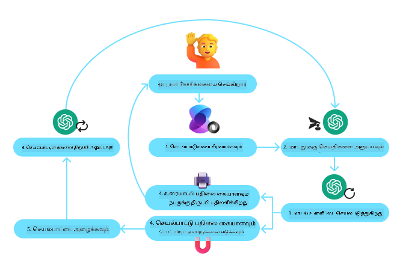
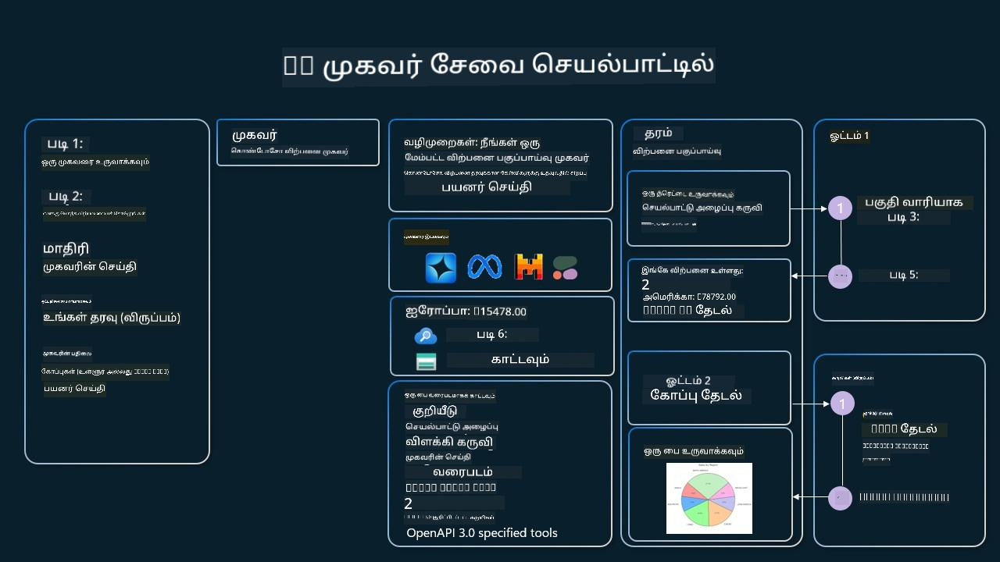

<!--
CO_OP_TRANSLATOR_METADATA:
{
  "original_hash": "e056335d729ba6e49571db7a6533825d",
  "translation_date": "2025-10-11T11:14:44+00:00",
  "source_file": "04-tool-use/README.md",
  "language_code": "ta"
}
-->
[](https://youtu.be/vieRiPRx-gI?si=cEZ8ApnT6Sus9rhn)

> _(மேலே உள்ள படத்தை கிளிக் செய்து இந்த பாடத்தின் வீடியோவைப் பாருங்கள்)_

# கருவி பயன்பாட்டு வடிவமைப்பு முறை

கருவிகள் மிகவும் சுவாரஸ்யமானவை, ஏனெனில் அவை AI முகவர்களுக்கு பரந்த அளவிலான திறன்களை வழங்குகின்றன. முகவர் செய்யக்கூடிய செயல்களின் வரம்பு குறைந்ததாக இருந்தால், ஒரு கருவியைச் சேர்ப்பதன் மூலம், முகவர் இப்போது பரந்த அளவிலான செயல்களைச் செய்ய முடியும். இந்த அத்தியாயத்தில், AI முகவர்கள் தங்கள் இலக்குகளை அடைய குறிப்பிட்ட கருவிகளை எவ்வாறு பயன்படுத்த முடியும் என்பதை விவரிக்கும் கருவி பயன்பாட்டு வடிவமைப்பு முறையைப் பார்க்கப் போகிறோம்.

## அறிமுகம்

இந்த பாடத்தில், கீழ்க்காணும் கேள்விகளுக்கு பதிலளிக்க முயற்சிக்கிறோம்:

- கருவி பயன்பாட்டு வடிவமைப்பு முறை என்ன?
- இது எந்த பயன்பாடுகளுக்கு பொருந்தும்?
- இந்த வடிவமைப்பு முறையை செயல்படுத்த தேவையான கூறுகள்/கட்டமைப்புகள் என்ன?
- நம்பகமான AI முகவர்களை உருவாக்க இந்த வடிவமைப்பு முறையைப் பயன்படுத்துவதற்கான சிறப்பு கருத்துக்கள் என்ன?

## கற்றல் இலக்குகள்

இந்த பாடத்தை முடித்த பிறகு, நீங்கள்:

- கருவி பயன்பாட்டு வடிவமைப்பு முறையை அதன் நோக்கத்துடன் வரையறுக்க முடியும்.
- கருவி பயன்பாட்டு வடிவமைப்பு முறை பொருந்தக்கூடிய பயன்பாடுகளை அடையாளம் காண முடியும்.
- இந்த வடிவமைப்பு முறையை செயல்படுத்த தேவையான முக்கிய கூறுகளைப் புரிந்துகொள்ள முடியும்.
- இந்த வடிவமைப்பு முறையைப் பயன்படுத்தும் AI முகவர்களின் நம்பகத்தன்மையை உறுதிப்படுத்துவதற்கான கருத்துக்களை அறிய முடியும்.

## கருவி பயன்பாட்டு வடிவமைப்பு முறை என்ன?

**கருவி பயன்பாட்டு வடிவமைப்பு முறை** LLMக்களுக்கு வெளிப்புற கருவிகளுடன் தொடர்பு கொண்டு குறிப்பிட்ட இலக்குகளை அடைய உதவுகிறது. கருவிகள் என்பது முகவரால் செயல்படுத்தக்கூடிய குறியீடாகும். ஒரு கருவி கணக்கீடு போன்ற எளிய செயல்பாடு அல்லது பங்கு விலை தேடல் அல்லது வானிலை முன்னறிவிப்பு போன்ற மூன்றாம் தரப்பு சேவைக்கு API அழைப்பு ஆகியவையாக இருக்கலாம். AI முகவர்களின் சூழலில், கருவிகள் **மாதிரி உருவாக்கப்பட்ட செயல்பாட்டு அழைப்புகள்**க்கு பதிலளிக்க முகவர்களால் செயல்படுத்தப்படுவதற்காக வடிவமைக்கப்பட்டுள்ளன.

## இது எந்த பயன்பாடுகளுக்கு பொருந்தும்?

AI முகவர்கள் கருவிகளை பயன்படுத்தி சிக்கலான பணிகளை முடிக்க, தகவல்களை பெற அல்லது முடிவுகளை எடுக்க முடியும். கருவி பயன்பாட்டு வடிவமைப்பு முறை, தரவுத்தொகுப்புகள், வலை சேவைகள் அல்லது குறியீடு விளக்கிகள் போன்ற வெளிப்புற அமைப்புகளுடன் மாறுபடும் தொடர்பு தேவைப்படும் சூழல்களில் பெரும்பாலும் பயன்படுத்தப்படுகிறது. இது பல்வேறு பயன்பாடுகளுக்கு பயனுள்ளதாக இருக்கும், அவற்றில் சில:

- **மாறுபடும் தகவல் தேடல்:** SQLite தரவுத்தொகுப்பை விசாரணை செய்வது, பங்கு விலைகள் அல்லது வானிலை தகவலைப் பெறுவது போன்றவற்றுக்கு வெளிப்புற APIக்கள் அல்லது தரவுத்தொகுப்புகளை விசாரணை செய்ய முகவர்கள் முடியும்.
- **குறியீடு செயல்படுத்தல் மற்றும் விளக்கம்:** கணிதப் பிரச்சினைகளைத் தீர்க்க, அறிக்கைகளை உருவாக்க அல்லது சிமுலேஷன்களைச் செய்ய குறியீடுகளை அல்லது ஸ்கிரிப்ட்களை செயல்படுத்த முடியும்.
- **பணிச்செலுத்தல் தானியக்கமாக்கல்:** பணிக்கால அட்டவணைகள், மின்னஞ்சல் சேவைகள் அல்லது தரவுப் குழாய்கள் போன்ற கருவிகளை ஒருங்கிணைத்து மீண்டும் மீண்டும் செய்யப்படும் அல்லது பல படிகள் கொண்ட பணிச்செலுத்தல்களை தானியக்கமாக்கல்.
- **வாடிக்கையாளர் ஆதரவு:** CRM அமைப்புகள், டிக்கெட் பிளாட்ஃபார்ம்கள் அல்லது அறிவு அடுக்குகள் போன்றவற்றுடன் தொடர்பு கொண்டு பயனர் கேள்விகளைத் தீர்க்க முடியும்.
- **உள்ளடக்க உருவாக்கம் மற்றும் திருத்தம்:** இலக்கண சரிபார்ப்புகள், உரை சுருக்கிகள் அல்லது உள்ளடக்க பாதுகாப்பு மதிப்பீட்டாளர்கள் போன்ற கருவிகளை பயன்படுத்தி உள்ளடக்க உருவாக்க பணிகளில் உதவ முடியும்.

## கருவி பயன்பாட்டு வடிவமைப்பு முறையை செயல்படுத்த தேவையான கூறுகள்/கட்டமைப்புகள் என்ன?

இந்த கட்டமைப்புகள் AI முகவர்களுக்கு பரந்த அளவிலான பணிகளைச் செய்ய உதவுகின்றன. கருவி பயன்பாட்டு வடிவமைப்பு முறையை செயல்படுத்த தேவையான முக்கிய கூறுகளைப் பார்ப்போம்:

- **செயல்பாடு/கருவி திட்டங்கள்:** கிடைக்கக்கூடிய கருவிகளின் விரிவான வரையறைகள், செயல்பாட்டு பெயர், நோக்கம், தேவையான அளவுருக்கள் மற்றும் எதிர்பார்க்கப்படும் வெளியீடுகள் ஆகியவற்றை உள்ளடக்கியது. இந்த திட்டங்கள் LLMக்கு எந்த கருவிகள் கிடைக்கின்றன மற்றும் செல்லுபடியான கோரிக்கைகளை எவ்வாறு உருவாக்குவது என்பதைப் புரிந்துகொள்ள உதவுகின்றன.

- **செயல்பாட்டு செயல்படுத்தல் தருக்கம்:** பயனர் நோக்கம் மற்றும் உரையாடல் சூழலின் அடிப்படையில் கருவிகள் எப்போது மற்றும் எவ்வாறு அழைக்கப்பட வேண்டும் என்பதை நிர்வகிக்கிறது. இது திட்டமிடும் தொகுதிகள், வழிமாற்று механизмங்கள் அல்லது கருவி பயன்பாட்டை மாறுபடத்தக்க வகையில் தீர்மானிக்கும் நிபந்தனைப் பாய்கள் ஆகியவற்றை உள்ளடக்கலாம்.

- **செய்தி மேலாண்மை அமைப்பு:** பயனர் உள்ளீடுகள், LLM பதில்கள், கருவி அழைப்புகள் மற்றும் கருவி வெளியீடுகளுக்கு இடையிலான உரையாடல் ஓட்டத்தை நிர்வகிக்கும் கூறுகள்.

- **கருவி ஒருங்கிணைப்பு கட்டமைப்பு:** முகவரை எளிய செயல்பாடுகள் அல்லது சிக்கலான வெளிப்புற சேவைகள் ஆகியவற்றுடன் இணைக்கும் உள்கட்டமைப்பு.

- **பிழை மேலாண்மை மற்றும் சரிபார்ப்பு:** கருவி செயல்படுத்தலில் தோல்விகளை நிர்வகிக்க, அளவுருக்களை சரிபார்க்க மற்றும் எதிர்பாராத பதில்களை நிர்வகிக்க உள்ளமைவுகள்.

- **நிலை மேலாண்மை:** பல முறை உரையாடல்களில் நிலைத்தன்மையை உறுதிப்படுத்த உரையாடல் சூழல், முந்தைய கருவி தொடர்புகள் மற்றும் நிலையான தரவுகளைப் பின்தொடர்கிறது.

அடுத்ததாக, செயல்பாடு/கருவி அழைப்புகளை விரிவாகப் பார்ப்போம்.

### செயல்பாடு/கருவி அழைப்புகள்

செயல்பாடு அழைப்புகள் என்பது பெரிய மொழி மாதிரிகள் (LLMs) கருவிகளுடன் தொடர்பு கொள்ள உதவுவதற்கான முதன்மை வழியாகும். 'செயல்பாடு' மற்றும் 'கருவி' ஆகியவை பரஸ்பரம் மாற்றி பயன்படுத்தப்படுவதைக் காணலாம், ஏனெனில் 'செயல்பாடுகள்' (மீண்டும் பயன்படுத்தக்கூடிய குறியீடுகளின் தொகுதிகள்) என்பது முகவர்கள் பணிகளைச் செய்ய பயன்படுத்தும் 'கருவிகள்' ஆகும். ஒரு செயல்பாட்டின் குறியீடு செயல்படுத்தப்படுவதற்காக, LLM பயனர் கோரிக்கையை செயல்பாடுகளின் விளக்கத்துடன் ஒப்பிட வேண்டும். இதற்காக, கிடைக்கக்கூடிய அனைத்து செயல்பாடுகளின் விளக்கங்களை உள்ளடக்கிய ஒரு திட்டம் LLMக்கு அனுப்பப்படுகிறது. LLM பின்னர் பணிக்கான மிகச் சரியான செயல்பாட்டைத் தேர்ந்தெடுத்து அதன் பெயர் மற்றும் அளவுருக்களைத் திருப்புகிறது. தேர்ந்தெடுக்கப்பட்ட செயல்பாடு செயல்படுத்தப்படுகிறது, அதன் பதில் LLMக்கு அனுப்பப்படுகிறது, இது தகவலைப் பயன்படுத்தி பயனர் கோரிக்கைக்கு பதிலளிக்கிறது.

முகவர்களுக்கு செயல்பாட்டு அழைப்புகளை செயல்படுத்த, டெவலப்பர்கள் தேவையானவை:

1. செயல்பாட்டு அழைப்புகளை ஆதரிக்கும் LLM மாதிரி
2. செயல்பாட்டு விளக்கங்களை உள்ளடக்கிய ஒரு திட்டம்
3. விளக்கப்பட்ட ஒவ்வொரு செயல்பாட்டிற்கும் குறியீடு

சான்ஃபிரான்சிஸ்கோவில் தற்போதைய நேரத்தைப் பெறுவதற்கான உதாரணத்தைப் பயன்படுத்தி விளக்குவோம்:

1. **செயல்பாட்டு அழைப்புகளை ஆதரிக்கும் LLMஐ தொடங்குதல்:**

    அனைத்து மாதிரிகளும் செயல்பாட்டு அழைப்புகளை ஆதரிக்காது, எனவே நீங்கள் பயன்படுத்தும் LLM அதைச் செய்யுமா என்பதைச் சரிபார்ப்பது முக்கியம். <a href="https://learn.microsoft.com/azure/ai-services/openai/how-to/function-calling" target="_blank">Azure OpenAI</a> செயல்பாட்டு அழைப்புகளை ஆதரிக்கிறது. Azure OpenAI கிளையண்டை தொடங்குவதன் மூலம் தொடங்கலாம்.

    ```python
    # Initialize the Azure OpenAI client
    client = AzureOpenAI(
        azure_endpoint = os.getenv("AZURE_OPENAI_ENDPOINT"), 
        api_key=os.getenv("AZURE_OPENAI_API_KEY"),  
        api_version="2024-05-01-preview"
    )
    ```

1. **செயல்பாட்டு திட்டத்தை உருவாக்குதல்:**

    அடுத்ததாக, செயல்பாட்டு பெயர், செயல்பாடு என்ன செய்கிறது என்பதற்கான விளக்கம் மற்றும் செயல்பாட்டு அளவுருக்களின் பெயர்கள் மற்றும் விளக்கங்களை உள்ளடக்கிய JSON திட்டத்தை வரையறுப்போம். பின்னர் இந்த திட்டத்தை முந்தைய கிளையண்டுக்கு, சான்ஃபிரான்சிஸ்கோவில் நேரத்தைப் பெற பயனர் கோரிக்கையுடன் அனுப்புவோம். முக்கியமாக கவனிக்க வேண்டியது, **கருவி அழைப்பு** தான் திருப்பப்படுகிறது, **கேள்விக்கு இறுதி பதில் அல்ல**. முன்பே கூறியபடி, LLM பணிக்கான செயல்பாட்டின் பெயர் மற்றும் அதற்கு அனுப்பப்படும் அளவுருக்களை திருப்புகிறது.

    ```python
    # Function description for the model to read
    tools = [
        {
            "type": "function",
            "function": {
                "name": "get_current_time",
                "description": "Get the current time in a given location",
                "parameters": {
                    "type": "object",
                    "properties": {
                        "location": {
                            "type": "string",
                            "description": "The city name, e.g. San Francisco",
                        },
                    },
                    "required": ["location"],
                },
            }
        }
    ]
    ```
   
    ```python
  
    # Initial user message
    messages = [{"role": "user", "content": "What's the current time in San Francisco"}] 
  
    # First API call: Ask the model to use the function
      response = client.chat.completions.create(
          model=deployment_name,
          messages=messages,
          tools=tools,
          tool_choice="auto",
      )
  
      # Process the model's response
      response_message = response.choices[0].message
      messages.append(response_message)
  
      print("Model's response:")  

      print(response_message)
  
    ```

    ```bash
    Model's response:
    ChatCompletionMessage(content=None, role='assistant', function_call=None, tool_calls=[ChatCompletionMessageToolCall(id='call_pOsKdUlqvdyttYB67MOj434b', function=Function(arguments='{"location":"San Francisco"}', name='get_current_time'), type='function')])
    ```
  
1. **பணியைச் செய்ய தேவையான செயல்பாட்டு குறியீடு:**

    LLM எந்த செயல்பாட்டை இயக்க வேண்டும் என்பதைத் தேர்ந்தெடுத்த பிறகு, பணியைச் செய்ய தேவையான குறியீடு செயல்படுத்தப்பட்டு இயக்கப்பட வேண்டும். Python-ல் தற்போதைய நேரத்தைப் பெற குறியீட்டை செயல்படுத்தலாம். இறுதி முடிவைப் பெற response_message-ல் இருந்து பெயர் மற்றும் அளவுருக்களை எடுக்க குறியீடுகளை எழுதவும் வேண்டும்.

    ```python
      def get_current_time(location):
        """Get the current time for a given location"""
        print(f"get_current_time called with location: {location}")  
        location_lower = location.lower()
        
        for key, timezone in TIMEZONE_DATA.items():
            if key in location_lower:
                print(f"Timezone found for {key}")  
                current_time = datetime.now(ZoneInfo(timezone)).strftime("%I:%M %p")
                return json.dumps({
                    "location": location,
                    "current_time": current_time
                })
      
        print(f"No timezone data found for {location_lower}")  
        return json.dumps({"location": location, "current_time": "unknown"})
    ```

     ```python
     # Handle function calls
      if response_message.tool_calls:
          for tool_call in response_message.tool_calls:
              if tool_call.function.name == "get_current_time":
     
                  function_args = json.loads(tool_call.function.arguments)
     
                  time_response = get_current_time(
                      location=function_args.get("location")
                  )
     
                  messages.append({
                      "tool_call_id": tool_call.id,
                      "role": "tool",
                      "name": "get_current_time",
                      "content": time_response,
                  })
      else:
          print("No tool calls were made by the model.")  
  
      # Second API call: Get the final response from the model
      final_response = client.chat.completions.create(
          model=deployment_name,
          messages=messages,
      )
  
      return final_response.choices[0].message.content
     ```

     ```bash
      get_current_time called with location: San Francisco
      Timezone found for san francisco
      The current time in San Francisco is 09:24 AM.
     ```

செயல்பாட்டு அழைப்புகள் பெரும்பாலான, அல்லது அனைத்து முகவர் கருவி பயன்பாட்டு வடிவமைப்பின் மையமாக உள்ளன, ஆனால் அதை அடிப்படையில் செயல்படுத்துவது சில நேரங்களில் சவாலாக இருக்கலாம். [Lesson 2](../../../02-explore-agentic-frameworks)ல் கற்றது போல, முகவர் கட்டமைப்புகள் கருவி பயன்பாட்டை செயல்படுத்த முன்பணியமைக்கப்பட்ட கட்டமைப்புகளை வழங்குகின்றன.

## முகவர் கட்டமைப்புகளுடன் கருவி பயன்பாட்டு உதாரணங்கள்

முகவர் கட்டமைப்புகளைப் பயன்படுத்தி கருவி பயன்பாட்டு வடிவமைப்பு முறையை எவ்வாறு செயல்படுத்தலாம் என்பதைப் பற்றிய சில உதாரணங்கள் இங்கே:

### Semantic Kernel

<a href="https://learn.microsoft.com/azure/ai-services/agents/overview" target="_blank">Semantic Kernel</a> என்பது பெரிய மொழி மாதிரிகளுடன் (LLMs) பணிபுரியும் .NET, Python மற்றும் Java டெவலப்பர்களுக்கான ஓப்பன்-சோர்ஸ் AI கட்டமைப்பாகும். இது உங்கள் செயல்பாடுகள் மற்றும் அவற்றின் அளவுருக்களை மாதிரிக்கு தானாக விளக்குவதன் மூலம் செயல்பாட்டு அழைப்புகளைப் பயன்படுத்தும் செயல்முறையை எளிதாக்குகிறது, இது <a href="https://learn.microsoft.com/semantic-kernel/concepts/ai-services/chat-completion/function-calling/?pivots=programming-language-python#1-serializing-the-functions" target="_blank">serializing</a> என அழைக்கப்படுகிறது. இது மாதிரி மற்றும் உங்கள் குறியீட்டுக்கு இடையிலான தொடர்பை நிர்வகிக்கிறது. Semantic Kernel போன்ற முகவர் கட்டமைப்பைப் பயன்படுத்துவதன் மற்றொரு நன்மை, <a href="https://github.com/microsoft/semantic-kernel/blob/main/python/samples/getting_started_with_agents/openai_assistant/step4_assistant_tool_file_search.py" target="_blank">File Search</a> மற்றும் <a href="https://github.com/microsoft/semantic-kernel/blob/main/python/samples/getting_started_with_agents/openai_assistant/step3_assistant_tool_code_interpreter.py" target="_blank">Code Interpreter</a> போன்ற முன்பணியமைக்கப்பட்ட கருவிகளை அணுக அனுமதிக்கிறது.

Semantic Kernel உடன் செயல்பாட்டு அழைப்புகளின் செயல்முறையை விளக்கும் பின்வரும் வரைபடம்:



Semantic Kernelல் செயல்பாடுகள்/கருவிகள் <a href="https://learn.microsoft.com/semantic-kernel/concepts/plugins/?pivots=programming-language-python" target="_blank">Plugins</a> என அழைக்கப்படுகின்றன. முந்தைய `get_current_time` செயல்பாட்டை ஒரு வகுப்பாக மாற்றி அதில் செயல்பாட்டை சேர்த்தால், அதை ஒரு plugin ஆக மாற்றலாம். `kernel_function` அலங்காரத்தை இறக்குமதி செய்யவும், இது செயல்பாட்டின் விளக்கத்தைப் பெறுகிறது. GetCurrentTimePlugin உடன் ஒரு kernel உருவாக்கும்போது, kernel தானாக செயல்பாட்டை மற்றும் அதன் அளவுருக்களை serialize செய்து, LLMக்கு அனுப்புவதற்கான திட்டத்தை உருவாக்கும்.

```python
from semantic_kernel.functions import kernel_function

class GetCurrentTimePlugin:
    async def __init__(self, location):
        self.location = location

    @kernel_function(
        description="Get the current time for a given location"
    )
    def get_current_time(location: str = ""):
        ...

```

```python 
from semantic_kernel import Kernel

# Create the kernel
kernel = Kernel()

# Create the plugin
get_current_time_plugin = GetCurrentTimePlugin(location)

# Add the plugin to the kernel
kernel.add_plugin(get_current_time_plugin)
```
  
### Azure AI Agent Service

<a href="https://learn.microsoft.com/azure/ai-services/agents/overview" target="_blank">Azure AI Agent Service</a> என்பது டெவலப்பர்களை அடிப்படை கணினி மற்றும் சேமிப்பு வளங்களை நிர்வகிக்காமல், உயர் தரமான மற்றும் விரிவாக்கக்கூடிய AI முகவர்களை பாதுகாப்பாக உருவாக்க, பரப்ப மற்றும் அளவீடு செய்ய உதவுவதற்காக வடிவமைக்கப்பட்ட புதிய முகவர் கட்டமைப்பாகும். இது முழுமையாக நிர்வகிக்கப்படும் சேவையாகவும், நிறுவன தரமான பாதுகாப்புடன் இருப்பதால், குறிப்பாக நிறுவன பயன்பாடுகளுக்கு பயனுள்ளதாக உள்ளது.

LLM APIயுடன் நேரடியாக உருவாக்குவதுடன் ஒப்பிடும்போது, Azure AI Agent Service சில நன்மைகளை வழங்குகிறது, அவை:

- தானாக கருவி அழைப்புகள் – கருவி அழைப்பை பகுப்பாய்வு செய்ய, கருவியை செயல்படுத்த மற்றும் பதிலை நிர்வகிக்க தேவையில்லை; இவை அனைத்தும் இப்போது சர்வர்-பக்கம் செய்யப்படுகிறது.
- பாதுகாப்பாக நிர்வகிக்கப்படும் தரவுகள் – உங்கள் உரையாடல் நிலையை நிர்வகிக்காமல், தேவையான அனைத்து தகவல்களையும் சேமிக்க Threadsஐ நம்பலாம்.
- முன்பணியமைக்கப்பட்ட கருவிகள் – Bing, Azure AI Search மற்றும் Azure Functions போன்ற உங்கள் தரவ மூலங்களுடன் தொடர்பு கொள்ள பயன்படுத்தக்கூடிய கருவிகள்.

Azure AI Agent Serviceல் கிடைக்கக்கூடிய கருவிகள் இரண்டு வகைகளாகப் பிரிக்கப்படுகின்றன:

1. அறிவு கருவிகள்:
    - <a href="https://learn.microsoft.com/azure/ai-services/agents/how-to/tools/bing-grounding?tabs=python&pivots=overview" target="_blank">Bing Search மூலம் Grounding</a>
    - <a href="https://learn.microsoft.com/azure/ai-services/agents/how-to/tools/file-search?tabs=python&pivots=overview" target="_blank">File Search</a>
    - <a href="https://learn.microsoft.com/azure/ai-services/agents/how-to/tools/azure-ai-search?tabs=azurecli%2Cpython&pivots=overview-azure-ai-search" target="_blank">Azure AI Search</a>

2. செயல்பாட்டு கருவிகள்:
    - <a href="https://learn.microsoft.com/azure/ai-services/agents/how-to/tools/function-calling?tabs=python&pivots=overview" target="_blank">Function Calling</a>
    - <a href="https://learn.microsoft.com/azure/ai-services/agents/how-to/tools/code-interpreter?tabs=python&pivots=overview" target="_blank">Code Interpreter</a>
    - <a href="https://learn.microsoft.com/azure/ai-services/agents/how-to/tools/openapi-spec?tabs=python&pivots=overview" target="_blank">OpenAPI மூலம் வரையறுக்கப்பட்ட கருவிகள்</a>
    - <a href="https://learn.microsoft.com/azure/ai-services/agents/how-to/tools/azure-functions?pivots=overview" target="_blank">Azure Functions</a>

Agent Service இந்த கருவிகளை `toolset` ஆக ஒன்றாக பயன்படுத்த அனுமதிக்கிறது. இது `threads`ஐ பயன்படுத்துகிறது, இது குறிப்பிட்ட உரையாடலின் செய்திகளின் வரலாற்றை பின்தொடர்கிறது.

நீங்கள் Contoso என்ற நிறுவனத்தில் ஒரு விற்பனை முகவராக உள்ளீர்கள் என்று கற்பனை செய்யுங்கள். உங்கள் விற்பனை தரவுகள் பற்றிய கேள்விகளுக்கு பதிலளிக்கக்கூடிய உரையாடல் முகவரை உருவாக்க விரும்புகிறீர்கள்.

Azure AI Agent Service உங்கள் விற்பனை தரவுகளை பகுப்பாய்வு செய்ய எவ்வாறு பயன்படுத்தலாம் என்பதை விளக்கும் பின்வரும் படம்:



இந்த சேவையுடன் எந்த கருவிகளையும் பயன்படுத்த, ஒரு கிளையண்டை உருவாக்கி ஒரு கருவி அல்லது கருவி தொகுப்பை வரையறுக்கலாம். இதை நடைமுறையில் செயல்படுத்த, பின்வரும் Python குறியீட்டை பயன்படுத்தலாம். LLM, பயனர் உருவாக்கிய `fetch_sales_data_using_sqlite_query` செயல்பாட்டை அல்லது முன்பணியமைக்கப்பட்ட Code Interpreterஐ பயனர் கோரிக்கையின் அடிப்படையில் பயன்படுத்த முடியும்.

```python 
import os
from azure.ai.projects import AIProjectClient
from azure.identity import DefaultAzureCredential
from fetch_sales_data_functions import fetch_sales_data_using_sqlite_query # fetch_sales_data_using_sqlite_query function which can be found in a fetch_sales_data_functions.py file.
from azure.ai.projects.models import ToolSet, FunctionTool, CodeInterpreterTool

project_client = AIProjectClient.from_connection_string(
    credential=DefaultAzureCredential(),
    conn_str=os.environ["PROJECT_CONNECTION_STRING"],
)

# Initialize function calling agent with the fetch_sales_data_using_sqlite_query function and adding it to the toolset
fetch_data_function = FunctionTool(fetch_sales_data_using_sqlite_query)
toolset = ToolSet()
toolset.add(fetch_data_function)

# Initialize Code Interpreter tool and adding it to the toolset. 
code_interpreter = code_interpreter = CodeInterpreterTool()
toolset = ToolSet()
toolset.add(code_interpreter)

agent = project_client.agents.create_agent(
    model="gpt-4o-mini", name="my-agent", instructions="You are helpful agent", 
    toolset=toolset
)
```

## நம்பகமான AI முகவர்களை உருவாக்க கருவி பயன்பாட்டு வடிவமைப்பு முறையைப் பயன்படுத்துவதற்கான சிறப்பு கருத்துக்கள் என்ன?

LLMக்களால் தானாக உருவாக்கப்படும் SQLக்கு பொதுவான கவலை பாதுகாப்பு, குறிப்பாக SQL
அப்பிளிக்கேஷனை ஒரு பாதுகாப்பான சூழலில் இயக்குவது பாதுகாப்பை மேலும் மேம்படுத்துகிறது. நிறுவன சூழல்களில், தரவுகள் பொதுவாக செயல்பாட்டு அமைப்புகளில் இருந்து எடுக்கப்பட்டு, பயனர் நட்பு ஸ்கீமாவுடன் ஒரு வாசிக்க மட்டுமே உள்ள தரவுத்தொகுப்பு அல்லது தரவWarehouse-க்கு மாற்றப்படுகின்றன. இந்த அணுகுமுறை தரவுகள் பாதுகாப்பாகவும், செயல்திறனுக்காகவும் மற்றும் அணுகுமுறை சீரமைக்கப்பட்டதாகவும் இருப்பதை உறுதிப்படுத்துகிறது, மேலும் அப்பிளிக்கேஷனுக்கு கட்டுப்படுத்தப்பட்ட, வாசிக்க மட்டுமே அணுகலை வழங்குகிறது.

### கருவி பயன்பாட்டுக்கான வடிவமைப்பு முறைமைகள் குறித்து மேலும் கேள்விகள் உள்ளதா?

மற்ற பயிற்சியாளர்களை சந்திக்கவும், அலுவலக நேரங்களில் கலந்துரையாடவும் மற்றும் உங்கள் AI Agents தொடர்பான கேள்விகளுக்கு பதிலளிக்கவும் [Azure AI Foundry Discord](https://aka.ms/ai-agents/discord) குழுவில் சேருங்கள்.

## கூடுதல் வளங்கள்

- <a href="https://microsoft.github.io/build-your-first-agent-with-azure-ai-agent-service-workshop/" target="_blank">Azure AI Agents Service Workshop</a>
- <a href="https://github.com/Azure-Samples/contoso-creative-writer/tree/main/docs/workshop" target="_blank">Contoso Creative Writer Multi-Agent Workshop</a>
- <a href="https://learn.microsoft.com/semantic-kernel/concepts/ai-services/chat-completion/function-calling/?pivots=programming-language-python#1-serializing-the-functions" target="_blank">Semantic Kernel Function Calling Tutorial</a>
- <a href="https://github.com/microsoft/semantic-kernel/blob/main/python/samples/getting_started_with_agents/openai_assistant/step3_assistant_tool_code_interpreter.py" target="_blank">Semantic Kernel Code Interpreter</a>
- <a href="https://microsoft.github.io/autogen/dev/user-guide/core-user-guide/components/tools.html" target="_blank">Autogen Tools</a>

## முந்தைய பாடம்

[Agentic Design Patterns-ஐ புரிந்துகொள்வது](../03-agentic-design-patterns/README.md)

## அடுத்த பாடம்

[Agentic RAG](../05-agentic-rag/README.md)

---

**குறிப்பு**:  
இந்த ஆவணம் [Co-op Translator](https://github.com/Azure/co-op-translator) என்ற AI மொழிபெயர்ப்பு சேவையை பயன்படுத்தி மொழிபெயர்க்கப்பட்டுள்ளது. எங்கள் தரச்செயல்முறையை உறுதிப்படுத்த முயற்சிக்கிறோம், ஆனால் தானியக்க மொழிபெயர்ப்புகளில் பிழைகள் அல்லது தவறான தகவல்கள் இருக்கக்கூடும் என்பதை கவனத்தில் கொள்ளவும். அதன் தாய்மொழியில் உள்ள மூல ஆவணம் அதிகாரப்பூர்வ ஆதாரமாக கருதப்பட வேண்டும். முக்கியமான தகவல்களுக்கு, தொழில்முறை மனித மொழிபெயர்ப்பு பரிந்துரைக்கப்படுகிறது. இந்த மொழிபெயர்ப்பைப் பயன்படுத்துவதால் ஏற்படும் எந்த தவறான புரிதல்கள் அல்லது தவறான விளக்கங்களுக்கு நாங்கள் பொறுப்பல்ல.