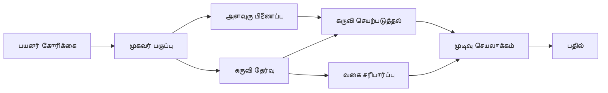

# 🛠️ Azure OpenAI (Responses API) (.NET) உடன் முன்னேற்றப்பட்ட கருவி பயன்பாடு

## 📋 கற்றல் நோக்கங்கள்

இந்த நோட்புக் Microsoft Agent Framework-ஐ .NET உடன் Azure OpenAI (Responses API) பயன்படுத்தி நிறுவன நிலை கருவி ஒருங்கிணைப்பு மாதிரிகளை காட்டுகிறது. பல நிபுணத்துவ கருவிகளுடன் ஆழமான முகவரிகளை உருவாக்கும் விதத்தில், C# இன் வலுவான வகுப்பீடு மற்றும் .NET இன் நிறுவன அம்சங்களை பயன்படுத்த கற்றுக்கொள்வீர்கள்.

### நீங்கள் ஆளவையாகக் கற்றுக்கொள்ளும் முன்னேற்றப்பட்ட கருவி திறன்கள்

- 🔧 **பல-கருவி கட்டமைப்பு**: பல நிபுணத்துவ திறன்களுடன் முகவரிகளை உருவாக்குதல்
- 🎯 **வகைப்பிடிப்புக்கான கருவி நிறைவேற்று**: C# இன் தொகுப்புத்தன்மை காலச் சரிபார்ப்பைப் பயன்படுத்துதல்
- 📊 **நிறுவன கருவி மாதிரிகள்**: தயாரிப்பு-தயார் கருவி வடிவமைப்பு மற்றும் பிழை கையாளுதல்
- 🔗 **கருவி சேர்க்கை**: சிக்கலான வணிக வேலைவழிகளுக்கான கருவிகள் ஒன்றிணைக்கல்

## 🎯 .NET கருவி கட்டமைப்பு நன்மைகள்

### நிறுவன கருவி அம்சங்கள்

- **தொகுப்புத்தன்மை காலச் சரிபார்ப்பு**: கருவி அளவுரு துல்லியத்தை உறுதி செய்யும் வலுவான வகுப்பீடு
- **இணைவு ஊட்டம்**: கருவி மேலாட்சிக்கான IoC கன்டெய்னர் ஒருங்கிணைப்பு
- **Async/Await மாதிரிகள்**: வளங்களைச் சரியாக நிர்வகித்து தடைசெய்யாத கருவி நிறைவேற்று
- **கட்டமைக்கப்பட்ட பதிவேற்றம்**: கருவி செயல்பாட்டை கண்காணிக்க கட்டமைக்கப்பட்ட பதிவு ஒருங்கிணைப்பு

### தயாரிப்பு-தயார் மாதிரிகள்

- **விரிவான பிழை கையாளுதல்**: வகைப்பிடிக்கப்பட்ட வன்முறை தவறுகளுடன் முழுமையான பிழை மேலாண்மை
- **வள மேலாண்மை**: சரியான அழிப்பு மாதிரிகள் மற்றும் நினைவக நிர்வாகம்
- **செயல்திறன் கண்காணிப்பு**: கட்டமைக்கப்பட்ட அளவுகோல்கள் மற்றும் செயல்திறன் கண்கணிப்புகள்
- **கட்டமைப்பு மேலாண்மை**: சரிபார்ப்புடன் வகைப்பிடிக்கும் கட்டமைப்பு

## 🔧 தொழில்நுட்ப கட்டமைப்பு

### முக்கிய .NET கருவி கூறுகள்

- **Microsoft.Extensions.AI**: ஒருங்கிணைந்த கருவி சுருக்கம் பரப்பு
- **Microsoft.Agents.AI**: நிறுவன நிலை கருவி ஒருங்கிணைப்பு
- **Azure OpenAI (Responses API)**: இணைப்பு பூலிங்குடன் கூடிய உயர் செயல்திறன் API கிளையண்ட்

### கருவி நிறைவேற்று குழாய்



## 🛠️ கருவி வகைகள் மற்றும் மாதிரிகள்

### 1. **தரவு செயலாக்க கருவிகள்**

- **உள்ளீடு சரிபார்ப்பு**: தரவு குறியீடுகளுடன் வலுவான வகுப்பீடு
- **மாற்றல் செயல்பாடுகள்**: வகை-பாதுகாப்பு தரவு மாற்றம் மற்றும் வடிவமைப்பு
- **வணிக தர்க்கம்**: பிராந்திய சூழலுக்கான கணக்கீடு மற்றும் பகுப்பாய்வு கருவிகள்
- **வெளியீடு வடிவமைப்பு**: கட்டமைக்கப்பட்ட பதில் உருவாக்கம்

### 2. **ஒருங்கிணைப்பு கருவிகள்**

- **API இணைப்பாளர்கள்**: HttpClient மூலம் RESTful சேவை ஒருங்கிணைப்பு
- **தரவுத்தளம் கருவிகள்**: தரவையறிதல் க்கான Entity Framework ஒருங்கிணைப்பு
- **கோப்பு செயல்பாடுகள்**: சரிபார்ப்புடன் பாதுகாப்பான கோப்பு அமைப்பு செயல்பாடுகள்
- **வெளியுறை சேவைகள்**: முப்பரிமாண சேவை ஒருங்கிணைப்பு மாதிரிகள்

### 3. **பயன்பாட்டுக் கருவிகள்**

- **உரை செயலாக்கம்**: சரமாக்கல் மற்றும் வடிவமைக்கும் நீர் மாற்றம்
- **தேதி/நேர செயல்பாடுகள்**: கலாச்சாரம் சார்ந்த தேதி/நேர கணக்குகள்
- **கணித கருவிகள்**: துல்லியமான கணக்குகள் மற்றும் புள்ளியியல் செயல்பாடுகள்
- **சரிபார்ப்பு கருவிகள்**: வணிக விதி சரிபார்ப்பு மற்றும் தரவு உறுதிப்படுத்தல்

வலுவான, வகைப்பிடிப்புக்கான செயல்பாடுகளுடன் .NET இல் நிறுவன நிலை முகவரிகளை உருவாக்க தயாரா? சில தொழில்முறை நிலை தீர்வுகளை கட்டமைப்போம்! 🏢⚡

## 🚀 தொடக்கம்

### தேவைகள்

- [.NET 10 SDK](https://dotnet.microsoft.com/download/dotnet/10.0) அல்லது அதற்கு மேல்
- Azure OpenAI வளம் மற்றும் ஒரு மாதிரி இடைமுக கொண்ட ஒரு [Azure சந்தா](https://azure.microsoft.com/free/)
- [Azure CLI](https://learn.microsoft.com/cli/azure/install-azure-cli) — `az login` உடன் உள்நுழைவு

### அவசியமான சுற்றுச்சூழல் மாறிகள்

```bash
# zsh/bash
export AZURE_OPENAI_ENDPOINT=https://<your-resource>.openai.azure.com
export AZURE_OPENAI_DEPLOYMENT=gpt-4o-mini
# பிறகு AzureCliCredential ஒரு டோக்கனைப் பெற சைன் இன் செய்யவும்
az login
```

```powershell
# PowerShell
$env:AZURE_OPENAI_ENDPOINT = "https://<your-resource>.openai.azure.com"
$env:AZURE_OPENAI_DEPLOYMENT = "gpt-4o-mini"
# பிறகு AzureCliCredential ஒரு டோக்கன் பெற கையொப்பமிடவும்
az login
```

### எடுத்துக்காட்டு குறியீடு

குறியீட்டைக் இயக்க,

```bash
# zsh/bash
chmod +x ./04-dotnet-agent-framework.cs
./04-dotnet-agent-framework.cs
```

அல்லது dotnet CLI பயன்படுத்தி:

```bash
dotnet run ./04-dotnet-agent-framework.cs
```

முழு குறியீட்டு விவரத்துக்கு [`04-dotnet-agent-framework.cs`](../../../../04-tool-use/code_samples/04-dotnet-agent-framework.cs) காண்க.

```csharp
#!/usr/bin/dotnet run

#:package Microsoft.Extensions.AI@10.*
#:package Microsoft.Agents.AI.OpenAI@1.*-*
#:package Azure.AI.OpenAI@2.1.0
#:package Azure.Identity@1.13.1

using System.ComponentModel;

using Microsoft.Agents.AI;
using Microsoft.Extensions.AI;

using Azure.AI.OpenAI;
using Azure.Identity;

// Tool Function: Random Destination Generator
// This static method will be available to the agent as a callable tool
// The [Description] attribute helps the AI understand when to use this function
// This demonstrates how to create custom tools for AI agents
[Description("Provides a random vacation destination.")]
static string GetRandomDestination()
{
    // List of popular vacation destinations around the world
    // The agent will randomly select from these options
    var destinations = new List<string>
    {
        "Paris, France",
        "Tokyo, Japan",
        "New York City, USA",
        "Sydney, Australia",
        "Rome, Italy",
        "Barcelona, Spain",
        "Cape Town, South Africa",
        "Rio de Janeiro, Brazil",
        "Bangkok, Thailand",
        "Vancouver, Canada"
    };

    // Generate random index and return selected destination
    // Uses System.Random for simple random selection
    var random = new Random();
    int index = random.Next(destinations.Count);
    return destinations[index];
}

// Azure OpenAI with the Responses API (stable v1 endpoint). Sign in with `az login`.
var azureEndpoint = Environment.GetEnvironmentVariable("AZURE_OPENAI_ENDPOINT")
    ?? throw new InvalidOperationException("AZURE_OPENAI_ENDPOINT is not set.");
var deployment = Environment.GetEnvironmentVariable("AZURE_OPENAI_DEPLOYMENT") ?? "gpt-4o-mini";

var azureClient = new AzureOpenAIClient(new Uri(azureEndpoint), new AzureCliCredential());

// Define Agent Identity and Comprehensive Instructions
// Agent name for identification and logging purposes
var AGENT_NAME = "TravelAgent";

// Detailed instructions that define the agent's personality, capabilities, and behavior
// This system prompt shapes how the agent responds and interacts with users
var AGENT_INSTRUCTIONS = """
You are a helpful AI Agent that can help plan vacations for customers.

Important: When users specify a destination, always plan for that location. Only suggest random destinations when the user hasn't specified a preference.

When the conversation begins, introduce yourself with this message:
"Hello! I'm your TravelAgent assistant. I can help plan vacations and suggest interesting destinations for you. Here are some things you can ask me:
1. Plan a day trip to a specific location
2. Suggest a random vacation destination
3. Find destinations with specific features (beaches, mountains, historical sites, etc.)
4. Plan an alternative trip if you don't like my first suggestion

What kind of trip would you like me to help you plan today?"

Always prioritize user preferences. If they mention a specific destination like "Bali" or "Paris," focus your planning on that location rather than suggesting alternatives.
""";

// Create AI Agent with Advanced Travel Planning Capabilities
// Get the Responses client for the deployment and create the AI agent
// Configure agent with name, detailed instructions, and available tools
// This demonstrates the .NET agent creation pattern with full configuration
AIAgent agent = azureClient
    .GetOpenAIResponseClient(deployment)
    .CreateAIAgent(
        name: AGENT_NAME,
        instructions: AGENT_INSTRUCTIONS,
        tools: [AIFunctionFactory.Create(GetRandomDestination)]
    );

// Create New Conversation Thread for Context Management
// Initialize a new conversation thread to maintain context across multiple interactions
// Threads enable the agent to remember previous exchanges and maintain conversational state
// This is essential for multi-turn conversations and contextual understanding
AgentThread thread = agent.GetNewThread();

// Execute Agent: First Travel Planning Request
// Run the agent with an initial request that will likely trigger the random destination tool
// The agent will analyze the request, use the GetRandomDestination tool, and create an itinerary
// Using the thread parameter maintains conversation context for subsequent interactions
await foreach (var update in agent.RunStreamingAsync("Plan me a day trip", thread))
{
    await Task.Delay(10);
    Console.Write(update);
}

Console.WriteLine();

// Execute Agent: Follow-up Request with Context Awareness
// Demonstrate contextual conversation by referencing the previous response
// The agent remembers the previous destination suggestion and will provide an alternative
// This showcases the power of conversation threads and contextual understanding in .NET agents
await foreach (var update in agent.RunStreamingAsync("I don't like that destination. Plan me another vacation.", thread))
{
    await Task.Delay(10);
    Console.Write(update);
}
```

---

<!-- CO-OP TRANSLATOR DISCLAIMER START -->
**மறுப்பு**:
இந்த ஆவணம் AI மொழிபெயர்ப்பு சேவை [Co-op Translator](https://github.com/Azure/co-op-translator) பயன்படுத்தி மொழிபெயர்க்கப்பட்டுள்ளது. நாங்கள் துல்லியத்திற்காக முயற்சி செய்துள்ளோம், ஆனால் தானாக செய்யப்படும் மொழிபெயர்ப்புகளில் பிழைகள் அல்லது தவறுகள் இருக்கலாம் என்பதை கவனத்தில் கொள்ளவும். அசல் ஆவணம் அதன் தாய்மொழியில் அதிகாரப்பூர்வ ஆதாரமாக கருதப்பட வேண்டும். முக்கியமான தகவல்களுக்கு, தொழில்நுட்பமான மனித மொழிபெயர்ப்பு பரிந்துரைக்கப்படுகிறது. இந்த மொழிபெயர்ப்பைப் பயன்படுத்துவதால் ஏற்படும் எந்த தவறான புரிதல்கள் அல்லது தவறான விளக்கத்திற்கும் நாங்கள் பொறுப்பில்வில்லை.
<!-- CO-OP TRANSLATOR DISCLAIMER END -->