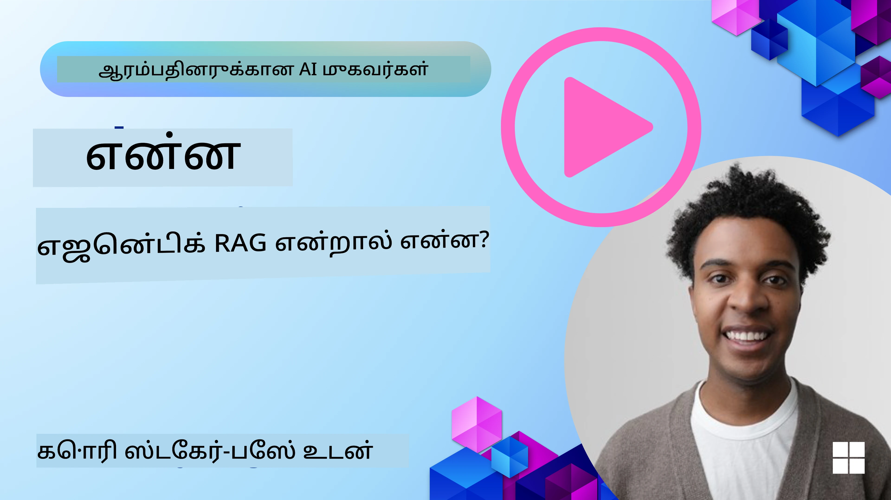
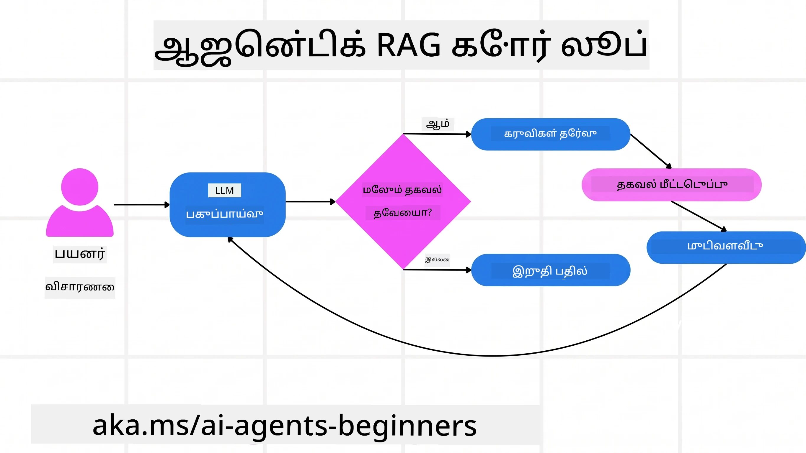
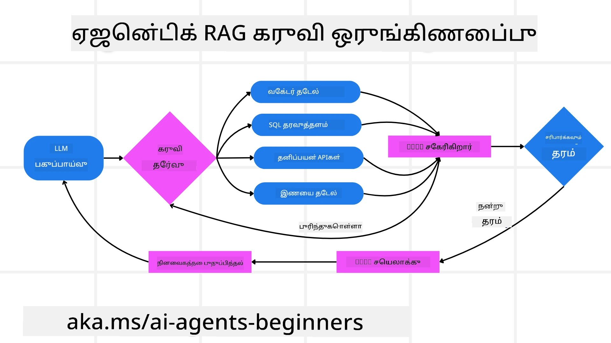
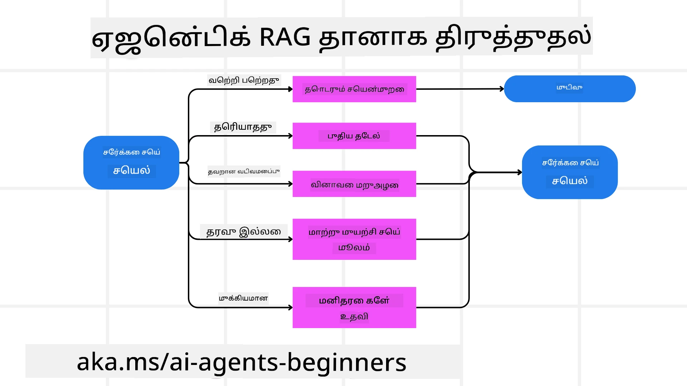
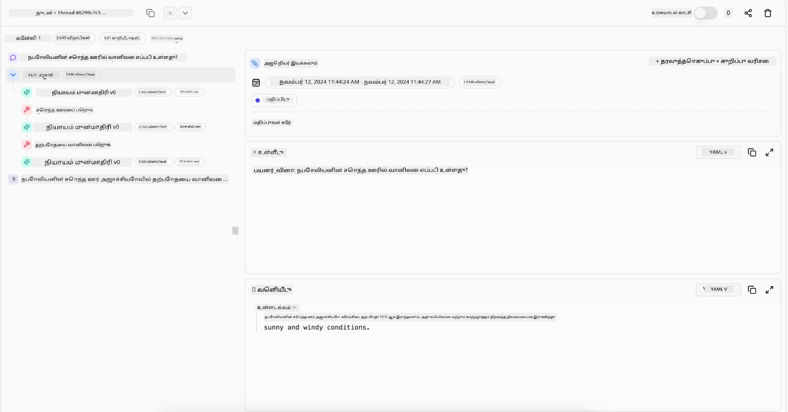

> _(இந்த பாடத்தின் வீடியோவைப் பார்க்க மேலுள்ள படத்தை அழுத்தவும்)_

# Agentic RAG

இந்த பாடம் Agentic Retrieval-Augmented Generation (Agentic RAG) எனும் புதுமையான AI மாற்று முறையை விரிவாக அறிமுகம் செய்கிறது, இது பெரிய மொழி மாதிரிகள் (LLMs) தன்னிச்சையாக அடுத்த படிகளை திட்டமிட்டு வெளிப்புற மூலம் தகவல்களை பெற்று செயல்படுகின்றன. நிலையான பெறுதல்-பிறகு-படித்தல் மாதிரிகளுக்கு மாறாக, Agentic RAG LLMக்கு மீண்டும் மீண்டும் அழைப்புகளை உருவாக்குகிறது, இது கருவி அல்லது செயல்பாட்டு அழைப்புகள் மற்றும் கட்டமைக்கப்பட்ட வெளியீடுகளுடன் இடைநிலை எடுக்கும். சிஸ்டம் முடிவுகளை மதிப்பீடு செய்து, கேள்விகளை திருத்தி, தேவையான போது கூடுதல் கருவிகளை அழைத்து, திருப்திகரமான தீர்வு வரைக்கும் இத்தெருவை தொடர்கிறது.

## அறிமுகம்

இந்த பாடத்தில் நீங்கள்

- **Agentic RAG ஐப் புரிந்துகொள்வது:** பெரிய மொழி மாதிரிகள் (LLMs) தன்னிச்சையாக அடுத்த படிகளை திட்டமிட்டு வெளிப்புற தரவுத் தோற்றங்களில் இருந்து தகவலைக் கொண்கின்ற புதிய AI மாற்று முறையைப் பற்றி அறியவும்.
- **மீண்டும் மீண்டும் செய்பவர்-சரிபார்ப்பவர் முறையைப் புரிந்துகொள்வது:** சரியானதையும் மோசமான கேள்விகளையும் கையாள்வதற்காக LLMக்கு இடையே கருவி அல்லது செயல்பாட்டு அழைப்புகள் மற்றும் கட்டமைக்கப்பட்ட வெளியீடுகளுடன் கூடிய மீண்டும் அழைப்புகளின் சுழற்சியை புரிந்து கொள்ளவும்.
- **பயன்பாட்டு நிகழ்வுகளை ஆராய்தல்:** Agentic RAG விளங்கும் சூழல்கள், உதாரணமாக சிறந்த துல்லியம் தேவைப்படும் சூழல்கள், சிக்கலான தரவுத்தள தொடர்புகள், நீண்டகால வேலைநிரல் போன்றவற்றை கண்டறியவும்.

## கற்றல் நோக்கங்கள்

இந்த பாடத்தை முடித்தபின், நீங்கள் தெரிந்துகொள்வீர்கள்/புரிந்துகொள்வீர்கள்:

- **Agentic RAG புரிதல்:** பெரிய மொழி மாதிரிகள் (LLMs) தன்னிச்சையாக அடுத்த படிகளை திட்டமிட்டு வெளிப்புற தரவுத் தோற்றங்களில் இருந்து தகவலை எடுக்கும் AI மாற்றுக் கொள்கையைப் பற்றி அறியவும்.
- **மீண்டும் செய்பவர்-சரிபார்ப்பவர் முறையைப் புரிதல்:** சரியானதையும் மோசமான கேள்விகளையும் கையாள, கருவி அல்லது செயல்பாட்டு அழைப்புகள் மற்றும் கட்டமைக்கப்பட்ட வெளியீடுகளுடன் LLMக்கு மீண்டும் அழைப்புகளின் சுழற்சியைப் புரிந்து கொள்ளவும்.
- **தர்க்கவாத செயல்முறை உரிமை பெறல்:** சிஸ்டம் தன்னுடைய தர்க்கவாத செயல்முறையைச் சொந்தமாகக் கொண்டு, தீர்வுகளை அணுகுவதற்கான வழிகளைக் கையேடு இருப்பதில்லை என்பதை புரிந்துகொள்ளவும்.
- **வேலைநிலையைப் புரிந்துகொள்ளல்:** மார்க்கெட் போக்கு அறிக்கைகளை பெறுதல், போட்டியாளர்கள் தரவை கண்டறிதல், உள்ளக விற்பனை அளவுகோல்களுடன் தொடர்புபடுத்தல், கண்டுபிடிப்புகளை ஒருங்கிணைத்தல் மற்றும் திட்டத்தை மதிப்பீடு செய்வது போன்றவற்றை தானாகத் தீர்மானிக்கும் விதமாக ஒரு ஏஜென்ட் மாதிரி எப்படி செயல்படுகின்றது என்பதை உணரவும்.
- **மீண்டும் சுழற்சிகள், கருவி சேர்க்கை மற்றும் நினைவகம்:** மீண்டும் நிகழும் தொடர்பு மாதிரியை நினைவகம் மற்றும் நிலையை பராமரிப்பதன் மூலம் பயனுள்ள முடிவுகளுக்கு வழிகாட்டுவது மற்றும் சுழற்சிகளைத் தவிர்க்க செய்வதைப் பற்றி அறியவும்.
- **தோல்வி நிலைகளையும் தான்தானே திருத்தலையும் கையாளுதல்:** வலுவான தான்தானே திருத்தல் நுட்பங்கள், மீண்டும் மற்றும் மீண்டும் கேட்கும், பகுப்பாய்வுக் கருவிகளைப் பயன்படுத்துதல் மற்றும் மனித கண்காணிப்பில் திரும்புதல் ஆகியவற்றைப் பற்றி ஆராயவும்.
- **ஒன்றிணைவு எல்லைகள்:** Agentic RAG இன் எல்லைகள், குறிப்பாக துறையை சார்ந்த தன்னாட்சி, அடிப்படை வசதிகளுக்கு சார்ந்திருத்தல் மற்றும் பாதுகாப்பு கட்டுப்பாடுகள் மீதான மதிப்புமிக்கதைப் புரிந்து கொள்ளவும்.
- **பயன்பாட்டு நிலைகளும் மதிப்பும்:** Agentic RAG சிறந்து விளங்கும் சூழல்கள், உதாரணமாக துல்லியத்திற்கான முதலமைச்சு சூழல்கள், சிக்கலான தரவுத்தள தொடர்புகள் மற்றும் நீண்டகால வேலைநிலைகள் ஆகியவற்றை அடையாளப்படுத்தவும்.
- **மாநில நிர்வாகம், வெளிப்படைத்தன்மை மற்றும் நம்பகத்தன்மை:** விளக்கமான தர்க்கம், பாகுபாடு கட்டுப்பாடு மற்றும் மனித கண்காணிப்பு முக்கியத்துவத்தைப் பற்றி அறியவும்.

## Agentic RAG என்பது என்ன?

Agentic Retrieval-Augmented Generation (Agentic RAG) என்பது பெரிய மொழி மாதிரிகள் (LLMs) தன்னிச்சையாக அடுத்த படிகளை திட்டமிட்டு வெளிப்புற மூலம் தரவிலிருந்து தகவலைப் பெறும் ஒரு புதிய AI முறை. நிலையான பெறுதல்-பிறகு-படித்தல் மாதிரிகளுக்கு மாறாக, Agentic RAG LLMக்கு மீண்டும் அழைப்புகளைக் கொண்டிருக்கிறது, இடையில் கருவி அல்லது செயல்பாட்டு அழைப்புகள் மற்றும் கட்டமைக்கப்பட்ட வெளியீடுகளுடன். சிஸ்டம் முடிவுகளை மதிப்பீடு செய்து, கேள்விகளை திருத்தி, தேவையான போது கூடுதல் கருவிகளை அழைத்து, திருப்திகர தீர்வுக்காக இத்தெருவை தொடர்கிறது. இந்த மீண்டும் “செய்பவர்-சரிபார்ப்பவர்” முறை துல்லியத்தைக் கண்டறிவதில், மோசமாக அமைந்த கேள்விகளை கையாள்வதில், உயர்தர முடிவுகளைக் கிடைக்கச் செய்கிறது.

சிஸ்டம் தன்னுடைய தர்க்கவாத செயல்முறையைத் entirely உரிமை பெற்றுள்ளது, தோல்வியளிக்கும் கேள்விகளை மறுபடி எழுதுவது, வேறு பெறும் முறைமைகளை தேர்ந்தெடுப்பது, மற்றும் பல கருவிகளை ஒருங்கிணைப்பது (Azure AI Search இல் வட்டார தேடல், SQL தரவுத்தளங்கள் அல்லது தனிப்பயன் API கள் போன்றவை) ஆகியவையைச் செய்யும். ஒரு агентக்கான தனித்துவமான இயல்பு அதன் சுயமான தர்க்கவாத செயல்முறையை உரிமை பெறுவதாகும். பாரம்பரிய RAG செயல்பாடுகள் முன்கோப்புகளைக் கொண்டிருப்பதற்கு நம்பிக்கையுடன் இருக்கும், ஆனால் ஒரு агентிகமான சிஸ்டம் சுயமாக தகவல் தரத்தின் தரத்தோடு படிகள் வரிசையை முடிவெடுக்கிறது.

## Agentic Retrieval-Augmented Generation (Agentic RAG) என்பவற்றை வரையறுத்தல்

Agentic Retrieval-Augmented Generation (Agentic RAG) என்பது LLM கள் வெளிப்புற தரவுத் தோட்டங்களிலிருந்து தகவலைப் பெறுவதோடு மட்டுமல்லாது அடுத்த படிகளை தன்னிச்சையாக திட்டமிடும் ஒரு புதிய AI மாற்று முறை. நிலையான தோற்று-பிறகு-படித்தல் அல்லது கவனமாக நிர்ணயிக்கப்பட்ட ப்ராம்ட் வரிசைகள் விட மாறாக, Agentic RAG LLMக்கு மீண்டும் அழைப்புகள் கொண்டுள்ளது. இதன் இடையே கருவி அல்லது செயல்பாடு அழைப்புகள் மற்றும் கட்டமைக்கப்பட்ட வெளியீடுகளுடன் உள்ளது. ஒவ்வொரு தருணத்திலும் சிஸ்டம் கிடைத்த முடிவுகளை மதிப்பீடு செய்து, கேள்விகளை திருத்த வேண்டுமா என தீர்மானித்து, கூடுதல் கருவிகளைப் பயன்படுத்தி, திருப்திகரமான முடிவு வரைய வரை இத்தெருவை தொடர்கிறது.

இந்த மீண்டும் “செய்பவர்-சரிபார்ப்பவர்” வேலை முறை மாற்றங்கள் திருத்தல், மோசமான கேள்விகளைக் கையாளுதல், மற்றும் சமநிலையான மற்றும் உயர்தர முடிவுகளை உறுதிப்படுத்த உருவாக்கப்பட்டது. கவனமாக வடிவமைக்கப்பட்ட ப்ராம்ட் சங்கிலிகளுக்கு மட்டுமே சாராமல், சிஸ்டம் தன்னுடைய தர்க்கவாத செயல்முறையை உரிமை பெற்றுள்ளது. தோல்வியடையுமெனில் கேள்விகளை மறுபடியும் எழுதக்கூடும், வேறு பெறும் முறைகளைத் தேர்ந்தெடுக்கலாம் மற்றும் பல கருவிகளை ஒருங்கிணைத்து முடிவை முடிக்கலாம். இது மிகுந்த சிக்கலான ஒருங்கிணைப்பு கட்டமைப்புகளுக்கு மாற்றாக, “LLM அழைப்பு → கருவி பயன்பாடு → LLM அழைப்பு → …” என்ற எளிய சுழற்சி மூலம் வளமான வெளியீடுகளை உருவாக்க முடியும்.

## தர்க்கவாத செயல்முறைக்கு உரிமை பெறுதல்

ஒரு சிஸ்டத்தை “agentic” ஆக மாற்றும் தனித்துவமான இயல்பு அதன் தர்க்கவாத செயல்முறைக்கு உரிமை பெறுவதில் உள்ளது. பாரம்பரிய RAG செயல்பாடுகள் பெரும்பாலும் மனிதர்கள் மாதிரிக்கு ஒரு முன்னிருப்பு பாதையை அமைக்கின்றனர்; எப்போது மற்றும் என்ன பெறுவதற்கான சிந்தனை சங்கிலி.
ஆனால் ஒரு சிஸ்டம் உண்மையாக படிப்பறிவுடையதால், அது பிரச்சினையை எப்படி அணுக வேண்டுமென்று உள்ளூராக முடிவெடுக்கிறது. அது ஒரு நூலை செயல்படுத்துவதல்ல; இது தகவல் தரத்தைக் கொண்டு படிகளின் வரிசையை தன்னிச்சையாகத் தேர்ந்தெடு்கிறது.
உதாரணமாக, ஒரு தயாரிப்பு வெளியீட்டு திட்டத்தைக் கேட்கப்பட்டால், அது முழு ஆராய்ச்சி மற்றும் முடிவு எடுக்கும் வேலைநிலைகளை ப்ராம்ட் மூலம் விளக்காமல், தன்னிச்சையாக தீர்மானிக்கிறது:

1. Bing Web Grounding மூலம் தற்போதைய மார்க்கெட் போக்கு அறிக்கைகளை பெறுதல்
2. Azure AI Search மூலம் தொடர்புடைய போட்டியாளர் தரவுகளை கண்டறிதல்.
3. Azure SQL Database பயன்படுத்தி வரலாற்று உள்ளக விற்பனை அளவுகோல்களை தொடர்புபடுத்தல்.
4. Azure OpenAI Service வழியாக ஒன்றிணைத்து அமைந்த ஒரு திட்டமாக கண்டுபிடிப்புகளை வடிவமைத்தல்.
5. திட்டத்தில் உள்ள இடைவெளிகள் அல்லது முரண்பாடுகள் உண்டா என மதிப்பீடு செய்து, தேவையான போது மறுநாடி பெறுதல்.
கேள்விகளை திருத்துதல், மூலங்களைத் தேர்ந்தெடுக்கும், பதில் “தோெளிவானது” என்று தானாக முடிவு செய்வது போன்ற அனைத்தும் மாதிரி, மனிதனால் முன்கோப்பாக எழுதப்படவில்லை.

## மீண்டும் சுழற்சி, கருவி ஒருங்கிணைப்பு மற்றும் நினைவகம்

ஒரு agentic சிஸ்டம் மீண்டும் நிகழும் தொடர்பு மாதிரியை பயன்படுத்துகிறது:

- **ஆரம்ப அழைப்பு:** பயனரின் இலக்கு (பயனர் ப்ராம்ட்) LLMக்கு வழங்கப்படுகிறது.
- **கருவிவழி அழைப்பு:** சிஸ்டம் தேவையான தகவல் இல்லை என அல்லது தெளிவற்ற அறிவுரைகள் உள்ளன என எடுத்துக்கொள்ளும்போது, ஒரு கருவி அல்லது பெறும் முறையைத் தேர்ந்தெடுக்கும்—எ.கு., Azure AI Search இல் தனிப்பட்ட தரவுகளில் வட்டார தேடல் அல்லது கட்டமைக்கப்பட்ட SQL அழைப்பு.
- **மதிப்பீடு, திருத்தம்:** திரும்பும் தரவை மதிப்பீடு செய்த பிறகு, தகவல் சரியாக உள்ளது என தெரிந்தால், தீர்மானிக்கிறது. இல்லையெனில், கேள்வியை திருத்தி, வேறு கருவியை முயற்சி செய்யும் அல்லது அணுகுமுறையை மாற்றும்.
- **திருப்தி வரைக்கும் தொடரவும்:** இந்த சுழற்சி மூலமாக பரிசோதனை செய்து இறுதி, நன்கு பரிசீலிக்கப்பட்ட பதிலை வழங்க கூடுதல் தெளிவும் ஆதாரமும் கிடைக்கும்வரை தொடர்கிறது.
- **நினைவகம் மற்றும் நிலை:** சிஸ்டம் படிகளின் இடையே நிலை மற்றும் நினைவகத்தை பராமரிக்கும்போது, முந்தைய முயற்சிகளையும் அவற்றின் விளைவுகளையும் நினைவில் வைத்துக் கொண்டிருப்பதால், மீண்டும் மீண்டும் சுழற்சிகளைத் தவிர்க்க முடியும் மற்றும் மேலும் அறிவார்ந்த முடிவுகளை எடுக்க முடியும்.

காலப்போக்கில், இது வளர்ந்துள்ள புரிதலை உருவாக்குகிறது, அவ்வாறு மாதிரி அடிக்கடி மனிதர் தலையீடு செய்யாதிருந்தாலும் அல்லது ப்ராம்ட்டை மறுசீரமைக்காமல் சிக்கலான, பல படிகள் கொண்ட பணிகளைச் சமாளிக்க முடிகிறது.

## தோல்வி நிலைகள் மற்றும் தான்சரி திருத்தல் கையாளல்

Agentic RAG தன்னிச்சையாக இயங்குவதும் வலுவான தான்சரி திருத்தல் நுட்பங்களைக் கொண்டுள்ளது. சிஸ்டம் தவறான ஆவணங்களைப் பெறும் போது அல்லது மோசமான கேள்விகளுடன் சந்திப்பின் போது, அது:

- **மீண்டும் முயற்சி செய்து கேள்விகள்:** குறைந்த மதிப்புடைய பதில்களைத் தருவதற்கு பதிலாக, மாதிரி புதிய தேடல் உத்திகளை முயற்சி செய்ய, தரவுத்தள கேள்விகளை மறுபடியும் எழுத, அல்லது மாற்று தரவுத் தொகுப்புகளைப் பார்க்கிறது.
- **பகுப்பாய்வு கருவிகளைப் பயன்படுத்துதல்:** சிஸ்டம் தனது தர்க்க வழிசெயல்களுக்கு டீபக் செய்ய அல்லது பெறப்பட்ட தரவுகளின் சரியானதை உறுதிப்படுத்த கூடுதல் செயல்பாடுகளை அழைக்கலாம். Azure AI Tracing போன்ற கருவிகள் வலுவான கண்காணிப்பு மற்றும் பார்வை திறனை வழங்க முக்கியமாக இருக்கும்.
- **மனித கண்காணிப்பிற்கு திரும்புதல்:** அதிக ஆபத்துக்களோ அல்லது மீண்டும் தோல்வியடைந்த சூழலில், மாதிரி நிச்சயதாரிதுவை காட்டி மனித வழிகாட்டுதலை கோரலாம். மனிதர் திருத்த போதுமான கருத்துக்களை வழங்கியவுடன், மாதிரி அந்த பாடத்தையும் எதிர்காலத்திற்கு எடுத்துக் கொள்ள முடியும்.

இச்சுழற்சி மற்றும் தொழில்திறனான அணுகுமுறை மாதிரிக்கு தொடர்ச்சியான மேம்பாட்டை வழங்குகிறது, இதனால் அது ஒரே முறைத்தானாக செயல்படுவதில்லை, பருவச்செயலில் உள்ள தவறுகளிலிருந்து கற்றுக் கொள்கிறது.

## அதிகாரத்தின் எல்லைகள்

பணிக்குள் தன்னிச்சையாக இருந்தாலும், Agentic RAG செயற்கை பரந்த அறிவு (Artificial General Intelligence) போல அல்ல. அதன் “agentic” திறன்கள் மனித மேம்பாட்டாளர்களால் வழங்கப்பட்ட கருவிகள், தரவு மூலங்கள் மற்றும் கொள்கைகளுக்கு மட்டுமே வரையறுக்கப்பட்டுள்ளது. அது தன்னுடைய கருவிகளைச் சிந்திக்க முடியாது அல்லது அமைக்கப்பட்ட துறையின் எல்லைகளை மீற முடியாது. அதற்குப் பதிலாக, உள்ளது கிடைக்கும் வளங்களை தனித்துவமாக ஒழுங்குபடுத்த சிறந்த முறையில் செய்கிறது.
முன்னேறிய AI வடிவங்களைவிட முக்கிய வேறுபாடுகள்:

1. **துறை சார்ந்த தன்னாட்சி:** Agentic RAG சிஸ்டங்கள் தெரிந்த துறையில் பயனர் வரையறுத்த இலக்குகளை அடைவதில் கவனம் கொடுக்கின்றன, கேள்விகள் மறுபடியும் எழுதப்படுத்தல் அல்லது கருவி தேர்வு போன்றவைகளைப் பயன்படுத்துகின்றன.
2. **அடிப்படை வசதிகளுக்கு சார்ந்தது:** சிஸ்டம் மேம்பாட்டாளர்களால் ஒருங்கிணைக்கப்பட்ட கருவிகள் மற்றும் தரவுகளின் மீது சார்ந்தது. மனித தலையீடு இல்லாமல் இந்த எல்லைகளை மீற முடியாது.
3. **பாதுகாப்பு கட்டுப்பாடுகளுக்கு மதிப்பு:** ஒழுக்கக்கடிதங்கள், விதி விதிமுறைகள் மற்றும் வணிகக் கொள்கைகள் மிகவும் முக்கியம். ஏஜெண்ட் சுதந்திரம் எப்போதும் பாதுகாப்பு நடவடிக்கைகள் மற்றும் கண்காணிப்பு முறைகளால் கட்டுப்படுத்தப்படுகிறது (என நம்புகிறோம்?)

## நடைமுறை பயன்பாடுகள் மற்றும் மதிப்பு

Agentic RAG மிகவும் பொருத்தமானது மீண்டும் திருத்தல் மற்றும் துல்லியம் தேவையான சூழல்களில்:

1. **துல்லியத்திற்கு முன்னுரிமை கொடுக்கும் சூழல்கள்:** ஒழுங்குப்பாலனைச் சரிபார்க்கும், விதிநிலை பகுப்பாய்வு, சட்ட ஆராய்ச்சி போன்றபோது, ஏஜெண்ட் மாதிரி உண்மைகளை மீண்டும் மீண்டும் சரிபார்க்க, பல மூலங்களைக் காணொளி பார்க்க மற்றும் கேள்விகளை மறுபடியும் எழுதுகிறது முழுமையாக பரிசீலிக்கப்பட்ட பதிலை உருவாக்க.
2. **சிக்கலான தரவுத்தள தொடர்புகள்:** கட்டமைக்கப்பட்ட தரவுகளுடன் பணியாற்றும்போது, கேள்விகள் தோல்வியடையா அல்லது சீர்செய்ய வேண்டிய அவசியமா என்றால், சிஸ்டம் தன்னிச்சையாக கேள்விகளை திருத்தி Azure SQL அல்லது Microsoft Fabric OneLake பயன்படுத்தி இறுதி பெறுதலை பயனர் நோக்கத்திற்கு ஒத்ததாக மாற்றுகின்றது.
3. **நீண்டகால வேலைநிலைகள்:** நீண்ட கால அமர்வுகள் புதிய தகவல்கள் வெளிப்படுவதோடு வளர்ச்சியடைந்து, Agentic RAG தொடர்ந்து புதிய தரவுகளை உள்ளடக்கி, பிரச்சினை பகுதியைப் பற்றி மேலும் கற்றுக்கொள்வதோடு தந்திரங்களை மாற்றிக் கொண்டிருக்கும்.

## நிர்வாகம், வெளிப்படை மற்றும் நம்பிக்கை

இச்சிஸ்டங்கள் தன்னிச்சையாக தர்க்கம் செய்யும் போது, நிர்வாகமும் வெளிப்படையுமானது மிகவும் முக்கியம்:

- **விளக்கக்கூடிய தர்க்கம்:** மாதிரி எடுத்த கேள்விகள், பார்க்கப்பட்ட மூலங்கள் மற்றும் முடிவைக் கொண்டுவரும் வரை எடுத்த தர்க்க நடவடிக்கைகளின் பதிவைக் கண்காணிக்கலாம். Azure AI Content Safety மற்றும் Azure AI Tracing / GenAIOps போன்ற கருவிகள் வெளிப்படையையும் ஆபத்துக்களை குறைப்பதையும் உதவுகின்றன.
- **பாகுபாடு கட்டுப்பாடு மற்றும் சமநிலை பெறுதல்:** மேம்பாட்டாளர்கள் பெறும் உத்திகளை சமநிலைப் பொருத்த தரவுத்தளங்களை கவனிக்க அமைக்கலாம், மற்றும் வழக்கமாக வெளியீடுகளைத் தொடர்ந்து சோதிக்கலாம், Azure Machine Learning பயன்பாட்டுக்கான மேம்பட்ட தரவியல் அமைப்புகளுடன்.
- **மனித கண்காணிப்பு மற்றும் ஒத்துழைப்பு:** உள்வளங்கள் அதிகமான பணிகளுக்காக மனிதச் சோதனை அவசியம்தான். Agentic RAG மனிதத் தீர்மானங்களை மாற்றாது; அதற்கு மேலதிகமாக முழுமையான மற்றும் பரிசீலிக்கப்பட்ட விருப்பங்களை வழங்குகிறது.

நடவடிக்கைகள் பற்றிய தெளிவான பதிவுகள் வழங்கும் கருவிகள் அவசியம். இவை இல்லாமல், பல படிகள் உடைய செயல்முறையை டீபக் செய்தல் மிகவும் கடினமாகும். Literal AI (Chainlit பின்னணியில் நிறுவனம்) இல் இருந்து ஒரு ஏஜெண்ட் ஓட்டத்தின் உதாரணம் கீழே உள்ளது:

## முடிவு

Agentic RAG என்பது கம்பிய உள்ளடக்க அத்தூறு செயல்பாடுகளை கையாளும் விதத்தில் இயந்திரக் கற்றல் முறைமைகளின் ஒரு இயற்கையான முன்னேற்றம் ஆகும். மீண்டும் நிகழும் தொடர்பு மாதிரியைப் பின்பற்றி, கருவிகளை தன்னிச்சையாகத் தேர்ந்தெடுத்து, கேள்விகளைத் திருத்தி உயர்தர முடிவுகளை அடையும் வரை செயல்படுவது மூலம், சிஸ்டம் நிலையான ப்ராம்ட் பின்பற்றுகிற முறைமைக்குப் பார் மாற்றி, சுற்றுப்புற சூழலை அறிந்த, நிலைத்த ஒரு தீர்மான எடுப்பவராக ஆகிறது. மனித நிர்ணயிக்கப்பட்ட அடிப்படை வசதிகளுடன் ஒத்துழைத்தே, இவை வளமான, வேகமான மற்றும் பயனுள்ள AI தொடர்புகளை நிறுவனங்களுக்கும் முடிவுகளை பெறும் பயனர்களுக்கும் வழங்குகிறது.

### Agentic RAG பற்றி மேலும் கேள்விகள் உள்ளதா?

மற்ற கற்றுக்கொள்ளுபவர்களுடன் சந்திக்க, அலுவலக நேரங்களில் கலந்துகொண்டு உங்கள் AI ஏஜெண்ட் கேள்விகளுக்கு பதில்கள் பெற [Microsoft Foundry Discord](https://discord.com/invite/ATgtXmAS5D) இணையதளத்தைச் சேர்ந்தோம்.

## கூடுதல் வளங்கள்

- <a href="https://learn.microsoft.com/training/modules/use-own-data-azure-openai" target="_blank">Azure OpenAI சேவையுடன் Retrieval Augmented Generation (RAG) ஐ செயல்படுத்துக: உங்கள் சொந்த தரவை Azure OpenAI சேவையில் பயன்படுத்துவது எப்படி என்பதைப் பற்றி Microsoft Learn இன் விரிவான வழிகாட்டி.</a>
- <a href="https://learn.microsoft.com/azure/ai-studio/concepts/evaluation-approach-gen-ai" target="_blank">Microsoft Foundry மூலம் உருவாக்க AI செயலிகளின் மதிப்பீடு: மக்கள் பயன்படுத்தும் தரவுத்தளங்களில் மாதிரிகள் மதிப்பீடு மற்றும் ஒப்பிடல், Agentic AI செயலிகள் மற்றும் RAG கட்டமைப்புகளை உள்ளடக்கியது.</a>
- <a href="https://weaviate.io/blog/what-is-agentic-rag" target="_blank">Agentic RAG என்பது என்ன | Weaviate</a>
- <a href="https://ragaboutit.com/agentic-rag-a-complete-guide-to-agent-based-retrieval-augmented-generation/" target="_blank">Agentic RAG: ஏஜெண்ட் அடிப்படையிலான Retrieval Augmented Generation முழுமையான வழிகாட்டி – Generation RAG பற்றிய செய்திகள்</a>

- <a href="https://huggingface.co/learn/cookbook/agent_rag" target="_blank">ஏஜென்டிக் RAG: உங்கள் RAG ஐ கேள்வி மறுசீரமைப்பு மற்றும் சுயக் கேள்வியுடன் டர்போச்சார்ஜ் செய்யவும்! ஹக்கிங்க் ஃபேஸ் ஓபன்-சோர்ஸ் AI குக்‌புக்</a>
- <a href="https://youtu.be/aQ4yQXeB1Ss?si=2HUqBzHoeB5tR04U" target="_blank">RAG க்கு ஏஜென்டிக் அடுக்குகளைச் சேர்க்கிறது</a>
- <a href="https://www.youtube.com/watch?v=zeAyuLc_f3Q&t=244s" target="_blank">அறிவுக் உதவியாளர்களின் எதிர்காலம்: ஜெரி லியு</a>
- <a href="https://www.youtube.com/watch?v=AOSjiXP1jmQ" target="_blank">எழுச்சி RAG அமைப்புகளை எப்படி உருவாக்குவது</a>
- <a href="https://ignite.microsoft.com/sessions/BRK102?source=sessions" target="_blank">உங்கள் AI ஏஜென்ட்களை விரிவாக்க மைக்ரோசாஃப்ட் ஃபௌன்ட்ரி ஏஜென்டு சேவையைப் பயன்படுத்துவது</a>

### கல்வி பத்திரிகைகள்

- <a href="https://arxiv.org/abs/2303.17651" target="_blank">2303.17651 சுய-செலுத்தல்: சுய-பின்னூட்டத்துடன் தொடர்ச்சியான மேம்பாடு</a>
- <a href="https://arxiv.org/abs/2303.11366" target="_blank">2303.11366 ரெஃப்ளெக்ஷன்: வாய்மொழி ஊக்குவிப்புடன் மொழி ஏஜென்ட்கள்</a>
- <a href="https://arxiv.org/abs/2305.11738" target="_blank">2305.11738 CRITIC: பெரிய மொழி மாதிரிகள் கருவி-இணைக்கப்பட்ட விமர்சனத்துடன் தானாக திருத்திக் கொள்ள முடியும்</a>
- <a href="https://arxiv.org/abs/2501.09136" target="_blank">2501.09136 ஏஜென்டிக் மீட்பு-வளர்ச்சிப்பெற்ற உருவாக்கம்: ஏஜென்டிக் RAG தொடர்பான ஆய்வு</a>

## முந்தைய பாடம்

[கருவி பயன்பாடு வடிவமைப்பு மாதிரி](../04-tool-use/README.md)

## அடுத்த பாடம்

[நம்பகமான AI ஏஜென்ட்களை உருவாக்குதல்](../06-building-trustworthy-agents/README.md)

---

<!-- CO-OP TRANSLATOR DISCLAIMER START -->
**மறுப்பு**:
இந்த ஆவணம் AI மொழிபெயர்ப்பு சேவை [Co-op Translator](https://github.com/Azure/co-op-translator) பயன்படுத்தி மொழிபெயர்க்கப்பட்டுள்ளது. நாங்கள் துல்லியத்திற்காக முயற்சி செய்துள்ளோம், ஆனால் தானாக செய்யப்படும் மொழிபெயர்ப்புகளில் பிழைகள் அல்லது தவறுகள் இருக்கலாம் என்பதை கவனத்தில் கொள்ளவும். அசல் ஆவணம் அதன் தாய்மொழியில் அதிகாரப்பூர்வ ஆதாரமாக கருதப்பட வேண்டும். முக்கியமான தகவல்களுக்கு, தொழில்நுட்பமான மனித மொழிபெயர்ப்பு பரிந்துரைக்கப்படுகிறது. இந்த மொழிபெயர்ப்பைப் பயன்படுத்துவதால் ஏற்படும் எந்த தவறான புரிதல்கள் அல்லது தவறான விளக்கத்திற்கும் நாங்கள் பொறுப்பில்வில்லை.
<!-- CO-OP TRANSLATOR DISCLAIMER END -->