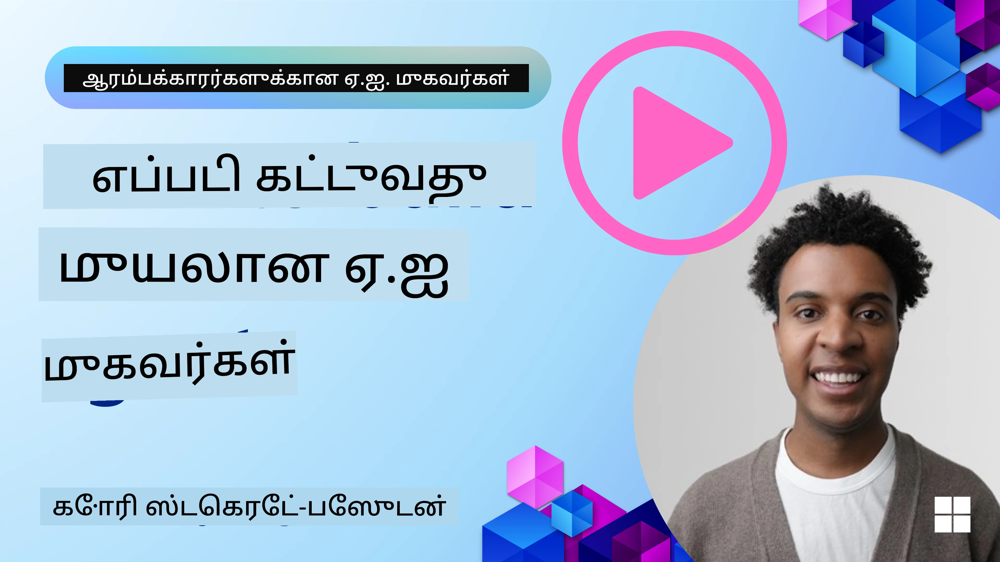
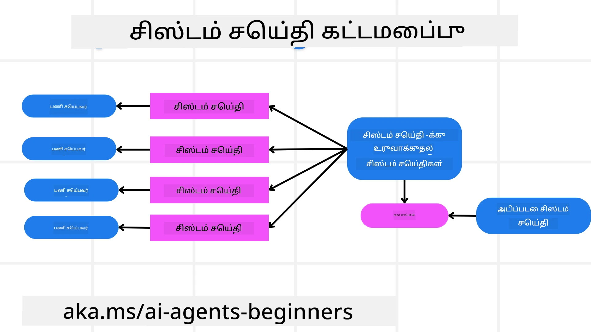
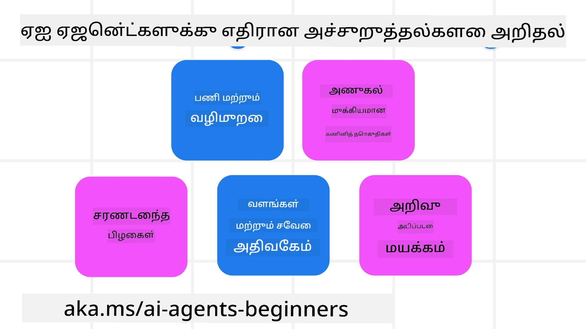
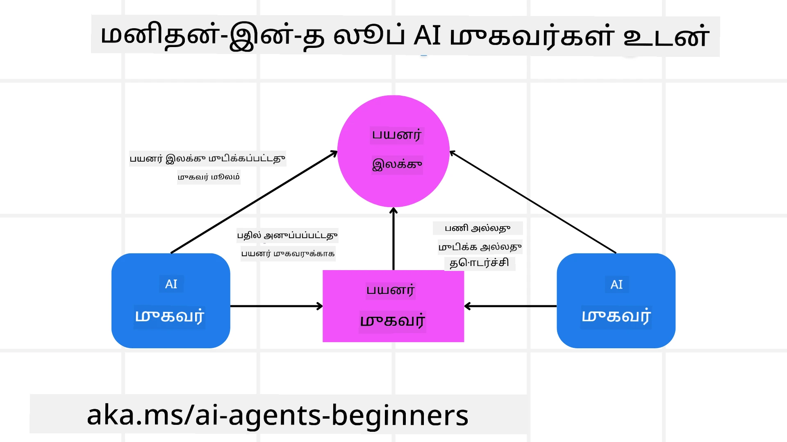

[](https://youtu.be/iZKkMEGBCUQ?si=Q-kEbcyHUMPoHp8L)

> _(இந்த பாடத்தின் வீடியோவைப் பார்க்க மேலுள்ள படத்தை கிளிக் செய்யவும்)_

# நம்பகமான AI முகவர்கள் உருவாக்குதல்

## அறிமுகம்

இந்த பாடம் கீழ்கண்டவைகளை கவரும்:

- பாதுகாப்பான மற்றும் விளைவுள்ள AI முகவர்களை எப்படி உருவாக்கி பிரசாரம் செய்வது
- AI முகவர்கள் உருவாக்கும்போது முக்கியமான பாதுகாப்பு கருத்துக்களை
- AI முகவர்கள் உருவாக்கும்போது தரவு மற்றும் பயனர் தனியுரிமையை எப்படி பராமரிப்பது

## கற்றல் குறிக்கோள்கள்

இந்த பாடத்தை முடித்த பிறகு, நீங்கள் எப்படி:

- AI முகவர்களை உருவாக்கும்போது ஆபத்துகளை அடையாளம் காண்பது மற்றும் குறைக்குவது
- தரவு மற்றும் அணுகல் முறையாக பராமரிக்கப்படுவதை உறுதிசெய்ய பாதுகாப்பு முறைகளை அமல்படுத்துவது
- தரவு தனியுரிமையை பராமரிக்கும் மற்றும் தரமான பயனர் அனுபவத்தை வழங்கும் AI முகவர்களை உருவாக்குவது

## பாதுகாப்பு

முதலில் பாதுகாப்பான முகவர் செயலிகளைக் கட்டமைப்போம். பாதுகாப்பு என்பது AI முகவர் வடிவமைத்தபடி செயல்படுவதை குறிக்கும். முகவர் செயலிகள் உருவாக்குநர்களாக நாம் possessing முறைகள் மற்றும் கருவிகள் உள்ளன அவை பாதுகாப்பை அதிகபட்சமாக்க.

### ஒரு சிஸ்டம் செய்தி கட்டமைப்பை உருவாக்குதல்

நீங்கள் இதற்கு முன்பு பெரிய மொழி மாதிரிகள் (LLMs) பயன்படுத்தி AI செயலி உருவாக்கியிருந்தால், ஒரு வலுவான சிஸ்டம் ப்ராம்ட் அல்லது சிஸ்டம் செய்தி வடிவமைப்பதன் முக்கியத்துவத்தை நீங்கள் அறிவீர்கள். இவை LLM பயனர் மற்றும் தரவுடன் எவ்வாறு தொடர்பு கொள்ள வேண்டும் என்பதற்கான மீட்டுள் விதிகள், வழிமுறைகள் மற்றும் வழிகாட்டிகளைக் கொடுக்கும்.

AI முகவர்களுக்கு, system prompt இன்னும் முக்கியமானது ஏனென்றால் AI முகவர்கள் மிகவிரிவான வழிமுறைகளை எதிர்பார்க்கின்றனர், அதை நாம் வடிவமைத்துள்ள பணிகளை முடிக்க.

விட்டுக்கொடுக்கக்கூடிய system prompts உருவாக்க, நாம் applicationல் ஒரு அல்லது அதற்கு மேற்பட்ட முகவர்களை உருவாக்க ஒரு system message கட்டமைப்பை பயன்படுத்தலாம்:



#### படி 1: ஒரு மேட்டா சிஸ்டம் செய்தியை உருவாக்குதல் 

மேட்டா ப்ராம்ட் LLM மூலம் நாம் உருவாக்கும் முகவர்களுக்கான சிஸ்டம் ப்ராம்ட்களை உருவாக்க பயன்படுத்தப்படும். தேவையான போது பல முகவர்களை விரைவாக உருவாக்க வடிவமைக்கப்பட்டுள்ளது.

LLM க்கு அளிக்கபடும் ஒரு மேட்டா சிஸ்டம் செய்தி உதாரணம் இங்கே:

```plaintext
You are an expert at creating AI agent assistants. 
You will be provided a company name, role, responsibilities and other
information that you will use to provide a system prompt for.
To create the system prompt, be descriptive as possible and provide a structure that a system using an LLM can better understand the role and responsibilities of the AI assistant. 
```

#### படி 2: அடிப்படை ப்ராம்ட்டை உருவாக்குதல்

அடுத்த படி AI முகவரியை விவரிக்கும் அடிப்படை ப்ராம்ட்டை உருவாக்குவது. முகவரின் பங்கு, செய்யும் பணி மற்றும் பிற பொறுப்புகளை சேர்க்க வேண்டும்.

இது உதாரணமாக:

```plaintext
You are a travel agent for Contoso Travel that is great at booking flights for customers. To help customers you can perform the following tasks: lookup available flights, book flights, ask for preferences in seating and times for flights, cancel any previously booked flights and alert customers on any delays or cancellations of flights.  
```

#### படி 3: அடிப்படை சிஸ்டம் செய்தியை LLM க்கு வழங்குதல்

இப்போது இந்த சிஸ்டம் செய்தியை மேட்டா சிஸ்டம் செய்தியை system message ஆகவும், அடிப்படை சிஸ்டம் செய்தியை வழங்கி மேம்படுத்தலாம்.

இதனால் நமக்கு AI முகவர்களை வழிநடத்த சிறந்த வடிவமைப்புள்ள சிஸ்டம் செய்தி உருவாகும்:

```markdown
**Company Name:** Contoso Travel  
**Role:** Travel Agent Assistant

**Objective:**  
You are an AI-powered travel agent assistant for Contoso Travel, specializing in booking flights and providing exceptional customer service. Your main goal is to assist customers in finding, booking, and managing their flights, all while ensuring that their preferences and needs are met efficiently.

**Key Responsibilities:**

1. **Flight Lookup:**
    
    - Assist customers in searching for available flights based on their specified destination, dates, and any other relevant preferences.
    - Provide a list of options, including flight times, airlines, layovers, and pricing.
2. **Flight Booking:**
    
    - Facilitate the booking of flights for customers, ensuring that all details are correctly entered into the system.
    - Confirm bookings and provide customers with their itinerary, including confirmation numbers and any other pertinent information.
3. **Customer Preference Inquiry:**
    
    - Actively ask customers for their preferences regarding seating (e.g., aisle, window, extra legroom) and preferred times for flights (e.g., morning, afternoon, evening).
    - Record these preferences for future reference and tailor suggestions accordingly.
4. **Flight Cancellation:**
    
    - Assist customers in canceling previously booked flights if needed, following company policies and procedures.
    - Notify customers of any necessary refunds or additional steps that may be required for cancellations.
5. **Flight Monitoring:**
    
    - Monitor the status of booked flights and alert customers in real-time about any delays, cancellations, or changes to their flight schedule.
    - Provide updates through preferred communication channels (e.g., email, SMS) as needed.

**Tone and Style:**

- Maintain a friendly, professional, and approachable demeanor in all interactions with customers.
- Ensure that all communication is clear, informative, and tailored to the customer's specific needs and inquiries.

**User Interaction Instructions:**

- Respond to customer queries promptly and accurately.
- Use a conversational style while ensuring professionalism.
- Prioritize customer satisfaction by being attentive, empathetic, and proactive in all assistance provided.

**Additional Notes:**

- Stay updated on any changes to airline policies, travel restrictions, and other relevant information that could impact flight bookings and customer experience.
- Use clear and concise language to explain options and processes, avoiding jargon where possible for better customer understanding.

This AI assistant is designed to streamline the flight booking process for customers of Contoso Travel, ensuring that all their travel needs are met efficiently and effectively.

```

#### படி 4: மீண்டும் சுழற்சி செய்து மேம்படுத்தல்

இந்த system message கட்டமைப்பின் மதிப்பு, பல முகவர்களின் system message உருவாக்கத்தை எளிதாக்குவதற்கும், உங்கள் system messageகளை காலம் கொடுக்கும் போது மேம்படுத்துவதற்கும் பயன்படும். உங்கள் முழுமையான பயன்பாட்டிற்கு முதன்முறையும் சரியான system message பெறுவது அரிது. அடிப்படை system message ஐ சிறிய மாற்றங்களுடன் மாற்றி system மூலமாக இயக்கி, பெறுபேறுகளை ஒப்பிட்டு மதிப்பீடு செய்வது உதவும்.

## அச்சுறுத்தல்கள் அறிதல்

நம்பகமான AI முகவர்களை உருவாக்க, உங்கள் AI முகவருக்கு வரும் ஆபத்துக்களை மற்றும் அச்சுறுத்தல்களை புரிந்து, கட்டுப்படுத்துவது முக்கியம். AI முகவர்களுக்கு வரும் சில தவிர்க்க முடியாத அச்சுறுத்தல்களைப் பார்த்து, அவற்றுக்கு எப்படி أفضل திட்டமிடல் மற்றும் முன்னெச்சரிக்கை செய்யலாம் என்று பார்ப்போம்.



### பணி மற்றும் வழிமுறைகள்

**விளக்கம்:** தாக்கியவர்கள் AI முகவரின் வழிமுறைகள் அல்லது இலக்குகளை மாற்ற முயற்சிப்பர், ப்ராம்டிங் அல்லது உள்ளீடுகளை மாற்றி.

**தொகு:** AI முகவருக்குள் செயலாக்கத்திற்கு முன்பே ஆபத்தான ப்ராம்ட் கண்டறிய சோதனை மற்றும் உள்ளீடு வடிகட்டிகளை இயங்கச் செய்யவும். இந்த தாக்குதல்கள் அடிக்கடி முகவருடன் அதிக எண்ணிக்கையிலான பரிமாற்றத்தை தேவைப்படுத்தும், எனவே உரையாடல் முறைவரிசையில் சுற்றினொன்றின் எண்ணிக்கையை கட்டுப்படுத்துவது ஒரு பாதுகாப்பு வழி.

### முக்கிய அமைப்புகளுக்கு அணுகல்

**விளக்கம்:** AI முகவர்க்கு முக்கிய தரவை சேமிக்கும் அமைப்புகள் மற்றும் சேவைகளுக்கு அணுகல் இருந்தால், தாக்கியவர்கள் முகவருக்கும் அந்த சேவைகளுக்கும் இடையேயான தொடர்பை உறுப்பு செய்யக்கூடும். இது நேரடி தாக்குதலோ அல்லது தகவல் பெறும் முயற்சியோ இருக்கலாம்.

**தொகு:** AI முகவர்கள் தேவையான அளவில் மட்டுமே அமைப்புகளை அணுக வேண்டும். முகவருக்கும் அமைப்புக்கும் இடையேயான தொடர்பும் பாதுகாப்பானதாக இருக்க வேண்டும். அங்கீகாரம் மற்றும் அணுகல் கட்டுபாடு செயல்படுத்துவது மேலதிக பாதுகாப்பு.

### வளங்கள் மற்றும் சேவைகள் ஓவர்லோடு

**விளக்கம்:** AI முகவர்கள் பல கருவிகள் மற்றும் சேவைகளை பணி நிறைவேற்ற பயன்படுத்துவார்கள். தாக்கியவர்கள் இந்த திறனை பயன்படுத்தி அந்த சேவைகளுக்கு பலகட்ட கோரிக்கைகளை அனுப்பி சேவைகளை நிர்வகிக்க முடியாத நிலைக்கு கொண்டுபோகலாம், இது அமைப்பின் தோல்வி அல்லது உயர் செலவுக்கு காரணமாகும்.

**தொகு:** AI முகவர்கள் சேவைக்கு அனுப்பக்கூடிய கோரிக்கைகள் எண்ணிக்கையை கொள்கைகளால் கட்டுப்படுத்தவும். உரையாடல் முறை வரிசை மற்றும் கோரிக்கைகள் எண்ணிக்கையை குறைப்பதும் பாதுகாப்பு.

### அறிவியல் தரவுத்தளத்தை மாசுபடுத்தல்

**விளக்கம்:** இந்தத் தாக்குதல் AI முகவரின் மீது நேரடி தாக்குதலாகாது, ஆனால் அறிவியல் தரவுத்தளத்திற்கு மற்றும் AI முகவர் பயன்படுத்தும் பிற சேவைகளுக்கு நோக்கமாகும். இதுவே AI முகவரின் பணியை பாதிப்பதாக இருக்கும் தரவு அல்லது தகவலை மாசுபடுத்துதல் ஆகும், இதனால் பக்கவிளைவுகளில் அல்லது தவறான பதில்களில் திருப்பங்கள் வரும்.

**தொகு:** AI முகவர் பயன்படுத்தும் தரவை முறையாக சரிபார்க்கவும். இந்த தரவிற்கு அணுகல் பாதுகாப்பானதாகவும், நம்பகமான நபர்களால் மட்டுமே மாற்றப்படக்கூடியதாகவும் இருப்பதைக் உறுதிசெய்யவும்.

### தொடர்ச்சியான பிழைகள்

**விளக்கம்:** AI முகவர்கள் பல கருவிகள் மற்றும் சேவைகளை பயன்படுத்துகின்றனர். தாக்கியவர்கள் ஏற்படுத்திய பிழைகள் இதர அமைப்புகளின் தோல்விக்கு வழி வைக்கலாம், இது தாக்குதலை பரவலாக்கி, பழுதுபார்த்தல் கடினமாக மாற்றும்.

**தொகு:** AI முகவர்களை Docker மாதராக போன்ற கட்டுப்படுத்தப்பட்ட சூழலில் இயக்குதல், நேரடி அமைப்பு தாக்குதலை தடுக்க உதவும். தவறான பதில் அளிக்கும் அமைப்புகளுக்கு மாற்று வழிகள் மற்றும் மீள் முயற்சி நிரல்களை உருவாக்குதல் பெரிய தோல்விகளை தடுக்க உதவும்.

## மனிதர்-இணையத்தில்

உறுதிப்படுத்திய AI முகவர் அமைப்புகளை உருவாக்க மற்றொருவர் செயல்படுத்தும் பயனர் ஜனநாயக கட்டமைப்பு. இதில் பயனர்கள் இயக்கும் போது முகவர்களுக்கு பின்னூட்டம் வழங்க முடியும். பயனர்கள் பல முகவர் அமைப்பில் முகவர்களாக செயல்பட்டு, இயங்கும் செயலியை ஒப்புதல் அல்லது நிறுத்துதலை வழங்குவர்.



இந்த அம்சம் Microsoft Agent Framework கொண்டு எப்படி இயங்குகிறதோ அதற்கான குறியீடு பகிர்வு:

```python
import os
from agent_framework.azure import AzureAIProjectAgentProvider
from azure.identity import AzureCliCredential

# மனிதம் இடைப்பட்ட ஒத்துதலுடன் வழங்குநரை உருவாக்கவும்
provider = AzureAIProjectAgentProvider(
    credential=AzureCliCredential(),
)

# மனித ஒப்புதல் அடிப்படையிலான முகவரியை உருவாக்கவும்
response = provider.create_response(
    input="Write a 4-line poem about the ocean.",
    instructions="You are a helpful assistant. Ask for user approval before finalizing.",
)

# பயனர் பதிலைக் கண்காணித்து ஒப்புதலளிக்க முடியும்
print(response.output_text)
user_input = input("Do you approve? (APPROVE/REJECT): ")
if user_input == "APPROVE":
    print("Response approved.")
else:
    print("Response rejected. Revising...")
```

## முடிவு

நம்பகமான AI முகவர்களை உருவாக்குவதற்கு கவனமாக வடிவமைத்தல், உறுதியான பாதுகாப்பு முறைகள் மற்றும் இடையூறு இல்லாத சுழற்சி அவசியம். கட்டமைக்கப்பட்ட மேட்டா ப்ராம்டிங் அமைப்புகள், ஏற்படக்கூடிய அச்சுறுத்தல்களை புரிந்து, தடுக்கும் முறைகளைச் செயல்படுத்துவதன் மூலம், பாதுகாப்பான மற்றும் விளைவுள்ள AI முகவர்களை உருவாக்கலாம். மேலும் மனிதர்-இணையத்தில் முறையைச் சேர்ப்பது, AI முகவர்கள் பயனர்களின் தேவைகளுக்கு இணங்க செயல்படவும் ஆபத்துக்களை குறைக்கவும் உதவும். AI தொடர்ந்தே முன்னேறும்போது, பாதுகாப்பு, தனியுரிமை மற்றும் ஒழுங்குமுறை தொடர்பான முன்முயற்சிகள் நம்பிக்கையையும் நம்பகத்தன்மையையும் உருவாக்க முக்கிய ரோல் வகிக்கும்.

### நம்பகமான AI முகவர்கள் உருவாக்க பற்றிய கூடுதல் கேள்விகள் உள்ளதா?

[Microsoft Foundry Discord](https://aka.ms/ai-agents/discord) இல் சேர்ந்துகொண்டு மற்ற கற்றவர்களை சந்திக்கவும், அலுவல் நேரங்களில் கலந்து கொள்ளவும், மற்றும் உங்கள் AI முகவர்கள் தொடர்பான கேள்விகளுக்கு பதில்கள் பெறவும்.

## மேலதிக வளங்கள்

- <a href="https://learn.microsoft.com/azure/ai-studio/responsible-use-of-ai-overview" target="_blank">பொறுப்புடன் AI பயன்பாடு, மேம்பட்ட பார்வை</a>
- <a href="https://learn.microsoft.com/azure/ai-studio/concepts/evaluation-approach-gen-ai" target="_blank">உருவாக்கும் AI மாதிரிகள் மற்றும் AI பயன்பாடுகளின் மதிப்பீடு</a>
- <a href="https://learn.microsoft.com/azure/ai-services/openai/concepts/system-message?context=%2Fazure%2Fai-studio%2Fcontext%2Fcontext&tabs=top-techniques" target="_blank">பாதுகாப்பு system messageகள்</a>
- <a href="https://blogs.microsoft.com/wp-content/uploads/prod/sites/5/2022/06/Microsoft-RAI-Impact-Assessment-Template.pdf?culture=en-us&country=us" target="_blank">ஆபத்து மதிப்பீட்டு வார்ப்பு</a>

## முந்தைய பாடம்

[Agentic RAG](../05-agentic-rag/README.md)

## அடுத்த பாடம்

[திட்டமிடல் வடிவமைப்பு முறை](../07-planning-design/README.md)

---

<!-- CO-OP TRANSLATOR DISCLAIMER START -->
**மறுப்பு**:  
இந்த ஆவணம் AI மொழிபெயர்ப்பு சேவையான [Co-op Translator](https://github.com/Azure/co-op-translator) மூலம் மொழியாக்கப்பட்டுள்ளது. நாங்கள் துல்லியமாக மொழிபெயர்ப்பதற்கு முயலுகிறோம் என்றாலும், தானாகவே செய்யப்பட்ட மொழிபெயர்ப்புகளில் பிழைகள் அல்லது தவறுகள் இருக்கக்கூடும் என்பதை தயவுசெய்து கவனிக்கவும். அசல் ஆவணம் தமது சொந்த மொழிப்பதிவே அதிகாரப்பூர்வத்தைக் கொண்ட மூலமாக இருக்க வேண்டும். முக்கியமான தகவல்களுக்கு, தொழில்முறை மனித மொழிபெயர்ப்பை பயன்படுத்த அவசியம் உள்ளது. இதன் மூலம் ஏற்பட்ட எந்தவொரு தவறான புரிதல் அல்லது தவறான விளக்கங்களுக்கு எங்களால் பொறுப்பு ஏற்கப்படாது.
<!-- CO-OP TRANSLATOR DISCLAIMER END -->