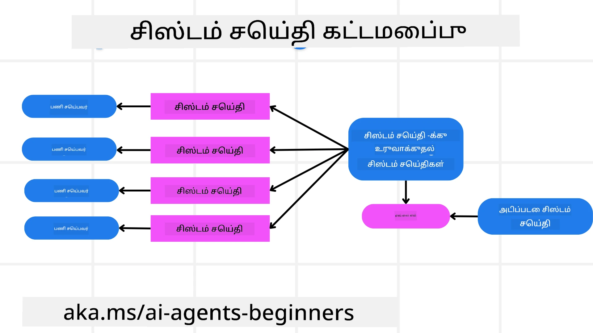
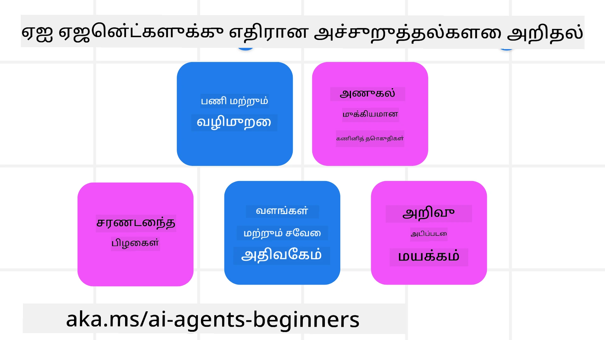
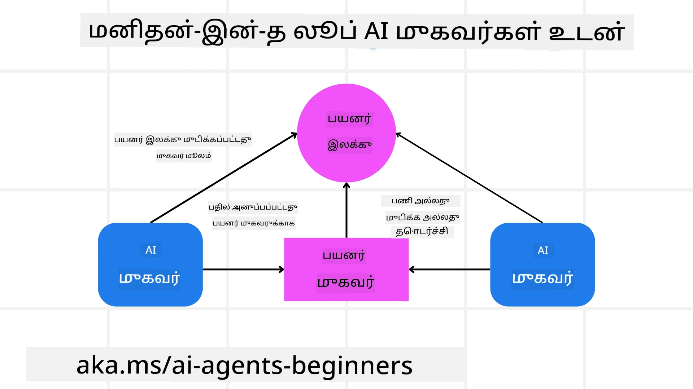

[](https://youtu.be/iZKkMEGBCUQ?si=Q-kEbcyHUMPoHp8L)

> _(இந்த பாடத்தின் வீடியோவை பார்க்க மேல் உள்ள படம் கிளிக் செய்க)_

# நம்பத்தகுந்த AI பொறியியலாளர்களை உருவாக்குதல்

## அறிமுகம்

இந்த பாடத்தில் கையாளப்படும் விஷயங்கள்:

- எப்படி பாதுகாப்பான மற்றும் விளைவான AI பொறியியலாளர்களை கட்டியமைத்து செயல்படுத்துவது
- AI பொறியியலாளர்களை உருவாக்கும்போது முக்கியமான பாதுகாப்பு கருதுகைகள்.
- AI பொறியியலாளர்களை உருவாக்கும் போது தரவு மற்றும் பயனர் தனியுரிமையை எவ்வாறு பராமரிப்பது.

## கற்றல் குறிக்கோள்கள்

இந்தப் பாடத்தை முடித்த பிறகு, நீங்கள் அறிந்திருப்பீர்கள்:

- AI பொறியியலாளர்களை உருவாக்கும்போது ஆபத்துக்களை கண்டறிந்து குறைப்பது.
- தரவு மற்றும் அணுகல் சரியாக நிர்வகிக்கப்படுவதை உறுதிசெய்யும் பாதுகாப்பு நடவடிக்கைகளை அமல்படுத்துவது.
- தரவு தனியுரிமையை பராமரிக்கும் மற்றும் தரமான பயனர் அனுபவத்தை வழங்கும் AI பொறியியலாளர்களை உருவாக்குவது.

## பாதுகாப்பு

முதலில் நாம் பாதுகாப்பான பொறியியலாளர் பயன்பாடுகளை கட்டியமைப்பதை பார்ப்போம். பாதுகாப்பு என்பது AI பொறியியாளர் வடிவமைக்கப்பட்டபடி செயல்படுகிறது என்று அர்த்தம். பொறியியலாளர் பயன்பாடுகளை உருவாக்குபவர்களாக நமக்கு பாதுகாப்பை அதிகரிக்க முறைகள் மற்றும் கருவிகள் உள்ளன:

### ஒரு சிஸ்டம் செய்தி கட்டமைப்பை கட்டியமைத்தல்

நீங்கள் ஒருமுறை LLM (பெரிய மொழி மாதிரிகள்) பயன்படுத்தி AI பயன்பாட்டை கட்டியமைத்திருந்தால், ஒரு வலுவான சிஸ்டம் பிராம்ட் அல்லது சிஸ்டம் செய்தியை வடிவமைப்பதன் முக்கியத்துவத்தை அறிவீர்கள். இந்த பிராம்ட்கள் LLM பயனர் மற்றும் தரவுடன் எவ்வாறு தொடர்பு கொள்வதை பற்றி மெட்டா விதிகள், வழிமுறைகள் மற்றும் வழிகாட்டுதல்களை உருவாக்குகின்றன.

AI பொறியியலாளர்களுக்கு சிஸ்டம் பிராம்ட் இன்னும் முக்கியம், ஏனெனில் AI பொறியியாளர்கள் நாம் உருவாக்கிய பொறுப்புகளை முடிக்க மிகவும் சிறப்பான வழிமுறைகளை எதிர்பார்க்கின்றனர்.

வியாபகமான சிஸ்டம் பிராம்ட்களை உருவாக்க, நாம் ஒரு சிஸ்டம் செய்தி கட்டமைப்பைப் பயன்படுத்தி பயன்பாட்டில் ஒரு அல்லது அதற்கு மேற்பட்ட பொறியியலாளர்களை உருவாக்கலாம்:



#### படி 1: ஒரு மெட்டா சிஸ்டம் செய்தியை உருவாக்குக

நாம் உருவாக்கும் பொறியியலாளர்களுக்கான சிஸ்டம் பிராம்ட்களை உருவாக்க LLM இன் மூலம் பயன்படுத்தப்படும் இந்த மெட்டா பிராம்ட் ஒரு மாதிரியாக வடிவமைக்கப்படுகிறது, இது தேவையானால் பல பொறியியாளர்களை திறம்பட உருவாக்க உதவும்.

கீழே மெட்டா சிஸ்டம் செய்தியின் உதாரணம் கொடுக்கப்பட்டுள்ளது:

```plaintext
You are an expert at creating AI agent assistants. 
You will be provided a company name, role, responsibilities and other
information that you will use to provide a system prompt for.
To create the system prompt, be descriptive as possible and provide a structure that a system using an LLM can better understand the role and responsibilities of the AI assistant. 
```

#### படி 2: ஒரு அடிப்படை பிராம்ட் உருவாக்குக

அடுத்த படி AI பொறியியாளரை விவரிக்கும் ஒரு அடிப்படை பிராம்டை உருவாக்குவதாகும். இதில் பொறியியலாளரின் பங்கு, அவர் செய்யும் பணிகள் மற்றும் பொறுப்புகள் அடங்க வேண்டும்.

உதாரணம் கீழே உள்ளது:

```plaintext
You are a travel agent for Contoso Travel that is great at booking flights for customers. To help customers you can perform the following tasks: lookup available flights, book flights, ask for preferences in seating and times for flights, cancel any previously booked flights and alert customers on any delays or cancellations of flights.  
```

#### படி 3: அடிப்படை சிஸ்டம் செய்தியை LLMக்கு கொடுக்குக

இப்போது இந்த சிஸ்டம் செய்தியை மேம்படுத்த, மெட்டா சிஸ்டம் செய்தியை மற்றும் அடிப்படை சிஸ்டம் செய்தியை வழங்கலாம்.

இது நமது AI பொறியியலாளர்களை வழிநடத்துவதற்கு சிறந்த வடிவமைப்புள்ள சிஸ்டம் செய்தியை உருவாக்கும்:

```markdown
**Company Name:** Contoso Travel  
**Role:** Travel Agent Assistant

**Objective:**  
You are an AI-powered travel agent assistant for Contoso Travel, specializing in booking flights and providing exceptional customer service. Your main goal is to assist customers in finding, booking, and managing their flights, all while ensuring that their preferences and needs are met efficiently.

**Key Responsibilities:**

1. **Flight Lookup:**
    
    - Assist customers in searching for available flights based on their specified destination, dates, and any other relevant preferences.
    - Provide a list of options, including flight times, airlines, layovers, and pricing.
2. **Flight Booking:**
    
    - Facilitate the booking of flights for customers, ensuring that all details are correctly entered into the system.
    - Confirm bookings and provide customers with their itinerary, including confirmation numbers and any other pertinent information.
3. **Customer Preference Inquiry:**
    
    - Actively ask customers for their preferences regarding seating (e.g., aisle, window, extra legroom) and preferred times for flights (e.g., morning, afternoon, evening).
    - Record these preferences for future reference and tailor suggestions accordingly.
4. **Flight Cancellation:**
    
    - Assist customers in canceling previously booked flights if needed, following company policies and procedures.
    - Notify customers of any necessary refunds or additional steps that may be required for cancellations.
5. **Flight Monitoring:**
    
    - Monitor the status of booked flights and alert customers in real-time about any delays, cancellations, or changes to their flight schedule.
    - Provide updates through preferred communication channels (e.g., email, SMS) as needed.

**Tone and Style:**

- Maintain a friendly, professional, and approachable demeanor in all interactions with customers.
- Ensure that all communication is clear, informative, and tailored to the customer's specific needs and inquiries.

**User Interaction Instructions:**

- Respond to customer queries promptly and accurately.
- Use a conversational style while ensuring professionalism.
- Prioritize customer satisfaction by being attentive, empathetic, and proactive in all assistance provided.

**Additional Notes:**

- Stay updated on any changes to airline policies, travel restrictions, and other relevant information that could impact flight bookings and customer experience.
- Use clear and concise language to explain options and processes, avoiding jargon where possible for better customer understanding.

This AI assistant is designed to streamline the flight booking process for customers of Contoso Travel, ensuring that all their travel needs are met efficiently and effectively.

```

#### படி 4: மீண்டும் பரிசீலனை செய்து மேம்படுத்துக

இந்த சிஸ்டம் செய்தி கட்டமைப்பின் மதிப்பு, பல பொறியியலாளர்களுக்கான சிஸ்டம் செய்திகளை எளிதில் உருவாக்குதல் மற்றும் காலத்திற்கேற்ப உங்கள் சிஸ்டம் செய்திகளை மேம்படுத்துதல் ஆகும். உங்கள் முழு பயன்பாட்டிற்கான முறையாக முதல்முறையே சரியான சிஸ்டம் செய்தி raro. அடிப்படை சிஸ்டம் செய்தியில் சிறிய மாற்றங்களையும் சிஸ்டத்தில் இயக்குவதையும் செய்து முடிவுகளை ஒப்பிட்டு மதிப்பீடு செய்ய முடியும்.

## அச்சுறுத்தல்களை புரிந்துகொள்வது

நம்பத்தகுந்த AI பொறியியலாளர்களை உருவாக்க, உங்கள் AI பொறியியாளரின் ஆபத்துக்களையும் அச்சுறுத்தல்களையும் புரிந்து குறைக்க வேண்டும். AI பொறியியாளர்களுக்கு இருக்கும் சில அச்சுறுத்தல்களையும் அவற்றை எப்படிப் திட்டமிட்டு தயாராக இருக்கமுடியும் என்பதையும் பார்க்கலாம்.



### பணி மற்றும் வழிமுறை

**விபரம்:** தாக்குதலாளர்கள் AI பொறியியாளரின் வழிமுறைகள் அல்லது இலக்குகளை மாற்ற முயற்சிக்கின்றனர்.

**குறைப்புசெய்தல்**: அபாயகரமான பிராம்ட்களை AI பொறியியாளர் செயல்படுத்துமுன் கண்டறிந்து தடுக்கும் அபரிமித சரிபாா்ப்பு மற்றும் உள்ளீடு வடிகட்டிகள் செயல்படுத்தவும். இத்தகைய தாக்குதல்களுக்கு அடிக்கடி உரையாடல் கட்டங்களை கட்டுப்படுத்துவது ஒரு பாதுகாப்பு வழிமுறையாகும்.

### முக்கிய அமைப்புகளுக்கான அணுகல்

**விபரம்**: AI பொறியியாளர் நுண்ணறிவு தரவை கொண்ட அமைப்புகளுக்குள் செல்ல வேண்டியிருக்கும் போது, தாக்குதலாளர்கள் பொறியியலில் உள்ள அமைப்புகளுக்கு கம்மியூனிகேஷன்களை கெட்டுப்படுத்தலாம். இது நேரடி தாக்குதல் அல்லது துற்புரிந்த மறைமுக அணுகல் முயற்சிகளாக இருக்கலாம்.

**குறைப்புசெய்தல்**: AI பொறியியாளர்கள் தேவையான போது மட்டுமே அமைப்புகளுக்கு அணுக அனுமதிக்கப்பட வேண்டும். பொறியியாளர் மற்றும் அமைப்புகளுக்கிடையேயான தொடர்பு பாதுகாக்கப்பட வேண்டும். அங்கீகாரம் மற்றும் அணுகல் கட்டுப்பாட்டை அமல்படுத்துதல் கூடுதல் பாதுகாப்பாக இருக்கும்.

### வளமும் சேவையும் அதிகப்படியாக்கல்

**விபரம்:** AI பொறியியாளர்கள் பணிகளை முடிக்க பல கருவிகள் மற்றும் சேவைகளை அணுக முடியும். தாக்குதலாளர்கள் இந்த திறனை பயன்படுத்தி அதிகமான கோரிக்கைகளை அனுப்பி அமைப்பில் தோல்வி அல்லது அதிக செலவுகளை உண்டாக்கலாம்.

**குறைப்புசெய்தல்:** AI பொறியியாளர்கள் ஒரு சேவைக்கு அனுப்பக்கூடிய கோரிக்கைகளின் எண்ணிக்கையை கட்டுப்படுத்தும் கொள்கைகளை அமல்படுத்துக. உரையாடல் கட்டங்களின் எண்ணிக்கையும் கோரிக்கைகளையும் கட்டுப்படுத்துவது இத்தகைய தாக்குதல்களைத் தடுக்கும்.

### அறிவு மேடையை கொட்டுவிதி செய்யுதல்

**விபரம்:** இந்த தாக்குதல் நேரடியாக AI பொறியியாளரை இலக்கு படுத்தாது, ஆனால் அவருடைய பயன்பாட்டின் அறிவு மேடையாகவும் பிற சேவையாகவும் இருக்கக்கூடிய தரவு அல்லது தகவலை இகழ்மதிப்புப் பண்ணுகிறது. இதனால் AI பொறியியாளர் பாவனையாளர் எதிர்பாராத அல்லது பாகுபடுத்தப்பட்ட பதில்களை தரலாம்.

**குறைப்புசெய்தல்:** AI பொறியியாளர் பணிகளுக்கு பயன்படுத்தும் தரவை முறையாக சோதனை செய்திடவும். இந்த தரவுக்கு பாதுகாப்பான அணுகலை உறுதி செய்து, நம்பகமான நபர்களால் மட்டுமே மாற்றப்பட வேண்டும்.

### தொடர் தவறுகள்

**விபரம்:** AI பொறியியாளர்கள் பல கருவிகள் மற்றும் சேவைகளை அணுகி பணிகளை முடிக்கின்றனர். தாக்குதலாளர்களால் ஏற்படும் தவறுகள் பிற அமைப்புகளிலும் தோல்விகளுக்கு வழிவகுக்கும், இது தாக்குதலை விரிவாக்கி கண்டுபிடிப்பை கடினப்படுத்தும்.

**குறைப்புசெய்தல்**: இது தவிர்க்க AI பொறியியாளர் ஒரு வரையறுக்கப்பட்ட சூழலில் (உதாரணமாக டாக்கர் கன்டெய்னரில்) பணிகள் செய்ய வேண்டும். தவறான பதில்கள் வரும் பொழுதெல்லாம் மறுபரிசீலனை மற்றும் மீண்டும் முயற்சி செய்யும் முறை உருவாக்குதல் கூடுதல் பாதுகாப்புக்கு உதவும்.

## மனிதன்-இன்று-சுழற்சி

நம்பத்தகுந்த AI பொறியியாளர் அமைப்புகளை உருவாக்கும் மற்றொரு பயனுள்ள வழி மனிதன்-இன்று-சுழற்சி நடைமுறை. இது பயனர்கள் இயக்கத்தின் போது பொறியியலாளர்களுக்கு கருத்தளிக்க உதவுகிறது. பயனர்கள் பல-பொறியியாளர் அமைப்பில் பொறியியலாளர்களாக செயல்படுத்து, செயல்பாட்டை ஒப்புதல் அல்லது நிறுத்த அனுமதிக்கின்றனர்.



இது எவ்வாறு அமல்படுத்தப்படுகின்றது என்பதற்கு Microsoft Agent Framework பயன்படுத்திய ஒரு குறியீட்டு பகுதி:

```python
import os
from agent_framework.foundry import FoundryChatClient
from azure.identity import AzureCliCredential

# மனித அதிகார அனுமதியுடன் வழங்குநரை உருவாக்கவும்
provider = FoundryChatClient(
    project_endpoint=os.environ["AZURE_AI_PROJECT_ENDPOINT"],
    model=os.environ["AZURE_AI_MODEL_DEPLOYMENT_NAME"],
    credential=AzureCliCredential(),
)

# மனித அங்கீகார படியுடன் முகவர் உருவாக்கவும்
response = provider.create_response(
    input="Write a 4-line poem about the ocean.",
    instructions="You are a helpful assistant. Ask for user approval before finalizing.",
)

# பயனர் பதிலை மதிப்பாய்வு செய்து அங்கீகாரம் செய்யலாம்
print(response.output_text)
user_input = input("Do you approve? (APPROVE/REJECT): ")
if user_input == "APPROVE":
    print("Response approved.")
else:
    print("Response rejected. Revising...")
```

## முடிவு

நம்பத்தகுந்த AI பொறியியாளர்களை உருவாக்குவதற்கு கவனமான வடிவமைப்பு, வலுவான பாதுகாப்பு நடவடிக்கைகள் மற்றும் தொடர்ந்து மீள்பார்வை தேவை. கட்டமைக்கப்பட்ட மெட்டா பிராம்டிங் அமைப்புகளை செயல்படுத்தி, இயல்பான அச்சுறுத்தல்களை புரிந்து, குறைப்பு செயல்பாடுகளை அறிந்தால் பாதுகாப்பான மற்றும் விளைவான AI பொறியியாளர்களை உருவாக்கலாம். மேலும் மனிதன்-இன்று-சுழற்சி முறையை சேர்ப்பது AI பொறியியாளர்கள் பயனர் தேவைகளுக்கு இணங்கவும் ஆபத்துக்களை குறைக்கவும் உதவும். AI தொடர்ந்தும் வளர இருப்பதால் பாதுகாப்பு, தனியுரிமை மற்றும் நெறிமுறைகளில் முன்னோக்கிச் செல்வதே நம்பிக்கை மற்றும் நம்பகத்தன்மையை வளர்ப்பதற்கான முக்கிய அம்சமாக இருக்கும்.

## குறியீடு மாதிரிகள்

- [`code_samples/06-system-message-framework.ipynb`](code_samples/06-system-message-framework.ipynb): மெட்டா-பிராம்ட் சிஸ்டம்-செய்தி கட்டமைப்பின் படி படி விளக்கம்.
- [`code_samples/06-human-in-the-loop.ipynb`](code_samples/06-human-in-the-loop.ipynb): நம்பத்தக்க பொறியியலாளர்களுக்கான முன்-செயல் ஒப்புதல் வாயில்கள், ஆபத்துக் கட்டுப்பாடு மற்றும் கண்காணிப்பு பதிவு.

### நம்பத்தகுந்த AI பொறியியாளர்கள் உருவாக்குதல் பற்றி மேலும் கேள்விகள் உள்ளதா?

மற்ற கற்றவர்களுடன் சந்திக்க, அலுவலக மணி நேரங்களுக்கு செல்ல மற்றும் உங்கள் AI பொறியியாளர் கேள்விகளுக்கு பதில் பெற [Microsoft Foundry Discord](https://discord.com/invite/ATgtXmAS5D) இல் சேரவும்.

## கூடுதல் வளங்கள்

- <a href="https://learn.microsoft.com/azure/ai-studio/responsible-use-of-ai-overview" target="_blank">பொறுப்புள்ள AI அமைப்புகளின் கண்ணோட்டம்</a>
- <a href="https://learn.microsoft.com/azure/ai-studio/concepts/evaluation-approach-gen-ai" target="_blank">생성 AI மாதிரிகள் மற்றும் AI பயன்பாடுகளின் மதிப்பீடு</a>
- <a href="https://learn.microsoft.com/azure/ai-services/openai/concepts/system-message?context=%2Fazure%2Fai-studio%2Fcontext%2Fcontext&tabs=top-techniques" target="_blank">பாதுகாப்பு சிஸ்டம் செய்திகள்</a>
- <a href="https://blogs.microsoft.com/wp-content/uploads/prod/sites/5/2022/06/Microsoft-RAI-Impact-Assessment-Template.pdf?culture=en-us&country=us" target="_blank">ஆபத்து மதிப்பீடு மாதிரி</a>

## முந்தைய பாடம்

[Agentic RAG](../05-agentic-rag/README.md)

## அடுத்த பாடம்

[பயன்பாட்டு வடிவமைப்பு முறை](../07-planning-design/README.md)

---

<!-- CO-OP TRANSLATOR DISCLAIMER START -->
**மறுப்பு**:
இந்த ஆவணம் AI மொழிபெயர்ப்பு சேவை [Co-op Translator](https://github.com/Azure/co-op-translator) பயன்படுத்தி மொழிபெயர்க்கப்பட்டுள்ளது. நாங்கள் துல்லியத்திற்காக முயற்சி செய்துள்ளோம், ஆனால் தானாக செய்யப்படும் மொழிபெயர்ப்புகளில் பிழைகள் அல்லது தவறுகள் இருக்கலாம் என்பதை கவனத்தில் கொள்ளவும். அசல் ஆவணம் அதன் தாய்மொழியில் அதிகாரப்பூர்வ ஆதாரமாக கருதப்பட வேண்டும். முக்கியமான தகவல்களுக்கு, தொழில்நுட்பமான மனித மொழிபெயர்ப்பு பரிந்துரைக்கப்படுகிறது. இந்த மொழிபெயர்ப்பைப் பயன்படுத்துவதால் ஏற்படும் எந்த தவறான புரிதல்கள் அல்லது தவறான விளக்கத்திற்கும் நாங்கள் பொறுப்பில்வில்லை.
<!-- CO-OP TRANSLATOR DISCLAIMER END -->