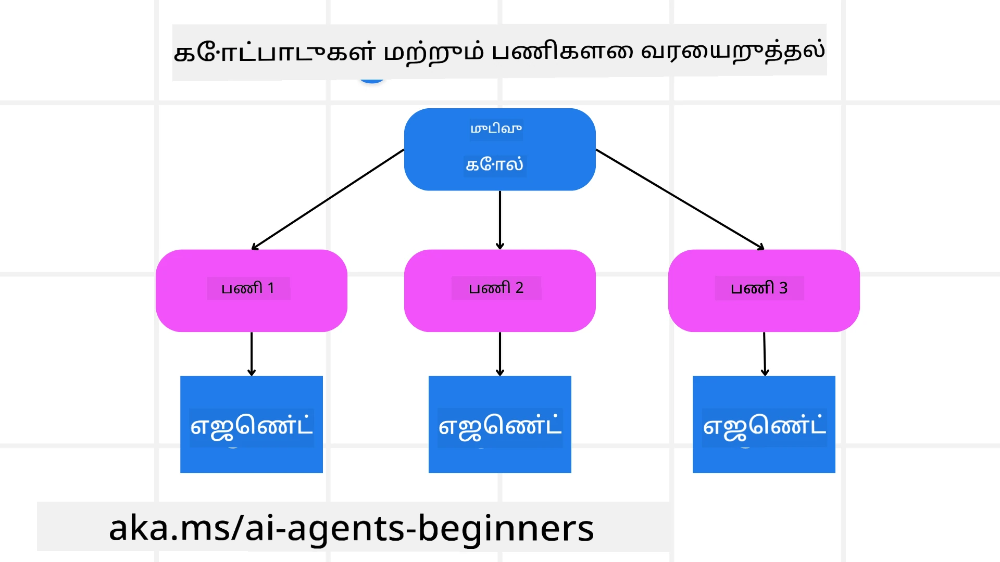

[](https://youtu.be/kPfJ2BrBCMY?si=9pYpPXp0sSbK91Dr)

> _(இந்த பாடத்தின் வீடியோவைப் பார்க்க மேலுள்ள படத்தைச் கிளிக் செய்யவும்)_

# திட்டமிடல் வடிவமைப்பு

## அறிமுகம்

இந்த பாடம் பின்வற்றதை உள்ளடக்கியது

* தெளிவான ஒருங்கிணைந்த குறிக்கோளை வரையறுத்தல் மற்றும் சிக்கலான பணியை கையாளக்கூடிய பணிகளாக உடைத்தல்.
* மிகவும் நம்பகமான மற்றும் இயந்திரம் வாசிக்கக்கூடிய பதில்களுக்கு கட்டமைக்கப்பட்ட வெளியீட்டை பயன்படுத்துதல்.
* நிகழ்வு சார்ந்த 접근ியைக் கொண்டு மாதவிடாய் பணிகள் மற்றும் எதிர்பாராத உள்ளீடுகளை கையாளுதல்.

## கற்கும் குறிக்கோள்கள்

இந்த பாடத்தை முடித்த பிறகு, நீங்கள் இவற்றை புரிந்துகொள்ளலாம்:

* AI முகவருக்கான ஒருங்கிணைந்த நோக்கத்தை அடையாளம்_grid இருப்பது, அது என்ன சாதிக்க வேண்டும் என்பதை தெளிவாக அறிந்து கொள்வதில் உறுதிசெய்தல்.
* சிக்கலான பணியை, கையாளக்கூடிய துணைப் பணிகளாக உடைத்தல் மற்றும் அவற்றை தர்க்கமான வரிசையில் ஒழுங்குபடுத்துதல்.
* முகவர்களுக்கு சரியான கருவிகள் (உதாரணமாக, தேடல் கருவிகள் அல்லது தரவு பகுப்பாய்வு கருவிகள்) வழங்கல், அவை எப்போது மற்றும் எப்படி பயன்படுத்தப்படுவதை தீர்மானித்தல் மற்றும் வரும் எதிர்பாராத சூழ்நிலைகளை கையாளுதல்.
* துணைப் பணிகளின் முடிவுகளை மதிப்பீடு செய்வது, செயல்திறனை அளவிடல் மற்றும் இறுதிப் பதிலைக் கட்டுப்படுத்தும் நடவடிக்கைகளை சரிசெய்தல்.

## ஒருங்கிணைந்த குறிக்கோளை வரையறுத்தல் மற்றும் பணியை உடைத்தல்



மிகவும் உள்ள பணிகள் ஒரு படி நடவடிக்கையில் கையாள முடியாத அளவுக்கு சிக்கலானவை. ஒரு AI முகவர் தனது திட்டமிடல் மற்றும் நடவடிக்கைகளை வழிநடத்த ஒரு சுருக்கமான குறிக்கோளை தேவைப்படுத்தும். உதாரணமாக, கீழ்காணும் குறிக்கோளை கவனியுங்கள்:

    "3 நாள் பயண திட்டத்தினை உருவாக்கு."

இது எளிதாக சொல்லப்படக்கூடியதாக இருந்தாலும், அதை மேம்படுத்த வேண்டியது அவசியம். குறிக்கோள் தெளிவாக இருக்கிறதனால், முகவர் (மற்றும் எந்த மனித ஒத்துழைப்பாளர்களும்) சரியான முடிவை அடைய கவனம் செலுத்த முடியும், உதாரணமாக விமான வாகன, ஹோட்டல் பரிந்துரைகள் மற்றும் செயல்முறை பரிந்துரைகளுடன் முழுமையான பயண திட்டம் உருவாக்குதல்.

### பணிகளை உடைத்தல்

பெரிய அல்லது சிக்கலான பணிகள், சிறிய, குறிக்கோளுக்கு உகந்த துணைப் பணிகளாக பிரிக்கப்பட்ட பிறகு, மேலாண்மை செய்ய எளிதாக இருக்கும்.
பயண திட்டம் உதாரணத்திற்கு, நீங்கள் அதை கீழே பட்டியலிடலாம்:

* விமான முன்பதிவு
* ஹோட்டல் முன்பதிவு
* கார் வாடகை
* தனிப்பயன்

ஒவ்வொரு துணைப் பணியையும் தனித்த AI முகவர்கள் அல்லது செயல்முறைகள் கையாளலாம். ஒரு முகவர் சிறந்த விமான ஒப்பந்தங்களை தேடும் நிபுணர் ஆகலாம், மற்றொரு ஹோட்டல் முன்பதிவுக்கு கவனம் செலுத்தலாம். ஒழுங்குபடுத்தும் அல்லது "கீழ்வாய்" முகவர் இந்த முடிவுகளைக் கொண்டு ஒருங்கிணைந்த ஒரு பயணத் திட்டமாகத் தனிநபருக்கு வழங்கலாம்.

இந்த தொகுதி அணுகுமுறை கட்டமைக்கப்பட்ட மேம்படுத்தல்களையும் ஏற்றுக்கொள்கிறது. உதாரணமாக, உணவுப் பரிந்துரைகள் அல்லது உள்ளூர் செயல்பாட்டு பரிந்துரைகளுக்கு நிபுணத்துவ முகவர்களை சேர்த்து நேரத்துடன் பயணத் திட்டத்தை மேம்படுத்தலாம்.

### கட்டமைக்கப்பட்ட வெளியீடு

பெரும் மொழி மாதிரிகள் (LLMs) கட்டமைக்கப்பட்ட வெளியீடு (எ.கா., JSON) உருவாக்க முடியும், இது கீழ்வாய் முகவர்கள் அல்லது சேவைகள் பார்ச் செய்து செயலாக்க நன்றாக இருக்கும். இது பல முகவர் சூழலில் மிகவும் பயனுள்ளதாக இருக்கும், அங்கு நாம் திட்டமிடும் வெளியீட்டை பெற்ற பிறகு இந்த பணிகளை செயல்படுத்தலாம்.

பின்வரும் Python குறியீடு ஒரு திட்டமிடும் முகவர் ஒரு குறிக்கோளை துணைப் பணிகளாக பிரித்து கட்டமைக்கப்பட்ட திட்டத்தை உருவாக்குவதை காட்டுகிறது:

```python
from pydantic import BaseModel
from enum import Enum
from typing import List, Optional, Union
import json
import os
from typing import Optional
from pprint import pprint
from agent_framework.azure import AzureAIProjectAgentProvider
from azure.identity import AzureCliCredential

class AgentEnum(str, Enum):
    FlightBooking = "flight_booking"
    HotelBooking = "hotel_booking"
    CarRental = "car_rental"
    ActivitiesBooking = "activities_booking"
    DestinationInfo = "destination_info"
    DefaultAgent = "default_agent"
    GroupChatManager = "group_chat_manager"

# பயண துணைப் பணியின் மாதிரி
class TravelSubTask(BaseModel):
    task_details: str
    assigned_agent: AgentEnum  # பணியை முகவரிக்கு ஒதுக்க விரும்புகிறோம்

class TravelPlan(BaseModel):
    main_task: str
    subtasks: List[TravelSubTask]
    is_greeting: bool

provider = AzureAIProjectAgentProvider(credential=AzureCliCredential())

# பயனர் செய்தியை வரையறு
system_prompt = """You are a planner agent.
    Your job is to decide which agents to run based on the user's request.
    Provide your response in JSON format with the following structure:
{'main_task': 'Plan a family trip from Singapore to Melbourne.',
 'subtasks': [{'assigned_agent': 'flight_booking',
               'task_details': 'Book round-trip flights from Singapore to '
                               'Melbourne.'}
    Below are the available agents specialised in different tasks:
    - FlightBooking: For booking flights and providing flight information
    - HotelBooking: For booking hotels and providing hotel information
    - CarRental: For booking cars and providing car rental information
    - ActivitiesBooking: For booking activities and providing activity information
    - DestinationInfo: For providing information about destinations
    - DefaultAgent: For handling general requests"""

user_message = "Create a travel plan for a family of 2 kids from Singapore to Melbourne"

response = client.create_response(input=user_message, instructions=system_prompt)

response_content = response.output_text
pprint(json.loads(response_content))
```

### பல முகவர் ஒருங்கிணைப்புடன் திட்டமிடும் முகவர்

இந்த எடுத்துக்காட்டில், Semantic Router Agent ஒரு பயனர் கோரிக்கையை பெறுகிறது (உதாரணமாக, "எனது பயணத்திற்கு ஹோட்டல் திட்டம் வேண்டும்.").

திட்டமிடுபவர் பின்னர்:

* ஹோட்டல் திட்டத்தை பெறுகிறது: பயனர் செய்தியை எடுத்துக் கொண்டு, ஒரு அமைப்பு முன்மொழிவின் அடிப்படையில் (உள்ள முகவர் விவரங்கள் உட்பட) கட்டமைக்கப்பட்ட பயணத் திட்டம் உருவாக்குகிறது.
* முகவர்களையும் அவர்களின் கருவிகளையும் பட்டியலிடுங்கள்: முகவர் பதிவகம் (registry) அவர்களுடைய வேலைகளுக்கான செயல்களோ அல்லது கருவிகளோ உடன் முகவர்களின் பட்டியலை வைத்திருக்கிறது (உதாரணமாக, விமானம், ஹோட்டல், கார் வாடகை மற்றும் செயல்பாடுகள்).
* திட்டத்தை தொடர்புடைய முகவர்களுக்கு வழிமாறுகிறது: துணைப் பணிகளின் எண்ணிக்கையின் அடிப்படையில், திட்டமிடுபவர் செய்தியை நேரடியாக ஒரு குறிப்பிட்ட முகவருக்கு அனுப்பும் (ஒரே பணிக்கான சூழலில்) அல்லது குழு உரையாடல் மேலாளராக வழிநடத்தும்.
* விளக்கத்துடன் முடிவுகளை சுருக்குகிறது: இறுதியில், திட்டமிடுபவர் உருவாக்கிய திட்டத்தை தெளிவாக சுருக்குகிறது.
பின்வரும் Python குறியீடு இந்த படிகளை விளக்குகிறது:

```python

from pydantic import BaseModel

from enum import Enum
from typing import List, Optional, Union

class AgentEnum(str, Enum):
    FlightBooking = "flight_booking"
    HotelBooking = "hotel_booking"
    CarRental = "car_rental"
    ActivitiesBooking = "activities_booking"
    DestinationInfo = "destination_info"
    DefaultAgent = "default_agent"
    GroupChatManager = "group_chat_manager"

# பயண துணைக்குழு மாதிரி

class TravelSubTask(BaseModel):
    task_details: str
    assigned_agent: AgentEnum # நாம் பணியை முகவரிக்கு ஒதுக்க விரும்புகிறோம்

class TravelPlan(BaseModel):
    main_task: str
    subtasks: List[TravelSubTask]
    is_greeting: bool
import json
import os
from typing import Optional

from agent_framework.azure import AzureAIProjectAgentProvider
from azure.identity import AzureCliCredential

# கிளையன்டை உருவாக்கவும்

provider = AzureAIProjectAgentProvider(credential=AzureCliCredential())

from pprint import pprint

# பயனர் செய்தியை வரையறுக்கவும்

system_prompt = """You are a planner agent.
    Your job is to decide which agents to run based on the user's request.
    Below are the available agents specialized in different tasks:
    - FlightBooking: For booking flights and providing flight information
    - HotelBooking: For booking hotels and providing hotel information
    - CarRental: For booking cars and providing car rental information
    - ActivitiesBooking: For booking activities and providing activity information
    - DestinationInfo: For providing information about destinations
    - DefaultAgent: For handling general requests"""

user_message = "Create a travel plan for a family of 2 kids from Singapore to Melbourne"

response = client.create_response(input=user_message, instructions=system_prompt)

response_content = response.output_text

# அதனை JSON ஆக ஏற்றிய பிறகு பதிலின் உள்ளடக்கத்தை அச்சிடவும்

pprint(json.loads(response_content))
```

முந்தய குறியீட்டு எடுத்துக்காட்டின் வெளியீட்டு அதேபோல் இந்த கட்டமைக்கப்பட்ட வெளியீட்டை `assigned_agent`-க்கு வழிமாற்றி பயணத் திட்டத்தை இறுதிப் பயனாளரைச் சமர்ப்பிக்க பயன்படுத்தலாம்.

```json
{
    "is_greeting": "False",
    "main_task": "Plan a family trip from Singapore to Melbourne.",
    "subtasks": [
        {
            "assigned_agent": "flight_booking",
            "task_details": "Book round-trip flights from Singapore to Melbourne."
        },
        {
            "assigned_agent": "hotel_booking",
            "task_details": "Find family-friendly hotels in Melbourne."
        },
        {
            "assigned_agent": "car_rental",
            "task_details": "Arrange a car rental suitable for a family of four in Melbourne."
        },
        {
            "assigned_agent": "activities_booking",
            "task_details": "List family-friendly activities in Melbourne."
        },
        {
            "assigned_agent": "destination_info",
            "task_details": "Provide information about Melbourne as a travel destination."
        }
    ]
}
```

முந்தய குறியீட்டு எடுத்துக்காட்டுடன் கூடிய ஒரு உதவி நோட்ட்புக் [இங்கே](07-python-agent-framework.ipynb) உள்ளது.

### மடந்த திட்டமிடல்

சில பணிகளுக்கு மீண்டும் திரும்பி திட்டமிடுதல் அல்லது ஒரு துணைப் பணியின் முடிவுகள் அடுத்தவையாக தாக்கம் ஏற்படுத்துதல் தேவைப்படும். உதாரணமாக, விமான முன்பதிவின் போது எதிர்பாராத தரவு வடிவத்தை கண்டுபிடித்தால், ஹோட்டல் முன்பதிவுக்கு முன்னர் தன்னைத் தகுத்து தகுந்த மாதிரியை மாற்ற உதவும்.

மேலும், பயனரின் கருத்து (எ.கா., மனிதர் முன்னதாக விமானம் தேர்வு செய்ய விரும்புவது) ஒரு பகுதியளவில் திட்டமுனைப்பு ஏற்படுத்துகையில் உதவும். இத்தகைய இயக்கவியல் முறையான மடந்தகூடிய செயல்முறை இறுதி தீர்வு நிஜ உலக கட்டுப்பாடுகள் மற்றும் பயனர் விருப்பங்களுடன் ஒத்தியாகும்வரை உறுதி செய்கிறது.

எ.கா குறியீடு

```python
from agent_framework.azure import AzureAIProjectAgentProvider
from azure.identity import AzureCliCredential
#.. முந்தய குறியீட்டைப் போல் மற்றும் பயனர் வரலாறு, தற்போதைய திட்டத்தை அனுப்பவும்

system_prompt = """You are a planner agent to optimize the
    Your job is to decide which agents to run based on the user's request.
    Below are the available agents specialized in different tasks:
    - FlightBooking: For booking flights and providing flight information
    - HotelBooking: For booking hotels and providing hotel information
    - CarRental: For booking cars and providing car rental information
    - ActivitiesBooking: For booking activities and providing activity information
    - DestinationInfo: For providing information about destinations
    - DefaultAgent: For handling general requests"""

user_message = "Create a travel plan for a family of 2 kids from Singapore to Melbourne"

response = client.create_response(
    input=user_message,
    instructions=system_prompt,
    context=f"Previous travel plan - {TravelPlan}",
)
# .. மீண்டும் திட்டமிட்டுப் பணிகளை தொடர்புடைய முகவர்களுக்கு அனுப்பவும்
```

மேலும் விரிவான திட்டமிடல் அறிந்து கொள்ள, <a href="https://www.microsoft.com/research/articles/magentic-one-a-generalist-multi-agent-system-for-solving-complex-tasks" target="_blank">Magnetic One</a> <a href="https://www.microsoft.com/research/articles/magentic-one-a-generalist-multi-agent-system-for-solving-complex-tasks" target="_blank">வலைப்பதிவு</a> பார்க்கவும்.

## சுருக்கம்

இந்த கட்டுரையில் நாம், நிர்ணயிக்கப்பட்ட முகவர்களை இயக்கிக் கொள்ள முடியும் ஒரு திட்டமிடுபவரை எவ்வாறு உருவாக்குவது என்ற உதாரணத்தை பார்த்தோம். திட்டமிடுபவரின் வெளியீடு பணிகளை உடைத்து முகவர்களுக்கு பகிர்ந்திடுகிறது, அவை செயல்படுத்தப்பட முடியும். முகவர்கள் பணியை செய்ய தேவையான செயல்பாடுகள் அல்லது கருவிகள் அணுகல் கொண்டிருக்க வேண்டும் என கருதப்படுகிறது. முகவர்களுடன் கூடுதல் வடிவமைப்புகள் போலே பிரதிபலிப்பு, சுருக்கி மற்றும் சுற்றி உரையாடல் கொண்டு தனிப்பயனாக்கலாம்.

## கூடுதல் வளங்கள்

Magnetic One - ஒரு பொதுவான பலமுகவர் அமைப்பு, சிக்கலான பணிகளை தீர்க்கும் திறமையுடன் பல அவதானமான முகவர் வினாக்களில் சிறந்த முடிவுகளை பெற்றுள்ளது. மேற்கோள்: <a href="https://www.microsoft.com/research/articles/magentic-one-a-generalist-multi-agent-system-for-solving-complex-tasks" target="_blank">Magnetic One</a>. இந்த செயல்பாட்டில் ஒருங்கிணைப்பாளர் பணியாளர் குறித்த திட்டங்களை உருவாக்கி, கிடைக்கும் முகவர்களுக்கு அது பணிகளை ஒதுக்குகிறது. திட்டமிடல் தாமாகவே, வேலை முன்னேற்றத்தைக் கண்காணித்து தேவைப்படும்போது மறுபிரதக்கூறு செய்கிறது.

### திட்டமிடல் வடிவமைப்பைப் பற்றி மேலும் கேள்விகள் உள்ளதா?

[Microsoft Foundry Discord](https://aka.ms/ai-agents/discord) இல் இணைய, மற்ற கற்று நண்பர்களுடன் சந்தித்து, அலுவலக நேரங்களுக்குச் சேர்ந்து, AI முகவர்கள் தொடர்பான கேள்விகளுக்கு பதிலடையுங்கள்.

## முந்தய பாடம்

[நம்பகமான AI முகவர்களை உருவிடல்](../06-building-trustworthy-agents/README.md)

## அடுத்த பாடம்

[பல முகவர் வடிவமைப்புப் படிமம்](../08-multi-agent/README.md)

---

<!-- CO-OP TRANSLATOR DISCLAIMER START -->
**முகாமطلனம்**:  
இந்த ஆவணம் AI மொழிபெயர்ப்பு சேவை [Co-op Translator](https://github.com/Azure/co-op-translator) பயன்படுத்தி மொழிமாற்றம் செய்யப்பட்டுள்ளது. நாங்கள் துல்லியத்திற்கான முயற்சி மேற்கொண்டாலும், தானியங்கி மொழிபெயர்ப்புகளில் பிழைகள் அல்லது தவறான உள்ளடக்கம் இருக்கலாம் என்பதை கவனமாக நினைவில் கொள்ளவும். அசல் ஆவணம் அதன் சொந்த மொழியில் அதிகாரப்பூர்வ ஆதாரமாக கருதப்பட வேண்டும். முக்கியமான தகவல்களுக்கு, தொழில்முறை மனித மொழிபெயர்ப்பு பரிந்துரைக்கப்படுகிறது. இந்த மொழிபெயர்ப்பின் பயன்பாட்டிலிருந்து ஏற்படும் எந்த தவறீடுகளுக்கும் நாங்கள் பொறுப்பேற்க வேண்டியது இல்லை.
<!-- CO-OP TRANSLATOR DISCLAIMER END -->