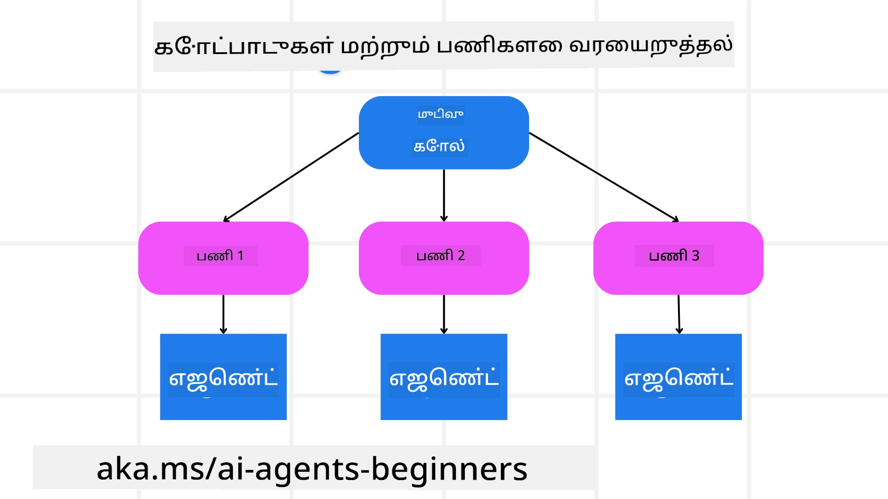

[](https://youtu.be/kPfJ2BrBCMY?si=9pYpPXp0sSbK91Dr)

> _(இந்த பாடத்தின் வீடியோவை பார்க்க மேல் உள்ள படத்தை கிளிக் செய்யவும்)_

# திட்டமிடல் வடிவமைப்பு

## அறிமுகம்

இந்த பாடம் கீழ்காணும் விஷயங்களை கையாளும்

* தெளிவான ஒருங்கிணைந்த இலக்கை வரையறுக்க மற்றும் ஒரு கூடிய பணியை கையாளக்கூடிய பணிகளாக பிரிக்க.
* நம்பகமான மற்றும் இயந்திர-படிக்கும் பதில்களுக்கு அமைந்த அமைப்பான வெளியீட்டை பயன்படுத்த.
* நிகழ்வு பெற்ற அணுகுமுறையை பயன்படுத்தி இயக்கமுள்ள பணிகள் மற்றும் எதிர்பாராத உள்ளீடுகளை கையாள.

## கற்றல் இலக்குகள்

இந்த பாடத்தை முடித்த பின் உங்களுக்கு கிடைக்கும் புரிதல்:

* ஒரு AI முகவருக்கு ஒருங்கிணைந்த இலக்கை அடையாளம் காணவும் மற்றும் அமைக்கவும், அது என்ன சாதிக்க வேண்டும் என்பதில் தெளிவாக இருக்க உத்தரவாதம் செய்யவும்.
* ஒரு கூடிய பணியை கையாளக்கூடிய துணைப் பணிகளாக உடைத்தும் அவற்றை தர்க்கமான தொடர்ச்சியில் ஒழுங்குபடுத்தவும்.
* முகவர்களுக்கு சரியான கருவிகள் (எ.கா., தேடல் கருவிகள் அல்லது தரவுக் குறிப்பாய்வு கருவிகள்) வழங்கி, அவற்றை எப்போது மற்றும் எப்படி பயன்படுத்தப்பட வேண்டும் எனத் தீர்மானித்து, எதிர்பாராத சூழ்நிலைகளைக் கையாளவும்.
* துணைப் பணிகளின் முடிவுகளை மதிப்பீடு செய்து, செயல்திறனை அளவிடி, இறுதி வெளியீட்டை மேம்படுத்த நடவடிக்கைகளை மீளாய்வு செய்யவும்.

## ஒருங்கிணைந்த இலக்கை வரையறுக்கல் மற்றும் பணியை உடைத்தல்



பெரும்பாலான நிஜ உலக பணிகள் ஒரே கட்டத்தில் கையாளவே முடியாதவைகள். ஒரு AI முகவருக்கு திட்டமிடல் மற்றும் நடவடிக்கைகளை வழிநடத்த ஒரு தெளிவான நோக்கம் தேவை. உதாரணமாக, இலக்கை எடுத்துக்கொள்ளவும்:

    "3-நாட்கள் பயண திட்டம் உருவாக்குதல்."

இது எளிதாகக் கூறப்பட வேண்டும் எனினும் இன்னும் மேம்படுத்தப்பட வேண்டும். இலக்கு தெளிவாக இருக்கும்போது, முகவரும் (மேலும் மனித கூட்டாளர்களும்) சரியான முடிவை அடைவதில் கவனம் செலுத்த முடியும், உதாரணமாக விமான விருப்பங்கள், ஹோட்டல் பரிந்துரைகள் மற்றும் செயல்பாடுகள் ஆகியவற்றுடன் விரிவான பயண திட்டத்தை உருவாக்குவது.

### பணியினைப் பிரித்தல்

பெரிய அல்லது சிக்கலான பணிகள் சிறிய, இலக்கு வழி துணைப் பணிகளாக பிரிக்கப்பட்டால் எளிதாக கையாளலாம்.
பயண திட்ட உதாரணத்திற்கு, இலக்கை கீழ்காணும் சில துணைப் பணிகளாக பிரிக்கலாம்:

* விமான பதிவு
* ஹோட்டல் பதிவு
* கார் வாடகை
* தனிப்பயனாக்கம்

ஒவ்வொரு துணைப் பணியும் தனித்துவமான முகவர்கள் அல்லது செயலிகளால் கையாளப்படலாம். ஒரு முகவரி சிறந்த விமான சலுகைகளை தேடுவதில் நிபுணத்துவம் பெறலாம், மற்றொன்று ஹோட்டல் பதிவு கவனிக்கலாம், அப்படி தொடரலாம். ஒரு ஒருங்கிணைப்பாளர் அல்லது “அடுத்த கட்ட” முகவர் இதழ்கள் முடிவுகளை ஒருங்கிணைத்து பயனர் முன்னிருக்கும் ஒரே பயணத் திட்டமாக உருவாக்கலாம்.

இந்த தொகுதி முறை மேலும் சிறு மேம்பாடுகளுக்கு அனுமதிக்கிறது. எடுத்துக்காட்டாக, உணவு பரிந்துரைகள் அல்லது உள்ளூர்செயல்பாடு பரிந்துரைகள் போன்ற சிறப்பான முகவர்களை சேர்க்கவும், அதன்பின்னர் பயணத் திட்டம் காலக்கெடுவாக மேம்படுத்தலாம்.

### அமைப்பான வெளியீடு

பெரிய மொழி மாதிரிகள் (LLMs) அமைப்பான வெளியீட்டைக் (எ.கா., JSON) உருவாக்க முடியும், இது அடுத்த கட்ட முகவர்களோ சேவைகளோ பரிசோதித்து செயலாற்ற எளியதாக இருக்கிறது. இது ஒரு பல-முகவர் சூழலில், திட்டமிடல் வெளியீட்டை பெற்ற பிறகு இவற்றை செயல்படுத்த சிறந்த நடவடிக்கையாகும்.

கீழ்காணும் Python குறியீடு ஒரு எளிய திட்டமிடல் முகவரி இலக்கை துணைப் பணிகளாக உடைத்து அமைப்பான திட்டத்தை உருவாக்கியது:

```python
from pydantic import BaseModel
from enum import Enum
from typing import List, Optional, Union
import json
import os
from typing import Optional
from pprint import pprint
from agent_framework.foundry import FoundryChatClient
from azure.identity import AzureCliCredential

class AgentEnum(str, Enum):
    FlightBooking = "flight_booking"
    HotelBooking = "hotel_booking"
    CarRental = "car_rental"
    ActivitiesBooking = "activities_booking"
    DestinationInfo = "destination_info"
    DefaultAgent = "default_agent"
    GroupChatManager = "group_chat_manager"

# பயண துணைபணி மாதிரி
class TravelSubTask(BaseModel):
    task_details: str
    assigned_agent: AgentEnum  # நாம் அந்த பணியை முகவரிடம் ஒதுக்க விரும்புகிறோம்

class TravelPlan(BaseModel):
    main_task: str
    subtasks: List[TravelSubTask]
    is_greeting: bool

provider = FoundryChatClient(
    project_endpoint=os.environ["AZURE_AI_PROJECT_ENDPOINT"],
    model=os.environ["AZURE_AI_MODEL_DEPLOYMENT_NAME"],
    credential=AzureCliCredential(),
)

# பயனர் செய்தியை வரையறு
system_prompt = """You are a planner agent.
    Your job is to decide which agents to run based on the user's request.
    Provide your response in JSON format with the following structure:
{'main_task': 'Plan a family trip from Singapore to Melbourne.',
 'subtasks': [{'assigned_agent': 'flight_booking',
               'task_details': 'Book round-trip flights from Singapore to '
                               'Melbourne.'}
    Below are the available agents specialised in different tasks:
    - FlightBooking: For booking flights and providing flight information
    - HotelBooking: For booking hotels and providing hotel information
    - CarRental: For booking cars and providing car rental information
    - ActivitiesBooking: For booking activities and providing activity information
    - DestinationInfo: For providing information about destinations
    - DefaultAgent: For handling general requests"""

user_message = "Create a travel plan for a family of 2 kids from Singapore to Melbourne"

response = client.create_response(input=user_message, instructions=system_prompt)

response_content = response.output_text
pprint(json.loads(response_content))
```

### பல-முகவர் ஒருங்கிணைப்புடன் திட்டமிடல் முகவர்

இந்த எடுத்துக்காட்டில், ஒரு Semantic Router முகவர் பயனர் கோரிக்கையை பெறுகிறது (எ.கா., "என் பயணத்திற்கு ஹோட்டல் திட்டம் வேண்டும்.").

திட்டமிடுபவர் பின்வருமாறு செய்கிறது:

* ஹோட்டல் திட்டத்தை பெறுதல்: திட்டமிடுபவர் பயனர் செய்தியை எடுத்து, கணினி இயக்கவியல் மூலம் (கிடைக்கும் முகவர் விவரங்கள் உட்பட) அமைப்பான பயணத் திட்டத்தை உருவாக்குகிறான்.
* முகவர்களும் அவர்களின் கருவிகளும் பட்டியலிடுதல்: முகவர் பதிவு விமானம், ஹோட்டல், கார் வாடகை மற்றும் செயல்பாடுகள் போன்ற முகவர்களின் பட்டியலை மற்றும் அவர்கள் வழங்கும் செயல்பாடுகள் அல்லது கருவிகளை உள்ளடக்கியது.
* திட்டத்தை உரிய முகவர்களுக்கு அனுப்புதல்: துணைப் பணிகளின் எண்ணிக்கையைப் பொறுத்து, திட்டமிடுபவர் செய்தியைக் குறிப்பிட்ட முகவருக்கு நேரடியாக அனுப்பலாம் (ஒரே பணிக்கான சூழல்) அல்லது பல-முகவர் ஒத்துழைப்புக்கு குழும உரையாடல் மேலாளரின் மூலம் ஒருங்கிணைக்கலாம்.
* முடிவை சுருக்குதல்: இறுதியில், திட்டமிடுபவர் உருவாக்கப்பட்ட திட்டத்தை தெளிவாக சுருக்கி வழங்குகிறான்.
கீழ்காணும் Python குறியீடு இந்த படிகளை விளக்குகிறது:

```python

from pydantic import BaseModel

from enum import Enum
from typing import List, Optional, Union

class AgentEnum(str, Enum):
    FlightBooking = "flight_booking"
    HotelBooking = "hotel_booking"
    CarRental = "car_rental"
    ActivitiesBooking = "activities_booking"
    DestinationInfo = "destination_info"
    DefaultAgent = "default_agent"
    GroupChatManager = "group_chat_manager"

# பயண துணை பணியாளர் மாடல்

class TravelSubTask(BaseModel):
    task_details: str
    assigned_agent: AgentEnum # நாம் பணியை முகவர்கள் அளிக்க விரும்புகிறோம்

class TravelPlan(BaseModel):
    main_task: str
    subtasks: List[TravelSubTask]
    is_greeting: bool
import json
import os
from typing import Optional

from agent_framework.foundry import FoundryChatClient
from azure.identity import AzureCliCredential

# கிளையன்டை உருவாக்கு

provider = FoundryChatClient(
    project_endpoint=os.environ["AZURE_AI_PROJECT_ENDPOINT"],
    model=os.environ["AZURE_AI_MODEL_DEPLOYMENT_NAME"],
    credential=AzureCliCredential(),
)

from pprint import pprint

# பயனர் செய்தியை வரையறு

system_prompt = """You are a planner agent.
    Your job is to decide which agents to run based on the user's request.
    Below are the available agents specialized in different tasks:
    - FlightBooking: For booking flights and providing flight information
    - HotelBooking: For booking hotels and providing hotel information
    - CarRental: For booking cars and providing car rental information
    - ActivitiesBooking: For booking activities and providing activity information
    - DestinationInfo: For providing information about destinations
    - DefaultAgent: For handling general requests"""

user_message = "Create a travel plan for a family of 2 kids from Singapore to Melbourne"

response = client.create_response(input=user_message, instructions=system_prompt)

response_content = response.output_text

# பதிலளிக்கப்பட்ட உள்ளடக்கத்தை JSON ஆக ஏற்றியபின் அச்சிடு

pprint(json.loads(response_content))
```

மேலே உள்ள குறியீட்டின் வெளியீடு பின்வருங்க, இந்த அமைப்பான வெளியீட்டை `assigned_agent`க்கு வழிநடத்தவும் மற்றும் பயணத் திட்டத்தை இறுதி பயனருக்கு சுருக்கவும் பயன்படுத்தலாம்.

```json
{
    "is_greeting": "False",
    "main_task": "Plan a family trip from Singapore to Melbourne.",
    "subtasks": [
        {
            "assigned_agent": "flight_booking",
            "task_details": "Book round-trip flights from Singapore to Melbourne."
        },
        {
            "assigned_agent": "hotel_booking",
            "task_details": "Find family-friendly hotels in Melbourne."
        },
        {
            "assigned_agent": "car_rental",
            "task_details": "Arrange a car rental suitable for a family of four in Melbourne."
        },
        {
            "assigned_agent": "activities_booking",
            "task_details": "List family-friendly activities in Melbourne."
        },
        {
            "assigned_agent": "destination_info",
            "task_details": "Provide information about Melbourne as a travel destination."
        }
    ]
}
```

மேலே உள்ள குறியீடு உதாரணத்துடன் கூடிய நோட்புக் [இங்கே](./code_samples/07-python-agent-framework.ipynb) கிடைக்கிறது.

### மீளாய்வு திட்டமிடல்

சில பணிக்கான முடிவுகள் அடுத்த பணிக்கு சென்று தாக்கம் செய்கின்ற நிலையில், பின்னோக்கு அல்லது மீள்படிப்படியாகத் திட்டமிடல் தேவைப்படலாம். உதாரணமாக, முகவர் விமான பதிவுக் காலத்தில் எதிர்பாராத தரவு வடிவமைப்பை கண்டுபிடித்தால், ஹோட்டல் பதிவுக்குப் போகும் முன் தனது செயல்முறையை மாற்ற வேண்டியிருக்கலாம்.

மேலும், பயனர் கருத்து (எ.கா., ஒருவர் முன்னிருக்கு விமானத்தை விரும்புகிறாரா) ஒரு பகுதி மீள்நலக்கூறிணைவு ஏற்படுத்தலாம். இந்த இயக்கமுள்ள, மீளாய்வு கூறும் முறையில் இறுதி தீர்வு நிஜ உலக தடைகளுக்கும் மாறும் பயனர் விருப்பத்திற்கும் இணங்கும்.

உதாரணக் குறியீடு

```python
import os
from agent_framework.foundry import FoundryChatClient
from azure.identity import AzureCliCredential
#.. முந்தைய குறியீட்டின் போன்றது மற்றும் பயனர் வரலாறு, தற்போதைய திட்டத்தை அனுப்புங்கள்

system_prompt = """You are a planner agent to optimize the
    Your job is to decide which agents to run based on the user's request.
    Below are the available agents specialized in different tasks:
    - FlightBooking: For booking flights and providing flight information
    - HotelBooking: For booking hotels and providing hotel information
    - CarRental: For booking cars and providing car rental information
    - ActivitiesBooking: For booking activities and providing activity information
    - DestinationInfo: For providing information about destinations
    - DefaultAgent: For handling general requests"""

user_message = "Create a travel plan for a family of 2 kids from Singapore to Melbourne"

response = client.create_response(
    input=user_message,
    instructions=system_prompt,
    context=f"Previous travel plan - {TravelPlan}",
)
# .. மீண்டும் திட்டமிடு மற்றும் பணிகளை சம்பந்தப்பட்ட முகவர்களுக்கு அனுப்புக
```

முழுமையான திட்டமிடலுக்காக Magnetic One <a href="https://www.microsoft.com/research/articles/magentic-one-a-generalist-multi-agent-system-for-solving-complex-tasks" target="_blank">பிளாக்போஸ்ட்</a> பாருங்கள், சிக்கலான பணிகளை எவ்வாறு தீர்க்கிறது.

## சுருக்கம்

இந்த கட்டுரையில், நாங்கள் ஒரு திட்டமிடலை உருவாக்கும் உதாரணத்தைப் பார்த்தோம், அதன் மூலம் கிடைக்கும் முகவர்களை இயக்கியாகத் தேர்வு செய்ய முடியும். திட்டமிடல் வெளியீடு பணிகளை உடைத்து முகவர்களுக்கு ஒப்படைக்கிறது, அதனால் அவை செயலாக்கப்பட முடிகிறது. முகவர்கள் பணியை செய்ய தேவையான செயல்பாடுகள்/கருவிகளுக்கு அணுகல் பெற்றிருக்க வேண்டும் என்பதும் கருதப்படுகிறது. முகவர்களில் கூடுதலாக பிரதிபலிப்பு, சுருக்கி மற்றும் சுழற்சி உரையாடல் போன்ற மற்ற வடிவமைப்புகளையும் சேர்க்கலாம் மேலும் தனிப்பயனாக்க.

## கூடுதல் வளங்கள்

Magentic One - சிக்கலான பணிகளை தீர்க்க பொதுமக்கள் பல-முகவர் அமைப்பு மற்றும் பல சவாலான முகவர் அடிப்படையில் சிறந்த முடிவுகளை அடைந்துள்ளது. குறிப்பு: <a href="https://www.microsoft.com/research/articles/magentic-one-a-generalist-multi-agent-system-for-solving-complex-tasks" target="_blank">Magentic One</a>. இதில் குழுப்பணி-முகவர் குறிப்பிட்ட பணி-குறிப்பிடப்பட்ட திட்டங்களை உருவாக்கி, அவற்றை கிடைக்கும் முகவர்களுக்கு ஒப்படைக்கிறார். திட்டமிடலைவிட மேலும் குழுப்பணியாளர் பணியின் முன்னேற்றத்தை கண்காணிக்கவும் தேவையாயின் மீள்திட்டம் செய்யவும் ஒரு கண்காணிப்பு கருவியை பயன்படுத்துகிறார்.

### திட்டமிடல் வடிவமைப்பில் மேலும் கேள்விகள் உள்ளதா?

மற்ற கற்றலாளர்களை சந்திக்க, அலுவலக நேரம் கலந்து கொள்ள மற்றும் உங்கள் AI முகவர்களின் கேள்விகளுக்கு பதில்கள் பெற Microsoft Foundry Discord-இல் சேரவும்: [Microsoft Foundry Discord](https://discord.com/invite/ATgtXmAS5D)

## முந்தைய பாடம்

[நம்பத்தகுந்த AI முகவர்களை உருவாக்குதல்](../06-building-trustworthy-agents/README.md)

## அடுத்த பாடம்

[பல-முகவர் வடிவமைப்பு](../08-multi-agent/README.md)

---

<!-- CO-OP TRANSLATOR DISCLAIMER START -->
**மறுப்பு**:
இந்த ஆவணம் AI மொழிபெயர்ப்பு சேவை [Co-op Translator](https://github.com/Azure/co-op-translator) பயன்படுத்தி மொழிபெயர்க்கப்பட்டுள்ளது. நாங்கள் துல்லியத்திற்காக முயற்சி செய்துள்ளோம், ஆனால் தானாக செய்யப்படும் மொழிபெயர்ப்புகளில் பிழைகள் அல்லது தவறுகள் இருக்கலாம் என்பதை கவனத்தில் கொள்ளவும். அசல் ஆவணம் அதன் தாய்மொழியில் அதிகாரப்பூர்வ ஆதாரமாக கருதப்பட வேண்டும். முக்கியமான தகவல்களுக்கு, தொழில்நுட்பமான மனித மொழிபெயர்ப்பு பரிந்துரைக்கப்படுகிறது. இந்த மொழிபெயர்ப்பைப் பயன்படுத்துவதால் ஏற்படும் எந்த தவறான புரிதல்கள் அல்லது தவறான விளக்கத்திற்கும் நாங்கள் பொறுப்பில்வில்லை.
<!-- CO-OP TRANSLATOR DISCLAIMER END -->