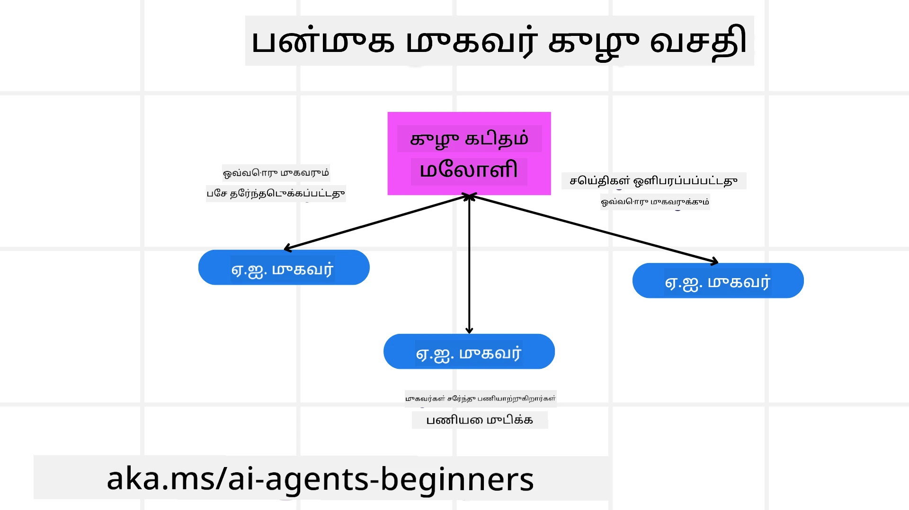
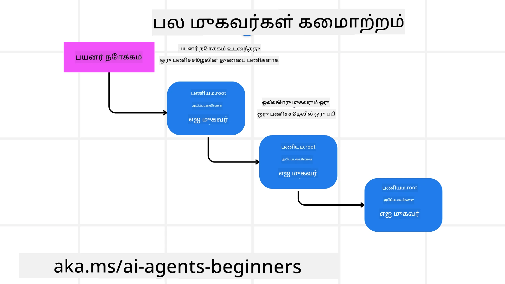
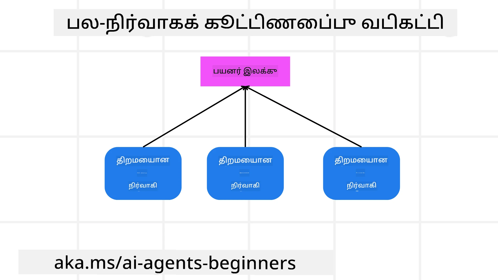

> _(இந்த பாடத்தின் காணொளியை பார்க்க மேல் படத்தை கிளிக் செய்க)_

# பல முகவர் வடிவமைப்பு மாதிரிகள்

பல முகவர்கள் ஈடுபடக்கூடிய ஒரு திட்டத்தில் பணியாற்றத் தொடங்கும்போது, நீங்கள் பல முகவர் வடிவமைப்பு மாதிரியை கருத்தில் கொள்ள வேண்டியிருக்கும். ஆனால் எப்போது பல முகவர்களுக்காக மாறுவதும் அதன் நன்மைகள் என்ன என்பது உடனடியாக தெளிவாக இருக்கக்கூடாது.

## அறிமுகம்

இந்த பாடத்தில், நாம் பின்வரும் கேள்விகளுக்கு பதிலளிக்க முயற்சிக்கிறோம்:

- பல முகவர்களுக்கான செயல்பாடுகள் எந்த சந்தர்ப்பங்களில் பொருந்தும்?
- பல முகவர்களை பயன்படுத்துவதன் நன்மைகள் என்னவென்பதை ஒரு தனி முகவர் பல பணிகளை செய்யும் நிலைவுடன் ஒப்பிட்டு?
- பல முகவர் வடிவமைப்பு மாதிரியை அமுல்படுத்தும் கட்டுமானத் துண்டுகள் என்ன?
- பல முகவர்கள் ஒருவருடன் ஒருவருக்குச் செலுத்தும் தொடர்புகளை எவ்வாறு தெரிந்துகொள்வது?

## கற்றல் இலக்குகள்

இந்த பாடத்துக்குப் பின், நீங்கள் கற்றுக்கொள்ள வேண்டும்:

- பல முகவர்கள் பொருந்தும் சந்தர்ப்பங்களை அடையாளம் காண
- ஒரு தனி முகவருக்கு மேல் பல முகவர்கள் பயன்படுத்துவதின் நன்மைகளை உணர்ந்துகொள்ள
- பல முகவர் வடிவமைப்பு மாதிரியை அமுல்படுத்தும் கட்டுமானத் துண்டுகளை புரிந்துகொள்ள

பெரிய படத்தைப் பார்க்கும்போது என்ன?

*பல முகவர்கள் ஒரு பொதுவான இலக்கை அடைய ஒன்றாக பணியாற்றப் பயன்படும் வடிவமைப்பு மாதிரியே பல முகவர் வடிவமைப்பு*.

இது ரோபோட்டிக்ஸ், தானியங்கி முறைமைகள் மற்றும் பகிரப்பட்ட கணினி துறைகளில் பரவலாகப் பயன்படுத்தப்படுகிறது.

## பல முகவர்கள் பொருந்தக்கூடிய சந்தர்ப்பங்கள்

எந்த சந்தர்ப்பங்கள் பல முகவர்களை பயன்படுத்த சிறந்தவையாக இருக்கும்? பதில் என்னவென்றால், பல சந்தர்ப்பங்களில் பல முகவர்கள் பயனுள்ளதாக இருப்பார்கள், குறிப்பாக கீழ்க்காணும் நிலைகளில்:

- **பெரிய பணி ஏற்றம்**: பெரிய பணி ஏற்றங்களை சிறிய பணிகளாகப் பிரித்து வெவ்வேறு முகவர்களுக்கு ஒதுக்க முடியும், இதனால் இணைப்பாக செயலாக்கம் மற்றும் விரைவான நிறைவேற்றம் கிடைக்கும். இதற்கு ஒரு உதாரணம் பெரிய தரவு செயலாக்கப் பணியை எடுத்துக்கொள்ளலாம்.
- **சிக்கலான பணிகள்**: பெரிய பணி ஏற்றங்கள் போலவே சிக்கலான பணிகளை சிறு துணைபணிகளாகப் பிரித்து வேறு வேறு முகவர்கள் எவ்வித பணியிலும் தேர்ச்சி கொண்டு உதவுவார்கள். புணர்ச்சி வாகனங்களில் பல முகவர்கள் நடுவர், தடைகள் கண்டறிதல் மற்றும் மற்ற வாகனங்களுடன் தொடர்பு பேணுதல் போன்ற வேறுபட்ட அம்சங்களை கையாள்வதாக எடுத்துக்காட்டு இருக்கிறது.
- **பல்வேறு நிபுணத்துவம்**: ஒரே முகவருக்கு விட வேறு முகவர்களுக்கு தனித்த நிபுணத்துவம் இருக்கலாம், அதனால் ஒரே முகவருக்குக் காட்டிலும் வேறு முகவர்கள் குழும் பணிகளை நன்றாக நடத்த முடியும். உதாரணமாக, சுகாதாரம் துறையில் ஒரே முகவருக்கு பதிலாக பகுப்பாய்வு, சிகிச்சை திட்டங்கள் மற்றும் நோயாளி கண்காணிப்பு போன்றவற்றை பல முகவர்கள் கையாள்வார்கள்.

## தனி முகவருக்கு மேல் பல முகவர்களை பயன்படுத்துவதன் நன்மைகள்

ஒரு தனி முகவர் அமைப்பு எளிமையான பணிகளுக்கு சரியானது, ஆனால் சிக்கலான பணிகளுக்கு பல முகவர்கள் பயன்படுத்துவதால் பல நன்மைகள் கிடைக்கும்:

- **தனிப்பெருக்கம்**: ஒவ்வொரு முகவரும் குறிப்பிட்ட ஒரு பணிக்கு தனிப்பிரிவு பெறலாம். ஒரே முகவருக்கு தனிப்பெருக்கம் இல்லாதது எதையும் செய்யும் முகவராக இருந்தாலும் சிக்கலான பணியில் தொடர்ந்து என்ன செய்ய வேண்டும் தெரியாமல் குழப்பமடைந்து சரியான பணி செய்யாமல் இருக்க வாய்ப்பு உள்ளது.
- **அளவு விரிதல்**: ஒரு முகவருக்கு அதிகபட்ச பணிகள் கொடுக்கவிட பெரிதாக முகவர்கள் சேர்க்கும்படி அமைப்பை விரிதல் செய்யவுல்லது.
- **தப்பிடு சக்தி**: ஒருவர் தோல்வியடித்தால் மற்றவை தொடர்ந்து இயங்கும், இது அமைப்பின் நம்பகத்தன்மையை உறுதி செய்கிறது.

ஒரு எடுத்துக்காட்டை பார்ப்போம்: பயணக் கைகூடல் செய்வோம். ஒரு தனி முகவர் புறங்கூட்டல், தங்குமிடங்கள் முன்பதிவு மற்றும் வாடகை கார்கள் முன்பதிவு போன்ற அனைத்து அம்சங்களையும் கையாள வேண்டும். இதற்கு அனைத்து பணிகளுக்கும் ஒரு முகவன் கருவிகள் கொண்டிருக்க வேண்டும். இது பரிபூரண மற்றும் குவியலான அமைப்பாகி பராமரிக்க மற்றும் விரிதல் செய்ய கடினமாக இருக்கும். ஆனால் பல முகவர் அமைப்பில் பயணச் சீட்டுக் காண்பதற்கான, தங்குமிடங்களை முன்பதிவு செய்யும் முகவர் மற்றும் வாடகை கார்களை முன்பதிவு செய்யும் முகவர் இருப்பார்கள். இது அமைப்பை மோசடியற்ற, பராமரிக்க எளிதான மற்றும் விரிதல் செய்யக்கூடியதாக மாற்றுகிறது.

இதனை ஒரு குடும்ப மேட்சிய கடை கையாளும் பயண முகவர் அலுவலகம் மற்றும் ஒரு ஃபிராஞ்சைஸ் இயற்றும் முகவர் அலுவலகம் என்பதுடன் ஒப்பிடுங்கள். குடும்ப மேட்சிய கடை ஒரு தனி முகவருக்கு அனைத்து பணிகளையும் விடுவிக்கும், ஃபிராஞ்சைஸ் பயனர் வேறுபட்ட பணிகளை வேறு வேறு முகவர்கள் செய்துகொள்ளும்.

## பல முகவர் வடிவமைப்பு மாதிரியை அமுல்படுத்தும் கட்டுமானத் துண்டுகள்

பல முகவர் வடிவமைப்பு மாதிரியை முயற்சிப்பதற்கு முன், மாதிரியை உருவாக்கும் கட்டுமானத் துண்டுகளை புரிந்துகொள்ள வேண்டும்.

இந்தக் கருத்தை மக்கள் பயணத்தை முன்பதிவு செய்வதாக எடுத்துக்கொள்வோம். இதில் கட்டுமானத் துண்டுக்கள்:

- **முகவர் தொடர்பு**: விமானங்களை கண்டெடுக்கும், தங்குமிடங்களை முன்பதிவு செய்யும் மற்றும் வாடகை கார்கள் முன்பதிவுக்கான முகவர்கள் பயனர் விருப்பங்கள் மற்றும் கட்டுப்பாடுகள் பற்றிய தகவலை பகிர்ந்து தொடர்பு கொள்ள வேண்டும். நீங்கள் இந்த தொடர்பிற்கான நெறிமுறைகள் மற்றும் முறைகளை தீர்மானிக்க வேண்டும். எடுத்துக்காட்டாக, விமான முகவர் தங்குமிடம் முன்பதிவு முகவருடன் தொடர்பு கொண்டு பயணத்தின் தினங்கள் ஒரே மாதிரியாக இருக்கும் உறுதிப்படுத்த வேண்டும். அதனால் முகவர்கள் எது யாருக்கு என்ன தகவலை பகிர வேண்டும் என தீர்மானிக்க வேண்டியிருக்கும்.
- **ஒத்துழைப்பு முறைமை**: பயனர் விருப்பங்கள் மற்றும் கட்டுப்பாடுகள் பூர்த்தி அடைய முகவர்கள் தங்கள் நடவடிக்கைகளை ஒத்துழைக்க வேண்டும். உதாரணமாக பயனர் விமான நிலையத்திற்கு அருகில் ஓர் தங்குமிடம் விரும்பலாம், மற்றும் வாடகை கார்கள் மட்டும் விமான நிலையத்தில் கிடைக்க முடியும் என்பது கட்டுப்பாடு. ஆகவே தங்குமிடம் முன்பதிவு முகவர் வாடகை கார் முன்பதிவு முகவருடன் ஒருங்கிணைந்து செயல்பட வேண்டும். இதனால் முகவர்கள் நடவடிக்கைகளை எப்படி ஒருங்கிணைக்கிறார்கள் என்பதை தீர்மானிக்க வேண்டும்.
- **முகவர் கட்டமைப்பு**: முகவர்களுக்கு முடிவெடுக்க உள்ளமைப்பு மற்றும் பயனர் தொடர்புகளிலிருந்து கற்றுப்பொறுக்கும் திறன் வேண்டும். விமான முகவர் பயனருக்குப் பரிந்துரைக்க வேண்டிய விமானங்களை தீர்மானிக்க முடிவெடுக்க கூடுதல் உள்ளமைப்பு கொண்டிருக்க வேண்டும். முகவர்களின் முடிவெடுத்தலும் கற்றலும் எப்படி நடைபெறுகிறது என்பதையும் தீர்மானிக்க வேண்டும். உதாரணமாக விமான முகவர் பயனர் முன்பு விருப்பங்களை அடிப்படையாகக் கொண்டு விமானங்களை பரிந்துரைக்கும் மெஷின் லெர்னிங் மாடலைப் பயன்படுத்தலாம்.
- **பல முகவர் செயல்பாட்டில் கண்காணிப்பு**: பல முகவர்கள் ஒருவருடன் ஒருவரை எப்படி தொடர்பு கொள்கின்றனர் என்பதில் கண்காணிப்பு தேவை. முகவர் செயல்பாடுகள் மற்றும் தொடர்புகள் கண்காணிக்கும் கருவிகள், சார்பு முறைகள் தேவைப்படும். இது பதிவேடு மற்றும் கண்காணிப்பு கருவிகள், காட்சி கருவிகள் மற்றும் செயல்திறன் அளவைகள் வடிவில் இருக்கலாம்.
- **பல முகவர் மாதிரிகள்**: பல முகவர் அமைப்பை உருவாக்குவதற்கான மையமையாக்கப்பட்ட, மையமையாக்கப்படாத மற்றும் கலப்பு கட்டமைப்புக்கள் போன்ற விதிவிலக்கான மாதிரிகள் உள்ளன. உங்களது பயன்பாட்டுக்கு ஏற்ற மாதிரியைத் தேர்ந்தெடுக்க வேண்டும்.
- **மனிதர் உள்ளீடு**: பெரும்பாலான சந்தர்ப்பங்களில் மனிதர் தொடர்பு இருக்கும், அதற்கு முகவர்கள் எப்பொழுது மனிதர் உதவியைப் பின்பற்ற வேண்டும் என்பதனை அறிவிக்க வேண்டும். உதாரணமாக பயனர் குறிப்பிட்ட தங்குமிடம் அல்லது விமானம் கேட்டால் முகவர்கள் பரிந்துரைக்காதவை இருக்கலாம், அல்லது முன்பதிவு செய்ய முன்பு நிச்சயிக்க வேண்டியிருக்கலாம்.

## பல முகவர் தொடர்புகளில் கண்காணிப்பு

பல முகவர்கள் ஒருவருடன் ஒருவருக்கு எவ்வாறு செயல்படுகிறார்கள் என்பதை நாம் தெளிவாகப் பார்க்க வேண்டும். இது பிழைத்திருத்தம், ஓட்டம் வேகமாக்கத்திற்கும் மற்றும் அமைப்பின் செயல்திறனை உறுதிப்படுத்துவதற்கு முக்கியம். இதற்கு நீங்கள் முகவர் நடவடிக்கை மற்றும் தொடர்புகளை பதிவு செய்யும் கருவிகள், காட்சி கருவிகள் மற்றும் செயல்திறன் அளவைகள் தேவை.

உதாரணமாக பயண முன்பதிவு என்ற இடத்தில், நீங்கள் ஒவ்வொரு முகவரின் நிலையை, பயனர் விருப்பங்கள் மற்றும் கட்டுப்பாடுகள் மற்றும் முகவர்கள் இடையேயான தொடர்புகளை ஒரு டாஷ்போர்டில் காணலாம். இந்த டாஷ்போர்டு பயனர் பயணத் தேதிகள், விமான முகவரின் பரிந்துரைகள், தங்குமிட முகவரின் பரிந்துரைகள் மற்றும் வாடகை கார் முகவரின் பரிந்துரைகளை காட்டும். இது முகவர்கள் ஒருவருடன் ஒருவர் எப்படி தொடர்பு கொள்கிறார்கள் மற்றும் பயனர் விருப்பங்கள் பூர்த்தி செய்யப்படுகின்றதா என்பதைத் தெளிவாகக் காண உதவும்.

இப்போது இதன் ஒவ்வொரு அம்சத்தையும் விரிவாகப் பார்ப்போம்.

- **பதிவு மற்றும் கண்காணிப்பு கருவிகள்**: ஒரு முகவர் எடுத்த நடவடிக்கை ஒவ்வொன்றும் பதிவாக வேண்டும். பதிவு ஒரு முகவர், நடவடிக்கை, நேரம் மற்றும் முடிவுகளைச் சேமிக்க வேண்டும். இந்த தகவல் பிழைத்திருத்தம், மேம்படுத்தல் மற்றும் பிற சூழலில் பயன்படும்.
- **காட்சி கருவிகள்**: முகவர்களுக்கிடையேயான தொடர்பை தெளிவாகக் காண காட்சி கருவிகள் உதவுகின்றன. உதாரணமாக, முகவர்கள் இடையேயான தகவல் பாய்வை காட்டும் படி ஒரு பார்வை உண்டு. இதனால் தடை, செயல்திறன் குறைவு மற்றும் பிற பிரச்சினைகளை கண்டுபிடிக்க உதவும்.
- **செயல்திறன் அளவைகள்**: பல முகவர் அமைப்பின் செயல்திறனைத் தடவுகிறதா என்பதை ஆராய அலுவலக அளவைகள் உதவும். ஒரு பணி நிறைவு நேரம், ஒரு நேரத்தில் நிறைவு செய்யப்பட்ட பணிகள் எண்ணிக்கை, பரிந்துரைகளின் துல்லியம் போன்றவை கண்காணிக்கப்படலாம். இது மேம்படுத்தல் பகுதிகளை அடையாளம் காட்டி அமைப்பை மேம்படுத்த உதவும்.

## பல முகவர் மாதிரிகள்

பல முகவர் பயன்பாடுகளை உருவாக்க சில சிறப்பான மாதிரிகள் உள்ளன. அவை கீழே கொடுக்கப்பட்டுள்ளன:

### குழு உரையாடல்

பல முகவர்கள் ஒருவருடன் ஒருவர் தொடர்பு கொள்ளும் குழு உரையாடல் செயலியை உருவாக்க விரும்பும் போது இது பயன்படும். குழு ஒருங்கிணைப்பு, வாடிக்கையாளர் ஆதரவு மற்றும் சமூக வலைத்தளம் போன்ற பயன்கள் இங்கு அடங்கும்.

இந்த மாதிரியில் ஒவ்வொரு முகவரும் குழு உரையாடலைப் பிரதிநிதித்துவம் செய்யும், மற்றும் முகவர்கள் இடையேயான செய்திகளுக்கு ஒரு செய்தி நெறிமுறையைப் பயன்படுத்தி பரிமாறிக் கொள்கின்றனர். முகவர்கள் குழுவுக்கு செய்தி அனுப்பலாம், குழுவிலிருந்து செய்தி பெறலாம் மற்றும் மற்றவர்களின் செய்திகளுக்கு பதில் அளிக்கலாம்.

இந்த மாதிரியை மையமையாக்கப்பட்ட கட்டமைப்பில் செயல்படுத்தலாம், எல்லா செய்திகள் மைய பரிமாற்ற சேவையகத்தின் மூலம் வழியாக இயங்கியும் அல்லது நேரடியான வழிச்சரிவுகள் உள்ள மையமையாக்காத கட்டமைப்பிலும்.

### பணிகளை மாற்றி-பிடித்தல்

பல முகவர்கள் ஒருவரின் பணியை மறொருவருக்கு ஒப்படைக்கும் செயலியை உருவாக்க விரும்பும் போது இது பயன்படும்.

வாடிக்கையாளர் ஆதரவு, பணி மேலாண்மை மற்றும் வேலைப்பாட்டுச் தானியக்கம் இந்த மாதிரிக்கு உதாரண செயற்கூறுகள்.

இந்த மாதிரியில் ஒவ்வொரு முகவரும் ஒரு பணி அல்லது ஒருங்கிணைப்பின் ஒரு படி பிரதிநிதித்துவம் செய்கின்றனர் மற்றும் முன்கூட்டியே தீர்மானிக்கப்பட்ட விதிகளின் அடிப்படையில் பணிகளை மற்ற முகவர்களுக்கு மாற்றி-பிடிக்கும்.

### கூட்டாண்மை வடிமைப்படுத்துதல்

பல முகவர்கள் பயனர்களுக்கு பரிந்துரைகளை வழங்க ஒன்றிய செயலியில் இது உதவும்.

பல முகவர்கள் ஒன்றிய ஆட்டத்தில் பங்கு பெறும் காரணம் ஒவ்வொரு முகவரும் வித்தியாசமான நிபுணத்துவத்துடன் இருக்கின்றனர் மற்றும் பரிந்துரைக் செயலில் வெவ்வேறு வழிகளில் பங்களிக்கிறார்கள்.

ஒரு பயனர் பங்கு வாங்க சிறந்த பங்கு எது என்று பரிந்துரை விரும்பும்போது எடுத்துக்காட்டு:

- **தொழில் நிபுணர்**: ஒருமுகவர் குறிப்பிட்ட தொழில்துறையின் நிபுணர் ஆகலாம்.
- **தொழில்நுட்ப பகுப்பாய்வு**: மற்றொரு முகவர் தொழில்நுட்ப பகுப்பாய்வில் நிபுணர் ஆகலாம்.
- **அடிப்படை பகுப்பாய்வு**: மற்றொரு முகவர் அடிப்படை பகுப்பாய்வில் நிபுணர். ஒன்றுமித்தம் நேர்த்தியான பரிந்துரையை வழங்க கூடிய முகவர்கள் இவ்வாறு இணைந்து செயல்படுவார்கள்.

## சந்தர்ப்பம்: நிதி திருப்பி பெறும் செயல்முறை

ஒரு வாடிக்கையாளர் ஒரு தயாரிப்பிற்கு பணம் திரும்ப பெற முயற்சிக்கும் சந்தர்ப்பத்தை கருதுங்கள், இதில் பல முகவர்கள் ஈடுபடும். ஆனால் இந்த செயல்முறைக்கான முகவர்களையும் உங்கள் விளைவாக வாங்கக்கூடிய பொதுவான முகவர்களையும் பிரித்து பார்ப்போம்.

**திருப்பி பெறும் செயல்முறைக்கான சிறப்பு முகவர்கள்**:

திருப்பி பெறும் செயல்முறையுடன் தொடர்புடைய முகவர்கள்:

- **வாடிக்கையாளர் முகவர்**: வாடிக்கையாளரை பிரதிநிதித்துவம் செய்து திருப்பி பெறும் செயல்முறையை துவக்கும் முகவர்.
- **விற்பனையாளர் முகவர்**: விற்பனையாளரை பிரதிநிதித்துவம் செய்து திருப்பி பெறுதலை செயலாக்கும்.
- **கட்டணம் முகவர்**: கட்டணம் தொகையை திருப்பி செலுத்தும் செயல்முறையை கையாளும்.
- **தீர்வு முகவர்**: திருப்பி பெறும் செயல்முறையில் எழும் பிரச்சனைகளை தீர்க்கும்.
- **ஒழுங்குமுறை முகவர்**: நடைமுறைகள் மற்றும் கொள்கைகளுடன் செயல்பாட்டை உறுதி செய்யும்.

**பொதுவான முகவர்கள்**:

வணிகத்தின் பிற பகுதிகளிலும் பயன்படக்கூடியவை:

- **அனுப்பல் முகவர்**: தயாரிப்பை திரும்ப விற்பனையாளரிடம் அனுப்பும். இது திருப்பி பெறும் மற்றும் பொருள் வாங்குதலில் பொதுவாக பயன்படுத்தப்படும்.
- **பின்னூட்ட முகவர்**: வாடிக்கையாளரிடமிருந்து பின்னூட்டம் சேகரிக்கும் என்பது திருப்பி பெறும் நேரமோ அல்லது பிற நேரங்களோ அடிக்கடி நடக்கும்.
- **மேம்படுத்தல் முகவர்**: பிரச்சனைகளை மேலதிக ஆதரவுக்கு உயர்த்துவது இதன் பணி.
- **அறிவிப்பு முகவர்**: திருப்பி பெறும் செயல்முறையின் பல கட்டங்களில் வாடிக்கையாளருக்கு அறிவிப்புகள் அனுப்பும்.
- **அணுக்குழு முகவர்**: திருப்பி பெறும் தரவுகளை பகுப்பாய்வு செய்யும்.
- **கணக்கு முகவர்**: திருப்பி பெறும் செயல்முறையை சரியாக நடைபெறுவதாக கணக்காய்வு செய்யும்.
- **அறிக்கை முகவர்**: திருப்பி பெறும் செயல்திட்டத்தில் அறிக்கைகளை உருவாக்கும்.
- **அறிவு முகவர்**: திருப்பி பெறுதல் தொடர்புடைய மற்றும் வணிகம் சார்ந்த தகவல் வலைமை பராமரிக்கிறது.
- **பாதுகாப்பு முகவர்**: திருப்பி பெறும் செயல்முறையின் பாதுகாப்பை உறுதி செய்கிறது.
- **தர முகவர்**: திருப்பி பெறும் செயல்முறையின் தரத்தை காப்பாற்றுகிறது.

மேலே குறிப்பிட்ட முகவர்கள் திருப்பி பெறும் செயல்முறைக்கான குறிப்பிட்ட முகவர்களும் வணிகத்தின் பிற பகுதிகளுக்குக் கணிசமாக பொதுவான முகவர்களும் உள்ளன. உங்கள் பல முகவர் அமைப்புக்கு எது எது முகவர்களை பயன்படுத்த வேண்டுமெனங்கள் இவை கொடுத்த உதாரணமாகும்.

## பணிக்குவித்தல்

ஒரு வாடிக்கையாளர் ஆதரவு செயலிக்கு பல முகவர் அமைப்பை வடிவமைக்கவும். இதில் உள்ள முகவர்களின் செயல், பொறுப்புகள் மற்றும் ஒருவருடன் ஒருவர் எப்படி தொடர்பு கொள்கிறார்கள் என்பதையும் கண்டறியவும். வாடிக்கையாளர் ஆதரவு செயலிக்கான சிறப்பு முகவர்களையும் வணிகத்தின் பிற பகுதிகளில் பயன்படும் பொதுவான முகவர்களையும் மனதில் கொள்ளவும்.
> பின்வரும் தீர்வை படிக்கும் முன் ஒரு அறிவுரை, நீங்கள் நினைக்கும் எண்ணிக்கையைவிட மேலும் агентகளை தேவையுள்ளதாக இருக்கலாம்.

> TIP: வாடிக்கையாளர் ஆதரவு செயல்முறையின் வெவ்வேறு கட்டங்களை பற்றி யோசிக்கவும் மற்றும் எந்தவொரு அமைப்புக்கும் தேவையான агентகளையும் கருத்திலுக்கு கொண்டு வாருங்கள்.

## Solution

[Solution](./solution/solution.md)

## Knowledge checks

Question: நீங்கள் எப்போது பல агентகளை பயன்படுத்த கோர வேண்டும்?

- [ ] A1: நீங்கள் சிறிய வேலை மற்றும் எளிமையான பணியை கொண்டிருந்தால்.
- [ ] A2: நீங்கள் பெரிய பணியை கொண்டிருந்தால்.
- [ ] A3: நீங்கள் எளிமையான பணியை கொண்டிருந்தால்.

[Solution quiz](./solution/solution-quiz.md)

## Summary

இந்த பாடத்தில், நாம் பல агент வடிவமைப்பு மாதிரியைப் பற்றி பார்வையிட்டோம், பல агентகள் பொருந்தக்கூடிய நிகழ்வுகள், ஒரு агентை விட பல агентகளைப் பயன்படுத்துவதன் நன்மைகள், பல агент வடிவமைப்பை செயல்படுத்துவதற்கான அடிப்படைக் கூறுகள் மற்றும் பல агентகள் ஒன்றோடொன்று எவ்வாறு தொடர்பு கொள்கிறார்கள் என்று காணப்படுகிற வழிகள் ஆகியவை.

### பல агент வடிவமைப்பு மாதிரியைப் பற்றி மேலும் கேள்விகள் உள்ளதா?

[Microsoft Foundry Discord](https://aka.ms/ai-agents/discord) இல் சேர்ந்து மற்ற படிப்பவர்களை சந்திக்கவும், அலுவலக நேரங்களில் கலந்துகொள்ளவும் மற்றும் உங்கள் AI агент கேள்விகளுக்கு பதில் பெறவும்.

## Additional resources

- <a href="https://learn.microsoft.com/azure/ai-services/agents/overview" target="_blank">Microsoft Agent Framework ஆவணங்கள்</a>
- <a href="https://www.analyticsvidhya.com/blog/2024/10/agentic-design-patterns/" target="_blank">Agentic வடிவமைப்பு மாதிரிகள்</a>

## Previous Lesson

[Planning Design](../07-planning-design/README.md)

## Next Lesson

[Metacognition in AI Agents](../09-metacognition/README.md)

---

<!-- CO-OP TRANSLATOR DISCLAIMER START -->
**வழக்கறிதல்**:  
இந்தக் கோப்பு AI மொழிபெயர்ப்பு சேவையான [Co-op Translator](https://github.com/Azure/co-op-translator) மூலம் மொழிபெயர்க்கப்பட்டுள்ளது. நாங்கள் துல்லியத்திற்க்கு முயற்சி செய்கிறோம் என்றாலும், தானாகச் செய்யப்படும் மொழிபெயர்ப்புகளில் பிழைகள் அல்லது தவறுகள் இருக்கக்கூடும் என்பதை தயவுசெய்து கவனிக்கவும். இயல்புநிலையான மொழியில் உள்ள அத்தியாவசிய ஆவணம் தான் அதிகாரப்பூர்வ மூலமாகக் கொண்டு கொள்ளப்பட வேண்டும். முக்கியமான தகவல்களுக்காக, தொழில்முறை மனித மொழிபெயர்ப்பை பரிந்துரைக்கின்றோம். இந்த மொழிபெயர்ப்பைப் பயன்படுத்துவதனால் ஏற்படும் ஏதும் தவறான புரிதல்கள் அல்லது தவறான விளக்கங்களுக்கு நாங்கள் பொறுப்பானவர்கள் அல்ல.
<!-- CO-OP TRANSLATOR DISCLAIMER END -->