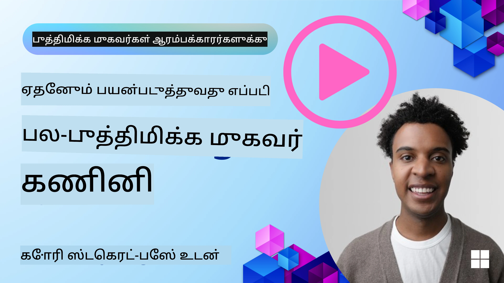
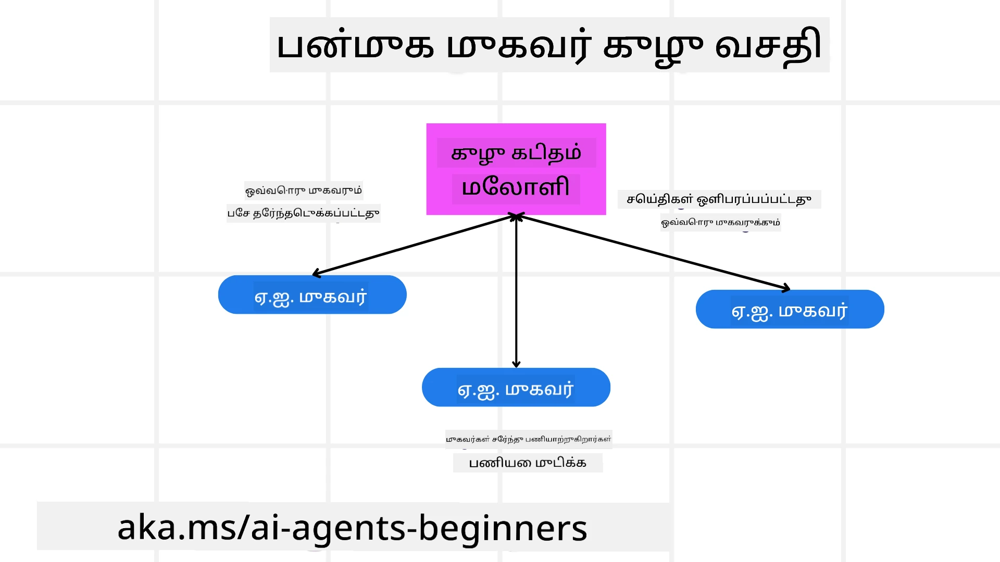
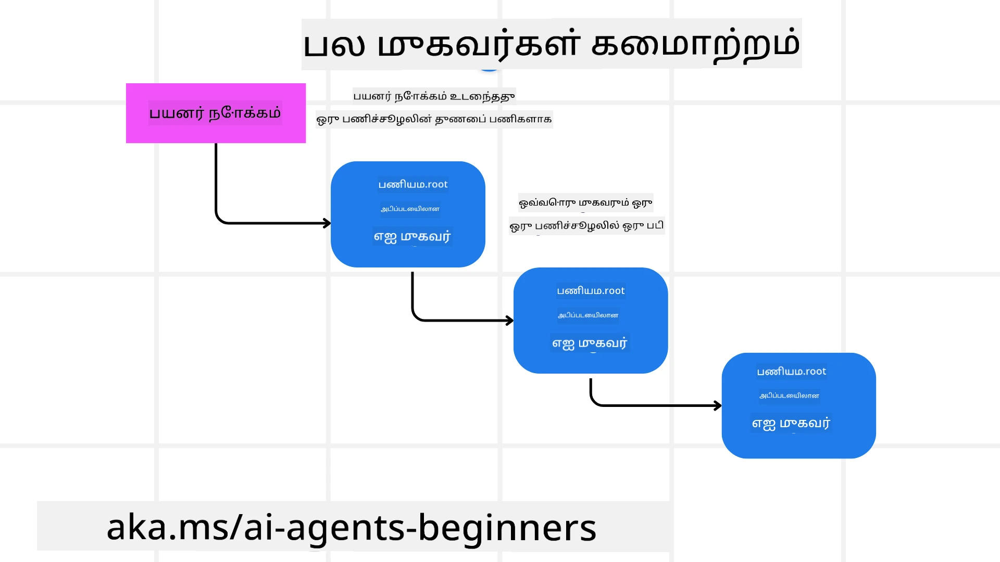
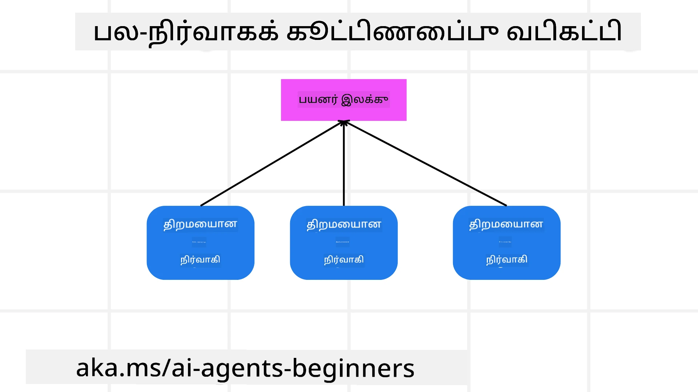

> _(இந்தப் பாடத்தின் வீடியோவை காணமேல் உள்ள படம் மீது கிளிக் செய்யவும்)_

# பன்முகன் செயற்குழு வடிவமைப்பு மாதிரிகள்

பல முகங்களைக் கொண்ட ஒரு திட்டத்தில் பணியாற்றத் தொடங்குகிறவுடன், நீங்கள் பன்முகன் செயற்குழு வடிவமைப்பு மாதிரியை கவனிக்க வேண்டும். இருப்பினும், எப்போது பன்முகன் செயற்குழுக்களில் மாற்ற வேண்டும் மற்றும் இது என்ன பயனுள்ளதாகும் என்பது உடனடி தெளிவாக இருக்காது.

## அறிமுகம்

இந்த பாடத்தில், நாம் பின்வரும் கேள்விகளுக்கு பதில் காண விரைந்துகொள்கிறோம்:

- பன்முகன் செயற்குழுக்கள் பொருந்தக்கூடிய சூழ்நிலைகள் எவை?
- பல பணிகள் செய்யக்கூடிய ஒரே முகனைக் கொண்டிருக்கும் நிலையில், பன்முகன் செயற்குழுக்களைப் பயன்படுத்துவதன் நன்மைகள் என்ன?
- பன்முகன் செயற்குழு வடிவமைப்பு மாதிரியை செயல்படுத்துவதற்கான அடிப்படை கூறுகள் என்ன?
- பல முகங்கள் ஒருவருடன் எவ்வாறு தொடர்பு கொள்கிறார்கள் என்பதை எப்படி பார்க்க முடியும்?

## கற்றல் இலக்குகள்

இந்த பாடத்திற்குப் பிறகு, நீங்கள் செய்திருக்கும் திறன்கள்:

- பன்முகன் செயற்குழுக்கள் பொருந்தக்கூடிய சூழ்நிலைகளை அடையாளப்படுத்துதல்
- ஒரே முகனைக் கொண்டிருக்கும் நிலையில் பன்முகன் செயற்குழுக்களைப் பயன்படுத்துவதன் நன்மைகளை உணர்த்துதல்.
- பன்முகன் செயற்குழு வடிவமைப்பு மாதிரியை செயல்படுத்துவதற்கான அடிப்படை கூறுகளைப் புரிந்துகொள்ளுதல்.

பெரிய காட்சி என்ன?

*பன்முகன் செயற்குழுக்கள் என்பது பல முகங்கள் சேர்ந்து ஒரு பொதுவான இலக்கை அடைய உதவும் வடிவமைப்பு மாதிரி.*

இந்த மாதிரி பல துறைகளில் பரவலாக பயன்படுத்தப்படுகிறது, அதில் ரோபோட்டிக்ஸ், தானாக இயங்கும் அமைப்புகள் மற்றும் விநியோகிக்கப்பட்ட கணினி விஞ்ஞானம் அடங்கும்.

## பன்முகன் செயற்குழுக்கள் பொருந்தக்கூடிய சூழ்நிலைகள்

பன்முகன் செயற்குழுக்களை பயன்படுத்துவதற்கு ஏற்ற சூழ்நிலைகள் என்னென்ன? பதில் என்னவெனில், பல்வேறு சூழ்நிலைகளில் பல முகங்களைப் பயன்படுத்துவது பயனுள்ளதாகும், குறிப்பாக பின்வரும் நிலைகளில்:

- **பெரிய வேலைப் பாரங்கள்**: பெரிய வேலைப்பாரங்களை சிறிய பணிகளாகப் பிரித்து, வேறுவேறு முகம்களிடம் வழங்கலாம், இதனால் ஒரே நேரத்தில் செயலாக்கம் ஆகிவெள்ளி வேகமாக முடியும். உதாரணமாக பெரிய தரவு செயலாக்க வேலை.
- **சிக்கலான பணிகள்**: பெரிய வேலைப்பாரங்களையேப் போல, சிக்கலான பணிகள் கூட சிறு துணை பணிகளாகப் பிரிந்து, ஒவ்வொரு முகமும் பணியின் தனித்துவமான பகுதிக்கு தேர்ச்சி கொண்டிருக்க முடியும். உதாரணமாக தானாக இயங்கும் வாகனங்களில் ஒரு முகம் வழிச்செலுத்தல், மற்றொன்று தடைகள் கண்டறிதல் மற்றும் மற்றொன்று வேறுவேறு வாகனங்களுடன் தொடர்பு கொள்ளுதல் ஆகியவற்றை கையாளும்.
- **பல்வேறு நிபுணத்துவம்**: வேறுபட்ட முகங்களிடம் பல்வகை திறன்கள் இருப்பதால், ஒரே முகனைவிட பணியின் பல பகுதிகளை சிறப்பாக கையாள முடியும். இதற்கான உதாரணமாக சுகாதார பராமரிப்பு, இதில் முகங்கள் கண்டறிதல், சிகிச்சை திட்டங்கள், மற்றும் நோயாளி கண்காணிப்பு ஆகியவற்றை கவனிக்கின்றன.

## ஒரே முகனைவிட பன்முகன் செயற்குழுக்களின் நன்மைகள்

எளிய பணிகளுக்கு ஒரு முகன் சிகவாயாக இருப்பதற்கும் சாத்தியமாக இருக்கலாம், ஆனால் சிக்கலான பணிகளுக்கு பன்முகம் பயன்படுத்துவது பல நன்மைகளை தரும்:

- **திறனாக்கல்**: ஒவ்வொரு முகனும் ஒரு தனித்துவமான பணிக்கு சிறப்பு பெற முடியும். ஒரே முகனில் சிறப்பு குறைவாயின், அது எல்லாவற்றையும் செய்ய முயற்சிப்பதால் குழப்பத்தில் இருக்கும். இதனால் அது அவ்வளவு பொருத்தமான பணியைச் செய்யாமலும் இருக்கலாம்.
- **முக்கேட்டாக்கல்**: ஒரே முகனை அதிகமாக ஏற்றுமதி செய்வதற்கு பதிலாக, மேலும் முகங்களைச் சேர்ப்பதன் மூலம் அமைப்பை விரிவாக்குவது எளிது.
- **தவறுத்தன்மை எதிர்ப்பு**: ஒரு முகன் தோல்வியுற்றால் மற்றவை தொடர்ந்தும் செயல்பட்டு, அமைப்பின் நம்பகத்தன்மையை உறுதிப்படுத்தும்.

ஒரு உதாரணத்தை பார்ப்போம், பயணத்திற்கான முன்பதிவை செய்வோம். ஒரே முகன் முறைமை பயண முன்பதிவு செயல்முறையின் எல்லா பகுதியையும் கையாள வேண்டும், விமானம் தேடுதல் முதல் ஹோட்டல்கள் மற்றும் வாடகை கார்கள் முன்பதிவு வரை. இதனை ஒரே முகனுடன் செய்முறைப்படுத்த, அந்த முகனுக்கு அனைத்துப் பணிகளையும் கையாளும் கருவிகள் தேவைப்பட வேண்டும். இது பராமரிக்க கஷ்டமான மற்றும் பரப்பிடக்கூடிய தனிமுறை அமைப்பை உருவாக்கும். பன்முகன் முறைமை, மாறாக, விமானம் தேடுதல், ஹோட்டல் முன்பதிவு மற்றும் வாடகை கார் முன்பதிவிற்கு வேறுபட்ட முகன்களை கொண்டிருக்கும். இது அமைப்பை அதிக தளவமைப்பு, பராமரிக்க எளிது, விரிவாக்கக்கூடியதாக மாற்றும்.

இதை ஒரு குடும்ப கடை நடத்தும் பயண மையத்துடன் ஒப்பிடுக, அதில் ஒரே முகன் அனைத்து பணிகளையும் கையாளும், மற்றொன்று பிராண்சைஸ் முறையில் நடக்கும் பயண மையம், அதில் பன்முகன் முகன்கள் பணி பகுதியை கையாள்வது.

## பன்முகன் செயற்குழு வடிவமைப்பு மாதிரியை செயல்படுத்தும் அடிப்படை கூறுகள்

பன்முகன் செயற்குழு வடிவமைப்பை செயல்படுத்த முன், அதன் அடிப்படை கூறுகளைப் புரிந்து கொள்ள வேண்டும்.

பயண முன்பதிவு எடுத்துக்காட்டைக் கொண்டு இதை மேலும் தெளிவுபடுத்துவோம். இங்கு அடிப்படை கூறுகள் உட்பட:

- **முகன் தொடர்பு**: விமானம் தேடுதல், ஹோட்டல் முன்பதிவு, வாடகை கார் முன்பதிவு ஆகிய முகன்கள் பயனர் விருப்பங்கள் மற்றும் கட்டுப்பாடுகளைப் பற்றி தகவல் பகிர்ந்து கருத்துக்களிக்கவேண்டும். இதற்கான தொடர்பு நெறிமுறைகள் மற்றும் முறைமைகள் தீர்மானிக்க வேண்டும். உதாரணமாக, விமானம் தேடும் முகன் ஹோட்டல் முன்பதிவு முகனுடன் பயண நாட்களைப் பகிர்ந்துகொண்டு ஹோட்டல் மற்றும் விமானம் ஒரே நாட்களில் முன்பதிவு செய்யப்பட்டுள்ளதா என்பதை உறுதி செய்யும். எனவே முகன்கள் *யார் தகவல் பகிர்கிறார்கள் மற்றும் எப்படி பகிர்கிறார்கள்* என்பதைக் தீர்மானிக்க வேண்டும்.
- **சமரசல் முறைகள்**: முகன்கள் பயனர் விருப்பங்கள் மற்றும் கட்டுப்பாடுகள் பூர்த்தி செய்யப்பட்டிருக்க உறுதிசெய்ய தங்களது நடவடிக்கைகளை ஒருங்கிணைக்க வேண்டும். உதாரணமாக பயனர் விருப்பமாக விமான நிலையத்திற்கு அருகில் ஹோட்டல் விருப்பமாயிருக்கலாம், அதே சமயத்தில் வாடகை கார்கள் விமான நிலையத்தில்தான் கிடைக்கும் கட்டுப்பாடு இருக்கலாம். ஆகவே ஹோட்டல் முன்பதிவு முகன் வாடகைக்கார் முன்பதிவு முகனுடன் ஒருங்கிணைப்பது அவசியம். எனவே *முகன்கள் எப்படிச் சேர்ந்து தங்களது நடவடிக்கைகளை ஒருங்கிணைக்கிறார்கள்* என்பதைக் தீர்மானிக்கவேண்டும்.
- **முகன் கட்டமைப்பு**: முகன்கள் முடிவுகளை எடுக்க மற்றும் பயனர் தொடர்புகளிலிருந்து கற்றுக் கொள்ள உள்ள உள்கட்டமைப்பு வாய்ந்திருக்க வேண்டும். உதாரணமாக, விமானம் தேடும் முகன் பயனர் முன் விருப்பங்களை அடிப்படையாகக் கொண்டு விமானங்களை பரிந்துரைக்கும் முடிவுகளை எடுக்க வேண்டும். எனவே *முகன்கள் எவ்வாறு முடிவெடுக்கின்றனர் மற்றும் பயனர் தொடர்புகளிலிருந்து கற்றுக்கொள்கிறார்கள்* என்பதைக் கருதவேண்டும். உதாரணமாக, விமானம் தேடும் முகன் இயந்திரக் கற்றல் மாதிரியைப் பயன்படுத்தி பயனர் முந்தைய விருப்பங்களை அடிப்படையாகக் கொண்டு பரிந்துரைகள் செய்வதாய் இருக்கலாம்.
- **பன்முகன் தொடர்புகளுக்கான கண்காணிப்பு**: பல முகர்கள் ஒருவருடன் எவ்வாறு தொடர்பு கொள்கிறார்கள் என்பதை வெளிப்படையாக காண ஆராய வாய்ப்பு வேண்டும். இதற்காக முகன் நடவடிக்கைகள் மற்றும் தொடர்புகளை கண்காணிக்கும் கருவிகள் மற்றும் நுட்பங்களை வைத்திருக்க வேண்டும். இதில் பதிவு மற்றும் கண்காணிப்பு கருவிகள், படக்காட்சி கருவிகள் மற்றும் செயல்திறன் அளவீடுகள் அடங்கலாம்.
- **பன்முகன் வடிவமைப்புகள்**: மையமிட்ட, மையமில்லாத மற்றும் கலந்த வடிவமைப்புகள் போன்ற பல வடிவமைப்புக்கள் உள்ளன. உங்களின் பயன்பாட்டுக்கு ஏற்ற வடிவமைப்பை தேர்ந்தெடுக்க வேண்டும்.
- **மனிதனின் பங்கீடு**: அதிகமாக மனிதன் இணைந்து செயல்படும் நிலைகளும் உள்ளன, அப்போது முகன்கள் மனிதன் தொடர்பை எப்போது கேட்கவேண்டும் என்பதை அறிவிக்க வேண்டும். இது பயனர் விமானம் அல்லது ஹோட்டல் முன்பதிவு செய்யுமுன் உறுதிப்படுத்துதல் அல்லது முகன்கள் பரிந்துரையிடாத குறிப்பிட்ட ஹோட்டலை கேட்பது போன்றதாக இருக்கலாம்.

## பன்முகன் தொடர்புகளுக்கான வெளிப்பாடு

பல முகர்கள் ஒருவருடன் எவ்வாறு தொடர்பு கொள்கிறார்கள் என்பதை வெளிப்படையாக காண வேண்டும். இந்த வெளிப்பாடு பிழைதிருத்தம், மேன்மை செய்தல் மற்றும் மொத்த அமைப்பின் செயல்திறனை உறுதிப்படுத்தத் தேவையானது. இதற்காக முகன் செயல்பாடுகள் மற்றும் தொடர்புகளை கண்காணிக்கும் கருவிகள், பதிவு கருவிகள், படக்காட்சி கருவிகள் மற்றும் செயல்திறன் அளவீடுகள் போன்ற தொழில்நுட்பங்கள் தேவை.

உதாரணமாக, பயண முன்பதிவு செய்யப்பட்ட பயனருக்கான அமைப்பில், ஒவ்வொரு முகனின் நிலை, பயனர் விருப்பங்கள் மற்றும் கட்டுப்பாடுகள், மற்றும் முகன்கள் இடையேயான தொடர்புகளை காட்டும் டாஷ்போர்டு இருக்கலாம். இந்த டாஷ்போர்டு பயண தேதி, விமான முகன் பரிந்துரைத்த விமானங்கள், ஹோட்டல் முகன் பரிந்துரைத்த ஹோட்டல்கள் மற்றும் வாடகைக் கார் முகன் பரிந்துரைத்த வாடகை கார்கள் ஆகியவற்றை காட்டும். இது முகன்கள் ஒருமொருவருடன் எவ்வாறு தொடர்பு கொள்கிறார்கள் மற்றும் பயனர் விருப்பங்கள் மற்றும் கட்டுப்பாடுகள் பூர்த்தி செய்யப்பட்டுள்ளதா என்பதை தெளிவாகக் காட்டும்.

இவற்றில் ஒவ்வொன்றையும் விரிவாகப் பார்க்கலாம்.

- **பதிவு மற்றும் கண்காணிப்பு கருவிகள்**: ஒரு முகன் எடுத்த நடவடிக்கைகளின் அனைத்திற்கும் பதிவு செய்வது விரும்பத்தக்கது. ஒரு பதிவுக் கட்டுரை, அந்த நடவடிக்கையை எடுத்த முகன், நடவடிக்கை எடுத்த நேரம், நடவடிக்கையின் முடிவு போன்ற தகவல்களைச் சேமிக்கலாம். இது பிழைதிருத்தம், மேன்மை செய்தல் மற்றும் மற்ற உதவிகளுக்கு பயன்படும்.

- **படக்காட்சி கருவிகள்**: முகன்களுக்கிடையேயான தொடர்புகளை உவமைக்க காட்ட படக்காட்சி கருவிகள் உதவும். உதாரணமாக, தகவல் ஒழுங்குமுறை கல்வியை காட்டும் வரைபடம். இதனால் காலைமுடிகள், செயலிழப்புகள் மற்றும் வேறு சிக்கல்களை கண்டுபிடிக்க முடியும்.

- **செயல்திறன் அளவீடுகள்**: பன்முகன் அமைப்பின் செயல்திறன் கண்காணிக்க உதவும். எடுத்துக்காட்டாக, ஒரு பணியை முடிக்க எடுத்த நேரம், ஒரு நேரத்தில் முடிக்கப்பட்ட வேலைகளின் எண்ணிக்கை மற்றும் முகன்கள் வழங்கும் பரிந்துரைகள் துல்லியத்தன்மை. இந்த தகவல் மேம்பாட்டிற்கு வழிகாட்டவும் அமைப்பை மேம்படுத்தவும் உதவும்.

## பன்முகன் வடிவமைப்பு மாதிரிகள்

பன்முகன் செயலிகளுக்கு சில நடைமுறைகள் உள்ளன. இங்கே சில கவனிக்க வேண்டிய சுவாரஸ்யமான நடைமுறைகள் உள்ளன:

### குழு உரையாடல்

பல முகர்கள் ஒருவருடன் தொடர்பு கொள்ளும் குழு உரையாடல் செயலியை நீங்கள் உருவாக்க விரும்பினால் இந்த மாதிரி பயனுள்ளதாக இருக்கும். இதன் பொதுவான பயன்பாடுகள் அணிப் பணியுறை, வாடிக்கையாளர் ஆதரவு மற்றும் சமூக வலைத்தளம் உள்ளிட்டவை.

இந்த வடிவில், ஒவ்வொரு முகமும் குழு உரையாடலில் ஒரு பயனரை பிரதிநிதித்துவம் செய்கிறது மற்றும் முகன்களிடையே செய்தி பரிமாற்றம் நிகழ்கிறது. முகன்கள் குழு உரையாடலில் செய்தி அனுப்ப, பெற மற்றும் மற்ற முகன்களில் இருந்து பதில் அளிக்க முடியும்.

இந்த மாதிரி மையமிட்ட கட்டமைப்பை பயன்படுத்தி அனைத்து செய்திகள் ஒரு மைய சேவையகத்தின் மூலம் செல்லப்படலாம் அல்லது மையமில்லாத கட்டமைப்பில் நேரடியாக பரிமாறப்படலாம்.

### பணிப் பரிமாற்றம்

பல முகர்கள் பரஸ்பரம் பணிகளை மாற்றிக் கொள்ளும் செயலியை உருவாக்க நீங்கள் இந்த மாதிரியைப் பயன்படுத்தலாம்.

இதன் பொதுவான பயன்பாடுகள் வாடிக்கையாளர் ஆதரவு, பணிக் கட்டுப்பாடு மற்றும் பணிசார்பு தானியக்கம் ஆகும்.

இந்த வடிவில், ஒவ்வொரு முகமும் ஒரு பணியை அல்லது பணி படி பிரதிநிதித்துவம் செய்யும், மற்றும் முன்கூட்டிய விதிகளின் அடிப்படையில் பிற முககளுக்கு பணிகளை மாற்றிக் கொடுக்க முடியும்.

### கூட்டுத் தேர்ந்தெடுத்தல்

பல முகர்கள் பயனர்களுக்கு பரிந்துரைகளை வழங்க ஒன்றாக இணைந்து பணியாற்றும் செயலி உருவாக்க இந்த மாதிரி பயனுள்ளதாக இருக்கும்.

எதற்கு பன்முகன் முகர்கள் இணைந்து பணியாற்றுவார்கள் என்பது அவர்களின் வித்தியாசமான திறன்களுக்கு அடிப்படையாகும், மேலும் பரிந்துரைக் செயலிகளை வெவ்வேறு வழிகளில் கூட்டுறவு செய்ய வடிவமைக்க முடியும்.

ஒரு உதாரணமாக, ஒரு பயனர் பங்கு சந்தையில் எந்த பங்கை வாங்க வேண்டும் என்பதில் பரிந்துரை விரும்புகிறான்.

- **தொழில் நிபுணர்**: ஒரு முகன் குறிப்பிட்ட தொழில் துறையில் வல்லுநர் ஆக இருக்கலாம்.
- **சாப்ட்வேர் பகுப்பாய்வு**: மற்றொரு முகன் தொழில்நுட்ப பகுப்பாய்வு வல்லுநர் ஆக இருக்கலாம்.
- **அடிப்படை பகுப்பாய்வு**: இன்னொரு முகன் அடிப்படை பகுப்பாய்வில் வல்லுநர் ஆக இருக்கலாம். இணைந்து பணியாற்றி, இந்த முகன்கள் ஒருங்கிணைந்த பரிந்துரையை பயனருக்கு வழங்க முடியும்.

## சூழ்நிலை: பணம் திரும்பபெறுதல் செயல்முறை

ஒரு வாடிக்கையாளர் பொருளுக்கு பணம் திரும்ப பெற முயற்சிப்பதை பரிசீலிப்போம், இதில் பல முகர்கள் தொடர்புடையவையாக இருக்கலாம், ஆனால் நாம் பணம் திரும்பப்பெறும் செயல்முறைக்கான முகர்களையும் மற்ற செயல்முறைகளில் பயன்படும் பொதுமுகர்களையும் பிரித்து பார்ப்போம்.

**பணம் திரும்ப பெறும் செயல்முறைக்கான குறிப்பிட்ட முகர்கள்**:

பணம் திரும்ப பெறும் செயல்முறையில் பங்கேற்கக்கூடிய சில முகர்கள்:

- **வாடிக்கையாளர் முகன்**: இந்த முகன் வாடிக்கையாளரை பிரதிநிதித்துவம் செய்து பணம் திரும்ப பெறும் செயல்முறையை தொடங்குவான்.
- **விற்பனையாளர் முகன்**: இந்த முகன் விற்பனையாளரை பிரதிநிதித்துவம் செய்து பணம் திரும்ப பெறுவதை கையாள்வான்.
- **பணம் முகன்**: இந்த முகன் பணப்பரிவர்த்தனையை பிரதிநிதித்துவம் செய்து வாடிக்கையாளருக்கு பணம் திரும்பக் கொடுப்பதில் பொறுப்பாக இருக்கும்.
- **தீர்வு முகன்**: இந்த முகன் பணம் திரும்பப் பெறும் போது ஏற்படும் சிக்கல்களை தீர்க்க உதவும்.
- **ஒத்துழைப்பு முகன்**: இந்த முகன் பணம் திரும்பப் பெறும் செயல்முறை விதிமுறைகள் மற்றும் கொள்கைகளை பின்பற்றி நடக்கும் என்பதை உறுதி செய்யும்.

**பொதுமுகர்கள்**:

இந்த முகர்கள் உங்கள் வணிகத்தின் மற்ற பகுதிகளிலும் பயன்படுத்தப்படலாம்.

- **கப்பல் முகன்**: இந்த முகன் கப்பல் செயல்முறையை பிரதிநிதித்துவம் செய்து பொருளை விற்பனையாளருக்கு திரும்ப அனுப்பும். இது பணம் திரும்பப் பெறும் செயல்முறைக்கும், பொதுவான பொருள் கப்பல் பணிகளுக்கும் பயன்படுத்தப்படலாம்.
- **கருத்து முகன்**: இந்த முகன் வாடிக்கையாளர் கருத்துக்களை சேகரிக்கும். கருத்துக்கள் எப்போதும், பணம் திரும்பப் பெறும் செயல்முறைக்கின்றபோலும் பெறப்படக்கூடும்.
- **மேல்தர முகன்**: இந்த முகன் சிக்கல்களை அதிக ஆதரவு மட்டத்திற்கு உயர்த்தும். இது எந்த செயல்முறையிலும் சிக்கல் உயர்த்த வேண்டிய இடங்களில் பயன்படுத்தப்படலாம்.
- **அறிவிப்பு முகன்**: இந்த முகன் பணம் திரும்பப் பெறும் செயல்முறை பல கட்டங்களிலும் வாடிக்கையாளருக்கு அறிவிப்புகளை அனுப்பும் பொறுப்பை கொண்டிருப்பான்.
- **கணக்காய்வு முகன்**: இந்த முகன் பணம் திரும்பப் பெறும் தரவுகளை பகுப்பாய்வு செய்யும்.
- **ஆடிட் முகன்**: இந்த முகன் பணம் திரும்பப் பெறும் செயல்முறையை சரியாகச் செய்யப்படுகிறதா என்பதைக் கண்காணிக்கும்.
- **அறிக்கை முகன்**: இந்த முகன் பணம் திரும்பப் பெறும் செயல்முறையின் அறிக்கைகளை உருவாக்க உதவும்.
- **அறிவு முகன்**: இந்த முகன் பணம் திரும்பப் பெறுதல் மற்றும் வணிகத்தின் பிற பகுதிகளில் தொடர்புடைய அறிவு பேஸை பராமரிக்கும். இந்த முகன் இரண்டிலும் நிபுணத்துவம் கொண்டிருக்கலாம்.
- **பாதுகாப்பு முகன்**: இந்த முகன் பணம் திரும்பப் பெறும் செயல்முறையின் பாதுகாப்பை உறுதி செய்யும்.
- **தர முகன்**: இந்த முகன் பணம் திரும்பப் பெறும் செயல்முறையின் தரத்தை உறுதி செய்யும்.

மேலே பல முகர்கள் பட்டியலிடப்பட்டுள்ளனர், குறிப்பிட்ட பணம் திரும்பப் பெறும் செயல்முறைக்கானவை மற்றும் வணிகத்தின் பிற பகுதிகளிலும் பயன்படுத்தக்கூடிய பொதுமுகர்கள். இதனால் உங்கள் பன்முகன் முறைமையில் எந்த முகர்களைப் பயன்படுத்துவது என்பது குறித்து ஒரு ஞானம் கிடைக்கும் என்று நம்புகிறோம்.

## பணியிடம்

வாடிக்கையாளர் ஆதரவு செயல்முறைக்கான ஒரு பன்முகன் முறைமையை வடிவமைக்கவும். செயல்முறையில் பங்கேற்கும் முகர்களை, அவர்களின் பங்குகள் மற்றும் பொறுப்புகளை அடையாளப்படுத்தவும், அவர்கள் ஒருவருடன் ஒருவர் எவ்வாறு தொடர்பு கொள்கின்றனர் என்பதையும் குறிப்பிடவும். வாடிக்கையாளர் ஆதரவு செயல்முறைக்கான குறிப்பிட்ட முகர்களும், வணிகத்தில் பிற பகுதிகளிலும் பயன்படுத்தக்கூடிய பொதுமுகர்களும் இரண்டையும் பரிசீலிக்கவும்.

> பின்வரும் தீர்வை வாசிப்பதற்கு முன் ஒரு சிந்தனை இடுங்கள், நீங்கள் நினைக்கும் அளவுக்கு அதிகமாக முகவர்கள் தேவைப்படலாம்.

> குறிப்பு: வாடிக்கையாளர் ஆதரவு செயல்முறை பல்வேறு நிலையில் எப்படி செயல்படுகிறது என கணக்கிட்டு, எந்த ஒரு அமைப்புக்கும் தேவையான முகவர்களைப் பரிசீலியுங்கள்.

## தீர்வு

[தீர்வு](./solution/solution.md)

## அறிவுத்திறன் பரிசோதனைகள்

### கேள்வி 1

எந்த சூழல் ஒரு பன்முகவர் அமைப்புக்கு மிகுந்த பொருத்தமானது?

- [ ] A1: ஒரு ஆதரவு ரோபோ ஒன்றே வழக்கமான கேள்விகளுக்கு ஒரே அறிவுத்தளமும் சிறிய கருவிகள் தொகுப்பும் கொண்டு பதிலளிக்கிறது.
- [ ] A2: ஒரு பணப்பாக்கம் செயல்முறை தனித்தட மோசடி, பணம் மற்றும் ஒழுங்குமுறை பணிகளுக்கு தேவையான தனி கருவிகள் உடையது, மற்றும் அவற்றின் முடிவுகள் ஒருங்கிணைக்கப்பட வேண்டியவை.
- [ ] A3: அதே எளிய வகைப்படுத்தல் கோரிக்கைகள் ஒரு மணி நேரத்திற்கு ஆயிரக்கணக்காக வந்து சேர்கின்றன.

### கேள்வி 2

எப்போது ஒரே முகவர் அதிகமான விருப்பமாக இருக்கிறான்?

- [ ] A1: அந்த பணி ஒரே நடைமுறை மற்றும் கருவிகள் கொண்டு சிறப்புச் சிகிச்சை இல்லாமல் முடிக்கப்படலாம்.
- [ ] A2: அந்த முகவருக்கு பல கருவிகள் கிடைக்கின்றன.
- [ ] A3: செயல்முறை தனித்தனி அனுமதிகளுடன் மற்றும் சுதந்திர ஆய்வு வழிகளுடன் தனித்தனி கூடங்களில் செயல்பட வேண்டும்.

[தீர்வு வினாடிக்குப் பரீட்சை](./solution/solution-quiz.md)

## சுருக்கம்

இந்த பாடத்தில், நாங்கள் பன்முகவர் வடிவமைப்பு முறை பற்றிப் பார்க்கிறோம், பன்முகவர்கள் பொருத்தமான சூழல்கள், ஒரே முகவரைக் காட்டிலும் பன்முகவர்களின் நன்மைகள், பன்முகவர் வடிவமைப்பை செயல்படுத்தும் அடிப்படைக் கூறுகள், மற்றும் பல முகவர்கள் ஒருவருடன் ஒருவர் எப்படி தொடர்பு கொள்ளுகிறார்கள் என்பதைப் பார்க்கும் வழிகள்.

### பன்முகவர் வடிவமைப்பு முறை கொண்டு மேலும்கேள்விகள் உள்ளதா?

மற்ற பயிலாளர்களை சந்திக்க, அலுவலக நேரத்துக்கு வர மற்றும் உங்கள் AI முகவர் கேள்விகளுக்கு பதில் பெற [Microsoft Foundry Discord](https://discord.com/invite/ATgtXmAS5D) இல் இணைக.

## கூடுதல் வளங்கள்

- <a href="https://learn.microsoft.com/azure/ai-services/agents/overview" target="_blank">Microsoft முகவர் கட்டமைப்பு ஆவணங்கள்</a>
- <a href="https://www.analyticsvidhya.com/blog/2024/10/agentic-design-patterns/" target="_blank">Agentic வடிவமைப்பு முறைமைகள்</a>

## முந்தைய பாடம்

[திட்டமிடல் வடிவமைப்பு](../07-planning-design/README.md)

## அடுத்த பாடம்

[AI முகவர்களில் மேட்டாக்காக்னிசன்](../09-metacognition/README.md)

---

<!-- CO-OP TRANSLATOR DISCLAIMER START -->
**மறுப்பு**:
இந்த ஆவணம் AI மொழிபெயர்ப்பு சேவை [Co-op Translator](https://github.com/Azure/co-op-translator) பயன்படுத்தி மொழிபெயர்க்கப்பட்டுள்ளது. நாங்கள் துல்லியத்திற்காக முயற்சி செய்துள்ளோம், ஆனால் தானாக செய்யப்படும் மொழிபெயர்ப்புகளில் பிழைகள் அல்லது தவறுகள் இருக்கலாம் என்பதை கவனத்தில் கொள்ளவும். அசல் ஆவணம் அதன் தாய்மொழியில் அதிகாரப்பூர்வ ஆதாரமாக கருதப்பட வேண்டும். முக்கியமான தகவல்களுக்கு, தொழில்நுட்பமான மனித மொழிபெயர்ப்பு பரிந்துரைக்கப்படுகிறது. இந்த மொழிபெயர்ப்பைப் பயன்படுத்துவதால் ஏற்படும் எந்த தவறான புரிதல்கள் அல்லது தவறான விளக்கத்திற்கும் நாங்கள் பொறுப்பில்வில்லை.
<!-- CO-OP TRANSLATOR DISCLAIMER END -->