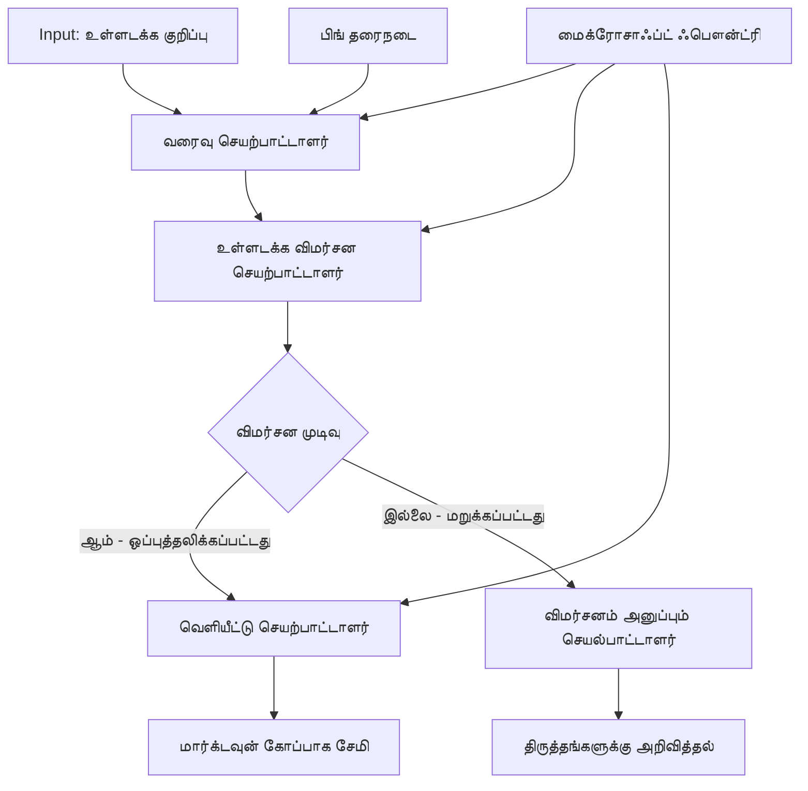

# 🔀 Microsoft Foundry (.NET) உடன் நிபந்தனைக் கூடிய முகவர் பணிமுறை நிரல்கள்

## 📋 புத்திசாலி முடிவு-அடிப்படையிலான பணிமுறை பயிற்சி

இந்த நோட்புக் Microsoft Foundry மற்றும் Microsoft Agent Framework for .NET பயன்படுத்தி **நிபந்தனைக் கூடிய பணிமுறை மாதிரிகள்** யை காட்டுகிறது. AI பகுப்பாய்வு, வணிக விதிகள் மற்றும் இயக்கநிலை சூழல்களின் அடிப்படையில் அறிவுடன் செயலாக்கத்தை வழிமாற்ற கூடிய அதிரடியான, முடிவெடுக்கும் பணிமுறைகள் உருவாக்க எப்படி என்பதை நீங்கள் கற்றுக் கொள்வீர்கள், நிறுவன தரம் கொண்ட தானுயிர்ப்பு அமைப்பிற்காக.

## 🎯 கற்றல் நோக்கங்கள்

### 🧠 **புத்திசாலி முடிவு வடிவமைப்பு**
- **நிபந்தனைக் கணினி நடைமுறைபடுத்தல்**: பல கிளைச்சிறுகுற இடங்கள் கொண்ட சிக்கலான முடிவு மரங்களை உருவாக்கவும்
- **AI-சக்தி வாய்ந்த வழிமாற்றம்**: Microsoft Foundry மாதிரிகளைப் பயன்படுத்தி அறிவுடைமை நிலையான வழிமாற்ற முடிவுகளை எடுக்கவும்
- **சுழற்சி நேர பரிசோதனை மற்றும் சூழல்களின் அடிப்படையில் பணிமுறை பழகல்**: இயக்கநிலை பகுப்பாய்வு மற்றும் சூழல்களின் அடிப்படையில் பணிமுறை நடத்தை மாற்றவும்
- **நிறுவன விதி ஒருங்கிணைப்பு**: பணிமுறைகளில் வணிக தத்துவம் மற்றும் கடைபிடிப்பு தேவைகளை இணைக்கவும்

### 🔀 **மேம்பட்ட நிபந்தனைக் கூறுகள்**
- **பல-வழிகாட்டுதல் முடிவு எடுப்பது**: வழிமாற்ற முடிவுகளுக்கான பல காரணி மதிப்பீடு
- **சுற்றுச்சூழல் அறிந்த செயலாக்கம்**: பணிமுறை முன்னேற்ற மற்றும் வரலாற்றின் அடிப்படையில் முடிவுகளை எடுக்கவும்
- **தானாக பணிமுறை மாற்றங்கள்**: நேரடியான கட்டமைப்பு வாரியான சூழல்களின் அடிப்படையில் செயலாக்க பாதைகளை அமைக்கவும்
- **விதி இயந்திர ஒருங்கிணைப்பு**: பணிமுறைகளில் மேம்பட்ட வணிக விதி இயந்திரங்களை நடைமுறைப்படுத்தவும்

### 🏢 **நிறுவன நிபந்தனைக் கூடிய பயன்பாடுகள்**
- **ஆவண வகைப்பாடு & வழிமாற்றம்**: ஆவணங்களை தானாக வகைப்படுத்தி, பொருத்தமான பணிமுறைகளுக்கு வழிமாற்றம்
- **வாடிக்கையாளர் சேவை உடனடி தொட்டல்**: வாடிக்கையாளர் விசாரணைகளை அதிரடியான செயல்திறன் குழுக்களுக்கு அறிவுடைமை வழிமாற்றம்
- **கடற்பாடு & அபாய செயலாக்கம்**: அபாய மதிப்பீட்டின் அடிப்படையில் வேறுபட்ட சரிபார்க்கும் மற்றும் விமர்சன செயல்முறைகளைப் பயன்படுத்துதல்
- **தர நன்மை பணிமுறைகள்**: தர அளவுகோல்களின் அடிப்படையில் பொருத்தமான விமர்சன செயல்முறைகளுக்கு உள்ளடக்கத்தை வழிமாற்றவும்

## ⚙️ முன்னுப்பயிற்சி மற்றும் அமைப்பு

### 📦 **தேவை NuGet தொகுப்புகள்**

நிபந்தனைக் கூடிய பணிமுறை செயலாக்கத்திற்கு மேம்பட்ட தொகுப்புக்கள்:

```xml
<!-- Core AI Framework -->
<PackageReference Include="Microsoft.Extensions.AI" Version="9.9.0" />

<!-- Azure AI Agents with Persistent State -->
<PackageReference Include="Azure.AI.Agents.Persistent" Version="1.2.0-beta.5" />

<!-- Azure Identity and Utilities -->
<PackageReference Include="Azure.Identity" Version="1.15.0" />
<PackageReference Include="System.Linq.Async" Version="6.0.3" />
<PackageReference Include="DotNetEnv" Version="3.1.1" />

<!-- Local Workflow Framework References -->
<!-- Microsoft.Agents.Workflows.dll - Advanced workflow orchestration -->
<!-- Microsoft.Agents.AI.AzureAI.dll - Microsoft Foundry integration -->
<!-- Microsoft.Agents.AI.dll - Core agent abstractions -->
```

### 🔑 **Microsoft Foundry அமைப்பு**

**தேவைப்படும் Azure வளங்கள்:**
- நிபந்தனைக் கூடிய செயலாக்க மாதிரிகள் கொண்ட Microsoft Foundry பணிப்பகுதி
- சரியான கணினி அட்டவணைகளும் அனுமதிகளும் கொண்ட Azure சந்தா
- முடிவு எடுக்கும் மற்றும் உள்ளடக்க பகுப்பாய்வு ஏஐ மாதிரிகள்
- (விருப்பம்) தர அடிப்படையமைக்கும் Bing Search API இணைப்பு

**சுற்றுச்சூழல் அமைப்பு (.env கோப்பு):**
```env
# Microsoft Foundry Configuration
AZURE_AI_PROJECT_ENDPOINT=https://your-project.cognitiveservices.azure.com/
BING_CONNECTION_ID=your-bing-connection-id
```

**அங்கீகாரம் அமைப்பு:**
```csharp
// Azure CLI or Managed Identity authentication
using Azure.Identity;
var credential = new AzureCliCredential();

// Load environment configuration
DotNetEnv.Env.Load("../../../.env");
```

### 🏗️ **நிபந்தனைக் கூடிய பணிமுறை வடிவமைப்பு**



**முக்கிய கூறுகள்:**
- **வரைவுக் கையெழுத்து செயற்பாட்டாளர்**: வடிவமைப்பிலிருந்து முதற் உள்ளடக்க வரைவுகளை உருவாக்கும் ஏஐ முகவர்
- **உள்ளடக்கு விமர்சகர் செயற்பாட்டாளர்**: வரைவின் தரம் மற்றும் கடைபிடிப்பை மதிப்பிடும் ஏஐ முகவர்
- **நிபந்தனை வழிமாற்று**: விமர்சன முடிவுகளின் அடிப்படையில் வழிமாற்றும் தீர்மான வியூகங்கள்
- **வெளியீடு/விமர்சன பாதைகள்**: ஏற்றுக்கொள்ளப்பட்ட மற்றும் நிராகரிக்கப்பட்ட உள்ளடக்கத்திற்கான தனித்து செயலாக்க பாதைகள்
- **நிலை மேலாண்மை**: பணிமுறை முழுவதும் உள்ளடக்கும் மற்றும் விமர்சன சூழலை பராமரிக்கிறது

## 🎨 **நிபந்தனைக் கூடிய பணிமுறை வடிவமைப்பு மாதிரிகள்**

### 📋 **தரக் கதவுகளுடன் உள்ளடக்க உற்பத்தி**
```
Outline → Draft Creation → Quality Review → {Approve: Publish | Reject: Revise}
```

### 🎯 **ஆபத்து அடிப்படையிலான ஆவண செயலாக்கம்**
```
Document → Risk Assessment → {Low: Standard | High: Enhanced Review}
```

### 🔍 **புத்திசாலியான வாடிக்கையாளர் சேவை வழிமாற்று**
```
Customer Query → Analysis → {Simple: FAQ Bot | Complex: Human Agent}
```

### 💼 **கடற்பாடு-மையமான பணிமுறைகள்**
```
Content → Compliance Check → {Pass: Publish | Fail: Legal Review}
```

## 🏢 **நிறுவன நிபந்தனைக் கூடிய நன்மைகள்**

### 🎯 **புத்திசாலி தானியங்கி**
- **அறிவுமிகு தீர்மான எடுப்பது**: உள்ளடக்கத்தின் பகுப்பாய்வு மற்றும் சூழலின் அடிப்படையில் ஏஐ இயக்கிய வழிமாற்ற முடிவுகள்
- **அனுகூல செயலாக்கம்**: மாறும் சூழல்களின் அடிப்படையில் தானாகவே பணிமுறைகள் ஒழுங்குபடுத்தப்படுகின்றன
- **வணிக விதி அமலாக்கம்**: சிக்கலான வணிக தத்துவங்கள் மற்றும் கொள்கைகளின் தானியங்கி பொருத்தம்
- **சுற்றுச்சூழல் விழிப்புணர்வு வழிமாற்றம்**: முழு பணிமுறை வரலாறு மற்றும் சேர்க்கப்பட்ட சூழலின் அடிப்படையில் முடிவுகள்

### 📈 **செயல்பாட்டு நுண்ணறிவு**
- **முன்னுரிமைப்படுத்தப்பட்ட வள ஒதுக்கீடு**: மிக பொருத்தமான நிபுணர்களுக்கும் செயல்களுக்கும் பணியை வழிமாற்றம்
- **கைக்குறிக்கு குறைந்தல்**: தானியங்கி முடிவெடுப்பதால் மனித வழிமாற்றம் தேவையை குறைக்கிறது
- **விரைவான தீர்வு நேரங்கள்**: பொருத்தமான நிபுணத்துவம் மற்றும் செயலாக்க திறனுக்கு நேரடி வழிமாற்றம்
- **ஒட்டுமொத்த அமலாக்கத்தில் ஒருவேளை**: வணிக விதிகள் மற்றும் தீர்மான அளவுகோல்களின் ஒரே மாதிரியாக பயன்பாடு

### 🛡️ **ஆபத்து மேலாண்மை மற்றும் கடற்பாடு**
- **தானியங்கி ஆபத்து மதிப்பீடு**: உள்ளடக்க மற்றும் சூழல் ஆபத்து நிலைகளின் ஏஐ இயக்கிய மதிப்பீடு
- **கடற்பாடு அமலாக்கம்**: தேவையான சட்ட வரிசை செயல்முறைகள் வழியாக தானியங்கி வழிமாற்றம்
- **பாதுகாப்பு நெறிமுறை விளைவு**: ஆபத்து மதிப்பீடின் அடிப்படையில் மேம்படுத்தப்பட்ட பாதுகாப்பு நடவடிக்கைகள்
- **ஆடிட் தடம் பராமரிப்பு**: வழிமாற்ற முடிவுகள் மற்றும் காரணத்தின் முழுமையான ஆவணப்படுத்தல்

### 📊 **பகுப்பாய்வு மற்றும் தொடர்ச்சியான மேம்பாடு**
- **தீர்மான பகுப்பாய்வு**: வழிமாற்ற முடிவுகளின் திறமையும் துல்லியத்தையும் பின்தொடர்ச்சி செய்கிறது
- **மாதிரி கண்டறிதல்**: வழிமாற்ற முடிவுகளில் நேரக்கோட்டில் போக்குகளையும் மாதிரிகளையும் அடையாளங்காணுதல்
- **செயல்திறன் மேம்பாடு**: தீர்மான அளவுகோள்களின் மற்றும் வழிமாற்ற செயல்திறன் தொடர்ச்சியான மேம்பாடு
- **வணிக நுண்ணறிவு**: உள்ளடக்க பணிகளின் பண்புகள் மற்றும் செயலாக்க தேவைகளில்洞察ம்

### 🔧 **தொழில்நுட்ப சிறந்த படி**
- **நிலையான நிலை மேலாண்மை**: பணிமுறை செயலாக்கத்தை தாண்டி சிக்கலான நிலையை பராமரிக்கவும்
- **வளரக்கூடிய வடிவமைப்பு**: அதிக தொகை நிபந்தனைக் கூடிய செயலாக்க தேவைகளை கையாளவும்
- **ஒன்றிணைப்புச் சாத்தியங்கள்**: உள்ளமைவு வணிக அமைப்புகளுடனும் செயல்முறைகளுடனும் மென்மையான ஒன்றிணைப்பு
- **பின்தொடர்ச்சியும் கவனக்காணலும்**: பணிமுறை செயல்திறன் மற்றும் முடிவுகளின் முழுமையான கண்காணிப்பு

.NET உடன் புத்திசாலி, முடிவெடுக்கக்கூடிய நிறுவன பணிமுறைகளை உருவாக்குவோம்! 🚀

## 💻 குறியீட்டை இயக்கல்

முழுமையான நடைமுறை `04.dotnet-agent-framework-workflow-aifoundry-condition.cs` இல் கிடைக்கிறது. இது **தரக் கதவுகளுடன் உள்ளடக்க உற்பத்தி பணிமுறை**யை காட்டுகிறது:

### 🏗️ **பணிமுறை வடிவமைப்பு**

```
Content Outline → Draft Creation → Quality Review → Conditional Routing:
                                                      ├─ Approved (>200 words) → Publish
                                                      └─ Rejected (<200 words) → Review Notification
```

**பணிமுறையில் உள்ள முகவர்கள்:**
1. **Evangelist முகவர்**: Bing தர அடிப்படையுடன் உருவாக்கப்பட்ட வடிவமைப்பிலிருந்து பயிற்சி வரைபடங்களை உருவாக்குவது
2. **உள்ளடக்கு விமர்சகர் முகவர்**: வரைபடத்தின் தரத்தை (படிப்படைகணக்கீடு, முழுமை) மதிப்பிடுகிறது
3. **பதிப்பாளர் முகவர்**: நேர அடையாளம் பெற்ற Markdown கோப்புகளை உறுதிப்படுத்தப்பட்ட உள்ளடக்கமாக சேமிக்கிறது

**தனித்துவ செயற்பாட்டாளர்கள்:**
1. **DraftExecutor**: வரைபட உருவாக்கத் திட்டமிடும்
2. **ContentReviewExecutor**: தர மதிப்பீட்டை செய்கிறது
3. **PublishExecutor**: அங்கீகாரம் பெற்ற உள்ளடக்க வெளியீட்டை கையாள்கிறது
4. **SendReviewExecutor**: நிராகரிக்கப்பட்ட உள்ளடக்க அறிவிப்புகளை பராமரிக்கிறது

### 🚀 எடுத்துக்காட்டு இயக்குதல்

**முன்னுப்பயிற்சிகள்:**
- Microsoft Foundry பணிப்பகுதி அமைக்கப்பட்டுள்ளது
- Azure CLI அங்கீகாரம் (`az login`)
- (விருப்பம்) தர அடிப்படையமைக்கும் Bing Search இணைப்பு

```bash
# ஸ்கிரிப்டை செயல்படுத்தக்கூடியதாக மாற்றுக (Unix/Linux/macOS)
chmod +x 04.dotnet-agent-framework-workflow-aifoundry-condition.cs

# நிபந்தனைக் கடவுச்செலுத்தலை இயக்குக
./04.dotnet-agent-framework-workflow-aifoundry-condition.cs
```

அல்லது விண்டோசில்:
```powershell
dotnet run 04.dotnet-agent-framework-workflow-aifoundry-condition.cs
```

### 📝 எதிர்பார்க்கப்படும் வெளியீடு

பணிமுறை:
1. **முகவர்கள் உருவாக்குதல்**: மூன்று विशेषज्ञ Microsoft Foundry முகவர்களை ஆரம்பி்கும்
2. **வரைவுக் கலைப்படைப்பு**: Evangelist முகவர் வடிவமைப்பிலிருந்து பயிற்சி வரைபடத்தை உருவாக்கும்
3. **உள்ளடக்க விமர்சனம்**: உள்ளடக்கு விமர்சகர் வரைபட தரத்தை மதிப்பிடுதல்
4. **நிபந்தனை வழிமாற்று**:
   - **அங்கீகாரம் பெற்றால் (>200 வார்த்தைகள்)**: வெளியீட்டு செயற்பாட்டாளர் Markdown கோப்பாக சேமிக்கும்
   - **நிராகரிக்கப்பட்டால் (<200 வார்த்தைகள்)**: விமர்சனை அறிவிப்பு அனுப்புதல்
5. **முடிவுகளை காட்சி செய்வது**: இறுதி பணிமுறை விளைவைக் காண்பித்தல்

### 🔧 தனிப்பயன் விருப்பங்கள்

**விமர்சன அடிப்படைகளை மாற்றுதல்:**
```csharp
const string ContentReviewerInstructions = @"
You are a content reviewer...
1. Check if content is more than 500 words (instead of 200)
2. Verify technical accuracy
3. Ensure proper formatting
...";
```

**மேலும் நிபந்தனை பாதைகளை சேர்க்கவும்:**
```csharp
var workflow = new WorkflowBuilder(draftExecutor)
    .AddEdge(draftExecutor, contentReviewerExecutor)
    .AddEdge(contentReviewerExecutor, publishExecutor, condition: GetCondition("Excellent"))
    .AddEdge(contentReviewerExecutor, editExecutor, condition: GetCondition("Good"))
    .AddEdge(contentReviewerExecutor, sendReviewerExecutor, condition: GetCondition("Poor"))
    .Build();
```

**உள்ளடக்கு தேவைகளில் மாற்றங்கள்:**
```csharp
string OUTLINE_Content = @"
# Your Custom Topic
## Section 1
https://your-reference-url
## Section 2
...
";
```

### 🎯 நிஜ உலகப் பயன்பாடுகள்

இந்த நிபந்தனைக் கூடிய பணிமுறை மாதிரி சிறந்தது:
- **உள்ளடக்க மேலாண்மை அமைப்புகள்**: தரக் கதவுகளுடன் தானாக இயக்கப்படும் ஆசிரிய பணிமுறைகள்
- **ஆவணம் செயலாக்கம்**: வகைப்படுத்தல் மற்றும் கடற்பாடின் அடிப்படையில் ஆவணங்களை வழிமாற்று
- **வாடிக்கையாளர் ஆதரவு**: சிக்கல் மற்றும் அவசர நிலை அடிப்படையிலான அறிவூட்டிய டிக்கெட் வழிமாற்று
- **சட்டப்பூர்வ விமர்சனம்**: ஆபத்து மதிப்பீடு மற்றும் மதிப்பின் அடிப்படையில் ஒப்பந்தங்களை வழிமாற்று
- **HR செயல்முறைகள்**: பொருத்தமான திருத்த பணிமுறைகளின் வழியாக விண்ணப்பங்களை வழிமாற்று

### 🔍 நிபந்தனை கூடிய கணினியைப் புரிதல்

**நிபந்தனை செயல்பாடு:**
```csharp
public Func<object?, bool> GetCondition(string expectedResult) =>
    reviewResult => reviewResult is ReviewResult review && review.Result == expectedResult;
```

இந்த செயல்பாடு பின்வரும் செயலை செய்யும்:
1. முடிவு `ReviewResult` வகைக்கு சேர்ந்ததா என பார்க்கிறது
2. எதிர்பார்க்கப்பட்ட மதிப்புடன் `Result` பண்பை ஒப்பிடுகிறது
3. வழிமாற்றுவதை தீர்மானிக்க உண்மையா/பொய்யா என்று திருப்பி தருகிறது

**நிபந்தனைகள் கொண்ட பணிமுறை முனைகள்:**
```csharp
.AddEdge(contentReviewerExecutor, publishExecutor, condition: GetCondition("Yes"))
.AddEdge(contentReviewerExecutor, sendReviewerExecutor, condition: GetCondition("No"))
```

### 📊 மேம்பட்ட அம்சங்கள்

**JSON சித்திரம் சரிபார்த்தல்:**
பணிமுறை வரைநிலை பதில்களை உறுதிசெய்வதற்கு JSON சித்திரங்களைப் பயன்படுத்துகிறது:

```csharp
// Define response structure
public class ReviewResult
{
    [JsonPropertyName("review_result")]
    public string Result { get; set; } = string.Empty;
    
    [JsonPropertyName("reason")]
    public string Reason { get; set; } = string.Empty;
    
    [JsonPropertyName("draft_content")]
    public string DraftContent { get; set; } = string.Empty;
}

// Apply to agent
ResponseFormat = ChatResponseFormat.ForJsonSchema(
    AIJsonUtilities.CreateJsonSchema(typeof(ReviewResult)), 
    "ReviewResult", 
    "Review Result From DraftContent"
)
```

**Bing தர அடிப்படையுடன் ஒருங்கிணைப்பு:**
Evangelist முகவர் நேரடி தகவலுக்கு Bing தர அடிப்படையைப் பயன்படுத்துகிறது:

```csharp
var bingGroundingConfig = new BingGroundingSearchConfiguration(bing_conn_id);
BingGroundingToolDefinition bingGroundingTool = new(
    new BingGroundingSearchToolParameters([bingGroundingConfig])
);
```

இதனால் முகவர் வடிவமைப்பில் உள்ள URLகளை பின்பற்றி தற்போதைய தகவலை எடுக்க முடியும்.

### 🛡️ பிழை கையாளல்

பணிமுறையில் நிராகரிக்கப்பட்ட உள்ளடக்கத்திற்கு வலுவான பிழை கையாளல் உள்ளது:
- விமர்சன தோல்விகள் மாற்ற பாதையை தொடங்கும்
- அறிவிப்புகள் தெளிவான நிராகரிப்பு காரணங்களை வழங்கும்
- உள்ளடக்கம் திருத்தத்திற்கு பாதுகாக்கப்படுகிறது

### 🔄 பணிமுறையை விரிவாக்குதல்

**திருத்த மடலைச் சேர்க்கவும்:**
தானாக உள்ளடக்கத்தை மறுவரைவது மற்றும் பின்னூட்ட மடலை உருவாக்குங்கள்:

```csharp
.AddEdge(contentReviewerExecutor, publishExecutor, condition: GetCondition("Yes"))
.AddEdge(contentReviewerExecutor, draftExecutor, condition: GetCondition("No")) // Loop back
```

**பல-அளவிலான விமர்சனத்தை நடைமுறைப்படுத்தவும்:**
பல விமர்சன நிலைகளை வேறுவிதமான அளவுகோல்களுடன் சேர்க்கவும்:

```csharp
.AddEdge(draftExecutor, technicalReviewer)
.AddEdge(technicalReviewer, editorialReviewer, condition: GetCondition("TechPass"))
.AddEdge(editorialReviewer, publishExecutor, condition: GetCondition("EditPass"))
```

இந்த நிபந்தனைக் கூடிய பணிமுறை மாதிரி சிக்கலான, புத்திசாலி நிறுவன தானியங்கி அமைப்புகளை கட்டமைப்பதற்காக அடிப்படையை வழங்குகிறது! 🚀

---

<!-- CO-OP TRANSLATOR DISCLAIMER START -->
**மறுப்பு**:
இந்த ஆவணம் AI மொழிபெயர்ப்பு சேவை [Co-op Translator](https://github.com/Azure/co-op-translator) பயன்படுத்தி மொழிபெயர்க்கப்பட்டுள்ளது. நாங்கள் துல்லியத்திற்காக முயற்சி செய்துள்ளோம், ஆனால் தானாக செய்யப்படும் மொழிபெயர்ப்புகளில் பிழைகள் அல்லது தவறுகள் இருக்கலாம் என்பதை கவனத்தில் கொள்ளவும். அசல் ஆவணம் அதன் தாய்மொழியில் அதிகாரப்பூர்வ ஆதாரமாக கருதப்பட வேண்டும். முக்கியமான தகவல்களுக்கு, தொழில்நுட்பமான மனித மொழிபெயர்ப்பு பரிந்துரைக்கப்படுகிறது. இந்த மொழிபெயர்ப்பைப் பயன்படுத்துவதால் ஏற்படும் எந்த தவறான புரிதல்கள் அல்லது தவறான விளக்கத்திற்கும் நாங்கள் பொறுப்பில்வில்லை.
<!-- CO-OP TRANSLATOR DISCLAIMER END -->