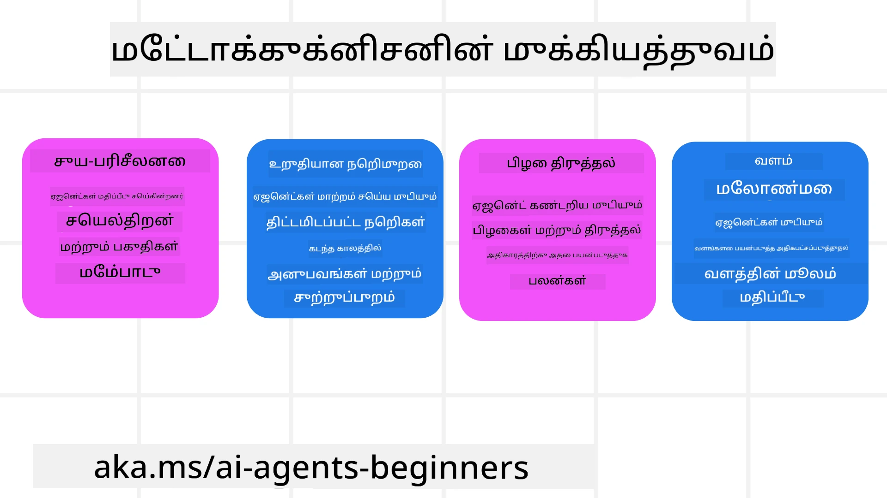
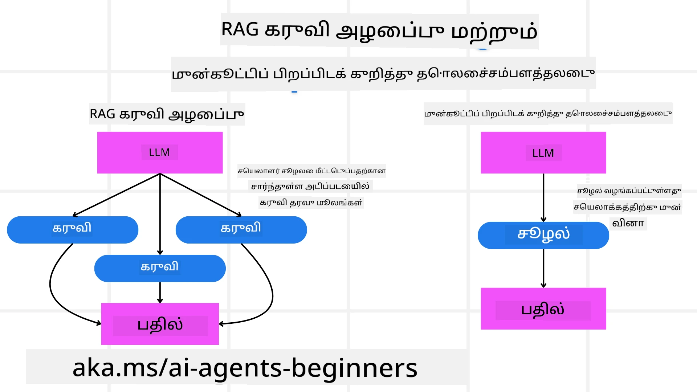

[](https://youtu.be/His9R6gw6Ec?si=3_RMb8VprNvdLRhX)

> _(இந்த பாடத்தின் வீடியோவை காண மேலுள்ள படத்தை அழுத்தவும்)_
# எய்ஐ நிர்வாகிகளில் மேட்டகவுணிசன்ஸ்

## அறிமுகம்

எய்ஐ நிர்வாகிகளில் மேட்டகவுணிசன்ஸ் பற்றி இந்த பாடத்திற்கு வரவேற்கிறோம்! இந்த அத்தியாயம், எய்ஐ நிர்வாகிகள் தங்கள் சொந்த எண்ணும் செயல்முறையை பற்றி எப்படி யோசிக்க முடியும் என்பதில் ஆர்வமுள்ள தொடக்கக்காரர்களுக்காக வடிவமைக்கப்பட்டுள்ளது. இந்த பாடத்தை முடித்ததும், நீங்கள் முக்கிய கருத்துக்களை புரிந்து கொள்ளப்போகிறீர்கள் மற்றும் மேட்டகவுணிசன்ஸை எய்ஐ நிர்வாகி வடிவமைப்பில் பயன்படுத்துவதற்கான நடைமுறை உதாரணங்களுடன் பரிமாறப்படும்.

## கற்றல் இலக்குகள்

இந்த பாடத்தை முடித்தபின், நீங்கள்:

1. நிர்வாகி வரையறைகளில் யூகத் தொடர்களின் விளைவுகளை புரிந்து கொள்வீர்கள்.
2. சுய திருத்த ஹொழுக்களை உதவியுடன் திட்டமிடல் மற்றும் மதிப்பீடு நுட்பங்களை பயன்படுத்துவீர்கள்.
3. பணிகளை நிறைவேற்ற குறியீட்டை கையாள முடியும் என உங்கள் சொந்த நிர்வாகிகளை உருவாக்குவீர்கள்.

## மேட்டகவுணிசன்ஸுக்கு அறிமுகம்

மேட்டகவுணிசன்ஸ் என்பது ஒருவரது தன்னுடைய யோசனை பற்றி யோசிக்கும் உயர் நிலை அறிவுத்திறன்கள் செயல்முறைகள் ஆகும். எய்ஐ நிர்வாகிகளுக்கு, இதன் பொருள், தன்னுணர்வு மற்றும் கடந்த அனுபவங்களை அடிப்படையாக கொண்டு தங்கள் செயல்களை மதிப்பாய்வு செய்து சரிசெய்ய இயலும்தாகும். "யோசனை பற்றி யோசித்தல்" எனப்படும் மேட்டகவுணிசன்ஸ் என்பது நிர்வாகியான எய்ஐ அமைப்புகளின் வளர்ச்சியில் ஒரு முக்கியக் கருத்தாக இருக்கிறது. இது எய்ஐ அமைப்புகள் தங்களின் உள்ளக செயல்முறைகளை அறிந்து கொண்டு, தங்களின் நடத்தையை கண்காணித்து, ஒழுங்குபடுத்து, சரிசெய்யும் திறனுடன் இருக்க வேண்டும் என்பதைக் குறிக்கிறது. நாம் ஒரு அறையை படிக்கும் போது அல்லது ஒரு பிரச்சனையை பார்த்தால் செய்யும் பழக்கமோ அதே போல. இந்த தன்னுணர்வு, எய்ஐ அமைப்புகளை சிறந்த முடிவுகளை எடுக்க, பிழைகளை கண்டறிதல் செய்ய மற்றும் காலத்துடன் செயல்திறனை மேம்படுத்த உதவுகிறது - இதுவும் திரிங் சோதனை மற்றும் எய்ஐ மேலாண்மை தொடர்பான விவாதங்களை மீண்டும் இணைக்கின்றது.

நிர்வாகியான எய்ஐ அமைப்புகளின் சூழலில், மேட்டகவுணிசன்ஸ் பல சவால்களை சமாளிக்க உதவுகிறது, உதாரணமாக:
- வெளிப்படைத்தன்மை: எய்ஐ அமைப்புகள் தங்கள் கருதுநிலை மற்றும் முடிவுகளை விளக்க இயல வேண்டும்.
- யோசனை: தகவலை தொகுத்து, நம்பகமான முடிவுகளை எடுக்க எய்ஐ அமைப்புகளின் திறனை மேம்படுத்தல்.
- ஒழுங்குபாடு: புதிய சூழல்களுக்கு மற்றும் மாறும் நிலைமைகளுக்கு எய்ஐ அமைப்புகள் தைரியமாக மாறுதல் செய்ய இயல வேண்டும்.
- உணர்வு: சுற்றுப்பாதை தரவுகளை சரியாக அடையாளம் காணவும் மற்றும் பொருள் புரிந்து கொள்ளவும் எய்ஐ அமைப்புகளின் துல்லியத்தை மேம்படுத்தல்.

### மேட்டகவுணிசன்ஸ் என்பது என்ன?

மேட்டகவுணிசன்ஸ், அல்லது "யோசனை பற்றி யோசித்தல்," என்பது ஒருவரது அறிவாற்றல் செயல்முறைகளை தன்னுணர்வு மற்றும் தன்னியற்ற வழியில் ஒழுங்குபடுத்தும் உயர் நிலை அறிவுத்திறன் ஆகும். எய்ஐ துறையில், மேட்டகவுணிசன்ஸ், நிர்வாகிகளுக்கு தங்கள் ஒழுங்குமுறை மற்றும் செயல்களை மதிப்பாய்வு செய்து தழுவும் மற்றும் தங்களின் தீர்மான முறைமைகளை தகுந்தபடி மாற்றும் திறன் வழங்குகிறது, இது பிரச்சனை தீர்க்கும் மற்றும் முடிவெடுக்கும் திறனை மேம்படுத்துகிறது. மேட்டகவுணிசன்ஸ் புரிந்துகொண்டு, நீங்கள் அதிக அறிவும், அதிக ஒழுங்குமாற்றமும் மற்றும் திறமையான எய்ஐ நிர்வாகிகளை வடிவமைக்க முடியும். உண்மையான மேட்டகவுணிசன்ஸ் என்றால், எய்ஐ தன் சொந்த கருதுக்களை வெளிப்படையாக ஆராய்ந்து பார்க்கிறது.

உதாரணம்: “நான் குறைந்த விலை விமானங்களை முன்னுரிமை கொடுத்தேன் ஏனெனில்… நேரடி விமானங்களை தவறவிட்டிருக்கலாம், எனவே நான் மீண்டும் பரிசீலனை செய்கிறேன்.”.
எதற்கு சிறப்பு பாதையைத் தேர்ந்தெடுத்தது என்பதை கண்காணித்தல்.
- கடந்த முறையிலான பயனர் விருப்பங்களை அதிகமாக நம்பி பிழைகள் செய்துள்ளது என்பதைக் கவனித்தல், எனவே முடிவெடுக்கும் முறையை மட்டும் அல்ல, இறுதி பரிந்துரையை இல்லாமல் மாற்றுகிறது.
- மாத்திரை கண்டறிதல்கள், “பயனர் ‘மிகவும் கூட்டமாக’ என்றால, சில காணச் செல்லும் இடங்களை நீக்கவேண்டும்; மேலும் ‘சிறந்த இடங்கள்’ தேர்வு முறையும் பிரச்சனைகள் உள்ளதா என்பது அடையாளம் காண வேண்டும், ஏனெனில் நான் எப்போதும் பிரபலத்தைக் கருதி வரிசையிற்க்கிறேன்.” போன்றவை.

### எய்ஐ நிர்வாகிகளுக்கு மேட்டகவுணிசன்ஸின் முக்கியத்துவம்

மேட்டகவுணிசன்ஸ் எய்ஐ நிர்வாகி வடிவமைப்பில் பல காரணங்களால் முக்கிய பங்காற்றுகிறது:



- சுய பிரதிபலிப்பு: நிர்வாகிகள் தங்களின் செயல்திறனை மதிப்பாய்வு செய்து மேம்படுத்துவதற்கான இடங்களை கண்டறியும்.
- ஒழுங்கு மாறுதல்: கடந்த அனுபவங்கள் மற்றும் மாறும் சூழல்களை அடிப்படையாக கொண்டு தங்கள் உத்திகள் மாற்றலாம்.
- பிழை திருத்தம்: நிர்வாகிகள் தானாகவே பிழைகளை கண்டறிந்து சரிசெய்யும் திறன் பெற்றுள்ளார்கள், அதன் மூலம் அதிக துல்லியமான முடிவுகள் வரும்.
- வள மேலாண்மை: நேரம் மற்றும் கணினி சக்தி போன்ற வளங்களை திட்டமிட்டு மதிப்பாய்வு செய்து சிறப்பாக பயன்படுத்த முடியும்.

## ஒரு எய்ஐ நிர்வாகியின் பகுதிகள்

மேட்டகவுணிசன்ஸ் செயல்முறைகளில் நுழையுமுன், ஒரு எய்ஐ நிர்வாகியின் அடிப்படைக் கூறுகள் புரிந்துகொள்வது அவசியம். ஒரு எய்ஐ நிர்வாகி பொதுவாக கொண்டிருக்கும்:

- பண்புத்தன்மை: பயனர்களுடன் எவ்வாறு தொடர்பு கொள்வது என்பதைக் குறிக்கும் நிர்வாகியின் தனிமை மற்றும் பண்புகள்.
- கருவிகள்: நிர்வாகி செய்யக்கூடிய திறன்கள் மற்றும் செயல்பாடுகள்.
- திறன்கள்: நிர்வாகி உடைய அறிவும் நிபுணத்துவமும்.

இவை ஒன்றாக சேர்ந்து ஒரு "நிபுணத்துவ அலகை" உருவாக்கி குறிப்பிட்ட பணிகளை செய்யும்.

**உதாரணம்**:
உங்கள் விடுமுறையை திட்டமிடும் மட்டும் அல்ல, நேரடி தரவுகளும் கடந்த பயண அனுபவங்களையும் அடிப்படையாக கொண்டு பாதையை கண்காணித்து மாற்றும் பயண நிர்வாகியை எண்ணுங்கள்.

### உதாரணம்: ஒரு பயண நிர்வாகி சேவையில் மேட்டகவுணிசன்ஸ்

நீங்கள் ஒரு எய்ஐ இயந்திரமான பயண நிர்வாகி சேவையை வடிவமைக்கிறீர்கள் என்று கற்பனை செய்க. இந்த நிர்வாகி, "பயண நிர்வாகி", பயனர்களுக்கு அவர்களுடைய விடுமுறை திட்டமிட உதவுகின்றது. மேட்டகவுணிசன்ஸை உட்படுத்த, பயண நிர்வாகி தன்னுணர்வு மற்றும் கடந்த அனுபவங்களை அடிப்படையாக கொண்டு தன் செயல்களை மதிப்பாய்வு செய்து மாற்ற வேண்டும். மெட்டகவுணிசன்ஸ் எவ்வாறு பங்கு வகிக்க முடியும் என்பது இதோ:

#### தற்போதைய பணி

பயனாருக்கு பாரிஸுக்கு ஒரு பயணம் திட்டமிட உதவுவது.

#### பணி முடிப்பதற்கான படிகள்

1. **பயனர் விருப்பங்களை சேகரித்தல்**: பயனர் பயண திகதிகள், பட்ஜெட், ஆர்வங்கள் (எ.கா., அருங்காட்சியங்கள், உணவு, ஷாப்பிங்) மற்றும் எந்தவொரு குறிப்பிட்ட தேவைகள் குறித்து கேட்கவும்.
2. **தகவல் பெறுதல்**: பயனர் விருப்பங்களுக்கு ஏற்ப விமான விருப்பங்கள், தங்கும் இடங்கள், பொழுதுபோக்கு இடங்கள் மற்றும் உணவகங்கள் தேடினல்.
3. **பரிந்துரைகளை உருவாக்குதல்**: விமான விவரங்கள், ஹோட்டல் முன்பதிவுகள் மற்றும் பரிந்துரைத்த செயல்பாடுகள் கொண்ட தனிப்பட்ட பயண திட்டத்தை வழங்குதல்.
4. **பின்வினை அறிந்துகொண்டு மாற்றுதல்**: பரிந்துரைகளுக்கு பயனாரின் கருத்துக்களை கேட்டு தேவையான மாற்றங்களை செய்யல்.

#### தேவையான வளங்கள்

- விமானம் மற்றும் ஹோட்டல் முன்பதிவு தரவுத்தளங்களுக்கு அணுகல்.
- பாரிஸின் பொழுதுபோக்கு மற்றும் உணவக விபரங்கள்.
- கடந்த தொடர்புகளிலிருந்து பயனர் கருத்து தரவுகள்.

#### அனுபவங்கள் மற்றும் சுய பிரதிபலிப்பு

பயண நிர்வாகி தன் செயல்திறனை மதிப்பாய்வு செய்து கடந்த அனுபவங்களிருந்து கற்றுக்கொள்ள மேட்டகவுணிசன்ஸை பயன்படுத்துகிறது. உதாரணமாக:

1. **பயனர் கருத்தை பகுப்பாய்வு செய்தல்**: பயண நிர்வாகி, பயனரின் கருத்துகளை ஆராய்ந்து, எந்த பரிந்துரைகள் நல்ல பெறுபேறுகள் பெற்றன மற்றும் எவை பெறவில்லை என்பதை அறிந்து, எதிர்கால பரிந்துரைகளை சரிசெய்கிறது.
2. **ஒழுங்குபாடு**: பயனர் கூட்டமான இடங்கள் பிடிக்காது என முன்கூட்டியே கூறியிருந்தால், சிறந்த சுற்றுலா இடங்களை பரிந்துரைக்காது.
3. **பிழை திருத்தம்**: கடந்த முன்பதிவில் உதாரணமாக, முழு முன்பதிவு செய்யப்பட்ட ஹோட்டலை பரிந்துரைத்துவிட்டால், அது சோதனை முறைகளை மேம்படுத்தி சரியான முன்பதிவுகளையே பரிந்துரைக்க கற்றுக் கொள்கிறது.

#### நடைமுறை அமைப்பாளர் உதாரணம்

மேட்டகவுணிசன்ஸை உட்படுத்தும்போது பயண நிர்வாகியின் குறியீடு எவ்வாறு இருக்கும் என்பதற்கான எளிய உதாரணம் இதோ:

```python
class Travel_Agent:
    def __init__(self):
        self.user_preferences = {}
        self.experience_data = []

    def gather_preferences(self, preferences):
        self.user_preferences = preferences

    def retrieve_information(self):
        # விருப்பங்களுக்கு ஏற்ப விமானங்கள், விடுதிகள் மற்றும் ஈர்வுகள் தேடவும்
        flights = search_flights(self.user_preferences)
        hotels = search_hotels(self.user_preferences)
        attractions = search_attractions(self.user_preferences)
        return flights, hotels, attractions

    def generate_recommendations(self):
        flights, hotels, attractions = self.retrieve_information()
        itinerary = create_itinerary(flights, hotels, attractions)
        return itinerary

    def adjust_based_on_feedback(self, feedback):
        self.experience_data.append(feedback)
        # கருத்துக்களை பகுப்பாய்வு செய்து எதிர்கால பரிந்துரைகளை சரிசெய்க
        self.user_preferences = adjust_preferences(self.user_preferences, feedback)

# எடுத்துக்காட்டு பயன்பாடு
travel_agent = Travel_Agent()
preferences = {
    "destination": "Paris",
    "dates": "2025-04-01 to 2025-04-10",
    "budget": "moderate",
    "interests": ["museums", "cuisine"]
}
travel_agent.gather_preferences(preferences)
itinerary = travel_agent.generate_recommendations()
print("Suggested Itinerary:", itinerary)
feedback = {"liked": ["Louvre Museum"], "disliked": ["Eiffel Tower (too crowded)"]}
travel_agent.adjust_based_on_feedback(feedback)
```

#### மேட்டகவுணிசன்ஸின் முக்கியத்துவம் ஏன்?

- **சுய பிரதிபலிப்பு**: நிர்வாகிகள் தமது செயல்திறனை பகுப்பாய்வு செய்து மேம்படுத்த இடங்களை கண்டறியும்.
- **ஒழுங்குபாடு**: கருத்து கருத்துக்கள் மற்றும் மாறும் நிலைகளின் அடிப்படையில் திறன்களை மாற்ற முடியும்.
- **பிழை திருத்தம்**: பிழைகளை தானாக.detect செய்து திருத்தும் திறன்.
- **வள மேலாண்மை**: நேரம் மற்றும் கணினி சக்தி போன்ற வளங்களை சிறப்பாகப் பயன்படுத்தும் திறன்.

மேட்டகவுணிசன்ஸை உட்படுத்துவதன் மூலம், பயண நிர்வாகி தனிப்பட்ட மற்றும் துல்லியமான பயண பரிந்துரைகளை வழங்கி, முழு பயனர் அனுபவத்தை மேம்படுத்த முடியும்.

---

## 2. நிர்வாகிகளில் திட்டமிடல்


திட்டமிடல் என்பது ஏไஐ முகவரின் நடத்தை的重要மான கூறு ஆகும். இது இலக்கை அடைய தேவையான படிகள், தற்போதைய நிலை, வளங்கள் மற்றும் சாத்தியமான தடைகள் ஆகியவற்றை அமைப்பதை உட்படுத்துகிறது.

### திட்டமிடலின் கூறுகள்

- **தற்போதைய பணி**: பணியை தெளிவாக வரையறுக்கவும்.
- **பணியை முடிக்கபடுவது படிகள்**: பணியை கையாளக்கூடிய படிகளாக பிரிக்கவும்.
- **தேவையான வளங்கள்**: தேவையான வளங்களை அடையாளம் காணவும்.
- **அனுபவம்**: கடந்த அனுபவங்களை திட்டமிடலில் பயன்படுத்தவும்.

**உதாரணம்**:
பயணிகளைக் குறிக்கும் முகவர் பயணத்தை தெளிவான முறையில் திட்டமிட உதவ கீழ்க்கண்ட படிகளை எடுத்துக்கொள்ள வேண்டும்:

### பயண முகவருக்கான படிகள்

1. **பயனர் விருப்பங்களை சேகரி்க்**
   - பயண தேதி, பட்ஜெட், ஆர்வங்கள் மற்றும் குறிப்பிட்ட தேவைகள் குறித்து பயனரிடம் கேளுங்கள்.
   - உதாரணங்கள்: "நீங்கள் எப்போது பயணம் செய்ய திட்டமிட்டுள்ளீர்கள்?" "உங்கள் பட்ஜெட் வரம்பு என்ன?" "சுற்றுலாவில் நீங்கள் எந்த நடவடிக்கைகளை விரும்புகிறீர்கள்?"

2. **தகவல் பெறுதல்**
   - பயனர் விருப்பங்களின் அடிப்படையில் பொருத்தமான பயண விருப்பங்களைக் காணுங்கள்.
   - **விமானங்கள்**: பயனரின் பட்ஜெட் மற்றும் விருப்பமான பயண தேதிகளுக்குள் கிடைக்கும் விமானங்களை தேடுங்கள்.
   - **வசதிகள்**: பயனரின் இடம், விலை மற்றும் வசதிகளுக்கான விருப்பங்களை பொருந்தும் ஹோட்டல்கள் அல்லது வாடகை சொத்துகளை கண்டறியவும்.
   - **கவர்ச்சிகள் மற்றும் உணவகம்**: பயனரின் ஆர்வங்களுக்கு ஏற்ப புகழ்பெற்ற கவர்ச்சிகள், நடவடிக்கைகள் மற்றும் உணவு விருப்பங்களை அடையாளம் காணவும்.

3. **பரிந்துரை உருவாக்குதல்**
   - பெறப்பட்ட தகவல்களை தனிப்பட்ட பயணத் திட்டமாக தொகுக்கவும்.
   - விமான விருப்பங்கள், ஹோட்டல் முன்பதிவுகள் மற்றும் பரிந்துரைக்கப்படும் நடவடிக்கைகள் போன்ற விவரங்களை பகிர்ந்து பயனரின் விருப்பங்களுக்கு ஏற்ப பரிந்துரைகளை தனிப்படுத்தவும்.

4. **பயண திட்டத்தை பயனருக்கு முன்வைக்கவும்**
   - முன்மொழிந்த பயணத் திட்டத்தை பயனர் பரிசீலனைக்கு பகிரவும்.
   - உதாரணம்: "பாரிஸ் பயணத்திற்கான பரிந்துரைக்கப்பட்ட பயணத் திட்டம் இது. இதில் விமான விவரங்கள், ஹோட்டல் முன்பதிவுகள் மற்றும் பரிந்துரைக்கப்பட்ட நடவடிக்கைகள் மற்றும் உணவகங்கள் பட்டியலில் உள்ளன. உங்கள் கருத்துக்களை எனக்கு தெரிவியுங்கள்!"

5. **கருத்துக்களை சேகரிக்கவும்**
   - முன்மொழிந்த பயணத் திட்டம் குறித்து பயனரிடம் கருத்துக்களை கேளுங்கள்.
   - உதாரணங்கள்: "விமான விருப்பங்கள் உங்கள் விருப்பத்திற்கு உகந்ததா?" "ஹோட்டல் உங்கள் தேவைகளுக்கு பொருத்தமா?" "சேர்க்க அல்லது நீக்க விரும்பும் நடவடிக்கைகள் உள்ளதா?"

6. **கருத்துக்களை அடிப்படையாகக் கொண்டு சரி செய்யவும்**
   - பயனரின் கருத்துக்களின் அடிப்படையில் பயணத் திட்டத்தை மாற்றவும்.
   - பயனர் விருப்பங்களுக்கு சிறப்பாக பொருந்துவதற்காக விமானம், வசதி மற்றும் நடவடிக்கை பரிந்துரைகளில் தேவையான மாற்றங்களை செய்யவும்.

7. **இறுதி உறுதிப்படுத்தல்**
   - புதுப்பிக்கப்பட்ட பயணத் திட்டத்தை இறுதி உறுதிப்படுத்தலுக்காக பயனருக்கு வழங்கவும்.
   - உதாரணம்: "உங்கள் கருத்துக்களின் அடிப்படையில் மாற்றங்களைச் செய்துள்ளேன். இதோ புதுப்பிக்கப்பட்ட பயணத் திட்டம். அனைத்தும் சரியாயிருக்கிறதா?"

8. **முன்பதிவு செய்யவும் மற்றும் உறுதிசெய்யவும்**
   - பயனர் பயணத் திட்டத்துக்கு அங்கீகாரம் அளித்ததும், விமானங்கள், வசதிகள் மற்றும் முன்கூட்டியே திட்டமிடப்பட்ட நடவடிக்கை அனைத்தையும் முன்பதிவு செய்யவும்.
   - உறுதிப்படுத்தல் விவரங்களை பயனருக்கு அனுப்பவும்.

9. **தொடர்ந்து ஆதரவளிக்கவும்**
   - பயணத்தின் முன்பும் பயணச் சமயத்திலும் எந்தவொரு மாற்றங்களுக்காக அல்லது கூடுதல் கோரிக்கைகளுக்காக பயனருக்கு உதவ தயாராக இருங்கள்.
   - உதாரணம்: "பயணத்தின் போது மேலும் உதவி தேவைப்பட்டால், எந்த நேரமும் என்னை அணுகுங்கள்!"

### உதாரண தொடர்பு

```python
class Travel_Agent:
    def __init__(self):
        self.user_preferences = {}
        self.experience_data = []

    def gather_preferences(self, preferences):
        self.user_preferences = preferences

    def retrieve_information(self):
        flights = search_flights(self.user_preferences)
        hotels = search_hotels(self.user_preferences)
        attractions = search_attractions(self.user_preferences)
        return flights, hotels, attractions

    def generate_recommendations(self):
        flights, hotels, attractions = self.retrieve_information()
        itinerary = create_itinerary(flights, hotels, attractions)
        return itinerary

    def adjust_based_on_feedback(self, feedback):
        self.experience_data.append(feedback)
        self.user_preferences = adjust_preferences(self.user_preferences, feedback)

# ஒரு புகாரில் உள்ள உதாரண பயன்பாடு
travel_agent = Travel_Agent()
preferences = {
    "destination": "Paris",
    "dates": "2025-04-01 to 2025-04-10",
    "budget": "moderate",
    "interests": ["museums", "cuisine"]
}
travel_agent.gather_preferences(preferences)
itinerary = travel_agent.generate_recommendations()
print("Suggested Itinerary:", itinerary)
feedback = {"liked": ["Louvre Museum"], "disliked": ["Eiffel Tower (too crowded)"]}
travel_agent.adjust_based_on_feedback(feedback)
```

## 3. திருத்தும் RAG அமைப்பு

முதலில் RAG கருவி மற்றும் முன்கூட்டிய Context Load இடையிலான வேறுபாட்டை புரிந்து கொள்வோம்



### Retrieval-Augmented Generation (RAG)

RAG என்பது ஒரு தேடல் அமைப்பை உருவாக்கும் மாதிரியை இணைத்துக் கொள்கிறது. கேள்வி வந்தால், தேடல் அமைப்பு வெளியுறையிலிருந்து பொருத்தமான ஆவணங்கள் அல்லது தரவைப் பெறுகிறது, மற்றும் இந்த பெறப்பட்ட தகவல் உருவாக்கும் மாதிரிக்கு உள்ளீடாக விரிவாக்கப்படுகிறது. இதனால் மாதிரி துல்லியமான மற்றும் சூழல் தொடர்பான பதில்களை உருவாக்க உதவுகிறது.

RAG அமைப்பில், முகவர் அறிவுத்தளத்திலிருந்து பொருத்தமான தகவலைக் கொண்டு பிரித்தெடுக்கும் மற்றும் பொருத்தமான பதில்கள் அல்லது செயல்களை உருவாக்க பயன்படுத்துகிறது.

### திருத்தும் RAG அணுகுமுறை

திருத்தும் RAG அணுகுமுறை RAG தொழில்நுட்பங்களைக் கொண்டு பிழைகள் திருத்தி ஏไஐ முகவரின் துல்லியம் மேம்படுத்துவதை கவனிக்கும். இதில்:

1. **வழிகாட்டும் தொழில்**: முகவருக்கு பொருத்தமான தகவலை மீட்டெடுக்க குறிப்பிட்ட வழிகாட்டுதல்களை வழங்குதல்.
2. **கருவி**: பெற்று வந்த தகவலின் பொருத்தத்தை மதிப்பிடும் மற்றும் துல்லியமான பதில்களை உருவாக்க முகவருக்கு உதவும் கம்ப்யூட்டர் அலகுகள் மற்றும் முறைகள்.
3. **மதிப்பீடு**: முகவரின் செயல்திறனை தொடர்ந்து மதிப்பாய்வு செய்து துல்லியம் மற்றும் திறனை மேம்படுத்த மாற்றங்கள் செய்தல்.

#### உதாரணம்: தேடல் முகவரில் திருத்தும் RAG

இணையத்திலிருந்து தகவலை பெற்று பயனர் கேள்விகளுக்கு பதில் சொல்லும் தேடல் முகவரினை பரிசீலியுங்கள். திருத்தும் RAG அணுகுமுறை:

1. **வழிகாட்டும் தொழில்**: பயனர் உள்ளீட்டின் அடிப்படையில் தேடல் கேள்விகளை உருவாக்குதல்.
2. **கருவி**: இயற்கை மொழி செயலாக்கம் மற்றும் இயந்திரக் கற்றல் முறைமைகளைப் பயன்படுத்தி தேடல் முடிவுகளை தரவரிசைப்படுத்தி வடிகட்டுதல்.
3. **மதிப்பீடு**: பெற்ற தகவலில் உள்ள தவறுகளை அடையாளம் காண்பதற்கும் திருத்துவதற்கும் பயனர் கருத்துக்களை ஆய்வு செய்தல்.

### பயண முகவரில் திருத்தும் RAG

திருத்தும் RAG (Retrieval-Augmented Generation) என்பது AI விரிவான தகவலைப் பெறவும், உருவாக்கவும் மற்றும் கண்டவைகளைக் திருத்தவும் உதவுகிறது. பயண முகவர் இந்த அணுகுமுறையால் மேலும் துல்லியமான மற்றும் பொருத்தமான பயண பரிந்துரைகளை வழங்க முடியும்.

இது கீழ்காணும் அம்சங்களை உடையது:

- **வழிகாட்டும் தொழில்:** பொருத்தமான தகவலைக் மீட்டெடுக்க குறிப்பிட்ட வழிகாட்டுதல்களைப் பயன்படுத்துதல்.
- **கருவி:** பெற்று வந்த தகவலின் பொருத்தத்தை மதிப்பீடு செய்து துல்லியமான பதில்களை உருவாக்கும் செயல்முறை மற்றும் கருவிகளை நடைமுறைப்படுத்துதல்.
- **மதிப்பீடு:** முகவரின் செயல்திறனை தொடர்ந்து மதிப்பாய்வு செய்து துல்லியம் மற்றும் திறனை மேம்படுத்த மாற்றங்கள் செய்தல்.

#### பயண முகவரில் திருத்தும் RAG நடைமுறை படிகள்

1. **ஆரம்ப பயனர் தொடர்பு**
   - பயண முகவர் பயனர் இடம், பயண தேதி, பட்ஜெட் மற்றும் ஆர்வங்கள் போன்ற ஆரம்ப விருப்பங்களை சேகரிக்கிறது.
   - உதாரணம்:

     ```python
     preferences = {
         "destination": "Paris",
         "dates": "2025-04-01 to 2025-04-10",
         "budget": "moderate",
         "interests": ["museums", "cuisine"]
     }
     ```

2. **தகவல் பெற்றல்**
   - பயனர் விருப்பங்களின் அடிப்படையில் விமானங்கள், வசதிகள், கவர்ச்சிகள் மற்றும் உணவகங்கள் பற்றிய தகவலைப் பெறுதல்.
   - உதாரணம்:

     ```python
     flights = search_flights(preferences)
     hotels = search_hotels(preferences)
     attractions = search_attractions(preferences)
     ```

3. **ஆரம்ப பரிந்துரைகள் உருவாக்குதல்**
   - பெறப்பட்ட தகவலின்படி தனிப்பட்ட பயணத் திட்டம் உருவாக்குதல்.
   - உதாரணம்:

     ```python
     itinerary = create_itinerary(flights, hotels, attractions)
     print("Suggested Itinerary:", itinerary)
     ```

4. **பயனர் கருத்து சேகரித்தல்**
   - தொடக்க பரிந்துரைகள் குறித்து பயனரின் கருத்துக்களை கேட்குதல்.
   - உதாரணம்:

     ```python
     feedback = {
         "liked": ["Louvre Museum"],
         "disliked": ["Eiffel Tower (too crowded)"]
     }
     ```

5. **திருத்தும் RAG செயல்முறை**
   - **வழிகாட்டும் தொழில்**: பயனர் கருத்து அடிப்படையில் புதிய தேடல் கேள்விகளை உருவாக்குதல்.
     - உதாரணம்:

       ```python
       if "disliked" in feedback:
           preferences["avoid"] = feedback["disliked"]
       ```

   - **கருவி**: பயனர் கருத்தின் பொருத்தத்தை முன்னிலைப்படுத்தி புதிய தேடல் முடிவுகளை மதிப்பிடல் மற்றும் வடிகட்டி செயல்.
     - உதாரணம்:

       ```python
       new_attractions = search_attractions(preferences)
       new_itinerary = create_itinerary(flights, hotels, new_attractions)
       print("Updated Itinerary:", new_itinerary)
       ```

   - **மதிப்பீடு**: பயனர் கருத்துக்களை ஆய்வு செய்து பரிந்துரைகளின் பொருத்தம் மற்றும் துல்லியத்தை தொடர்ந்து மதிப்பாய்வு செய்து தேவைப்பட்ட மாற்றங்களைச் செய்யவும்.
     - உதாரணம்:

       ```python
       def adjust_preferences(preferences, feedback):
           if "liked" in feedback:
               preferences["favorites"] = feedback["liked"]
           if "disliked" in feedback:
               preferences["avoid"] = feedback["disliked"]
           return preferences

       preferences = adjust_preferences(preferences, feedback)
       ```

#### நடைமுறை உதாரணம்

இங்கே பயண முகவரில் திருத்தும் RAG அணுகுமுறையை ஒன்றிணைத்துள்ள எளிமைப்படுத்திய Python குறியீடு உள்ளது:

```python
class Travel_Agent:
    def __init__(self):
        self.user_preferences = {}
        self.experience_data = []

    def gather_preferences(self, preferences):
        self.user_preferences = preferences

    def retrieve_information(self):
        flights = search_flights(self.user_preferences)
        hotels = search_hotels(self.user_preferences)
        attractions = search_attractions(self.user_preferences)
        return flights, hotels, attractions

    def generate_recommendations(self):
        flights, hotels, attractions = self.retrieve_information()
        itinerary = create_itinerary(flights, hotels, attractions)
        return itinerary

    def adjust_based_on_feedback(self, feedback):
        self.experience_data.append(feedback)
        self.user_preferences = adjust_preferences(self.user_preferences, feedback)
        new_itinerary = self.generate_recommendations()
        return new_itinerary

# எடுத்துக்காட்டு பயன்பாடு
travel_agent = Travel_Agent()
preferences = {
    "destination": "Paris",
    "dates": "2025-04-01 to 2025-04-10",
    "budget": "moderate",
    "interests": ["museums", "cuisine"]
}
travel_agent.gather_preferences(preferences)
itinerary = travel_agent.generate_recommendations()
print("Suggested Itinerary:", itinerary)
feedback = {"liked": ["Louvre Museum"], "disliked": ["Eiffel Tower (too crowded)"]}
new_itinerary = travel_agent.adjust_based_on_feedback(feedback)
print("Updated Itinerary:", new_itinerary)
```

### முன்கூட்டிய Context Load


முன்னெச்சரிக்கை சூழல் ஏற்றம் என்பது கேள்வியை செயலாக்குவதற்கு முன் மாதிரியில் தொடர்புடைய சூழல் அல்லது பின்னணி தகவலை ஏற்றுவது ஆகும். இதன் பொருள் மாதிரிக்கு இந்த தகவல் ஆரம்பத்திலிருந்தே கிடைக்கும், இது கூடுதல் தரவை எடுத்து வராமல் புதிய, அறிவார்ந்த பதில்களை உருவாக்க உதவும்.

பயண முகவர் செயலியில் முன்னெச்சரிக்கை சூழல் ஏற்றம் pythonல் எப்படி இருக்கும் என்பதற்கு எளிய உதாரணம்:

```python
class TravelAgent:
    def __init__(self):
        # பிரபலமான இடங்களை மற்றும் அவற்றின் தகவல்களை முன்பே ஏற்றுக
        self.context = {
            "Paris": {"country": "France", "currency": "Euro", "language": "French", "attractions": ["Eiffel Tower", "Louvre Museum"]},
            "Tokyo": {"country": "Japan", "currency": "Yen", "language": "Japanese", "attractions": ["Tokyo Tower", "Shibuya Crossing"]},
            "New York": {"country": "USA", "currency": "Dollar", "language": "English", "attractions": ["Statue of Liberty", "Times Square"]},
            "Sydney": {"country": "Australia", "currency": "Dollar", "language": "English", "attractions": ["Sydney Opera House", "Bondi Beach"]}
        }

    def get_destination_info(self, destination):
        # முன்பே ஏற்றிய சூழலிலிருந்து இடத்தின் தகவல்களை பெறுக
        info = self.context.get(destination)
        if info:
            return f"{destination}:\nCountry: {info['country']}\nCurrency: {info['currency']}\nLanguage: {info['language']}\nAttractions: {', '.join(info['attractions'])}"
        else:
            return f"Sorry, we don't have information on {destination}."

# உதாரண பயன்பாடு
travel_agent = TravelAgent()
print(travel_agent.get_destination_info("Paris"))
print(travel_agent.get_destination_info("Tokyo"))
```

#### விளக்கம்

1. **ஆரம்ப கட்டமைப்பு (`__init__` முறை)**: `TravelAgent` வகுப்பு பிரபலமான பயண முகவர்களின் தகவலை கொண்ட அகராதி ஒன்றை முன் ஏற்றுகிறது, அதில் பாரிஸ், டோக்கியோ, நியூயார்க், சிட்னி போன்ற இடங்கள் உள்ளன. இந்த அகராதியில் நாட்டின் பெயர், நாணயம், மொழி, முக்கிய ஈர்ப்புகள்போன்ற விவரங்கள் அடங்கும்.

2. **தகவல் திரட்டல் (`get_destination_info` முறை)**: பயனர் ஒரு குறிப்பிட்ட இடம் பற்றி கேள்வி கேட்ட போது, `get_destination_info` முறை முன் ஏற்றிய அகராதியில் இருந்து தொடர்புடைய தகவலை எடுத்துக்கொள்கிறது.

சூழலை முன்பே ஏற்றுவதால், பயண முகவர் செயலி பயனரின் கேள்விக்கு விரைவில் பதிலளிக்க முடியும், வெளிப்புற தொடுப்பை நேரடி போது பெறாமல். இது செயலியை உடனடி மற்றும் திறமையானதாக்குகிறது.

### நோக்குடன் திட்டத்தை ஆரம்பித்து பின்னர் மடக்குதல்

திட்டத்தை ஒரு தெளிவான நோக்கத்துடன் ஆரம்பிப்பது என்பது தொடக்கத்தில் ஒரு தெளிவான இலக்கு அல்லது வேண்டும்படி முடிவை கொண்டிருப்பது. இதன் மூலம் மாதிரி அதனை வழிகாட்டும் கொள்கையாக பயன்படுத்தி, ஒவ்வொரு மடக்கும் படியும் விருப்ப முடிவை நோக்கி முன்னேறமுடியும். இது செயல்முறை திறமையானதாகவும் கவனமாகவும் ஆக உதவும்.

pythonல் பயண முகவருக்காக ஒரு பயண திட்டத்துடன் நோக்கத்தை bootstrap செய்வதை எப்படி செய்வது என்பதற்கு உதாரணம்:

### சூழல்

ஒரு பயண முகவர் வாடிக்கையாளருக்கு தனிப்பயனாக்கப்பட்ட விடுமுறை திட்டத்தை உருவாக்க வேண்டுமென்று விரும்புகிறார். நோக்கம் அதன் விருப்பங்கள் மற்றும் பட்ஜெட்டின் அடிப்படையில் அதிகபட்ச திருப்தியை ஏற்படுத்தும் பயண திட்டத்தை உருவாக்குவது.

### படிகள்

1. வாடிக்கையாளர் விருப்பங்கள் மற்றும் பட்ஜெட்டை நிர்ணயிக்கவும்.
2. இந்த விருப்பங்களின் அடிப்படையில் தொடக்க திட்டத்தை bootstrap செய்யவும்.
3. திட்டத்தை மடக்கி சீர்செய்து, வாடிக்கையாளர் திருப்திக்கு உகந்ததாக மாற்றிக் கொள்ளவும்.

#### Python குறியீடு

```python
class TravelAgent:
    def __init__(self, destinations):
        self.destinations = destinations

    def bootstrap_plan(self, preferences, budget):
        plan = []
        total_cost = 0

        for destination in self.destinations:
            if total_cost + destination['cost'] <= budget and self.match_preferences(destination, preferences):
                plan.append(destination)
                total_cost += destination['cost']

        return plan

    def match_preferences(self, destination, preferences):
        for key, value in preferences.items():
            if destination.get(key) != value:
                return False
        return True

    def iterate_plan(self, plan, preferences, budget):
        for i in range(len(plan)):
            for destination in self.destinations:
                if destination not in plan and self.match_preferences(destination, preferences) and self.calculate_cost(plan, destination) <= budget:
                    plan[i] = destination
                    break
        return plan

    def calculate_cost(self, plan, new_destination):
        return sum(destination['cost'] for destination in plan) + new_destination['cost']

# உதாரண பயன்பாடு
destinations = [
    {"name": "Paris", "cost": 1000, "activity": "sightseeing"},
    {"name": "Tokyo", "cost": 1200, "activity": "shopping"},
    {"name": "New York", "cost": 900, "activity": "sightseeing"},
    {"name": "Sydney", "cost": 1100, "activity": "beach"},
]

preferences = {"activity": "sightseeing"}
budget = 2000

travel_agent = TravelAgent(destinations)
initial_plan = travel_agent.bootstrap_plan(preferences, budget)
print("Initial Plan:", initial_plan)

refined_plan = travel_agent.iterate_plan(initial_plan, preferences, budget)
print("Refined Plan:", refined_plan)
```

#### குறியீடு விளக்கம்

1. **ஆரம்ப கட்டமைப்பு (`__init__` முறை)**: `TravelAgent` வகுப்பு பல இடங்களின் பட்டியலை கொண்டு தொடங்குகிறது. ஒவ்வொரு இடத்துக்கும் பெயர், செலவு, செயல்பாட்டு வகை போன்ற பண்புகள் உள்ளன.

2. **திட்டத்தை Bootstrap செய்வது (`bootstrap_plan` முறை)**: இந்த முறை வாடிக்கையாளர் விருப்பங்கள் மற்றும் பட்ஜெட்டின் அடிப்படையில் முதன்மை திட்டத்தை உருவாக்குகிறது. இடங்களை ஒன்று ஒன்று பரிசீலித்து, வாடிக்கையாளர் விருப்பம் மற்றும் பட்ஜெட்டிற்கு உகந்தவை இருந்தால் திட்டத்தில் சேர்க்கிறது.

3. **விருப்பங்களை பொருந்துதல் (`match_preferences` முறை)**: இந்த முறை ஒரு இடம் வாடிக்கையாளர் விருப்பத்திற்கு பொருந்துமா என்பதை சோதிக்கிறது.

4. **திட்டத்தை மடக்குதல் (`iterate_plan` முறை)**: இந்த முறை தொடக்க திட்டத்தை மேலும் மேம்படுத்தும். ஒரு இடத்தை சிறந்த பொருந்துமிடம் கொண்டு மாற்ற முயற்சிக்கிறது, வாடிக்கையாளர் விருப்பங்கள் மற்றும் பட்ஜெட் கட்டுப்பாடுகளை கருத்தில் கொண்டு.

5. **செலவைக் கணக்கு (`calculate_cost` முறை)**: இந்த முறை தற்போதைய திட்டத்தின் மொத்த செலவைக் கணக்கிடுகிறது, அதில் புதிய இடமும் சேர்க்கப்படலாம்.

#### உதாரணப் பயன்படுத்தல்

- **தொடக்க திட்டம்**: பயண முகவர், இடங்களை பார்வையிடும் விருப்பத்துடன் மற்றும் $2000 பட்ஜெட்டுடன் ஒரு தொடக்க திட்டத்தை உருவாக்குகிறார்.
- **மேம்படுத்தப்பட்ட திட்டம்**: பயண முகவர் திட்டத்தை மடக்கி, வாடிக்கையாளர் விருப்பங்கள் மற்றும் பட்ஜெட்டிற்கேற்றதாக மேம்படுத்துகிறார்.

திட்டத்தை தெளிவான நோக்கத்துடன் (எ.கா., வாடிக்கையாளர் திருப்தியை அதிகரித்தல்) bootstrap செய்து, அதை மடக்கி மேம்படுத்துவதால், பயண முகவர் தனிப்பயனாக்கப்பட்ட, சிறந்த பயண திட்டத்தை உருவாக்க முடியும். இந்த அணுகுமுறை ஆரம்பத்திலிருந்தே வாடிக்கையாளர் விருப்பங்கள் மற்றும் பட்ஜெட்டுடன் திட்டம் சமநிலையில் இருப்பதை உறுதி செய்து, ஒவ்வொரு மடக்கும் முறையும் மேம்படுத்துகிறது.

### மீண்டும் வரிசைப்படுத்துதல் மற்றும் மதிப்பீட்டிற்கு LLM (பெரிய மொழி மாதிரிகள்) பயன்படுத்துதல்

பெரிய மொழி மாதிரிகள் (LLMs) மீண்டும் வரிசைப்படுத்துதல் மற்றும் மதிப்பீட்டிற்கு பயன்படுத்தலாம், எடுத்து வரப்பட்ட ஆவணங்கள் அல்லது உருவாக்கப்பட்ட பதில்களின் தொடர்புமற்ற மற்றும் தரத்தைக் மதிப்பீடு செய்து. நடைமுறை:

**ஏற்றுதல்:** ஆரம்ப ஏற்றுதல் படி கேள்வியின் அடிப்படையில் இலக்கு ஆவணங்கள் அல்லது பதில்கள் எடுக்கப்படுகின்றன.

**மீண்டும் வரிசைப்படுத்துதல்:** LLM அவற்றின் தொடர்பு மற்றும் தரம் அடிப்படையில் மீண்டும் வரிசைப்படுத்துகிறது. இப்படி மிகவும் பொருத்தமான மற்றும் தரமான தகவல்கள் முதலில் கொடுக்கப்படுகின்றன.

**மதிப்பீடு:** LLM ஒவ்வொரு நபருக்கும் மதிப்பெண்களைக் கொடுக்கிறது, அவை தொடர்பு மற்றும் தரத்தை பிரதிபலிக்கின்றன. இது சிறந்த பதிலோ ஆவணத்தோ தேர்வு செய்ய உதவும்.

LLMஐ மீண்டும் வரிசைப்படுத்துதல் மற்றும் மதிப்பீட்டிற்கு பயன்படுத்துவதால், அமைப்பு மிகச்சரியான மற்றும் தொடர்புடைய தகவலை வழங்க முடியும், இது பயனர் அனுபவத்தை மேம்படுத்தும்.

பயனரின் விருப்பங்களை அடிப்படையாக கொண்டு பயண முகவர் LLMஐ மீண்டும் வரிசைப்படுத்தல் மற்றும் மதிப்பீட்டிற்கு எப்படி பயன்படுத்தலாம் என்பதை கீழே காட்டுகிறது:

#### சூழல் - விருப்பத்தின் அடிப்படையில் பயணம்

ஒரு பயண முகவர் வாடிக்கையாளரின் விருப்பத்தின்படி சிறிய பயண இடங்களை பரிந்துரை செய்ய விரும்புகிறார். LLM மீண்டும் வரிசைப்படுத்தி, மதிப்பீட்டு செய்து பொருத்தமான விருப்பங்களை அளிக்கும்.

#### படிகள்:

1. பயனர் விருப்பங்களை சேகரிக்கவும்.
2. சாத்தியமான பயண இடங்களின் பட்டியலை எடுக்கவும்.
3. பயனர் விருப்பத்தின் அடிப்படையில் LLMஐப் பயன்படுத்தி மீண்டும் வரிசைப்படுத்தி, மதிப்பீடு செய்யவும்.

முந்தைய உதாரணத்தை Azure OpenAI சேவைகளைப் பயன்படுத்தி எப்படி புதுப்பிக்கலாம் என்பதைப் பாருங்கள்:

#### தேவைகள்

1. Azure சந்தா வைத்திருக்க வேண்டும்.
2. Azure OpenAI ஆதாரத்தை உருவாக்கி API விசையைப் பெற வேண்டும்.

#### உதாரண Python குறியீடு

```python
import requests
import json

class TravelAgent:
    def __init__(self, destinations):
        self.destinations = destinations

    def get_recommendations(self, preferences, api_key, endpoint):
        # Azure OpenAIக்கான ஒரு ப்ராம்ப்ட் உருவாக்கவும்
        prompt = self.generate_prompt(preferences)
        
        # கோரிக்கைக்கான தலைப்புகள் மற்றும் புல்லாதவை வரையறுக்கவும்
        headers = {
            'Content-Type': 'application/json',
            'Authorization': f'Bearer {api_key}'
        }
        payload = {
            "prompt": prompt,
            "max_tokens": 150,
            "temperature": 0.7
        }
        
        # மறுஅரிசி மற்றும் மதிப்பிடப்பட்ட இடங்களைக் பெற Azure OpenAI APIஐ அழைக்கவும்
        response = requests.post(endpoint, headers=headers, json=payload)
        response_data = response.json()
        
        # பரிந்துரைகள் எடுக்கவும் மற்றும் மீட்டெடுக்கவும்
        recommendations = response_data['choices'][0]['text'].strip().split('\n')
        return recommendations

    def generate_prompt(self, preferences):
        prompt = "Here are the travel destinations ranked and scored based on the following user preferences:\n"
        for key, value in preferences.items():
            prompt += f"{key}: {value}\n"
        prompt += "\nDestinations:\n"
        for destination in self.destinations:
            prompt += f"- {destination['name']}: {destination['description']}\n"
        return prompt

# உதாரண பயன்பாடு
destinations = [
    {"name": "Paris", "description": "City of lights, known for its art, fashion, and culture."},
    {"name": "Tokyo", "description": "Vibrant city, famous for its modernity and traditional temples."},
    {"name": "New York", "description": "The city that never sleeps, with iconic landmarks and diverse culture."},
    {"name": "Sydney", "description": "Beautiful harbour city, known for its opera house and stunning beaches."},
]

preferences = {"activity": "sightseeing", "culture": "diverse"}
api_key = 'your_azure_openai_api_key'
endpoint = 'https://your-endpoint.com/openai/deployments/your-deployment-name/completions?api-version=2022-12-01'

travel_agent = TravelAgent(destinations)
recommendations = travel_agent.get_recommendations(preferences, api_key, endpoint)
print("Recommended Destinations:")
for rec in recommendations:
    print(rec)
```

#### குறியீடு விளக்கம் - விருப்ப பதிவு

1. **ஆரம்ப கட்டமைப்பு**: `TravelAgent` வகுப்பு பல பயண இடங்களின் பட்டியலை கொண்டு தொடங்குகிறது, ஒவ்வொன்றுக்கும் பெயர் மற்றும் விளக்கம் போன்ற பண்புகள் உள்ளன.

2. **பரிந்துரைகள் பெறுதல் (`get_recommendations` முறை)**: இந்த முறை பயனர் விருப்பத்தின் அடிப்படையில் Azure OpenAI சேவைக்கு prompt உருவாக்கி, HTTP POST கோரிக்கையிட்டு மீண்டும் வரிசைப்படுத்தப்பட்ட மற்றும் மதிப்பீட்டிடப்பட்ட இடங்களைப் பெறுகிறது.

3. **Prompt உருவாக்குதல் (`generate_prompt` முறை)**: இந்த முறை பயனர் விருப்பங்கள் மற்றும் இடங்களின் பட்டியலை கொண்ட Azure OpenAIக்கு prompt தயார் செய்கிறது. இது மாதிரிக்கு அந்த விருப்பங்களை அடிப்படையாகக் கொண்டு மீண்டும் வரிசைப்படுத்தி மதிப்பீடு செய்ய வழிகாட்டும்.

4. **API அழைப்பு**: `requests` நூலகம் பயன்படுத்தி Azure OpenAI APIக்கு HTTP POST கோரிக்கை அனுப்பப்படுகிறது. பதில் மீண்டும் வரிசைப்படுத்தப்பட்ட மற்றும் மதிப்பிடப்பட்ட இடங்களை உள்ளடக்குகிறது.

5. **உதாரணப் பயன்படுத்தல்**: பயனர் பார்வை மற்றும் பல்வேறு கலாச்சாரம் போன்ற விருப்பங்களை தேர்வு செய்து, Azure OpenAI சேவையுடன் மீண்டும் வரிசைப்படுத்தப்பட்ட, மதிப்பீடு செய்யபட்ட பரிந்துரைகளை பெறுகிறான்.

`your_azure_openai_api_key` ஐ உங்கள் உள்ளீடு Azure OpenAI API விசையுடன் மாற்றவும், `https://your-endpoint.com/...`இனையும் உங்கள் Azure OpenAI அமர்வின் உண்மையான URL உடன் மாற்றவும் உறுதி செய்யவும்.

LLMஐ மீண்டும் வரிசைப்படுத்தல் மற்றும் மதிப்பீட்டிற்கு பயன்படுத்துவதன் மூலம், பயண முகவர் தனிப்பட்ட மற்றும் பொருத்தமான பயண பரிந்துரைகளை வழங்க முடியும், இதன் வழியாக அவர்களின் முழுமையான அனுபவம் மேம்படும்.

### RAG: கேள்வி வினவல் முறையா அல்லது கருவியா

Retrieval-Augmented Generation (RAG) என்பது AI முகவர்களின் உருவாக்கத்தில் கேள்வி வினவல் முறையாகவும், கருவியாகவும் இருக்கலாம். இவற்றின் வேறுபாட்டை புரிந்து கொள்வது உங்கள் திட்டங்களில் RAG ஐ சிறப்பாக பயன்படுத்த உதவும்.

#### கேள்வி வினவல் முறை என்றார் RAG

**இதன் பொருள்?**

- கேள்வி வினவல் முறையாக, RAG என்பது பெரிய தொகுப்பிலிருந்து அல்லது தரவுத் தளத்திலிருந்து தொடர்புடைய தகவலை பெற சிறப்பாக வடிவமைக்கப்பட்ட எதிர்வினைகளோ கேள்விகளோ உருவாக்குவதைக் கொண்டிருக்கிறது. அந்த தகவலை பிறகு பதில்கள் அல்லது நடவடிக்கைகளுக்கு பயன்படுத்துகிறது.

**இது எப்படி செயல்படும்:**

1. **பிராம்ப்ட்கள் உருவாக்கல்**: தேவைப்பட்ட செயலுக்கு அல்லது பயனர் உள்ளீட்டிற்கு முற்றிலும் அமைதியான பிராம்ப்ட்கள் அல்லது கேள்விகளை உருவாக்கவும்.
2. **தகவல் பெறுதல்**: முன் நிகழ்கால அறிவுத்தொகுப்பு அல்லது தரவுத்தளத்திலிருந்து அந்த பிராம்ப்ட்கள் மூலம் தொடர்பான தரவை தேடவும்.
3. **பதில் உருவாக்கம்**: எடுக்கப்பட்ட தகவலை உருவாக்கும் AI மாதிரிகளுடன் ஒன்றிணைத்து விரிவான மற்றும் ஒருங்கிணைந்த பதிலை உருவாக்கவும்.

**பயண முகவர் உதாரணம்**:

- பயனர் உள்ளீடு: "நான் பாரிஸில் அருங்காட்சியகங்களை பார்வையிட விரும்பiyorum."
- பிராம்ப்ட்: "பாரிஸிலுள்ள சிறந்த அருங்காட்சியகங்களை கண்டுபிடி."
- எடுக்கப்பட்ட தகவல்கள: லூவ் அருங்காட்சியகம், முசி ஓர்ஸேய்ய் போன்றவைகள்.
- உருவாக்கப்பட்ட பதில்: "இதோ பாரிஸின் சிறந்த அருங்காட்சியகங்கள்: லூவ் அருங்காட்சியகம், முசி ஓர்ஸேய்ய் மற்றும் சென்டர் பொம்பிடு."

#### கருவியாக RAG

**இதன் பொருள்?**

- கருவியாக, RAG என்பது ஒரு ஒருங்கிணைந்த அமைப்பு ஆகும், இது பெறுதல் மற்றும் உருவாக்கும் செயல்களை தானாக நிறைவேற்றுகிறது, இதனால் டெவலப்பர்கள் ஒவ்வொரு கேள்விக்கும் முன்னணி பிராம்ப்ட் உருவாக்காமலே கஷ்டமான AI செயல்பாடுகளை நடைமுறைப்படுத்த முடியும்.

**இது எப்படி செயல்படும்:**

1. **ஒருங்கிணைப்பு**: RAG ஐ AI முகவரின் கட்டமைப்பில் ஊழியமிட்டல் செய்து, பெறுதல் மற்றும் உருவாக்க செயல்களை தானாக கையாள விடுதல்.
2. **தானியங்கு**: கருவி முழு செயல்முறையையும், பயனர் உள்ளீட்டின்படி பதில் உருவாக்கவும் மேலாண்மை செய்கிறது, ஒவ்வொரு படியும் பிராம்ப்ட் தேவையில்லை.
3. **திறன்**: பெறுதல் மற்றும் உருவாக்க செயல்களை எளிதாக்கி, அதனால் முகவரின் திறனை மேம்படுத்துகிறது, விரைவான மற்றும் கண்டறியப்பட்ட பதில்களை வழங்குகிறது.

**பயண முகவர் உதாரணம்:**

- பயனர் உள்ளீடு: "நான் பாரிஸில் அருங்காட்சியகங்களை பார்க்க விரும்பiyorum."
- RAG கருவி: தானாக அருங்காட்சியகத்தைப் பற்றிய தகவலை எடுத்து பதிலை உருவாக்குகிறது.
- உருவாக்கப்பட்ட பதில்: "இதோ பாரிஸின் சிறந்த அருங்காட்சியகங்கள்: லூவ் அருங்காட்சியகம், முசி ஓர்ஸேய்ய் மற்றும் சென்டர் பொம்பிடு."

### ஒப்பீடு

| அம்சம்                | கேள்வி வினவல் முறை                                       | கருவி                                                |
|-----------------------|------------------------------------------------------------|------------------------------------------------------|
| **கைவினை vs தானியங்கு**| ஒவ்வொரு கேள்விக்கும் கைவினையாக பிராம்ப்ட்களை உருவாக்குதல்.  | பெறுதல் மற்றும் உருவாக்க தானியங்காக்கப்பட்ட செயல்முறை.|
| **கட்டுப்பாடு**         | பெறுதல் செயல்முறையில் அதிக கட்டுப்பாடு அளிக்கும்.             | பெறுதல் மற்றும் உருவாக்க செயல்களை எளிமையாக்கி தானியங்காக்கும்.|
| **இடர்பாடுகள்**        | குறிப்பிட்ட தேவைகளுக்கு தனிப்பயனாக்கப்பட்ட பிராம்ப்ட்கள் உருவாக்க அனுமதிக்கிறது.| பெரிய அளவிலான செயல்பாடுகளுக்கு மேலும் திறமையானது.|
| **சிக்கலானமைப்பு**       | பிராம்ப்ட்கள் உருவாக்கமும் துலக்கலையும் தேவைப்படுத்தும்.         | AI முகவரின் கட்டமைப்பில் எளிதில் ஒருங்கிணைக்கத்தக்கது.|

### நடைமுறை உதாரணங்கள்

**கேள்வி வினவல் முறை உதாரணம்:**

```python
def search_museums_in_paris():
    prompt = "Find top museums in Paris"
    search_results = search_web(prompt)
    return search_results

museums = search_museums_in_paris()
print("Top Museums in Paris:", museums)
```

**கருவி உதாரணம்:**

```python
class Travel_Agent:
    def __init__(self):
        self.rag_tool = RAGTool()

    def get_museums_in_paris(self):
        user_input = "I want to visit museums in Paris."
        response = self.rag_tool.retrieve_and_generate(user_input)
        return response

travel_agent = Travel_Agent()
museums = travel_agent.get_museums_in_paris()
print("Top Museums in Paris:", museums)
```

### தொடர்புத்தன்மையை மதிப்பீடு செய்வது

தொடர்புத்தன்மை மதிப்பீடு என்பது AI முகவரின் செயல்திறனுக்கான முக்கிய அம்சம். இது முகவரால் பெற்றும் உருவாக்கப்பட்டதுமான தகவல் பயனருக்கு பொருத்தமான, சரியான மற்றும் பயனுள்ளதாயிருக்க வேண்டும் என்பதை உறுதி செய்கிறது. தொடர்புத்தன்மை எப்படி மதிப்பீடு செய்வது என்பதைக் கீழே நடைமுறை உதாரணங்களும் முறைகளும் கொண்டாடுவோம்.

#### தொடர்புத்தன்மை மதிப்பீட்டின் முக்கியக் கருத்துக்கள்

1. **சூழல் உணர்ச்சி**:
   - பயனர் கேள்வியின் சூழலை முறையாக புரிந்து, அதன்படி பொருத்தமான தகவலை பெறும் மற்றும் உருவாக்கும்.
   - உதாரணம்: "பாரிஸில் சிறந்த உணவகங்கள்" என்று கேட்டால், அமோசண வகை மற்றும் பட்ஜெட் போன்ற பயனர் விருப்பங்களையும் கருத வேண்டும்.

2. **துலக்கம்**:
   - முகவர்கள் வழங்கும் தகவல் உண்மை மற்றும் புதுப்பிக்கபட்டதாக இருக்க வேண்டும்.
   - உதாரணம்: தற்போதைய திறந்த உணவகங்களைக் குறித்து பரிந்துரை செய்ய, மூடிய அல்லது பழைய தகவலைக் காட்ட கூடாது.

3. **பயனர் நோக்கம்**:
   - பயனர் கேள்வியின் பின்னணி நோக்கத்தை விளங்க, அதற்கேற்ற தகவலை வழங்கும் திறன்.
   - உதாரணம்: "பட்ஜெட் நடுத்தர ஹோட்டல்கள்" என்று கேட்டால், மலிவான விருப்பங்களையே முன்னுரிமை அளிக்கும்.

4. **பின்விளைவுகளை திருப்பி பெறுதல் (Feedback Loop)**:
   - பயனர் மதிப்பீடு மற்றும் கருத்துக்களைச் சேகரித்து, தொடர்ச்சியாக தொடர்புத்தன்மை மதிப்பீட்டில் பயன்படுத்தி மேம்படுத்துதல்.
   - உதாரணம்: முந்தைய பரிந்துரைகளுக்கு பயனர் அளித்த மதிப்பீடுகளைப் பயன்படுத்தி எதிர்கால பதில்களை மேம்படுத்துதல்.

#### தொடர்புத்தன்மையை மதிப்பீடு செய்வதற்கான நடைமுறை முறைகள்

1. **தொடர்புத்தன்மை மதிப்பெண்கள்**:
   - பெற்ற பொருட்களில் ஒவ்வொன்றுக்கும் அதன் கேள்வி மற்றும் பயனர் விருப்பங்களுக்கு எவ்வளவு பொருத்தமானது என்பதை மதிப்பீடு செய்ய மதிப்பெண் வழங்குதல்.
   - உதாரணம்:

     ```python
     def relevance_score(item, query):
         score = 0
         if item['category'] in query['interests']:
             score += 1
         if item['price'] <= query['budget']:
             score += 1
         if item['location'] == query['destination']:
             score += 1
         return score
     ```

2. **வடிகட்டல் மற்றும் வரிசைப்படுத்தல்**:
   - தொடர்பற்ற பொருட்களை நீக்கி, மீதிமுள்ளவற்றை தொடர்புத்தன்மை மதிப்பெண்களின்படி வரிசைப்படுத்துதல்.
   - உதாரணம்:

     ```python
     def filter_and_rank(items, query):
         ranked_items = sorted(items, key=lambda item: relevance_score(item, query), reverse=True)
         return ranked_items[:10]  # மேற்பட்ட 10 தொடர்புடைய பொருட்களை திருத்து
     ```

3. **இயற்கை மொழி செயலாக்கம் (NLP)**:
   - பயனர் கேள்வியைப் புரிந்து, தொடர்புடைய தகவலைப்பெற NLP முறைகள் பயன்படுத்தல்.
   - உதாரணம்:

     ```python
     def process_query(query):
         # பயனர் கேள்வியில் இருந்து முக்கிய தகவலை பெற NLP ஐ பயன்படுத்தவும்
         processed_query = nlp(query)
         return processed_query
     ```

4. **பயனர் பின்னூட்ட ஒருங்கிணைப்பு**:
   - பரிந்துரைகளுக்கு பயனர் தரும் பின்னூட்டத்தைச் சேகரித்து, எதிர்கால தொடர்புத்தன்மை மதிப்பீட்டில் அதைப் பயன்படுத்துதல்.
   - உதாரணம்:

     ```python
     def adjust_based_on_feedback(feedback, items):
         for item in items:
             if item['name'] in feedback['liked']:
                 item['relevance'] += 1
             if item['name'] in feedback['disliked']:
                 item['relevance'] -= 1
         return items
     ```

#### உதாரணம்: பயண முகவரில் தொடர்புத்தன்மை மதிப்பீடு

கீழே பயண முகவர் பயண பரிந்துரையின் தொடர்புத்தன்மையை எப்படி மதிப்பீடு செய்யும் என்பதற்கு நடைமுறை உதாரணம்:

```python
class Travel_Agent:
    def __init__(self):
        self.user_preferences = {}
        self.experience_data = []

    def gather_preferences(self, preferences):
        self.user_preferences = preferences

    def retrieve_information(self):
        flights = search_flights(self.user_preferences)
        hotels = search_hotels(self.user_preferences)
        attractions = search_attractions(self.user_preferences)
        return flights, hotels, attractions

    def generate_recommendations(self):
        flights, hotels, attractions = self.retrieve_information()
        ranked_hotels = self.filter_and_rank(hotels, self.user_preferences)
        itinerary = create_itinerary(flights, ranked_hotels, attractions)
        return itinerary

    def filter_and_rank(self, items, query):
        ranked_items = sorted(items, key=lambda item: self.relevance_score(item, query), reverse=True)
        return ranked_items[:10]  # மேல்நிலை 10 தொடர்புடைய உருப்படிகளைத் திருப்பவும்

    def relevance_score(self, item, query):
        score = 0
        if item['category'] in query['interests']:
            score += 1
        if item['price'] <= query['budget']:
            score += 1
        if item['location'] == query['destination']:
            score += 1
        return score

    def adjust_based_on_feedback(self, feedback, items):
        for item in items:
            if item['name'] in feedback['liked']:
                item['relevance'] += 1
            if item['name'] in feedback['disliked']:
                item['relevance'] -= 1
        return items

# உதாரண பயன்பாடு
travel_agent = Travel_Agent()
preferences = {
    "destination": "Paris",
    "dates": "2025-04-01 to 2025-04-10",
    "budget": "moderate",
    "interests": ["museums", "cuisine"]
}
travel_agent.gather_preferences(preferences)
itinerary = travel_agent.generate_recommendations()
print("Suggested Itinerary:", itinerary)
feedback = {"liked": ["Louvre Museum"], "disliked": ["Eiffel Tower (too crowded)"]}
updated_items = travel_agent.adjust_based_on_feedback(feedback, itinerary['hotels'])
print("Updated Itinerary with Feedback:", updated_items)
```

### நோக்கத்துடன் தேடல்

நோக்கத்துடன் தேடல் என்பது பயனர் கேள்வியின் அடிப்பகுதியான நோக்கம் அல்லது இலக்கை புரிந்து, அதன்படி மிகவும் தொடர்புடைய மற்றும் பயனுள்ள தகவலை பெறுதல் மற்றும் உருவாக்குதல் ஆகும். இது சாதாரணமாக முக்கிய வார்த்தைகளை பொருத்துதலைவிட மேலாக பயனரின் உண்மையான தேவைகள் மற்றும் சூழலைப் புரிந்து கொள்வதைக் குறிக்கிறது.

#### நோக்கத்துடன் தேடலின் முக்கியக் கருத்துக்கள்

1. **பயனர் நோக்கத்தைப் புரிதல்**:
   - பயனர் நோக்கம் மூன்று முக்கிய வகைகளாக வகைப்படுத்தலாம்: தகவல் தேடும், வழிசெலுத்தும், மற்றும் பரிவர்த்தனை எதிர்பார்ப்பு.
     - **தகவல் நோக்கம்**: பயனர் ஒரு பொருளைப்பற்றி தகவலை கேட்கிறார் (எ.கா., "பாரிஸிலுள்ள சிறந்த அருங்காட்சியகங்கள் என்ன?").
     - **வழிசெலுத்தும் நோக்கம்**: பயனர் ஒரு குறிப்பிட்ட இணையதளத்திற்குச் செல்ல விரும்புகிறார் (எ.கா., "Louvre அருங்காட்சியகத்தின் அதிகாரப்பூர்வ இணையதளம்").
     - **பரிவர்த்தனை நோக்கம்**: பயனர் ஒரு பரிவர்த்தனையை செய்ய நினைக்கிறார், உதாரணமாக விமானம் முன்பதிவு செய்தல் அல்லது வாங்குதல் (எ.கா., "பாரிஸுக்குத் விமானம் முன்பதிவு செய்யவும்").

2. **சூழல் உணர்ச்சி**:
   - பயனர் கேள்வியின் சூழலை பகுப்பாய்வு செய்து, பின்னணி தொடர்புகள், பயனர் விருப்பங்கள் மற்றும் தற்போதைய கேள்வியின் விவரங்களை அணுகுகிறது.

3. **இயற்கை மொழி செயலாக்கம் (NLP)**:
   - பயனரின் இயற்கை மொழி கேள்விகளை புரிந்து, அதனை உணர்ந்து ஆராய்ச்சிகள் செய்ய NLP முறைகள் பயன்படுத்தப்படுகின்றன. இதில் அங்கங்கள் அடையாளம் காண்தல், உணர்ச்சி பகுப்பாய்வு, கேள்வி பகுப்பாய்வு போன்றவை அடக்கம்.

4. **தனிப்பயனாக்கல்**:
   - பயனர் வரலாறு, விருப்பங்கள் மற்றும் பின்னூட்டத்தின் அடிப்படையில் தேடல் முடிவுகளை தனிப்பயனாக்குதல், இது அதிக தொடர்புத்தன்மை கொண்ட பெறுதல்களைத் தருகிறது.

#### நடைமுறை உதாரணம்: பயண முகவரில் நோக்கத்துடன் தேடல்

நாம் பயண முகவரைக் கொண்டு நோக்கத்துடன் தேடல் எப்படி அமைகிறதென்று பார்க்கலாம்.

1. **பயனர் விருப்பங்களை சேகரித்தல்**

   ```python
   class Travel_Agent:
       def __init__(self):
           self.user_preferences = {}

       def gather_preferences(self, preferences):
           self.user_preferences = preferences
   ```

2. **பயனர் நோக்கத்தைப் புரிதல்**

   ```python
   def identify_intent(query):
       if "book" in query or "purchase" in query:
           return "transactional"
       elif "website" in query or "official" in query:
           return "navigational"
       else:
           return "informational"
   ```

3. **சூழல் உணர்ச்சி**


   ```python
   def analyze_context(query, user_history):
       # தற்போதைய விசாரணையை பயனர் வரலாறுடன் இணைத்து சூழலைப் புரிந்துகொள்ளவும்
       context = {
           "current_query": query,
           "user_history": user_history
       }
       return context
   ```

4. **தேடல் மற்றும் முடிவுகளை தனிப்பயன் செய்தல்**

   ```python
   def search_with_intent(query, preferences, user_history):
       intent = identify_intent(query)
       context = analyze_context(query, user_history)
       if intent == "informational":
           search_results = search_information(query, preferences)
       elif intent == "navigational":
           search_results = search_navigation(query)
       elif intent == "transactional":
           search_results = search_transaction(query, preferences)
       personalized_results = personalize_results(search_results, user_history)
       return personalized_results

   def search_information(query, preferences):
       # தகவல் நோக்கத்துக்கான உதாரண தேடல் தர்க்கம்
       results = search_web(f"best {preferences['interests']} in {preferences['destination']}")
       return results

   def search_navigation(query):
       # வழிசெலுத்தல் நோக்கத்துக்கான உதாரண தேடல் தர்க்கம்
       results = search_web(query)
       return results

   def search_transaction(query, preferences):
       # பரிவர்த்தனை நோக்கத்துக்கான உதாரண தேடல் தர்க்கம்
       results = search_web(f"book {query} to {preferences['destination']}")
       return results

   def personalize_results(results, user_history):
       # உதாரண தனிப்பயனாக்கல் தர்க்கம்
       personalized = [result for result in results if result not in user_history]
       return personalized[:10]  # மேல் 10 தனிப்பயனாக்கப்பட்ட முடிவுகளை திருப்பி விடவும்
   ```

5. **உதாரண பயன்பாடு**

   ```python
   travel_agent = Travel_Agent()
   preferences = {
       "destination": "Paris",
       "interests": ["museums", "cuisine"]
   }
   travel_agent.gather_preferences(preferences)
   user_history = ["Louvre Museum website", "Book flight to Paris"]
   query = "best museums in Paris"
   results = search_with_intent(query, preferences, user_history)
   print("Search Results:", results)
   ```

---

## 4. ஒரு கருவியாகக் கோடுகளை உருவாக்குதல்

கோட் உருவாக்கும் முகவர்கள் AI மாதிரிகளைப் பயன்படுத்தி கோடுகளை எழுதும் மற்றும் இயக்கும் மூலம், சிக்கலான பிரச்சினைகளைத் தீர்க்கவும், வேலைகளை தானியங்கி செய்யவும் செய்கின்றனர்.

### கோட் உருவாக்கும் முகவர்கள்

கோட் உருவாக்கும் முகவர்கள் உற்பத்தி செய்மான AI மாதிரிகளைப் பயன்படுத்தி கோடுகளை எழுதும் மற்றும் இயக்கும். இவை வெவ்வேறு நிரலாக்க மொழிகளில் கோடுகளை உருவாக்கி இயக்குவதன் மூலம் சிக்கலான பிரச்சினைகளைத் தீர்க்க, வேலைகளை தானியங்கி செய்ய மற்றும் பயனுள்ள தகவல்களை வழங்க முடியும்.

#### நடைமுறையில் பயன்பாடுகள்

1. **தானியங்கி கோட் உருவாக்கல்**: தரவு பகுப்பாய்வு, வலை தோராய்வு, அல்லது இயந்திரக் கற்றல் போன்ற குறிப்பிட்ட பணிகளுக்கான கோட் துண்டுகளை உருவாக்குதல்.
2. **SQL ஒரு RAG ஆக**: தரவுத்தளங்களிலிருந்து தரவுகளை பெற மற்றும் மாற்ற SQL கேள்விகளைப் பயன்படுத்துதல்.
3. **பிரச்சினை தீர்க்கல்**: குறிப்பிட்ட பிரச்சினைகளைத் தீர்க்கக் கோடுகளை உருவாக்கி இயக்குதல், உதாரணமாக கணக்கீட்டு முறைகளை மேம்படுத்தல் அல்லது தரவை பகுப்பாய்வு செய்தல்.

#### உதாரணம்: தரவு பகுப்பாய்வுக்கான கோட் உருவாக்கும் முகவர்

நாம் ஒரு கோட் உருவாக்கும் முகவரை வடிவமைக்கிறோம் என்று கற்பனை செய்க. இது எப்படி செயல்படலாம் என்று காண்போம்:

1. **பணி**: ஒரு தரவுத்தொகுப்பை பகுப்பாய்வு செய்து சுருக்கமா மற்றும் வடிவங்களை கண்டறிதல்.
2. **படிகள்**:
   - தரவுத்தொகுப்பை ஒரு தரவு பகுப்பாய்வு கருவியில் ஏற்றுதல்.
   - தரவை வடிகட்ட மற்றும் தொகுப்பதற்கான SQL கேள்விகளை உருவாக்குதல்.
   - கேள்விகளை இயக்கி முடிவுகளை பெறுதல்.
   - முடிவுகளை பயன்படுத்தி காட்சிப்படுத்தல்கள் மற்றும் பார்வைகளை உருவாக்குதல்.
3. **தேவைப்படும் வளங்கள்**: தரவுத்தொகுப்பிற்கு அணுகல், தரவு பகுப்பாய்வு கருவிகள் மற்றும் SQL திறன்கள்.
4. **அனுபவம்**: கடந்த பகுப்பாய்வு முடிவுகளைப் பயன்படுத்தி அடுத்த பகுப்பாய்வுகளைத் துல்லியமாகவும் தொடர்புடையதாகவும் மாற்றுதல்.

### உதாரணம்: பயண முகவருக்கான கோட் உருவாக்கும் முகவர்

இந்த உதாரணத்தில், பயண முகவர் என்ற கோட் உருவாக்கும் முகவரை வடிவமைப்போம், இது பயணத் திட்டத்தை உருவாக்க பயண விருப்பங்களைப் பெற்று, கோடுகளை உருவாக்கி இயக்க உதவும். இந்த முகவர் பயண விருப்பங்களை பெறுதல், முடிவுகளை сүзொழித்தல் மற்றும் பயணத் திட்டத்தை உருவாக்குதல் போன்ற பனிவடிவமைப்புகளை கையாளலாம்.

#### கோட் உருவாக்கும் முகவரின் மேலொளி

1. **பயனர் விருப்பங்களை சேகரித்தல்**: பயண இடம், பயண திகதிகள், பட்ஜெட் மற்றும் ஆர்வங்கள் போன்ற பயனர் தகவலை சேகரிக்கும்.
2. **தரவு பெற கோடு உருவாக்குதல்**: விமானம், விடுதி மற்றும் ஈர்ப்புகளைப் பற்றிய தரவைப் பெற கோடு துண்டுகளை உருவாக்குதல்.
3. **உருவாக்கிய கோடுகளை இயக்குதல்**: நேரடி தகவலைப் பெறக் கோடுகளை இயக்கல்.
4. **பயணத் திட்டம் உருவாக்குதல்**: பெறப்பட்டத் தகவலை தனிப்பயன் செய்யப்பட்ட பயணத் திட்டமாக உருவாக்குதல்.
5. **பின்விளக்கத்தின் அடிப்படையில் திருத்தல்**: பயனர் கருத்துக்களைப் பெற்று, அவைகள் தேவைப்பட்டால் முடிவுகளைச் சீர்திருத்தக் கோடுகளை மீண்டும் உருவாக்குதல்.

#### படி படியாக நடைமுறைப்படுத்தல்

1. **பயனர் விருப்பங்களை சேகரித்தல்**

   ```python
   class Travel_Agent:
       def __init__(self):
           self.user_preferences = {}

       def gather_preferences(self, preferences):
           self.user_preferences = preferences
   ```

2. **தரவு பெற கோடு உருவாக்குதல்**

   ```python
   def generate_code_to_fetch_data(preferences):
       # உதாரணம்: பயனர் விருப்பங்களின் அடிப்படையில் விமானங்கள் தேடக் குறியீடு உருவாக்குக
       code = f"""
       def search_flights():
           import requests
           response = requests.get('https://api.example.com/flights', params={preferences})
           return response.json()
       """
       return code

   def generate_code_to_fetch_hotels(preferences):
       # உதாரணம்: ஹோட்டல்களை தேடக் குறியீடு உருவாக்குக
       code = f"""
       def search_hotels():
           import requests
           response = requests.get('https://api.example.com/hotels', params={preferences})
           return response.json()
       """
       return code
   ```

3. **உருவாக்கிய கோடுகளை இயக்குதல்**

   ```python
   def execute_code(code):
       # உருவாக்கப்பட்ட குறியீட்டை exec ஐ பயன்படுத்தி செயற்படுத்துக
       exec(code)
       result = locals()
       return result

   travel_agent = Travel_Agent()
   preferences = {
       "destination": "Paris",
       "dates": "2025-04-01 to 2025-04-10",
       "budget": "moderate",
       "interests": ["museums", "cuisine"]
   }
   travel_agent.gather_preferences(preferences)
   
   flight_code = generate_code_to_fetch_data(preferences)
   hotel_code = generate_code_to_fetch_hotels(preferences)
   
   flights = execute_code(flight_code)
   hotels = execute_code(hotel_code)

   print("Flight Options:", flights)
   print("Hotel Options:", hotels)
   ```

4. **பயணத் திட்டம் உருவாக்குதல்**

   ```python
   def generate_itinerary(flights, hotels, attractions):
       itinerary = {
           "flights": flights,
           "hotels": hotels,
           "attractions": attractions
       }
       return itinerary

   attractions = search_attractions(preferences)
   itinerary = generate_itinerary(flights, hotels, attractions)
   print("Suggested Itinerary:", itinerary)
   ```

5. **பின்விளக்கத்தின் அடிப்படையில் திருத்தம்**

   ```python
   def adjust_based_on_feedback(feedback, preferences):
       # பயனர் கருத்துக்களைப் பொறுத்து விருப்பங்களை சரிசெய்
       if "liked" in feedback:
           preferences["favorites"] = feedback["liked"]
       if "disliked" in feedback:
           preferences["avoid"] = feedback["disliked"]
       return preferences

   feedback = {"liked": ["Louvre Museum"], "disliked": ["Eiffel Tower (too crowded)"]}
   updated_preferences = adjust_based_on_feedback(feedback, preferences)
   
   # புதுப்பிக்கப்பட்ட விருப்பங்களுடன் கோ드를 மீண்டும் உருவாக்கி இயக்கு
   updated_flight_code = generate_code_to_fetch_data(updated_preferences)
   updated_hotel_code = generate_code_to_fetch_hotels(updated_preferences)
   
   updated_flights = execute_code(updated_flight_code)
   updated_hotels = execute_code(updated_hotel_code)
   
   updated_itinerary = generate_itinerary(updated_flights, updated_hotels, attractions)
   print("Updated Itinerary:", updated_itinerary)
   ```

### சுற்றுச்சூழல் விழிப்புணர்வு மற்றும் காரணீக அணுகலை பயன்படுத்துதல்

அட்டவணையின் ஸ்கீமாவை அடிப்படையாகக் கொண்டு கேள்வி உருவாக்குதல் செயல்முறையை சுற்றுச்சூழல் விழிப்புணர்வு மற்றும் காரணீக அணுகலைப் பயன்படுத்தி மேம்படுத்த முடியும்.

இதைச் செய்யும் உதாரணம் இங்கே:

1. **ஸ்கீமாவை புரிந்து கொள்வது**: அட்டவணையின் ஸ்கீமாவை அமைப்பு புரிந்து கொண்டு, கேள்வி உருவாக்கத்துக்கு இது ஒரு அடித்தளம் ஆகும்.
2. **பின்விளக்கத்தின் அடிப்படையில் திருத்தம்**: பயனர் விருப்பங்களை கருத்துக்களைப் பொறுத்து திருத்தி, ஸ்கீமாவில் எந்த புலங்களை புதுப்பிக்க வேண்டியது என்பதை காரணீகமாக அறிகிறது.
3. **கேள்விகளை உருவாக்கி இயக்குதல்**: புதுப்பிக்கப்பட்ட விருப்பங்களின் அடிப்படையில் விமானம் மற்றும் விடுதி தரவுகளை பெறக் கேள்விகளை உருவாக்கி இயக்கும்.

இங்கு இந்த கருத்துக்களை உட்படுத்திய Python கோட் உதாரணம் உள்ளது:

```python
def adjust_based_on_feedback(feedback, preferences, schema):
    # பயனர் பின்னூட்டத்தின் அடிப்படையில் விருப்பங்களை சரிசெய்க
    if "liked" in feedback:
        preferences["favorites"] = feedback["liked"]
    if "disliked" in feedback:
        preferences["avoid"] = feedback["disliked"]
    # தொடர்புடைய பிற விருப்பங்களை சரிசெய்வதற்கான வடிவமைப்பின் அடிப்படையான காரணவியல்
    for field in schema:
        if field in preferences:
            preferences[field] = adjust_based_on_environment(feedback, field, schema)
    return preferences

def adjust_based_on_environment(feedback, field, schema):
    # வடிவமைப்பு மற்றும் பின்னூட்டத்தின் அடிப்படையில் விருப்பங்களை சரிசெய்வதற்கான தனிப்பயன் தர்க்கம்
    if field in feedback["liked"]:
        return schema[field]["positive_adjustment"]
    elif field in feedback["disliked"]:
        return schema[field]["negative_adjustment"]
    return schema[field]["default"]

def generate_code_to_fetch_data(preferences):
    # புதுப்பிக்கப்பட்ட விருப்பத்தின் அடிப்படையில் விமான தகவல்களைப் பெற குறியீட்டை உருவாக்கு
    return f"fetch_flights(preferences={preferences})"

def generate_code_to_fetch_hotels(preferences):
    # புதுப்பிக்கப்பட்ட விருப்பத்தின் அடிப்படையில் ஹோட்டல் தகவல்களைப் பெற குறியீட்டை உருவாக்கு
    return f"fetch_hotels(preferences={preferences})"

def execute_code(code):
    # குறியீட்டு செயற்பாட்டை டெஸ்ட் செய்து போலி தரவு திருப்பி தருக
    return {"data": f"Executed: {code}"}

def generate_itinerary(flights, hotels, attractions):
    # விமானங்கள், ஹோட்டல்கள் மற்றும் ஈர்ப்புகளின் அடிப்படையில் பயணம் திட்டத்தை உருவாக்கு
    return {"flights": flights, "hotels": hotels, "attractions": attractions}

# எடுத்துக்காட்டு வடிவமைப்பு
schema = {
    "favorites": {"positive_adjustment": "increase", "negative_adjustment": "decrease", "default": "neutral"},
    "avoid": {"positive_adjustment": "decrease", "negative_adjustment": "increase", "default": "neutral"}
}

# எடுத்துக்காட்டு பயன்பாடு
preferences = {"favorites": "sightseeing", "avoid": "crowded places"}
feedback = {"liked": ["Louvre Museum"], "disliked": ["Eiffel Tower (too crowded)"]}
updated_preferences = adjust_based_on_feedback(feedback, preferences, schema)

# புதுப்பிக்கப்பட்ட விருப்பங்களுடன் குறியீட்டை மறுவைப்பு செய்து இயக்குக
updated_flight_code = generate_code_to_fetch_data(updated_preferences)
updated_hotel_code = generate_code_to_fetch_hotels(updated_preferences)

updated_flights = execute_code(updated_flight_code)
updated_hotels = execute_code(updated_hotel_code)

updated_itinerary = generate_itinerary(updated_flights, updated_hotels, feedback["liked"])
print("Updated Itinerary:", updated_itinerary)
```

#### விளக்கம் - கருத்துக்களின் அடிப்படையில் முன்பதிவு

1. **ஸ்கீமா விழிப்புணர்வு**: `schema` அகராதி கருத்துக்களின் அடிப்படையில் விருப்பங்களை எப்படி திருத்த வேண்டும் என்பதை வரையறுக்கிறது. இதில் `favorites` மற்றும் `avoid` போன்ற புலங்கள் மற்றும் அவற்றின் சம்மந்தப்பட்ட திருத்தங்கள் உள்ளன.
2. **திருத்துதல் (`adjust_based_on_feedback` முறை)**: இந்த முறை பயனர் கருத்துக்களின் அடிப்படையில் விருப்பங்களை திருத்துகிறது.
3. **சுற்றுச்சூழல் அடிப்படையிலான திருத்தங்கள் (`adjust_based_on_environment` முறை)**: இந்த முறை ஸ்கீமாவையும் கருத்துக்களையும் கொண்டு திருத்தங்களை தனிப்பயனாக்குகிறது.
4. **கோறிஸ்களை உருவாக்கி இயக்கு**: திருத்தப்பட்ட விருப்பங்களின் அடிப்படையில் விமானம், விடுதி தரவுகளைப் பெறக் கோடுகளை உருவாக்கி, கேள்விகளை சிமュலேட்டு செய்து இயக்குகிறது.
5. **பயணத் திட்டம் உருவாக்குதல்**: புதிய விமானம், விடுதி மற்றும் ஈர்ப்பு தரவுகளுக்கான புதுப்பிக்கப்பட்ட பயணத் திட்டத்தை உருவாக்குகிறது.

மூலமான தொடர்புடைய கேள்விகளை உருவாக்கவும் கூடிய சுற்றுச்சூழல் விழிப்புணர்வுடன் காரணீக ஆக்கத்தின் மூலம் பயண பரிந்துரைகளை மேலும் துல்லியமாகவும் தனிப்பயனாக்கவும் முடியும்.

### SQL ஐ Retrieval-Augmented Generation (RAG) தொழில்நுட்பமாக பயன்படுத்துதல்

SQL (இயக்குவதற்கான கட்டமைக்கப்பட்ட கேள்வி மொழி) என்பது தரவுத்தளங்களுடன் தொடர்பு கொள்ள ஒரு சக்திவாய்ந்த கருவியாகும். RAG அணுகலின் ஒரு பகுதியாக பயன்படுத்தும் போது, SQL, AI முகவர்களில் பதில்கள் அல்லது செயல்பாடுகளை உருவாக்கத் தரவுத்தளங்களில் இருந்து தொடர்புடைய தரவுகளை பெற உதவும். பயண முகவருக் சூழலில் SQL எப்படி RAG தொழில்நுட்பமாகப் பயன்படுத்தப்படுமென பார்ப்போம்.

#### முக்கியக் கருத்துக்கள்

1. **தரவுத்தள தொடர்பு**:
   - SQL ஐப் பயன்படுத்தி தரவுத்தளங்களை கேள்வி செய்து, தொடர்புடைய தகவல்களை பெற்று, தரவை மாற்றுதல்.
   - உதாரணம்: பயண தரவுத்தளத்திலிருந்து விமான விவரங்கள், விடுதி தகவல் மற்றும் ஈர்ப்புகளைப் பெறுதல்.

2. **RAG உடன் ஒருங்கிணைப்பு**:
   - பயனர் உள்ளீடு மற்றும் விருப்பங்களின் அடிப்படையில் SQL கேள்விகள் உருவாக்கப்படுகின்றன.
   - பெறப்பட்ட தரவு தனிப்பயனாக்கப்பட்ட பரிந்துரைகள் அல்லது செயல்பாடுகளை உருவாக்க பயன்படுத்தப்படுகிறது.

3. **கைபேசி கேள்வி உருவாக்குதல்**:
   - AI முகவர் சூழல் மற்றும் பயனர் தேவைகளின் அடிப்படையில் கைபேசி SQL கேள்விகளை உருவாக்குகிறது.
   - உதாரணம்: பட்ஜெட், திகதிகள் மற்றும் ஆர்வங்களின் அடிப்படையில் முடிவுகளை வடிகட்ட SQL கேள்விகளை தனிப்பயனாக்குதல்.

#### பயன்பாடுகள்

- **தானியங்கி கோட் உருவாக்குதல்**: குறிப்பிட்ட பணிகளுக்கான கோட் துண்டுகளை உருவாக்குதல்.
- **SQL ஒரு RAG ஆக**: தரவை மாற்ற SQL கேள்விகளைப் பயன்படுத்துதல்.
- **பிரச்சினை தீர்க்கல்**: பிரச்சினைகளைத் தீர்க்க கோடுகளை உருவாக்கி இயக்குதல்.

**உதாரணம்**:
ஒரு தரவு பகுப்பாய்வு முகவர்:

1. **பணி**: தரவுத்தொகுப்பில் உள்ள போக்குகளை பகுப்பாய்வு செய்தல்.
2. **படிகள்**:
   - தரவுத்தொகுப்பை ஏற்றல்.
   - தரவை வடிகட்ட SQL கேள்விகளை உருவாக்குதல்.
   - கேள்விகளை இயக்கி முடிவுகளைப் பெறுதல்.
   - காட்சிப்படுத்தல்கள் மற்றும் பார்வைகளை உருவாக்குதல்.
3. **வளங்கள்**: தரவுத்தொகுப்பு அணுகல், SQL திறன்கள்.
4. **அனுபவம்**: கடந்த முடிவுகளைப் பயன்படுத்தி எதிர்கால பகுப்பாய்வுகளை மேம்படுத்தல்.

#### நடைமுறை உதாரணம்: பயண முகவரில் SQL ஐப் பயன்படுத்துதல்

1. **பயனர் விருப்பங்களை சேகரித்தல்**

   ```python
   class Travel_Agent:
       def __init__(self):
           self.user_preferences = {}

       def gather_preferences(self, preferences):
           self.user_preferences = preferences
   ```

2. **SQL கேள்விகள் உருவாக்கல்**

   ```python
   def generate_sql_query(table, preferences):
       query = f"SELECT * FROM {table} WHERE "
       conditions = []
       for key, value in preferences.items():
           conditions.append(f"{key}='{value}'")
       query += " AND ".join(conditions)
       return query
   ```

3. **SQL கேள்விகள் இயக்கம்**

   ```python
   import sqlite3

   def execute_sql_query(query, database="travel.db"):
       connection = sqlite3.connect(database)
       cursor = connection.cursor()
       cursor.execute(query)
       results = cursor.fetchall()
       connection.close()
       return results
   ```

4. **பரிந்துரைகள் உருவாக்கல்**

   ```python
   def generate_recommendations(preferences):
       flight_query = generate_sql_query("flights", preferences)
       hotel_query = generate_sql_query("hotels", preferences)
       attraction_query = generate_sql_query("attractions", preferences)
       
       flights = execute_sql_query(flight_query)
       hotels = execute_sql_query(hotel_query)
       attractions = execute_sql_query(attraction_query)
       
       itinerary = {
           "flights": flights,
           "hotels": hotels,
           "attractions": attractions
       }
       return itinerary

   travel_agent = Travel_Agent()
   preferences = {
       "destination": "Paris",
       "dates": "2025-04-01 to 2025-04-10",
       "budget": "moderate",
       "interests": ["museums", "cuisine"]
   }
   travel_agent.gather_preferences(preferences)
   itinerary = generate_recommendations(preferences)
   print("Suggested Itinerary:", itinerary)
   ```

#### உதாரண SQL கேள்விகள்

1. **விமானம் தொடர்பான கேள்வி**

   ```sql
   SELECT * FROM flights WHERE destination='Paris' AND dates='2025-04-01 to 2025-04-10' AND budget='moderate';
   ```

2. **விடுதி தொடர்பான கேள்வி**

   ```sql
   SELECT * FROM hotels WHERE destination='Paris' AND budget='moderate';
   ```

3. **ஈர்ப்பு தொடர்பான கேள்வி**

   ```sql
   SELECT * FROM attractions WHERE destination='Paris' AND interests='museums, cuisine';
   ```

Retrieval-Augmented Generation (RAG) தொழில்நுட்பத்தின் பகுதியாக SQL ஐ பயன்படுத்தி, பயண முகவர்கள் போன்ற AI முகவர்கள் தொடர்புடைய தரவுகளை கைபேசி பெற்று, துல்லியமான மற்றும் தனிப்பயனாக்கப்பட்ட பரிந்துரைகளை வழங்க முடியும்.

### மட்கோங்க்னிஷன் (Metacognition) உதாரணம்

ஆகவே, ஒரு பிரச்சினையைத் தீர்ப்பதற்குள் அதன் முடிவெடுத்தல் செயல்முறையை *பரிசீலிக்கும்* எளிய முகவரைக் கட்டமைப்பை உருவாக்கி, மட்கோங்க்னிஷன் செயல்முறையின் செயலை காண்பிப்போம். இந்த உதாரணத்தில், முகவர் ஒரு விடுதியை தேர்வு செய்ய முயற்சிக்கும், பின்னர் அதன் தார்க்கிகத்தை மதிப்பாய்வு செய்து, தவறுகள் ஏற்பட்டால் அல்லது குறைந்த தரமான தேர்வுகளைக் கண்டுப்பிடித்தால் தந்திரத்தை சரிசெய்யும்.

இதை, விலை மற்றும் தரத்தின் சேர்க்கையில் விடுதிகளைத் தேர்வு செய்வதை ஒப்பிட்டு, அதன் முடிவுகளை "பரிசீலிக்கும்" மற்றும் தேவையான மாற்றங்களைச் செய்யும் எளிய உதாரணமாக உருவாக்குவோம்.

#### இது மட்கோங்க்னிஷனை எப்படி விளக்குகிறது:

1. **துவக்க முடிவு**: முகவர் தரம் பாதிப்பை புரிந்து கொள்ளாமல் மிகக் குறைந்த விலை கொண்ட விடுதியைத் தேர்வு செய்யும்.
2. **பரிசீலனை மற்றும் மதிப்பாய்வு**: ஆரம்பத் தேர்வு பிறகு, பயனர் கருத்துக்களைப் பொறுத்து விடுதி "குறைந்த தரமானது" என்பதை கண்டறிந்து, தார்க்கிகதை பரிசீலிக்கும்.
3. **தந்திரத்தை சரிசெய்தல்**: பரிசீலனை அடிப்படையில் தந்திரத்தை மாற்றி, "மிக உயர்தரமானது" என்ற தேர்வுக்கு மாறி, எதிர்கால முடிவுகளை மேம்படுத்தும்.

இதோ ஒரு உதாரணம்:

```python
class HotelRecommendationAgent:
    def __init__(self):
        self.previous_choices = []  # முந்தையதாக தேர்ந்தெடுக்கப்பட்ட ஹோட்டல்களை சேமிக்கிறது
        self.corrected_choices = []  # திருத்தப்பட்ட தேர்வுகளை சேமிக்கிறது
        self.recommendation_strategies = ['cheapest', 'highest_quality']  # கிடைக்கும் மூலோபாயங்கள்

    def recommend_hotel(self, hotels, strategy):
        """
        Recommend a hotel based on the chosen strategy.
        The strategy can either be 'cheapest' or 'highest_quality'.
        """
        if strategy == 'cheapest':
            recommended = min(hotels, key=lambda x: x['price'])
        elif strategy == 'highest_quality':
            recommended = max(hotels, key=lambda x: x['quality'])
        else:
            recommended = None
        self.previous_choices.append((strategy, recommended))
        return recommended

    def reflect_on_choice(self):
        """
        Reflect on the last choice made and decide if the agent should adjust its strategy.
        The agent considers if the previous choice led to a poor outcome.
        """
        if not self.previous_choices:
            return "No choices made yet."

        last_choice_strategy, last_choice = self.previous_choices[-1]
        # கடைசிப் போட்டை நல்லது அல்லது இல்லையென்ற user கருத்தின் அடிப்படையில் எடுத்துக்கொள்வோம்
        user_feedback = self.get_user_feedback(last_choice)

        if user_feedback == "bad":
            # முந்தைய தேர்வு திருப்திகரமாயிராதிருந்தால் மூலோபாயத்தை சரிசெய்க
            new_strategy = 'highest_quality' if last_choice_strategy == 'cheapest' else 'cheapest'
            self.corrected_choices.append((new_strategy, last_choice))
            return f"Reflecting on choice. Adjusting strategy to {new_strategy}."
        else:
            return "The choice was good. No need to adjust."

    def get_user_feedback(self, hotel):
        """
        Simulate user feedback based on hotel attributes.
        For simplicity, assume if the hotel is too cheap, the feedback is "bad".
        If the hotel has quality less than 7, feedback is "bad".
        """
        if hotel['price'] < 100 or hotel['quality'] < 7:
            return "bad"
        return "good"

# ஹோட்டல்களில் ஒரு பட்டியலைச் சிம்யுலேட் செய்க (விலை மற்றும் தரம்)
hotels = [
    {'name': 'Budget Inn', 'price': 80, 'quality': 6},
    {'name': 'Comfort Suites', 'price': 120, 'quality': 8},
    {'name': 'Luxury Stay', 'price': 200, 'quality': 9}
]

# ஒரு முகவரை உருவாக்குக
agent = HotelRecommendationAgent()

# படி 1: முகவர் "சிறந்த குறைந்த விலையில்" மூலோபாயத்தை பயன்படுத்தி ஹோட்டலை பரிந்துரைக்கிறார்
recommended_hotel = agent.recommend_hotel(hotels, 'cheapest')
print(f"Recommended hotel (cheapest): {recommended_hotel['name']}")

# படி 2: முகவர் தேர்வைப் பற்றி பரிசீலனை செய்து தேவையானால் மூலோபாயத்தை மாற்றுகிறார்
reflection_result = agent.reflect_on_choice()
print(reflection_result)

# படி 3: முகவர் திருத்திய மூலோபாயத்துடன் மீண்டும் பரிந்துரை செய்கிறார்
adjusted_recommendation = agent.recommend_hotel(hotels, 'highest_quality')
print(f"Adjusted hotel recommendation (highest_quality): {adjusted_recommendation['name']}")
```

#### முகவர்களின் மட்கோங்க்னிஷன் திறன்கள்

இங்கே முக்கியம்:
- முன்னர் எடுத்த முடிவுகளையும் முடிவெடுத்தல் செயல்முறையையும் மதிப்பாய்வு செய்தல்.
- அந்த பரிசீலனையின் அடிப்படையில் தந்திரத்தை சரிசெய்தல், அதாவது செயலில் மட்கோங்க்னிஷன்.

இது உள்ளூர் கருத்துக்களின் அடிப்படையில் தார்க்கிக செயல்முறையை திருத்தக்கூடிய எளிய மட்கோங்க்னிஷன் வடிவமாகும்.

### முடிவு

மட்கோங்க்னிஷன் என்பது AI முகவர்களின் திறன்களை பெரிதும் மேம்படுத்தக்கூடிய சக்திவாய்ந்த கருவியாகும். மட்கோங்க்னிஷன் செயல்முறைகளை ஒருங்கிணைத்தால், நீங்கள் அதிக புத்திசாலித்தன்மை, ஒத்திசைவு, மற்றும் திறம்பட செயல்படும் முகவர்களை வடிவமைக்கலாம். மேலதிக வளங்களைப் பயன்படுத்தி AI முகவர்களில் மட்கோங்னிஷனின் அற்புத உலகத்தைத் தொடர்ந்து ஆராயுங்கள்.

### மட்கோங்க்னிஷன் வடிவமைப்பு மாதிரியைக் குறித்து மேலும் கேள்விகள் உள்ளதா?

மற்ற கற்றலாளர்களுடன் சந்திக்க, அலுவலக நேரங்களில் கலந்து கொள்ள மற்றும் உங்கள் AI முகவர் கேள்விகளுக்கு பதில்கள் பெற [Microsoft Foundry Discord](https://discord.com/invite/ATgtXmAS5D) இல் சேருங்கள்.

## முந்தைய பாடம்

[பன்முகவர வடிவமைப்பு மாதிரி](../08-multi-agent/README.md)

## அடுத்த பாடம்

[உற்பத்தியில் AI முகவர்கள்](../10-ai-agents-production/README.md)

---

<!-- CO-OP TRANSLATOR DISCLAIMER START -->
**மறுப்பு**:
இந்த ஆவணம் AI மொழிபெயர்ப்பு சேவை [Co-op Translator](https://github.com/Azure/co-op-translator) பயன்படுத்தி மொழிபெயர்க்கப்பட்டுள்ளது. நாங்கள் துல்லியத்திற்காக முயற்சி செய்துள்ளோம், ஆனால் தானாக செய்யப்படும் மொழிபெயர்ப்புகளில் பிழைகள் அல்லது தவறுகள் இருக்கலாம் என்பதை கவனத்தில் கொள்ளவும். அசல் ஆவணம் அதன் தாய்மொழியில் அதிகாரப்பூர்வ ஆதாரமாக கருதப்பட வேண்டும். முக்கியமான தகவல்களுக்கு, தொழில்நுட்பமான மனித மொழிபெயர்ப்பு பரிந்துரைக்கப்படுகிறது. இந்த மொழிபெயர்ப்பைப் பயன்படுத்துவதால் ஏற்படும் எந்த தவறான புரிதல்கள் அல்லது தவறான விளக்கத்திற்கும் நாங்கள் பொறுப்பில்வில்லை.
<!-- CO-OP TRANSLATOR DISCLAIMER END -->