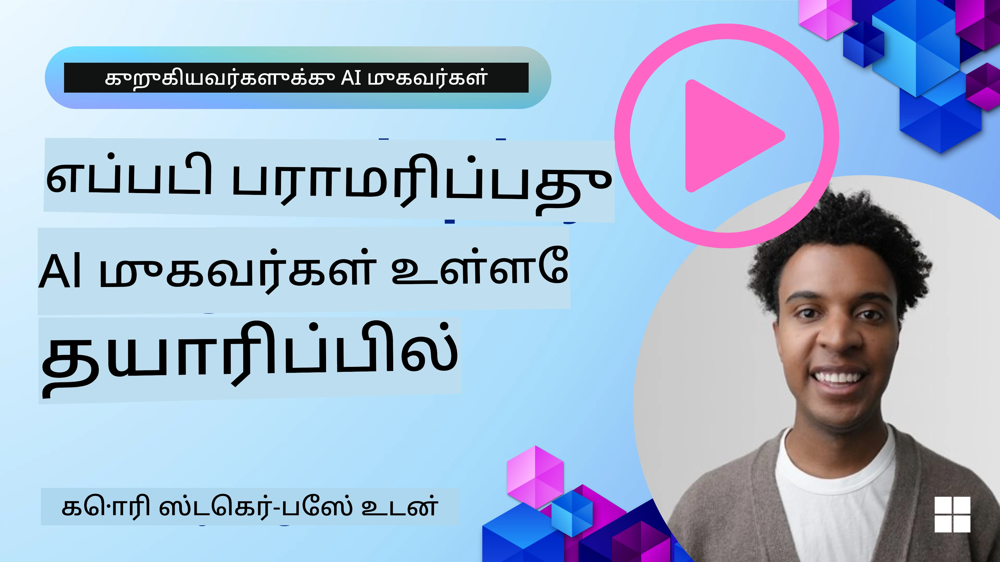

# உற்பத்தியில் AI முகவர்கள்: கணிசமாய் பார்க்கும் திறன் மற்றும் மதிப்பீடு

[](https://youtu.be/l4TP6IyJxmQ?si=reGOyeqjxFevyDq9)

AI முகவர்கள் பரிசோதனை மாதிரிகளிலிருந்து বাস্তவ உலக பயன்பாடுகளுக்கு கடத்தப்படும்போது, அவர்களின் நடத்தை புரிந்து கொள்வது, செயல்திறனை கண்காணிப்பது, மற்றும் அவர்களின் வெளியீடுகளை ஒழுங்குபடுத்தவாய் மதிப்பீடு செய்வது மிகவும் முக்கியமானதாக இருக்கும்.

## கற்றல் நோக்குகள்

இந்த பாடத்தை முடித்த பிறகு, நீங்கள் என்னைச் செய்யக்/புரிந்து கொள்வீர்கள்:
- முகவர் கணிசமாய்த் திறன் மற்றும் மதிப்பீட்டின் மூலக் கருத்துகள்
- முகவர்கள் செயல்திறன், செலவுகள் மற்றும் பயன்திறனை மேம்படுத்தும் தொழில்நுட்பங்கள்
- உங்கள் AI முகவர்களை எதை மற்றும் எப்படி முறையாக மதிப்பிடுவது
- AI முகவர்களை உற்பத்தியில் அணியும்போது செலவுகளை எப்படி கட்டுப்படுத்துவது
- Microsoft Agent Framework கொண்டு கட்டிய முகவர்களுக்கு எப்படி கருவூலம் இடுவது

நீங்கள் உங்கள் "கருப்பு பெட்டி" முகவர்களை தெளிவான, நிர்வகிக்கக்கூடிய மற்றும் நம்பகமானச் செயல்முறைகளாக்குவதற்கான அறிவை பெற்றுக் கொள்வதே இக்கற்றலின் நோக்கமாகும்.

_**கவனிக்கை:** பாதுகாப்பான மற்றும் நம்பகமான AI முகவர்களை இயக்குவது முக்கியம். [Building Trustworthy AI Agents](./06-building-trustworthy-agents/README.md) பாடத்தையும் பார்க்கவும்._

## டிரேசுகள் மற்றும் ஸ்பான்கள்

[Langfuse](https://langfuse.com/) அல்லது [Microsoft Foundry](https://learn.microsoft.com/en-us/azure/ai-foundry/what-is-azure-ai-foundry) போன்ற கணிசமாய் பார்க்கும் கருவிகள் பொதுவாக முகவர் ஓட்டங்களை டிரேசுகள் மற்றும் ஸ்பான்களாக பிரதிநிதித்துவம் செய்வதாக இருக்கும்.

- **டிரேஸ்** என்பது ஒரு முழுமையான முகவர் பணியை தொடக்கம் முதல் முடிவுவரை பிரதிநிதித்துவம் செய்கிறது (உதாரணமாக ஒரு பயனர் வினாவை கையாள்தல்).
- **ஸ்பான்கள்** என்பது அந்த டிரேஸ் உள்ளே தனித் தனி படிகளாக இருக்கும் (உதாரணமாக ஒரு மொழி மாடலை அழைப்பது அல்லது தரவை மீட்டெடுப்பது).


<!-- Image URL retained for illustration purposes -->

கணிசமாய் பார்க்கும் திறன் இல்லாமையில், ஒரு AI முகவர் "கருப்பு பெட்டியாக" தோன்றலாம் - அதன் உள்ளக நிலைமை மற்றும் காரணமறிவு இன்பத்தின் வெளிப்பாடு பாதுகாப்பற்றதாக இருக்கும், இது பிரச்சனைகளை கண்டறிய அல்லது செயல்திறனை ஒருங்குப்படுத்த கடினமாக்கும். கணிசமாய் பார்க்கும் திறன் மூலம், முகவர்கள் "கண்ணாடி பெட்டிகள்" ஆக மாறி தெளிவுத்தன்மையை வழங்குகின்றன, இது நம்பகத்தை கட்டியெழுப்புவதற்கும் அவர்களின் எதிர்பார்க்கப்படும் படி செயல்படுவதை உறுதிசெய்வதற்கும் அவசியமானது.

## உற்பத்திய்சூழல்களில் கணிசமாய் பார்க்கும் திறன் ஏன் முக்கியம்

AI முகவர்களை உற்பத்திய்சூழல்களுக்கு மாற்றுவது புதிய சவால்களையும் தேவைகளையும் கொண்டு வருகிறது. கணிசமாய் பார்க்கும் திறன் இனி ஒரு "வலிமையான-இல்லாதது" அல்ல, அது முக்கியமான திறனாக மாறுகிறது:

*   **பிழைதிருத்துதல் மற்றும் வேறு காரண கண்டுபிடிப்பு**: ஒரு முகவர் தோல்வியடையும்போது அல்லது எதிர்பாராத வெளியீட்டை உருவாக்கும்போது, கணிசமாய் பார்க்கும் கருவிகள் பிழையின் மூலத்தைக் கண்டறிவதற்கு தேவையான டிரேசுகளை வழங்கும். இது பல LLM அழைப்புகள், கருவி தொடர்புகள் மற்றும் நிபந்தனை மெய்யெழுத்த_logic உள்ள சிக்கலான முகவர்களில் சிறப்பாக முக்கியம் கிடைக்கும்.
*   **முடிவுமுறை மற்றும் செலவு மேலாண்மை**: AI முகவர்கள் பெரும்பாலும் டோக்கன் அல்லது அழைப்புக்கு அடிப்படையில் பில்லிங் செய்யப்படும் LLMகளையும் பிற வெளிப்புற APIகளையும் சார்ந்திருக்கும். கணிசமாய் பார்க்கும் திறன் இவ்வாறு செய்யப்படும் அழைப்புகளைக் குறிவைத்து சரியான கண்காணிப்பை அனுமதிக்கிறது, மிகவும் மெதுவான அல்லது செலவு அதிகமான செயல்களை அடையாளம் காண உதவுகிறது. இது அணிகளுக்கு ப்ராம்ப்ட்களை மென்மையாக்க அனுமதிக்க, திறமையான மாடல்களை தேர்வு செய்ய, அல்லது செயல்முறை வடிவமைப்புகளை மறுசீரமைத்து செயல்பாட்டு செலவினங்களை கட்டுப்படுத்தவும் நல்ல பயனர் அனுபவத்தை உறுதிசெய்யவும் உதவுகிறது.
*   **நம்பிக்கை, பாதுகாப்பு மற்றும் விதிமுறைப்படி ஏற்பாடு**: பல பயன்பாடுகளில், முகவர்கள் பாதுகாப்பாகவும் நெறிமுறைகளுக்கு ஏற்பவும் நடத்தை காட்டுவதை உறுதிசெய்வது முக்கியம். கணிசமாய் பார்க்கும் திறன் முகவர் நடவடிக்கைகள் மற்றும் முடிவுகளின் ஆடிட் தடத்தை வழங்குகிறது. இது ப்ராம்ப்ட் இன்ஜெக்ஷன், தீங்கு விளைவிக்கும் உள்ளடக்கம் உருவாகுதல், அல்லது தனிப்பட்ட அடையாளம் அடையாளப்படுத்தக்கூடிய தகவல்களின் (PII) தவறான கையாளுதல் போன்ற பிரச்சனைகளை கண்டறிந்து தகராறுகளைத் தடுக்கும் உதவியாக பயன்படுத்தலாம். எடுத்துக்காட்டாக, ஒரு முகவர் ஏன் ஒரு குறிப்பிட்ட பதிலை வழங்கினது அல்லது ஒரு குறிப்பிட்ட கருவியை பயன்படுத்தின என்பதை புரிந்துகொள்ள டிரேசுகளை பரிசீலிக்கலாம்.
*   **தொடர்ச்சியான மேம்பாட்டு சுற்றங்கள்**: கணிசமாய் பார்க்கும் தரவை ஒரு முறைக்கேற்ப வளர்ச்சி செயல்முறையின் அடித்தளமாகக் கொண்டு வரலாம். முகவர்கள் நேர்முகத்தில் எப்படி செயல்படுகின்றனர் என்பதைக் கண்காணித்துக் கொண்டு, அணிகள் மேம்படுத்த வேண்டிய பகுதிகளை அடையாளம் காணலாம், மாடல்களை நுாருக்க வசூல் செய்ய தேவையான தரவை சேகரிக்கலாம், மற்றும் மாற்றங்களின் தாக்கத்தை சேர்த்து சரிபார்க்கலாம். இது ஒரு பின்னூட்ட சுழற்சியை உருவாக்குகிறது: ஆன்லைன் மதிப்பீட்டிலிருந்து கிடைக்கும் உற்பத்தி洞察ங்கள் ஆஃப்லைனில் பரிசோதனை மற்றும் சீரமைப்புக்கு உதவுகின்றன, இதனால் முகவர்களின் செயல்திறன் முன்னேறுகிறது.

## கண்காணிக்க வேண்டிய முக்கிய அளவுகள்

முகவர் நடத்தை கண்காணிக்க மற்றும் புரிந்து கொள்ள, பல்வேறு அளவுகள் மற்றும் சிக்னல்களை கண்காணிக்க வேண்டும். முகவரின் நோக்கம் அடிப்படையில் குறிப்பிட்ட அளவுகள் மாறலாம், ஆனால் சில பொதுவாக முக்கியமானவையாக இருக்கும்.

கணிசமாய் பார்க்கும் கருவிகள் கண்காணிக்கும் சில பொது அளவுகள் கீழே உள்ளன:

**முடிவுமுறை (Latency):** முகவர் எவ்வளவு விரைவாக பதிலளிக்கிறானது? நீண்ட காத்திருப்பு நேரங்கள் பயனர் அனுபவத்தை எதிர்மறையாக பாதிக்கும். முகவர் ஓட்டங்களை டிரேசிங் மூலம் செயல்கள் மற்றும் தனிப்பட்ட படிகளுக்கான முடிவுமுறையை அளவிட வேண்டும். உதாரணமாக, அனைத்து மாடல் அழைப்புகளுக்கும் 20 விநாடிகள் எடுத்துக் கொள்ளும் ஒரு முகவரை வேகமான மாடலை பயன்படுத்துவதன் மூலம் அல்லது மாடல் அழைப்புகளை தோராயமாக ஒத்திசைக்க வைத்து வேகப்படுத்தலாம்.

**செலவுகள்:** ஒரு முகவர் ஓட்டத்தின் செலவு என்ன? AI முகவர்கள் LLM அழைப்புகளுக்கு அல்லது வெளிப்புற APIகளுக்காக செலவிடப்படுவார்கள். அடிக்கடி கருவி பயன்பாடு அல்லது பல ப்ராம்ப்ட்கள் செலவுகளை விரைவாக அதிகரிக்கலாம். உதாரணமாக, ஒரு முகவரி தரமான மேம்பாட்டிற்கு LLMஐ ஐந்து முறை அழைக்கும் போது, அந்த செலவு நியாயமானதா அல்லது அழைப்புகளின் எண்ணிக்கையை குறைக்கவில்லையா அல்லது மலிவு மாடலை பயன்படுத்தவில்லையா என்பதை நீங்கள் மதிப்பிட வேண்டும். நேரடி கண்காணிப்பு எதிர்பாராத ஏறுதல்களை (உதாரணமாக அதிகமான API லூப்களை உருவாக்கும் பிழைகள்) அடையாளம் காண உதவலாம்.

**கோரிக்கை பிழைகள்:** முகவர் எவ்வளவு கோரிக்கைகள் தோல்வியடைந்தன? இதில் API பிழைகள் அல்லது கருவி அழைப்புகள் தோல்வியடைவதும் அடங்கும். உற்பத்தியில் உங்கள் முகவரியை இதற்காக அதிகத் தடக்கமாக செய்ய நீங்கள் fallbackகளை அல்லது retries அமைக்கலாம். உதாரணமாக LLM வழங்குநர் A கிடைக்கவில்லை என்றால், நீங்கள் ஆதரவாக LLM வழங்குநர் Bக்கு மாறலாம்.

**பயனர் பின்னூட்டம்:** நேரடி பயனர் மதிப்பீடுகளைக் கொண்டுவருவது மதிப்புமிக்க洞察ங்களை வழங்கும். இதில் தெளிவான மதிப்பீடுகள் (👍thumbs-up/👎down, ⭐1-5 நட்சத்திரங்கள்) அல்லது உரை கருத்துகள் அடங்கலாம். தொடர்ந்து எதிர்மறை பின்னூட்டம் கிடைத்தால், இது முகவர் எதிர்பார்த்தபடி செயல்படாமல் இருக்கிறது என்ற அடையாளமாகும்.

**நோக்கமற்ற பயனர் பின்னூட்டம்:** தெளிவான மதிப்பீடுகள் இல்லாமல் கூட பயனர் நடத்தைகள் மறைமுகமான பின்னூட்டத்தை வழங்குகின்றன. இதில் உடனடி கேள்வி மறுபடலம், மீண்டும் கேட்குதல் அல்லது ஒரு retry பொத்தானை அழுத்துதல் போன்றவை அடங்கலாம். உதாரணமாக, பயனர்கள் அடிக்கடி ஒரே கேள்வியை கேட்குவதை நீங்கள் காண்பீர்கள் என்றால், இது முகவர் எதிர்பார்த்தபடி செயல்படாததை குறிக்கிறது.

**துல்லியம் (Accuracy):** முகவர் எத்தனை முறை சரியான அல்லது விரும்பத்தக்க வெளியீடுகளை உருவாக்குகிறான்? துல்லியம் விளக்கங்கள் மாறுபடும் (உதா., பிரச்சனைத் தீர்க்கும் சரியானতা, தகவல் மீட்டெடுப்பு துல்லியம், பயனர் திருப்தி). வெற்றிக்கான வரையறையை முதலில் உங்கள் முகவிற்காக வரையறுக்க வேண்டும். துல்லியத்தை தானாகச் சோதனைகள், மதிப்பீட்டு மதிப்புகள், அல்லது பணிக்குடಿ நிறைவு தலைப்புகளை கொண்டு கண்காணிக்கலாம். உதாரணமாக, டிரேசுகளை "succeeded" அல்லது "failed" என்று குறிக்கலாம்.

**தானியங்கி மதிப்பீட்டு அளவுகள்:** தானியங்கி மதிப்பீடுகளை அமைக்கலாம். உதாரணமாக, ஒரு LLMஐப் பயன்படுத்தி முகவரின் வெளியீட்டை மதிப்பீடு செய்து உதவிகரமா, துல்லியமா அல்லது அல்லவா என்று மதிப்பிடலாம். முகவரின் பல்வேறு அம்சங்களை மதிப்பிட உதவும் பல திறந்த மூல நூலகங்களும் உள்ளன. உதாரணத்திற்கு RAG முகவர்களுக்கு [RAGAS](https://docs.ragas.io/) அல்லது தீங்கான மொழி அல்லது ப்ராம்ப்ட் இன்ஜெக்ஷனை கண்டறிய [LLM Guard](https://llm-guard.com/) போன்றவை.

அவலையில், இவ்வகை அளவுகளின் கலவையே ஒரு AI முகவரியின் ஆரோக்கியத்திற்கான சிறந்த கவனத்தைக் கொடுக்கும். இக்கமூட்டத்தில் உள்ள [example notebook](./code_samples/10-expense_claim-demo.ipynb) இல், இந்த அளவுகள் உண்மையான உதாரணங்களில் எப்படி தோன்றுமோ அதை சுற்றிவளைந்து காட்டுவோம், ஆனால் முதலில் ஒரு சாதாரண மதிப்பீட்டு பணிச்சுழற்சி எப்படி இருக்கும் என்பதைக் கறுத்துக் கொள்வோம்.

## உங்கள் முகவருக்கு கருவூலம் இடுதல்

டிரேசிング் தரவை சேகரிக்க, உங்கள் குறியீட்டில் கருவூலம் இட வேண்டும். நோக்கம்: முகவர் குறியீட்டை டிரேசுகள் மற்றும் அளவுகளை வெளியிடும் படி கருவூலம் இடுவது, அவை ஒரு கணிசமாய் பார்க்கும் தளத்தால் பிடிக்கப்பட்டு, செயலாக்கப்பட்டு, காண்பிக்கப்படலாம்.

**OpenTelemetry (OTel):** [OpenTelemetry](https://opentelemetry.io/) LLM கணிசமாய் பார்க்கும் திறனுக்கு ஒரு துறை நிலைமையான ஸ்டாண்டர்டாக உருவெடுத்துள்ளது. இது டெலெமெட்ரி தரவை உருவாக்க, சேகரிக்க மற்றும் ஏற்றுமதி செய்ய APIகளும், SDKகளும் மற்றும் கருவிகளையும் வழங்குகிறது.

இருந்தாலும் பல கருவூலம் இடும் நூலகங்கள் உள்ளன, அவை உள்ளடக்க முகவர் கட்டமைப்புகளை சுட்டிக்காட்டி OpenTelemetry ஸ்பான்களை கணிசமாய் பார்க்கும் கருவிக்காக எளிதாக ஏற்றுமதி செய்ய உதவுகின்றன. Microsoft Agent Framework இயல்பாக OpenTelemetry உடன் ஒருங்கிணைக்கிறது. கீழே MAF முகவரியை கருவூலம் இடுவதற்கான உதாரணம் கொடுக்கப்பட்டுள்ளது:

```python
from agent_framework.observability import get_tracer, get_meter

tracer = get_tracer()
meter = get_meter()

with tracer.start_as_current_span("agent_run"):
    # ஏஜென்டின் செயல்பாடு தானாகக் கண்காணிக்கப்படுகிறது
    pass
```

இந்த அதிகாரத்தில் உள்ள [example notebook](./code_samples/10-expense_claim-demo.ipynb) உங்கள் MAF முகவரிக்கு எப்படி கருவூலம் இடுவது என்பதை காட்சிப்படுத்தும்.

**கையேடு மூலம் ஸ்பான் உருவாக்குதல்:** கருவூலம் இடும் நூலகங்கள் ஒரு நல்ல அடிப்படை வழங்கினாலும், சில சமயங்களில் மேலும் விரிவான அல்லது தனிப்பயன் தகவல் தேவைப்படலாம். தனிப்பயன் செயல்முறைகளைச் சேர்க்க ஸ்பான்களை கையேடு மூலம் உருவாக்கலாம். மிகவும் முக்கியமாக, அவை தானாகவோ அல்லது கையேடு மூலம் உருவாக்கப்பட்ட ஸ்பான்களையும் தனிப்பயன் பண்புகளால் (tags அல்லது மெட்டாடேட்டாகவும் அழைக்கப்படுவது) செழிக்க செய்யலாம். இவற்றில் வியாபார-சம்பந்தமான தரவுகள், இடைக்கால கணக்கீடுகள் அல்லது பிழைத்திருத்தத்திற்கு உதவக்கூடிய எந்தவொரு உள்ளடக்கம் ஆகியவையும் சேர்க்கப்படலாம், உதாரணமாக `user_id`, `session_id`, அல்லது `model_version`.

[Langfuse Python SDK](https://langfuse.com/docs/sdk/python/sdk-v3) உடன் டிரேசுகள் மற்றும் ஸ்பான்களை கையேடு முறையில் உருவாக்குவதற்கான உதாரணம்:

```python
from langfuse import get_client
 
langfuse = get_client()
 
span = langfuse.start_span(name="my-span")
 
span.end()
```

## முகவர் மதிப்பீடு

கணிசமாய் பார்க்குதல் நமக்கு அளவுகளை வழங்குகிறது, ஆனால் மதிப்பீடு என்பது அந்த தரவைக் (மற்றும் சோதனைகளைச் செய்பவர்களாக) பகுப்பாய்வு செய்து ஒரு AI முகவர் எவ்வாறு செயல்படுகிறது மற்றும் அதை எப்படி மேம்படுத்தலாம் என்பதை தீர்மானிக்கும் செயல்முறை. மற்றொரு சொல்லில், அந்த டிரேசுகள் மற்றும் அளவுகள் வந்தவுடன், அவற்றைப் பயன்படுத்தி முகவரியை எவ்வாறு மதிப்பிடுவது மற்றும் முடிவுகளை எப்படிக் கொள்வது?

தனி நிர்வாக மதிப்பீடு முக்கியம் ஏனெனில் AI முகவர்கள் பெரும்பாலும் தீர்மானிப்பற்றவையாயிருக்கும் மற்றும் (மேம்படுத்தல்கள் அல்லது மாடல் நடத்தை இசைவுபடுத்தலால்) மாறக்கூடும் – மதிப்பீடு இல்லாமல், உங்கள் "புத்திசாலி முகவர்" உண்மையில் தனது பணியை நன்றாக செய்கிறாரா அல்லது பின்னடைவு ஏற்பட்டுவிட்டதா என்பதை நீங்கள் அறியமுடியாது.

AI முகவர்களுக்கான மதிப்பீடுகளில் இரண்டு வகைகள் உள்ளன: **ஆன்லைன் மதிப்பீடு** மற்றும் **ஆஃப்லைன் மதிப்பீடு**. இரண்டும் மதிப்புமிக்கவை, மேலும் அவை ஒன்றுக்கொன்று補完 ஆகும். பொதுவாக நாம் ஆஃப்லைன் மதிப்பீடுதிலிருந்து தொடங்குவோம், ஏனெனில் இது எந்தவொரு முகவரையும் இயக்குவதற்கு முன் குறைந்தபட்சமாக தேவையான படியாகும்.

### ஆஃப்லைன் மதிப்பீடு


இது கட்டுப்படுத்தப்பட்ட சூழலில் முகவரியை மதிப்பிடுவதை குறிக்கிறது, பொதுவாக சோதனை தரவுத்தொகுப்புகளை பயன்படுத்தி, நேரடி பயனர் கேள்விகள் அல்லாதவை. நீங்கள் எதிர்பார்க்கப்படும் வெளியீடு அல்லது சரியான நடத்தை என்ன எனக்கும் தெரியும் என்ற துல்லியமான தரவுத்தொகுப்புகளை பயன்படுத்தி, பிறகு உங்கள் முகவரியை அவற்றில் இயக்குவீர்கள்.

உதாரணமாக, நீங்கள் ஒரு கணித சொற்பொருள் பிரச்சினை முகவரியை கட்டியிருந்தால், நீங்கள் தெரிந்த பதில்களைக் கொண்ட 100 பிரச்சனைகள் கொண்ட [test dataset](https://huggingface.co/datasets/gsm8k) ஒன்றை வைத்திருக்கலாம். ஆஃப்லைன் மதிப்பீடு பெரும்பாலும் வளர்ச்சிக்காலத்தில் செய்யப்படும் (மேலும் CI/CD குழிகளின் ஒரு பகுதியாக இருக்கலாம்) மேம்பாடுகளை சரிபார்க்க அல்லது பின்னடைவுகளை தடுக்கும் வகையில். இதன் நன்மை என்னவென்றால், இது **மறுபடியும் செய்யக்கூடியது மற்றும் நீங்கள் பூமியின் உண்மையானத் தகவல்களை கொண்டிருக்கும்போது தெளிவான துல்லிய அளவுகோல்களை பெறலாம்**. நீங்கள் பயனர் கேள்விகளை சிமுலேட் செய்து முகவரியின் பதில்களை Ideal பதில்களுடன் அளவிடலாம் அல்லது மேலே விவரிக்கப்பட்ட தானியங்கி அளவுகோல்களை பயன்படுத்தலாம்.

ஆஃப்லைன் மதிப்பீட்டில் உள்ள முக்கிய சவால் உங்கள் சோதனை தரவுத்தொகுப்பு பரவலானது மற்றும் சம்பந்தப்பட்டதாக இருக்கும் என்பதை உறுதிசெய்தல் – முகவர் ஒரு நிரந்தர சோதனைத் தொகுப்பில் நன்றாக செயல்படலாம், ஆனால் உற்பத்தியில் மிகவும் வேறுபட்ட கேள்விகளை எதிர்கொள்ளலாம். ஆகையால், நீங்கள் சோதனைத் தொகுப்புகளை புதுப்பித்து, புதிய ஓரமான வழிகாட்டுதல்கள் மற்றும் உண்மையான உலகம் பிரதிபலிக்கும் உதாரணங்களுடன் தொடர்ந்து புதுப்பிக்க வேண்டும்​. சிறிய "சுகபுக" சோதனைக்கான வழக்குகள் மற்றும் பெரிய மதிப்பீட்டு தொகுப்புகளின் கலவை பயனுள்ளது: விரைவான சோதனைகளுக்கான சிறிய தொகுப்புகள் மற்றும் பரவலான செயல்திறன் அளவுகோல்களுக்கு பெரிய தொகுப்புகள்​.

### ஆன்லைன் மதிப்பீடு


இது ஒரு நேரடி, உண்மையான உலக சூழலில் முகவரியை மதிப்பிடுவதை குறிக்கிறது, அதாவது உற்பத்தியில் உள்ள உண்மையான பயன்பாட்டின் போது. ஆன்லைன் மதிப்பீடு நேரடி பயனர் தொடர்புகளில் முகவரியின் செயல்திறனை கண்காணித்து தொடர்ந்து முடிவுகளை பகுப்பாய்வு செய்வதை உட்படுத்துகிறது.

உதாரணமாக, நீங்கள் வெற்றிக் கோட்பாடுகள், பயனர் திருப்தி மதிப்பெண்கள், அல்லது நேரடி போக்குவரத்தில் மற்ற அளவுகோல்களை கண்காணிக்கலாம். ஆன்லைன் மதிப்பீட்டின் நன்மை என்னவென்றால், இது **வLab சூழலில் நீங்கள் எதிர்பார்க்காதவற்றை பிடிக்கும்** – நீங்கள் தொலைநோக்கு மாடல் மாற்றம் நேரத்தில் (Input மாதிரிகள் மாறும் போது முகவரின் பயன்திறன் சரிவடைந்தால்) கண்டறியலாம் மற்றும் உங்கள் சோதனை தரவுகளில் இல்லைவகையான எதிர்பாராத கேள்விகளை அல்லது சூழ்நிலைகளை பிடிக்கலாம்​. இது வெறும் முயற்சியில் முகவர் எப்படி நடந்து கொள்கிறான் என்பதை உண்மையான படம் கொடுக்கும்.

ஆன்லைன் மதிப்பீடு பெரும்பாலும் மறைமுக மற்றும் நேர்முக பயனர் பின்னூட்டங்களை சேகரிப்பதை அடங்கும், மேலும் புதிய பதிப்புகளைக் பழையவற்றுடன் ஒப்பிடுவதற்காக ரெண்டர் டெஸ்ட் அல்லது A/B சோதனைகளை நடத்தலாம். சவால் என்னவென்றால், நேரடி தொடர்புகளுக்கு நம்பகமான லேபல்கள் அல்லது மதிப்பெண்களை பெறுவது கடினமாக இருக்கலாம் – நீங்கள் பயனர் பின்னூட்டம் அல்லது பின்னணி அளவுகோல்களை (எப்படி பயனர் முடிவைச் சொடுக்கினார்களோ என்பதைப் போன்ற) பொறுத்திருக்கலாம்.

### இரண்டையும் ஒன்றாக இணைத்தல்

ஆன்லைன் மற்றும் ஆஃப்லைன் மதிப்பீடுகள் மாறாக இருக்கமாட்டாது; அவை மிகவும்補完 ஆக உள்ளன. ஆன்லைனில் இருந்து கிடைக்கும்洞察ங்கள் (உதாரணமாக, முகவர் மோசமானதைக் காட்டும் புதிய வகை பயனர் கேள்விகள்) ஆஃப்லைன் சோதனை தரவுத்தொகுப்புகளை மேம்படுத்த மற்றும் வளப்படுத்த பயன்படுத்தப்படலாம். மாறாக, ஆஃப்லைனில் நன்றாக செயல்படும் முகவர்கள் பின்னர் ஆணையப்படுத்தப்படாமல் ஆன்லைனில் நம்பிக்கையுடன் இயக்கப்பட்டு கண்காணிக்கப்படலாம்.

உண்மையில், பல அணிகள் ஒரு சுழற்சியை ஏற்றுக்கொள்கின்றனர்:

_ஆஃப்லைனில் மதிப்பீடு -> இயக்கு -> ஆன்லைனில் கண்காணி -> புதிய தவறான வழக்குகளை சேகரி -> ஆஃப்லைன் தரவுத்தொகுப்பில் சேர்க்க -> முகவரியை சீரமை -> மீண்டும் தொடங்கு_.

## பொது பிரச்சனைகள்

AI முகவர்களை உற்பத்தியில் இயக்கும்போது, நீங்கள் பல்வேறு சவால்களை சந்திக்கலாம். சில பொது பிரச்சனைகளும் அவர்களின் சாத்திய தீர்வுகளும் இங்கே:

| **பிரச்சனை**    | **சாத்தியமான தீர்வு**   |
| ------------- | ------------------ |
| AI முகவர் பணிகளை ஒத்திசையாகச் செய்யவில்லை | - AI முகவருக்கு கொடுக்கப்படும் ப்ராம்ப்ட்டை சீரமைக்கவும்; நோக்கங்களை தெளிவாக கூறவும்.<br>- பணிகளை உபபணிகளாக பிரித்து பல முகவர்கள் மூலம் கையாள்வது எங்கே உதவுமோ அடையாளம் காணவும். |
| AI முகவர் தொடர்ச்சியான லூப்களில் சிக்குகிறது  | - முகவர் எப்போது செயல்முறையை நிறுத்த வேண்டும் என்பது தெளிவான நிறுத்த விதிமுறைகள் மற்றும் நிபந்தனைகளை கொண்டிருக்க வேண்டும் என்பதை உறுதிசெய்க.<br>- காரணமறிவு மற்றும் திட்டமிடலைத் தேவைப்படுத்தும் சிக்கலான பணிகளுக்காக, காரணமறிவுக்கு சிறப்பு பெற்ற பெரிய மாடலை பயன்படுத்தவும். |
| AI முகவர் கருவி அழைப்புகள் நல்ல முறையில் செயல்படவில்லை   | - முகவர் அமைப்பின் வெளியே கருவியின் வெளியீட்டை சோதித்து செல்லுபடியாக்கவும்.<br>- நிர்ணயிக்கப்பட்ட அளவுருக்கள், ப்ராம்ப்ட்கள் மற்றும் கருவி பெயரீடுகளை மெல்லிசையாக மாற்றவும்.  |
| பல-முகவர் அமைப்பு ஒத்திசையாக செயல்படவில்லை | - ஒவ்வொரு முகவருக்கும் வழங்கப்படும் ப்ராம்ப்ட்களை குறிப்பாகவும் மற்றும் ஒருவரிலிருந்து வேறுபடியாகவும் சீரமைக்கவும்.<br>- எந்த முகவர் சரியானது என்பதை தீர்மானிக்க "routing" அல்லது கட்டுப்பாட்டு முகவரியை பயன்படுத்தி இடமுறை அமைப்பு உருவாக்கவும். |

இந்த பிரச்சனைகளின் பலவற்றை கணிசமாய் பார்க்கும் திறன் இருக்கும் போது சிறந்த முறையில் கண்டறிய முடியும். நாம் முன்பு விவாதித்த டிரேசுகளும் அளவுகோல்களும் முகவர் பணிச்செயல்முறையில் எங்கே பிரச்சனை நடக்கிறது என்பதை துல்லியமாகக் குறிக்க உதவுகின்றன, இதனால் பிழைதிருத்தமும் ஒப்டிமைசேஷனும் மிகவும் திறமையாக நடக்கும்.

## செலவுகளை நிர்வகித்தல்
Here are some strategies to manage the costs of deploying AI agents to production:

**Using Smaller Models:** சிறிய மொழி மாதிரிகள் (SLMs) சில ஏஜென்ட் பயன்பாட்டு வழக்குகளில் சிறந்த செயல்திறனை காட்சியிடக்கூடும் மற்றும் செலவுகளை குறிப்பிடத்தக்க அளவில் குறைக்கும். முன்பே குறிப்பிடப்பட்டபோல், ஒரு மதிப்பீட்டு அமைப்பை உருவாக்கி பெரிய மாதிரிகளுடன் செயல்திறனை ஒப்பிடுவது SLM உங்கள் பயன்பாட்டில் எவ்வளவு நன்றாக செயல்படும் என்பதை புரிந்துகொள்ள சிறந்த வழி. நோக்க வகைப்படுத்தல் அல்லது அளவுரு எடுப்பு போன்ற எளிய பணிகளுக்காக SLM-களை பயன்படுத்த பரிசீலனையிலிருக்கவும், மேலும் சிக்கலான கருத்து கணக்கீடுகளுக்கு பெரிய மாதிரிகளை ஒதுக்கி வைத்திருங்கள்.

**Using a Router Model:** ஒரு ஒத்த தந்திரம் பலவகையான மாதிரிகள் மற்றும் அளவுகளைப் பயன்படுத்துவதாகும். நீங்கள் சிக்கலின் அடிப்படையில் கோரிக்கைகளை சிறந்த பொருத்தமான மாதிரிகளுக்கு மாற்ற LLM/SLM அல்லது serverless function ஐ பயன்படுத்தலாம். இது செலவுகளை குறைக்கும் மற்றும் சரியான பணிகளில் செயல்திறனை உறுதி செய்ய உதவும். உதாரணமாக, எளிய கேள்விகளைச் சிறிய மற்றும் வேகமான மாதிரிகளுக்கு வழிமாற்றி, சிக்கலான காரணீயார்மான பணிகளுக்கு மட்டுமே செலவான பெரிய மாதிரிகளை பயன்படுத்துங்கள்.

**Caching Responses:** பொதுவாக வரும் கோரிக்கைகள் மற்றும் பணிகளை அடையாளம் காண்வதும் அவை உங்கள் ஏஜென்ட் அமைப்பிற்குள் செல்லும் முன் பதில்களை வழங்குவதும் அதே மாதிரியான கோரிக்கைகள் வந்த அளவைக் குறைப்பதில் சிறந்த வழி. அடிப்படைக் குறைந்த AI மாதிரிகளைப் பயன்படுத்தி ஒரு ஓட்டம் உருவாக்கி ஒரு கோரிக்கை உங்கள் கேச் செய்யப்பட்ட கோரிக்கைகளுடன் எவ்வளவு ஒத்ததாக இருக்கிறதோ என்பதைக் கண்டறியலாம். அடிக்கடி கேட்கப்படும் கேள்விகள் அல்லது பொதுவான வேலைவழிகளுக்கான செலவுகளை இந்த யுக்தி குறிப்பிடத்தக்கமாகக் குறைக்கலாம்.

## Lets see how this works in practice

In the [உதாரண நோட்புக்](./code_samples/10-expense_claim-demo.ipynb), we’ll see examples of how we can use observability tools to monitor and evaluate our agent.


### Got More Questions about AI Agents in Production?

மற்ற கற்றலாளர்களை சந்திக்க, அலுவலக நேரங்களில் கலந்துகொள்ள மற்றும் உங்கள் AI ஏஜென்ட் பற்றிய கேள்விகளுக்கு பதில்கள் பெற [Microsoft Foundry Discord](https://aka.ms/ai-agents/discord) இல் இணைந்துகொள்ளுங்கள்.

## Previous Lesson

[தன்னுணர்வு வடிவமைப்பு முறை](../09-metacognition/README.md)

## Next Lesson

[ஏஜென்ட் நெறிமுறைகள்](../11-agentic-protocols/README.md)

---

<!-- CO-OP TRANSLATOR DISCLAIMER START -->
மறுப்பு அறிவிப்பு:
இந்த ஆவணம் AI மொழிபெயர்ப்பு சேவையான Co‑op Translator மூலம் மொழிபெயர்க்கப்பட்டுள்ளது. நாங்கள் துல்லியத்திற்காக முயன்றாலும், தானியங்கி மொழிபெயர்ப்புகளில் பிழைகள் அல்லது தவறான தகவல்கள் இருக்கலாம் என்பதை கவனத்தில் கொள்ளவும். மூல ஆவணம் அதன் தாய்மொழி வடிவில் அதிகாரபூர்வ ஆதாரமாக கருதப்படவேண்டும். மிகவும் முக்கியமான தகவல்களுக்கு தொழில்முறை மனித மொழிபெயர்க்கப்பட்ட பதிப்பு பரிந்துரைக்கப்படுகிறது. இந்த மொழிபெயர்ப்பின் பயன்பாட்டினால் ஏற்படும் எந்தவொரு தவறான புரிதலும் அல்லது தவறான விளக்கத்திற்கும் நாங்கள் பொறுப்பாளன் அல்லோம்.
<!-- CO-OP TRANSLATOR DISCLAIMER END -->