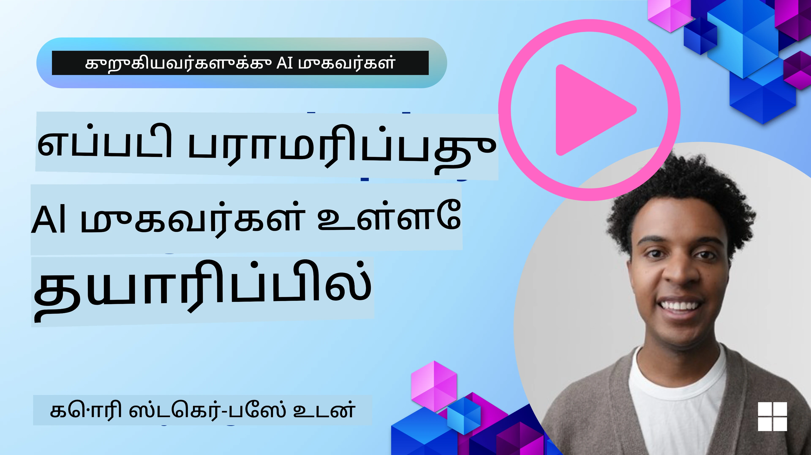

# உற்பத்தியில் AI முகவர்கள்: கண்காணிப்பு & மதிப்பீடு

[](https://youtu.be/l4TP6IyJxmQ?si=reGOyeqjxFevyDq9)

AI முகவர்கள் பரிசோதனை முன்மாதிரிகளிலிருந்து நிஜ உலக பயன்பாடுகளுக்கு மாறும்போது, அவர்களது நடத்தை புரிந்துகொள்வது, செயல்திறனை கண்காணிப்பது மற்றும் அவர்களது வெளியீடுகளை முறையான முறையில் மதிப்பீடு செய்வது முக்கியமாகிறது.

## கற்கும் குறிக்கோள்கள்

இந்த பாடத்தை முடித்த பிறகு, நீங்கள் அறிவீர்கள்/புரிந்துகொள்ளுவீர்கள்:
- முகவர் கண்காணிப்பு மற்றும் மதிப்பீடின் முக்கியக் கருத்துக்கள்
- முகவர்களின் செயல்திறன், செலவுகள் மற்றும் தாக்கத்தைக் மேம்படுத்தும் தொழில்நுட்பங்கள்
- உங்கள் AI முகவர்களை முறையாக எப்படி மதிப்பீடு செய்வது
- AI முகவர்களை உற்பத்திக்கு வெளியிடும் போது செலவுகளை எப்படி கட்டுப்படுத்துவது
- மைக்ரோசாஃப்ட் முகவர் அமைப்புடன் கட்டப்பட்ட முகவர்களை எப்படி கருவி செய்வது

குறிக்கோள்: உங்கள் "கருப்பு பெட்டி" முகவர்களை தெளிவான, நிர்வகிக்கக்கூடிய மற்றும் நம்பத்தகுந்த அமைப்புகளாக மாற்றும் அறிவைக் கையாள்வது.

_**குறிப்பு:** பாதுகாப்பான மற்றும் நம்பத்தகுந்த AI முகவர்களை வெளியிடுவது முக்கியம். [நம்பத்தகுந்த AI முகவர்கள் கட்டுதல்](../06-building-trustworthy-agents/README.md) பாடத்தையும் பாருங்கள்._

## தடிகள் மற்றும் பரப்புகள்

[Langfuse](https://langfuse.com/) அல்லது [Microsoft Foundry](https://learn.microsoft.com/en-us/azure/ai-foundry/what-is-azure-ai-foundry) போன்ற கண்காணிப்பு கருவிகள் பொதுவாக முகவர் இயக்கங்களை தடிகள் மற்றும் பரப்புகளாக பிரதிநிதித்துவம் செய்கின்றன.

- **தடிகை** என்பது ஒரு முகவரின் முழுமையான பணியைக் குறிக்கிறது ஆரம்பம் முதல் முடிவுவரை (பயனர் கேள்வியை கையாள்வது போன்ற).
- **பரப்புகள்** என்பது தடிகையின் உள்ளே தனித்தனி கட்டங்களாகும் (ஒரு மொழி மாதிரியை அழைக்குவது அல்லது தரவைப் பெறுவது போன்ற).


<!-- Image URL retained for illustration purposes -->

கண்காணிப்பில்லாமல் AI முகவர் ஒரு "கருப்பு பெட்டி" போல தோன்றலாம் - அதன் உள் நிலை மற்றும் காரணமற்ற விவரங்கள் மறைவே, இது பிரச்சனைகள் கண்டுபிடிப்பதற்கும் செயல்திறனை மேம்படுத்துவதற்கும் இரு கடினமாகிறது. கண்காணிப்புடன், முகவர்கள் "கண்ணாடிப் பெட்டிகள்" ஆகி, நம்பிக்கையை உருவாக்கவும், தேவையான முறையில் செயல்படுவதை உறுதிசெய்யவும் முக்கியமான தெளிவை அளிக்கின்றன.

## உற்பத்தி சூழல் கண்காணிப்பின் முக்கியத்துவம்

AI முகவர்களை உற்பத்தி சூழல் நோக்கி மாற்றுவது புதிய சவால்கள் மற்றும் தேவைகளைச் சேர்க்கிறது. கண்காணிப்பு "பரவாயில்லை" என்பதைக் கடந்து அத்தியாவசிய திறனாக மாறுகிறது:

*   **பிழை கண்டறிதல் மற்றும் மூல காரண பகுப்பாய்வு**: முகவர் தோல்வியடைந்தால் அல்லது எதிர்பாராத வெளியீடு வழங்கினால், கண்காணிப்பு கருவிகள் பிழையின் மூலத்தைக் கண்டுபிடிக்க தேவையான தடிகைகளை வழங்குகின்றன. இது பல LLM அழைப்புகள், கருவி தொடர்புகள், மற்றும் நிபந்தனை காரணிகள் உடைய சிக்கலான முகவர்களுக்குப் பெரிதும் உதவுகிறது.
*   **தாமதம் மற்றும் செலவு மேலாண்மை**: AI முகவர்கள் பெரும்பாலான முறையில் TTS அழைப்புகளோடு மற்றும் பிற வெளிப்புற API-களோடு பொருந்தி, அவை ஒவ்வொரு அழைப்பிற்கும் அல்லது டோக்கனுக்கு கட்டணம் வசூலிக்கப்படுகின்றன. கண்காணிப்பு இந்த அழைப்புகளை துல்லியமாக கண்காணித்து, மிகவும் மெதுவான அல்லது செலவான செயல்பாடுகளை அடையாளம் காண உதவுகிறது. இது குழுக்களுக்கு முன்பதிவுகளை சிறப்பாக்க, திறமையான மாதிரிகளைத் தேர்ந்தெடுக்க அல்லது பணிச்சூழல்களை மறுசீரமைக்க உதவுகிறது, இதனால் இயக்கச் செலவுகள் கட்டுப்படுத்து மற்றும் பயனர் அனுபவம் மேம்படும்.
*   **நம்பிக்கை, பாதுகாப்பு மற்றும் விதிமுறைகள்**: பல பயன்பாடுகளில் முகவர்கள் பாதுகாப்பாகவும் நெறிமுறைகளுக்கு உடன்படவும் இருக்க வேண்டும். கண்காணிப்பு முகவர் நடவடிக்கைகள் மற்றும் முடிவுகளின் கணக்குப் பாதை அளிக்கிறது. இது ப்ராம்ட் ஊழியத்தினை, தீங்கு விளைவிக்கும் உள்ளடக்கத்தை உருவாக்குதலை அல்லது தனிப்பட்ட அடையாளத் தகவல்களை தவறான முறையில் கையாள்வதை கண்டறிதல் மற்றும் தடுப்பதற்கு பயன்படும். உதாரணமாக, ஒரு முகவர் ஏன் ஒரு குறிப்பிட்ட பதிலைத் தந்தார் அல்லது ஒரு குறிப்பிட்ட கருவியை பயன்படுத்தினார் என்பதை விளக்க தடிகைகளைப் பார்வையிடலாம்.
*   **தொடர்ச்சியான மேம்பாட்டு வட்டங்கள்**: கண்காணிப்பு தரவு ஒரு செயற்றிட்டத் வளர்ச்சி செயல்முறையின் அடித்தளம். முகவர்கள் நிஜ உலகில் எப்படி செயல்படுகின்றன என்பதை கண்காணித்தல் மூலம், குழுக்கள் மேம்படுத்தப்பட வேண்டிய பகுதிகளை கண்டுபிடித்து, மாதிரிகளை சிறப்பிக்கும் தரவை சேகரித்து, மாற்றங்களின் தாக்கத்தைக் உறுதிப்படுத்த முடியும். இதனால் உற்பத்தி நேரவரிசையின் தகவல்கள் ஆஃப்லைன் பரிசோதனைகள் மற்றும் தாக்கீடு வேலைகளை வழிநடத்தி, முகவரின் செயல்திறனை முறையாக மேம்படுத்தும் பின்னூட்ட வட்டமாகும்.

## கண்காணிக்க வேண்டிய முக்கிய அளவுகேடுகள்

முகவர்களின் நடத்தை கண்காணிக்க மற்றும் புரிந்துகொள்ள பல அளவுகோல்களையும் சிக்னல்களையும் கண்காணிக்க வேண்டும். குறிப்பிட்ட அளவுகோல்கள் முகவரின் நோக்கத்தின் அடிப்படையில் மாறுபடலாம் ஆனால் சில பொதுவாக முக்கியமானவை.

கண்காணிப்பு கருவிகள் கண்காணிக்கும் பொதுவான அளவுகோல்கள் சில:

**தாமதம்:** முகவர் எவ்வளவு விரைவாக பதிலளிக்கிறார்? நீண்ட காத்திருப்பு காலங்கள் பயனர் அனுபவத்தை பாதிக்கின்றன. முகவர் இயக்கங்களின் பணிக்குட்டிகள் மற்றும் தனித்தனி படிகளை தடிகள் மூலம் நிலைத்துக் கொள்ளும் போது தாமதத்தை அளவிட வேண்டும். உதாரணமாக, அனைத்து மாதிரி அழைப்புகளுக்கு 20 வினாடிகள் எடுக்கும் முகவருக்கு விரைவான மாதிரி பயன்படுத்தவோ அல்லது மாதிரி அழைப்புகளை இணக்கமாகச் செயல் படுத்தவோ தொடங்கலாம்.

**செலவுகள்:** ஒவ்வொரு முகவர் இயக்கத்திற்கு என்ன செலவு? AI முகவர்கள் டோக்கன் அல்லது வெளிப்புற API அழைப்புகளுக்கு கட்டணம் செலுத்தி இயங்குகின்றனர். குறிப்பிட்ட கருவி அல்லது பல முறை கேள்விகள் செலவுகளை விரைவில் உயர்த்தலாம். எடுத்துக்காட்டாக, சில சிறிய தரமான மேம்பாட்டுக்காக ஒரு LLM ஐ ஐந்து முறை அழைப்பது செலவு நியாயமானதா என்பதை மதிப்பீடு செய்ய வேண்டும் அல்லது அழைப்புகளின் எண்ணிக்கையை குறைக்கும் அல்லது இலகுவான மாதிரியைப் பயன்படுத்த வேண்டும். நேரடி கண்காணிப்பு எதிர்பாராத உயர்வுகளை (எ.கா. குறியீடு பிழைகள் காரணமாக அதிக API லூப்புகள்) கண்டுபிடிக்க உதவும்.

**கோரிக்கை பிழைகள்:** முகவர் எத்தனை கோரிக்கைகள் தோல்வியடைந்தது? இது API பிழைகள் அல்லது தவறான கருவி அழைப்புகளைக் கொண்டிருக்கலாம். உற்பத்தியில் முகவரின் உறுதிப்பாட்டுக்காக, பின்னணி அச்சவுடிகளோடு மறுபரிசீலனை செயல்படுத்தலாம். உதாரணமாக, LLM வழங்குநர் A செயலிழந்தால், உங்கள் முகவர் LLM வழங்குநர் B லை மாற்றமாகக் கொண்டு இயங்கும்.

**பயனர் பின்னூட்டம்:** நேரடி பயனர் மதிப்பீடுகளை அமல்படுத்துவது வலுவான உள்ளடக்கங்களை வழங்குகிறது. இது தெளிவான மதிப்பீடுகள் (👍உயர்வும்/👎குறைவுமோ, ⭐1-5 நட்சத்திரம்) அல்லது உரை உள்ளடக்கங்களாக இருக்கலாம். தொடர்ந்து எதிர்மறை பின்னூட்டம் பெறுவது முகவர் எதிர்பார்க்கபட்ட முறையில் செயல்படவில்லை என்பதை குறிக்கிறது.

**பொருட்படுத்தாத பயனர் பின்னூட்டம்:** பயனர் நடத்தை நேரடி மதிப்பீடுகளைத் தராது கூடும, மறைமுக பின்னூட்டங்களை வழங்குகிறது. இதில் உடனடி கேள்வி மறுபிரிவை, மறு கேள்விகளை அல்லது மீண்டும் முயற்சிக்கமான பொத்தானை அழுத்துதல் அடங்கும். உதாரணமாக, பயனர்கள் ஒரே கேள்வியை தொடர்ந்து கேட்கின்றனர் என்றால், அது முகவர் எதிர்பார்க்கப்படாதவாறு செயல்படுவதாகக் குறிக்கிறது.

**துல்லியம்:** முகவர் எவ்வளவு முறையாக சரியான அல்லது விரும்பத்தக்க வெளியீடுகளை உருவாக்குகிறார்? துல்லியம் வரையறைகள் மாறுபடும் (எ.கா., பிரச்சனைகளை சரியாக தீர்க்குதல், தகவல் மேலாண்மை துல்லியம், பயனர் மதிப்பீடு). முதற் படி, உங்கள் முகவருக்கு வெற்றி என்றால் என்ன என்பதை வரையறுத்தல். துல்லியத்தை தானாகவே சோதனைகள், மதிப்பீடு மதிப்பெண்கள் அல்லது பணிசெய்தி நிறைவு குறியீடுகள் மூலம் கண்காணிக்கலாம். உதாரணமாக, தடிகைகளை "வெற்றி" அல்லது "தோல்வி" என்று குறிக்கலாம்.

**தன்னிறைவு மதிப்பீடு அளவுகோல்கள்:** தன்னிறைவு மதிப்பீடுகளையும் அமைக்க முடியும். உதாரணமாக, ஒரு LLM ஐ பயன்படுத்தி முகவரின் வெளியீட்டை மதிப்பிடலாம், உதவிகரமா, துல்லியமா அல்லது இல்லையா என்று. பல திறந்த மூல நூலகங்கள் முகவரின் பல அம்சங்களை மதிப்பிட உதவுகின்றன. உதாரணமாக, [RAGAS](https://docs.ragas.io/) RAG முகவர்களுக்கு அல்லது [LLM Guard](https://llm-guard.com/) தீங்கு விளைவிக்கும் மொழி அல்லது ப்ராம்ட் ஊழியம் கண்டறிய.

நடைமுறையில் இந்த அளவுகோல்களின் இணைப்புதான் AI முகவரின் ஆரோக்கியத்திற்கு சிறந்த நிலை வகுக்கிறது. இந்த அதிகாரத்தில் உள்ள [உதாரண நோட்புக்](./code_samples/10-expense_claim-demo.ipynb) இல், இந்த அளவுகோல்கள் நிஜ உதாரணங்களில் எப்படி இருக்கும் என்பதை காட்டுவோம் ஆனால் முதலில், ஒரு பொதுவான மதிப்பீடு பணிப்procedure எப்படி இருக்கும் என்பதை கற்போம்.

## உங்கள் முகவருக்கு கருவி சிக்கல்களை அமைக்கவும்

தடிகை தரவைச் சேகரிக்க, உங்கள் குறியீட்டில் கருவிகளை அமைக்க வேண்டும். குறிக்கோள்: தடிகைகள் மற்றும் அளவுகோல்கள் வெளியீடு செய்யப்படும் வகையில் முகவர் குறியீட்டை கருவி செய்ய, அவற்றை ஒரு கண்காணிப்பு தளத்தால் பிடிக்க, செயலாக்க மற்றும் காட்சி காண முடியும்.

**OpenTelemetry (OTel):** [OpenTelemetry](https://opentelemetry.io/) LLM கண்காணிப்புக்கு தொழில்துறை தரநிலை ஆக உள்ளது. இது டெலிமெட்ரி தரவை உருவாக்க, சேகரிக்க மற்றும் ஏற்றுமதி செய்ய APIகள், SDKகள் மற்றும் கருவிகளை வழங்குகிறது.

பல கருவிச் சிக்கல் நூலகங்கள் உள்ளன, அவைகள் உள்ளமைவுடைய முகவர் கட்டமைப்புகளை மூட்டி, OpenTelemetry பரப்புகளை கண்காணிப்பு கருவிக்கு ஏற்றுமதி செய்வதை எளிதாக்குகின்றன. Microsoft Agent Framework இயல்பாக OpenTelemetry உடன் இணைகிறது. கீழே MAF முகவருக்கு கருவிச் சிக்கல் உதாரணம்:

```python
from agent_framework.observability import get_tracer, get_meter

tracer = get_tracer()
meter = get_meter()

with tracer.start_as_current_span("agent_run"):
    # முகவர் செயல்பாடு தானாகவே கண்காணிக்கப்படுகிறது
    pass
```

இந்த அதிகாரத்தில் உள்ள [உதாரண நோட்புக்](./code_samples/10-expense_claim-demo.ipynb) உங்கள் MAF முகவருக்கு கருவிச் சிக்கல் செய்யும் முறையை எடுத்துக்காட்டு செய்கிறது.

**கையேடு பரப்பு உருவாக்கம்:** கருவிச் சிக்கல் நூலகம் ஒரு நல்ல அடித்தளத்தை வழங்கினாலும், சில நேரங்களில் அதிக விவரமான அல்லது தனிப்பயன் தகவல் தேவைப்படும். நீங்கள் கையேடு பரப்புகளை உருவாக்கி தனிப்பயன் செயல்பாடுகளைச் சேர்க்கலாம். மிக முக்கியமாக, அவை தானாக அல்லது கையேடு பரப்புகளுடன் வணிக-குறிக்கோள் குறிகள் (பதிவுகள் அல்லது மெட்டாடேட்டா எனப்படும்) சேர்க்க முடியும். இவை வணிகக் குறிப்புகள், இடைநிலை கணக்கீடுகள் அல்லது பிழைத்திருத்தம்-பகுப்பாய்வுக்கு பயன்படும் எந்த பொருள்களும் ஆகக்கூடும், உதாரணமாக `user_id`, `session_id`, அல்லது `model_version`.

[Langfuse Python SDK](https://langfuse.com/docs/sdk/python/sdk-v3) உடன் கையேடு தடிகள் மற்றும் பரப்புகளை உருவாக்கும் உதாரணம்:

```python
from langfuse import get_client
 
langfuse = get_client()
 
span = langfuse.start_span(name="my-span")
 
span.end()
```

## முகவர் மதிப்பீடு

கண்காணிப்பு நமக்கு அளவுகோல்களை வழங்குகிறது, ஆனால் மதிப்பீடு அந்த தரவை (மேலும் சோதனைகளை செய்ய) பகுப்பாய்வு செய்து AI முகவர் எவ்வளவு நன்றாக செயல்படுகின்றான் மற்றும் எவ்வாறு மேம்படுத்தமுடியும் என்று தீர்மானிப்பது. வேறு வார்த்தையில், நீங்கள் அந்த தடிகைகளும் அளவுகோலும் பெறும் போது, அவற்றின் அடிப்படையில் முகவரைக் கணக்காய்வு செய்து முடிவெடுத்தல் என்ன?

அடிக்கடி மதிப்பீடு முக்கியமானது காரணம் AI முகவர்கள் பெரும்பாலும் முடிவுரைத்தில்லாதவையாகவும் (non-deterministic) இருக்கின்றனர் மற்றும் மேம்பாடுகளாலும் மாதிரி பழுதுபார்க்கைகளாலும் பரிணாமம் அடையக்கூடும் – மதிப்பீடு இல்லாமல் உங்கள் "திறமைமிக்க முகவர்" நன்றாக பணியாற்றுகிறதா அல்லது பின்தங்குகிறதா என்ற உணர்ச்சி உங்களுக்கு இருக்காது.

AI முகவர்களுக்கான மதிப்பீடுகள் இரண்டு வகையாகும்: **நிகழ்நிலை மதிப்பீடு** மற்றும் **நிறுத்தி மதிப்பீடு**. இரண்டும் மதிப்புமிக்கவை, மற்றும் அவை ஒருவருக்கொருவர் சேர்த்து செயல்படுகின்றன. பொதுவாக நிறுத்தி மதிப்பீடுடன் அறிவி, ஏனெனில் இது எந்த முகவரையும் வெளியிடும் முன் குறைந்தபட்ச பொதுவான படி.

### நிறுத்தி மதிப்பீடு


இதன் பொருள் முகவரைக் கட்டுப்பட்ட சூழலில், பொதுவாக சோதனை தரவுத்தொகுப்புகளை பயன்படுத்தி மதிப்பீடு செய்வது, நேரடி பயனர் கேள்விகளை பயன்படுத்தாமல். நீங்கள் எதிர்பார்க்கப்பட்ட வெளியீடு அல்லது சரியான நடத்தை தெரியும் தேர்ந்தெடுக்கப்பட்ட தரவுத்தொகுப்புகளைப் பயன்படுத்தி உங்கள் முகவருக்கு ஓட்ட வேண்டும்.

உதாரணமாக, நீங்கள் கணித வார்த்தை பிரச்சனை முகவரைக் கட்டியிருந்தால், எப்போதும் தெரிந்த பதில்களுடன் 100 பிரச்சனைகளின் [சோதனை தரவுத்தொகுப்பை](https://huggingface.co/datasets/gsm8k) வைத்திருக்கலாம். நிறுத்தி மதிப்பீடு வளர்ச்சிக்குள் செய்யப்படக்கூடும் (CI/CD குழாய்கள் உட்பட) மேம்பாடுகளைச் சோதிக்க அல்லது பின்தங்குதலைத் தடுக்கும். நன்மை: இது **மீண்டும் செய்யக்கூடியது மற்றும் தரமாக புரிந்துகொள்ளக்கூடிய துல்லியம் அளவுகோல்கள் உள்ளது**. நீங்கள் பயனர் கேள்விகளை உருவாக்கி முகவரின் பதில்களை சரியான பதில்களோடோ ஒப்பிட்டு அல்லது மேலே விளக்கப்பட்ட தானாக மதிப்பீடுகளைப் பயன்படுத்தி பதிலளிக்கலாம்.

நிறுத்தி மதிப்பீட்டின் முக்கிய சவால் உங்கள் சோதனை தரவுத்தொகுப்பு விரிவாகவும் மற்றும் பொருத்தமானதாகவும் இருக்க வேண்டும் என்பதே – முகவர் ஒரு நிலையான சோதனை தொகுப்பில் நன்றாக செயல்படலாம், ஆனால் உற்பத்தி சூழலில் வேறுபட்ட கேள்விகளை எதிர்கொள்ளலாம். எனவே, நீங்கள் சோதனை தொகுப்புகளை புதுப்பித்து புதிய எல்லைப் படிகளோடு மற்றும் உண்மை உலகச் சூழல்களை பிரதிபலிக்கும் உதாரணங்களோடு வைத்திருக்க வேண்டும்​. சிறிய "தீ கொளுத்தும் சோதனை" வழக்காக மற்றும் பெரிய மதிப்பீட்டு தொகுப்புகளின் கலவை உதவுகிறது: சிறிய தொகுப்புகள் விரைவான சோதனைகளுக்கு, பெரியவை பரப்பான செயல்திறன் அளவுகோல்களுக்கு.

### நிகழ்நிலை மதிப்பீடு


இது முகவரைக் நேரடி, உண்மையான உலக சூழலில், அதாவது உற்பத்தியில் பயன்படுத்தும் போது மதிப்பீடு செய்வது. நிகழ்நிலை மதிப்பீடு முகவரின் செயல்திறனை நேரடி பயனர் தொடர்புகளில் கண்காணித்து முடிவுகளை தொடர்ச்சியாக பகுப்பாய்வு செய்கிறது.

உதாரணமாக, நீங்கள் வெற்றி விகிதங்கள், பயனர் திருப்தி மதிப்பெண்கள் அல்லது நேரடி போக்குவரத்தின் மற்ற அளவுகோல்களை கண்காணிக்கலாம். நிகழ்நிலை மதிப்பீட்டின் நன்மை: இது **குழப்பமான ஓர் ஆய்வக சூழல் அல்லது ஆய்வகம் நிலையை மீறி எதிர்பாராத பலவற்றைப் பதிவு செய்கிறது** – மாதிரி மாறுதல் (agent's effectiveness குறைவதால்) மற்றும் சோதனை தரவுகளில் இல்லாத கேள்விகள் அல்லது சூழல்கள் போன்றவற்றை கண்டுபிடிக்க முடியும்​. இது முகவர் இவ்வாறு இயங்குவதை உண்மையான படத்தை வழங்குகிறது.

நிகழ்நிலை மதிப்பீடு மறைமுக மற்றும் வெளிப்படையான பயனர் பின்னூட்டங்களை சேகரிக்கவும், மற்றும் பகுப்பு சோதனைகள் அல்லது A/B சோதனைகளை இயக்கவும் (புதிய முகவரின் பதிப்பு பழையதுடன் ஒப்பிடப் புறப்பட்டல்) பொதுவாக நடக்கிறது. சவால்: நேரடி தொடர்புகளுக்கு நம்பகமான லேபிள்கள் அல்லது மதிப்பெண்களைப் பெறுவது கடினம் – நீங்கள் பயனர் பின்னூட்டம் அல்லது இணை சர்வே அளவுகோல்களையே சார்ந்திருக்கலாம் (பயனர் முடிவுகளை கிளிக் செய்தாரா என்று).

### இரண்டையும் இணைத்தல்

நிகழ்நிலை மற்றும் நிறுத்தி மதிப்பீடுகள் ஒருவருக்கொருவர் மாறாதவை அல்ல; அவை மிகவும் இணக்கமானவை. நிகழ்நிலை கண்காணிப்பின் உள்ளடக்கங்கள் (எ.கா., முகவர் சரியில்லை என்று புதிதாக கண்டுபிடிக்கப்பட்ட கேள்வி வகைகள்) நிறுத்தி சோதனை தொகுப்புகளை மேம்படுத்த பயன்படுத்தப்படலாம். மாற்றாக, நிறுத்தி சோதனைகளில் நன்றாக செயல்படும் முகவர்கள், பின்னர் நிகழ்நிலையில் நம்பிக்கையுடன் வெளியிடப்பட்டு கண்காணிக்கப்படுகின்றன.

உண்மையில், பல குழுக்கள் ஒரு வட்டத்தை ஏற்கின்றன:

_நிறுத்தி மதிப்பீடு -> வெளியீடு -> நிகழ்நிலையில் கண்காணிப்பு -> புதிய தோல்வி வழக்குகளை சேகரித்தல் -> நிறுத்தி தொகுப்பில் சேர்க்கை -> முகவரைக் குறித்துப்பார்த்தல் -> மீண்டும்_

## பொதுவான சிக்கல்கள்

நீங்கள் AI முகவர்களை உற்பத்திக்கு வெளியிடும் போது பல சவால்களை எதிர்கொள்ளலாம். இங்கே சில பொதுவான சிக்கல்கள் மற்றும் அவற்றின் தீர்வுகள்:

| **சிக்கல்**    | **சாத்தியமான தீர்வு**   |
| ------------- | ------------------ |
| AI முகவர் பணிகளை தொடர்ந்து ஒரே போல் செய்யாதது | - AI முகவருக்கு கொடுக்கப்படும் ப்ராம்டை விரிவுபடுத்தவும்; குறிக்கோள்களை தெளிவாக கொடுக்கவும்.<br>- பணிகளை துணைப் பணிகளாக பிரித்து பல முகவர்கள் மூலம் கையாளப்பட வேண்டும் என்று கண்டுபிடிக்கவும். |
| AI முகவர் தொடர்ச்சியான வட்டங்களில் ஸ்தம்பித்தல் | - முகவருக்கு செயல்முறை நிறுத்தல் விதிகளைக் கொடுத்து தெளிவாக நிறுத்த அறிவிக்கவும்.<br>- சிந்தனை மற்றும் திட்டமிடல் தொழில்நுட்பம் கொண்ட பெரிய மாதிரியை பயன்படுத்தவும். |
| AI முகவர் கருவி அழைப்புகள் சரியாக செயல்படவில்லை | - கருவி வெளியீட்டை முகவர் அமைப்பிற்கு வெளியே சோதனை செய்து உறுதி செய்யவும்.<br>- கருவி வரையறைகள், ப்ராம்டுகள் மற்றும் பெயரிடலை மேம்படுத்தவும்.  |
| பல முகவர் அமைப்பு சீரான செயல்பாடு இல்லை | - ஒவ்வொரு முகவருக்கும் தனிப்பட்ட, வேறுபட்ட ப்ராம்டுகளை வழங்கவும்.<br>- எந்த முகவர் சரியானது என்பதை தீர்மானிக்கும் "ரூட்டிங்" அல்லது கட்டுப்படுத்தும் முகவரைக் கொண்டு ஒரு படிநிலையமைப்பை உருவாக்கவும். |

பல இந்த சிக்கல்கள் கண்காணிப்பு அமர்த்தியிருந்தால் சிறப்பாக கண்டறியப்படலாம். முன்னர் விவாதிக்கப்பட்ட தடிகள் மற்றும் அளவுகோல்கள் முகவர் பணித்தொகுப்பின் எந்த இடத்தில் பிரச்சனை ஏற்பட்டுள்ளது என்பதைக் கண்டறிந்து பிழைத்திருத்தம் மற்றும் செயல்திறனைக் கூடிய சிரமமின்றி மேம்படுத்த உதவுகின்றன.

## செலவுகளை நிர்வகித்தல்


பிரதிப்பயிற்சி முகவரிகளை உற்பத்திக்கு கொண்டு வருவதன் செலவுகளை நிர்வகிப்பதற்கான சில நிதி செயற்பாடுகள் இங்கே உள்ளன:

**சின்ன மாதிரிகளைப் பயன்படுத்துதல்:** சின்ன மொழி மாதிரிகள் (SLMs) சில முகவரிக் செயல்பாடுகளில் நல்ல செயல்திறன் காட்ட முடியும் மற்றும் செலவுகளை முக்கியமாக குறைக்கும். முன்பு குறிப்பிடப்பட்டதைப் போல், ஒரு மதிப்பீடு அமைப்பை உருவாக்கி பெரிய மாதிரிகளுடன் செயல்திறன் ஒப்பிடப்படுவது, உங்கள் பயன்பாட்டில் SLM எவ்வளவு நன்றாக செயல்படும் என்பதைக் கண்டறிவதற்கான சிறந்த வழி ஆகும். நோக்க வகைப்படுத்தல் அல்லது அளவுரு கொள்கலன்கள் போன்ற எளிமையான பணி கருதலில் SLMகளை பயன்படுத்தலாம், அதே சமயம் கூட்டு காரணமளிப்பு வேலைகளுக்காக பெரிய மாதிரிகளை ஒதுக்கி வைக்கவும்.

**ரூட்டர் மாதிரியைக் பயன்படுத்தல்:** அதே போலவே, பல்வேறு மாதிரிகள் மற்றும் அளவுகளை பயன்படுத்துவது ஒரு மூன்று முறையாக இருக்கிறது. நீங்கள் ஒரு LLM/SLM அல்லது 서버 இல்லாத செயல்பாட்டினை பயன்படுத்தி, கோரிக்கைகள் சிக்கலுக்கேற்ப சிறந்த பொருத்த மாதிரிகளில் வழிமாற்ற முடியும். இது செலவுக்களை குறைப்பதுடன் சரியான பணிகளின் செயல்திறனையும் உறுதி செய்யும். உதாரணத்திற்கு, எளிய கேள்விகளைக் குறைந்த, வேகமான மாதிரிகளுக்கு வழங்கவும், கம்பந்தமான காரணமளிப்புகளுக்கு மட்டும் செலவான பெரிய மாதிரிகளைப் பயன்படுத்தவும்.

**பதில் சேமிப்பு:** பொதுவான கேள்விகள் மற்றும் பணிகளை அடையாளம் காண்பது மற்றும் அவற்றுக்கு பதில்களை உங்கள் முகவரிக் அமைப்புக்கு செல்லும் முன் வழங்குவது மேலும் அதே போன்ற கேள்விகளின் எண்ணிக்கையை குறைக்க ஒரு நல்ல வழி. மேலும் நீங்கள் எவ்வளவு சரிவர ஹோவாக ஒரு கேள்வி உங்கள் சேமிப்பிலுள்ள கேள்விகளோடு ஒத்துள்ளதாக இருக்கிறது என்பதைக் கண்டறிய அடிப்படையான AI மாதிரிகளைப் பயன்படுத்தும் ஓர் செயலாக்கத்தை உருவாக்க முடியும். இதன் மூலம் அடிக்கடி கேட்கப்படும் கேள்விகள் அல்லது பொதுவான பணிகளைச் செய்ய செலவுகள் மிகுந்த குறையும்.

## இது நடைமுறையில் எப்படி வேலை செய்கிறது என்பதை பார்ப்போம்

இந்தப் பகுதியில் உள்ள [உதாரண நோட்ட்புக்](./code_samples/10-expense_claim-demo.ipynb) இல், நாங்கள் முகவரியை கண்காணிக்கவும், மதிப்பாய்வு செய்யவும் செய்வது எப்படி என்பதைப் பார்ப்போம்.


### உற்பத்தி AI முகவரிகளுக்கு தொடர்பான கூடுதல் கேள்விகள் உள்ளதா?

[Microsoft Foundry Discord](https://discord.com/invite/ATgtXmAS5D) இல் இணையுங்கள், மற்ற கற்றல் சார்ந்தவர்களை சந்திக்கவும், அலுவலக நேரங்களில் கலந்துகொண்டு உங்கள் AI முகவர்கள் தொடர்பான கேள்விகளுக்கு பதில்களைப் பெறவும்.

## முந்தைய பாடம்

[Metacognition Design Pattern](../09-metacognition/README.md)

## அடுத்த பாடம்

[Agentic Protocols](../11-agentic-protocols/README.md)

---

<!-- CO-OP TRANSLATOR DISCLAIMER START -->
**மறுப்பு**:
இந்த ஆவணம் AI மொழிபெயர்ப்பு சேவை [Co-op Translator](https://github.com/Azure/co-op-translator) பயன்படுத்தி மொழிபெயர்க்கப்பட்டுள்ளது. நாங்கள் துல்லியத்திற்காக முயற்சி செய்துள்ளோம், ஆனால் தானாக செய்யப்படும் மொழிபெயர்ப்புகளில் பிழைகள் அல்லது தவறுகள் இருக்கலாம் என்பதை கவனத்தில் கொள்ளவும். அசல் ஆவணம் அதன் தாய்மொழியில் அதிகாரப்பூர்வ ஆதாரமாக கருதப்பட வேண்டும். முக்கியமான தகவல்களுக்கு, தொழில்நுட்பமான மனித மொழிபெயர்ப்பு பரிந்துரைக்கப்படுகிறது. இந்த மொழிபெயர்ப்பைப் பயன்படுத்துவதால் ஏற்படும் எந்த தவறான புரிதல்கள் அல்லது தவறான விளக்கத்திற்கும் நாங்கள் பொறுப்பில்வில்லை.
<!-- CO-OP TRANSLATOR DISCLAIMER END -->