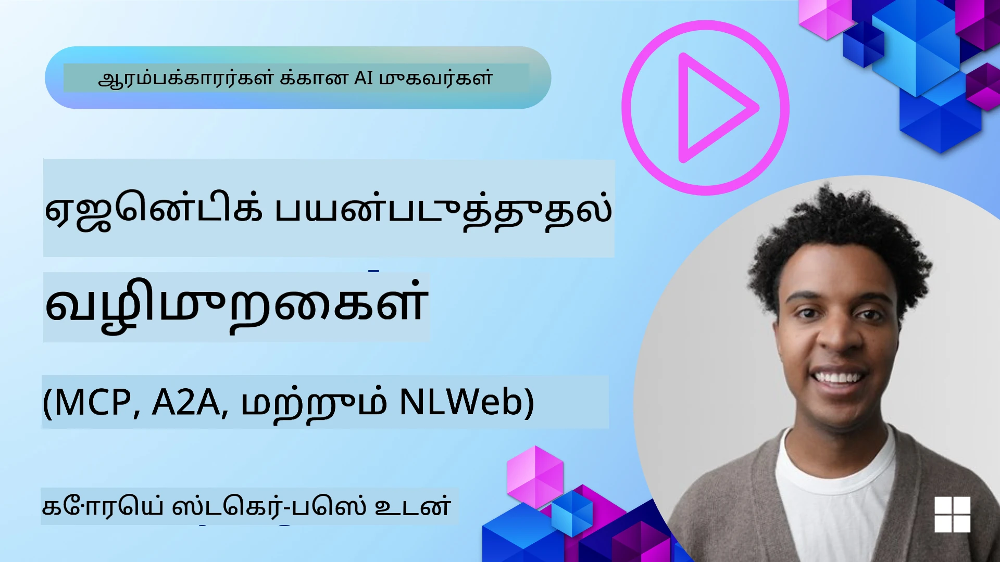
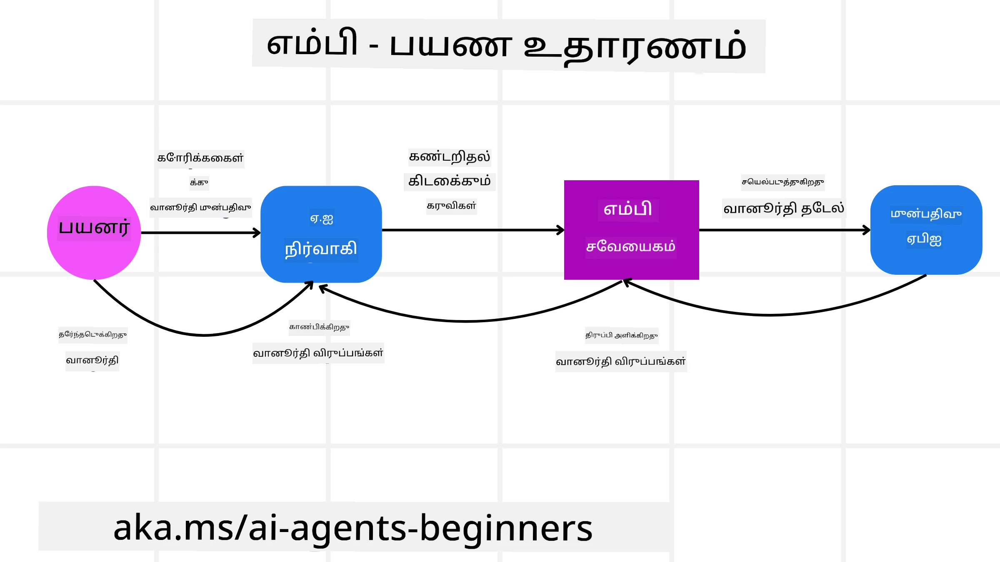
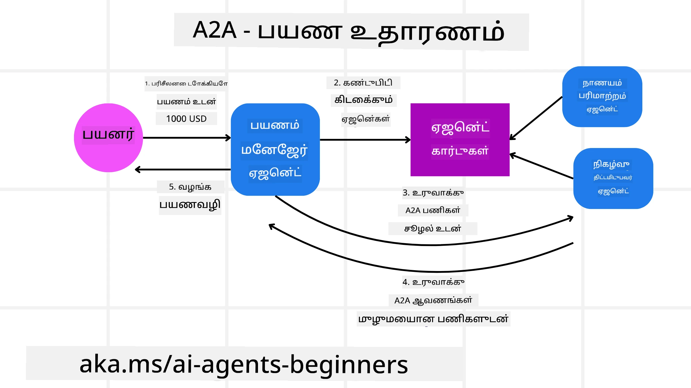
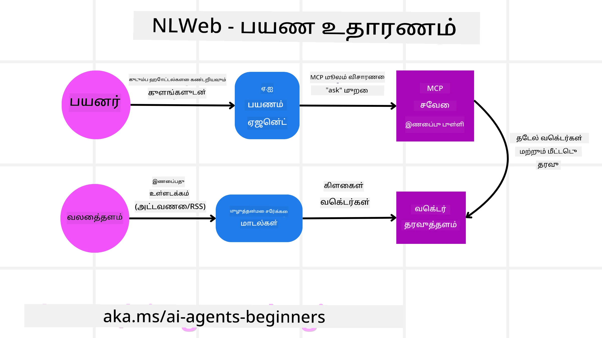

# ஏஜென்டிக் நெறிமுறைகளைப் பயன்படுத்துதல் (MCP, A2A மற்றும் NLWeb)

> _(மேலுள்ள படத்தை கிளிக் செய்து இந்த பாடத்தின் வீடியோவை பார்க்கவும்)_

ச künstை நுண்ணறிவு ஏஜென்ட்களின் பயன்பாடு விரிவடையும் போது, ஸ்டாண்டர்டைசேஷன், பாதுகாப்பு மற்றும் திறந்த புதுமைக்கு ஆதரவு தரும் நெறிமுறைகளின் தேவையும் அதிகமாகிறது. இந்த பாடத்தில், நாம் இந்த தேவையை பூர்த்தி செய்ய முயலுகிற 3 நெறிமுறைகளை காணப்போகிறோம் - Model Context Protocol (MCP), Agent to Agent (A2A) மற்றும் Natural Language Web (NLWeb).

## அறிமுகம்

இந்த பாடத்தில் நாம் கையாளப்போகும் விஷயங்கள்:

• எவ்வாறு **MCP** செயற்கை நுண்ணறிவு ஏஜென்ட்களுக்கு புற கருவிகள் மற்றும் தரவுகளை அணுக அனுமதித்து பயனர் பணிகளை நிறைவேற்ற உதவுகிறது.

• எவ்வாறு **A2A** வெவ்வேறு ஏஜென்டுகளுக்கு இடையேயான தொடர்பு மற்றும் ஒத்துழைப்பை சாத்தியமாக்குகிறது.

• எவ்வாறு **NLWeb** எந்தவொரு இணையதளத்திற்கும் இயல்பான மொழி இடையீடுகளை கொண்டு வந்தால், AI ஏஜென்டுகள் செய்தியை கண்டறிந்து அதிலுடன் தொடர்பு கொள்ள முடியும்.

## கற்றல் இலக்குகள்

• **அறியவும்** AI ஏஜென்ட்களின் சூழலில் MCP, A2A மற்றும் NLWeb ஆகியவற்றின் முதன்மை நோக்கம் மற்றும் நன்மைகளை.

• **விளக்கவும்** ஒவ்வொரு நெறிமுறையும் எவ்வாறு LLMகள், கருவிகள் மற்றும் பிற ஏஜென்டுகளுக்கு இடையில் தொடர்பு மற்றும் தொடர்பாடலை எளிதாக்குகிறது என்பதனை.

• **குறிப்பிட்டு அறியவும்** சிக்கலான ஏஜென்டிக் அமைப்புகளை கட்டமைக்க ஒவ்வொரு நெறிமுறையும் வகிக்கும் வேறுபட்ட பங்களிப்புகளை.

## Model Context Protocol

**Model Context Protocol (MCP)** என்பது பயன்பாடுகள் LLMகளுக்கு சூழல் மற்றும் கருவிகளை வழங்க ஒரு ஸ்டாண்டர்டைஸ்டான வழியைக் கொடுக்கும் திறந்த தரநிலையாகும். இது பல்வேறு தரவுத்தளங்கள் மற்றும் கருவிகளுக்கு ஒரு "பரஸ்பர இணைப்பாளியை" (universal adaptor) வழங்கி, AI ஏஜென்டுகள் ஒரே மாதிரியான முறையில் இணைக்கலாம்.

MCP இன் கூறுகளை, நேரடி API பயன்பாட்டோடு ஒப்பிடுகையில் கிடைக்கும் நன்மைகளை மற்றும் AI ஏஜென்டுகள் எவ்வாறு MCP சேவையகத்தை பயன்படுத்தலாம் என ஒரு எடுத்துக்காட்டை பார்க்கலாம்.

### MCP மூல கூறுகள்

MCP ஒரு **கிளையன்-சர்வர் स्थापகதியில்** இயங்குகிறது மற்றும் மூல கூறுகள்:

• **Hosts** என்பது MCP Server-க்கு தொடர்புகளை துவக்கும் LLM பயன்பாடுகள் (உதாரணத்திற்கு VSCode போன்ற ஒரு குறிச்சொல் தொகுப்பி).

• **Clients** என்பது ஹோஸ்ட் பயன்பாட்டின் உள்ளக கூறுகள், அவை சர்வர்களுடன் ஒற்றை-பருமன் (one-to-one) தொடர்புகளை பராமரிக்கிறது.

• **Servers** என்பது குறிப்பிட்ட திறன்களை வெளிப்படுத்தும் இலகுவான நிரல்கள்.

இந்த நெறிமுறையில் ஒரு MCP Server உடைய மூன்று முக்கிய இயல்புகள் உள்ளன:

• **Tools**: இவை ஒரு AI ஏஜென்ட் அழைக்கக் கூடிய தனித்தானி செயல்கள் அல்லது செயல்பாடுகள். உதாரணமாக, ஒரு வானிலை சேவை "get weather" என்ற ஒரு கருவியை வெளிப்படுத்தலாம், அல்லது ஒரு மின் வர்த்தக சர்வர் "purchase product" என்ற கருவியை வெளிப்படுத்தலாம். MCP சர்வர்கள் ஒவ்வொரு கருவியின் பெயர், விளக்கம் மற்றும் உள்ளீடு/வெளியீடு ஸ்கீமாவை தங்களின் திறன்கள் பட்டியலில் அறிவிக்கின்றன.

• **Resources**: இவை MCP சர்வர் வழங்கக்கூடிய படிப்பதற்குரிய மட்டும்-படித்தல் தரவுச்செய்திகள் அல்லது ஆவணங்கள், மற்றும் கிளையண்டுகள் அவற்றை தேவைக்கேற்ப பிரాప్తி செய்யலாம். உதாரணங்கள்: கோப்பு உள்ளடக்கங்கள், தரவுத்தள பதிவுகள், அல்லது லாக் கோப்புகள். Resources என்பது உரை (குறிசொற்கள் அல்லது JSON போன்ற) அல்லது துவிய (படங்கள் அல்லது PDF-கள் போன்ற) ஆக இருக்கலாம்.

• **Prompts**: இவை முன்கூட்டியே நிர்ணயிக்கப்பட்ட மாதிரிபாட்டுகள், மேலும் சிக்கலான வேலைநிரல்களை மேற்கொள்ள பரிந்துரை செய்யப்பட்ட ப்ராம்ட்ஐ வழங்குகின்றன.

### MCP நன்மைகள்

MCP AI ஏஜென்டுகளுக்கு குறிப்பிடத்தக்க பலன்களை வழங்குகிறது:

• **தினாமிக் கருவி கண்டறிதல்**: ஏஜென்டுகள் சர்வரிடமிருந்து கிடைக்கும் கருவிகளின் பட்டியலை மற்றும் அவற்றின் விளக்கங்களைக் கால்ங்க் பெற முடியும். இது வழக்கமான API-கள் கொண்டிருக்கக் கூடிய நிலையான ஒருங்கிணைப்புகளைத் தாழ வைத்துக் கொள்ளாமல், API மாற்றம் ஏற்பட்டால் குறியீடு புதுப்பிப்புகளை தேவையாக்கும் பொது முலமையாக இருக்காது. MCP ஒரு "ஒருமுறை ஒருங்கிணை" அணுகுமுறையை வழங்கி, மேலும் தகுதிசார் התאக்தியை ஏற்படுத்துகிறது.

• **விதவமைதியான LLMகளுக்கு இடையிலான இணக்கமுடிவு**: MCP வெவ்வேறு LLMகளுக்கு வேலை செய்யும், சிறந்த செயல்திறனுக்காக மைய மாதிரிகளை மாற்றுவதற்கு அலட்சியம் தரும்.

• **ஸ்டாண்டர்டைஸ்டான பாதுகாப்பு**: MCP ஒரு ஸ்டாண்டர்டு அங்கீகார முறையை உள்ளடக்கியதாக இருக்கிறது, மேலும் கூடுதலாக MCP சர்வர்கள் அணுகலைச் சேர்க்கும் போது அளவிடத்தக்கதாகும். இது பல வகையான பாரம்பரிய API-களுக்கான வெவ்வேறு விசைகள் மற்றும் அங்கீகார முறைகளை நிர்வகிப்பதை விட எளிமையாக உள்ளது.

### MCP எடுத்துக்காட்டு

ஒரு பயனர் MCP-மூல சக்தியுள்ள ஒரு AI உதவியாளரை பயன்படுத்தி விமானத்தை முன்பதிவு செய்ய விரும்புகிறது என்று கற்பனை செய்க.

1. **தொடர்பு**: AI உதவியாளர் (MCP கிளையண்ட்) ஒரு விமான நிறுவனத்தால் வழங்கப்பட்ட MCP சர்வருடன் இணைகிறது.

2. **கருவி கண்டறிதல்**: கிளையண்ட் விமான நிறுவனத்தின் MCP சர்வரிடம், "What tools do you have available?" என்று கேட்கிறது. சர்வர் "search flights" மற்றும் "book flights" போன்ற கருவிகளை பதிலளிக்கிறது.

3. **கருவி அழைப்பு**: பின்னர் நீங்கள் AI உதவியாளரிடம், "Please search for a flight from Portland to Honolulu." என்று கேட்கலாம். AI உதவியாளர், அதன் LLM ஐப் பயன்படுத்தி, "search flights" கருவியை அழைக்கவேண்டுமென்று அடையாளம் காண்கிறது மற்றும் தொடர்புடைய அளவுருக들을 (origin, destination) MCP சர்வருக்கு அனுப்புகிறது.

4. **செயலாக்கம் மற்றும் பதில்**: MCP சர்வர் ஒரு மரபு-அடைந்த முறையாக செயல்படக்கூடியதாக, விமான நிறுவனத்தின் உள்ளக முன்பதிவு API க்கு உண்மையான கேபனைக் விடுகிறது. பின்னர் அது விமானத் தகவலை (உதா., JSON தரவு) பெற்றுவிட்டு AI உதவியாளருக்குத் திருப்பி அனுப்புகிறது.

5. **மறுசெயல்பாடு**: AI உதவியாளர் விமான விருப்பங்களை வழங்குகிறது. நீங்கள் ஒரு விமானத்தை தேர்வு செய்தவுடன், உதவியாளர் அதே MCP சர்வரில் "book flight" கருவியை அழைக்கலாம் மற்றும் முன்பதிவை நிறைவேற்றலாம்.

## Agent-to-Agent Protocol (A2A)

MCP LLMகளை கருவிகளுடன் இணைக்க கவனம் செலுத்தும் முறையில் இருக்கும்பொழுது, **Agent-to-Agent (A2A) protocol** ஒரு அடுக்கு மேலாக சென்று வெவ்வேறு AI ஏஜென்டுகளுக்கு இடையிலான தொடர்பு மற்றும் ஒத்துழைப்பை சாத்தியமாக்குகிறது. A2A வெவ்வேறு நிறுவனங்கள், சூழல்கள் மற்றும் தொழில்நுட்பத் தளங்களில் இருக்கும் AI ஏஜென்டுகளை இணைத்து ஒரு பகிரப்பட்ட பணியை நிறைவேற்றம் செய்கிறது.

நாம் A2A இன் கூறுகள் மற்றும் நன்மைகள் மற்றும் பயணத்துக்கான செயலியில் அது எவ்வாறு பயன்படக்கூடும் என்பதன் எடுத்துக்காட்டை ஆராய்வோம்.

### A2A மூல கூறுகள்

A2A ஏஜென்டுகளுக்கு இடையிலான தொடர்பை மற்றும் அவற்றின் இணைந்த செயல்பாட்டை எடுக்க கவனம் செலுத்துகிறது. நெறிமுறையின் ஒவ்வொரு கூறும் இதில் பங்களிக்கிறது:

#### ஏஜென்ட் கார்டு

MCP சர்வர் கருவிகளின் பட்டியலை பகிர்ந்துகொள்ளும் முறையில் ஒத்திருக்க, ஒரு Agent Card இல் உள்ளவை:
- ஏஜென்டின் பெயர்.
- அது நிறைவேற்றும் பொது பணிகளின் **விளக்கம்**.
- பிற ஏஜென்டுகள் (அல்லது மனித பயனர்கள்) எப்போது மற்றும் ஏன் அந்த ஏஜென்டையை அழைக்க வேண்டும் என்பதை புரிந்துகொள்ள உதவும் **குறிப்பிட்ட திறன்களின் பட்டியல்** மற்றும் அவற்றின் விளக்கங்கள்.
- ஏஜென்டின் **தற்போதைய Endpoint URL**
- ஏஜென்டின் **பதிப்பு** மற்றும் **திறன்கள்** போன்றவை, உதாரணமாக ஸ்ட்ரீமிங் பதில்கள் மற்றும் புஷ் அறிவிப்புகள்.

#### ஏஜென்ட் எக்ஜிக்யூட்டர்

Agent Executor என்பது **பயனர் உரையாடலின் சூழலை தொலைதூர ஏஜென்டுக்கு அனுப்புவதற்கான பொறுப்பாளர்**. தொலைதூர ஏஜென்ட் இந்த பணியை புரிந்துகொள்வதற்காக இதை தேவைபடும். ஒரு A2A சர்வரில், ஒரு ஏஜென்ட் தன்னை வேண்டுமானால் வரவேற்கும் கோரிக்கைகளை பகுப்பாய்வு செய்ய மற்றும் தனது உள் கருவிகளைப் பயன்படுத்தி பணிகளை செயல்படுத்த அதன் சொந்த Large Language Model (LLM) ஐப் பயன்படுத்துகிறது.

#### ஆர்டிஃபாக்ட்

ஒரு தொலைதூர ஏஜென்ட் கோரப்பட்ட பணியை முடித்தவுடன், அதன் வேலைப்பொருள் ஒரு ஆர்டிஃபாக்ட் என்று உருவாக்கப்படுகிறது. ஒரு ஆர்டிஃபாக்ட் **ஏஜென்டின் வேலைக்கான முடிவை**, **முடிக்கப்பட்டதை குறித்து ஒரு விளக்கத்தை**, மற்றும் நெறிமுறையிலோடு அனுப்பப்பட்ட **உரை சூழலை** உள்ளடக்கியது. ஆர்டிஃபாக்ட் அனுப்பப்பட்ட பிறகு, தொலைதூர ஏஜென்டுடன் இணைப்பு மீண்டும் தேவைப்படும்வரை மூடப்படுகிறது.

#### நிகழ்வு வரிசை (Event Queue)

இந்த கூறு **புதுப்பிப்புகளை நிர்வகிக்கவும் செய்திகளை முன்னெடுக்கவும்** பயன்படுகிறது. பணியின் நிறைவு நீண்ட நேரம் எடுத்துக் கொள்ளக்கூடிய போது, ஏஜென்டுகளுக்கிடையிலான இணைப்பு பணியிலிருந்து முன்னர் மூடப்படுவதைத் தவிர்க்க இது தயாரிப்பில் முக்கியத்துவம் வாய்ந்தது.

### A2A நன்மைகள்

• **மல்டிபிள் ஏஜென்ட் ஒத்துழைப்பு**: பல்வேறு விற்பனையாளர்கள் மற்றும் தளங்களில் இருந்து ஏஜென்டுகள் தொடர்பு கொண்டு, சூழலைப் பகிர்ந்து, ஒன்றாக வேலை செய்ய முடியும், பழைய வகையில் தொடர்பில்லாத அமைப்புகளில் தொடர்ச்சியான தானியக்கத்தை சாத்தியமாக்குகிறது.

• **மாதிரி தேர்வு நெகிழ்தன்மை**: ஒவ்வொரு A2A ஏஜென்டும் அதன் கோரிக்கைகளை சேவையளிக்க எந்த LLM ஐப் பயன்படுத்த வேண்டும் என்பதைத் தீர்மானிக்க முடியும், இது ஒவ்வொரு ஏஜென்டுக்காக சீரமைக்கப்பட்ட அல்லது சிறுகைப்படுத்தப்பட்ட மாதிரிகளை பயன்படுத்த அனுமதிக்கிறது, சில MCP நிலைகளில் காணப்படும் ஒரே LLM இணைப்புக்கு மாறாக.

• **நிறைந்த அங்கீகாரம்**: அங்கீகாரம் நேரடியாக A2A நெறிமுறையில் ஒருங்கினைந்துள்ளது, ஏஜென்ட் தொடர்புகளுக்கான வலுவான பாதுகாப்பு கட்டமைப்பை வழங்குகிறது.

### A2A எடுத்துக்காட்டு

நம் பயண முன்பதிவு சூழலை விரிவாக எடுத்துக்கொண்டால், இப்போது A2A பயன்படுத்தி எப்படி இருக்கும் என்பதை பார்ப்போம்.

1. **பயனர் கோரிக்கை பல-ஏஜென்ட்**: ஒரு பயனர் "Travel Agent" A2A கிளையண்ட்/ஏஜென்டுடன் தொடர்பு கொண்டு, "Please book an entire trip to Honolulu for next week, including flights, a hotel, and a rental car" என்று கூறலாம்.

2. **Travel Agent மூலம் ஒர்கெஸ்ட்ரேஷன்**: Travel Agent இந்த சிக்கலான கோரிக்கையைப் பெறுகிறது. அது அதன் LLM ஐப் பயன்படுத்தி பணியைப் பற்றி காரணம் போக்கி, அது பிற சிறப்பு ஏஜென்டுகளுடன் தொடர்பு கொள்ளவேண்டும் என்று தீர்மானிக்கிறது.

3. **ஏஜென்ட்-மீது-ஏஜென்ட் தொடர்பு**: Travel Agent பின்னர் A2A நெறிமுறையைப் பயன்படுத்தி "Airline Agent", "Hotel Agent", மற்றும் "Car Rental Agent" போன்ற கீழ் நோக்கிய ஏஜென்டுகளுடன் இணைகிறது; இவை வெவ்வேறு நிறுவனங்கள் உருவாக்கியவையாக இருக்கலாம்.

4. **வகுப்பு செய்யப்பட்ட பணியினை ஒப்படைப்பு**: Travel Agent இந்த சிறப்பு ஏஜென்டுகளுக்கு குறிப்பிட்ட பணிகளை அனுப்புகிறது (உதா., "Find flights to Honolulu," "Book a hotel," "Rent a car"). இந்நிற்கும் ஒவ்வொரு சிறப்பு ஏஜென்டும் தனது சொந்த LLMகளை இயக்கி மற்றும் அவற்றின் சொந்த கருவிகளை (இவை தாமாகவே MCP சர்வர்களாக இருக்க முடியும்) பயன்படுத்தி முன்பதிவின் தனித்தனி பகுதிகளைச் செயல்படுத்துகிறது.

5. **ஒன்றிணைந்த பதில்**: அனைத்து கீழ்வரிசை ஏஜென்டுகளும் அவர்களது பணிகளை முடித்தவுடன், Travel Agent பல்வேறு முடிவுகளை (விமான விவரங்கள், ஹோட்டல் உறுதிப்பத்திரம், கார் வாடகை முன்பதிவு) தொகுத்து பயனருக்குக் கலந்துரையாடல் முறைபோல உள்ள ஓர் முழுமையான பதிலை அனுப்புகிறது.

## Natural Language Web (NLWeb)

இணையதளங்கள் நீண்டகாலமாக பயனர்களுக்கு இணையத்தில் தகவல் மற்றும் தரவுகளுக்குச் செல்லும் பிரதான வழியாக இருந்துள்ளன.

நாம் NLWeb இன் வேறுபட்ட கூறுகள், NLWeb இன் நன்மைகள் மற்றும் எவ்வாறு நமது பயண செயலியில் NLWeb செயல்படுகிறது என்பதன் எடுத்துக்காட்டை பார்ப்போம்.

### NLWeb இன் கூறுகள்

- **NLWeb பயன்பாடு (Core Service Code)**: இயல்பான மொழி கேள்விகளை செயலாக்கும் அமைப்பு. இது பதில்களை உருவாக்க தளத்தின் வேறுவிதமான பகுதிகளை இணைக்கிறது. இதை ஒரு இணையதளத்தின் இயல்பான மொழி செயல்பாடுகளை இயக்கும் **எஞ்சினாக** நினைக்கலாம்.

- **NLWeb நெறிமுறை**: இது ஒரு இணையதளத்துடன் இயல்பான மொழி தொடர்புக்கு **அடிப்படை விதிகளின் தொகுப்பு**. இது பதில்களை JSON வடிவில் (பலமுறை Schema.org பயன்படுத்தி) திருப்பி அனுப்புகிறது. இதன் நோக்கம் “AI வலை”க்கான ஒரு எளிய அடித்தளத்தை உருவாக்குவதாகும், HTML இணையத்தை ஆவணங்களை பகிரவும் சாத்தியமடைய செய்ததைப் போலவே.

- **MCP Server (Model Context Protocol Endpoint)**: ஒவ்வொரு NLWeb அமைப்பும் ஒரு **MCP சர்வராக**வும் செயல்படுகிறது. அதாவது இது மற்ற AI முறைமைகளுக்கு கருவிகள் (உதாரணமாக “ask” முறை) மற்றும் தரவுகளை பகிர முடியும். செயல்பாட்டில், இது இணையதளத்தின் உள்ளடக்கத்தையும் திறன்களையும் AI ஏஜென்டுகளால் பயன்படுத்தக்கூடியவைகளாக மாற்றுகிறது, இணையதளத்தை பெரிய "ஏஜென்ட் சூழலுக்கு" ஒரு பகுதியாக மாற்றுகிறது.

- **எம்பெட்டிங் மாதிரிகள் (Embedding Models)**: இம்மாதிரிகள் இணையதள உள்ளடக்கத்தை செம்பி (vectors) என்று அழைக்கப்படும் எண்கணித பிரதிநிதிகளாக மாற்ற பயன்படுத்தப்படுகின்றன. இந்த வெக்டர்கள் கணினிகளால் ஒப்பிடக்கூடியவையாகவும் தேடக்கூடியவையாகவும் பொருளை பிடிக்கின்றன. அவைகள் ஒரு சிறப்பு தரவுத்தளத்தில் сақிக்கப்படுகின்றன, மற்றும் பயனர்கள் எந்த embedding மாதிரியை பயன்படுத்தவேண்டும் என்பதை தேர்வு செய்ய முடியும்.

- **வெக்டார் தரவுத்தளம் (Vector Database / Retrieval Mechanism)**: இந்த தரவுத்தளம் **இணையதள உள்ளடக்கத்தின் embeddings-ஐ சேமிக்கிறது**. யாராவது கேள்வி கேட்டால், NLWeb வேக்ட் தரவுத்தளத்தை சரிபார்த்து பொருத்தமான தகவல்களை விரைவில் கண்டறிகிறது. இது ஒத்திசைவு அடிப்படையில் வரிசைப்படுத்தப்பட்ட சாத்தியமான பதில்களின் ஒரு பட்டியலை வழங்குகிறது. NLWeb Qdrant, Snowflake, Milvus, Azure AI Search மற்றும் Elasticsearch போன்ற வெவ்வேறு வெக்டார் சேமிப்பு அமைப்புகளோடு வேலை செய்கிறது.

### NLWeb எடுத்துக்காட்டு

மீண்டும் நமது பயண முன்பதிவு இணையதளத்தை கருதுக, இப்போது அது NLWeb மூலம் இயக்கப்படுகிறது என்று நினைத்துப் பார்க்கலாம்.

1. **தரவு ஏற்றுதல்**: பயண இணையதளத்தின் υπάρத்தப்பட்ட பொருள் காடலாக்கள் (உதாரணத்திற்கு, விமான பட்டியல்கள், ஹோட்டல் விளக்கங்கள், சுற்றுலா தொகுப்புகள்) Schema.org பயன்படுத்தி வடிகட்டப்படுகின்றன அல்லது RSS ஊட்டங்களின் மூலம் ஏற்றப்படுகின்றன. NLWeb இன் கருவிகள் இந்த கட்டமைக்கப்பட்ட தரவைஇறக்கிச் சென்று, embeddings உருவாக்கி, அதை உள்ளூர் அல்லது தூர ஒழுங்கான வெக்டார் தரவுத்தளத்தில் சேமிக்கின்றன.

2. **மனிதன் இயல்பான மொழி கேள்வி**: ஒரு பயனர் இணையதளத்துக்கு சென்று, மெனுக்களைத் தேடுவதற்கு பதிலாக ஒரு உரையாடல் இடைமுகத்தில் টাইப் செய்யலாம்: "Find me a family-friendly hotel in Honolulu with a pool for next week".

3. **NLWeb செயலாக்கம்**: NLWeb பயன்பாடு இந்த கேள்வியை பெறுகிறது. அது கேள்வியை புரிந்துகொள்ள LLM-யை அணுகி அனுப்புகிறது மற்றும் ஒன்றே நேரத்தில் அதன் வெக்டார் தரவுத்தளத்தைக் கோர்ந்து பொருத்தமான ஹோட்டல் பட்டியல்களைக் தேடுகிறது.

4. **துல்லியமான முடிவுகள்**: LLM தரவுத்தளத்திலிருந்து பெறப்பட்ட தேடல் முடிவுகளைப் புரிந்துகொள்ள உதவுகிறது, "family-friendly", "pool", மற்றும் "Honolulu" என்ற நிபந்தனைகளை அடிப்படையாகக்க் கொண்டு சிறந்த பொருத்தங்களை அடையாளம் காணிறது, பின்னர் இயல்பான மொழி பதிலாக வடிவமைக்கிறது. முக்கியமாக, பதில் இணையதளத்தின் பொருள் பட்டியலிலிருந்து உண்மையான ஹோட்டல்களுக்கு குறிப்பிடுகிறது, உருவாக்கப்பட்ட தகவலைத் தவிர்க்கிறது.

5. **AI ஏஜென்ட் தொடர்பு**: NLWeb ஒரு MCP சர்வராக செயல்படுவதால், ஒரு வெளிப்புற AI பயண ஏஜென்ட் இந்த இணையதளத்தின் NLWeb நகலுடன் இணையலாம். பிறகு AI ஏஜென்ட் `ask("Are there any vegan-friendly restaurants in the Honolulu area recommended by the hotel?")` முறைத்தைப் பயன்படுத்தி நேரடியாக இணையதளத்தை கேட்கலாம். NLWeb நகல் இதையெல்லாம் செயற்படுத்தி, அதன் உணவக தகவல் தரவுத்தளத்தை (ஏற்றப்பட்டிருந்தால்) பயன்படுத்தி கட்டமைக்கப்பட்ட JSON பதிலைத் திருப்பி வழங்கும்.

### MCP/A2A/NLWeb பற்றி மேலும் கேள்விகள் உள்ளதா?

ஓருகூட்டமாக மற்ற கற்றுந் துறையினர்களுடன் சந்திப்பதற்காக, office hours-களுக்கு கலந்து கொள்ள மற்றும் உங்கள் AI ஏஜென்டுகளைப் பற்றிய கேள்விகளை கேட்க Microsoft Foundry Discord-இல் சேரவும்: https://aka.ms/ai-agents/discord

## ஆதாரங்கள்

- [MCP for Beginners](https://aka.ms/mcp-for-beginners)  
- [MCP Documentation](https://learn.microsoft.com/python/api/overview/azure/ai-projects-readme)
- [NLWeb Repo](https://github.com/nlweb-ai/NLWeb)
- [Microsoft Agent Framework](https://aka.ms/ai-agents-beginners/agent-framewrok)

---

<!-- CO-OP TRANSLATOR DISCLAIMER START -->
பொறுப்பின்மை:
இந்த ஆவணம் AI மொழிபெயர்ப்பு சேவையான Co-op Translator (https://github.com/Azure/co-op-translator) மூலம் மொழிபெயர்க்கப்பட்டுள்ளது. நாங்கள் துல்லியத்தைக் கண்டுபிடிக்க முயற்சி செய்கிறோம்; இருப்பினும் தானியங்கி மொழிபெயர்ப்புகளில் பிழைகள் அல்லது தவறுகள் இருக்கலாம் என்பதை தயவுசெய்து கவனத்தில் கொள்ளுங்கள். ஆவணத்தின் சொந்த மொழியிலுள்ள மூல பதிப்புதான் அதிகாரப்பூர்வமானதாகக் கருதப்பட வேண்டும். முக்கியமான தகவல்களுக்கு, தொழில்முறை மனித மொழிபெயர்ப்பாளர் மூலம் மொழிபெயர்ப்பு செய்யப்படுமாறு பரிந்துரைக்கப்படுகிறது. இந்த மொழிபெயர்ப்பு பயன்படுத்தப்பட்டதனால் ஏற்பட்ட بأي தவறான புரிதல்கள் அல்லது தவறான விளக்கங்களுக்காக நாங்கள் பொறுப்பேற்கமாட்டோம்.
<!-- CO-OP TRANSLATOR DISCLAIMER END -->