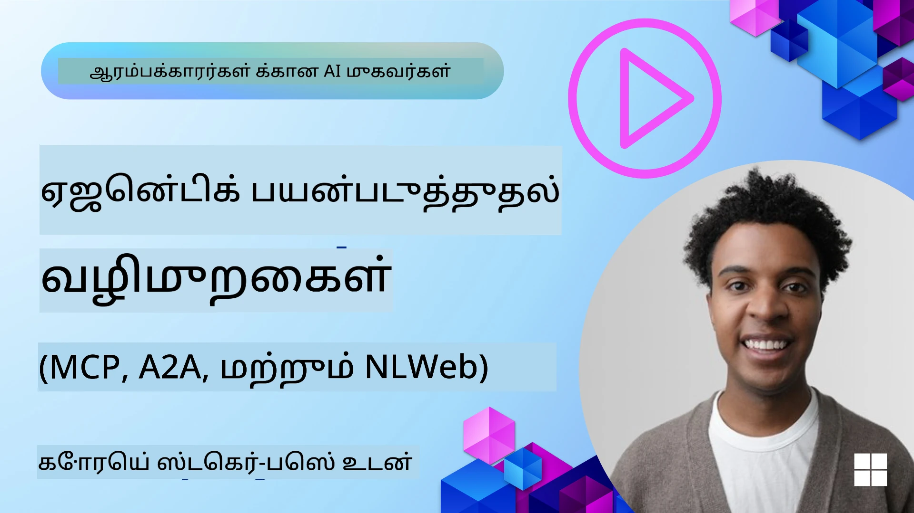
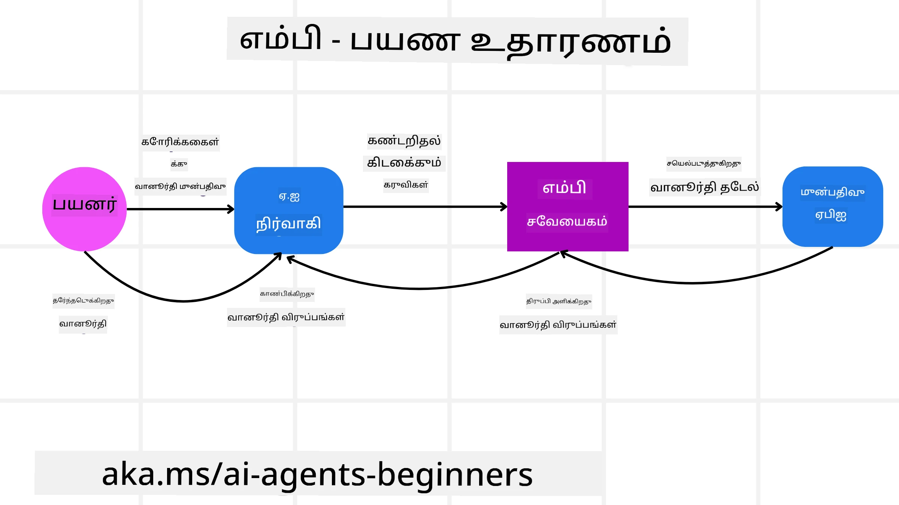
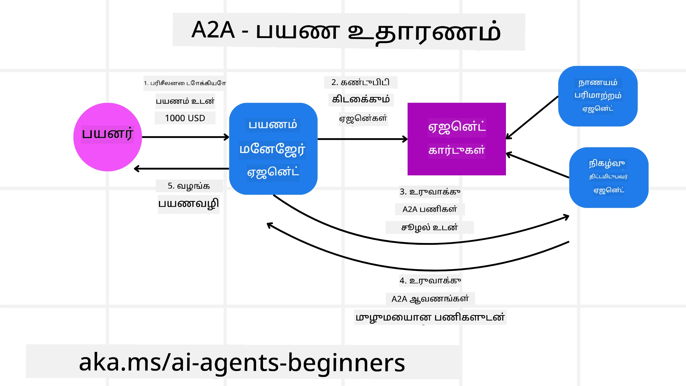
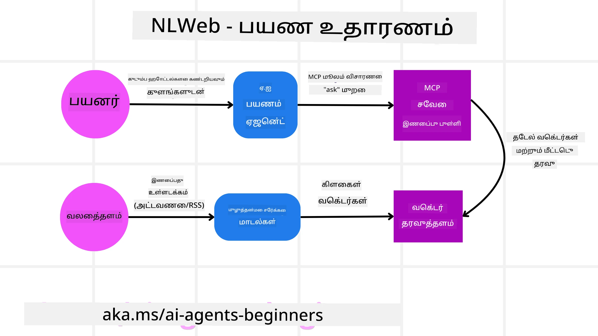

# ஏஜென்டிக் நெறிமுறைகளை பயன்படுத்துதல் (MCP, A2A மற்றும் NLWeb)

> _(இந்த பாடத்தின் வீடியோக்களைப் பார்ப்பதற்காக மேலுள்ள படத்தை அழுத்தவும்)_

AI ஏஜென்டுகளின் பயன்பாடு அதிகரிக்கும்போது, ஸ்தானியமைப்பு, பாதுகாப்பு, மற்றும் திறந்த புதுமையை ஆதரிக்கும் நெறிமுறைகளுக்கான தேவையும் அதிகரிக்கிறது. இந்த பாடத்தில், இந்த தேவையை பூர்த்தி செய்யும் 3 நெறிமுறைகள் குறித்து நாங்கள் பேசப்போகிறோம் - மாடல் நிகழ்ச்சி நெறிமுறை (MCP), ஏஜென்ட்-க்கு-ஏஜென்ட் (A2A) மற்றும் இயற்கை மொழி வலை (NLWeb).

## அறிமுகம்

இந்த பாடத்தில், நாம் அறிந்து கொள்வோம்:

• எவ்வாறு **MCP** AI ஏஜென்டுகளுக்கு புற உபகரணங்கள் மற்றும் தரவுகளை அணுக அனுமதிக்கிறது, பயனர் பணிகளை முடிக்க.

• எவ்வாறு **A2A** வித்தியாசமான AI ஏஜென்டுகளுக்கு இடையேயான தொடர்பும் கூட்டுச் செயல்பாட்டையும் எளிதாக்குகிறது.

• எவ்வாறு **NLWeb** இயற்கை மொழி இடைமுகங்களை எந்தவொரு இணையதளத்திலும் கொண்டுவருகிறது, AI ஏஜென்டுகள் உள்ளடக்கத்தை கண்டறிந்து தொடர்புகொள்ளக்கூடிய வகையில்.

## கல்வி குறிக்கோள்கள்

• AI ஏஜென்டுகள் பின்னணியில் MCP, A2A மற்றும் NLWeb இன் அடிப்படை நோக்கம் மற்றும் பயன்களை **அறிந்து கொள்**.

• ஒவ்வொரு நெறிமுறையும் LLMகள், உபகரணங்கள் மற்றும் பிற ஏஜென்டுகளுக்கு இடையேயான தொடர்பு மற்றும் ஒத்துழைப்பை எவ்வாறு ஏற்படுத்துகின்றன என்பதை **விளக்கு**.

• சிக்கலான ஏஜென்டிக் அமைப்புகளை உருவாக்க ஒவ்வொரு நெறிமுறையும் எவ்வாறு தனித்துவமான பங்கு வகிக்கின்றன என்பதை **அறிய**.

## மாடல் நிகழ்ச்சி நெறிமுறை

**மாடல் நிகழ்ச்சி நெறிமுறை (MCP)** என்பது பயன்பாடுகள் LLMகளுக்கு சொல்லுபொருள் மற்றும் உபகரணங்களை வழங்க ஒருங்கிணைந்த வழியை வழங்கும் திறந்த தரநிலையாகும். இது AI ஏஜென்டுகள் ஒரே மாதிரியில் பல்வேறு தரவுத் தளங்களுக்கும் உபகரணங்களுக்கும் இணைக்க முடியும் ஒரு "பல்வேறு வடிவி" ஆக செயல்படலாம்.

MCP உடைய கூறுகள், நேரடி API செயற்பாடு உடன் ஒப்பிடும் போது கிடைக்கும் நன்மைகள் மற்றும் AI ஏஜென்டுகள் MCP சேவையகம் எப்படி பயன்படுத்தலாம் என்பதற்கான உதாரணம் பற்றி பார்ப்போம்.

### MCP அடிப்படை கூறுகள்

MCP ஒரு **கிளையன்ட்-சேவையகம் கட்டமைப்பில்** இயங்குகிறது, மற்றும் அடிப்படை கூறுகள்:

• **ஹோஸ்ட்கள்** என்பது MCP சேவையகத்துடன் இணைப்பை தொடங்கும் LLM பயன்பாடுகள் (உதாரணமாக VSCode போன்ற குறியீட்டு ஆசிரியர்).

• **கிளையன்ட்கள்** என்பது ஹோஸ்ட் பயன்பாட்டுக்குள் உள்ள கூறுகள், சேவையகத்துடன் ஒற்றை-மீதான இணைப்புகளை பராமரிக்கின்றன.

• **சேவையகங்கள்** என்பது குறிப்பிட்ட செயல்பாடுகளை வெளிப்படுத்தும் எடை குறைந்த நிகழ்நிகழக்கையாகும்.

இந்த நெறிமுறையில் MCP சேவையகத்தின் திறனான மூன்று அடிப்படை வகைகள் உள்ளன:

• **உபகரணங்கள்**: இந்தவைகள் AI ஏஜென்ட் ஒரு செயல்பாட்டைச் செய்ய அழைக்கக்கூடிய தனிப்பட்ட செயல்கள். உதாரணமாக, காலநிலை சேவை "காலநிலை பெற" என்ற உபகரணத்தைக் காட்டலாம், அல்லது ஒரு ஈ-காமர்ஸ் சேவை "பொருள் வாங்க" உபகரணத்தைக் காட்டலாம். MCP சேவையகங்கள் ஒவ்வொரு உபகரணத்தின் பெயர், விளக்கம், உள்ளீடு/வெளியேற்ற வடிவத்தை தங்கள் திறன்களில் விளக்குகின்றன.

• **வளங்கள்**: அவை MCP சேவையகம் வழங்கக்கூடிய படிக்க மட்டுமே கூடிய தரவுகள் அல்லது ஆவணங்கள், மற்றும் கிளையன்ட்கள் அவற்றை தேவையான நேரத்தில் பெற முடியும். உதாரணக்கானாக கோப்பு உள்ளடக்கம், தரவுத்தளம் பதிவுகள் அல்லது பதிவுத் கோப்புகள். வளங்கள் உரை (குறியீடு அல்லது JSON போன்ற) அல்லது பைனரி (படங்கள் அல்லது PDF போன்ற) இருக்கலாம்.

• **உத்திரவுகள்**: முன்பதிவு செய்யப்பட்ட வார்ப்புருக்கள், சிக்கலான பணிகள் செய்ய பரிந்துரைக்கப்படும் உத்திரவுகளை வழங்குகின்றன.

### MCP பயன்கள்

MCP AI ஏஜென்டுகளுக்கு குறிப்பிடத்தகுந்த பலன்களை வழங்குகிறது:

• **செயலாக்கும் உபகரண கண்டறிதல்**: ஏஜென்டுகள் சேவையகத்திலிருந்து கிடைக்கும் உபகரணங்களின் பட்டியலை மற்றும் அவற்றின் விளக்கத்தையும் நேரடியாக பெறலாம். இது சಾಂப்ரதாய APIs உடன் வித்தியாசமாகும், அவை ஒருமுறை இணைப்புக்காக நிலையான குறியீட்டு மாற்றங்களை தேவைப்படுத்துகிறது. MCP "ஒருமுறை ஒருங்கிணைப்பு" முறையைக் கொடுத்து அதிக சிக்கல்களை சமாளிக்க உதவுகிறது.

• **பல்வேறு LLMகளைத் தாண்டி உடன்படிக்கை**: MCP பல்வேறு LLMகளுடன் செயல்படுகிறது, மேம்படுத்தப்படக்கூடிய செயல்திறனுக்கு சக்திவாய்ந்த அடிப்படையை வழங்குகிறது.

• **ஸ்தானிய பாதுகாப்பு**: MCP முறையில் ஒரு நிலையான அங்கீகார முறை உள்ளது, கூடுதலான MCP சேவையகங்களுக்கான அணுகலை விரிவாக்குவதற்கான எளிமையான முறையாகும். இது பல்வேறு சான்றிதழ்கள் மற்றும் அங்கீகார முறைகளைக் கையாள்வதை விட எளிதாகும்.

### MCP உதாரணம்

ஒரு பயனர் MCP மூலம் இயக்கப்படும் AI உதவியாளரை பயன்படுத்தி விமானம் முன்பதிவு செய்ய விரும்புகிறான் என்று கோபுரம் கொள்வோம்.

1. **இணைப்பு**: AI உதவியாளர் (MCP கிளையன்ட்) விமான நிறுவனத்தின் MCP சேவையகத்துடன் இணைகிறது.

2. **உபகரண கண்டறிதல்**: கிளையன்ட் விமான நிறுவனத்தின் MCP சேவையகத்திடம் "உங்களுக்கு எந்த உபகரணங்கள் உள்ளன?" என்று கேட்கிறது. சேவையகம் "விமானங்களை தேடு" மற்றும் "விமானத்தை முன்பதிவு செய்" போன்ற உபகரணங்களை பதிலளிக்கிறது.

3. **உபகரண அழைப்பு**: நீங்கள் AI உதவியாளரிடம் "போர்ட்லாந்திடமிருந்து ஹனொலூத்து வரை விமானத்தைத் தேடு" என்று சொல்கிறீர்கள். AI உதவியாளர் அதனுடைய LLM மூலம் "விமானங்களை தேடு" உபகரணத்தை அழைக்க தேவையான அளவு அளவுருக்களுடன் MCP சேவையகத்துக்கு அனுப்புகிறது.

4. **செயற்பாடு மற்றும் பதில்**: MCP சேவையகம் விமான நிறுவனத்தின் உள்ளக முன்பதிவு API ஐ அழைக்கிறது. அதன் மூலம் விமான தகவலை (எ.கா., JSON தரவு) பெறுகிறது மற்றும் AI உதவியாளருக்கு அனுப்புகிறது.

5. **மேலும் தொடர்பு**: AI உதவியாளர் விமான தேர்வுகளை வழங்குகிறது. ஒருவர் ஒரு விமானத்தை தேர்ந்தெடுத்ததும், உதவியாளர் அந்த வர்த்தகர் MCP சேவையகத்தில் "விமானத்தை முன்பதிவு செய்" உபகரணத்தை அழைத்து முன்பதிவை முடிக்கக்கூடும்.

## ஏஜென்ட்-க்கு-ஏஜென்ட் நெறிமுறை (A2A)

MCP LLMகளை உபகரணங்களுடன் இணைப்பதில் கவனம் செலுத்தும் போது, **ஏஜென்ட்-க்கு-ஏஜென்ட் (A2A) நெறிமுறை** வேறு AI ஏஜென்டுகளுக்கிடையேயான தொடர்பு மற்றும் கூட்டுப் பணிக்கு உதவுகிறது. A2A வித்தியாசமான நிறுவனங்கள், சூழல்கள் மற்றும் தொழில்நுட்ப மையங்களை கடந்து பொதுவான பணிகளை முடிக்க AI ஏஜென்ட்-களை இணைக்கின்றது.

A2A கூறுகள் மற்றும் பயன்கள் மற்றும் பயண பயன்பாட்டில் அதன் பயன்பாட்டை மீண்டும் பார்ப்போம்.

### A2A அடிப்படை கூறுகள்

A2A ஏஜென்டுகள் இடையேயான தொடர்பை செய்தி பரிமாற்றமாகவும், பயனர் துணைப் பணிகளை முடிக்க ஒன்றிணைப்பாகவும் இருக்க உதவுகிறது. நெறிமுறையின் ஒவ்வொரு கூறும் இதற்கு பங்களிக்கிறது:

#### ஏஜென்ட் அட்டை

MCP சேவையகம் உபகரண பட்டியலைப் பகிர்வதுபோல், ஏஜென்ட் அட்டையில்:
- ஏஜென்ட் பெயர்.
- அது முடிக்கின்ற பொதுவான பணிகளின் **விளக்கம்**.
- பிற ஏஜென்டுகளுக்கான (அல்லது மனித பயனர்களுக்கான) உதவிக்கு, ஏஜென்டை எப்பொழுது மற்றும் ஏன் அழைக்க விருப்பமிருக்கலாம் என்பதற்கான **குறிப்பிட்ட திறன்களின் பட்டியல்** மற்றும் விளக்கங்கள்.
- ஏஜென்ட் **தற்போதைய முடிவில் உள்ள URL**
- ஏஜென்ட் **பதிப்பு** மற்றும் **திறன்கள்** (உதாரணமாக பணிமாற்ற பதில்கள் மற்றும் அழுத்த அறிவிப்புகள்).

#### ஏஜென்ட் நிர்வாகி

ஏஜென்ட் நிர்வாகி பொறுப்புதவியாக **பயனர் உரையாடல் சொல்லப்பொருளை தொலைதூர ஏஜென்டுக்கு அனுப்புகிறது**, தொலைதூர ஏஜென்ட் பணியை புரிந்து கொள்ள இதனோடு வேண்டும். A2A சேவையகத்தில், ஒரு ஏஜென்ட் தனது சொந்த பெரிய மொழி மாதிரியமைப்பை (LLM) பயன்படுத்தி கோரிக்கைகளைப் புரிந்து கொண்டு சொந்த உபகரணங்களை அனுபவிக்கும்.

#### தொழில்பொருள்

தொலைதூர ஏஜென்ட் கோரப்பட்ட பணியை முடித்தவுடன், அதன் வேலை பொருள் ஒரு தொழில்பொருளாக உருவாக்கப்படுகிறது. தொழில்பொருள் **ஏஜென்டின் வேலை முடிவைக் குறிக்கிறது**, **முடிக்கப்பட்டதின் விளக்கம்**, மற்றும் **நெறிமுறையில் அனுப்பப்படும் உரைத்தொகுப்பு** அடங்கும். தொழில்பொருள் அனுப்பிய பிறகு தொலைதூர ஏஜென்டுடன் இணைப்பு மூடப்படும், மீண்டும் தேவைப்படும்போது திறக்கப்படும்.

#### நிகழ்வு வரிசை

இது **புதுப்பிப்புகளை கையாள்ந்து மற்றும் செய்திகளை அனுப்ப** பயன்படுத்தப்படுகிறது. ஏஜென்டுகளின் இணைப்புகள் பணிகள் ஆக முடியும்வரை மூடப்படாததை ஊக்குவிக்க முக்கியம், குறிப்பாக பணிகள் நிறைவாக நேரம் எடுத்துக்கொள்ளும் போது.

### A2A பயன்கள்

• **மேம்பட்ட கூட்டுப் பணிகள்**: வேறுபட்ட விற்பனையாளர் மற்றும் தளங்களின் ஏஜென்டுகளை தொடர்பு கொண்டு, சொல்லப்பொருள் பகிர்ந்து, ஒத்துழைக்க ஊக்குவிக்கிறது, வேறு முறையில் தனித்தனியே இயங்கும் அமைப்புகளை ஒருங்கிணைக்கிறது.

• **மாதிரி தேர்வு சுதந்திரம்**: ஒவ்வொரு A2A ஏஜென்டும் தனக்கு தேவையான LLM-ஐ தேர்வு செய்ய முடியும், இது ஒவ்வொரு ஏஜென்டுக்கும் தனிப்பயிற்றப்பட்ட அல்லது மேம்பாடான மாதிரிகளை பயன்படுத்த அனுமதிக்கிறது.

• **எண்ணெய் சான்றிதழ் உட்பொதிந்து உள்ளது**: அங்கீகாரம் நேரடியாக A2A நெறிமுறையில் ஒருங்கிணைக்கப்பட்டுள்ளது, ஏஜென்ட் தொடர்புகளுக்கு வலுவான பாதுகாப்பு சூழலை வழங்குகிறது.

### A2A உதாரணம்

தற்போது பயண முன்பதிவு உரையாடலை A2A பயன்படுத்தி விரிவாக்குவோம்.

1. **பயனர் கோரிக்கை பல-ஏஜென்ட் திறனுக்கு**: பயனர் "புற வீட்டும் ஹனொலூத்து பயணத்தை முழுமையாக முன்பதிவு செய், விமானம், ஹோட்டல், வாடகை காரை அதில் சேர்க்க" என்று சொல்லி "பயண ஏஜென்ட்" A2A கிளையன்ட்/ஏஜென்டுடன் தொடர்பு கொள்கிறான்.

2. **பயண ஏஜென்ட் ஒருங்கிணைப்பு**: பயண ஏஜென்ட் இந்த சிக்கலான கோரிக்கையை பெறுகிறது. அது LLM ஐ வைத்து பணியை பகுப்பாய்வு செய்து மற்ற சிறப்பு ஏஜென்டுகளுடன் தொடர்பு கொள்ளவேண்டும் என்று தீர்மானிக்கிறது.

3. **ஏஜென்ட் மத்தியில் தொடர்பு**: பயண ஏஜென்ட் பின்னர் A2A நெறிமுறையை பயன்படுத்தி கீழ் நிலை ஏஜென்டுகளான "விமான ஏஜென்ட்", "ஹோட்டல் ஏஜென்ட்", "கார் வாடகை ஏஜென்ட்" ஆகியவற்றுடன் இணைகிறது, அவை வெவ்வேறு நிறுவனங்களினால் உருவாக்கப்பட்டுள்ளன.

4. **பணி ஒதுக்கீடு**: பயண ஏஜென்ட் இங்கு குறிப்பிட்ட பணிகளை அவர்களைச் சார்ந்த சிறப்பு ஏஜென்டுகளுக்கு அனுப்புகிறது ("ஹனொலூத்து விமானங்களை கண்டறி," "ஹோட்டலை முன்பதிவு செய்," "காரை வாடகைக்கு எடு"). ஒவ்வொரு சிறப்பு ஏஜென்ட், தன் சொந்த LLM மற்றும் உபகரணங்களை (MCP சேவையகம் இவற்றாக இருப்பது கூடுதலாக) பயன்படுத்தி ப்ராஸஸை நிறைவு செய்கிறது.

5. **ஒருங்கிணைந்த பதில்**: கீழ் நிலை ஏஜென்டுகள் எல்லா பணிகளையும் நிறைவு செய்த பிறகு, பயண ஏஜென்ட் முடிவுகளை (விமான விவரங்கள், ஹோட்டல் உறுதிப்படுத்தல், கார் வாடகை முன்பதிவு) தொகுத்து பயனருக்கு உரையாடல் முறைப்போல பதில் அளிக்கிறது.

## இயற்கை மொழி வலை (NLWeb)

இணையத்தில் தகவல்களை அணுகுவதற்கான முதன்மை வழி இணையதளங்கள் ஆக இருக்கிறது.

NLWeb நெறிமுறையின் கூறுகள், அதன் பயன்கள் மற்றும் பயண பயன்பாட்டில் அதன் செயல்பாட்டை பார்ப்போம்.

### NLWeb கூறுகள்

- **NLWeb பயன்பாடு (மூலம் சேவை குறியீடு)**: இயற்கை மொழி கேள்விகளை செயல்படுத்தும் அமைப்பு. இது தளத்தின் பல்வேறு பகுதிகளையும் இணைக்கிறது மற்றும் பதில்களை உருவாக்குகிறது. இது **இணையதளத்தின் இயற்கை மொழி செயல்முறை இயந்திரமாக** செயல்படுகிறது.

- **NLWeb நெறிமுறை**: இணையதளத்துடன் இயற்கை மொழி தொடர்புக்கு **அடிப்படை விதிமுறைகள்** கொண்ட செட். இது பதில்களை JSON வடிவில் (பொதுவாக Schema.org ஐ பயன்படுத்தி) திருப்பி அனுப்புகிறது. இது “AI வலை” க்கு எளிய அடித்தளத்தை உருவாக்கும் நோக்கத்துடன், HTML ஆவண பகிர்வுக்கு வழி காட்டியது போல.

- **MCP சேவையகம் (மாடல் நிகழ்ச்சி நெறிமுறை முடிவுச் சுடர்)**: NLWeb ஒவ்வொரு அமைப்பும் MCP சேவையகமாகவும் செயல்படுகிறது. இதன் மூலம் இது மற்ற AI அமைப்புகளுடன் உபகரணங்கள் (எ.கா., “ask” முறை) மற்றும் தரவுகளை பகிர்கிறது. பரிசி, இணையதள உள்ளடக்கத்தை AI ஏஜென்டுகள் பயன்படுத்தக்கூடிய அமைப்பாக மாற்றுகிறது மற்றும் "ஏஜென்டு சூழல்" உடன் இணையதளத்தை இணைக்கிறது.

- **எம்பர் மாதிரிகள்**: இவை இணையதள உள்ளடக்கங்களை எண்கள் வடிவமான (வெக்டர் எனப்படும்) பிரதிநிதித்துவமாக மாற்ற பயன்படுகின்றன. இவை கணினிகள் பொருளை ஒப்பிட்டு தேட முடியும். இவை தனிப்பட்ட தரவுத்தளத்தில் சேமிக்கப்படுகின்றன, பயனர்கள் விரும்பிய எம்பர் மாதிரியை தேர்வு செய்யலாம்.

- **வெக்டர் தரவுத்தளம் (மீட்டெடுத் தொழில்)**: இந்த தரவுத்தளம் இணையதள உள்ளடக்கங்களின் எம்பெடிங்களை சேமிக்கிறது. யாராவது கேள்வி கேட்டால், NLWeb வெக்டர் தரவுத்தளத்தை பார்வையிடுகிறது மற்றும் தொடர்புடைய தகவலை விரைவாகக் கண்டுபிடிக்கிறது. இது விரைவான பதில்கள் பட்டியலை தருகிறது, ஒத்துபோகும் முறையில் வரிசைப்படுத்தி. NLWeb Qdrant, Snowflake, Milvus, Azure AI Search, மற்றும் Elasticsearch போன்ற வெக்டர் சேமிப்பு அமைப்புகளோடு வேலை செய்கிறது.

### NLWeb உதாரணம்

மீண்டும் ஒருமுறை பயண முன்பதிவு இணையதளத்தை எடுத்துக்கொள்வோம், இது இந்த முறை NLWeb மூலம் இயக்கப்படுகிறது.

1. **தரவு சேர்க்கை**: பயண இணையதளத்தின் இயல்புநிலை பொருள் பட்டியல்கள் (எ.கா., விமான பட்டியல், ஹோட்டல் விளக்கங்கள், சுற்றுலா தொகுப்புகள்) Schema.org மூலம் வடிவமைக்கப்பட்டோ அல்லது RSS மூலம் ஏற்றப்பட்டோ இருக்கும். NLWeb இன் உபகரணங்கள் இந்த கட்டமைக்கப்பட்ட தரவுகளை எண்பெடிங் ஆக மாற்றி உள்ளூர் அல்லது தொலைவுச் வெக்டர் தரவுத்தளத்தில் சேமிக்கின்றன.

2. **இயற்கை மொழி கேள்வி (மனிதன்)**: பயனர் இணையதளத்தை சந்தித்து, பட்டிகளை தேடவிடாமல், உரையாடல் இடைமுகத்தில் "அடுத்த வாரம் ஹனொலூத்து ஒரு குடும்ப நட்பு ஹோட்டலை நீர் குளியலறையுடன் கண்டுபிடி" என்று தட்டுகிறது.

3. **NLWeb செயலாக்கம்**: NLWeb பயன்பாடு இந்த கேள்வியை பெறுகிறது. இது கேள்வியை புரிந்து கொள்ள LLM க்கு அனுப்பி, அதே நேரத்தில் வெக்டர் தரவுத்தளத்திலும் ஹோட்டல் பட்டியலை தேடும்.

4. **திட்டமான முடிவுகள்**: LLM தரவுத்தளத்திலிருந்து தேடல் முடிவுகளை பொருள் பொருந்துமாறு விளக்குகிறது, "குடும்ப நட்பு", "குளியல்", "ஹனொலூத்து" போன்ற அளவுருக்களை வைத்து சிறந்த பொருத்தங்களை அடையாளம் காண்கிறது, பின்னர் இயற்கை மொழி பதிலை வடிவமைக்கிறது. முக்கியம், பதில் இணையதளத்தின் அஸல் தரவுத் தளத்திலிருந்து ஹோட்டல்களை குறிப்பிடுகிறது, உருவான அறிவிப்புகளை தவிர்ப்பது.

5. **AI ஏஜென்ட் தொடர்பு**: NLWeb MCP சேவையகமாக செயல்படும் என்பதால், வெளியிலிருந்து AI பயண ஏஜென்ட் இந்த இணையதளத்தின் NLWeb இயந்திரத்துடன் இணைகக்கூடும். AI ஏஜென்ட் `ask` MCP முறையை பயன்படுத்தி நேரடியாக வலைத்தளத்திடம் கேள்வி கேட்கலாம்: `ask("ஹனொலூத்து பகுதியில் ஹோட்டல் பரிந்துரைக்கப்பட்ட வேகன் உணவகங்கள் உள்ளதா?")`. NLWeb இந்த கேள்வியை செயலாக்கி பதிவு செய்துள்ள உணவகங்கள் தரவுத்தளத்தை பயன்படுத்தி கட்டமைக்கப்பட்ட JSON பதிலை வழங்கும்.

### MCP/A2A/NLWeb பற்றி இன்னும் கேள்விகள் உள்ளதா?

மற்ற கற்றுக்கொள்ளும் நபர்களுடன் கலந்துரையாட, அலுவலக நேரங்களில் பங்கேற்க மற்றும் AI ஏஜென்டுகள் குறித்த கேள்விகளை கேட்க [Microsoft Foundry Discord](https://discord.com/invite/ATgtXmAS5D) இல் 가입 செய்யவும்.

## வளங்கள்

- [தொடக்கர்களுக்கான MCP](https://aka.ms/mcp-for-beginners)  
- [MCP ஆவணங்கள்](https://learn.microsoft.com/python/api/overview/azure/ai-projects-readme)
- [NLWeb பட்டியல்](https://github.com/nlweb-ai/NLWeb)
- [Microsoft ஏஜென்ட் கட்டமைப்பு](https://learn.microsoft.com/en-us/agent-framework/overview/?wt.mc_id=youtube_26688_organicsocial_reactor&pivots=programming-language-python)

## முந்தைய பாடம்

[உற்பத்தியில் AI ஏஜென்டுகள்](../10-ai-agents-production/README.md)

## அடுத்த பாடம்

[AI ஏஜென்டுகளுக்கான நிகழ்ச்சி பொறியியல்](../12-context-engineering/README.md)

---

<!-- CO-OP TRANSLATOR DISCLAIMER START -->
**மறுப்பு**:
இந்த ஆவணம் AI மொழிபெயர்ப்பு சேவை [Co-op Translator](https://github.com/Azure/co-op-translator) பயன்படுத்தி மொழிபெயர்க்கப்பட்டுள்ளது. நாங்கள் துல்லியத்திற்காக முயற்சி செய்துள்ளோம், ஆனால் தானாக செய்யப்படும் மொழிபெயர்ப்புகளில் பிழைகள் அல்லது தவறுகள் இருக்கலாம் என்பதை கவனத்தில் கொள்ளவும். அசல் ஆவணம் அதன் தாய்மொழியில் அதிகாரப்பூர்வ ஆதாரமாக கருதப்பட வேண்டும். முக்கியமான தகவல்களுக்கு, தொழில்நுட்பமான மனித மொழிபெயர்ப்பு பரிந்துரைக்கப்படுகிறது. இந்த மொழிபெயர்ப்பைப் பயன்படுத்துவதால் ஏற்படும் எந்த தவறான புரிதல்கள் அல்லது தவறான விளக்கத்திற்கும் நாங்கள் பொறுப்பில்வில்லை.
<!-- CO-OP TRANSLATOR DISCLAIMER END -->