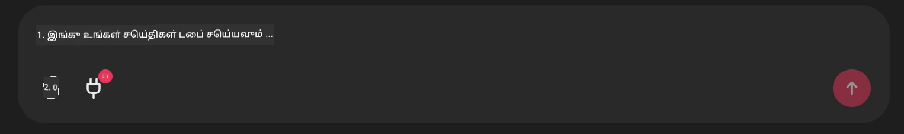

# Github MCP Server Example

## Description

This was a demo created for the AI Agents Hackathon hosted through the Microsoft Reactor.

The tools is used to recommend hackathon projects based on a user's Github repos.
This is done by:

1. **Github Agent** - Github MCP Server-ஐ பயன்படுத்தி ரெப்போக்களை மற்றும் அவற்றைப் பற்றிய தகவல்களை பெறுதல்.
2. **Hackathon Agent** - Github Agent-இலிருந்து வரும் தரவுகளை கொண்டு, பயனர் பயன்படுத்தும் மொழிகள் மற்றும் AI Agents hackathon இன் ப்ராஜெக்ட் டிராக்-களை அடிப்படையாகக் கொண்டு 창작மான ஹேக்கதான் திட்ட ஐடியாக்களை உருவாக்குதல்.
3. **Events Agent** - ஹேக்கதான் ஏஜெண்டின் பரிந்துரைகளை அடிப்படையாக கொண்டு, Events Agent AI Agent Hackathon தொடர் சார்ந்த தொடர்புடைய நிகழ்ச்சிகளை பரிந்துரைக்கும்.
## Running the code 

### Environment Variables

This demo uses Microsoft Agent Framework, Azure OpenAI Service, the Github MCP Server and Azure AI Search.

Make sure that you have the proper environment variables set to use these tools:

```python
AZURE_AI_PROJECT_ENDPOINT=""
AZURE_AI_MODEL_DEPLOYMENT_NAME=""
AZURE_SEARCH_SERVICE_ENDPOINT=""
AZURE_SEARCH_API_KEY=""
``` 

## Running the Chainlit Server

To connect to the MCP server, this demo use Chainlit as a chat interface. 

To run the server, use the following command in your terminal:

```bash
chainlit run app.py -w
```

This should start your Chainlit server on `localhost:8000` as well as populate your Azure AI Search Index with the `event-descriptions.md` content. 

## Connecting to the MCP Server

To connect to the Github MCP Server, select the "plug" icon underneath the "Type your message here.." chat box:



From there you can click on the "Connect an MCP" to add the command to connect to the Github MCP Server:

```bash
npx -y @modelcontextprotocol/server-github --env GITHUB_PERSONAL_ACCESS_TOKEN=[YOUR PERSONAL ACCESS TOKEN]
```

Replace "[YOUR PERSONAL ACCESS TOKEN]" with your actual Personal Access Token. 

After connecting, you should see a (1) next to the plug icon to confirm that its connected. If not, try restarting the chainlit server with `chainlit run app.py -w`.

## Using the Demo 

To start the agent workflow of recommending hackathon projects, you can type a message like: 

"Github பயனர் koreyspace க்கான ஹேக்கதான் திட்டங்களை பரிந்துரையிடுங்கள்"

The Router Agent will analyze your request and determine which combination of agents (GitHub, Hackathon, and Events) is best suited to handle your query. The agents work together to provide comprehensive recommendations based on GitHub repository analysis, project ideation, and relevant tech events.

---

<!-- CO-OP TRANSLATOR DISCLAIMER START -->
பொறுப்புமறுப்பு:
இந்த ஆவணம் AI மொழிபெயர்ப்பு சேவையாசிரியர் [Co-op Translator](https://github.com/Azure/co-op-translator) மூலம் மொழிபெயர்க்கப்பட்டுள்ளது. நாங்கள் துல்லியத்திற்காக முயற்சித்தாலும், தானியக்க மொழிபெயர்ப்புகளில் பிழைகள் அல்லது தவறான தகவல்கள் இடம்பெறக்கூடும் என்பதை தயவுசெய்து கவனத்தில் கொள்ளவும். அதன் மூல மொழியில் உள்ள ஆவணத்தை அதிகாரப்பூர்வமான மூலமாகக் கருத வேண்டும். முக்கியமான தகவலுக்கு, தொழில்முறை மனித மொழிபெயர்ப்பைப் பெற பரிந்துரைக்கப்படுகிறது. இந்த மொழிபெயர்ப்பின் பயன்பாட்டால் ஏற்படும் எந்த தவறான புரிதலுக்கோ அல்லது தவறான பொருள் விளக்கத்திற்கோ நாங்கள் பொறுப்பாற்றமாட்டோம்.
<!-- CO-OP TRANSLATOR DISCLAIMER END -->