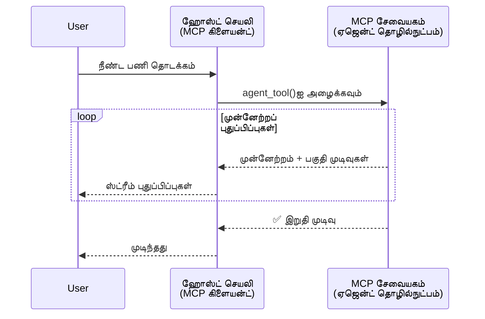
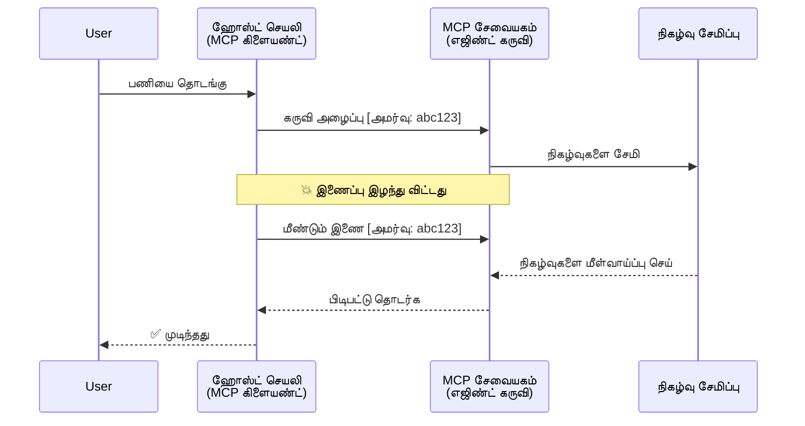
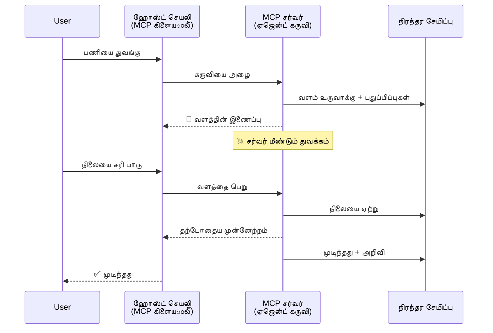
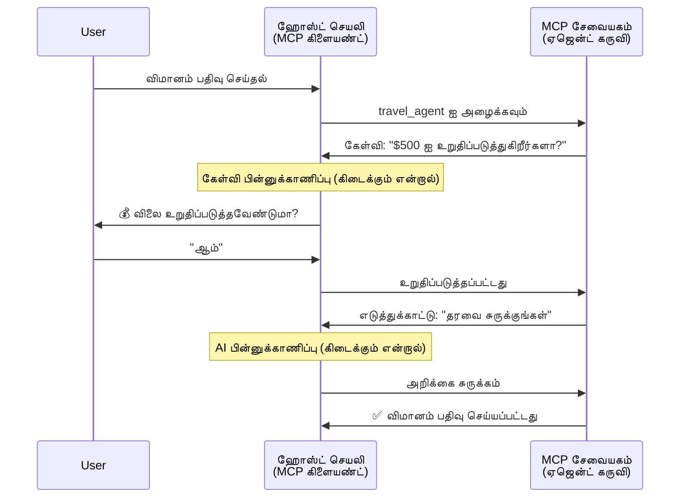
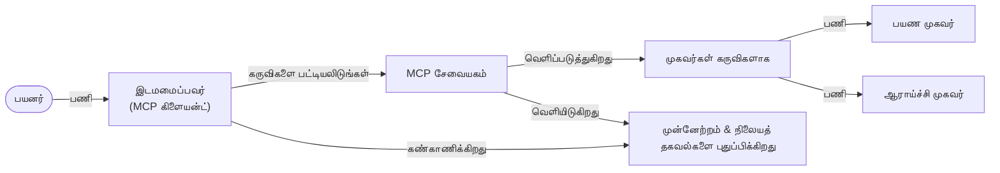

# MCP இயக்கியில் முகவர்-முகவர் தொடர்பு அமைப்புகளை கட்டமைத்தல்

> சுருக்கம் - நீங்கள் MCP இல் முகவர்2முகவர் தொடர்பை கட்டியமைக்க முடியுமா? ஆம்!

MCP தனது ஆரம்ப நோக்கமான "LLM களைச் சூழலில் வழங்குதல்" என்பதை மீறி பெரியதாக வளர்ந்துள்ளது. சமீபத்திய மேம்பாடுகளில் [மீண்டும் தொடக்கக்கூடிய ஸ்ட்ரீம்கள்](https://modelcontextprotocol.io/docs/concepts/transports#resumability-and-redelivery), [அழைப்பு](https://modelcontextprotocol.io/specification/2025-06-18/client/elicitation), [மாதிரிப்பெற்று](https://modelcontextprotocol.io/specification/2025-06-18/client/sampling), மற்றும் அறிவிப்புகள் ([முன்னேற்றம்](https://modelcontextprotocol.io/specification/2025-06-18/basic/utilities/progress) மற்றும் [வளங்கள்](https://modelcontextprotocol.io/specification/2025-06-18/schema#resourceupdatednotification)) ஆகியவையும் அடங்கியுள்ளன. இவை கலந்த MCP இல் சிக்கலான முகவர்-முகவர் தொடர்பு அமைப்புகளை உருவாக்க ஒரு வலுவான அடித்தளத்தை வழங்குகின்றன.

## முகவர்/கருவி தவறான புரிதல்

முகவர் பண்புகளுடன் கூடிய கருவிகளை (நீண்ட காலம் இயங்கும், நடுவில் கூடுதல் உள்ளீடுகள் தேவைப்படலாம் என்ற பாணியில்) ஆராய developers அதிகமாக உள்ளதால், ஒரு பொதுவான தவறான புரிதல் என்னவென்றால், MCP தொலைபேசி நிரல் முன்மாதிரிகள் சாத்தியமான கேட்கை-பதிவுக்கு மட்டும் செறித்திருந்ததால் MCP பொருத்தமில்லையென்று நினைக்கப்படுகிறார்கள்.

இந்த கருத்து பழையது. கடந்த சில மாதங்களில் MCP குறிப்புரு முக்கியமாக மேம்படுத்தப்பட்டு, நீண்டகால முகவர் பண்புகளை உருவாக்க வேறு திறன்கள் சேர்க்கப்பட்டுள்ளன:

- **ஸ்ட்ரீமிங் மற்றும் பகுதி முடிவுகள்**: செயல்படுத்தும் போது நேரடி முன்னேற்ற அறிவிப்புகள்
- **மீண்டும் தொடக்கக்கூடிய தன்மை**: இணைப்பு துண்டித்த பிறகு மீண்டும் இணைந்து தொடரும் திறன்
- **திடத்தன்மை**: முடிவுகள் சர்வர் மறுபடியும் துவங்குவதையும் தாண்டி உயிர்வாழும் (உதாரணமாக வள பகுதியின் இணைப்புகள் மூலம்)
- **பல சுற்றுகள்**: நடுவில் வெளிப்படுத்தும் மற்றும் மாதிரிப்பெற்ற மூலம் தொடர்புடைய உள்ளீடு

இந்த அம்சங்கள் ஒன்று சேர்ந்து சிக்கலான முகவர்களின் மற்றும் பல முகவர் செயல்முறைகளை உருவாக்க MCP இல் பயன்படுத்தப்படுகின்றன.

குறிப்பு: ஒரு முகவரியை MCP சர்வரில் கிடைக்கும் ஒரு "கருவி" எனக் கருதுவோம். இதன் மூலம் ஒரு ஹோஸ்ட் செயலி MCP கிளையண்ட்டை செயல்படுத்தி ஒரு அமர்வை MCP சர்வருடன் நிறுவி அந்த முகவரியை அழைக்க முடிகிறது என்பதைக் குறிக்கிறது.

## MCP கருவி எப்போது "முகவராக" கருதப்படுகிறது?

செயலாக்கத்தில் ஆழமாக நுழையாமலேயே, நீண்டகால முகவர்களை ஆதரிக்க எந்த அடித்தள திறன்கள் தேவை என்பதை தெளிவுபடுத்துவோம்.

> நீண்டகாலமாக சுயமாக இயங்கும், பல தொடர்புகள் அல்லது நேரடிக் கருத்தறிவுகளை அடிப்படையாக்கொண்டு சிக்கலான பணிகளை கையாளும் ஒரு சார்பான உறுப்பினராக முகவரை வரையறுக்கிறோம்.

### 1. ஸ்ட்ரீமிங் & பகுதி முடிவுகள்

பாரம்பரிய கேட்கை-பதிவு முறைகள் நீண்ட நாள்கள் இயங்கும் பணிகளுக்கு பொருத்தமில்லை. முகவர்களுக்கு தேவை:

- நேரடி முன்னேற்ற அறிவிப்புகள்
- இடைக்கால முடிவுகள்

**MCP ஆதரவு**: வள மேம்பாட்டு அறிவிப்புகள் பகுதி முடிவுகளை ஸ்ட்ரீம் செய்ய உதவுகிறது, ஆனால் JSON-RPC இன் 1:1 கேட்கை/பதிவு மாதிரியுடன் மோதாமலிருக்க கவனமாக வடிவமைக்க வேண்டும்.

| அம்சம்                   | பயன்பாட்டு நிலை                                                                                                  | MCP ஆதரவு                                                                |
| ----------------------- | -------------------------------------------------------------------------------------------------------------- | ------------------------------------------------------------------------- |
| நேரடி முன்னேற்ற அறிவிப்புகள் | பயனர் கோடு மாற்றும் பணியை கோருகிறது. முகவர் முன்னேற்றம் ஸ்ட்ரீம் செய்கிறது: "10% - சார்புகளை பகுப்பாய்வு... 25% - TypeScript கோப்புகளை மாற்றுவது... 50% - இறக்குமதி புதுப்பிப்பு..." | ✅ முன்னேற்ற அறிவிப்புகள்                                                   |
| பகுதி முடிவுகள்           | "ஒரு புத்தகத்தை உருவாக்குக" பணி பகுதி முடிவுகள் ஸ்ட்ரீம் செய்கிறது, உதாரணமாக: 1) கதை கட்டமைப்பு, 2) அத்தியாய பட்டியல், 3) ஒவ்வொரு அத்தியாயமும் முடிந்தவாறு. ஹோஸ்ட் எந்தவொரு கட்டத்திலும் ஆய்வு செய்யவும், ரத்து செய்யவும், மறுமுறை இயக்கவும் முடியும். | ✅ அறிவிப்புகள் பகுதி முடிவுகளுடன் விரிவாக்கமுடியும், PR 383, 776 இலுள்ள முன்மொழிவைப் பார்க்கவும் |

<div align="center" style="font-style: italic; font-size: 0.95em; margin-bottom: 0.5em;">
<strong>அங்கம் 1:</strong> இந்த வரைபடம் MCP முகவர் நீண்டகால பணிக்காலத்தில் நேரடி முன்னேற்ற அறிவிப்புகள் மற்றும் பகுதி முடிவுகளை ஹோஸ்ட் செயலியில் ஸ்ட்ரீம் செய்வதை விளக்குகிறது, பயனாளர் செயல்பாட்டை நேரடி முறையில் கண்காணிக்க உதவுகிறது.
</div>



### 2. மீண்டும் தொடக்கக்கூடிய தன்மை

முகவர்கள் நெட்வொர்க் துண்டிப்புகளை மென்மையாக கையாள வேண்டும்:

- துண்டித்த பிறகு மீண்டும் இணைக
- முன்னதாக இருந்த இடத்தில் இருந்து தொடர

**MCP ஆதரவு**: MCP StreamableHTTP போக்குவரத்து இப்போது அமர்வு மீண்டும் தொடக்கம் மற்றும் குறுஞ்செய்தி மீண்டும் வழங்கலை அமர்வு ஐடிக்கள் மற்றும் கடைசி நிகழ்வு ஐடிக்களை கொண்டு ஆதரிக்கிறது. முக்கியமானது, சர்வர் ஒரு EventStore ஐ செயல்படுத்த வேண்டும், இது கிளையண்ட் மீண்டும் இணைக்கும் போது நிகழ்வை மீண்டும் இயக்க உதவும்.  
சமுதாய முன்மொழிவு (PR #975) போக்குவரத்திற்கு பொதுக்கொள்கையை ஆராய்கிறது.

| அம்சம்        | பயன்பாட்டு நிலை                                                                                                    | MCP ஆதரவு                                                          |
| ------------ | -------------------------------------------------------------------------------------------------------------- | ------------------------------------------------------------------ |
| மீண்டும் தொடக்கக்கூடிய தன்மை | நீண்டகால பணி நடுவில் கிளையண்ட் துண்டிப்பு. மீண்டும் இணைப்பில், அமர்வு தொடருதல் மற்றும் தவறவிட்ட நிகழ்வுகள் மீண்டும் ஓடல், பணி பாதிப்பின்றி தொடர்கிறது. | ✅ StreamableHTTP போக்குவரத்து அமர்வு ஐடிகள், நிகழ்வு மீண்டும் ஓட்டல் மற்றும் EventStore கொண்டது |

<div align="center" style="font-style: italic; font-size: 0.95em; margin-bottom: 0.5em;">
<strong>அங்கம் 2:</strong> MCP இன் StreamableHTTP போக்குவரத்து மற்றும் நிகழ்வுப் பதிவு எவ்வாறு அமர்வு தொடர்ந்து மீண்டும் தொடங்க ஆக்குகிறது என்பதை விளக்கும் வரைபடம்: கிளையண்ட் துண்டித்தால் மீண்டும் இணைத்து தவறவிட்ட நிகழ்வுகளை மீண்டும் ஓட்டி, பணி பாதிப்பின்றி தொடர்கிறது.
</div>



### 3. திடத்தன்மை

நீண்டக்கால முகவர்கள் நிலையான மாநிலம் தேவை:

- முடிவுகள் சர்வர் மறுபடியும் துவக்கம் கடந்தும் உயிர்வாழும்
- நிலையை வெளிப்புறமாகக் பெற முடியும்
- அமர்வுகளில் முன்னேற்றத்தைத் தொடர்க

**MCP ஆதரவு**: MCP இப்போது கருவிக் அழைப்புகளுக்கு வள இணைப்பு (--resource link--) திரும்பவும் வகையை ஆதரிக்கிறது. இன்றைய நடைமுறை ஒரு கருவி ஒரு வளத்தை உருவாக்கி உடனடியாக வள இணைப்பை திரும்ப வழங்குவது. கருவி பின்னணி பணி தொடரவும், வளத்தை புதுப்பிக்கவும் முடியும். கிளையண்ட் இந்த வளத்தின் நிலையை ஆராய அல்லது அறிவுக்கான சந்தாவைப் பெற முடியும்.

ஒரு வரம்பு என்னவென்றால் வலைத்தள சங்கிலிஸ் அல்லது அறிவுக்கான சந்தா பற்றி விவாதங்கள் இருக்கிறது, பரிமாணத்தில் திறமையுடன் பயன்படுத்த கூடுதல் கவனம் தேவை.

| அம்சம்     | பயன்பாட்டு நிலை                                                                                                       | MCP ஆதரவு                                                      |
| ---------- | ----------------------------------------------------------------------------------------------------------------- | -------------------------------------------------------------- |
| திடத்தன்மை | தரவுத் மாற்றும் பணியில் சர்வர் இடைநிறுத்தம். முடிவுகள், முன்னேற்றம் மறுபடியும் துவக்கத்திற்கு உயிர்வாழும்; கிளையண்ட் நிலையை சரிபார்த்து தொடர முடியும். | ✅ வள இணைப்புகள் நிலைத்த சேமிப்புடன் மற்றும் நிலை அறிவிப்புகள் உள்ளன |

இன்றைய நடைமுறையானது ஒரு கருவி ஒரு வளத்தை உருவாக்கி உடனடியாக வள இணைப்பை திரும்ப வழங்குகிறது. பின்னணி பணி தொடர்ந்து வள அறிவிப்புகளை அல்லது பகுதி முடிவுகளை வழங்கி வள உள்ளடக்கத்தை புதுப்பிக்கிறது.

<div align="center" style="font-style: italic; font-size: 0.95em; margin-bottom: 0.5em;">
<strong>அங்கம் 3:</strong> MCP முகவர்கள் நிலையான வளங்களையும் நிலை அறிவிப்புகளையும் பயன்படுத்தி நீண்டகால பணிகள் சர்வர் மறுதொடக்கம் கடந்தும் உயிர்வாழுவதை மற்றும் கிளையண்ட்கள் முன்னேற்றம் மற்றும் முடிவுகளை பெறச்செய்வதை காட்டும் வரைபடம்.
</div>



### 4. பல-சுற்று தொடர்புகள்

முகவர்கள் நடுவில் கூடுதல் உள்ளீடுகளை சமர்ப்பிக்க வேண்டிய நேரம் இருக்கிறது:

- மனித விளக்கம் அல்லது அனுமதி
- சிக்கலான முடிவுகளுக்கு AI உதவி
- இயக்கத் திறன் அளவுகோல் மாற்றம்

**MCP ஆதரவு**: முழுமையாக மாதிரிப்பெற்று (AI உள்ளீடு үшін) மற்றும் அழைப்பிழைப்பு (மனித உள்ளீடு) மூலம் ஆதரிக்கப்படுகிறது.

| அம்சம்                | பயன்பாட்டு நிலை                                                                                                  | MCP ஆதரவு                                                  |
| ----------------------| -------------------------------------------------------------------------------------------------------------- | ------------------------------------------------------------ |
| பல-சுற்று தொடர்புகள்   | பயண முகவர் பயனாளரை விலை உறுதிப்படுத்த கேட்டல், பின்னர் பயண தரவுகளைக் AI சார்ந்த சுருக்கம் கேட்டல் செய்து பதிவு செயல்திறனை முடிக்கும். | ✅ மனித உள்ளீடு அழைப்பிழைப்பு, AI உள்ளீடு மாதிரிப்பெற்று      |

<div align="center" style="font-style: italic; font-size: 0.95em; margin-bottom: 0.5em;">
<strong>அங்கம் 4:</strong> MCP முகவர்கள் செயலில் மத்தியில 인간 உள்ளீடு அழைப்பிழைப்பு அல்லது AI உதவியை கேட்டுக் கொள்ளும் முறையை விளக்கும் வரைபடம், உறுதிப்படுத்தல்கள் மற்றும் இயக்கத் திறன் முடிவெடுப்புகள் போன்ற சிக்கலான பல-சுற்று வேலைநிறுவங்கள் ஆதரிக்கப்படுகின்றன.
</div>



## MCP இல் நீண்டகால முகவர்கள் உருவாக்கல் - குறியீடு கண்ணோட்டம்

இந்த கட்டுரையின் ஒரு பகுதியாய், MCP Python SDK மூலம் நீண்டகால முகவர்களை உருவாக்கி StreamableHTTP போக்குவரத்துடன் அமர்வு மீண்டும் தொடக்கம் மற்றும் குறுஞ்செய்தி மீண்டும் வழங்கலை செயலாக்கிய [குறியீடு கொடுப்பகம்](https://github.com/victordibia/ai-tutorials/tree/main/MCP%20Agents) வழங்கப்படுகிறது. MCP திறன்களை எப்படி கண்கானிக்க முடியும் என்பதையும் விளக்குகிறது.

குறிப்பாக, இரண்டு முக்கிய முகவர் கருவிகளுடன் ஒரு சர்வரை செயல்படுத்துகிறோம்:

- **பயண முகவர்** - அழைப்பிழைப்பின் மூலம் விலை உறுதிப்படுத்தல் கொண்ட பயண முன்பதிவு சேவை
- **ஆராய்ச்சி முகவர்** - மாதிரிப்பெற்றியால் AI உதவி சுருக்கங்களை கொண்ட ஆராய்ச்சி பணிகள்

இரு முகவர்களும் நேரடி முன்னேற்ற அறிவிப்புகள், தொடர்புணர்வு உறுதிப்படுத்தல்கள் மற்றும் முழு அமர்வு மீண்டும் தொடக்கம் திறன்களை வெளிப்படுத்துகின்றன.

### முக்கிய செயலாக்க கருத்துக்கள்

கீழ்க்காணும் பகுதிகள் ஒவ்வொரு திறனுக்கும் சர்வர் பக்க முகவர் செயலாக்கம் மற்றும் கிளையண்ட் பக்க ஹோஸ்ட் கையாளுதலை காட்டுகின்றன:

#### ஸ்ட்ரீமிங் & முன்னேற்ற அறிவிப்புகள் - நேரடி பணி நிலை

நீண்டகால பணிகளில் முகவர்கள் நேரடி முன்னேற்ற அறிவிப்புகளை வழங்க ஸ்ட்ரீமிங் பயன்படுத்துகின்றனர், பயனாளரை வேலை நிலை மற்றும் இடைக்கால முடிவுகளில் தொடர்ந்த தகவலுடன் வைத்திருக்க.

**சர்வர் செயலாக்கம் (முகவர் முன்னேற்ற அறிவிப்புகளை அனுப்புதல்):**

```python
# server/server.py இலிருந்து - பயண முகவர் முன்னேற்றத்தைப் புதுப்பிப்பதைக் காண்பிக்கிறார்
for i, step in enumerate(steps):
    await ctx.session.send_progress_notification(
        progress_token=ctx.request_id,
        progress=i * 25,
        total=100,
        message=step,
        related_request_id=str(ctx.request_id)
    )
    await anyio.sleep(2)  # வேலை செய்முறைத் தானிமைப்படுத்துதல்

# மாற்று: விரிவான படி படியாக புதுப்பிப்புகளுக்கான பதிவு செய்திகளை பதிவுசெய்தல்
await ctx.session.send_log_message(
    level="info",
    data=f"Processing step {current_step}/{steps} ({progress_percent}%)",
    logger="long_running_agent",
    related_request_id=ctx.request_id,
)
```

**கிளையண்ட் செயலாக்கம் (ஹோஸ்ட் முன்னேற்ற அறிவிப்புகளை பெறுதல்):**

```python
# client/client.py இலிருந்து - திருப்பி அனுப்பும் நேரடி அறிவிப்புகளை கையாளும் கிளையன்ட்
async def message_handler(message) -> None:
    if isinstance(message, types.ServerNotification):
        if isinstance(message.root, types.LoggingMessageNotification):
            console.print(f"📡 [dim]{message.root.params.data}[/dim]")
        elif isinstance(message.root, types.ProgressNotification):
            progress = message.root.params
            console.print(f"🔄 [yellow]{progress.message} ({progress.progress}/{progress.total})[/yellow]")

# கலந்தாய்வு உருவாக்கும்போது செய்தி ஹேண்ட்லரை பதிவு செய்கின்றது
async with ClientSession(
    read_stream, write_stream,
    message_handler=message_handler
) as session:
```

#### அழைப்பிழைப்பு - பயனர் உள்ளீடு கேட்கல்

அழைப்பிழைப்பு மூலமாக முகவர்கள் நடுவே பயனர் உள்ளீட்டை கோருகின்றனர். இது நீண்டகால பணியில் உறுதிப்படுத்தல், விளக்கம் அல்லது அனுமதி தேவைப்படும்போது அவசியம்.

**சர்வர் செயலாக்கம் (முகவர் உறுதிப்படுத்தலை கேட்டல்):**

```python
# server/server.py இலிருந்து - பயண முகவர் விலை உறுதிப்படுத்தலை கேட்கின்றார்
elicit_result = await ctx.session.elicit(
    message=f"Please confirm the estimated price of $1200 for your trip to {destination}",
    requestedSchema=PriceConfirmationSchema.model_json_schema(),
    related_request_id=ctx.request_id,
)

if elicit_result and elicit_result.action == "accept":
    # முன்பதிவுடன் தொடரவும்
    logger.info(f"User confirmed price: {elicit_result.content}")
elif elicit_result and elicit_result.action == "decline":
    # முன்பதிவை ரத்துசெய்க
    booking_cancelled = True
```

**கிளையண்ட் செயலாக்கம் (ஹோஸ்ட் அழைப்பிழைப்பு கால் பேக் வழங்குதல்):**

```python
# client/client.py இலிருந்து - கிளையெண்ட் கையாளும் கேட்டல் கோரிக்கைகள்
async def elicitation_callback(context, params):
    console.print(f"💬 Server is asking for confirmation:")
    console.print(f"   {params.message}")

    response = console.input("Do you accept? (y/n): ").strip().lower()

    if response in ['y', 'yes']:
        return types.ElicitResult(
            action="accept",
            content={"confirm": True, "notes": "Confirmed by user"}
        )
    else:
        return types.ElicitResult(
            action="decline",
            content={"confirm": False, "notes": "Declined by user"}
        )

# அமர்வை உருவாக்கும்போது கல்ப்பேக் பதிவு செய்யவும்
async with ClientSession(
    read_stream, write_stream,
    elicitation_callback=elicitation_callback
) as session:
```

#### மாதிரிப்பெற்று - AI உதவி கோரல்

மாதிரிப்பெற்று முகவர்களுக்கு சிக்கலான முடிவுகள் அல்லது உள்ளடக்கம் உருவாக்க AI உதவியை கேட்கவிட அனுமதிக்கிறது. இது மனித-AI கலவையாக வேலைநெறிகளை வடைத்து செய்கிறது.

**சர்வர் செயலாக்கம் (முகவர் AI உதவி கேட்டல்):**

```python
# server/server.py-இலிருந்து - ஆராய்ச்சி முகவர் AI சுருக்கத்தைக் கோருகிறது
sampling_result = await ctx.session.create_message(
    messages=[
        SamplingMessage(
            role="user",
            content=TextContent(type="text", text=f"Please summarize the key findings for research on: {topic}")
        )
    ],
    max_tokens=100,
    related_request_id=ctx.request_id,
)

if sampling_result and sampling_result.content:
    if sampling_result.content.type == "text":
        sampling_summary = sampling_result.content.text
        logger.info(f"Received sampling summary: {sampling_summary}")
```

**கிளையண்ட் செயலாக்கம் (ஹோஸ்ட் மாதிரிப்பெற்று கால் பேக் வழங்குதல்):**

```python
# client/client.py இலிருந்து - கிளையண்ட் மாதிரித் தேவைகளை கையாளுதல்
async def sampling_callback(context, params):
    message_text = params.messages[0].content.text if params.messages else 'No message'
    console.print(f"🧠 Server requested sampling: {message_text}")

    # ஒரு உண்மை பயன்பாட்டில், இது LLM API-ஐ அழைக்கலாம்
    # காணொளி நோக்கத்திற்காக, நாங்கள் ஒரு மாதிரிப் பதிலை வழங்குகிறோம்
    mock_response = "Based on current research, MCP has evolved significantly..."

    return types.CreateMessageResult(
        role="assistant",
        content=types.TextContent(type="text", text=mock_response),
        model="interactive-client",
        stopReason="endTurn"
    )

# அமர்வை உருவாக்கும் போது callback ஐ பதிவு செய்யவும்
async with ClientSession(
    read_stream, write_stream,
    sampling_callback=sampling_callback,
    elicitation_callback=elicitation_callback
) as session:
```

#### மீண்டும் தொடக்கக்கூடிய தன்மை - துண்டிப்புகளுக்கு மீதான அமர்வு தொடர்ச்சி

மீண்டும் தொடக்கக்கூடிய தன்மை மூலம் நீண்டகால முகவர் பணிகள் கிளையண்ட் துண்டிப்புகளுக்கு பிந்தைய மீண்டும் இணைப்புகளில் பாதிப்பின்றி தொடர்ந்து இயங்கும். இது நிகழ்வு சேமிப்புகள் மற்றும் தொடர்ச்சிப் பத்திரங்கள் மூலம் செய்யப்படுகிறது.

**நிகழ்வு சேமிப்பு செயலாக்கம் (சர்வர் அமர்வு நிலையை கையாளும்):**

```python
# server/event_store.py இலிருந்து - எளிய நினைவக நிகழ்வு சேமிப்பகம்
class SimpleEventStore(EventStore):
    def __init__(self):
        self._events: list[tuple[StreamId, EventId, JSONRPCMessage]] = []
        self._event_id_counter = 0

    async def store_event(self, stream_id: StreamId, message: JSONRPCMessage) -> EventId:
        """Store an event and return its ID."""
        self._event_id_counter += 1
        event_id = str(self._event_id_counter)
        self._events.append((stream_id, event_id, message))
        return event_id

    async def replay_events_after(self, last_event_id: EventId, send_callback: EventCallback) -> StreamId | None:
        """Replay events after the specified ID for resumption."""
        start_index = None
        stream_id = None
        for index, (event_stream_id, event_id, _) in enumerate(self._events):
            if event_id == last_event_id:
                start_index = index + 1
                stream_id = event_stream_id
                break

        if start_index is None:
            return None

        # அமர்வின் ஆரம்ப ஸ்ட்ரீமிலிருந்தும் பின்னர் நிகழ்ந்த நிகழ்வுகளை மட்டுமே மீண்டும் இயக்கவும்.
        for event_stream_id, event_id, message in self._events[start_index:]:
            if event_stream_id != stream_id:
                continue
            await send_callback(EventMessage(message, event_id))

        return stream_id

# server/server.py இலிருந்து - நிகழ்வு சேமிப்பகத்தை அமர்வு மேலாளகருக்கு அனுப்புதல்
def create_server_app(event_store: Optional[EventStore] = None) -> Starlette:
    server = ResumableServer()

    # மீட்க அமர்வு மேலாளரை நிகழ்வு சேமிப்பகத்துடன் உருவாக்கவும்
    session_manager = StreamableHTTPSessionManager(
        app=server,
        event_store=event_store,  # நிகழ்வு சேமிப்பகம் அமர்வு மீட்குதலை சாத்தியமாக்குகிறது
        json_response=False,
        security_settings=security_settings,
    )

    return Starlette(routes=[Mount("/mcp", app=session_manager.handle_request)])

# பயன்பாடு: நிகழ்வு சேமிப்பகத்துடன் தொடங்கவும்
event_store = SimpleEventStore()
app = create_server_app(event_store)
```

**மீண்டும் தொடர்ச்சி சின்னத்துடன் கிளையண்ட் உருவாக்கிய மெட்டாடேட்டா (நிலை பயன்படுத்தி மீண்டும் இணைப்பு):**

```python
# client/client.py இலிருந்து - மெட்டாடேட்டாவுடன் கிளையண்ட் மீட்பு
if existing_tokens and existing_tokens.get("resumption_token"):
    # நாம் நிறுத்திய இடத்தில் தொடர தோற்றாச்சியுள்ள மீட்பு டோக்கன் பயன்படுத்தவும்
    metadata = ClientMessageMetadata(
        resumption_token=existing_tokens["resumption_token"],
    )
else:
    # பெறப்படும் போது மீட்பு டோக்கனை சேமிக்க கால் பேக் உருவாக்கவும்
    def enhanced_callback(token: str):
        protocol_version = getattr(session, 'protocol_version', None)
        token_manager.save_tokens(session_id, token, protocol_version, command, args)

    metadata = ClientMessageMetadata(
        on_resumption_token_update=enhanced_callback,
    )

# மீட்பு மெட்டாடேட்டாவுடன் கோரிக்கை அனுப்பவும்
result = await session.send_request(
    types.ClientRequest(
        types.CallToolRequest(
            method="tools/call",
            params=types.CallToolRequestParams(name=command, arguments=args)
        )
    ),
    types.CallToolResult,
    metadata=metadata,
)
```

ஹோஸ்ட் செயலி அமர்வு ஐடி மற்றும் மீண்டும் தொடர்ச்சி சின்னங்களை உள்ளகமாக வைத்திருக்கிறது, இதனால் பராமரிப்புகள் இழக்காமல் தற்போதைய அமர்வுகளை மீண்டும் இணைக்க முடிகிறது.

### குறியீடு அமைப்பு

<div align="center" style="font-style: italic; font-size: 0.95em; margin-bottom: 0.5em;">
<strong>அங்கம் 5:</strong> MCP அடிப்படையிலான முகவர் அமைப்பின் கட்டமைப்பு
</div>



**முக்கிய கோப்புகள்:**

- **`server/server.py`** - பயண மற்றும் ஆராய்ச்சி முகவர்களுடன் மீண்டும் தொடக்கக்கூடிய MCP சர்வர், அழைப்பிழைப்பு, மாதிரிப்பெற்று மற்றும் முன்னேற்ற அறிவிப்புகள் செயல்படுத்தப்பட்டுள்ளன
- **`client/client.py`** - தொடர்ச்சி ஆதரவு, கால் பேக் கையாளிகள் மற்றும் சின்ன நிர்வாகம் கொண்ட தொடர்பு நிலையான ஹோஸ்ட் செயலி
- **`server/event_store.py`** - அமர்வு தொடர்ச்சி மற்றும் குறுஞ்செய்தி மீண்டும் வழங்கலை செயல்படுத்தும் நிகழ்வு சேமிப்பு

## MCP இல் பல முகவர் தொடர்பை விரிவாக்குதல்

முன்னணி செயலாக்கத்தை(host application) மேம்படுத்தி மற்றும் பரப்பை விரித்து பல முகவர் அமைப்புகளுக்கு விரிவாக்கம் செய்யலாம்:

- **திறமையான பணி உடைப்பு**: ஹோஸ்ட் சிக்கலான பயனர் கோரிக்கைகளை பகிர்ந்து வல்ல முகவர்களுக்கு உடைபுரியும் துணைத்தோட்ட வேலைகளை வழங்கும்
- **பல சர்வர் ஒருங்கிணைப்பு**: MCP பல சர்வர்களுடன் இணைப்பை நிலைநாடு, ஒவ்வொரு சர்வரும் வேறு முகவர் திறன்களை வெளிப்படுத்தும்
- **பணி நிலை மேலாண்மை**: பல ஒரே நேர முகவர் பணிகளின் முன்னேற்றத்தை பின்தொடர்தல், தடைகள் மற்றும் வரிசைப்படுத்தல் கையாள்தல்
- **நிலைத்தன்மையும் முயற்சிகளும்**: தோல்விகள் முகாமை, மீண்டும் முயற்சி நடைமுறைகள் மற்றும் முகவர்கள் கிடைக்காதபோது பணிகள் மாற்றி அனுப்புதல்
- **முடிவு சங்கலனம்**: பல முகவர்களின் பணியளிப்புகளை ஒருங்கிணைத்து இறுதிச் சிக்கலான முடிவுகளாக உருவாக்குதல்

ஹோஸ்ட் சாதாரண கிளையண்ட் இருந்து திறமையான ஒருங்கிணைப்பாளராக மாறுகிறது, பல முகவர் திறன்களை ஒருங்கிணைக்கின்றது, அதே MCP வீதியை அடிப்படையாக வைத்துக்கொண்டு.

## முடிவு

MCP இன் மேம்பட்ட திறன்கள் - வள அறிவிப்புகள், அழைப்பிழைப்பு/மாதிரிப்பெற்று, மீண்டும் தொடக்கத்தக்க ஸ்ட்ரீம்கள் மற்றும் நிலையான வளங்கள் - சிக்கலான முகவர்-முகவர் தொடர்புகளை ஆதரிக்கின்றன, வீதியின் எளிமை காக்கப்படுகின்றது.

## துவங்குவது எப்படி

உங்கள் சொந்த முகவர்2முகவர் அமைப்பை உருவாக்க தயாரா? கீழ்க்காணும் படிகளை பின்பற்றவும்:

### 1. டெமோ ஓட்டவும்

```bash
# மீண்டும் தொடக்கம் செய்வதற்காக நிகழ்வு சேமிப்பகத்துடன் சேவையகத்தை தொடங்கு
python -m server.server --port 8006

# மற்றொரு டெர்மினலில், தொடர்பு நிலைத்த வாடிக்கையாளரை இயக்குக
python -m client.client --url http://127.0.0.1:8006/mcp
```

**தொடர்புடைய கட்டளைகள் தொடர்பு நிலையில்:**

- `travel_agent` - அழைப்பிழைப்பு மூலம் விலை உறுதிப்படுத்தல் கொண்ட பயண முன்பதிவு
- `research_agent` - மாதிரிப்பெற்றியால் AI உதவியுடன் ஆராய்ச்சி தலைப்புகள்
- `list` - கிடைக்கும் அனைத்துக் கருவிகளை காண்பி
- `clean-tokens` - தொடர்ச்சி சின்னங்களை அழி
- `help` - விரிவான கட்டளை உதவி காண்பி
- `quit` - கிளையண்ட் வெளியேறு

### 2. தொடர்ச்சி திறன்களை சோதிக்கவும்

- ஒரு நீண்டகால முகவரைக் தொடங்கவும் (எ.கா., `travel_agent`)
- நடைமுறையில் கிளையண்டை துண்டிக்கவும் (Ctrl+C)
- கிளையண்டை மீண்டும் துவக்கவும் - அது தானாக இடைநிறுத்திய இடத்தில் இருந்து தொடரும்

### 3. ஆராய்ந்து விரிவடையவும்

- **மாதிரிகள் ஆராய்ச்சி**: இந்த [mcp-agents](https://github.com/victordibia/ai-tutorials/tree/main/MCP%20Agents) காண்க
- **சமூகத்தில் சேர்ந்துகொள்ளவும்**: GitHub இல் MCP பேச்சுவார்த்தைகளில் பங்கேற்கவும்
- **பிரயோகம் செய்யவும்**: எளிய நீண்டகால பணியுடன் துவங்கி ஸ்ட்ரீமிங், மீண்டும் தொடக்கக்கூடிய தன்மை மற்றும் பல முகவர் ஒருங்கிணைப்பை மேலும் சேர்க்கவும்

இது MCP கருவி அடிப்படையிலான எளிமையை பராமரிக்கையில் திறமையான முகவர் பண்புகளை எவ்வாறு வழங்குவதை விளக்குகிறது.

மொத்தமாக MCP புரோட்டோக்கால் விரைவாக மேம்பட்டு வருகின்றது; புதிய அப்டேட்கள் பற்றி அதிகாரப்பூர்வக் குறிப்பெடுக்கும் இணையதளத்தை https://modelcontextprotocol.io/introduction பார்வையிட பரிந்துரைக்கப்படுகிறது.

---

<!-- CO-OP TRANSLATOR DISCLAIMER START -->
**மறுப்பு**:
இந்த ஆவணம் AI மொழிபெயர்ப்பு சேவை [Co-op Translator](https://github.com/Azure/co-op-translator) பயன்படுத்தி மொழிபெயர்க்கப்பட்டுள்ளது. நாங்கள் துல்லியத்திற்காக முயற்சி செய்துள்ளோம், ஆனால் தானாக செய்யப்படும் மொழிபெயர்ப்புகளில் பிழைகள் அல்லது தவறுகள் இருக்கலாம் என்பதை கவனத்தில் கொள்ளவும். அசல் ஆவணம் அதன் தாய்மொழியில் அதிகாரப்பூர்வ ஆதாரமாக கருதப்பட வேண்டும். முக்கியமான தகவல்களுக்கு, தொழில்நுட்பமான மனித மொழிபெயர்ப்பு பரிந்துரைக்கப்படுகிறது. இந்த மொழிபெயர்ப்பைப் பயன்படுத்துவதால் ஏற்படும் எந்த தவறான புரிதல்கள் அல்லது தவறான விளக்கத்திற்கும் நாங்கள் பொறுப்பில்வில்லை.
<!-- CO-OP TRANSLATOR DISCLAIMER END -->