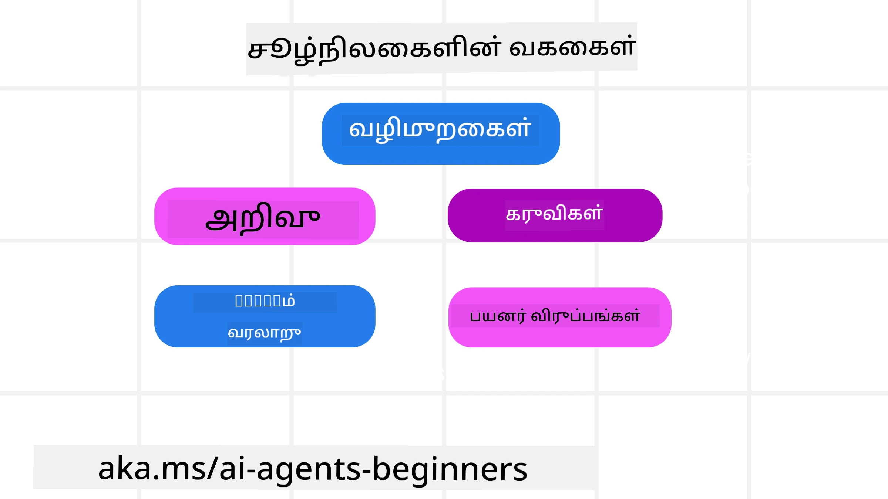
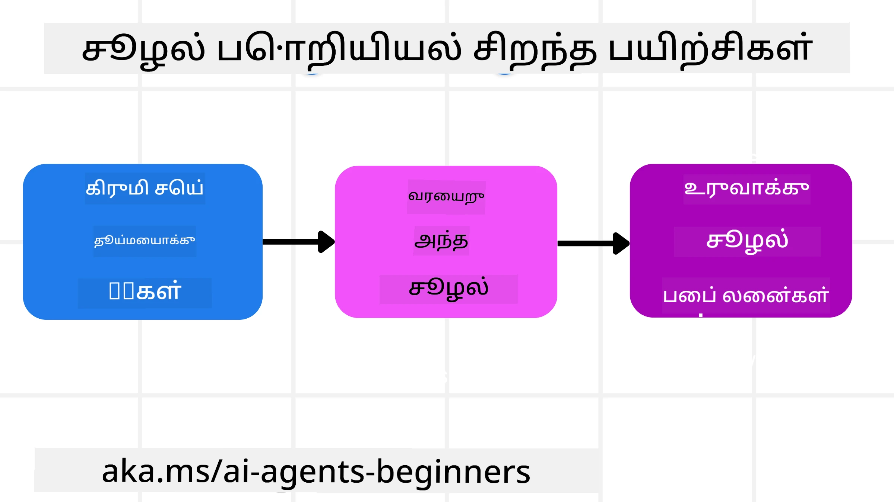

# AI முகவர்கள் கான்றக்ட் பொறியியல்

> _(இந்த பாடத்தின் வீடியோவைப் பார்க்க மேலே உள்ள படத்தைக் கிளிக் செய்யவும்)_

நீங்கள் உருவாக்கி வருகிற AI முகவருக்கான பயன்பாட்டின் சிக்கல்களை புரிந்து கொள்வது நம்பகமான AI முகவர்களை உருவாக்க முக்கியமாகும். உத்தரவாத பொறியியல் அல்லாமல், சிக்கலான தேவைகளை கையாளுவதற்காக தகவல்களை திறம்பட கையாளும் AI முகவர்களை உருவாக்க வேண்டியது அவசியம்.

இந்த பாடத்தில், கான்றக்ட் பொறியியல் என்ன என்பதையும் அது AI முகவர்களை உருவாக்குவதில் எவ்வாறு பங்கு பெறுகின்றது என்பதையும் பார்க்கப்போகிறோம்.

## அறிமுகம்

இந்த பாடத்தில் இவற்றைப் பற்றி காணப்படும்:

• **கான்றக்ட் பொறியியல் என்ன** மற்றும் அது உத்தரவாத பொறியியலில் இருந்து எப்படி வேறுபடுகின்றது.

• **திறமையான கான்றக்ட் பொறியியலுக்கான நுட்பங்கள்**, தகவலை எழுத, தேர்வு செய்ய, சுருக்கி, தனிப்படுத்துவது போன்றவை.

• **சாதாரண கான்றக்ட் தோல்விகள்** மற்றும் அவற்றை எவ்வாறு சரிசெய்வது என்பதே.

## கற்றல் இலக்குகள்

இந்த பாடத்தை முடித்த பிறகு, நீங்கள்:

• **கான்றக்ட் பொறியியலை வரையறுக்க** மற்றும் அதைப் புரிந்து கொள்ள **உத்தரவாத பொறியியலை தரவிடலாம்**.

• பெரிய மொழி மாதிரி (LLM) பயன்பாடுகளில் **கான்றக்ட் முக்கிய கூறுகளை அடையாளம் காணலாம்**.

• முகவர்களின் செயல்திறனை மேம்படுத்த கான்றக்டை எழுத, தேர்வு செய்ய, சுருக்கி, தனிப்படுத்தும் நுட்பங்களை பயன்படுத்தலாம்.

• **பலவீனமடைந்த கான்றக்ட் தோல்விகளை (பாய்ச்சல், கவனமாற்றம், குழப்பம், மோதல் போன்றவை) அறிந்துகொள்ளலாம்** மற்றும் தடுப்பு வழிகளை செயல்படுத்தலாம்.

## கான்றக்ட் பொறியியல் என்பது என்ன?

AI முகவர்களுக்கான கான்றக்ட் என்பது, AI முகவர் குறிப்பிட்ட நடவடிக்கைகளை எடுக்க திட்டமிடுவதற்கு பின்னணி தகவலாக செயல்படுகிறது. கான்றக்ட் பொறியியல் என்பது அடுத்த கட்டத்தை முடிப்பதற்கு தேவையான சரியான தகவலை AI முகவருக்கு வழங்குவதற்கான நடைமுறை ஆகும். கான்றக்ட் ஜன்னல் அளவு குறுகியதால், முகவர் உருவாக்குநர்களாக நாம் தகவலைச் சேர், நீக்கு, சுருக்க இவற்றை நிர்வகிக்க தேவையான அமைப்புகள் மற்றும் செயல்முறைகளை உருவாக்க வேண்டும்.

### உத்தரவாத பொறியியல் மற்றும் கான்றக்ட் பொறியியல்

உத்தரவாத பொறியியல் என்பது AI முகவர்களை வழிகாட்ட ஒரு நிலை வழிமுறைகள் தொகுப்பை மட்டுமே கவனிக்கும். கான்றக்ட் பொறியியல் என்பது ஆரம்ப உத்தரவைக் கொண்டு சிக்கலான, மாறுபடும் தகவல்களை நிர்வகித்து AI முகவருக்கு தேவையான தகவல் தொடர்ச்சியாக கிடைக்கப்படுகிறதா என்பதை உறுதி செய்வது. கான்றக்ட் பொறியியல் முக்கியக் கருத்து இந்த செயல்முறை மீண்டும் செய்யக்கூடியதும் நம்பத்தகுதியானதுமானதாக இருக்க வேண்டும் என்பது ஆகும்.

### கான்றக்ட் வகைகள்

கான்றக்ட் ஒரே ஒன்று அல்ல என நினைவில் வைக்கவேண்டும். AI முகவருக்கு தேவையான தகவல்கள் பல்வேறு மூலங்களிலிருந்து வரலாம், அவற்றைப் பெற்றுக்கொள்வதற்கு முகவருக்கு அணுகல் வழங்குவது நம்ம பணி:

AI முகவரி நிர்வகிக்க வேண்டிய கான்றக்ட் வகைகள்:

• **வழிமுறைகள்:** முகவரின் "நியமங்கள்" போல - உத்தரவுகள், சிஸ்டம் செய்திகள், சில உதாரணங்கள் (AI ஐ எப்படி செயல்படுத்துவது என்பதை காட்டும்), மற்றும் பயன்படுத்தக்கூடிய கருவிகள் விவரணம். இது உத்தரவாத பொறியியல் மற்றும் கான்றக்ட் பொறியியல் சேரும் பகுதி.

• **அறிவு:** உண்மைகள், தரவுத்தளத்திலிருந்து பெறப்படும் தகவல்கள், அல்லது முகவரின் நீண்டகால நினைவுகள். இதில் எதிர்ப்பார்ப்புச் சேர்க்கப்பட்ட உருவாக்கத் தந்திரம் (RAG) உட்படவேண்டும், பல அறிவுத்தளங்கள் மற்றும் தரவுத்தளங்களின் அணுகல் உண்டெனில்.

• **கருவிகள்:** முகவர் பயன்படுத்தக்கூடிய வெளிப்புற செயல்பாடுகள், API-கள், MCP சர்வர்கள் ஆகியவற்றின் வரையறைகள் மற்றும் அவற்றைப் பயன்படுத்திய பின்னர் கிடைப்பது போன்ற பதில்கள்.

• **மொழிமாற்றத்து வரலாறு:** பயனருடன் நடக்கும் தொடர்ந்த உரையாடல். காலக்கட்டத்தில் இவை பெருகி கண்டிப்பாக நிரல்நிரட்டிலும் அதிக இடம் பிடிக்கும்.

• **பயனர் விருப்பங்கள்:** காலத்தோடு பயனரின் விருப்பங்கள் மற்றும் விருப்பமற்றவை பற்றிய தகவல். முக்கிய முடிவுகள் எடுக்க இது சேமித்து பயன்படுத்தப்படும்.

## திறமையான கான்றக்ட் பொறியியலுக்கான நுட்பங்கள்

### திட்டமிடும் நுட்பங்கள்

நன்றாக திட்டமிடுவதிலிருந்து திறமையான கான்றக்ட் பொறியியல் துவங்கும். இது கான்றக்ட் பொறியியலை எப்படி பயன்படுத்துவது என்பதை ஆரம்பிக்க உதவும் அணுகுமுறை:

1. **தெளிவான முடிவுகளை வரையறு** - AI முகவர்களுக்கு கம்புகப்படும் பணி முடிவுகள் தெளிவாக வரையறுக்கப்பட வேண்டும். கேள்விக்கு பதில் அளி - "AI முகவர் தன் பணியை முடித்தப்போது உலகம் எப்படி இருக்கும்?" என்பதே. மற்ற சொற்களில், பயனர் AI முகவருடன் தொடர்புகொண்டபின் எவ்வகை மாற்றம், தகவல் அல்லது பதில் இருக்க வேண்டும் என்பதே.

2. **கான்றக்ட் வரைபடம்** - AI முகவரின் முடிவுகளை வரையறுத்தபின், "இந்த பணியை நிறைவேற்ற AI முகவருக்கு எந்த தகவல் தேவையாகும்?" என்பதற்கு பதிலளி. இவ்வாறு அந்த தகவல் எங்கே இருக்கும் என்பதை வரைபடம் போல் வரைபடு.

3. **கான்றக்ட் குழாய்களை உருவாக்கு** - தகவல் எங்கே இருப்பது அறிந்தபின், "முகவர் இந்த தகவலை எப்படி பெறும்?" என்பதற்கான பதிலை காண வேண்டும். இது RAG, MCP சர்வர்கள், மற்றும் பிற கருவிகள் மூலம் செய்யலாம்.

### நடைமுறை நுட்பங்கள்

திட்டமிடல் முக்கியம்; தகவல் AI முகவர்கள் கான்றக்ட் ஜன்னலில் ஓட ஆரம்பித்தவுடன், அதை நிர்வகிக்க நடைமுறை நுட்பங்கள் தேவையாகும்:

#### கான்றக்ட் நிர்வகிப்பு

சில தகவல்கள் தானாகவே கான்றக்ட் ஜன்னலில் சேர்க்கப்படுமானாலும், தகவலைச் செயல்பாட்டுடன் நிர்வகிப்பதே கான்றக்ட் பொறியியலின் அம்சம் ஆகும். இதற்கு சில நுட்பங்கள்:

1. **முகவர் ஸ்கிராட்ச்பாட்**  
இது AI முகவருக்கு தற்போதைய பணிகளும் பயனர் தொடர்புகளும் குறித்த தொடர்புடைய குறிப்புகள் எடுக்கும் இடமாகும். இது கான்றக்ட் ஜன்னல் வெளியே ஒரு கோப்பு அல்லது ரன்டைம் உருப்படியாக இருப்பது நல்லது, அதனை முகவர் பிறகு இந்த அமர்வின் போது தேடிக் கொள்கிறது.

2. **நினைவுகள்**  
ஸ்கிராட்ச்பாட்கள் ஒரே அமர்வின் வெளிவிவரங்களைக் கையாளும் போது, நினைவுகள் பல அமர்வுகளில் தொடர்புடைய தகவலை சேமிக்கவும் மீட்டெடுக்கவும் உதவும். இதில் சுருக்கங்கள், பயனர் விருப்பங்கள் மற்றும் எதிர்வினைகள் வரலாம்.

3. **கான்றக்ட் சுருக்குதல்**  
கான்றக்ட் ஜன்னல் அதிகரித்து வரையிருப்பை எட்டும் போது, சுருக்கம் மற்றும் சீர்திருத்தம் போன்ற செயல்முறைகள் பாவிக்கப்படலாம். முக்கியமான தகவலை மட்டும் வைப்பது அல்லது பழைய செய்திகளை நீக்குவது இதற்குள் வருகிறது.

4. **பல முகவர் அமைப்புகள்**  
பல முகவர்களைக் கொண்ட அமைப்புகளை உருவாக்குவது கான்றக்ட் பொறியியலாகும்; ஏனெனில் ஒவ்வொரு முகவருக்கும் தனி ஜன்னல் உண்டு. அந்த தகவல் எப்படி பகிரப்படுகிறது மற்றும் மற்ற முகவர்களுக்கு எப்படிப்பற்றி மாற்றப்படுகிறது என்பதையும் திட்டமிட வேண்டும்.

5. **சேண்ட்பாக்ஸ் சூழல்கள்**  
ஏதேனும் குறியீடு ஓட்டலம், அல்லது ஒரு ஆவணத்தில் பெரும் அளவு தகவல் செயலாக்கம் தேவையெனில், அது பெரும் டோக்கன்களை எடுத்துக்கொள்ளும். இதனால் முழு தகவலும் கான்றக்ட் ஜன்னலில் இருப்பதற்கும் பதிலாக, மாற்றாக ஒரு சேண்ட்பாக்ஸ் சூழலைப் பயன்படுத்தி குறியீட்டை இயக்கி அதன் முடிவுகளையும் தொடர்புடைய தகவல்களையும் மட்டும் கொண்டு வர முடியும்.

6. **ரன்டைம் நிலை பொருட்கள்**  
சிக்கலான பணிகளுக்கு, ஒவ்வொரு துணைப் பணியின் முடிவுகளையும் படி படியாக சேமித்து வைக்க மற்றும் தொடர்புபடுத்தும் புகுப்பு தகவல்களின் தொகுப்பு உருவாக்கப்படும். இதனால் அந்த பணிக்கே தொடர்புபட்டு இருப்பதற்கான கான்றக்ட் இருக்கும்.

#### கான்றக்ட் ஆய்வு

இந்த நுட்பங்களைப் பயன்படுத்திய பிறகு, அடுத்த மாதிரி அழைப்பு எந்த கான்றக்டை பெற்றது என்பதை பரிசோதிப்பது நல்லது. பயனுள்ள பிழைதிருத்தக் கேள்வி:

> முகவர் அதிக கான்றக்டை கொண்டிருந்ததா, தவறான கான்றக்டை கொண்டிருந்ததா அல்லது தேவையான கான்றக்டை தவறவிட்டதா?

அந்த கேள்விக்கு பதில் அளிக்க நீங்கள் முயற்சி செய்ய வேண்டியதில்லை மூல உத்தரவுகள், கருவி வெளியீடுகள் அல்லது நினைவுகளை பதிவு செய்ய. உற்பத்தியில், எண்ணிக்கை, ஐடியாஸ், ஹேஷ், கொள்கை லேபிள்கள் போன்ற சிறிய கான்றக்ட் ஆய்வு பதிவுகள் பரிந்துரைக்கப்படுகின்றன:

- **தேர்வு:** எத்தனை போட்டி துண்டுகள், கருவிகள் அல்லது நினைவுகள் கருதப்பட்டன, எத்தனை தேர்வு செய்யப்பட்டது மற்றும் பிறவை வடிகட்டி இருக்கும் விதி அல்லது மதிப்பெண் என்ன என்பதை கண்காணி.

- **சுருக்குதல்:** மூல பகுதி வரம்பு அல்லது தடய ஐடி, சுருக்க ஐடி, சுருக்கத்திற்கு முன் மற்றும் பின் டோக்கன் எண்ணிக்கை, அடுத்த அழைப்பிலிருந்து மூல உள்ளடக்கம் நீக்கப்பட்டதா என்பதைக் பதிவு செய்க.

- **தனியுரைத்தல்:** எந்த துணைப் பணி தனி முகவர், அமர்வு அல்லது சேண்ட்பாக்ஸில் ஓடினது என்பதை குறிஞ்சி, என்ன கட்டுப்பட்ட சுருக்கம் திருப்பி கொடுக்கப்பட்டது, பெரிய கருவி வெளியீடு பெற்றோர் முகவர் கான்றக்டைத் தவிர்கின்றதா என்பதையும் குறிப்பு இடு.

- **நினைவகம் மற்றும் RAG:** மீட்டெடுக்கப்பட்ட ஆவண ஐடியாஸ், நினைவக ஐடியாஸ், மதிப்பெண்கள், தேர்ந்தெடுக்கப்பட்ட ஐடியாஸ் மற்றும் விவரங்களை முழுமையாக பெறவிடாமல் சேமி.

- **பாதுகாப்பும் தனியுரிமையும்:** உணர்ச்சிகரமான உத்தரவுகளை, கருவி விவரங்களை, கருவி முடிவுகளை அல்லது பயனர் நினைவக உள்ளடக்கங்களை விட்டு ஹேஷ், ஐடிகள், டோக்கன் பக்கெட் மற்றும் கொள்கை லேபிள்களை முன்னுரிமை அளி.

நோக்கம் மிகவும் அதிகமான கான்றக்டை வைத்திருப்பதல்ல; ஏதேனும் கான்றக்ட் முறையை யார் இயக்கினார்கள் மற்றும் இது அடுத்த மாதிரி அழைப்பை எதிர்பார்த்தபடி வளைந்ததா என்பதை ஒரு டெவலப்பர் கூறிக்கொள்ளும் போதுமான சான்றை பாதுகாப்பதே உள்ளது.

### கான்றக்ட் பொறியியலின் உதாரணம்

நாம் ஒரு AI முகவரிடம் **"பாரிஸிற்கு பயணத்தை முன்பதிவு செய்"** என்று கூறுவோம் என்று நினைத்துக்கொள்வோம்.

• உத்தரவாத பொறியியல் மட்டுமே பயன்படுத்தும் ஒரு எளிய முகவர், காட்டையில் பதிலளிக்கும், **"சரி, நீங்கள் எப்போது பாரிஸுக்கு போக விரும்புகிறீர்கள்?"** என கேட்கும். அது பயனர் கேட்ட நேரத்தில் நேரடியாக கேள்வியை மட்டுமே செயலாக்கியது.

• கான்றக்ட் பொறியியல் நுட்பங்களைப் பயன்படுத்தும் முகவர் இவ்வாறல்லாமல் செயல்வடிவாக செயல்படும். பதிலளிக்க முன்பு, அதன் முறைமை:

  ◦ **உங்கள் கலெண்டரைச் சரிபார்க்கும்** (உண்மையான தரவை மீட்டெடுக்கும்).

  ◦ **முந்தைய பயண விருப்பங்களை நினைவூட்டிக் கொள்ளும்** (நீண்டகால நினைவுகளில் இருந்து), உங்கள் விரும்பும் விமான நிறுவனம், பட்ஜெட், நேரடி விமானங்கள் விருப்பமா என்பதுபோல.

  ◦ **விமானம் மற்றும் விடுதி முன்பதிவு கருவிகளை அடையாளம் காணும்.**

- பின்னர் பதில் எஞ்சல்: "ஹே [உங்கள் பெயர்]! நான் பார்க்கிறேன் நீங்கள் அக்டோபர் முதல் வாரத்தில் காலியாக இருக்கிறீர்கள். உங்கள் சாதாரண பட்ஜெட்டுக்குள் [விரும்பிய விமான நிறுவனம்] மூலம் பாரிஸுக்கான நேரடி விமானங்களை தேடலாமா?". இந்த மூலத் தகவலை கொண்டு வழங்கப்படும் பதில் கான்றக்ட் பொறியியலின் பலத்தை காட்டுகிறது.

## சாதாரண கான்றக்ட் தோல்விகள்

### கான்றக்ட் பாய்ச்சல் (Context Poisoning)

**என்னவென்று:** ஒருவேளை LLM மூலம் படைத்த பொய் தகவல் அல்லது பிழை உள்ளடக்கம் கான்றக்டரில் நுழைந்து மீண்டும் மீண்டும் குறிப்பிடப்படுவதால், முகவர் சாத்தியமற்ற இலக்குகளைத் தொடர்ந்தோ அல்லது அர்த்தமற்ற நடைமுறைகளை உருவாக்கிக் கொள்ளும் நிலை.

**என்ன செய்ய வேண்டும்:** **கான்றக்ட் சரிபார்ப்பு** மற்றும் **கொரோன்டைன்** நடைமுறைகளை அமல் படுத்த வேண்டும். நீண்டகால நினைவில் சேர்க்கும் முன்பு தகவலைச் சரிபார்க்கவும். பாய்ச்சல் சந்தேகப்படப்பட்டால், பாதிக்கப்பட்ட கான்றக்ட் சூட்டுக்களை முறியடிக்க புதிதாய் தொடங்கவும்.

**பயண முன்பதிவு உதாரணம்:** உங்கள் முகவர் சிறிய உள்ளூர் விமான நிலையம் இருந்து தொலைவிலிருக்கும் சர்வதேச நகரம் திரும்ப ஒரு நேரடி விமானம் உள்ளதாக கற்பனை செய்கிறது, ஆனால் அங்கு சர்வதேச விமானங்கள் இல்லை. இந்த தவறான விமான விவரம் கான்றக்டரில் சேமிக்கப்படுகிறது. பிறகுதான் முன்பதிவு செய்யத் துளியும் போது இந்த சாத்தியமற்ற வழிக்கான டிக்கெற்களைத் தேடி தொடர்ந்து தவறுகள் நிகழ்கின்றன.

**தீர்வு:** விமானம் இருப்பு மற்றும் வழிகளை நேரடி API மூலம் **சரிபார்** பிறகு மட்டுமே தெரியுமாறு செயல்முறையை வைத்திருங்கள். சரிபார்ப்பு தோல்வியடிட்டால் அந்த தவறான தகவலை "கொரோன்டைனில்" வைக்கவும் மறுபயன்பாடு தவிர்க்க.

### கான்றக்ட் கவனவிழுதல் (Context Distraction)

**என்னவென்று:** கான்றக்ட் மிகப் பெரியதாகி மாடல் திரைபடத்தின் பழைய உரையாடலை அதிகம் கவனித்து பயிற்சி மூலம் கற்றுக்கொண்டதை பயன்படுத்தாமல் தவறான மற்றும் கடுமையான செயல்களை மேற்கொள்ளும் நிலை. சில நேரங்களில் எல்லைக்குள் வராதே தவறுகள் போகும்.

**என்ன செய்ய வேண்டும்:** **கான்றக்ட் சுருக்கம்** பயன்படுத்தவும். சேகரிக்கப்பட்ட தகவலை குறுகிய சுருக்கங்களில் மாறாமல் அவசியமான விவரங்களை விட்டு மீதியை நீக்கி, கவனத்தை மீண்டும் தள்ள விரும்பிய திசைக்கு கொண்டு வருதல்.

**பயண முன்பதிவு உதாரணம்:** நீங்கள் பல்வேறு கனவு பயண இடங்களை பற்றி நீண்ட நேரம் பேச்சுவார்த்தை நடத்தியுள்ளீர்கள், இரண்டு வருடங்களுக்கு முன் பாக்க்பேக்கிங் பயணத்தை விரிவாக கூறியதும் அடங்கும். பிறகு நீங்கள் கேட்கும்போது **"அடுத்த மாதத்திற்கு மலிவான விமானம் தேடு"**, முகவர் பழைய தேவையற்ற விவரங்களால் மயங்கிக் கொண்டு உங்கள் பாக்க்பேக்கிங் உபகரணங்கள் மற்றும் போக்குவரத்து வழிகள் குறித்து தொடர்ந்த கேள்விகள் கேட்கும், தற்போது கேட்கப்பட்ட கேள்வி புறக்கணிக்கப்படும்.

**தீர்வு:** குறிப்பிட்ட சுற்றுகளில் அல்லது கான்றக்ட் பெரியதாகி விட்டால், முகவர் **பெரும்பாலான சமீபத்திய முக்கிய உரையாடலின் சுருக்கத்தைச் செய்ய வேண்டும்** – தற்போதைய பயண தேதி மற்றும் இடத்தை கவனித்து, அடுத்த LLM அழைப்புக்கு அந்த சுருக்கத்தைப் பயன்படுத்தி பழைய தகவல்களை நீக்க வேண்டும்.

### கான்றக்ட் குழப்பம் (Context Confusion)

**என்னவென்று:** தேவையில்லாத அதிகமான கருவிகள் இருப்பதால் மாடல் தவறான பதில்களை உருவாக்குவது அல்லது பொருத்தமற்ற கருவிகளை அழைப்பது. சிறிய மாதிரிகள் இதற்கு அதிக ஆறுதல் காட்டும்.

**என்ன செய்ய வேண்டும்:** RAG தொழில்நுட்பங்களைப் பயன்படுத்தி, **கருவி பராமரிப்பை** செயல்படுத்து. கருவி விளக்கங்களை வெக்டர் தரவுத்தளத்தில் வைத்திருக்கும் மற்றும் ஒவ்வொரு பணிக்கும் தேவையான கருவிகளை மட்டும் தேர்வு செய்யும். ஆராய்ச்சிகள் 30-க்கும் குறைவான கருவிகள் தான் சிறந்தது என்று கூறுகின்றன.

**பயண முன்பதிவு உதாரணம்:** உங்கள் முகவருக்கு `book_flight`, `book_hotel`, `rent_car`, `find_tours`, `currency_converter`, `weather_forecast`, `restaurant_reservations` போன்ற பொது பன்முகமான கருவிகள் உள்ளன. நீங்கள், **"பாரிஸில் சுற்றிச் சூகல அசைவது எப்படி?"** என்று கேட்டால், கருவிகளின் அதிகம்கூட்டத்தின் காரணத்தால், முகவர் குழப்பமடைந்து, பாரிஸுக்குள் `book_flight` அழைக்க முயற்சி செய்யும், அல்லது நீங்கள் மக்கள் போக்குவரத்தை விரும்பினாலும் `rent_car` பயன்படுத்த முயற்சி செய்யும், காரணம் கருவி விளக்கங்கள் ஒரே மாதிரியாக இருக்கலாம் அல்லது சிறந்த கருவியை புரிந்து கொள்ள முடியாமல் இருக்கலாம்.

**தீர்வு:** கருவி விளக்கங்களில் RAG பயன்படுத்தவும். பாரிஸில் சுற்றிச் சுங்க கேள்வியில், சரியான கருவிகளான `rent_car` அல்லது `public_transport_info` போன்றவை மட்டும் மின்னனுவழி (டயனமிக்) பெறப்பட்டு, LLMக்கு தேர்ந்தெடுத்த கருவி பட்டியல் வழங்கப்படும்.

### கான்றக்ட் மோதல் (Context Clash)

**என்னவென்று:** கான்றக்டில் மாறுபடும் தகவல்கள் இருக்கும்போது ஏற்பட்ட பதில்களில் முரண்பாடும் சீர்குலைவுமாகும். இது முதலில் தவறான நிலைப்பாட்டுகள் உள்ளடக்கம் ஆகியும், தகவல்கள் பரிமாறப்படுவதால் ஏற்படும்.

**என்ன செய்ய வேண்டும்:** **கான்றக்ட் பிரூனிங்** மற்றும் **ஆஃப்லோடிங்** பயன்படுத்தவும். பிரூனிங் என்பது பழைய அல்லது முரணான தகவலை நீக்கும் செயல்முறை. ஆஃப்லோடிங் என்பது தகவலை மைய கான்றக்டை நிரப்பாமல் கான்றக்ட் செயற்கை பதிவில் தனித்து செயலாக்குவதற்கான வேடத்தில் விடுவதாகும்.
**பயண முன்பதிவு உதாரணம்:** துவக்கத்தில், நீங்கள் உங்கள் முகவருக்கு சொல்கிறீர்கள், **"நான் எகானமி கிளாஸ் விமான ஏக்க விரும்புகிறேன்."** உரையாடல் நடுவே, நீங்கள் உங்கள் மனத்தை மாற்றி **"உண்மையில், இந்த பயணத்திற்கு, பிஸினஸ் கிளாஸ் செல்லலாம்."** என்பதைச் சொல்கிறீர்கள். இரு அறிவுறுத்தல்கள் உள்ளடக்கத்தில் இருந்தால், முகவர் முரண்பட்ட தேடல் முடிவுகளைப் பெறலாம் அல்லது எந்த விருப்பத்தைக் முன்னுரிமை கொடுக்க வேண்டும் என்பதில் குழப்பமாகலாம்.

**தீர்வு:** **சூழல் கழித்தல்** அமல்படுத்தவும். புதிய அறிவுறுத்தல் பழைய ஒன்றை முரண்படுகிறதே என்றால், பழைய அறிவுறுத்தல் நீக்கப்பட அல்லது விட்டு வைக்கப்பட வேண்டும். அல்லது, முகவர் முரண்பட்ட விருப்பங்களை சமநிலைப்படுத்த **ஸ்கிராட்ச்பேட்** பயன்படுத்தி முடிவுக்கு வந்து, ஒரே இறுதி எதிகாரமான அறிவுறுத்தல் மட்டுமே அதன் செயல்பாட்டை வழி நடத்தும்.

## சூழல் இன்ஜினியரிங் பற்றி கூடுதல் கேள்விகள் உள்ளதா?

இருதரப்பு கற்றலாளர்களை சந்திக்க, அலுவலக நேரங்களில் கலந்துகொள்ள மற்றும் உங்கள் AI முகவர்களின் கேள்விகளுக்கு பதில் பெற [Microsoft Foundry Discord](https://aka.ms/ai-agents/discord) இல் சேரவும்.

---

<!-- CO-OP TRANSLATOR DISCLAIMER START -->
**மறுப்பு**:
இந்த ஆவணம் AI மொழிபெயர்ப்பு சேவை [Co-op Translator](https://github.com/Azure/co-op-translator) பயன்படுத்தி மொழிபெயர்க்கப்பட்டுள்ளது. நாங்கள் துல்லியத்திற்காக முயற்சி செய்துள்ளோம், ஆனால் தானாக செய்யப்படும் மொழிபெயர்ப்புகளில் பிழைகள் அல்லது தவறுகள் இருக்கலாம் என்பதை கவனத்தில் கொள்ளவும். அசல் ஆவணம் அதன் தாய்மொழியில் அதிகாரப்பூர்வ ஆதாரமாக கருதப்பட வேண்டும். முக்கியமான தகவல்களுக்கு, தொழில்நுட்பமான மனித மொழிபெயர்ப்பு பரிந்துரைக்கப்படுகிறது. இந்த மொழிபெயர்ப்பைப் பயன்படுத்துவதால் ஏற்படும் எந்த தவறான புரிதல்கள் அல்லது தவறான விளக்கத்திற்கும் நாங்கள் பொறுப்பில்வில்லை.
<!-- CO-OP TRANSLATOR DISCLAIMER END -->