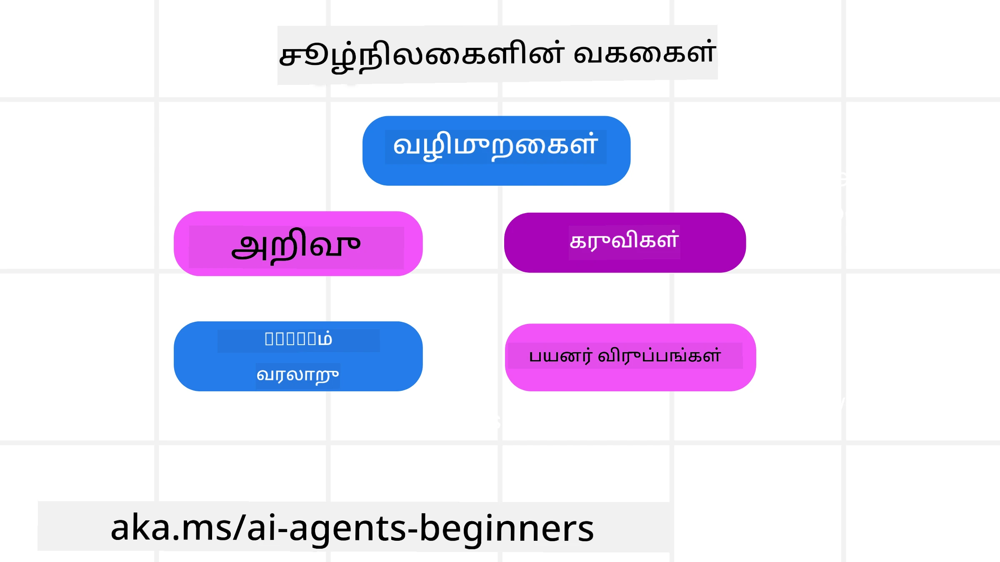
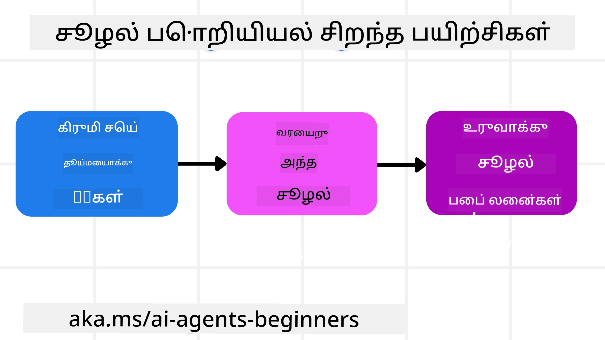

# AI முகவர்களுக்கான சூழல் பொறியியல்

> _(இந்த பாடத்திற்கான வீடியோக்களைப் பார்த்து அறிய மேலே உள்ள படத்தை கிளிக் செய்யவும்)_

நீங்கள் உருவாக்கும் AI முகவருக்கு பயன்பாட்டின் சிக்கலானதன்மையைப் புரிந்துகொள்ள வேண்டும் என்பது நம்பகமான ஒன்றை உருவாக்குவதற்கு முக்கியம். நாங்கள் சிக்கலான தேவைகளை சமாளிக்க செயல்படும் வழிகளில் தகவலை கையாளும் AI முகவர்களை உருவாக்க வேண்டும், இது சுட்டி பொறியியலை மீறி உள்ளது.

இந்த பாடத்தில், சூழல் பொறியியல் என்றால் என்ன மற்றும் AI முகவர்களை உருவாக்கும் பணியில் அதன் பங்கு என்ன என்பதைக் காண்போம்.

## அறிமுகம்

இந்த பாடம் இதை உள்ளடக்கியது:

• **சூழல் பொறியியல் என்றால் என்ன** மற்றும் அது சுட்டி பொறியியலிலிருந்து எவ்வாறு வேறுபடுகிறது என்பதைக்.

• **சூழல் பொறியியலுக்கான பயனுள்ள முறைகள்**, அதாவது எப்படி எழுதுவது, தேர்வு செய்யுவது, உடைத்தல் மற்றும் தனிப்பட்ட தகவலை கையாளுவது என்பதைக்.

• **பொதுவான சூழல் தோல்விகள்** மற்றும் அவைகளை எவ்வாறு சரி செய்வது என்பதைக்.

## கற்றல் வெளிக்கோணங்கள்

இந்த பாடத்தை முடித்த பின், நீங்கள் இவற்றை புரிந்துகொள்ளலாம்:

• **சூழல் பொறியியலை வரையறுத்து** அதை சுட்டி பொறியியலிலிருந்து வேறுபடுத்துவது.

• **பெரிய மொழி மாதிரி (LLM) பயன்பாட்டில் சூழல் முக்கிய பகுதிகளை அடையாளம் காணுதல்**.

• **முகவர் செயல்திறனை மேம்படுத்த சூழலை எழுதுதல், தேர்வு செய்தல், சுருக்குதல் மற்றும் தனிநபராக்கும் முறைகளை பயன்படுத்துதல்**.

• **வழக்கமான சூழல் தோல்விகளான நாசமடைந்தல், கவனைவீக்கம், குழப்பம் மற்றும் முரண்பாடு போன்றவற்றை அறிந்து, அவற்றை குறைத்தல் முறைகளை செயல்படுத்துதல்**.

## சூழல் பொறியியல் என்றால் என்ன?

AI முகவர்களுக்கு, சூழல் என்பது AI முகவர் குறிப்பிட்ட செயல்களை எடுக்க ஏற்பாடு செய்யும் திட்டமிடலை இயக்கும் காரணியாகும். சூழல் பொறியியல் என்பது AI முகவருக்கு அடுத்த பணிக்கு தேவையான சரியான தகவல் கிடைக்க உறுதி செய்வது. சூழல் திரை அளவு வரம்பு உள்ளதால், முகவர் உருவாக்குனர்களாக நாங்கள் சூழல் திரையில் உள்ள தகவலைச் சேர்க்க, அகற்ற மற்றும் சுருக்க முறைகளை நிர்வகிக்கும் அமைப்புகள் மற்றும் செயல்முறைகளை உருவாக்க வேண்டும்.

### சுட்டி பொறியியல் மற்றும் சூழல் பொறியியல்

சுட்டி பொறியியல் AI முகவர்களை வழிகாட்ட ஒரு நிலையான கட்டளைகளின் தொகுப்பில் கவனம் செலுத்துகிறது. சூழல் பொறியியல் என்பது முதல் சுட்டியுடன ஆர் தொழில்நுட்பத்தை உள்ளடக்கிய ஒரே நேரத்தில் நடைபெறும் பல்வேறு தகவல்களை நிர்வகிப்பது. முக்கிய அம்சம் இந்த செயல்பாட்டை மறுநடத்தக்கதும் நம்பகமானதும் ஆக்குவதாகும்.

### சூழல் வகைகள்

சூழல் என்பது ஒரே விஷயம் அல்ல என்பதை நினைவில் வைக்க வேண்டும். AI முகவருக்கு தேவையான தகவல் பல்வேறு மூலங்களிலிருந்து பெறப்படலாம், அந்தக் கணினியும் இந்த மூலங்களுடன் அணுகத்தக்கதாக இருக்க வேண்டும்:

AI முகவர் நிர்வகிக்க வேண்டிய சூழல் வகைகள்:

• **கட்டளைகள்:** இவை முகவரின் "விதிகள்" போன்றவை – சுட்டிகள், அமைப்பு செய்திகள், சில எடுத்துக்காட்டு காட்சிகள் (AI-க்கு எவ்வாறு செய்வது என்பதை காட்டு), மற்றும் பயன்படுத்தக்கூடிய கருவிகளின் விளக்கங்கள். இது சுட்டி பொறியியல் மற்றும் சூழல் பொறியியல் இணையும் இடம்.

• **அறிவு:** தகவல்கள், தரவுத்தளங்களில் இருந்து பெறப்பட்ட தகவல்கள் அல்லது முகவருக்கு கிடைத்த நீண்ட கால நினைவுகள் ஆகியவற்றையும் உள்ளடக்கியது. முகவருக்கு பயன்படுத்த வேண்டிய பல அறிவுத்தளங்களும் தரவுத்தளங்களும் இருந்தால் ரீட்ரைவல் ஆக்மென்டட் ஜெனரேஷன் (RAG) முறையை இணைத்தல்.

• **கருவிகள்:** முகவர் அழைக்கக்கூடிய வெளிப்புற செயல்பாடுகள், APIகள் மற்றும் MCP சேவையக வரையறைகள், மற்றும் அவைகளைப் பயன்படுத்தி பெறும் பின்னூட்டங்கள் (முடிவுகள்).

• **நிரல்பேச்சு வரலாறு:** பயனருடன் நடப்பதிலுள்ள உரையாடல். நேரம் கடந்தாமலே వాటி நீளமாகி சூழல் திரையில் இடம் பிடிக்கும்.

• **பயனர் விருப்பங்கள்:** பயனரின் விருப்பங்கள் அல்லது விரோதங்களை நேரத்துடன் கற்றுக்கொள்ளும் தகவல்கள், முக்கிய முடிவுகளை எடுக்க பயன்படுத்தப்படலாம்.

## முன்னேற்றமான சூழல் பொறியியலுக்கான முறைகள்

### திட்டமிடல் முறைகள்

நல்ல சூழல் பொறியியல் நல்ல திட்டமிடலைத் தொடங்குகிறது. சூழல் பொறியியலின் தத்துவத்தைப் பயன்படுத்தத் தொடங்க உதவும் ஒரு அணுகுமுறை இதோ:

1. **தெளிவான முடிவுகளை வரையறு** - AI முகவர்களுக்கு வழங்கப்படும் பணிகளின் முடிவுகள் தெளிவாக வரையறுக்கப்பட வேண்டும். "AI முகவர் பணியை முடித்தபோது உலகம் எப்படியிருக்கும்?" என்பது கேள்விக்கு பதில். மற்ற சொற்களில், பயனர் AI முகவருடன் தொடர்பு கொண்ட பின் எந்த மாற்றம், தகவல் அல்லது பதிலை பெற வேண்டும்.
2. **சூழலை வரைமுறை செய்** - AI முகவரின் முடிவுகளை வரையறுத்த பின், "இந்த பணியை முடிக்க AI முகவருக்கு எந்த தகவல் தேவையென்று?" கேள்வி கேள். அதன்பின், அந்த தகவல் எங்கே கிடைக்கும் என்பதை வரைபடம் செய்ய ஆரம்பி.
3. **சூழல் குழாய்களை உருவாக்கு** - தகவல் எங்கே உள்ளது என்பதை அறிந்த பின், "முகவர் இந்த தகவலை எவ்வாறு பெறும்?" என்ற கேள்விக்கு பதில் தேடு. இது RAG, MCP சேவையகங்கள் மற்றும் பிற கருவிகள் மூலம் செய்யலாம்.

### நடைமுறை முறைகள்

திட்டமிடல் முக்கியம், ஆனால் தகவல் முகவரின் சூழல் திரையில் வர ஆரம்பித்ததும், அதை நிர்வகிக்க நடைமுறை முறைகள் தேவை:

#### சூழல் நிர்வகித்தல்

சில தகவல்கள் தானாக சூழல் திரையில சேர்க்கப்படலாம், ஆனால் சூழல் பொறியியல் தொடர்பு கொண்ட தகவலை நிர்வகிப்பதில் முழுமையான பங்கு பெறுவது:

 1. **முகவர் குறிப்பு புத்தகம்**
 ஒரு AI முகவர் ஒரே அமர்வின் போது நடப்பதைக் குறிக்கும் தொடர்புடைய தகவல்களை குறிக்கலாம். இது சூழல் திரைக்குப் புறம்பாக கோப்பு அல்லது நிறைவேறுகிறது ஆவணமாக இருக்க வேண்டும் தடவை மூளையாகக் கையாளக்கூடும்.

 2. **நினைவுகள்**
 குறிப்பு புத்தகம் ஒரே அமர்விற்குப் புறம்பான தகவலை நிர்வகிக்க உதவும். நினைவுகள் பல அமர்வுகளில் தொடர்புடைய தகவலை சேமித்து மீட்டெடுக்க உதவும். இதில் சுருக்கங்கள், பயனர் விருப்பங்கள் மற்றும் எதிர்கால மேம்பாட்டிற்கான பின்னூட்டங்கள் இருக்கலாம்.

 3. **சூழலை சுருக்குதல்**
  சூழல் திரை நீட்டிக்கையில் மற்றும் அதன் எல்லைக்கு அணுகும் போது, சுருக்கம் மற்றும் திருகலுக்கு போன்ற நுட்பங்கள் பயன்படுத்தப்படலாம். இதில் மிகப் பொருத்தமான தகவலை மட்டும் வைக்கக்கூடும் அல்லது பழைய செய்திகளை அகற்றவும் செய்யலாம்.
  
 4. **பல முகவர் அமைப்புகள்**
  பல முகவர் அமைப்பை உருவாக்குவது ஒரு வகை சூழல் பொறியியல் ஆகும் ஏனெனில் ஒவ்வொரு முகவருக்கும் தனிப்பட்ட சூழல் திரை உள்ளது. இந்த சூழல் எவ்வாறு பகிரப்படுகிறது மற்றும் முகவர்களுக்கு அனுப்பப்படுகிறது என்பது திட்டமிடப்படவேண்டும்.
  
 5. **சேண்ட்பாக்ஸ் சூழல்கள்**
  முகவர் சில குறியீடுகளை இயக்க வேண்டும் அல்லது ஒரு ஆவணத்தில் பெரிய அளவிலான தகவலை செயலாக்க வேண்டும் என்றால், இது பல டோக்கன்களை பயன்படுத்தும். எல்லாவற்றும் சூழல் திரையில் சேமிக்கப்படும் பதிலுக்கு பதில், முகவர் ஒரு சேண்ட்பாக்ஸ் சூழலை பயன்படுத்தி குறியீட்டை இயக்கி முடிவுகளை மட்டும் படிக்கலாம்.
  
 6. **நிறைவேறும் நிலை பொருட்கள்**
   இது AI முகவருக்கு குறிப்பிட்ட தகவலில் அணுகல் தேவைப்படும் நிலைகளுக்கான தகவல் கரட்டிகளை உருவாக்கி செய்யப்படுகிறது. ஒரு சிக்கலான பணிக்காக, ஒரு மேற்படி துணைப் பணிகள் முடிவுகளை படி படியாகச் சேமித்து, சூழலை அந்த துணைப் பணிக்கு மட்டுமே இணைத்து வைக்க உதவும்.

#### சூழல் ஆய்வுசெய்தல்

இவற்றில் ஒன்றை பயன்படுத்திய பின், அடுத்த மாடல் அழைப்பு உண்மையில் என்ன பெற்றது என்பதைப் பார்வையிடல் வேண்டும். பயனுள்ள பிழைத்தூண்டுதல் கேள்வி:

> முகவர் அதிக சூழலை ஏற்றியதா, தவறான சூழலை ஏற்றியதா அல்லது தேவையான சூழல் தப்பி விட்டதா?

அந்தக் கேள்விக்கு பதில் அளிக்க நேரடி சுட்டிகள், கருவி வெளியீடுகள் அல்லது நினைவைக் கோப்பு பதிவு செய்ய தேவையில்லை. உற்பத்தியில், எண், அடையாளங்கள், ஹாஷ்கள் மற்றும் கொள்கை லேபிள்களை கொண்ட சிறிய சூழல் ஆய்வு பதிவுகளை விரும்புங்கள்:

- **தேர்வு:** தேர்ந்தெடுக்கப்பட்ட துணிகளின் எண்ணிக்கை, கருவிகள், நினைவுகளில் எத்தனை கருதப்பட்டன, எத்தனை தேர்ந்தெடுக்கப்பட்டன மற்றும் பிறர் விலக்கப்பட்ட விதிமுறைகள் அல்லது மதிப்பீட்டுடன் கண்காணி.
- **சுருக்குதல்:** மூல வரம்பு அல்லது தடம் அடையாளம், சுருக்க அடையாளம், சுருக்கத்திற்கு முன் மற்றும் பின்னர் கணிக்கப்பட்ட டோக்கன் எண்ணிக்கை மற்றும் அடுத்த அழைப்பிலிருந்து மூல உள்ளடக்கம் நீக்கப்பட்டதா என்பதையும் பதிவு செய்.
- **தனித்துவம்:** வெவ்வேறு முகவர், அமர்வு அல்லது சாண்ட்பாக்ஸில் ஓடிய துணைப் பணிகளை குறிக்கவும், எந்த வரம்புடைய சுருக்கம் திரும்ப வந்தது எனவும், பெரிய கருவி வெளியீடு பெற்ற அப்பா முகவர் சூழலில் இருந்து வெளியே இருந்ததையே குறிப்பிடவும்.
- **நினைவு மற்றும் RAG:** திருப்பி அறிந்த ஆவண அடையாளங்கள், நினைவு அடையாளங்கள், மதிப்பெண்கள், தேர்ந்தெடுக்கப்பட்ட அடையாளங்கள் மற்றும் முழு மீட்டெடுக்கப்பட்ட உரையின் பதிப்பின் நிலையை சேமிக்கவும்.
- **பாதுகாப்பு மற்றும் தனியுரிமை:** நுண்ணறிவு சுட்டி உரை, கருவி அளவுருக்கள், கருவி முடிவுகள் அல்லது பயனர் நினைவுக் கருத்துகளை விட ஹாஷ்கள், அடையாளங்கள், டோக்கன் பூட்டுகள் மற்றும் கொள்கை லேபிள்களை விரும்புக.

குறிக்கோள் அதிக சூழலை வைத்திருக்க அல்ல. பிரதிபலிப்பாற்றிய செயலை இயக்கிய சூழல் முறையை கண்டறிந்து அதன் மாற்றம் அடுத்த மாடல் அழைப்பில் தொழில்துறை நோக்கத்தில் ஏற்பட்டதா என நிரூபிக்க தேவையான சான்றுகளை வழங்குவதே.

### சூழல் பொறியியலின் உதாரணம்

ஒரு AI முகவருக்கு **"பாரிஸ் பயணத்தை முன்பதிவு செய்" என்று சொல்ல விரும்புவோம்.**

• சுட்டி பொறியியல் மட்டும் உள்ள साधारण முகவர்: **"சரி, பாரிஸ் செல்ல எப்பொழுது விரும்புகிறீர்கள்?"** என்ற பதிலோடு உங்கள் நேரடி கேள்வியை செயலாக்கும்.

• சூழல் பொறியியல் முறைகள் பயன்படுத்தும் முகவர் இதற்கு முந்தாக சில செயல்களை செய்யும்.

  ◦ **உங்கள் காலண்டரை சரிபார்க்கும்** (உண்மையான தரவை பெறுதல்).

 ◦ **முன்பு பயண விருப்பங்களை நினைவுகூருதல்** (நீண்டகால நினைவிலிருந்து) போன்ற விருப்பமான விமான நிறுவனம், பட்ஜெட் அல்லது நேரடி விமானங்களை விரும்புதல்.

 ◦ **விமான கட்டுமான மற்றும் ஹோட்டல் முன்பதிவு கருவிகளை அடையாளமிடல்.**

- பின்னர், உதாரண பதில்: "ஹே [உங்கள் பெயர்]! நான் October முதல் வாரம் காலமாக உள்ளது என்று கண்டுபோற..."

## பொதுவான சூழல் தோல்விகள்

### சூழல் நாசம்

**என்ன இது:** LLM உருவாக்கும் பொய்விதானம் அல்லது பிழை சூழல் உள்ளே வந்து மறு முறை மேற்கோளிடப்பட்டது. இது முகவரின் தவறான இலக்குகளுக்கு வழிவகுக்கும்.

**எல்லாம் என்ன செய்ய:** **சூழல் சரிபார்ப்பு** மற்றும் **துணைச்சிற்றுண்டு** இணைக்க. மேல்நிலை நினைவுக்கு சேர்க்கும் முன் தகவலை சரிபார். நாசமே ஆகும் சந்தேகம் இருந்தால் புதிய சூழல் தொடங்குக.

**பயண முன்பதிவு உதாரணம்:** உங்கள் முகவர் ஒரு சிறிய உள்ளூர் விமான நிலையத்திலிருந்து தொற்றுநீக்கும் நகருக்கு நேரடி விமானம் உள்ளது என்று சிதறித் தோற்றுவிக்கிறது. இதில் லீப்பில் உள்ளால் அத்தகைய விமானம் முன்பதிவு செய்ய முயற்சிப்பதால் தவறு நேர்கிறது.

**தீர்வு:** **விமானம் இருக்கும் மற்றும் பாதைகள் உண்மையா என்பதை நேரடி API மூலம் சரிபார்** முன் அதன் தகவலைச் சூழலுக்கு சேர். தோல்வி ஏற்பட்டால் தவறான தகவலை "துணைச்சிற்றுண்டு" செய்திடு.

### சூழல் கவனசிதறல்

**என்ன இது:** சூழல் மிகப்பெரியதாகி மாறிய தன்மையைப்பொறுத்த உள்ளடக்கத்துக்கு மாடல் மிக அதிகமாக கவனம் செலுத்துகிறது. இது முறைபயிற்சி கற்றதை விட்டுவிட்டு எழுத்துப் பிழைப்பாடுகளுக்கு வழி வகுக்கும்.

**என்ன செய்ய:** **சூழல் சுருக்கம்**. காலந்தேர்வுகளுக்கு சமயம் சென்றவுடன் பின்வட்டாரத் தகவலை சுருக்கி முக்கியம் வைத்துத் தேவையற்ற வரலாறு நீக்கு. இது கவனத்தை 'மறுசுழற்சியாக' அமைக்கும்.

**பயண முன்பதிவு உதாரணம்:** நடந்து வரும் பயண இடங்களை நீண்ட நேரமாக விவாதித்து, 2 ஆண்டுகளுக்கு முன் பேக்க்பேக்கிங் பயணத்தின் விவரங்கள் வரை கூறியிருக்கிறீர்கள். நீங்கள் "புதி மாதத்திற்கான மலிவான விமானம் கண்டுபிடி" என்ற பட்சத்தில், முகவர் பழைய தளர்வான விவரங்களில் சிக்கி உங்கள் தற்போதைய கோரிக்கையை புறக்கணிக்கிறது.

**தீர்வு:** அதிகம் திருப்புக்களை சென்றவுடன் மிக்கதானதை சுருக்கி, தற்போதைய பயண தேதி மற்றும் இடத்திற்கே கவனம் செலுத்தும் சுருக்கத்தை அடுத்த LLM அழைப்புக்கு பயன்படுத்தவும்.

### சூழல் குழப்பம்

**என் இது:** தேவையற்ற சூழல், பெரும்பாலும் அதிக கருவிகள் உள்ளதால், மாடல் தவறான பதில்கள் தரவோ தேவையற்ற கருவிகளை அழைப்போ செய்கிறது. சிறிய மாதிரிகள் அதிகமாக பாதிக்கப்படுகின்றன.

**என்ன செய்ய:** RAG முறைகள் பயன்படுத்தி **கருவி தேர்வை நிர்வகிக்க**. கருவி விளக்கங்களை வெக்டர் தரவுத்தளத்தில் சேமித்து, ஒவ்வொரு பணிக்குமான சிறந்த கருவிகளை மட்டும் தேர்வு செய்ய. 30-க்கு குறைவாக கருவி தேர்வு குறிப்பு மிகச் சிறந்தது.

**பயண முன்பதிவு உதாரணம்:** உங்கள் முகவருக்கு பல கருவிகள் உள்ளன: `book_flight`, `book_hotel`, `rent_car`, `find_tours`, `currency_converter`, `weather_forecast`, `restaurant_reservations` போன்றவை. நீங்கள் "பாரிஸ் சுற்றுச் செல்ல சிறந்த வழி என்ன?" என கேட்ட போது, கருவிகள் அதிகமையதால் Confusion ஆகி `book_flight` ஐ பாரிஸ் உள்ளேயே அழைக்க முயற்சி செய்கிறது அல்லது நீங்கள் பொதுப் போக்குவரத்தை விரும்பியாலும் `rent_car` அழைக்கிறது.

**தீர்வு:** கருவி விளக்கங்களில் RAG பயன்படுத்து. பாரிஸ் சுற்றுதலுக்கு கேள்விப்பட்ட போது, `rent_car` அல்லது `public_transport_info` போன்ற மிக பொருத்தமான கருவிகளை மட்டும் மீட்டெடுத்து LLMக்கு வழங்கும் கவனம் ஒருங்கிணைந்த 'loadout' உருவாகிறது.

### சூழல் மோதல்

**என் இது:** சூழல் உள்ளே முரண்பட்ட தகவல்கள் இருந்தால், மாறுபட்ட காரணிகளை ஏற்படுத்த பிரச்சினை அல்லது மோசமான பதில்களை உருவாக்கும். இது பெரும்பாலும் தகவல் பகுதியாக வந்தபோது ஏற்பட்ட தவறான ஊகம் முதல் நிலையாக இருக்கும் கண்காணிப்பு.

**என் செய்ய:** **சூழல் நTECக்தி** மற்றும் **ஓஃப்லோடிங்** செய். பழைய மற்றும் முரண்பட்ட தகவலை நீக்கும். ஓஃப்லோடிங் என்பது ஒரு தனியான "குறிப்பு புத்தகம்" வேலைநிறுத்தி தகவல்களை முதன்மை சூழலைத் தொற்றாமல் கையாளுகிறது.

**பயண பதிவு எடுத்துக்காட்டு:** உங்கள் முகவரிடம் நீங்கள் முதலில் சொல்கிறீர்கள், **"நான் எகானமி வர்க்கத்தில் பயணம் செய்ய விரும்பiyorum."** பின்னர் உரையாடலின் போது, உங்கள் கருத்தை மாற்றிவிட்டு, **"வாஸ்தவத்தில், இந்த பயணத்துக்கு, பிஸ்னஸ் வர்க்கத்தை தேர்ந்தெடுப்போம்."** என்றீர்கள். இரு வழிகாட்டுதல்களும் உள்ளடக்கத்தில் இருந்தால், முகவர் முரண்பட்ட தேடல் முடிவுகளைப் பெறலாம் அல்லது எந்த விருப்பத்தை முன்னுரிமைப்படுத்த வேண்டும் என்பது பற்றி குழப்பம் அடையலாம்.

**தீர்வு:** **context pruning** ஐ செயல்படுத்தவும். புதிய வழிகாட்டுதல் பழைய வழிகாட்டுதலை மறுக்கும் போது, பழைய வழிகாட்டுதல் உள்ளடக்கத்தில் நீக்கப்பட அல்லது தெளிவாக முறியடிக்கப்பட வேண்டும். மாற்றமாக, முகவர் முரண்பட்ட விருப்பங்களை சமரசப்படுத்த ஒரு **scratchpad** ஐ பயன்படுத்தி, இறுதி, ஒருங்கிணைந்த வழிகாட்டுதலல்லை மட்டுமே அதன் நடவடிக்கைகளை வழிநடத்தும் வகையில் தீர்மானிக்கலாம்.

## Context Engineering பற்றி கூடுதல் கேள்விகள் உண்டா?

மற்ற கற்றிடக்காரர்களை சந்திக்க, அலுவலக நேரங்களுக்கு செல்லவும் மற்றும் உங்கள் AI முகவர்கள் தொடர்பான கேள்விகளுக்குப் பதில்கள் பெற [Microsoft Foundry Discord](https://discord.com/invite/ATgtXmAS5D) இல் சேருங்கள்.

---

<!-- CO-OP TRANSLATOR DISCLAIMER START -->
**மறுப்பு**:
இந்த ஆவணம் AI மொழிபெயர்ப்பு சேவை [Co-op Translator](https://github.com/Azure/co-op-translator) பயன்படுத்தி மொழிபெயர்க்கப்பட்டுள்ளது. நாங்கள் துல்லியத்திற்காக முயற்சி செய்துள்ளோம், ஆனால் தானாக செய்யப்படும் மொழிபெயர்ப்புகளில் பிழைகள் அல்லது தவறுகள் இருக்கலாம் என்பதை கவனத்தில் கொள்ளவும். அசல் ஆவணம் அதன் தாய்மொழியில் அதிகாரப்பூர்வ ஆதாரமாக கருதப்பட வேண்டும். முக்கியமான தகவல்களுக்கு, தொழில்நுட்பமான மனித மொழிபெயர்ப்பு பரிந்துரைக்கப்படுகிறது. இந்த மொழிபெயர்ப்பைப் பயன்படுத்துவதால் ஏற்படும் எந்த தவறான புரிதல்கள் அல்லது தவறான விளக்கத்திற்கும் நாங்கள் பொறுப்பில்வில்லை.
<!-- CO-OP TRANSLATOR DISCLAIMER END -->