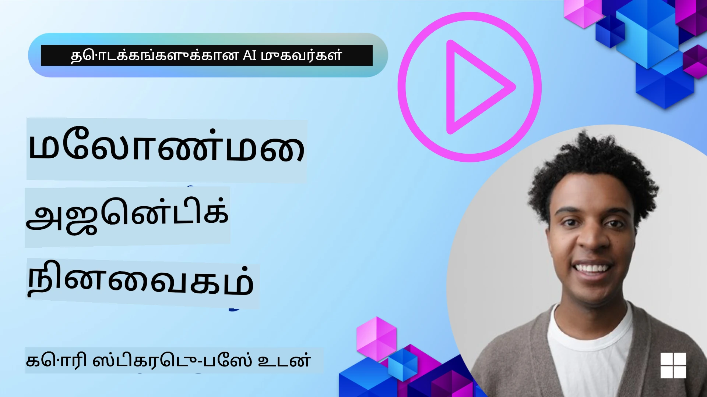

# AI முகவர்களின் நினைவகம் 

AI முகவர்கள் உருவாக்கத்தின் தனிச்சிறப்புகளைப் பற்றி பேசுகையில், இரண்டு முக்கிய அம்சங்கள் பேசப்படுகின்றன: பணிகளை முடிக்க கருவிகளை அழைக்கும் திறன் மற்றும் காலப்போக்கில் மேம்படுவதற்கான திறன். நம்முடைய பயனர்களுக்கு சிறந்த அனுபவங்களை உருவாக்கக்கூடிய சுய-மேம்படுத்தும் ஏஜென்டை உருவாக்குவதில் நினைவகம் அடிப்படை ஆகும்.

இந்த பாடத்தில், AI முகவர்களுக்கு நினைவகம் என்னென்றால் என்ன மற்றும் அதை எவ்வாறு நிர்வகித்து நமது பயன்பாடுகளின் பயன்பாட்டிற்காக பயன்படுத்தலாம் என்பதைக் காண்போம்.

## அறிமுகம்

இந்த பாடம் கற்பிக்கும் விஷயங்கள்:

• **AI முகவர் நினைவகத்தை புரிந்துகொள்வது**: நினைவகம் என்பது என்ன மற்றும் ஏன் அது முகவர்களுக்கு அவசியம் என்பதைப் பற்றி.

• **நினைவகத்தை實ம்செய்தல் மற்றும் சேமித்தல்**: குறுகியகால மற்றும் நீண்டகால நினைவகத்தை உள்ளடக்கிய உங்கள் AI முகவர்களுக்கு நினைவக திறன்களைச் சேர்ப்பதற்கான நடைமுறை முறைகள்.

• **AI முகவர்களை சுய-மேம்படுத்தக்கூடியதாக மாற்றுதல்**: நினைவகம் எந்தபொழுதும் கடந்த தொடர்புகளிலிருந்து கற்றுக்கொள்வதையும் காலப்போக்கில் முன்னேறுவதையும் எவ்வாறு செயல்படுத்துகிறது.

## கிடைக்கும் நடைமுறைகள்

இந்த பாடத்தில் இரண்டு முழுமையான நோட்புக் பாடநெறிகள் அடங்கும்:

• **[13-agent-memory.ipynb](./13-agent-memory.ipynb)**: Mem0 மற்றும் Azure AI Search ஐ Microsoft Agent Framework உடன் பயன்படுத்தி நினைவகத்தை அமல்படுத்துகிறது

• **[13-agent-memory-cognee.ipynb](./13-agent-memory-cognee.ipynb)**: Cognee பயன்படுத்தி கட்டமைக்கப்பட்ட நினைவகத்தை அமல்படுத்துகிறது, embeddings மூலம் ஆதரிக்கப்பட்ட அறிவுக் குறிப்பிடம் (knowledge graph) தானாக கட்டமைக்கிறது, குறிப்புகளை காட்சி முறையில் காட்டுகிறது, மற்றும் நுண்ணறி மீட்பு செயல்களை வழங்குகிறது

## கற்றல் இலக்குகள்

இந்தப் பாடத்தை முடித்த பிறகு, நீங்கள் தெரிந்துகொள்ள முடியும்:

• **வெவ்வேறு வகையான AI முகவர் நினைவகங்களின் இடையே வேறுபாடுகளை புரிந்துகொள்வது**, அதாவது வேலை நினைவகம், குறுகியகால நினைவகம், நீண்டகால நினைவகம் மற்றும் persona மற்றும் episodic போன்ற சிறப்பு வடிவங்கள்.

• **Microsoft Agent Framework பயன்படுத்தி AI முகவர்களுக்கு குறுகியகால மற்றும் நீண்டகால நினைவகத்தை செயல்படுத்தி நிர்வகிப்பது**, Mem0, Cognee, Whiteboard நினைவகம் போன்ற கருவிகள் மற்றும் Azure AI Search உடன் ஒருங்கிணைப்பை பயன்படுத்துவது.

• **சுய-மேம்படுத்தும் AI முகவர்களின் கொள்முறைகளைப் புரிந்துகொள்வது** மற்றும் வலுவான நினைவக நிர்வாக அமைப்புகள் நீடித்த கற்றல் மற்றும் ஏற்றுத்திறனை எவ்வாறு எடுக்க உதவுகின்றன என்பதைக் குறித்துப் புரிந்துகொள்வது.

## AI முகவர் நினைவகத்தைப் புரிதல்

அத்தரவின் மூலத்தில், **AI முகவர்களுக்கு நினைவகம் என்பது அவற்றை தகவலைக் காப்பாற்றவும் மீட்டெடுக்கவும் அனுமதிக்கும் முயற்சிகள்** ஆகும். இந்த தகவல் உரையாடலின் குறிப்புகள், பயனர் விருப்பங்கள், கடந்த செயல்கள் அல்லது கற்றுக்கொண்ட மாதிரிகள் போன்ற விபரங்கள் இருக்கலாம்.

நினைவகம் இல்லாமல், AI பயன்பாடுகள் பெரும்பாலும் நிலை இல்லாதவையாக உள்ளன, அதாவது ஒவ்வொரு தொடர்பும் துவக்கத்தில் இருந்து துவங்குகிறது. இது முகவர் முந்தைய சூழல் அல்லது விருப்பங்களை "மறந்துவிடும்" ஒரு முறையான மற்றும் கோபநிறைந்த பயனர் அனுபவத்தை ஏற்படுத்துகிறது.

### நினைவகம் ஏன் முக்கியம்?

ஒரு முகவரின் நுண்ணறிவு அதன் கடந்த தகவலை நினைவில் வைத்து பயன்படுத்தும் திறனுடன் ஆழமாக தொடர்பு கொண்டது. நினைவகம் முகவர்களுக்கு இதை சாத்தியமாக்குகின்றது:

• **பிற்போக்கியது**: கடந்த செயல்கள் மற்றும் முடிவுகளிலிருந்து கற்றல்.

• **இணையமைப்பு**: தொடர்ச்சியான உரையாடலின் போது சூழலை பராமரித்தல்.

• **முன்னறிவு மற்றும் எதிர் செயல்**: வரலாற்று தரவின் அடிப்படையில் தேவைகளை முன்னறிவு செய்தல் அல்லது பொருத்தமாக பதிலளித்தல்.

• **சுயாதீனம்**: சேமிக்கப்பட்ட அறிவைப் பயன்படுத்தி சுயமாக செயல்படுதல்.

நினைவகம் செயல்படுத்தும் நோக்கம் முகவர்களை மேலும் **நம்பகமான மற்றும் திறமையானவர்களாக்குவது** ஆகும்.

### நினைவக வகைகள்

#### வேலை நினைவகம்

ஒரு ஒரே, தொடர்ச்சியான பணிக்காக அல்லது எண்ணக் குரக்க செயல்முறைக்காக ஒரு முகவர் பயன்படுத்தும் சிறு கருச்சி காகிதம் போல இது கருதுங்கள். அடுத்த படியை கணக்கிட தேவையான உடனடி தகவலை இது வைத்திருக்கிறது.

AI முகவர்களுக்கு, வேலை நினைவகம் பெரும்பாலும் உரையாடலின் மிகவும் சம்பந்தப்பட்ட தகவலைப் பிடிக்கிறது, முழு உரையாடல் வரலாறு நீளமாக இருந்தாலும் அல்லது குறுக்கப்பட்டாலும் கூட. இது தேவைகள், பரிந்துரைகள், முடிவுகள் மற்றும் செயல்கள் போன்ற முக்கிய கூறுகளை எடுத்துக்காட்டுவதை மையமாக்குகிறது.

**வேலை நினைவக உதாரணம்**

ஒரு பயண முன்பதிவு முகவரியில், வேலை நினைவகம் பயனர் தற்போது கேட்டு இருக்கும் கோரிக்கையைப் பிடிக்கலாம், உதாரணமாக "நான் பாரிஸுக்கு ஒரு பயணம் எட்டி முன்பதிவு செய்ய விரும்புகிறேன்". இந்த குறிப்பிட்ட கோரிக்கை முகவரின் உடனடி சூழலில் பிரதானமாக வைக்கப்படுகிறது, தற்போதைய தொடர்பை வழிவகுக்க.

#### குறுகியகால நினைவகம்

இந்த வகை நினைவகம் ஒரு ஒரே உரையாடல் அல்லது அமர்வு காலத்திற்காக தகவலை வைத்திருக்கிறது. இது தற்போதைய உரையாடலின் சூழலாகும், முகவர் உரையாடலின் முந்தைய திருப்பங்களுக்கு மறுபடி குறிப்பிட்டு பார்க்க உதவுகிறது.

**குறுகியகால நினைவக உதாரணம்**

ஒரு பயனர் "பாரிஸுக்கு ஒரு விமானத்தின் கட்டணம் எவ்வளவு?" என்று கேட்கி பிறகு "அங்கே இருக்க விடுதலை பற்றி என்ன?" என்றால், குறுகியகால நினைவகம் "அங்கே" என்பது அதே உரையாடலில் "பாரிஸ்" என்பதை குறிப்பிடுவதை உறுதி செய்யும்.

#### நீண்டகால நினைவகம்

இது பல உரையாடல்கள் அல்லது அமர்வுகள் கடந்துபோகும் காலத்திற்கு தகவலைத் தொடர்ச்சியாக வைத்திருக்கிறது. இது முகவர்களுக்கு பயனர் விருப்பங்கள், வரலாற்று தொடர்புகள் அல்லது பொதுஅறிவு போன்றவற்றை நீண்டகாலமாக நினைவில் வைக்க உதவுகிறது. இது தனிப்பயனாக்கத்திற்கு முக்கியம்.

**நீண்டகால நினைவக உதாரணம்**

ஒரு நீண்டகால நினைவகம் "Ben ஸ்கீயிங் மற்றும் வெளிமாநிலங்களில் நடவடிக்கைகளை விரும்புகிறார், மலைக் காட்சி கொண்ட காபியை விரும்புகிறார், மற்றும் கடந்தக் காய்ச்சலினால் முன்னேற்றமான ஸ்கீ அடிப்படையிலான இருப்பிடங்களைத் தவிர்க்க விரும்புகிறார்" என்பதைக் சேமிக்கலாம். இந்த தகவல், கடந்த தொடர்புகளிலிருந்து கற்றுக்கொள்ளப்பட்டதாக, எதிர்கால பயண திட்டமிடல் அமர்வுகளில் பரிந்துரைகள் செய்யும்போது மிகுந்த தனிப்பயனாக்கத்தை சுட்டிக்கும்.

#### persona நினைவகம்

இந்த சிறப்பான நினைவகம் வகை ஒரு முகவருக்கு ஒரே மாதிரி "பெர்சோனா" அல்லது "பாத்திரம்" உருவாக்க உதவுகிறது. இது முகவர் தன்னைப் பற்றிய விவரங்களை அல்லது அதன் நோக்கமான பங்கு குறித்து நினைவில் வைக்க அனுமதிக்கிறது, இதனால் தொடர்புகள் மேலும் ஓரமையாகவும் கவனமுடன் நடைபெறும்.

**persona நினைவக உதாரணம்**
பயண முகவர் "நிபுணர் ஸ்கீ திட்டக் கோட்பாட்டாளர்" ஆக வடிவமைக்கப்பட்டிருந்தால், persona நினைவகம் இந்த பங்கைக் கணக்கில் கொண்டு அதற்கான பதில்களை ஒரு நிபுணரின் சுருக்க மற்றும் அறிவுத் தளத்தினுடன் ஒத்துப்போகச் செய்யும்.

#### Workflow/Episodic நினைவகம்

இந்த நினைவகம் ஒரு சிக்கலான பணியின் போது முகவர் எடுத்துகொள்ளும் படிகளின் வரிசையை, வெற்றிகள் மற்றும் தோல்விகளைச் சேர்த்து சேமிக்கும். இது குறிப்பிட்ட "பாகங்களை" அல்லது கடந்த அனுபவங்களை நினைவில் வைத்து அவற்றிலிருந்து கற்றுக்கொள்ளும் போல பொருந்தும்.

**Episodic நினைவக உதாரணம்**

முகவர் குறிப்பிட்ட ஒரு விமானத்தை முன்பதிவு செய்ய முயன்றது ஆனால் கிடைக்காமையால் அது தோல்வியடைந்தால், episodic நினைவகம் இந்த தோல்வியை பதிவு செய்து, அடுத்த முயற்சியில் மாற்று விமானங்களை முயற்சி செய்வதாக அல்லது பயனருக்கு மேலும் தெளிவான வழிகாட்டல் வழங்குவதற்காக உதவலாம்.

#### Entity நினைவகம்

இதில் உரையாடல்களில் இருந்து குறிப்பிட்ட பிரதிகள் (மக்கள், இடங்கள், பாகங்கள் போன்றவை) மற்றும் நிகழ்வுகளை எடுக்கும் மற்றும் நினைவில் வைக்கும் நடவடிக்கை உள்ளது. இது முகவரிற்கு முக்கிய கூறுகள் குறித்து கட்டமைக்கப்பட்ட புரிதலை உருவாக்க உதவும்.

**Entity நினைவக உதாரணம்**

ஒரு கடந்த பயணத்தின் உரையாடலிலிருந்து, முகவர் "Paris", "Eiffel Tower", மற்றும் "dinner at Le Chat Noir restaurant" ஆகியவற்றை பிரதிகளாக எடுத்து கொள்ளலாம். எதிர்கால தொடர்பில், முகவர் "Le Chat Noir" ஐ நினைவுசெய்து அங்கு புதிய முன்பதிவை செய்ய முன்மொழியலாம்.

#### Structured RAG (Retrieval Augmented Generation)

RAG என்பது ஏற்பாடாகப் பெரிய தொழில்நுட்பம் என்றாலும், "Structured RAG" ஒரு சக்திவாய்ந்த நினைவக தொழில்நுட்பமாக சிறப்பாக தெரிகிறது. இது உரையாடல்கள், மின்னஞ்சல்கள், படங்கள் போன்ற பல்வேறு ஆதாரங்களிலிருந்து மெனிந்த, கட்டமைக்கப்பட்ட தகவலை எடுத்து அதில் இருந்து பதில்களின் துல்லியம், மீள்பார்ப்பு மற்றும் வேகத்தை மேம்படுத்த பயன்படுத்துகிறது. பாரம்பரிய RAG semantic ஒத்துசார்பு மட்டும் சார்ந்திருக்கும் முறையை விட, Structured RAG தகவல்களின் தானியங்கி கட்டமைப்பையும் பயன்படுத்துகிறது.

**Structured RAG உதாரணம்**

முகவரி எதிர் மட்டும் சொற்களை பொருத்துவது தவிர, Structured RAG ஒரு மின்னஞ்சலில் இருந்து விமான விவரங்களை (இறுதிக்குறை, தேதி, நேரம், விமான நிறுவனம்) பார் செய்து அவற்றை கட்டமைக்கப்பட்ட முறையில் சேமிக்கலாம். இது "நான் செவ்வாய்க்கிழமை பாரிஸுக்கு எது விமானம் முன்பதிவு செய்தேன்?" போன்ற சரியான கூற்றுகளை கேட்கும் வகையில் பயன்படும்.

## நினைவகத்தை செயல்படுத்தலும் சேமிப்பும்

AI முகவர்களுக்கு நினைவகத்தை செயல்படுத்துவது ஒரு முறையான செயல்முறை olan **நினைவக மேலாண்மை** ஆகும், இதில் உருவாக்கம், சேமிப்பு, மீட்பு, ஒருங்கிணைப்பு, புதுப்பிப்பு மற்றும் மறப்பது (அல்லது நீக்குவது) ஆகியவை அடங்கும். மீட்பு ஒரு குறிப்பாக முக்கியமான அம்சம்.

### சிறப்பு நினைவக கருவிகள்

#### Mem0

முகவர் நினைவகத்தை சேமிப்பதற்கும் நிர்வகிப்பதற்கும் ஒரு வழி Mem0 போன்ற சிறப்பான கருவிகளை பயன்படுத்துவதுதான். Mem0 ஒரு நிலையான நினைவக அடுக்காக வேலை செய்கிறது, முகவர்கள் சம்பந்தபடுத்தப்பட்ட தொடர்புகளை நினைவில் வைத்துக்கொள்ள, பயனர் விருப்பங்கள் மற்றும் உண்மையான சூழலை சேமிக்க மற்றும் வெற்றி மற்றும் தோல்வியிலிருந்து கற்றுக்கொள்ள அனுமதிக்கிறது. இதன் கருத்து என்பது நிலை இல்லாத முகவர்கள் நிலை கொண்டதாக மாறுவதாகும்.

இது **இரு-பருவ நினைவக குழாய்: முடக்கம் மற்றும் புதுப்பிப்பு** வழியாக செயல்படுகிறது. முதலில், முகவர் திருப்பத்திற்கு சேர்க்கப்பட்ட செய்திகள் Mem0 சேவைக்கு அனுப்பப்படுகின்றன, இது ஒரு LLM ஐ பயன்படுத்தி உரையாடல் வரலாறை சுருக்கி புதிய நினைவுகளை எடுத்துக்கொள்கிறது. பின்னர், LLM உத்தியோகப்பூர்வமான புதுப்பிப்பு பருவம் இந்த நினைவுகளை சேர்க்கவேண்டுமா, மாற்றவேண்டுமா அல்லது நீக்கவேண்டுமா என்பதை தீர்மானித்து, அவற்றை வெக்டர், கிராப், மற்றும் விசை-மதிப்பிடுதல் தரவுத்தளங்கள் போன்ற ஹைப்ரிட் தரவுத்தளத்தில் சேமிக்கிறது. இந்த அமைப்பு பல நினைவக வகைகளையும் ஆதரிக்கிறது மற்றும் ஒருங்கிணைந்த பிரதிகளுக்கு இடையிலான உறவுகளை நிர்வகிக்க கிராப் நினைவகத்தையும் இணைக்கலாம்.

#### Cognee

மறொரு சக்திவாய்ந்த அணுகுமுறை **Cognee** ஐப் பயன்படுத்துவது ஆகும், இது திறந்த மூல semantic நினைவகம் ஆகி கட்டமைக்கப்பட்ட மற்றும் கட்டமைக்கப்படாத தரவுகளை embeddings மூலம் ஆதரிக்கப்பட்ட கேள்வி கேட்ககூடிய அறிவுக் குறிப்பிடங்களாக மாற்றுகிறது. Cognee ஒரு **இரட்டை-சேமிப்பு அமைப்பை** வழங்குகிறது, இது வெக்டர் ஒத்திசைவு தேடலை கிராப் உறவுகளுடன் இணைக்கிறது, மேலும் முகவர்கள் எந்த தகவல் ஒத்ததாக உள்ளது என்பதை மட்டுமல்லாமல் கருத்துக்கள் எவ்வாறு தொடர்பு கொண்டுள்ளன என்பதையும் புரிந்து கொள்ள உதவுகிறது.

இது வெக்டர் ஒத்திசைவு, கிராப் கட்டமைப்பு மற்றும் LLM தார்க்கீகத்தை கலப்பதன் மூலம் **இணைப்பு மீட்பு** யில் சிறந்தது - அசல் பகுதி தேடல் முதல் கிராப்-அறிவுடைய கேள்வி-பதில் வரை. இந்த அமைப்பு ஆகமக வாழும் நினைவகத்தை பராமரிக்கிறது, அது வளர்ந்து விரிகிறது மேலும் ஒரு இணைந்த கிராப் போல கேட்கக்கூடியதாக இருக்கும், குறுகியகால அமர்வு சூழலும் நீண்டகால நிலையான நினைவகத்தையும் ஆதரிக்கிறது.

Cognee நோட்புக் பாடநெறி ([13-agent-memory-cognee.ipynb](./13-agent-memory-cognee.ipynb)) இந்த ஒரு இணைந்த நினைவக அடக்கத்தை உருவாக்குவதைக் கற்றுக் கொடுக்கிறது, பல்வேறு தரவுத் ஆதாரங்களைச் சேர்ப்பது, அறிவுச் ச.graphனை காட்சி முறையில் காட்டுவது மற்றும் முகவர் தேவைகளுக்கேற்ற வகையில் பல்வேறு தேடல் உத்திகளைப் பயன்படுத்தி கேள்வி-பதில் செய்யும் நடைமுறைகளின் நடைமுறை எடுத்துக்காட்டுகளை உட்படுத்தி.

### RAG மூலம் நினைவகத்தை சேமித்தல்

mem0 போன்ற சிறப்பு நினைவக கருவிகளைத் தவிர, நீங்கள் Azure AI Search போன்ற வலுவான தேடல் சேவைகளை நினைவுகளை சேமிப்பதற்கும் மீட்டெடுக்குவதற்குமான பின்னணி வலைப்பின்னலாக பயன்படுத்தலாம், குறிப்பாக Structured RAG க்காக.

இது உங்கள் முகவரின் பதில்களை உங்கள் சொந்த தரவுடன் நிலைநாட்ட அனுமதிக்கிறது, மேலும் மேலும் பொருத்தமான மற்றும் உசோதமான பதில்களை உறுதிசெய்கிறது. Azure AI Search பயனர்-சிறப்பு பயண நினைவுகள், பொருள் பட்டியல்கள் அல்லது வேறு எந்த நிபுணத்துவத் தரவையும் சேமிக்க பயன்படுத்தப்படலாம்.

Azure AI Search **Structured RAG** போன்ற திறன்களை ஆதரிக்கிறது, இது உரையாடல் வரலாற்றுகள், மின்னஞ்சல்கள் அல்லது படங்கள் போன்ற பெரிய தரவுத்தொகுதிகளிலிருந்து மெனிந்த, கட்டமைக்கப்பட்ட தகவலை எடுக்கும் மற்றும் மீட்டெடுக்கும் திறனில் சிறந்தது. பாரம்பரிய உரை துண்டு செய்யும் மற்றும் embedding அணுகுமுறைகளோடு ஒப்பிடும்போது இது "மனிதன் மேம்பட்ட துல்லியம் மற்றும் மீள்பார்ப்பை" வழங்குகிறது.

## AI முகவர்களை சுய-மேம்படுத்தக்கூடியதாக மாற்றுதல்

சுய-மேம்படுத்தும் முகவர்களுக்கு பொதுவான ஒரு வடிவம் **"அறிவு முகவர்"** ஐ அறிமுகப்படுத்துவதாகும். இந்த தனி முகவர் பயனர் மற்றும் முதன்மை முகவருக்கிடையிலான முக்கிய உரையாடலைக் கவனிக்கின்றது. இதன் பங்கு:

1. **மதிப்புமிக்க தகவலை அடையாளம் காணுதல்**: உரையாடலின் எந்த பகுதி பொதுவான அறிவாக அல்லது குறிப்பிட்ட பயனர் விருப்பமாக சேமிக்க வேண்டுமெனத் தீர்மானித்தல்.

2. **எடுத்து சுருக்கித்தல்**: உரையாடலிலிருந்து அவசியமான கற்றல் அல்லது விருப்பத்தை சுருக்குதல்.

3. **அறிவுத்தளத்தில் சேமித்தல்**: இந்த எடுக்கப்பட்ட தகவலை பெரும்பாலும் வெக்டர் தரவுத்தளத்தில் நிலைத்தவையாக சேமித்தல், பின்னர் மீட்கக்கூடிய வகையில்.

4. **எதிர்கால கேள்விகளை செருக்கு**: பயனர் புதிய கேள்வியைத் தொடங்கும் போது, அறிவு முகவர் தொடர்புடைய சேமிக்கப்பட்ட தகவலை மீட்டெடுத்து பயனர் பிராம்ப்டிற்கு இணைத்து முதன்மை முகவருக்கு முக்கிய சூழலை வழங்கும் (RAG போன்றது).

### நினைவகத்துக்கான திறமையாள்தல்கள்

• **தாமத நிர்வாகம்**: பயனர் தொடர்புகளை மெதுவாக்காமல் இருக்க, முதலில் மலிவு மற்றும் வேகமான மாடலைப் பயன்படுத்தி எந்த தகவல் சேமிக்க மதிப்புள்ளது என்பதை துரிதமாக சரிபார்க்கலாம், தேவையான போது மட்டுமே அதிகமாகக் கடினமான எடுக்க/மீட்பு செயல்முறையை அழைக்கலாம்.

• **அறிவுத்தளம் பராமரிப்பு**: வளர்ந்துவரும் அறிவுத்தளத்திற்காக, குறைவாகப் பயன்படுத்தப்படும் தகவலை "குளிர் சேமிப்பு" இற்கு மாற்றி செலவுகளை நிர்வகிக்கலாம்.

## ஏஜென்ட் நினைவகத்தைப் பற்றிய கூடுதல் கேள்விகள் உண்டா?

மற்ற கற்றல் செய்பவர்களுடன் சந்திக்க, அலுவலக மணி நேரங்களைப் பெற மற்றும் உங்கள் AI முகவர் கேள்விகளுக்குத் தெளிவுபடுத்த பதில்களை பெற Microsoft Foundry Discord இல் சேரவும்: [Microsoft Foundry Discord](https://aka.ms/ai-agents/discord)

---

<!-- CO-OP TRANSLATOR DISCLAIMER START -->
மறுப்பு அறிவிப்பு:
இந்த ஆவணம் AI மொழிபெயர்ப்பு சேவையாகிய Co‑op Translator (https://github.com/Azure/co-op-translator) மூலம் மொழிபெயர்க்கப்பட்டுள்ளது. நாங்கள் துல்லியத்திற்காக முயற்சித்தாலும், தானியங்கி மொழிபெயர்ப்புகளில் பிழைகள் அல்லது துல்லியமின்மைகள் இருக்கலாம் என்பதை தயவுசெய்து கவனத்தில் கொள்ளுங்கள். ஆவணத்தின் சொந்த மொழியில் உள்ள மூல ஆவணத்தை அதிகாரப்பூர்வ மூலமாக கருதவும். முக்கியமான தகவல்களுக்கு, தொழில்முறை மனித மொழிபெயர்ப்பை பரிந்துரைக்கப்படுகிறது. இந்த மொழிபெயர்ப்பின் பயன்பாட்டால் ஏற்படும் எந்த தவறான புரிதல்களுக்கும் அல்லது தவறான விளக்கங்களுக்கும் நாங்கள் பொறுப்பேற்கமாட்டோம்.
<!-- CO-OP TRANSLATOR DISCLAIMER END -->