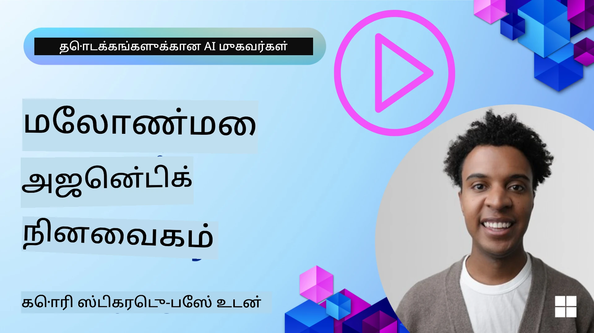

# AI முகவரிகளுக்கான நினைவகம்

AI முகவரிகள் உருவாக்குவதின் தனி நன்மைகள் பற்றி பேசும் பொழுது, இரண்டு விஷயங்கள் முக்கியமாக விவாதிக்கப்படுகின்றன: பணிகளை நிறைவேற்ற கருவிகளை அழைக்கக்கூடிய திறன் மற்றும் காலத்தின்போது மேம்படுவதற்கான திறன். நினைவகம் என்பது நமது பயனர்களுக்கு சிறந்த அனுபவங்களை உருவாக்கக்கூடிய சுய மேம்படும் முகவரியை உருவாக்குவதற்கான அடிப்படையே ஆகும்.

இந்த பாடத்தில், AI முகவரிகளுக்கான நினைவகம் என்ன என்பது மற்றும் அதை எவ்வாறு முகவரிகளுக்காக நிர்வகித்து பயன்படுத்தலாம் என்பதைக் காணப் போகின்றோம்.

## அறிமுகம்

இந்த பாடமானது பின்வருமாறு உள்ளது:

• **AI முகவரி நினைவகம் என்ன மற்றும் அது ஏன் அவசியமானது என்று புரிந்துகொள்வது.**

• **நினைவகம் செயல்படுத்தல் மற்றும் சேமிப்பு**: குறுகிய மற்றும் நீண்டகால நினைவகங்களைக் கவனத்தில் வைத்து உங்கள் AI முகவரிகளுக்கு நினைவகம் சேர்க்கும் நடைமுறை முறைகள்.

• **AI முகவரிகளை சுயமாக மேம்படுத்துவது**: முகவரிகள் கடந்த உறவுகளிலிருந்து கற்றுக் கொண்டு காலத்தின்போது எப்படி மேம்பட முடியும் என்பதைக் காண்பது.

## கிடைக்கும் செயலாக்கங்கள்

இந்த பாடத்தில் இரண்டு விரிவான நோட்புக் பாடங்கள் உள்ளன:

• **[13-agent-memory.ipynb](./13-agent-memory.ipynb)**: Mem0 மற்றும் Azure AI Search ஐ பயன்படுத்தி Microsoft Agent Framework உடன் நினைவகம் செயல்படுத்தல்

• **[13-agent-memory-cognee.ipynb](./13-agent-memory-cognee.ipynb)**: Cognee பயன்படுத்தி திட்டமிட்ட நினைவகம் செயல்படுத்தல், embeddings மூலம் ஆதாரமாகக் கொண்ட அறிவுக் கட்டத்தை தானாக கட்டுவது, கட்டத்தை காட்சிப்படுத்துவது மற்றும் நுண்ணறிவு மீட்பு

## கற்றல் குறிக்கோள்கள்

இந்த பாடத்தை முடித்த பிறகு, நீங்கள் எப்படி:

• **வேறு வகையான AI முகவரி நினைவகங்களை வேறுபடுத்துவது**, இதில் வேலைநினைவகம், குறுகிநினைவகம் மற்றும் நீண்டகால நினைவகம், மேலும் தனி வகையான வகைகள் போன்றது பொருந்தும் (persona மற்றும் episodic நினைவகம்).

• **Microsoft Agent Framework பயன்படுத்தி AI முகவரிகளுக்கான குறுகிநினைவகம் மற்றும் நீண்டகால நினைவகத்தை செயல்படுத்தி நிர்வகிப்பது**, Mem0, Cognee, Whiteboard memory போன்ற கருவிகளை பயன்படுத்தி Azure AI Search உடன் ஒருங்கிணைத்து.

• **சுயமாறுதலான AI முகவரிகளின் அடிப்படைக் கொள்கைகளைப் புரிந்துகொள்வது**, மற்றும் வலுவான நினைவக நிர்வகிப்பு முறைகள் தொடர்ந்த கற்றல் மற்றும் இடைமாற்றத்துக்கு எவ்வாறு உதவுகின்றன என்பதைக் காண்பது.

## AI முகவரி நினைவகம் புரிதல்

ஆழமாகப் பார்ப்பதில், **AI முகவரிகளுக்கான நினைவகம் என்பது அவர்களுக்கு தகவலை சிந்தித்து நினைவில்கூற மற்றும் மீட்டெடுக்கவிடும் முறைகள் ஆகும்**. இந்த தகவல் உரையாடல் பற்றிய குறிப்புகள், பயனர் விருப்பங்கள், கடந்த செயல்கள் அல்லது கற்றுக்கொண்ட முறைப்படிகள் ஆகியவையாக இருக்கலாம்.

நினைவகம் இல்லாமல், AI செயலிகள் கூடுதலாக நிலை இருப்பற்றவையாக நீர்கின்றன, அதாவது ஒவ்வொரு உறவுமுறைதனிலும் சிறிய தொடக்கம் மறுபடியும் நடக்கிறது. இது முந்தைய உரையாடல் சூழல் அல்லது விருப்பங்களை "மறந்து" விடும் பக்கவிளைவுடன் பயனாளருக்கு முற்றிலும் சோர்வான அனுபவத்தை ஏற்படுத்துகிறது.

### நினைவகம் ஏன் முக்கியம்?

ஒரு முகவாரியின் அறிவு அதன் கடந்த தகவலை மீட்டெடுத்து பயன்படுத்தும் திறனுக்கு ஆழமாக தொடர்புடையது. நினைவகம் முகவரிகளுக்கு:

• **பின்னூட்டமானது**: கடந்த செயல்கள் மற்றும் முடிவுகளிலிருந்து கற்பது.

• **உரையாடல் தொடர்புடையது**: தொடரும் உரையாடலில் சூழலை பராமரிப்பது.

• **முன்மொழியும் மற்றும் எதிர்வினையாடலானது**: தேவைகளை முன்னறிவித்தல் அல்லது வரலாற்று தரவின் அடிப்படையில் அவற்றுக்கு முறையாக பதிலளித்தல்.

• **சுயமாக இயங்கும்**: சேமிக்கப்பட்ட அறிவை பயன்படுத்தி அதிகமாக சுதந்திரமாக இயங்குதல்.

நினைவகம் செயல்படுத்துவதன் இலக்கம் முகவரிகளை மேலும் **நம்பகமான மற்றும் திறமையான**வாறு ஆக்குவது ஆகும்.

### நினைவக வகைகள்

#### வேலைநினைவகம்

ஒரு முகவாரி ஒரே தொடரும் பணி அல்லது சிந்தனைக்கான போது பயன்படுத்தும் ஒரு துளி காகிதம் என்று இதை நினைத்துக் கொள்ளலாம். அடுத்த படியை கணக்கிட உடனடி தகவலை இதில் ஏற்றுக்கொள்ளும்.

AI முகவரிகளுக்கான வேலைநினைவகம் உரையாடலில் மிகவும் தொடர்புடைய தகவல்களைப் பிடிக்கும், உரையாடல் முழுக்கட்டையும் நீண்ட அல்லது குறுக்கப்பட்டாலும் கூட. இது தேவைகள், முன்மொழிப்புகள், முடிவுகள் மற்றும் செயல்களை முதன்மையாக எடுத்துக்காட்டுகிறது.

**வேலைநினைவகம் உதாரணம்**

ஒரு பயண முன்பதிவு முகவாரியில், வேலைநினைவகம் பயனர் தற்போதைய கோரிக்கையைப் பிடிக்கலாம், உதாரணமாக "எனக்கு பாரிஸுக்கு பயணம் முன்பதிவு செய்யவேண்டும்". இந்த குறிப்பிட்ட கோரிக்கை முகவரியின் உடனடி சூழலில் வைக்கப்படுகிறது, தற்போதைய உறவுக்கான வழிகாட்டியாக.

#### குறுகிநினைவகம்

ஒரே உரையாடல் அல்லது அமர்வின் காலப்படியாக தகவல் பிடிக்கும் நினைவகம் இது. தற்போதைய உரையாடல் சூழல் ஆகும், இது முகவரிக்கு உரையாடலில் முந்தைய வாய்ப்புகளை மேற்கோள் விட அனுமதிக்கிறது.

[Microsoft Agent Framework](https://github.com/microsoft/agent-framework) Python SDK மாதிரிகளில், இது `AgentSession` ஆக பொருந்துகிறது, `agent.create_session()` மூலம் உருவாக்கப்படுகிறது. அந்த அமர்வு கட்டமைப்பின் உள்ளக குறுகிநினைவகம் ஆகும்: அந்த அமர்வின் போது உரையாடல் சூழலை காப்பாற்றுகிறது, ஆனால் அமர்வு முடிவடையும் அல்லது செயலி மீண்டும் தொடங்கும் போது அது நிலைத்துவில்லை. அமர்வுகளுக்கிடையே வாழ்த்தான தகவல்கள் மற்றும் விருப்பங்களுக்கு நீண்டகால நினைவகத்தை பயன்படுத்த வேண்டும், பெரும்பாலும் தரவுத் தரவுத்தளம், வெக்டார் குறியீடு அல்லது வேறு நிலைத்த урын மூலம்.

**குறுகிநினைவகம் உதாரணம்**

பயனர் "பாரிஸுக்கான விமானம் எவ்வளவு விலை?" என்று கேட்டால், பின்னர் "அங்கே கிளைக்கு இருப்பது எப்படி?" என்று தொடர்ந்தால், குறுகிநினைவகம், அந்த உரையாடலின் அடிப்படையில் "அங்கே" என்பதற்கு "பாரிஸ்" என்று முகவரி மூலம் அறிவிக்கப்படுவதை உறுதிப்படுத்தும்.

#### நீண்டகால நினைவகம்

இது பல உரையாடல்கள் அல்லது அமர்வுகளுக்கு இடையே மாறாத தகவலைக் காக்கும் நினைவகம். இது முகவரிகளுக்கு பயனர் விருப்பங்கள், வரலாற்று உறவுகள் அல்லது விரிவான அறிவை நீண்ட காலத்திற்கு நினைவில் வைக்க உதவுகிறது. தனிப்பட்ட முறையில் முக்கியமாக இது பயன்படும்.

**நீண்டகால நினைவகம் உதாரணம்**

ஒரு நீண்டகால நினைவகம் "பென் ஸ்கீயிங் மற்றும் வெளிப்புற செயல்பாடுகளை விரும்புகிறார், மலைக் காட்சியுடன் காபி பிடிப்பதை விரும்புகிறார், மற்றும் கடந்த பாதிக்கப்பட்டதினால் முன்னேற்ற ஸ்கி மருக்களை தவிர்க்க விரும்புகிறார்" என்று சேமிக்கலாம். கடந்த உரையாடல்களில் கற்ற இந்த தகவல் எதிர்கால பயண திட்டமிடல்களில் பரிந்துரைகளை மிகுந்த தனிப்பட்டதாக மாற்றும்.

#### Persona நினைவகம்

இந்த சிறப்பு நினைவகம் ஒரு முகவரிக்கு ஒரே மாதிரியான "பண்பு" அல்லது "பேர்சோனா" வளர்க்க உதவுகிறது. இது முகவரி தன்னைப் பற்றிய அல்லது அவன் நோக்கப்பட்ட பாத்திரம் குறித்த விவரங்களை நினைவில் வைக்க அனுமதிக்கிறது, உரையாடல்களை மேலும் மென்மையாக்கி கவனமாக்குகிறது.

**Persona நினைவகம் உதாரணம்**
பயண முகவரி ஒரு "துறையில் நிபுணர் ஸ்கி திட்டமிடுபவர்" ஆக வடிவமைக்கப்பட்டால், persona நினைவகம் இந்த பாத்திரத்தைக் கூறி முகவரி விடைகள் அடிப்படையில் நிபுணரின் சந்து மற்றும் அறிவு பின்பற்றும்.

#### Workflow/Episodic நினைவகம்

இந்த நினைவகம் ஒரு முகவரியின் ஒரு சிக்கலான பணியின் படிகளின் வரிசையைக் கொள்கிறது, சாதனைகள் மற்றும் தோல்விகள் உட்பட. இது மிக முக்கியமான "எபிசோட்கள்" அல்லது கடந்த அனுபவங்களை நினைவில் கொள்ளத்தக்கது.

**Episodic நினைவகம் உதாரணம்**

முகவரி ஒரு குறிப்பிட்ட விமானம் முன்பதிவு செய்வதில் தோல்வியடைந்தால், அந்த தோல்வியை episodic நினைவகம் பதிவு செய்யலாம், இதனால் அடுத்த முயற்சியில் மாற்று விமானங்களை முயற்சி செய்யவோ அல்லது பயனருக்கு அந்த பிரச்சினையை நல்ல முறையில் அறிமுகப்படுத்தவோ முடியும்.

#### Entity நினைவகம்

இது உரையாடல்களில் இருந்து குறிப்பிட்ட ஐடயம் (பேர், இடங்கள் அல்லது பொருட்கள்) மற்றும் நிகழ்வுகளை எடுத்துக்கொண்டு நினைவில் வைக்கிறது. இது முக்கிய கூறுகளின் கட்டமைக்கப்பட்ட புரிதலை உருவாக்க உதவுகிறது.

**Entity நினைவகம் உதாரணம்**

கடந்த பயண உரையாடலிலிருந்து, முகவரி "பாரிஸ்," "ஐபல் கோபுரம்," மற்றும் "Le Chat Noir உணவகம் டின்னர்" போன்ற கூறுகளை எடுத்துக்கொள்ளலாம். எதிர்கால உரையாடலில் முகவரி "Le Chat Noir" நினைவலை கொண்டு அங்கு புதிய முன்பதிவை செய்ய பரிந்துரை செய்யலாம்.

#### கட்டமைக்கப்பட்ட RAG (மீடு மேலதிகப்படுத்தப்பட்டது உற்பத்தி)

RAG என்பது விரிவான நுட்பமாக இருந்தாலும், "கட்டமைக்கப்பட்ட RAG" என்பது சக்திவாய்ந்த நினைவகம் தொழில்நுட்பமாக விளக்கப்படுகிறது. இது உரையாடல்கள், மின்னஞ்சல்கள், படங்கள் போன்ற பல்வேறு ஆதாரங்களில் இருந்து திடமான, கட்டமைக்கப்பட்ட தகவல்களை எடுத்துக்கொண்டு பதில்களில் துல்லியம், மீட்டெடுக்கும் திறன் மற்றும் வேகத்தை மேம்படுத்துகிறது. செலவுக் கூர்ந்த பாரம்பரிய RAG semantically ஒத்துணர்வு மட்டும் சார்ந்திருந்தால், கட்டமைக்கப்பட்ட RAG தகவலின் இயல்புவிதானத்துடன் செயல்படும்.

**கட்டமைக்கப்பட்ட RAG உதாரணம்**

திறவா சொற்களின் ஒத்துப்போகுதலை மட்டும் செய்யாமல், கட்டமைக்கப்பட்ட RAG ஒரு மின்னஞ்சலிலிருந்து விமான விவரங்களை (இடம், தேதி, நேரம், விமான நிறுவனம்) பிரித்து, அமைப்புடன் சேமிக்கலாம். இது "செவ்வாய்க்கிழமை பாரிஸ் பயணத்தை நான் எப்போது முன்பதிவு செய்தேன்?" போன்ற துல்லியான வினாக்களை பெற உதவுகிறது.

## நினைவகம் செயல்படுத்தல் மற்றும் சேமிப்பு

AI முகவரிகளுக்கான நினைவகம் செயல்படுத்துவது என்பது **நினைவக நிர்வகிப்பு** என்ற முறையான செயல்முறை, உருவாக்குதல், சேமித்தல், மீட்டெடுத்தல், ஒருங்கிணைத்தல், புதுப்பித்தல் மற்றும் "மறந்து விடுதல்" (அழித்தல்) ஆகியவற்றைக் கொண்டதாய் உள்ளது. அதில் மீட்டெடுத்தல் மிகவும் முக்கியமான அம்சமாகும்.

### சிறப்பு நினைவக கருவிகள்

#### Mem0

முகவரி நினைவகத்தை சேமித்து நிர்வகிப்பதற்கான ஒரு வழி Mem0 போன்ற சிறப்பு கருவிகளைப் பயன்படுத்துவது. Mem0 ஒரு நிலைத்த நினைவக அடுக்கு ஆக செயல்படுகிறது, இது முகவரிகளுக்கு தொடர்புடைய உறவுகளை மீட்டெடுக்க, பயனர் விருப்பங்கள் மற்றும் உண்மை சூழலை சேமிக்க மற்றும் காலப்போக்கில் வெற்றி மற்றும் தோல்விகளிலிருந்து கற்றுக்கொள்ள அனுமதிக்கிறது. இதன் நோக்கம் நிலைமையற்ற முகவரிகள் நிலையானவர்களாக மாற்றப்படுவது.

இது **இரு நிலை நினைவக குழாய்: உறிப்பதிகை மற்றும் புதுப்பிப்பு** முறையில் செயல்படுகிறது. முதலில், முகவரியின் தகவல் தொடுக்குக் கூடும்போது அதை Mem0 சேவைக்கு அனுப்புகிறது, இது பெரிய மொழி மாதிரி (LLM) பயன்படுத்தி உரையாடல் வரலாறை சுருக்கி புதிய நினைவுக்களைப் பெறுகிறது. பின்னர் LLM வழி இயக்கப்படும் புதுப்பிப்பு கட்டத்தில் நினைவுகளைச் சேர்க்க, மாற்ற வைக்க, அல்லது அழிக்க முடிவு செய்கிறது; மேலும் அதனை வெக்டார், கட்டமைப்புக் காட்சி மற்றும் கீ-விலை தரவுத்தளங்களை உள்ளடக்கிய கலப்பு தரவு சேமிப்பகத்தில் வைக்கிறது. இந்த அமைப்பு பல நினைவக வகைகளையும் ஆதரிக்கிறது மற்றும் ஒற்றுமை உள்ள தொடர்புக்களைப் பராமரிக்க கட்டமைப்புக் நினைவகம் சேர்க்கவும் முடியும்.

#### Cognee

மற்றொரு சக்திவாய்ந்த அணுகுமுறை, AI முகவரிகளுக்கான திறன்படுத்தும் நினைவகமாக விளங்கும் Cognee, கட்டமைக்கப்பட்ட மற்றும் கட்டமைக்கப்படாத தரவை கேள்வி கேட்கக்கூடிய அறிவுக் கட்டமைப்புகளுக்குள் மாற்றுகிறது, embeddings மூலம் ஆதரிக்கப்படும். Cognee ஒரு **இரட்டை சேமிப்பு கட்டமைப்பை** வழங்குகிறது, இதில் வெக்டார் ஒத்துபோக்குள் தேடலும், கட்டமைப்பு தொடர்புகளும் இணைந்துள்ளன, இது முகவரிக்கு தகவல் எவை ஒத்துள்ளன என்பதை மட்டுமல்ல, கருத்துக்கள் எவ்வாறு தொடர்புடையதென்று புரிந்துகொள்ளவும் உதவுகிறது.

இது வெக்டார் ஒத்துமை, கட்டமைப்பு மற்றும் LLM பகுத்தறிந்துடன் கலந்த மீட்டெடுப்பில் சிறந்து செயற்படுகிறது - அடுக்குத் துண்டு தேடல் முதல் கட்டமைப்பை அறிவு கேள்வி பதிலளிப்பவரை வரை. அமைப்பு **செயலில் நினைவகத்தை** பராமரிக்கிறது, இது வளர்ந்து பரவுகின்றது மற்றும் ஒன்றிணைந்த கட்டமைப்பாகவே கேட்கக்கூடியதாக இருந்து குறுகிநினைவகம் மற்றும் நீண்டகால நினைவகத்தையும் ஆதரிக்கிறது.

Cognee நோட்புக் பாடக் குறிப்பு ([13-agent-memory-cognee.ipynb](./13-agent-memory-cognee.ipynb)) இந்த ஒருங்கிணைந்த நினைவக அடுக்கை அமைப்பது, வேறுங் தரவு ஆதாரங்களைச் சேர்ப்பது, அறிவுக் கட்டமைப்பை காட்சிப்படுத்துவது மற்றும் முகவரி தேவைகளுக்கேற்ற வகையில் கருதப்பட்ட பகுதிகள் மூலம் கேள்வி கேட்டல் பாவனை எடுத்துக்காட்டுகிறது.

### RAG உடன் நினைவகம் சேமித்தல்

Mem0 போன்ற சிறப்பு நினைவக கருவிகளுக்கு அப்பால், நீங்கள் வலுவான தேடல் சேவைகளைப் பயன்படுத்தி **Azure AI Search ஐ நினைவுக்களை சேமிப்பதும் மீட்டெடுப்பதும் செய்வதற்கான பின்னணியாக** பயன்படுத்து முடியும், குறிப்பாக கட்டமைக்கப்பட்ட RAG க்கு.

இது உங்கள் முகவரியின் பதில்களை உங்கள் சொந்த தரவுடன் நிலைநிறுத்தி, மேலும் பொருத்தமான மற்றும் துல்லியான பதில்களை உறுதிப்படுத்த உதவுகிறது. Azure AI Search பயனர்-குறிப்பிட்ட பயண நினைவுகள், பொருள் பட்டியல்கள் அல்லது வேறு எந்த தொழிற் துறைக் அறிவும் சேமிப்பதற்கு பயன்படுத்தப்படலாம்.

Azure AI Search போன்ற தன்மைகளை ஆதரிக்கிறது: **கட்டமைக்கப்பட்ட RAG**, இது உரையாடல் வரலாறு, மின்னஞ்சல் அல்லது படங்கள் போன்ற பெரிய தரவுத்தொகுதியில் இருந்து திடமான, கட்டமைக்கப்பட்ட தகவல்களை எடுத்தெடுத்து மீட்டெடுப்பதில் சிறந்தது. இது பாரம்பரிய உரை துண்டுப் பகுப்பாய்வு மற்றும் embedding முறைகளுக்கு முந்தான "மிகு துல்லியம் மற்றும் மீட்டெடுப்பு" வழங்குகிறது.

## AI முகவரிகளை சுயமாக மேம்படுத்துதல்

சுயமாக மேம்படுத்தும் முகவரிகளுக்கான பொதுவான முறையில் ஒரு **"அறிவுக் முகவர்"** சேர்க்கப்படுகிறது. இந்த தனி முகவர் பயனர் மற்றும் பிரதான முகவரியினுடைய உரையாடலை கவனிக்கிறது. அதன் பங்கு:

1. **மதிப்புமிக்க தகவலை அடையாளம் காணுதல்**: உரையாடலின் எந்த பகுதி பொது அறிவாகவோ தனிப்பட்ட பயனர் விருப்பமாகவோ சேமிக்கக் கூடியதா என்பதை தீர்மானிக்கிறது.

2. **எடுத்து சுருக்குதல்**: உரையாடலிலிருந்து முக்கியக் கற்றல் அல்லது விருப்பத்தை உறுக்குவது.

3. **அறிவுக்கூடத்தில் சேமித்தல்**: இந்த எடுக்கப்பட்ட தகவலை பெரும்பாலும் வெக்டார் தரவுத்தளத்தில் நிலைத்தவையாக சேமிக்கிறது, பின்னர் மீட்டெடுக்க முடியும்.

4. **எதிர்கால கேள்விகளில் அதிகரிப்பு**: பயனர் புதிய கேள்வி தொடங்கும்போது, அறிவுக் முகவர் தொடர்புடைய சேமிக்கப்பட்ட தகவலை மீட்டெடுத்து பயனரின் அட்டை உரையின் பின்னர் சேர்க்கிறது, பிரதான முகவரிக்கு அவசியமான சூழலை வழங்குகிறது (RAG போல்).

### நினைவகத்திற்கு கிடைக்கும் முறைகள்

• **தாமத நிர்வாகம்**: பயனர் உறவுகளை மெதுவாக்காமல், முன் கொஞ்சம் குறைந்த செலவுடனான வேகமான மாதிரியை முதலில் பயன்படுத்தி தகவல் சேமிப்பதற்கு மதிப்புரைப் பார்வை செய்யவும், பின்னர் மிகவும் சூழலை ஆய்வு செய்ய அதிகச் சிரமமுள்ள செயல்முறையை மட்டும் அழைக்கவும்.

• **அறிவுக்கூட பராமரிப்பு**: வளர்ந்து கொண்ட அறிவுக்கூடத்திற்காக, குறைவான பயன்பாட்டிலுள்ள தகவலை "குளிர்சாதன இடம்"க்கு மாற்றி செலவினத்தை கட்டுப்படுத்தலாம்.

## முகவரி நினைவகம் பற்றிய மேலும் கேள்விகள் உள்ளதா?

பிற கற்றல் நண்பர்களுடன் கலந்துரையாட, அலுவலக நேரத்தில் கலந்துகொள்ள மற்றும் உங்கள் AI முகவர் தொடர்புடைய கேள்விகளுக்கு பதில் பெற, [Microsoft Foundry Discord](https://discord.com/invite/ATgtXmAS5D) இல் இணையுங்கள்.

---

<!-- CO-OP TRANSLATOR DISCLAIMER START -->
**மறுப்பு**:
இந்த ஆவணம் AI மொழிபெயர்ப்பு சேவை [Co-op Translator](https://github.com/Azure/co-op-translator) பயன்படுத்தி மொழிபெயர்க்கப்பட்டுள்ளது. நாங்கள் துல்லியத்திற்காக முயற்சி செய்துள்ளோம், ஆனால் தானாக செய்யப்படும் மொழிபெயர்ப்புகளில் பிழைகள் அல்லது தவறுகள் இருக்கலாம் என்பதை கவனத்தில் கொள்ளவும். அசல் ஆவணம் அதன் தாய்மொழியில் அதிகாரப்பூர்வ ஆதாரமாக கருதப்பட வேண்டும். முக்கியமான தகவல்களுக்கு, தொழில்நுட்பமான மனித மொழிபெயர்ப்பு பரிந்துரைக்கப்படுகிறது. இந்த மொழிபெயர்ப்பைப் பயன்படுத்துவதால் ஏற்படும் எந்த தவறான புரிதல்கள் அல்லது தவறான விளக்கத்திற்கும் நாங்கள் பொறுப்பில்வில்லை.
<!-- CO-OP TRANSLATOR DISCLAIMER END -->