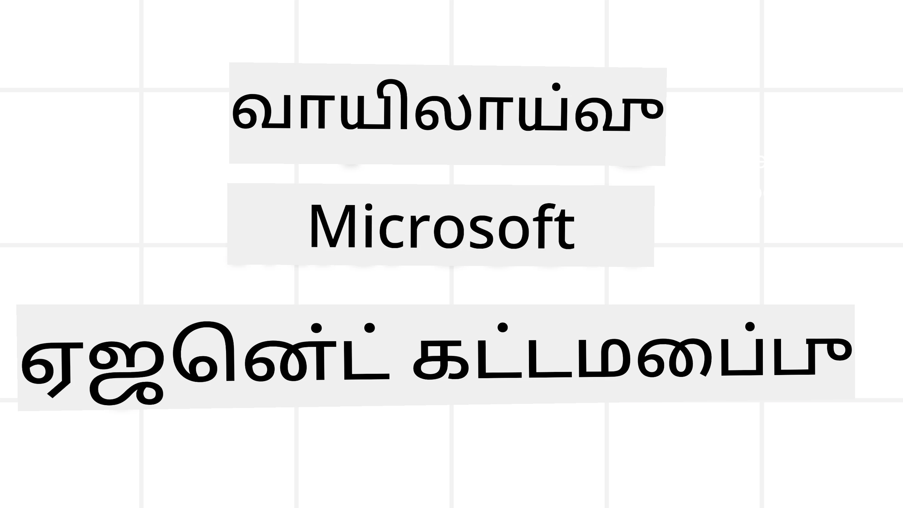
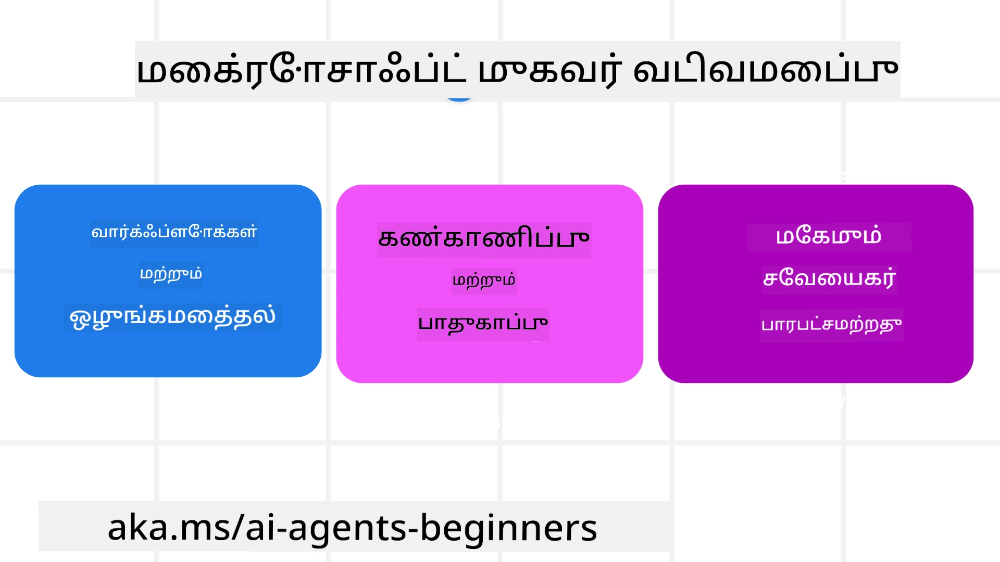

# மைக்ரோசாஃப்ட் ஏஜென்ட் கட்டமைப்பை ஆராய்தல்



### அறிமுகம்

இந்த பாடத்தில் பின்வையானவை காணப்படும்:

- மைக்ரோசாஃப்ட் ஏஜென்ட் கட்டமைப்பை உணர்தல்: முக்கிய அம்சங்கள் மற்றும் மதிப்பு  
- மைக்ரோசாஃப்ட் ஏஜென்ட் கட்டமைப்பின் முக்கியக் கருத்துக்களை ஆராய்தல்
- மேம்பட்ட MAF முறைமைகள்: பணிச்சுழற்சிகள், மத்தியமைப்பு, மற்றும் நினைவகம்

## கற்றல் குறிக்கோள்கள்

இந்த பாடத்தை முடித்தவுடன், நீங்கள்:

- மைக்ரோசாஃப்ட் ஏஜென்ட் கட்டமைப்பை பயன்படுத்தி தயாரிப்பு தயாரான AI ஏஜென்டுகளை உருவாக்க கற்றுக்கொள்வீர்கள்
- உங்கள் ஏஜென்டிக் பயன்பாடுகளுக்கு மைக்ரோசாஃப்ட் ஏஜென்ட் கட்டமைப்பின் மைய அம்சங்களை பயன்படுத்த கற்றுக்கொள்வீர்கள்
- பணிச்சுழற்சிகள், மத்தியமைப்பு மற்றும் கண்காணிப்பை உள்ளடக்கிய மேம்பட்ட முறைமைகளைப் பயன்படுத்த கற்றுக்கொள்வீர்கள்

## குறியீட்டு மாதிரிகள்

[Microsoft Agent Framework (MAF)](https://aka.ms/ai-agents-beginners/agent-framewrok) க்கான குறியீட்டு மாதிரிகள் இந்த இருப்பிடத்தில் `xx-python-agent-framework` மற்றும் `xx-dotnet-agent-framework` கோப்புகளில் காணலாம்.

## மைக்ரோசாஃப்ட் ஏஜென்ட் கட்டமைப்பை புரிந்துகொள்ளுதல்



[Microsoft Agent Framework (MAF)](https://aka.ms/ai-agents-beginners/agent-framewrok) என்பது AI ஏஜென்டுகளை உருவாக்க மைக்ரோசாஃப்ட்டின் இணுங்கட்சி கட்டமைப்பு ஆகும். இது தயாரிப்பு மற்றும் ஆராய்ச்சி சூழல்களில் காணப்படும் பலவிதமான ஏஜென்டிக் பயன்பாடுகளை சந்திக்க சுதந்திரத்தை வழங்குகிறது:

- படி படியாக பணிச்சுழற்சிகள் தேவைப்படும் சூழ்நிலைகளில் **தொடர் ஏஜென்ட் ஒர்க்டிரேஷன்**.
- ஏஜென்ட்கள் ஒரே நேரத்தில் பணிகளை முடிக்க வேண்டும் எனும் சூழ்நிலைகளில் **ஒத்த ஒர்க்டிரேஷன்**.
- ஏஜென்ட்கள் ஒன்றாக சேர்ந்து ஒரு பணியில் இணைந்து செயல்படவும் ஏற்ற சூழ்நிலைகளில் **குழு அரட்டை ஒர்க்டிரேஷன்**.
- துணைப் பணிகள் நிறைவடையும் போது ஏஜென்ட்கள் ஒருவரிடமிருந்து மற்றவருக்கு பணியை மாற்றும் சூழ்நிலைகளில் **பணியிட மாற்று ஒர்க்டிரேஷன்**.
- மேலாளர் ஏஜென்ட் ஒரு பணிப் பட்டியலை உருவாக்கி மாற்றி துணை ஏஜென்ட்களை ஒத்துழைப்பதற்கு கையாளும் சூழ்நிலைகளில் **காந்த ஒர்க்டிரேஷன்**.

தயாரிப்பில் AI ஏஜென்டுகளை வழங்க MAF பின்வரும் அம்சங்களையும் உடைமை:

- Microsoft Foundry டாஷ்போர்டுகள் வழியாக அனைத்து AI ஏஜென்ட் செயல்கள், கருவி அழைப்புகள், ஒர்க்டிரேஷன் படிகள், காரணித்தல் ஓட்டங்கள் மற்றும் செயல்திறன் கண்காணிப்புகளுக்கு வழங்கப்படும் OpenTelemetry மூலம் **கண்காணிப்பு**.
- மைக்ரோசாஃப்ட் Foundry இல் இயல்புநிலை ஏஜென்ட்களை ஹோஸ்ட் செய்வதன் மூலம் இடமாற்றக் கட்டுப்பாடுகள், தனிப்பட்ட தரவு கையாள்தல் மற்றும் உள்ளமைக்கப்பட்ட உள்ளடக்க பாதுகாப்புயான **பாதுகாப்பு**.
- ஏஜென்ட் திரெட்கள் மற்றும் பணிச்சுழற்சிகள் தவறுகளிலிருந்து இடைநிறுத்தம், மறு தொடக்கம் மற்றும் மீட்பு செய்யப்படுவதால் **தடைக்கூடல்**.
- மனித ஒப்புதல் தேவைப்படும் பணிகளை குறிக்க மனித பொறுப்பில் உள்ள பணிச்சுழற்சிகள் மூலம் **கட்டுப்பாடு**.

மைக்ரோசாஃப்ட் ஏஜென்ட் கட்டமைப்பு கீழ்காணும் துறைகளில் இணக்கமானதாக அமைந்துள்ளது:

- **மெகுமணத் தொழில்நுட்பம்** - ஏஜென்ட்கள் கன்டெய்னர்கள், உள்ளூர் மற்றும் பல மேக தளங்களில் இயங்கலாம்.
- **வழங்குநர் சாரா** - Azure OpenAI மற்றும் OpenAI உட்பட உங்கள் விருப்ப SDK மூலம் ஏஜென்ட்களை உருவாக்கலாம்.
- **திறந்த தரநிலைகள் ஒருங்கிணைப்பு** - Agent-to-Agent(A2A) மற்றும் Model Context Protocol (MCP) போன்ற ப்ரொடோகால்களைச் பயன்படுத்தி பிற ஏஜென்ட்கள் மற்றும் கருவிகளை கண்டறிந்து பயன்படுத்தலாம்.
- **பிளகின்கள் மற்றும் இணைப்பிகள்** - Microsoft Fabric, SharePoint, Pinecone மற்றும் Qdrant போன்ற தரவு மற்றும் நினைவக சேவைகளுடன் இணைக்கப்பட முடியும்.

இவை மைக்ரோசாஃப்ட் ஏஜென்ட் கட்டமைப்பின் சில முக்கியக் கருத்துக்கள் மீது எவ்வாறு பயன்படுத்தப்படுகின்றன என்பதைக் காணலாம்.

## மைக்ரோசாஃப்ட் ஏஜென்ட் கட்டமைப்பின் முக்கியக் கருத்துக்கள்

### ஏஜென்ட்கள்


**ஏஜென்ட்களை உருவாக்குதல்**

ஏஜென்ட் உருவாக்கம் என்பது inference சேவையினை (LLM வழங்குநர்), AI ஏஜென்ட் பின்பற்ற வேண்டிய பணிகளின் தொகுப்பை, மற்றும் ஒரு வழங்கப்பட்ட `name`ஐ வரையறுக்க செய்வதாகும்:

```python
agent = AzureOpenAIChatClient(credential=AzureCliCredential()).create_agent( instructions="You are good at recommending trips to customers based on their preferences.", name="TripRecommender" )
```

மேலே `Azure OpenAI` பயன்படுத்தப்பட்டுள்ளது, ஆனால் ஏஜென்ட்கள் `Microsoft Foundry Agent Service` உள்ளிட்ட பல சேவைகளைப் பயன்படுத்தி உருவாக்கப்படலாம்:

```python
AzureAIAgentClient(async_credential=credential).create_agent( name="HelperAgent", instructions="You are a helpful assistant." ) as agent
```

OpenAI `Responses`, `ChatCompletion` APIs

```python
agent = OpenAIResponsesClient().create_agent( name="WeatherBot", instructions="You are a helpful weather assistant.", )
```

```python
agent = OpenAIChatClient().create_agent( name="HelpfulAssistant", instructions="You are a helpful assistant.", )
```

அல்லது A2A ப்ரொடோகால் மூலம் தொலைநிலை ஏஜென்ட்கள்:

```python
agent = A2AAgent( name=agent_card.name, description=agent_card.description, agent_card=agent_card, url="https://your-a2a-agent-host" )
```

**ஏஜென்ட்களை இயக்குதல்**

ஏஜென்ட்கள் `.run` அல்லது `.run_stream` முறைமைகளின் மூலம், ஸ்ட்ரீமிங் அல்லது ஸ்ட்ரீமிங் அல்லாத பதில்களுக்கு இயங்கப்படுகின்றன.

```python
result = await agent.run("What are good places to visit in Amsterdam?")
print(result.text)
```

```python
async for update in agent.run_stream("What are the good places to visit in Amsterdam?"):
    if update.text:
        print(update.text, end="", flush=True)

```

ஒவ்வொரு ஏஜென்ட் ஓட்டத்திலும், பயன்படுத்தப்படும் `max_tokens`, ஏஜென்ட் அழைக்கக்கூடிய `tools`, மற்றும் ஏஜென்ட் பயன்படுத்தும் `model` போன்ற விருப்பங்களை தனிப்பயனாக்க முடியும்.

பயனரின் பணிகளை நிறைவேற்ற தனிப்பட்ட மாடல்கள் அல்லது கருவிகள் தேவையான சூழ்நிலைகளில் இதன் பயன்பாடு பயனுள்ளதாகும்.

**கருவிகள்**

கருவிகள் ஏஜென்டை வரையறுக்கும் போது:

```python
def get_attractions( location: Annotated[str, Field(description="The location to get the top tourist attractions for")], ) -> str: """Get the top tourist attractions for a given location.""" return f"The top attractions for {location} are." 


# ஒரு ChatAgent ஐ நேரடியாக உருவாக்கும்போது

agent = ChatAgent( chat_client=OpenAIChatClient(), instructions="You are a helpful assistant", tools=[get_attractions]

```

ஆகவே வரையறுக்கப்படலாம், மற்றும் ஏஜென்டை இயக்கும் போது:

```python

result1 = await agent.run( "What's the best place to visit in Seattle?", tools=[get_attractions] # இந்த ஓட்டத்திற்கு மட்டுமே வழங்கப்பட்ட கருவி )
```

வரையறுக்கப்படலாம்.

**ஏஜென்ட் திரெட்கள்**

ஏஜென்ட் திரெட்கள் பல முறை உரையாடல்களை கையாள பயன்படுத்தப்படுகிறது. இவற்றை உருவாக்கலாம்:

- `get_new_thread()` பயன்படுத்தி, இது திரெட்டை காலப்போக்கில் சேமிக்க அனுமதிக்கும்
- ஏஜென்டை இயக்கும் போது தானாக திரெட் உருவாக்கылып, தற்போதைய ஓட்டத்தில் மட்டும் நிலவ வைக்கும்.

திரெட்டை உருவாக்க குறியீடு பின்வருமாறு இருக்கும்:

```python
# புதிய நூலை உருவாக்கவும்.
thread = agent.get_new_thread() # நூலுடன் முகவரியை இயக்கவும்.
response = await agent.run("Hello, I am here to help you book travel. Where would you like to go?", thread=thread)

```

திரெட்டை பின்னர் சேமிக்க சீரழிக்கலாம்:

```python
# புதிய த்ரெட்டை உருவாக்கு.
thread = agent.get_new_thread() 

# த்ரெட்டுடன் ஏஜெண்டை இயக்கு.

response = await agent.run("Hello, how are you?", thread=thread) 

# சேமிப்பிற்கு த்ரெட்டை வரிசைப்படுத்து.

serialized_thread = await thread.serialize() 

# சேமிப்பில் இருந்து ஏற்றிய பின் த்ரெட் நிலையை மறுவமைக்கு.

resumed_thread = await agent.deserialize_thread(serialized_thread)
```

**ஏஜென்ட் மத்தியமைப்பு**

ஏஜென்ட்கள் பயனர் பணிகளை நிறைவேற்ற கருவிகள் மற்றும் LLMகளுடன் தொடர்பு கொள்கின்றன. சில சூழ்நிலைகளில், இந்த தொடர்புகளுக்குள் ஒரு செயல்பாட்டை தொடங்கவோ அல்லது கண்காணிக்கவோ வேண்டும். இதை ஏஜென்ட் மத்தியமைப்பு மூலம் செய்ய முடியும்:

*செயல்பாட்டுக் மத்தியமைப்பு*

இந்த மத்தியமைப்பு, ஏஜென்ட் மற்றும் அது அழைக்கும் செயல்பாட்டு/கருவி இடையேயான செயல்பாட்டை இயக்க உதவுகிறது. உதாரணமாக, இந்த முறை பதிவேற்றங்களை கையாள பயன்படுத்தப்படும்.

கீழ்காணும் குறியீட்டில் `next` என்பது அடுத்த மத்தியமைப்பு அல்லது உண்மையான செயல்பாட்டை அழைக்க வரையறுக்கிறது.

```python
async def logging_function_middleware(
    context: FunctionInvocationContext,
    next: Callable[[FunctionInvocationContext], Awaitable[None]],
) -> None:
    """Function middleware that logs function execution."""
    # முன்-செயலாக்கம்: செய/function செயல்பாட்டிற்கு முன் பதிவு செய்யவும்
    print(f"[Function] Calling {context.function.name}")

    # அடுத்த மிடிள்வேர் அல்லது function செயல்பாட்டுக்கு தொடரவும்
    await next(context)

    # பின்-செயலாக்கம்: செய/function செயல்பாட்டிற்கு பின் பதிவு செய்யவும்
    print(f"[Function] {context.function.name} completed")
```

*அரட்டை மத்தியமைப்பு*

இந்த மத்தியமைப்பு, ஏஜென்ட் மற்றும் LLM இடையேயான கோரிக்கைகள் இடையே ஒரு செயல்திறனை அல்லது பதிவேற்றத்தை செய்ய உதவுகிறது.

இது AI சேவைக்கு அனுப்பப்படும் `messages` போன்ற முக்கிய தகவலை கொண்டுள்ளது.

```python
async def logging_chat_middleware(
    context: ChatContext,
    next: Callable[[ChatContext], Awaitable[None]],
) -> None:
    """Chat middleware that logs AI interactions."""
    # முன்கூட்டிய செயலாக்கம்: AI அழைப்பிற்கு முன் பதிவு செய்யவும்
    print(f"[Chat] Sending {len(context.messages)} messages to AI")

    # அடுத்த மிடில் வேர்க்கர் அல்லது AI சேவையை தொடரவும்
    await next(context)

    # பின் செயலாக்கம்: AI பதிலுக்கு பிறகு பதிவு செய்யவும்
    print("[Chat] AI response received")

```

**ஏஜென்ட் நினைவகம்**

`Agentic Memory` பாடத்தில் பின்னர் விரிவாகப் போதிக்கப்பட்டது போல், நினைவகம் என்பது ஏஜென்ட் பரவலான சூழல்களில் செயல்பட உதவும் முக்கிய கூறு. MAF பலவித நினைவக வகைகளை வழங்குகிறது:

*மைய நினைவக சேமிப்பு*

இது செயலியில் திரெட்களில் சேமிக்கப்படும் நினைவகம்.

```python
# புதிய திரை உருவாக்கவும்.
thread = agent.get_new_thread() # திரையுடன் முகவரியை இயக்கவும்.
response = await agent.run("Hello, I am here to help you book travel. Where would you like to go?", thread=thread)
```

*நிலையான செய்திகள்*

வேறுவேறு அமர்வுகளுக்கு இடையே உரையாடல் வரலாற்றை சேமிப்பதற்கான நினைவகம். இது `chat_message_store_factory` மூலம் வரையறுக்கப்படுகிறது:

```python
from agent_framework import ChatMessageStore

# ஒரு தனிப்பயன் செய்தி கடை உருவாக்குங்கள்
def create_message_store():
    return ChatMessageStore()

agent = ChatAgent(
    chat_client=OpenAIChatClient(),
    instructions="You are a Travel assistant.",
    chat_message_store_factory=create_message_store
)

```

*இயங்கும் நினைவகம்*

ஏஜென்ட்கள் இயங்கப்பட்டதற்கு முன் சூழலில் சேர்க்கப்படும் நினைவகம். இவற்றை mem0 போன்ற வெளிப்புற சேவைகளில் சேமிக்க முடியும்:

```python
from agent_framework.mem0 import Mem0Provider

# மேம்பட்ட நினைவக செயல்பாடுகளுக்கு Mem0 பயன்படுத்தப்படுகிறது
memory_provider = Mem0Provider(
    api_key="your-mem0-api-key",
    user_id="user_123",
    application_id="my_app"
)

agent = ChatAgent(
    chat_client=OpenAIChatClient(),
    instructions="You are a helpful assistant with memory.",
    context_providers=memory_provider
)

```

**ஏஜென்ட் கண்காணிப்பு**

நம்பகமான மற்றும் பராமரிக்கக்கூடிய ஏஜென்டிக் அமைப்புகளை உருவாக்க கண்காணிப்பு அவசியம். MAF OpenTelemetry உடன் ஒருங்கிணைந்து கண்காணிப்பிற்கான தடங்கள் மற்றும் அளவுகோல்களை வழங்குகிறது.

```python
from agent_framework.observability import get_tracer, get_meter

tracer = get_tracer()
meter = get_meter()
with tracer.start_as_current_span("my_custom_span"):
    # எதையாவதாக செய்துகொள்
    pass
counter = meter.create_counter("my_custom_counter")
counter.add(1, {"key": "value"})
```

### பணிச்சுழற்சிகள்

MAF ஒரு பணியை நிறைவேற்ற முன்சொருகிய படிகளை வழங்குகிறது, இதில் AI ஏஜென்ட்கள் கூறுகளாகும்.

பணிச்சுழற்சிகள் சிறந்த கட்டுப்பாட்டை வழங்கும் பல கூறுகளால் ஆனவை. பணிச்சுழற்சிகள் **பல ஏஜென்ட் ஒர்க்டிரேஷன்** மற்றும் **செக் பொயிண்டிங்** மூலம் பணிச்சுழற்சி நிலைகளை சேமிக்கவும் உதவுகிறது.

ஒரு பணிச்சுழற்சியின் மைய கூறுகள்:

**இறைமைகள் (Executors)**

இறைமைகள் உள்ளீடு செய்திகளை பெற்று,  கொழுக்கபட்ட பணிகளை செய்து, வெளியீடு செய்தியை உருவாக்குகின்றன. இது பெரிய பணியை நிறைவேற்ற பணிச்சுழற்சியை முன்னேற்றும். இறைமைகள் AI ஏஜென்ட் அல்லது தனிப்பட்ட தர்க்கம் ஆகலாம்.

**அடுக்குகள் (Edges)**

பணிச்சுழற்சியில் செய்திகளின் ஓட்டத்தை வரையறுக்க அடுக்குகள் பயன்படுத்தப்படுகின்றன. அவை:

*நேரடி அடுக்குகள்* - இறைமைகளுக்கு இடையில் எளிய ஒருக்கு ஒன்று இணைப்புகள்:

```python
from agent_framework import WorkflowBuilder

builder = WorkflowBuilder()
builder.add_edge(source_executor, target_executor)
builder.set_start_executor(source_executor)
workflow = builder.build()
```

*தென்கண்ட அடுக்குகள்* - குறிப்பிட்ட நிபந்தனைகள் பூர்த்தி ஆன பிறகு இயக்கப்படுகின்றன. உதாரணம்: ஹோட்டல் அறைகள் கிடையாதபோது நிறைவேற்றயிற்றினருக்கு பிற தேர்வுகளை பரிந்துரைக்க முடியும்.

*தேர்வு-அடைவு அடுக்குகள்* - வரையறுக்கப்பட்ட நிபந்தனைகளின் அடிப்படையில் செய்திகளை வேறுபட்ட இறைமைகளுக்கு வழிமொழிகின்றன. உதாரணமாக, பயணி முன்னுரிமை அணுகல் பெற்றால், அவர்களின் பணிகள் வேறு பணிச்சுழற்சி வழியாக கையாளப்படலாம்.

*பல-விளக்கு அடுக்குகள்* - ஒரே செய்தியை பல இலக்குகளுக்கு அனுப்புதல்.

*பல-சேர்க்கை அடுக்குகள்* - வெவ்வேறு இறைமைகளிலிருந்து பல செய்திகளை சேகரித்து ஒரு இலக்குக்கு அனுப்புதல்.

**நிகழ்வுகள்**

பணிச்சுழற்சிகளுக்கு சிறந்த கண்காணிப்பை வழங்க, MAF செயற்பாட்டிற்கான உள்ளமைக்கப்பட்ட நிகழ்வுகளை வழங்குகிறது:

- `WorkflowStartedEvent`  - பணிச்சுழற்சி செயற்பாடு தொடங்கியது
- `WorkflowOutputEvent` - பணிச்சுழற்சி வெளி செய்தி உருவாக்கியது
- `WorkflowErrorEvent` - பணிச்சுழற்சி பிழை சந்தித்தது
- `ExecutorInvokeEvent`  - இறைமை செயலாக்கம் துவங்கியது
- `ExecutorCompleteEvent`  - இறைமை செயலாக்கம் முடிந்தது
- `RequestInfoEvent` - கோரிக்கை வெளியிடப்பட்டது

## மேம்பட்ட MAF முறைமைகள்

மேலே கூறப்பட்ட பகுதிகள் மைக்ரோசாஃப்ட் ஏஜென்ட் கட்டமைப்பின் முக்கியக் கருத்துக்களைப் பற்றியவை. நீங்கள் மேம்பட்ட ஏஜென்ட்களை உருவாக்கும் போது, கீழ்காணும் மேம்பட்ட முறைமைகளை பரிசீலிக்கலாம்:

- **மத்தியமைப்பு சேர்க்கை**: செயல்பாட்டுக் மற்றும் அரட்டை மத்தியமைப்புகளைப் பயன்படுத்தி பல மத்தியமைப்பு கையாள்வோரைக் (பதிவேற்றம், அங்கீகாரம், வீதக் கட்டுப்பாடு) சங்கிலி சேர்க்குதல் மூலம் ஏஜென்ட் நடத்தைக்கு நுணுக்கமான கட்டுப்பாடு.
- **பணிச்சுழற்சி செக் பொயிண்டிங்**: பணிச்சுழற்சி நிகழ்வுகள் மற்றும் சீரழிப்பு மூலம் நீண்டநேர ஓடும் ஏஜென்ட் செயல்களைச் சேமித்து மறுமலர்ச்சி செய்வது.
- **இயங்கும் கருவி தேர்வு**: கருவி விவரங்களைக் காண்பித்து MAF கருவி பதிவு மூலம் கேள்விக்கு பொருத்தமான கருவிகளை மட்டும் வழங்குதல்.
- **பல ஏஜென்ட் பணிநீக்கம்**: பணிச்சுழற்சி அடுக்குகள் மற்றும் நிபந்தனை வழிமொழிப்பை பயன்படுத்தி சிறப்பு ஏஜென்ட்களுக்கு இடையேயான பணியை ஒழுங்கு செய்தல்.

## குறியீட்டு மாதிரிகள்

மைக்ரோசாஃப்ட் ஏஜென்ட் கட்டமைப்புக்கான குறியீட்டு மாதிரிகள் இந்த இருப்பிடத்தில் `xx-python-agent-framework` மற்றும் `xx-dotnet-agent-framework` கோப்புகளில் காணலாம்.

## மைக்ரோசாஃப்ட் ஏஜென்ட் கட்டமைப்புக்கு மேலதிக கேள்விகள் உள்ளதா?

[Microsoft Foundry Discord](https://aka.ms/ai-agents/discord) இல் சேர்ந்து மற்ற கற்றுநர்களை சந்திக்கவும், அலுவலக நேரங்களில் கலந்து கொள்ளவும், உங்கள் AI ஏஜென்ட் தொடர்பான கேள்விகளுக்கு பதில் பெறவும்.

---

<!-- CO-OP TRANSLATOR DISCLAIMER START -->
**எச்சரிக்கை**:
இந்த ஆவணம் [Co-op Translator](https://github.com/Azure/co-op-translator) என்ற செயற்கை நுண்ணறிவு மொழிபெயர்ப்பு சேவையை பயன்படுத்தி மொழிபெயர்க்கப்பட்டுள்ளது. நாங்கள் துல்லியத்தன்மைக்கு முயற்சி செய்கிறோமென்றாலும், தானாக நிகழும் மொழிபெயர்ப்புகளில் பிழைகள் அல்லது தவறுகள் இருக்கக்கூடும் என்பதை கவனத்தில் கொள்ளவும். தெளிவான ஆதாரமாக அவ்வைதின் முதன்மை மொழியில் உள்ள அசல் ஆவணம் கருதப்பட வேண்டும். முக்கியமான தகவல்களுக்கு, தொழில்முறை மனித மொழிபெயர்ப்பை பரிந்துரைக்கிறோம். இந்த மொழிபெயர்ப்பின் பயன்படுத்தலில் ஏற்பட்ட எந்த தவறுரிமையோ அல்லது தவறான புரிதல்களுக்கோ நாங்கள் பொறுப்பல்லவர்கள்.
<!-- CO-OP TRANSLATOR DISCLAIMER END -->