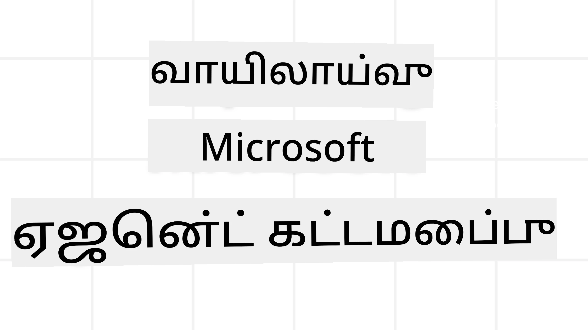
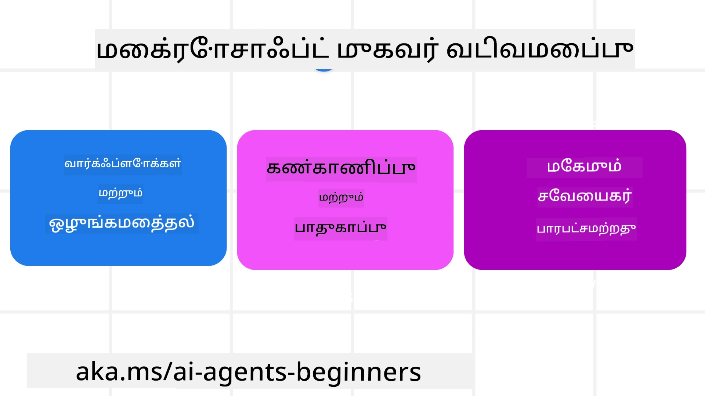
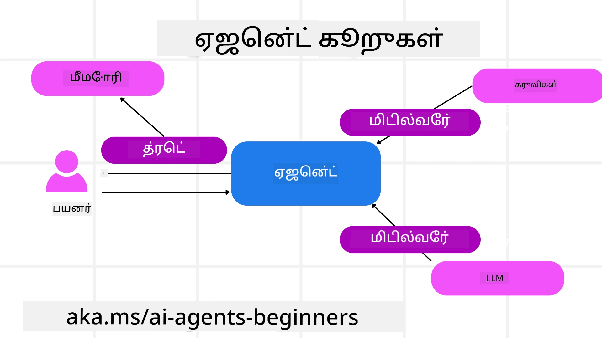

# மைக்ரோசாஃப்ட் ஏஜென்ட் கட்டமைப்பை ஆராய்தல்



### கால் அறிமுகம்

இந்த பாடத்தில் நீங்கள் கற்பீர்கள்:

- மைக்ரோசாஃப்ட் ஏஜென்ட் கட்டமைப்பை புரிந்துகொள்வது: முக்கிய அம்சங்கள் மற்றும் மதிப்பு  
- மைக்ரோசாஃப்ட் ஏஜென்ட் கட்டமைப்பின் முக்கிய கருத்துக்களை ஆராய்தல்
- மேம்பட்ட MAF வடிவங்கள்: வேலைப்பாடுகள், இடைமுகம், மற்றும் நினைவகம்

## கற்றல் இலக்குகள்

இந்த பாடத்தை முடித்த பிறகு, நீங்கள் அறிந்திருப்பீர்கள் எப்படி:

- மைக்ரோசாஃப்ட் ஏஜென்ட் கட்டமைப்பைப் பயன்படுத்தி தயாரிப்பு தயாரிப்பு AI ஏஜென்ட்களை உருவாக்குவது
- மைக்ரோசாஃப்ட் ஏஜென்ட் கட்டமைப்பின் முக்கிய அம்சங்களை உங்கள் ஏஜென்டிக் பயன்பாடுகளில் பயன்படுத்துவது
- வேலைப்பாடுகள், இடைமுகம், மற்றும் கண்காணிப்பை உள்ளடக்கிய மேம்பட்ட வடிவங்களைப் பயன்படுத்துவது

## குறியீடு எடுத்துக்காட்டுகள் 

[Microsoft Agent Framework (MAF)](https://learn.microsoft.com/en-us/agent-framework/overview/?wt.mc_id=youtube_26688_organicsocial_reactor&pivots=programming-language-python) குறியீடு எடுத்துக்காட்டுகள் இந்த கிடங்கில் `xx-python-agent-framework` மற்றும் `xx-dotnet-agent-framework` கோப்புகளின் கீழ் காணப்படுகின்றன.

## மைக்ரோசாஃப்ட் ஏஜென்ட் கட்டமைப்பை புரிந்துகொள்ளல்



[Microsoft Agent Framework (MAF)](https://learn.microsoft.com/en-us/agent-framework/overview/?wt.mc_id=youtube_26688_organicsocial_reactor&pivots=programming-language-python) என்பது AI ஏஜென்ட்களை கட்டமைக்க மைக்ரோசாஃப்ட் ஒருங்கிணைத்த கட்டமைப்பாகும். இது தயாரிப்பு மற்றும் ஆராய்ச்சி சுற்றுப்புறங்களில் காணப்படும் பல்வேறு ஏஜென்டிக் பயன்பாடுகளுக்கு தகுந்த நெகிழ்வுத்தன்மையை வழங்குகிறது, அவை:

- படி படி வேலைநடத்தல் தேவையான சந்தர்ப்பங்களில் **வரிசைப்படியான ஏஜென்ட் ஒழுங்கமைப்பு**.
- ஏஜென்ட்கள் ஒரே சமயத்தில் பணிகளை முடிக்க வேண்டிய சந்தர்ப்பங்களில் **இணைவே செயல் ஒழுங்கமைப்பு**.
- ஏஜென்ட்கள் ஒன்றிணைந்து ஒரே பணியில் பணியாற்றும் சந்தர்ப்பங்களில் **குழு அரட்டையியல் ஒழுங்கமைப்பு**.
- துணைப்பணிகள் முடிவடையும்போது ஏஜென்ட்கள் பணியை மாற்றிக்கெடுக்கும் சந்தர்ப்பங்களில் **பணிப்பேர்ப்பு ஒழுங்கமைப்பு**.
- மேலாளராகும் ஏஜென்ட் பணிகள் பட்டியலை உருவாக்கி மாற்றும் மற்றும் துணை ஏஜென்ட்களின் ஒருங்கிணைப்பை கையாளும் சந்தர்ப்பங்களில் **காந்த ஒழுங்கமைப்பு**.

தயாரிப்பில் AI ஏஜென்ட்களை வழங்க, MAF இதில் கீழ்க்கண்ட அம்சங்களையும் வழங்குகிறது:

- Microsoft Foundry டேஷ்போர்டுகள் மூலம் செயல்திறனைக் கண்காணிப்பு, கருவி அழைப்பு, ஒழுங்கமைப்பு படிகள், காரண விளக்கங்கள் உட்பட AI ஏஜென்டின் ஒவ்வொரு செயலையும் OpenTelemetry மூலம் **கண்காணிப்பு**.
- Microsoft Foundry இல் ஏஜென்ட்களை நேரடியாக உள்வேறு வைக்க, விதிமுறைத்தன்மை அடிப்படையிலான அணுகல், தனிப்பட்ட தரவு கையாளல் மற்றும் உள்ளமைவு உள்ளடக்க பாதுகாப்பு போன்ற **பாதுகாப்பு** கட்டுப்பாடுகள்.
- ஏஜென்ட் தக்க கலத்தணைகளையும் வேலைப்பாடுகளையும் இடைநிறுத்தி மீட்டெடுத்து, பிழைகள் இருந்து மீண்டு நீண்டகால செயல்பாடுகளை சாத்தியப்படுத்தும் **திடத்தன்மை**.
- பணிகள் மனித அங்கீகாரத்தை அடைக்கின்ற முறையில் ஒப்புதல் தேவைப்படும் வேலைப்பாடுகளை ஆதரிக்கும் **கட்டுப்பாடு**.

மைக்ரோசாஃப்ட் ஏஜென்ட் கட்டமைப்பு இணக்கமானதாக இருக்க கவனம் செலுத்துகிறது:

- **மேக தேர்வில்லாமல் இருக்கும்படி** - ஏஜென்ட்கள் கன்டெய்னர்களில், ஓன்-பிரேமிஸில் மற்றும் பல வகை மேகங்களில் இயங்க முடியும்.
- **வழங்குனர் தேர்வில்லாமல் இருக்கும்படி** - Azure OpenAI மற்றும் OpenAI உட்பட விருப்ப SDK மூலம் ஏஜென்ட்கள் உருவாக்கப்படலாம்.
- **திறந்த தரநிலைகள் இணைப்பு** - Agent-to-Agent(A2A) மற்றும் Model Context Protocol (MCP) போன்ற செயல்முறைகள் மூலம் பிற ஏஜென்ட்கள் மற்றும் கருவிகள் கண்டுபிடித்து பயன்படுத்தப்படலாம்.
- **பிளக்கின்கள் மற்றும் இணைப்பிகள்** - Microsoft Fabric, SharePoint, Pinecone மற்றும் Qdrant போன்ற தரவு மற்றும் நினைவகம் சேவைகளுக்கு தொடர்பு கொள்ள முடியும்.

இவை மைக்ரோசாஃப்ட் ஏஜென்ட் கட்டமைப்பின் சில முக்கிய கருத்துக்களுக்கான பயன்பாடு எப்படி என்பதை பார்க்கலாம்.

## மைக்ரோசாஃப்ட் ஏஜென்ட் கட்டமைப்பின் முக்கிய கருத்துக்கள்

### ஏஜென்ட்கள்



**ஏஜென்ட்களை உருவாக்குதல்**

ஏஜென்ட் உருவாக்கல் என்பது முன்கூட்டிய சேவை (LLM வழங்குனர்), AI ஏஜென்ட் பின்பற்ற வேண்டிய கட்டளைகள் மற்றும் அளிக்கப்பட்ட `name` ஆகியவற்றை நிர்ணயிப்பதனால் நடைபெறும்:


```python
agent = AzureOpenAIChatClient(credential=AzureCliCredential()).create_agent( instructions="You are good at recommending trips to customers based on their preferences.", name="TripRecommender" )
```

மேலே `Azure OpenAI` ஐ பயன்படுத்தி உள்ளது, ஆனால் `Microsoft Foundry Agent Service` உட்பட பல சேவைகளைக் கொண்டு ஏஜென்ட்கள் உருவாக்கப்படலாம்:

```python
AzureAIAgentClient(async_credential=credential).create_agent( name="HelperAgent", instructions="You are a helpful assistant." ) as agent
```

OpenAI `Responses`, `ChatCompletion` APIகள்

```python
agent = OpenAIResponsesClient().create_agent( name="WeatherBot", instructions="You are a helpful weather assistant.", )
```

```python
agent = OpenAIChatClient().create_agent( name="HelpfulAssistant", instructions="You are a helpful assistant.", )
```

அல்லது [MiniMax](https://platform.minimaxi.com/), இது மிகப்பெரிய உள்ளடக்கம் பட்டியல்கள் (204K டோக்கன்கள் வரை) கொண்ட OpenAI ஒத்த API ஐ வழங்குகிறது:

```python
agent = OpenAIChatClient(base_url="https://api.minimax.io/v1", api_key=os.environ["MINIMAX_API_KEY"], model_id="MiniMax-M3").create_agent( name="HelpfulAssistant", instructions="You are a helpful assistant.", )
```

அல்லது A2A செயல்முறையைப் பயன்படுத்தி தொலைதூர ஏஜென்ட்கள்:

```python
agent = A2AAgent( name=agent_card.name, description=agent_card.description, agent_card=agent_card, url="https://your-a2a-agent-host" )
```

**ஏஜென்ட்களை இயக்குதல்**

`.run` அல்லது `.run_stream` முறைமைகள் மூலம் ஏஜென்ட்கள் வேலை செய்கின்றன, அது non-streaming அல்லது streaming பதில்களுக்காக இருக்கலாம்.

```python
result = await agent.run("What are good places to visit in Amsterdam?")
print(result.text)
```

```python
async for update in agent.run_stream("What are the good places to visit in Amsterdam?"):
    if update.text:
        print(update.text, end="", flush=True)

```

ஒவ்வொரு ஏஜென்ட் இயக்கத்துக்கும் அட்டவணைகள்(அப்டேட்) செய்யும் விருப்பங்கள் இருக்கலாம்; உதாரணமாக, ஏஜென்ட் பயன்படுத்தும் `max_tokens`, அழைக்க கூடிய `tools`, மற்றும் ஏஜென்டிற்கு பயன்படுத்தப்படும் `model`.

இது பயனராக இளையர் தேவையான செயல்களை முடிக்க குறிப்பிட்ட மாதிரிகள் அல்லது கருவிகள் தேவைப்படும் போது.

**கருவிகள்**

கருவிகள் ஏஜென்டைப் பிரிஸ்தமைப்படுத்தும் போது நிர்ணயிக்கப்படலாம்:

```python
def get_attractions( location: Annotated[str, Field(description="The location to get the top tourist attractions for")], ) -> str: """Get the top tourist attractions for a given location.""" return f"The top attractions for {location} are." 


# நேரடியாக ChatAgent உருவாக்கும்போது

agent = ChatAgent( chat_client=OpenAIChatClient(), instructions="You are a helpful assistant", tools=[get_attractions]

```

மற்றும் ஏஜென்ட் இயங்கும் போது:

```python

result1 = await agent.run( "What's the best place to visit in Seattle?", tools=[get_attractions] # இந்த ஓட்டத்திற்கு மட்டும் வழங்கப்பட்ட கருவி )
```

**ஏஜென்ட் தண்டு**

ஏஜென்ட் தண்டு என்பது பன்முறை உரையாடல்களை கையாள பயன்படுத்தப்படுகிறது. தண்டுகள் இந்தவாறு உருவாக்கப்படலாம்:

- `get_new_thread()` பயன்படுத்தி, இது தண்டை காலத்துக்கு சேமிக்க அனுமதிக்கிறது
- ஏஜென்ட் இயக்கும்போது தண்டு தானாக உருவாக்கப்படுகிறது மற்றும் தற்போதைய இயக்கத்தின் போது மட்டுமே நடக்கும்.

தண்டை உருவாக்க குறியீடு இதுபோன்றதாக இருக்கும்:

```python
# புதிய தழுவலை உருவாக்கவும்.
thread = agent.get_new_thread() # தழுவலுடன் முகவரியை இயக்கவும்.
response = await agent.run("Hello, I am here to help you book travel. Where would you like to go?", thread=thread)

```

பின்னர் தண்டை சீரமைத்து சேமிக்கலாம்:

```python
# புதிய திரெட்னை உருவாக்கு.
thread = agent.get_new_thread() 

# திரெட்டுடன் முகவரியை இயக்கு.

response = await agent.run("Hello, how are you?", thread=thread) 

# சேமிப்பிற்கு திரெட்னை தொடர்முறை செய்.

serialized_thread = await thread.serialize() 

# சேமிப்பிலிருந்து ஏற்றியபிறகு திரெட் நிலையை தொடர்முறை விலக்கு செய்.

resumed_thread = await agent.deserialize_thread(serialized_thread)
```

**ஏஜென்ட் இடைமுகம்**

ஏஜென்ட்கள் கருவிகள் மற்றும் LLMகளை தொடர்பு கொண்டு பயனரின் பணிகளை முடிக்கின்றன. குறிப்பிட்ட சந்தர்ப்பங்களில், இந்த தொடர்புக்களில் இடையில் செயல்பட அல்லது கண்காணிக்கத் தேவைபடும். ஏஜென்ட் இடைமுகம் இதைச் செய்ய உதவுகிறது:

*செயல்பாட்டு இடைமுகம்*

இந்த இடைமுகம் ஏஜென்டுக்கும் அதுவே அழைக்கும் செயல்பாட்டுக்கும் இடையில் ஒரு செயலை நடத்த அனுமதிக்கிறது. உதாரணமாக, செயல்பாட்டு அழைப்பில் பதிவு செய்வதற்கான லாஜிங்.

கீழ்காணும் குறியீட்டில் `next` அடுத்த இடைமுகம் அல்லது உண்மையான செயல்பாடு அழைக்கப்படுமா என்பதைக் குறிப்பிடுகிறது.

```python
async def logging_function_middleware(
    context: FunctionInvocationContext,
    next: Callable[[FunctionInvocationContext], Awaitable[None]],
) -> None:
    """Function middleware that logs function execution."""
    # முன் செயலாக்கம்: செயல்பாடு செயல்படுத்துவதற்கு முன் பதிவு செய்க
    print(f"[Function] Calling {context.function.name}")

    # அடுத்த மிடில்வேர் அல்லது செயல்பாடு செயல்படுத்துவதுக்கு தொடர்க
    await next(context)

    # பிறகு செயலாக்கம்: செயல்பாடு செயல்படுத்திய பிறகு பதிவு செய்க
    print(f"[Function] {context.function.name} completed")
```

*அரட்டையியல் இடைமுகம்*

இந்த இடைமுகம் ஏஜென்ட் மற்றும் LLM இடையேயான வேண்டுகோள்களில் செயல் செயல்பாடு அல்லது பதிவு செய்ய உதவுகிறது.

இதில் AI சேவைக்குத் அனுப்பப்படும் `messages` போன்ற முக்கிய தகவல்கள் உள்ளன.

```python
async def logging_chat_middleware(
    context: ChatContext,
    next: Callable[[ChatContext], Awaitable[None]],
) -> None:
    """Chat middleware that logs AI interactions."""
    # முன் செயலாக்கம்: AI அழைப்புக்கு முன் பதிவு செய்யவும்
    print(f"[Chat] Sending {len(context.messages)} messages to AI")

    # அடுத்த மிடில் வொர்க் அல்லது AI சேவைக்கு தொடரவும்
    await next(context)

    # பின்னர் செயலாக்கம்: AI பதிலுக்குப் பிறகு பதிவு செய்யவும்
    print("[Chat] AI response received")

```

**ஏஜென்ட் நினைவகம்**

`Agentic Memory` பாடத்தில் கண்டுபிடிக்கப்பட்டது போல நினைவகம் என்பது ஏஜென்ட்கள் பல்வேறு சூழல்களில் செயல்பட மிக்க முக்கிய கூறு. MAF பலவகை நினைவகங்களை வழங்குகிறது:

*நினைவகக் கொள்கலன்*

இது செயலியில் தண்டுகளில் காணப்படும் நினைவகம்.

```python
# புதிய திசையை உருவாக்கவும்.
thread = agent.get_new_thread() # திசையுடன் முகவரியை இயக்கவும்.
response = await agent.run("Hello, I am here to help you book travel. Where would you like to go?", thread=thread)
```

*நிலையான செய்திகள்*

இதுவே வெவ்வேறு அமர்வுகள் முழுவதும் உரையாடல் வரலாற்றை சேமிக்க பயன்படுத்தப்படுகிறது. இது `chat_message_store_factory` மூலம் வரையறுக்கப்படுகிறது:

```python
from agent_framework import ChatMessageStore

# ஒரு தனிப்பயன் செய்தி சேமிப்பகத்தை உருவாக்குக
def create_message_store():
    return ChatMessageStore()

agent = ChatAgent(
    chat_client=OpenAIChatClient(),
    instructions="You are a Travel assistant.",
    chat_message_store_factory=create_message_store
)

```

*ஊடுருவிச் நினைவகம்*

இதை ஏஜென்ட்கள் இயக்குவதற்கு முன் சூழலில் சேர்க்கப்படுகிறது. mem0 போன்ற வெளி சேவைகளில் இந்த நினைவகங்கள் சேமிக்கப்படலாம்:

```python
from agent_framework.mem0 import Mem0Provider

# மேம்பட்ட நினைவகம் திறன்களுக்காக Mem0 பயன்படுத்தப்படுகிறது
memory_provider = Mem0Provider(
    api_key="your-mem0-api-key",
    user_id="user_123",
    application_id="my_app"
)

agent = ChatAgent(
    chat_client=OpenAIChatClient(),
    instructions="You are a helpful assistant with memory.",
    context_providers=memory_provider
)

```

**ஏஜென்ட் கண்காணித்தன்மை**

நம்பகமான மற்றும் பராமரிக்கக்கூடிய ஏஜென்ட் முறைகள் கட்டுமானத்திற்கு கண்காணித்தன்மை முக்கியம். MAF OpenTelemetry இன் இணைப்பு கொண்டு சிறந்த கண்காணித்தன்மைக்கு தடயங்கள் மற்றும் மீட்டர்கள் வழங்குகிறது.

```python
from agent_framework.observability import get_tracer, get_meter

tracer = get_tracer()
meter = get_meter()
with tracer.start_as_current_span("my_custom_span"):
    # ஏதாவது செய்
    pass
counter = meter.create_counter("my_custom_counter")
counter.add(1, {"key": "value"})
```

### வேலைப்பாடுகள்

MAF வேலைப்பாடுகளை வழங்குகிறது, இது ஒரு பணியை முடிக்க முன்னோக்கி வழங்கப்பட்ட படிகள் ஆகும் மற்றும் அவற்றில் AI ஏஜென்ட்கள் கூறுகளாக உள்ளன.

வேலையாடுகள் சிறந்த கட்டுப்பாட்டு ஓட்டத்துடன் பல கூறுகளைக் கொண்டுள்ளன. அவை **பல ஏஜென்ட் ஒழுங்கமைப்பு** மற்றும் வேலைப்பாடு நிலைகளை சேமிக்க **சிகப்பாயிண்டிங்** கொண்டுள்ளன.

வேலைப்பாடு அடிப்படையில் கூறுகள்:

**செயற்படுத்துபவர்கள்**

செயற்படுத்துபவர்கள் உள்ளீடு செய்திகள் பெறுகின்றனர், ஒப்படைக்கப்பட்ட பணிகளை செய்கின்றனர், பின்னர் வெளியீடு செய்தியைக் கொடுப்பர். இது வேலைப்பாட்டு முன்னேற்றமாக பெரிய பணியை முடிக்க உதவுகிறது. செயற்படுத்துபவர்கள் AI ஏஜென்ட்கள் அல்லது தனிப்பயன் திட்டமாட்டாக இருக்கலாம்.

**விருக்குகள்**

வேலைப்பாடில் செய்தி ஓட்டத்தை விளக்க விருக்குகள் பயன்படுத்தப்படுகின்றன. அவை:

*நேரடி விருக்குகள்* - செயற்படுத்துபர்களுக்கு இடையேயான எளிய ஒன்று-ஒரு இணைப்புகள்:

```python
from agent_framework import WorkflowBuilder

builder = WorkflowBuilder()
builder.add_edge(source_executor, target_executor)
builder.set_start_executor(source_executor)
workflow = builder.build()
```

*நிபந்தனை விருக்குகள்* - குறிப்பிட்ட நிபந்தனை பூர்த்தி செய்யப்பட்ட பிறகு செயல்படுகின்றன. உதாரணமாக, ஹோட்டல் அறைகள் கிடைக்காத போது, செயற்படுத்துபர் மாற்று விருப்பங்களை பரிந்துரைக்கலாம்.

*மாற்றுக் குறி விருக்குகள்* - வரையறுக்கப்பட்ட நிபந்தனைகளின் அடிப்படையில் செய்திகளை வெவ்வேறு செயற்படுத்துபர்களுக்கு வழிமாற்றுதல். உதாரணமாக, பயணக் கிரাহகர் முன்னுரிமை அணுகல் உள்ள போது, அவர்களின் பணிகள் வேறு வேலைப்பாடின் மூலம் கையாளப்படலாம்.

*பரப்பும் விருக்குகள்* - ஒரே செய்தியை பல இலக்குகளுக்கு அனுப்புதல்.

*இணையும் விருக்குகள்* - வெவ்வேறு செயற்படுத்துபர்களிடமிருந்து பல செய்திகளை சேகரித்து ஒரு இலக்கிற்கு அனுப்புதல்.

**நிகழ்வுகள்**

வேலைப்பாடுகளில் சிறந்த கண்காணிப்புக்கு, MAF கீழ்க்கண்ட இடைமுக நிகழ்வுகளை வழங்குகிறது:

- `WorkflowStartedEvent`  - வேலைப்பாடு துவங்கும்
- `WorkflowOutputEvent` - வேலைப்பாடு வெளியீடு தருகிறது
- `WorkflowErrorEvent` - வேலைப்பாடு பிழையை எதிர்கிறது
- `ExecutorInvokeEvent`  - செயற்படுத்துபர் செயல்முறையினைத் தொடங்குகிறார்
- `ExecutorCompleteEvent`  - செயற்படுத்துபர் செயல்முறை முடிகிறது
- `RequestInfoEvent` - ஒரு வேண்டுகோள் விடுக்கப்பட்டது

## மேம்பட்ட MAF வடிவங்கள்

மேலே கூறப்பட்டவை மைக்ரோசாஃப்ட் ஏஜென்ட் கட்டமைப்பின் முக்கிய கருத்துக்களை உள்ளடக்கியவை. நீங்கள் மிகுந்த சிக்கலான ஏஜென்ட்களை உருவாக்கும்போது, சில மேம்பட்ட வடிவங்கள்:

- **இடைமுகக் கூட்டமைப்பு**: பல இடைமுக கையாளர்கள் (logging, auth, rate-limiting) செயல்பாடும் அரட்டையியல் இடைமுகமும் பயன்படுத்தி ஏஜென்ட் நடத்தை நுணுக்க கட்டுப்பாடு.
- **வேலைப்பாடு சிகப்பாயிண்டிங்**: வேலைப்பாடு நிகழ்வுகளும் சீரமைப்பும் நீண்ட நேர ஓடுகின்ற ஏஜென்ட் செயல்களை சேமித்து மறுதொடக்கம் செய்ய பயன்படும்.
- **தற்போதைய கருவி தேர்வு**: கருவி விவரங்கள் தொடர்பான RAG ஐ MAF கருவி பதிவேட்டுடன் சேர்த்து கேள்விக்கேற்ப பொருத்தமான கருவிகளையே வழங்குதல்.
- **பல ஏஜென்ட் பணிப்பேர்ப்பு**: வேலையாடுகள் விருக்குகள் மற்றும் நிபந்தனை வழித்தடங்களை பயன்படுத்தி சிறப்பு ஏஜென்ட்கள் இடையே பணிகளை மாற்றுதல்.

## Microsoft Foundry இல் LangChain / LangGraph ஏஜென்ட்களை ஹோஸ்ட் செய்தல்

Microsoft Agent Framework என்பது **கட்டமைப்பு இணக்கமானது** — MAF உடன் எழுதப்பட்ட ஏஜென்ட்களில் மட்டுமே வரையறுக்கப்பட வேண்டும் என்பது இல்லை. நீங்கள் ஏற்கனவே **LangChain** அல்லது **LangGraph** கொண்டு ஏஜென்ட் உருவாக்கியிருந்தாலும், அதை **Microsoft Foundry ஹோஸ்ட் செய்யப்பட்ட ஏஜென்ட்** ஆக இயக்க முடியும் என்று Foundry இயங்குதளம் இயங்குதைக் காலம், அமர்வுகள், அளவீடு, அடையாளம் மற்றும் செயன்முறை முடிவுந்தொகுதிகளைக் கையாளும், உங்கள் ஏஜென்ட் தர்க்கம் LangGraphஇல் இருக்கச் செய்யும்.

இது `langchain_azure_ai.agents.hosting` தொகுப்புடன் செய்யப்படுகிறது, இது Foundry ஹோஸ்ட் செய்யப்பட்ட ஏஜென்ட்கள் பயன்படுத்தும் அதே செயல்முறைகளை LangGraph வரைபடமாக வெளியிடுகிறது.

**1. ஹோஸ்டிங் கூடுதல் தொகுதியை நிறுவுக:**

```bash
pip install -U "langchain-azure-ai[hosting]>=1.2.4" azure-identity
```

`hosting` கூடுதல் Foundry செயல்முறை நூலகங்களை நிறுவுகிறது: `azure-ai-agentserver-responses` (OpenAI-ஒத்த `/responses` கடைசிப்புள்ளி) மற்றும் `azure-ai-agentserver-invocations` (பொதுவான `/invocations` கடைசிப்புள்ளி).

**2. ஹோஸ்டிங் செயல்முறையை தேர்வு செய்யவும்:**

| செயல்முறை | ஹோஸ்ட் வகுப்பு | கடைசிப்புள்ளி | பயன்படுத்தும் போது |
|----------|-----------|----------|----------|
| **Responses** | `ResponsesHostServer` | `/responses` | OpenAI-ஒத்த அரட்டையியல், ஸ்ட்ரீமிங், பதில்வரலாறு, உரையாடல் தண்டுகளுடன் காண விரும்புகிறீர்களெனில் — உரையாடலுக்கான பரிந்துரைக்கபட்ட இயல்பு. |
| **Invocations** | `InvocationsHostServer` | `/invocations` | தனிப்பயன் JSON வடிவமைப்பும், வலைப்பின்னல் உட்பட ஆய்வில்லாத செயலாக்கமும் தேவைப்பட்டால். |

ஏனென்றால் **Responses API Foundry இல் ஏஜென்ட் வகை மேம்பாட்டின் முதன்மை API ஆகும்**, பெரும்பாலான ஏஜென்ட்களுக்கு முதலில் `ResponsesHostServer` உடன் தொடங்கவும்.

**3. சூழல் மாறிகளை நிரப்புக** (`az login` முதலில், இதனால் `DefaultAzureCredential` ஊடான அங்கீகாரம் முடியும்):

```bash
export FOUNDRY_PROJECT_ENDPOINT="https://<resource>.services.ai.azure.com/api/projects/<project>"
export FOUNDRY_MODEL_NAME="gpt-5-mini"
```

ஏஜென்ட் பின்னர் Foundry இல் ஹோஸ்ட் செய்யப்பட்ட ஏஜென்ட் ஆக இயங்கும் போது, தளத்தளம் தானாக `FOUNDRY_PROJECT_ENDPOINT` ஐ உள்ளிடும்.

**4. Responses செயல்முறையில் LangGraph ஏஜென்டை வெளிப்படுத்துக:**

```python
import os

from azure.ai.projects import AIProjectClient
from azure.identity import DefaultAzureCredential, get_bearer_token_provider
from langchain.agents import create_agent
from langchain_openai import ChatOpenAI
from langchain_azure_ai.agents.hosting import ResponsesHostServer

_AZURE_AI_SCOPE = "https://ai.azure.com/.default"


def build_chat_model() -> ChatOpenAI:
    project_endpoint = os.environ["FOUNDRY_PROJECT_ENDPOINT"].rstrip("/")
    deployment = os.environ.get("FOUNDRY_MODEL_NAME", "gpt-5-mini")
    credential = DefaultAzureCredential()
    project = AIProjectClient(endpoint=project_endpoint, credential=credential)
    openai_client = project.get_openai_client()
    token_provider = get_bearer_token_provider(credential, _AZURE_AI_SCOPE)

    # ChatOpenAI இங்கே Foundry திட்டத்தின் OpenAI-உருவக்கமான (பதில்) முடிவுறுத்தலை இலக்காக வைக்கிறது.
    return ChatOpenAI(
        model=deployment,
        base_url=str(openai_client.base_url),
        api_key=token_provider,
    )


def main() -> None:
    graph = create_agent(build_chat_model(), tools=[])
    port = int(os.environ.get("PORT", "8088"))
    ResponsesHostServer(graph).run(port=port)


if __name__ == "__main__":
    main()
```

இதனை உள்ளூரில் `python main.py` கொண்டு இயக்கவும், பின்னர் `http://localhost:8088/responses` க்கு Responses கோரிக்கை அனுப்பவும்.

**முக்கிய நடத்தை:**

- **உரையாடல்கள்**: கிளையன்ட்கள் உரையாடல்களை `previous_response_id` அல்லது `conversation` ஐடி கொண்டு தொடர்கிறார்கள். உங்கள் வரைபடம் LangGraph சிகப்பாயிண்டர் கொண்டு தொகுக்கப்பட்டிருந்தால், Foundry உரையாடல் நிலையை சிகப்பாயிண்ட்டுக்கு முக்கியமாக சேர்க்கிறது (தயாரிப்பில் திடமான சிகப்பாயிண்டர்; உள்ளூர் பரிசோதனைகளுக்கு `MemorySaver` போதும்).
- **மனிதர் இடையீடு**: உங்கள் வரைபடம் LangGraphஇன் `interrupt()` ஐப் பயன்படுத்தினால், `ResponsesHostServer` நிலுவையில் இருக்கும் இடையீட்டை Responses `function_call` / `mcp_approval_request` உருப்படியாய் வெளிப்படுத்துகிறது, மற்றும் கிளையன்ட்கள் இணைந்த `function_call_output` / `mcp_approval_response` கொண்டு தொடர்கின்றனர்.
- **Foundryக்கு வெளியிடல்**: Azure Developer CLI பயன்படுத்தவும் — `azd ext install azure.ai.agents`, `azd ai agent init -m <manifest>`, `azd ai agent run` (உள்ளூர், Docker தேவைகொண்டது), பின்னர் `azd provision` மற்றும் `azd deploy`. ஹோஸ்ட்-ஏஜென்ட் வெளியீடு **Foundry Project Manager** வகிப்பதற்குரிய உரிமையைத் தேவைப்படுத்தும்.

இந்த எடுத்துக்காட்டு [code-samples/14-langchain-hosted-agent.py](../../../14-microsoft-agent-framework/code-samples/14-langchain-hosted-agent.py) இல் இயக்கக்கூடிய பதிப்பாக உள்ளது. முழுமையான நடைமுறை விளக்கம் (Invocations செயல்முறை, தனிப்பயன் கோரிக்கை வடிவங்கள் மற்றும் தீர்வு காணலும்) க்காக [Host LangGraph agents as Foundry hosted agents](https://learn.microsoft.com/azure/foundry/how-to/develop/langchain-hosted-agents) காணவும்.

## குறியீடு எடுத்துக்காட்டுகள் 

Microsoft Agent Framework இற்கான குறியீடு எடுத்துக்காட்டுகள் இந்த கிடங்கில் `xx-python-agent-framework` மற்றும் `xx-dotnet-agent-framework` கோப்புகளின் கீழ் காணப்படுகின்றன.

## மைக்ரோசாஃப்ட் ஏஜென்ட் கட்டமைப்பை பற்றி கூடுதல் கேள்விகள் உள்ளதா?

[Microsoft Foundry Discord](https://discord.com/invite/ATgtXmAS5D)இல் இணையுங்கள், மற்ற கற்றுக்கொள்ளுபவர்களுடன் சந்திக்கவும், அலுவலக நேரங்களில் கலந்துகொள்ளவும் மற்றும் AI ஏஜென்ட் தொடர்பான கேள்விகளுக்கு பதில்கள் பெறவும்.
## முன்பு பாடம்

[AI ஏஜென்ட்களுக்கான நினைவகம்](../13-agent-memory/README.md)

## அடுத்த பாடம்

[கணினி பயன்பாட்டு ஏஜென்ட்களை உருவாக்குதல் (CUA)](../15-browser-use/README.md)

---

<!-- CO-OP TRANSLATOR DISCLAIMER START -->
**மறுப்பு**:
இந்த ஆவணம் AI மொழிபெயர்ப்பு சேவை [Co-op Translator](https://github.com/Azure/co-op-translator) பயன்படுத்தி மொழிபெயர்க்கப்பட்டுள்ளது. நாங்கள் துல்லியத்திற்காக முயற்சி செய்துள்ளோம், ஆனால் தானாக செய்யப்படும் மொழிபெயர்ப்புகளில் பிழைகள் அல்லது தவறுகள் இருக்கலாம் என்பதை கவனத்தில் கொள்ளவும். அசல் ஆவணம் அதன் தாய்மொழியில் அதிகாரப்பூர்வ ஆதாரமாக கருதப்பட வேண்டும். முக்கியமான தகவல்களுக்கு, தொழில்நுட்பமான மனித மொழிபெயர்ப்பு பரிந்துரைக்கப்படுகிறது. இந்த மொழிபெயர்ப்பைப் பயன்படுத்துவதால் ஏற்படும் எந்த தவறான புரிதல்கள் அல்லது தவறான விளக்கத்திற்கும் நாங்கள் பொறுப்பில்வில்லை.
<!-- CO-OP TRANSLATOR DISCLAIMER END -->