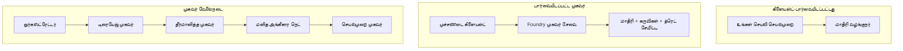
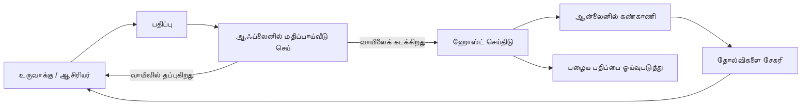
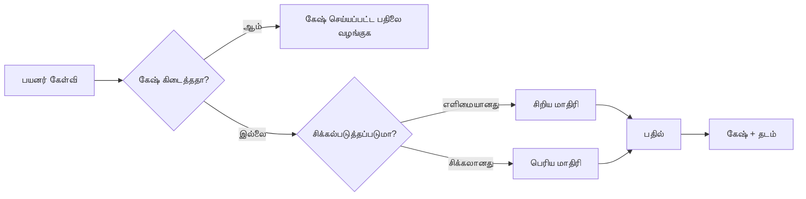
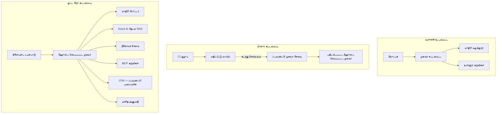

# Microsoft Foundry உடன் விவரமான முகவர்கள் இயக்குவது


இந்த படிப்பில் இப்போது வரை, நீங்கள் உங்கள் லாப்டாப் அல்லது நோட்புக் உள்ளே இயங்கும், `az login` மற்றும் சில சூழல் மாறிகளை இயக்கப்படும் முகவர்களை உருவாக்கியுள்ளீர். அது கற்றுக்கொள்ள சரியான வழி தான். ஆனால் ஆயிரக்கணக்கான வாடிக்கையாளர்கள் அதிக அன்றாட 3 மணிக்குள் சார்ந்துள்ள முகவர்களை இயக்க இதுவே சரியான வழி அல்ல.

இந்த பாடம் "எனது இயந்திரத்தில் இயங்குகிறது" மற்றும் "உற்பத்தியில் நம்பகமாகவும் குறைந்த விலையில் இயங்குகிறது" என்பவற்றுக்கிடையிலான இடைவெளியை பற்றியது. இதை நாங்கள் **Microsoft Foundry** மற்றும் **Microsoft Foundry Agent Service** ஐ பயன்படுத்தி மூடுகிறோம், மேலும் தொழில்நுட்பங்கள், மீட்டெடுப்பு, நினைவகம், மதிப்பீடு மற்றும் கண்காணிப்பு உடன் ஒரு உண்மையான வாடிக்கையாளர் ஆதரவு முகவர்களை உருவாக்குகிறோம்.

## அறிமுகம்

இந்த பாடம் பற்றி உள்ளன:

- **வாடிக்கையாளர் முகவர்கள்** மற்றும் **பரிமாறப்பட்ட முகவர்கள்** இவற்றுக்குள் உள்ள வேறுபாடு மற்றும் மொத்தமாக மாதிரி சுற்றியுள்ள அங்கங்களை பற்றியது.
- முகவர்களை இயக்கு விதிகள்: கிளையண்ட்-ஹோஸ்ட், சேவை-ஹோஸ்ட் (Hosted Agents) மற்றும் வேலை நேர்மாறுதல்.
- Microsoft Foundry-ல் முகவர் வாழ்க்கைசுழற்சி — உருவாக்கு, பதிப்பு, இயக்கு, மதிப்பீடு செய், கவனித்து, ஓய்வு எடு.
- அளவுக்கேற்ப ஆராய்ச்சிகள்: மாதிரி வழி, கேஷிங், ஒருங்கிணைப்பு மற்றும் நிலைத்தன்மையற்ற வடிவமைப்பு.
- OpenTelemetry மற்றும் Foundry கண்காணிப்புடன் காணுதல்.
- மாதிரி தேர்வு, வழி மற்றும் மதிப்பீட்டு வாயில்களால் செலவு குறைத்து முன்னெடுப்பு.
- நிறுவன கவலைகள்: ஆளுகை, மனித ஒப்புதல் மற்றும் MCP சேவைகளை உற்பத்தியில் பாதுகாப்பாக இயக்குதல்.

## கற்றல் குறிக்கோள்கள்

இந்த பாடம் முடிந்த பின் நீங்கள் அறிந்து கொள்வீர்கள்:

- கொடுக்கப்பட்ட முகவர் வேலைப்பளுவிற்கு சரியான இயக்க முறையைக் தேர்வு செய்வது.
- முகவர்களை Microsoft Foundry Agent Service-ல் பதிப்பிட, ஆளுகை செய்ய, காணொளி செய்யும் முறையில் இயக்குவது.
- முகவர்களை கண்காணித்து வெளியீட்டுக்கு முன் ஒவ்வொரு மதிப்பீட்டு குழாயையும் அமைத்தல்.
- மாதிரி வழிகாட்டுதல் மற்றும் கேஷிங் மூலம் மந்ததன்மையும் செலவும் கட்டுப்படுத்தல்.
- மனித ஒப்புதலுக்கான வாயில்களைச் சேர்த்தல் மற்றும் MCP சேவையை பாதுகாப்பான முறையில் ஒருங்கிணைத்தல்.

## முன்னோடிகள்

இந்த பாடம் முன் பாடங்களை முடித்திருக்கிறீர்கள் என்று கணக்கிடுகிறது மற்றும் இவற்றில் நன்றாக இருக்க வேண்டும்:

- [Microsoft Agent Framework](../14-microsoft-agent-framework/README.md) உபயோகித்து முகவர்கள் உருவாக்கல் (பாடம் 14).
- [கருவி பயன்பாடு](../04-tool-use/README.md) (பாடம் 4) மற்றும் [Agentic RAG](../05-agentic-rag/README.md) (பாடம் 5).
- [Agent நினைவகம்](../13-agent-memory/README.md) (பாடம் 13) மற்றும் [Agentic Protocols / MCP](../11-agentic-protocols/README.md) (பாடம் 11).
- [கண்காணிப்பு மற்றும் மதிப்பீடு](../10-ai-agents-production/README.md) (பாடம் 10) — இந்த பாடம் நேரடியாக இதை மேம்படுத்துகிறது.

நீங்கள் இதையும் தேவைப்படும்:

- குறைந்தது ஒரு செயல்படுத்தப்பட்டது கொண்ட **Azure சந்தா** மற்றும் **Microsoft Foundry திட்டம்**.
- செவ்வனே அங்கீதமளிக்கப்பட்ட **Azure CLI** (`az login`).
- Python 3.12+ மற்றும் தொகுப்புகள் உள்ள [requirements.txt](../../../requirements.txt).

## மாதிரியில் இருந்து உற்பத்தி வரை: என்ன உண்மையில் மாறுகிறது

ஒரு prototype முகவர் மற்றும் உற்பத்தி முகவர் ஒரே முக்கியச் சுற்றிக்குள் பகிர்ந்துகொள்கின்றனர் — காரணம்பாடு, கருவிகளை அழைப்பு செய், பதில் சொல். மாறுவது அந்த சுற்றுப்புற எல்லாவற்றையும். மாதிரி உற்பத்தி முகவரின் சுமார் 20%; மற்ற 80% செயற்பாடு உள் அமைப்பு.

| கவலை | Prototype | உற்பத்தி |
| --- | --- | --- |
| **ஓட்டுநிலை** | உங்கள் நோட்புக்கில் இயங்கும் | சேவை நிலையாக, பதிப்பிடப்பட்டு வெளியிடப்பட்டு இயங்கும் |
| **அடையாளம்** | உங்கள் `az login` டோக்கன் | நிர்வகிக்கப்பட்ட அடையாளம் மற்றும் கேள்வி அனுமதியுடன் |
| **நிலை** | நினைவகத்தில், மறுதொடக்கம் மீண்டும் இழக்கும் | வெளியே சேர்க்கப்பட்டது (தொடர் சேமிப்பு, நினைவகம் சேவை) |
| **தோல்வி** | பின்தொடர் பிழையை காட்டுகிறது | மீண்டும் முயற்சி, பின்தவறல், மரண-அஞ்சல், எச்சரிக்கை |
| **செலவு** | "கொஞ்சம் சென்டுகள்" | ஒவ்வொரு கோரிக்கைக்கும் கண்காணிப்பு, வழி, கேஷிங், பட்ஜெட் |
| **தரநிலை** | வெளியீட்டைப் பார்வையிடுகிறீர்கள் | ஒவ்வொரு வெளியீட்டுக்கும் முன் தானாக மதிப்பிடப்படுகிறது |
| **நம்பிக்கை** | ஒவ்வொரு செயலையும் நீங்கள் ஒப்புக்கொள்கிறீர்கள் | கொள்கை + மனித-நடைமுறையில் ஆபத்தான செயல்களுக்கு |

இந்த அட்டவணையை மனதில் வைக்கவும். கீழ்காணும் பிரிவு ஒவ்வொன்றும் இதில் ஒரு வரியுடன் பொருந்துகிறது.

## முகவர் இயக்க முறைமைகள்

நீங்கள் பரவலாக, ஒருங்கிணைக்கப்பட்ட முறையில் பயன்படுத்தப் படும் மூன்று மாதிரிகள் உள்ளன.

### 1. கிளையண்ட்-ஹோஸ்ட் முகவர்கள்

முகவர் பொருள் உங்கள் பயன்பாட்டு செயலியில் உள்ளே வாழ்கிறது. உங்கள் குறியீடு நேரடியாக மாதிரி வழங்குநரை அழைக்கும்; காரணிக்கும் சுற்று உங்கள் சேவையில் இயங்குகிறது. இது முன் பாடங்களில் அனைத்து செய்ததும்.

- **எப்போது பயன்படுத்துவது**: சுற்றை முழுமையாக கட்டுப்படுத்த வேண்டும், தனிப்பயன் மிடில்வேர் பயன்பாடு அல்லது ஒரு ஏற்கனவே உள்ள பின்னணி சேவையில் முகவர்களை அடங்க வைத்தல்.
- **குறைவு**: பரிமாணம், நிலை, மற்றும் உறுதியை உடையிருப்பது உங்களை சார்ந்தது.

### 2. ஹோஸ்ட் செய்யப்பட்ட முகவர்கள் (Foundry Agent Service)

முகவர் Microsoft Foundry-வில் *வளமாக பதிவு செய்யப்படுகிறது*. Foundry காரணி சுற்று நடத்துகிறது, தொடர்களை சேமிக்கிறது, உள்ளடக்க பாதுகாப்பையும் RBAC-ஐ கடைபிடிக்கிறது மற்றும் முகவர்களை Foundry போர்டலில் காட்டு‌ுகிறது. உங்கள் பயன்பாடு ஒரு இலகுரக கிளையண்டாக மாறி தொடர்களை உருவாக்கி பதில்களை வாசிக்கிறது.

- **எப்போது பயன்படுத்துவது**: மக்கள் நிலைத்தன்மை, உள்ளமைவு காண்டலை, ஆளுகை மற்றும் குறைந்த செயற்பாட்டு பகுதியில் தேவைப்பட்டால்.
- **குறைவு**: மேலாண்மை செய்யும் ஓட்டுநருக்கு மாற்றாக குறைந்த அளவிலான கட்டுப்பாடு.

### 3. முகவர் வேலைநிறுத்தங்கள்

பல முகவர்கள் (மற்றும் கருவிகள்) ஒருங்கிணைக்கப்பட்ட கட்டுப்பாட்டு ஓட்டத்தில் இணைக்கப்படுகின்றன — தொடர்ச்சியான படிகள், கிளையின் பிரிவு, மனித ஒப்புதலுக்கான முடிகள் மற்றும் நிறுத்தவும் மீண்டும் தொடங்கவும் கூடிய நிலைத்துள்ள இடைவெளிகள். இது Microsoft Agent Framework-இன் **வேலைநிறுத்தங்கள்** திறனின் அளவிலான பயன்பாடாகும்.

- **எப்போது பயன்படுத்துவது**: ஒரு ஒரே பணிக்கு பல நிபுண முகவர்கள் தேவைப்பட்டால் அல்லது நடுவில் ஒப்புதல் கட்டம் தேவைப்பட்டால்.
- **குறைவு**: அதிக இயக்கக்கூடிய பகுதிகள்; ஒருங்கிணைப்பு நிலை கண்காணிப்பு தேவை.



## Microsoft Foundryலில் முகவர் வாழ்க்கைசுழற்சி

முகவர்களை இயக்குவது ஒரே முறையே இயங்கி விடும் `push` அல்ல. அது ஒரு சுற்று தான், மேலும் அது ஒரு மென்பொருள் வெளியீட்டு சுற்று போலவே இருக்கிறது.



முக்கிய கருத்து, [பாடம் 10](../10-ai-agents-production/README.md) இருந்து கொண்டு வந்தது: **தொலை பழக்கம் ஒரு வாயில், மறுக்கப்பட்ட விஷயம் அல்ல**. புதிய முகவர் பதிப்பு உங்கள் மதிப்பீட்டு அளவுகோல்களை தாண்டாவிட்டால் வெளியிடப்படாது. ஆன்லைன் காணாரிப்பு பிறகு உண்மையான தோல்விகளை உங்கள் தொலை பரிசோதனை சூட்டில் ஊட்டி சமர்ப்பிக்கிறது. இதுதான் முழு சுற்று.

## அளவுத்திறன் திட்டங்கள்

முகவர்களை அளவுகோலால் பெரிதாக்குவது நிலைத்த இணைய API-வின் அளவுகோலால் பெரிதாக்குவதைப் பதிலாக வேறுபடுகிறது, ஏனெனில் ஒவ்வொரு கோரிக்கையும் பல முடிவான மாதிரி மற்றும் கருவிகளை அழைக்கும். இங்கே நான்கு தொழில்நுட்பங்கள் பெரும்பான்மை பணியை ஏற்றுகின்றன.

**நிலைத்தன்மையற்ற கோரிக்கை கையாளல்.** உங்கள் செயலி நினைவகத்தில் பயனர் நிலையை வைத்திருக்க வேண்டாம். கூட்டுரையாடல் தொடர்களை Foundry தொடரகம் அல்லது நினைவகம் சேவையில் பதிந்து வையுங்கள், எங்கும் எந்த சமயம் எந்த முறையையும் கையாள முடியும். இதுவே உங்களுக்கு செங்குத்தான அளவுகோலையும் - எடுத்துக்காட்டாக கிளைகளைக் கூட்டுவது, செண்டிகா அமர்த்தல் இல்லாது - அனுமதிக்கிறது.

**மாதிரி வழிகாட்டுதல்.** அனைத்து கோரிக்கைகளும் உங்கள் திறனான (மேலும் விலைவாய்ந்த) மாதிரியை தேவைப்படாது. எளிய கோரிக்கைகளை — நோக்கம் வகைப்படுத்தல், சுருக்கமான உண்மை பதில்கள் — ஒரு சிறிய மற்றும் வேகமான மாதிரிக்குக் கையேடு செய்யவும், பெரிய மாதிரியை ஆழமான காரணிக்காக பதிலளிக்க வையுங்கள். Foundry இன் **Model Router** இதை செய்து கொடுக்க முடியும், அல்லது நீங்கள் ஒரு எளிய வகைப்பாடு உருவாக்கலாம். ஆய்வறையில் நீங்கள் DIY பதிப்பை உருவாக்குவீர்கள்.

**பதில்கள் கேஷிங்.** பல சேவை கேள்விகள் ஒருபோதும் ("என் கடவுச்சொல்லை எப்படி மீட்டெடுப்பது?") போன்றவை. பொதுவான கேள்விகளுக்கு பதில்களை கேஷ் செய்து, மாதிரியை தொடாமல் வழங்குங்கள். மிதமான கேஷ் தாக்கு விகிதம் கூட செலவும் மந்ததன்மையும் முழு நம்பத்தன்மையில் குறைக்கும்.

**ஒன்றுகூடல் மற்றும் பின்படுதல்.** மாதிரி வழங்குநர்களுக்கு வீத வரம்புகள் உள்ளன. உங்கள் ஒருங்கிணைபை கட்டுப்படுத்து, முறைமையாக மீண்டும் முயற்சி செய், பின்னடைவை உபயோகித்து, மற்றும் அனுகூலமாக தோல்வியை சந்தி (காரிய வரிசையில் "நாம் அதில் இருக்கிறோம்" பதில் 500-ஐ விட சிறந்தது).



## உற்பத்தியில் காணல்

நீங்கள் காணாததை இயக்கு முடியாது. பாடம் 10-ல் கூறப்பட்டபடி, Microsoft Agent Framework இயல்பாக **OpenTelemetry** தடங்களை வெளியிடுகிறது — ஒவ்வொரு மாதிரி அழைப்பு, கருவி அழைப்பு, ஒருங்கிணைப்பு படியும் ஒரு தடமாக மாறுகிறது. உற்பத்தியில் நீங்கள் அந்த தடங்களை Microsoft Foundry (அல்லது எந்த ஓடெல் இணக்கமான பின்னணி) க்குத் வழிமாற்றுகிறீர்கள், அதனால் நீங்கள்:

- ஒவ்வொரு வாடிக்கையாளர் புகார் முழுவதையும் மாதிரி மற்றும் கருவி அழைப்புகளுக்கு துவக்கம் முதல் முடிவுவரை அடையாளப்படுத்தலாம்.
- காலவரிசையில் P50/P95 மந்ததன்மை மற்றும் செலவைக் கண்காணிக்கலாம்.
- பிழை வீதம் வெள்ளமடைப்பு மற்றும் செல்வு மாற்றங்களை உங்கள் பயனாளர்களும் (அல்லது உங்கள் நிதித்துறையும்) கவனிப்பதற்கு முன் எச்சரிக்கலாம்.

```python
from agent_framework.observability import get_tracer

tracer = get_tracer()

with tracer.start_as_current_span("support_request") as span:
    span.set_attribute("customer.tier", "enterprise")
    span.set_attribute("routed.model", "gpt-5-nano")
    # இந்த ஸ்பான் உள்ளே இயந்திர செயல்பாடுகள் தானாகவே கண்காணிக்கப்படும்
```

`customer.tier` மற்றும் `routed.model` போன்ற பண்புகள் தடங்களின் கண்டரை பதிலளிக்கக்கூடிய கேள்விகளாக மாற்றுகின்றன ("நிறுவனர் வாடிக்கையாளர்கள் too small மாதிரிக்கு அடிக்கடி வழிகாட்டப்படுகிறார்களா?").

## செலவு முன்னேற்றம்

உற்பத்தி முகவர்களில் செலவுக்கு முக்கிய பங்கு தொக்கன்களில் உள்ளது. மூன்று முக்கிய கட்டுப்பாடுகள், தாக்கம் வரிசையில்:

1. **சரியான அளவிலான மாதிரி.** ஒரு சிறிய மாதிரி உங்கள் மதிப்பீடுச் குழாயை கடந்தால் பெரிய மாதிரிக்கு விட அதிகமாக உள்ளது. மதிப்பீடு மூலம் சிறிய மாதிரி போதும் என்பதை நிரூபிக்கவும், பெரிய மாதிரியை எல்லையாக எடுத்துக்கொள்ள வேண்டாம்.
2. **சிக்கலின் அடிப்படையில் வழிகாட்டுதல்.** மேலே கூறியபடியே — பெரிய மாதிரியின் விலையில் மட்டும் பெரிய வழிகாட்டல் தேவையான கோரிக்கைகளுக்கு செலுத்தவும்.
3. **கேஷ் வலையாகப் பயன்படுத்தல்.** நீங்கள் ஒருபோதும் செய்யாத மாதிரி அழைப்பே மிகவும் குறைந்த செலவு.

மதிப்பீட்டு வாயில்கள் மற்றும் செலவு கட்டுப்பாடு இரண்டு கண்ணோட்டத்தில் ஒரே ஒழுங்கு: மதிப்பீடு = *தர நிலை*, வழிகாட்டுதல் மற்றும் கேஷ்ஃ பின்பற்றும் செலவு *அந்த தர நிலைக்கு* அருகில் வைக்கும்.

## நிறுவன இயக்க கவலைகள்

**ஆளுகை.** Hosted Agents Foundry இன் RBAC, உள்ளடக்க பாதுகாப்பு மற்றும் ஆய்வு பதிவுகளைப் பெறும். ஒவ்வொரு முககருக்கும் குறைந்த உரிமையுடன் நிர்வகிக்கப்பட்ட அடையாளம் கொடுங்கள் — அறிவு தளத்தை வாசிக்கும் மட்டும், டிக்கெட் API-க்கு ஐ.பீ. அகற்றல் அனுமதி, அப்புறம் எதுவுமில்லை.

**மனிதர்-ஆல் கட்டுப்பாடு.** சில செயல்கள் முழுமையாக தானியங்கி செயற்படுத்த மிகுந்த விளைவுள்ளவை — பணத்தை திருப்பிச் செலுத்தல், கணக்கை அழித்தல், சட்ட குழுவுடன் உயர்த்தல். Microsoft Agent Framework **ஒப்புதல் தேவைப்படும்** கருவிகளை ஆதரிக்கிறது: முகவர் செயலை முன்மொழிகிறது, நிறுத்தம், மனிதர் ஒப்புதல் அல்லது நிராகரிப்பு, பிறகு வேலைநிறுத்தம் தொடர்கிறது. இதை [பாடம் 6](../06-building-trustworthy-agents/README.md)–ல் பார்த்தீர்கள்; இங்கே நீங்கள் இயக்குகிறீர்கள்.

**உற்பத்தியில் MCP.** [MCP](../11-agentic-protocols/README.md) உங்கள் முகவருக்கு வெளியே கருவிகளை ஒரே இடைமுகமாக பயன்படுத்த அனுமதிக்கிறது. உற்பத்தியில், ஒவ்வொரு MCP சேவையகத்தையும் அநம்பப்பட்ட எல்லையாக கையாளுங்கள்: சேவையகத்தின் பதிப்பை பிணைக்கவும், ஒரு சுருக்‌டு அடையாளத்தில் இயக்கவும், அதன் வெளியீடுகளை பரிசோதிக்கவும், ரகசியங்களை அதை உடன்காட்சியமாதலில் வெளிப்படுத்த வேண்டாம். MCP சேவையகம் என்பது சார்பு; சார்புகள் மட்டுப்படுத்தப்படல், ஆய்வு, மற்றும் வீதக் கட்டுப்பாட்டுடன் இருக்க வேண்டும்.



அந்த மூன்று வரைபடங்கள் — மேம்பாடு, இயக்கம், ஓட்டுநிலை — ஒரே முகவர் மூன்று வாழ்க்கை நிலைகளில். பின்வரும் ஆய்வகம் இதை உருவாக்குவதற்காக உங்களை வழிநடத்தும்.

## பயிற்சிப் பயிற்சி: உற்பத்தி உறுதிப்படுத்தப்பட்ட வாடிக்கையாளர் ஆதரவு முகவர்

[`code_samples/16-python-agent-framework.ipynb`](./code_samples/16-python-agent-framework.ipynb) திறந்து முழுமையாகச் செயல்படுத்துங்கள். நீங்கள் ஒரு **Contoso வாடிக்கையாளர் ஆதரவு முகவரைக்** உருவாக்குவீர்கள், அத்தில் ஒவ்வொரு உற்பத்தித் சிக்கலும் இணைக்கப்பட்டிருக்கும்:

1. **கருவி அழைத்தல்** — ஆர்டர் நிலையைத் தேடுங்கள் மற்றும் ஆதரவு டிக்கெட்டுகளைத் திறக்கவும்.
2. **RAG** — அறிவுத் தளத்திலிருந்து கொள்கை கேள்விகளுக்கு பதிலளிக்கவும் (Azure AI Search, நினைவக முதன்மை மறுசீரமைப்பு மூலம் நோட்புக் Search வளத்தை இல்லாமல் இயங்கும்).
3. **நினைவகம்** — உரையாடல் முறுப்புகளின் மத்தியில் வாடிக்கையாளரை நினைவில் வைக்கவும்.
4. **மாதிரி வழிகாட்டுதல்** — சிக்கல் வகைப்பாட்டாளர் ஒவ்வொரு கோரிக்கையையும் சிறிய அல்லது பெரிய மாதிரிக்கு வழிகாட்டுகிறது.
5. **பதில் கேஷிங்** — மீண்டும் கேட்கப்படும் கேள்விகள் கேஷிலிருந்து வழங்கப்படுகின்றன.
6. **மனித ஒப்புதல்** — ஒரு குறையை கடக்கும் பணமடைவுகளை மனித ஒப்புதலுக்கு நிறுத்துகிறது.
7. **மதிப்பீட்டு குழாய்** — ஒரு சிறிய தொலை பரிசோதனை குழு முகவருக்கு மதிப்பெண்ணை அளித்து வெளியீட்டு வாயிலாக செயல்படுகிறது.
8. **காணல்** — ஒவ்வொரு கோரிக்கையிலும் OpenTelemetry தடத்துடன்.

### நடைமுறை

நோட்புக் ஒவ்வொரு உற்பத்தி மருத்துவமும் தனித்துவமான பகுதி; இதன் உள்ளம் வழிகாட்டல்-கேஷிங் கோரிக்கை கையாளும் முறையே:

```python
async def handle_support_request(query: str, customer_id: str) -> str:
    # 1. நாம் செய்யக்கூடிய போது கேஷிலிருந்து சேவை செய்யவும்.
    cached = response_cache.get(normalize(query))
    if cached:
        return cached

    # 2. செலவைக் கட்டுப்படுத்த சிக்கலின் அடிப்படையில் வழிமுறை அமைக்கவும்.
    model = "gpt-5-nano" if is_simple(query) else "gpt-5-mini"

    # 3. பார்வைத்திறனுக்காக ஏஜென்டை ஒரு ட்ரேஸ் ஸ்பானுக்குள் இயக்கவும்.
    with tracer.start_as_current_span("support_request") as span:
        span.set_attribute("routed.model", model)
        span.set_attribute("customer.id", customer_id)
        response = await support_agent.run(query, model=model)

    # 4. கேஷ் செய்து திரும்ப அளிக்கவும்.
    response_cache.set(normalize(query), response.text)
    return response.text
```

வெளியீட்டை காக்கும் மதிப்பீட்டு வாயில் இவ்வாறு அமைந்துள்ளது:

```python
async def evaluation_gate(agent, test_cases, threshold: float = 0.8) -> bool:
    passed = 0
    for case in test_cases:
        result = await agent.run(case["input"])
        if score_response(result.text, case["expected"]) >= 0.8:
            passed += 1
    pass_rate = passed / len(test_cases)
    print(f"Evaluation pass rate: {pass_rate:.0%} (gate: {threshold:.0%})")
    return pass_rate >= threshold  # வாயில் அனுமதித்தால் மட்டுமே நிலைபடுத்தவும்
```

ஒவ்வொரு வரியையும் வாசியுங்கள் — நோட்புக் சிறிய முன்மாதிரிகள் வண்ணம் இருக்கிறது, எந்தவொரு கூற்று பின்னணி அழைப்பும் மறைக்கப்படவில்லை.

## புகையிலை பரிசோதனைகளால் இயக்கும் முகவரின் சரிபார்ப்பு

மேலே உள்ள மதிப்பீட்டு வாயில் உங்கள் முகவர் பொருளுக்கு *தொலை* பரிசோதனையாக இயங்குகிறது. முகவர் Hosted Agent ஆக இயக்கப்படலாம், அதற்குப் பிறகு நீங்கள் இன்னும் ஒரு மிகச் சுலபமான சரிபார்ப்பு தேவை: **ஏற்றப்பட்ட முனைப்பரிமாற்றம் உண்மையில் பதிலளிக்கிறதா?**

"வெற்றிகரமாக இயக்கப்பட்டது" என்பது கட்டுப்பாட்டு பகுதி வரையறையை ஏற்றதையே நிரூபிக்கும் — முகவர் பதிலளிக்கிறதா என்பதை அல்ல. ஒரு காணவில்லை சார்பு, தவறான மாதிரி வழிகாட்டுதல், அல்லது காலாவதியான இணைப்பு பசுமை இயக்கத்தைக் கொண்டு வரும் ஆனால் பதில் தராது. ஒரு **புகையிலை தேர்வு** அதை சில விநாடிகளில், ஒவ்வொரு இயக்கத்திலும் பிடிக்கிறது, முழு மதிப்பீட்டு செலவு இல்லாமல்.

இந்த இருப்பகம் [AI Smoke Test](https://github.com/marketplace/actions/ai-smoke-test) GitHub செயல்பாட்டில் உருவாக்கப்பட்ட தயாரிப்பு-பயன்பாட்டுப் புகையிலை-தேர்வு குழாயுடன் வருகிறது:

- **கட்டமைப்பு** — [`tests/lesson-16-smoke-tests.json`](../../../tests/lesson-16-smoke-tests.json) Contoso ஆதரவு முகவர்க்கான முனைகளும் உறுதிப்படுத்தல்களும் உள்ளன (அடிப்படையிலான கொள்கை பதில்கள், ஆர்டர் தேடல், தலைப்புக்கு நிலைத்தன்மை, மற்றும் பல முறையான தொடர்ச்சியான நிறைவு). பிற பாடங்களின் முகவர்கள் தொடர்பான கட்டமைப்புகள் அதற்குப் பக்கத்தில் உள்ளன — [`tests/README.md`](../tests/README.md) காணவும்.
- **வேலைநிறுத்தம்** — [`.github/workflows/smoke-test.yml`](../../../.github/workflows/smoke-test.yml) Azure OIDC உடன் உள்நுழைகிறது மற்றும் ஒவ்வொரு முனையை முகவரின் Responses முனையில் POST செய்கிறது, எந்த உறுதிப்படுத்தலின் தவறிலும் பணியை தோல்வி அடையச் செய்கிறது.

```yaml
- name: Smoke-test hosted agent
  uses: JFolberth/ai-smoketest@v1
  with:
    project_endpoint: ${{ inputs.project_endpoint }}
    agent_name: ContosoSupportAgent
    tests_file: tests/lesson-16-smoke-tests.json
```


உங்கள் முகவர் நிலைநிறுத்தப்பட்ட பிறகு, உங்கள் Foundry திட்ட முடிவுறுத் தொகுதியையும் முகவர் பெயரையும் வழங்கி **Actions** தாவலை ஆயிற்று இயக்குங்கள். கூட்டமைக்கப்பட்ட அடையாளத்திற்கு Foundry திட்ட பரப்பளவில் **Azure AI User** அதிகாரம் அவசியம். அடுக்குகளை ஒரு மண்டலம் போலக் கண்டு கொள்ளுங்கள்: புகை சோதனைகள் (ஏறும் மற்றும் பதிலளிக்குமா?) ஒவ்வொரு நிலைநிறுத்தத்திலும் இயங்கும், ஆஃப்லைன் மதிப்பாய்வு (படமாற்றத்திற்கு போதுமானதா?) மேம்படுத்தும் முன் இயங்கும், மற்றும் ஆன்லைன் மதிப்பாய்வு (இது இயற்கையில் எப்படி செயல்படுகிறது?) தொடர்ச்சியாக இயங்கும்.

## அறிவு சோதனை

பணிக்குள் செல்லும் முன்பாக உங்கள் புரிதலைச் சோதிக்கவும்.

**1. ஒரு தயாரிப்பு முகவரில் "மாதிரி" என்பது சுமார் எவ்வளவு பங்கு வகிக்கிறது, மற்றும் மீதமுள்ளவை என்ன?**

<details>
<summary>பதில்</summary>

மாதிரி என்பது அமைப்பின் சிறுபான்மையான பகுதி — பெரும்பாலும் சுமார் 20% என்று மேற்கோளிடப்படுகிறது. மீதமுள்ளவை செயல்பாட்டு அடுக்குமுணர்வு: ஹோஸ்டிங் மற்றும் பதிப்பு நிர்வாகம், அடையாளம் மற்றும் RBAC, வெளிப்புற நிலையில் இருப்பு, தோல்வி கையாள்கை, செலவு கண்காணிப்பு, மதிப்பாய்வு, மற்றும் மனித இன்ப்-தி-லூப் கட்டுப்பாடுகள். தயாரிப்பிற்கு செல்லுதல் பெரும்பாலும் செயல்முறை சுற்றுவட்டாரத்தை கட்டமைப்பது பற்றியது.
</details>

**2. Hosted Agent-ஐ ஆஃப்லைன்-ஆகிர்க் முகவருடன் எனக்கு எப்பொழுது தேர்வு செய்வேன்?**

<details>
<summary>பதில்</summary>

படிகப்படுத்தப்பட்ட நிலைத்தன்மை (நிலைநிலுத்துக் கொள்ளக்கூடிய மற்றும் மீண்டும் தொடரக்கூடிய திரெடுகள்), கண்காணிப்பு, உள்ளடக்க பாதுகாப்பு மற்றும் RBAC உடைய கட்டுப்பாட்டுடனான பாதுகாப்பான இயங்குதளத்தை நீங்கள் விரும்பும்போது, மற்றும் விவாதச் சுற்றுவட்டாரத்தின் கீழ் சில குறைந்த மட்டக்களவை கட்டுப்பாட்டைக் குறைக்க தயாராக இருப்பின் Hosted Agent-ஐ தேர்வு செய்க. மறு முறையில், முழுமையான கட்டுப்பாடு அவசியம் அல்லது முகவரை ஏற்கனவே உள்ள பின்னணி பொருளுக்குள் ஒருங்கிணைக்கும்போது ஆஃப்லைன்-ஆகிர்க் முகவர் முன்னுரிமைக்குரியது.
</details>

**3. ஒரு அளவுக்கு விரிவாக்கக்கூடிய முகவர் தனது சொந்த செயல்முறை நினைவகத்தில் நிலைமையற்றதாய் இருக்க வேண்டிய காரணம் என்ன?**

<details>
<summary>பதில்</summary>

எந்த எடுத்துக்காட்டும் எந்த வேண்டுதலைக் கையாளலாம் என்பதற்கான வசதிக்கு இது உதவும், இது சிறப்பாக தூர்மறுப்பு அமர்வு sessions இல்லாமல் ஒருமுகப்படுத்த ஆய்வுக்கான நிலையான அளவீடு செய்யும். பயனரின் உரையாடல் நிலை திரெட் ஸ்டோர் அல்லது நினைவக சேவைக்கு வெளிப்புறப்படுத்தப்படுகிறது. நிலை செயல்பாட்டு நினைவகத்தில் இருந்தால், மறுதொடக்கம் நேரத்தில் நீங்கள் அதை இழக்கலாம் மற்றும் சுமையை சுதந்திரமாக பகிர முடியாது.
</details>

**4. மாதிரி வழிசெலுத்தல் எந்த பிரச்சினையை தீர்க்கிறது, மற்றும் அது மதிப்பாய்வுடன் எப்படி சம்பந்தப்பெறுகிறது?**

<details>
<summary>பதில்</summary>

வழிசெலுத்தல் எளிய வேண்டுதல்களை ஒரு சிறிய, மலிவு, வேகமான மாதிரிக்கு அனுப்பி, பெரிய மாதிரியை உண்மையான اروپا்கை reasoning க்காக ஒதுக்குகிறது, இரண்டும் தாமதமும் செலவையும் கட்டுப்படுத்துகிறது. இது மதிப்பாய்வுடன் சம்பந்தப்பட்டிருப்பதன் காரணம், மதிப்பாய்வு தான் அந்த சிறிய மாதிரி ஒரு வகையான வேண்டுதல்களுக்கு போதுமானது என்பதை நிரூபிக்கிறது — மதிப்பாய்வு இல்லாத வழிசெலுத்தல் ஒரு ஊகிக்கையாகும்.
</details>

**5. "மதிப்பாய்வு கதவு" என்றால் என்ன மற்றும் இது வாழ்க்கைசுற்றத்தில் எங்கு அமைகிறது?**

<details>
<summary>பதில்</summary>

ஒரு மதிப்பாய்வு கதவு புதிய முகவர் பதிப்பு மீது ஆஃப்லைன் சோதனை தொகுப்பை இயக்கி, கடந்து முடியும் வீதம் ஒரு தர எல்லையைத் தாண்டும் வரை நிலைநிறுத்துவதை நிறுத்தும். இது வாழ்க்கைசுற்றத்தில் "பதிப்பு" மற்றும் "நிலைநிறுத்தல்" இடையே அமைகிறது, வெளியீட்டுக்கு முன் தர தலைமை என்பதைக்குரிய முன் நிபந்தனையாகும்.
</details>

**6. தயாரிப்பில் எம்சிபி (MCP) சர்வரை நம்பமுடியாத எல்லையாக ஏன் கருத வேண்டும்?**

<details>
<summary>பதில்</summary>

அது உங்கள் முகவர் அழைக்கும் ஒரு வெளிப்புற சார்பு ஆகும். அதன் பதிப்பை பின்பு நிலைத்து, அது ஒரு விரிவான அடையாளத்துடன் இயங்க, அதன் வெளியீடுகளை சரிபார்த்து, அளவுத் தடையை விதித்து, எந்த ரகசியத்தையும் அதற்கு வெளிப்படுத்தக்கூடாது — நீங்கள் எந்த மூன்றாம் தரப்பு சார்புக்கும் பயன்படுத்தும் கட்டுப்பாடுகள் இதே மாதிரிதான். அதன் வெளியீடுகள் உங்கள் முகவரின் reasoning க்குள் செல்லும், எனவே சரிபார்க்கப்படாத நம்பிக்கை ஒரு பாதுகாப்பு ஆபத்தாகும்.
</details>

**7. ஒரே மாற்றத்தில் தயாரிப்பு முகவர் செலவில் அதிக தாக்கத்தை ஏற்படுத்துவது எது, மற்றும் ஏன்?**

<details>
<summary>பதில்</summary>

மாதிரியை சரியான அளவுக்கு தேர்ந்தெடுத்தல் — உங்கள் மதிப்பாய்வு கதவை கடக்கும் மிகச் சிறிய மாதிரியைப் பயன்படுத்துதல். செலவு டோக்கன்களால் நிர்மிக்கப்படுகிறது, மற்றும் தர முறைப்படிப்படி சிறிய மாதிரி பெரும்பாலும் பெரியதைவிட மலிவானது. பின்னர் கேசிங் மற்றும் வழிசெலுத்தல் செலவை மேலும் குறைக்கின்றன, ஆனால் சரியான அடிப்படை மாதிரியை தேர்ந்தெடுத்தல் முதற்படியான மிகப்பெரிய விளைவாகும்.
</details>

**8. `customer.tier` மற்றும் `routed.model` போன்ற பரப்புச் சொத்துக்கள் கண்காணிப்பில் எந்த பாத்திரம் வகிக்கின்றன?**

<details>
<summary>பதில்</summary>

அவை மூலமான தடயங்களை பதிலளிக்கக்கூடிய வணிக கேள்விகளாக மாற்றுகின்றன. சொத்துக்கள் இல்லாமல் நீங்கள் ஒரு தடயக் கம்பத்தைப் பெறுவீர்கள்; அதிலுடன் நீங்கள் "எந்தவெளி நிறுவன வாடிக்கையாளர்கள் சிறிய மாதிரிக்கு அதிகமாக வழிசெலுத்தப்படுகின்றனர்?" அல்லது "எந்த மாதிரி எங்கள் மிக மெதுவான வேண்டுதல்களை கையாள்கிறது?" என்று கேட்க முடியும். இந்த சொத்துக்கள் உங்கள் செயல்பாட்டுக்குத் தேவையான பரிமாணங்களின் பேரில் தொலைதொடர்பை இடைக்கொடுக்க கைவிடப்படுகிறது.
</details>

## பணிகள்

ஆய்வகம் வழங்கிய வாடிக்கையாளர் ஆதரவு முகவரைப் பயன்படுத்தி கீழ்காணும் சூழலில் கடுமையாக்கவும்: **ஒரு Saas நிறுவனத்திற்கான சந்தா பில்லிங் ஆதரவு முகவர்.**

உங்கள் சமர்ப்பிப்பு:

1. பில்லிங் தொடர்பான கருவிகளால் **கருவிகளை மாற்று**: `get_subscription_status`, `get_invoice`, மற்றும் `issue_credit` (`$50 க்கு மேல் கிரெடிட்களுக்கு மனித ஒப்புதலை தேவையாகக் கொள்ளும்`).
2. நிறுவனத்தின் பணம் திருப்பிக் கொள்கிற வரையறை, பில்லிங் சுழற்சி மற்றும் நிறுத்தல் கொள்கைகளை உள்ளடக்கிய **மூன்று RAG ஆவணங்களைச் சேர்க்கவும்**.
3. **மதிப்பாய்வுத் தொகுப்பை எட்டுக்கு மேற்பட்ட வழக்குகளுக்கு நீட்டிக்கவும்**, அதில் குறைந்தது இரண்டு மனித ஒப்புதல் பாதையைத் தொடங்க வேண்டியவை; உங்கள் மதிப்பாய்வு கதவு சரியாக கடந்து அல்லது தோன்றி இருப்பதை உறுதிப்படுத்தவும்.
4. **ஒரு செலவு அறிக்கையைச் சேர்க்கவும்**: முகவரின் மூலமாக பத்து கலந்துகொள்ளப்பட்ட கேள்விகள் ஓட்டிய பிறகு, எத்தனை சிறிய மாதிரிக்கு, எத்தனை பெரிய மாதிரிக்கு மற்றும் எத்தனை கேஷிங் மூலம் வழங்கப்பட்டன என்பதை அச்சிடுங்கள்.

ஒரு சிறிய குறிப்பு (markdown செலிலில்) எழுதுங்கள்: நீங்கள் தேர்ந்தெடுத்த மாதிரி-வழிசெலுத்தல் விதி என்ன, மற்றும் உண்மையான போக்குடன் அதை எப்படி சான்றளிப்பீர்கள் என்று விளக்குங்கள். ஒரு மட்டுமன்றி சரியான பதில் இல்லை — உங்களின் தயாரிப்பு கவலைகள் ஒழுங்காக இணைக்கப்பட்டுள்ளதா என மதிப்பீடு செய்யப்படுகிறீர்கள்.

## சுருக்கம்

இந்த பாடத்தில், Microsoft Foundry-வுடன் ஒரு முகவரை முன்மாதிரியில் இருந்து தயாரிப்புக்கு நகர்த்தினீர்கள்:

- தயாரிப்பிற்கு செல்லுதல் பெரும்பாலும் மாதிரிக்குச் சுற்றியுள்ள **செயல்பாட்டு அடுக்குமுணர்வு** பற்றியது — ஹோஸ்டிங், அடையாளம், நிலை, தோல்வி கையாளுதல், செலவு, தரம் மற்றும் நம்பிக்கை.
- நீங்கள் மூன்று **நிலைநிறுத்த விருப்பங்களை** கற்றுக்கொண்டீர்கள் — கிளையன்ட்-ஹோஸ்டெட், Hosted Agents மற்றும் Agent Workflows — மற்றும் அவை எப்போது பொருந்துகின்றன.
- நீங்கள் **முகவர் வாழ்க்கைசுற்றை** நடைப்பத்தியீர்கள், இதில் ஆஃப்லைன் **மதிப்பாய்வு வெளியீடு கதவாக செயல்படுகிறது** மற்றும் ஆன்லைன் கண்காணிப்பு தோல்விகளை சோதனை தொகுப்புக்கு திருப்பி அறிவிக்கிறது.
- நீங்கள் **அளவீடு திட்டங்களை** பயன்படுத்தினீர்கள் — நிலைமையற்ற வடிவமைப்பு, மாதிரி வழிசெலுத்தல், கேசிங் மற்றும் வரம்பிடப்பட்ட ஒருங்கிணைப்பு — மற்றும் அவற்றை **செலவு திறமையாக்கத்தில்** இணைப்பீர்கள்.
- நீங்கள் **கம்பெனி கட்டுப்பாடுகளை** இணைத்தீர்கள்: RBAC, மனித-இன்ப்-தி-லூப் அங்கீகாரம் மற்றும் தயாரிப்பு பாதுகாப்பான MCP ஒருங்கிணைப்பு.
- நீங்கள் ஓர் **தயாரிப்பு தயாரான வாடிக்கையாளர் ஆதரவு முகவரைக்** கட்டியமைத்தீர்கள், இது இவை அனைத்தையும் இயக்கும் குறியீட்டில் இணைக்கிறது.

அடுத்த பாடம் எதிர்மறை பயணத்தை எடுத்துக் கொள்கிறது: முகவர்களை மேகத்தில் மேம்படுத்துவதை விட, அதை ஒரு தனி மேம்படுத்திய இயந்திரத்தில் தள்ளி முற்றிலும் உள்ளூரேயே ஓர் முகவராக இயங்க வைத்தீர்கள்.

## கூடுதல் வளங்கள்

- <a href="https://learn.microsoft.com/azure/ai-foundry/what-is-azure-ai-foundry" target="_blank">Microsoft Foundry ஆவணம்</a>
- <a href="https://learn.microsoft.com/azure/ai-foundry/agents/overview" target="_blank">Microsoft Foundry Agent சேவை கண்ணோட்டம்</a>
- <a href="https://learn.microsoft.com/en-us/agent-framework/overview/?wt.mc_id=youtube_26688_organicsocial_reactor&pivots=programming-language-python" target="_blank">Microsoft Agent Framework</a>
- <a href="https://learn.microsoft.com/azure/ai-foundry/concepts/model-router" target="_blank">Microsoft Foundry-இல் மாதிரி வழிசெலுத்தல்</a>
- <a href="https://learn.microsoft.com/azure/search/search-what-is-azure-search" target="_blank">Azure AI தேடல்</a>
- <a href="https://opentelemetry.io/" target="_blank">OpenTelemetry</a>
- <a href="https://github.com/marketplace/actions/ai-smoke-test" target="_blank">AI Smoke Test GitHub செயல்</a>
- <a href="https://modelcontextprotocol.io/" target="_blank">மாதிரி சூழலியல் நெறிமுறை (MCP)</a>

## முந்தைய பாடம்

[கணினி பயன்பாட்டு முகவர்களை உருவாக்குதல் (CUA)](../15-browser-use/README.md)

## அடுத்து வரும் பாடம்

[உள்ளூர் AI முகவர்களை உருவாக்குதல்](../17-creating-local-ai-agents/README.md)

---

<!-- CO-OP TRANSLATOR DISCLAIMER START -->
**மறுப்பு**:
இந்த ஆவணம் AI மொழிபெயர்ப்பு சேவை [Co-op Translator](https://github.com/Azure/co-op-translator) பயன்படுத்தி மொழிபெயர்க்கப்பட்டுள்ளது. நாங்கள் துல்லியத்திற்காக முயற்சி செய்துள்ளோம், ஆனால் தானாக செய்யப்படும் மொழிபெயர்ப்புகளில் பிழைகள் அல்லது தவறுகள் இருக்கலாம் என்பதை கவனத்தில் கொள்ளவும். அசல் ஆவணம் அதன் தாய்மொழியில் அதிகாரப்பூர்வ ஆதாரமாக கருதப்பட வேண்டும். முக்கியமான தகவல்களுக்கு, தொழில்நுட்பமான மனித மொழிபெயர்ப்பு பரிந்துரைக்கப்படுகிறது. இந்த மொழிபெயர்ப்பைப் பயன்படுத்துவதால் ஏற்படும் எந்த தவறான புரிதல்கள் அல்லது தவறான விளக்கத்திற்கும் நாங்கள் பொறுப்பில்வில்லை.
<!-- CO-OP TRANSLATOR DISCLAIMER END -->