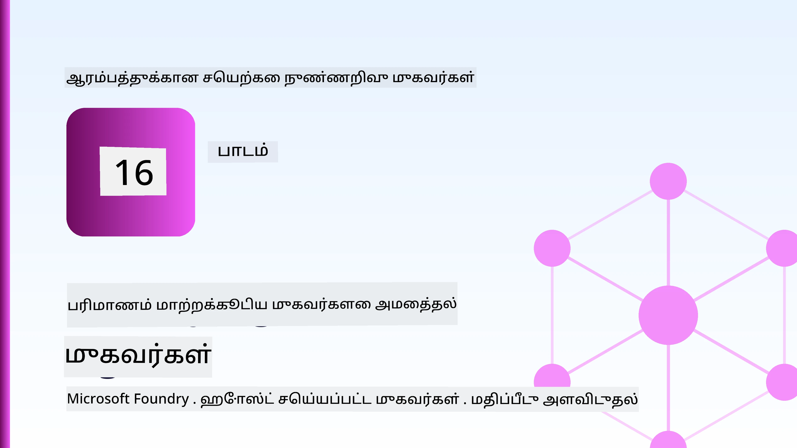
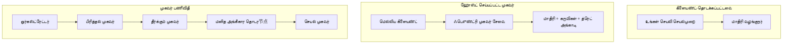
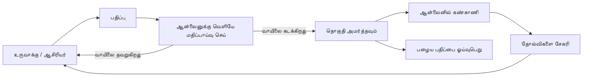
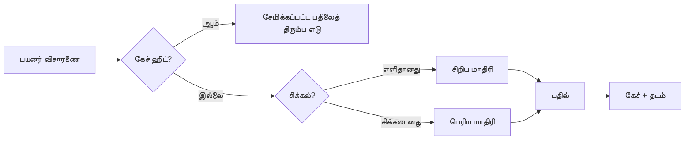
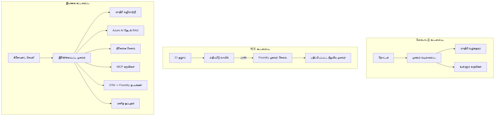

# Microsoft Foundry உடன் விரிவாக்கக்கூடிய முகவர்கள் நடத்தல்



இப்பொழுது வரை இந்த பாடத்தில் நீங்கள் உங்கள் லேப்டாப், ஒரு நோட்புக் உள்ளே இயங்கும், `az login` மற்றும் சில சுற்றுச்சூழல் மாறிலிகள் கொண்டு இயக்கப்படும் முகவர்களை உருவாக்கியுள்ளீர்கள். இது கற்றுக்கொள்ள சரியான வழி தான். ஆனால், மக்களின் ஆயிரக்கணக்கானோர் 3 a.m.க்கு சார் வசந்தங்கள் ஆகும் முகவர்களை இயக்குவதற்கு இது சரியான வழி அல்ல.

இந்த பாடம் "இது என் இயந்திரத்தில் வேலை செய்கிறது" மற்றும் "இது தொழில்முறையில் நம்பகமாகவும் மலிவான முறையிலும் வேலை செய்கிறது" ஆகிய இரண்டிற்கான இடையிடை வளையைப் பற்றி தான். நாம் அந்த இடைவெளியை **Microsoft Foundry** மற்றும் **Microsoft Foundry Agent Service** பயன்படுத்தி மூடுகிறோம், மேலும் இதில் கருவிகள், மீட்புகள், நினைவகம், மதிப்பீடு மற்றும் கண்காணிப்பு ஆகியவற்றுடன் ஒரு உண்மையான வாடிக்கையாளர் ஆதரவு முகவரைக் கட்டுவதன் மூலம் செய்வோம்.

## அறிமுகம்

இந்த பாடம் கீழ்காணும் விஷயங்களை எடுத்துரைக்கும்:

- **முயற்சி முகவர்** மற்றும் **நடத்தப்பட்ட முகவர்** இடையேயான வேறுபாடு, மாற்றம் பெரும்பாலும் மாதிரிக்கான *புறம்* அனைத்து விஷயங்களையும் பற்றியது.
- முகவர்களுக்கு **நடத்தல் ஒப்புமைகள்**: கிளையண்ட்-ஹோஸ்டட், சேவை-ஹோஸ்டட் (Hosted Agents), மற்றும் பாடவழிச் சீரமைவு.
- Microsoft Foundry இல் **முகவர் வாழ்க்கைசுழற்சி** — உருவாக்கு, பதிப்பு, நடத்தை, மதிப்பாய், கவனித்தல், ஓய்வு.
- **விரிவாக்கக் குறிச்சொற்கள்**: மாதிரி வழிமுறை, கேச்சிங், ஒருங்கிணைப்பு, மற்றும் நிலைவில்லாத வடிவமைப்பு.
- OpenTelemetry மற்றும் Foundry தடவல் கொண்டு **காணொளித்தன்மை**.
- மாதிரி தேர்வு, வழிமுறை மற்றும் மதிப்பீடு வாயிலாக **செலவு சரி செய்யல்**.
- **நிறுவன கருத்துக்கள்**: ஆட்சி, மனித அங்கீகாரம், மற்றும் தொழில்முறையில் MCP சர்வர்கள் பாதுகாப்பாக இயக்குவது.

## கற்றல் இலக்குகள்

இந்த பாடத்தை முடித்த பிறகு, நீங்கள் தெரிந்து கொள்வீர்கள்:

- ஒரு முகவர் பணிச்சுமை குறித்த சரியான நடத்தல் ஒப்புமையை தேர்வு செய்வது எப்படி.
- Microsoft Foundry Agent Service க்குள் ஒரு முகவரை பதிப்பிடுதல், ஆட்சி மற்றும் காணொளித்தன்மைக்கு உட்படுத்துவது.
- தடவல் மேலாண்மைக்கான கருவிப்பொருட்களை வடிவமைத்தல் மற்றும் வெளியீட்டுக்கு முன் இயங்கும் மதிப்பீடு பைப்லைன் அமைத்தல்.
- விரிவாக்கத்தில் தாமத மற்றும் செலவை கட்டுப்படுத்த மாதிரி வழிமுறையும் கேச்சிங்கும் பயன்படுத்தல்.
- உயர் அபாய நடவடிக்கைகளுக்கு மனித அங்கீகாரம் சேர்க்கும் வாயில் மற்றும் MCP சர்வரை தொழில்முறை பாதுகாப்பான முறையில் ஒருங்கிணைத்தல்.

## முன் நிபந்தனைகள்

இந்த பாடம் நீங்கள் முன் பாடங்களை முடித்திருப்பதாகவும், பின்வரும் விஷயங்களில் சுயவிவரம் உள்ளதாகவும் அனுமானிக்கிறது:

- [Microsoft Agent Framework](../14-microsoft-agent-framework/README.md) கொண்டு முகவர்கள் உருவாக்குதல் (பாடம் 14).
- [கருவி பயன்படுத்துதல்](../04-tool-use/README.md) (பாடம் 4) மற்றும் [Agentic RAG](../05-agentic-rag/README.md) (பாடம் 5).
- [Agent நினைவகம்](../13-agent-memory/README.md) (பாடம் 13) மற்றும் [Agentic Protocols / MCP](../11-agentic-protocols/README.md) (பாடம் 11).
- [காணொளித்தன்மை மற்றும் மதிப்பீடு](../10-ai-agents-production/README.md) (பாடம் 10) — இந்த பாடம் அதில் நேரடியாக அடித்தளமாக உள்ளது.

மேலும் உங்களுக்கு தேவைப்படும்:

- ஒரு **Azure சந்தா** மற்றும் குறைந்தது ஒரு நடைமுறையில் உள்ள உரையாடல் மாதிரியை கொண்ட **Microsoft Foundry திட்டம்**.
- அங்கீகரிக்கப்பட்ட **Azure CLI** (`az login`).
- Python 3.12+ மற்றும் ரெப்போசிடரியிலுள்ள [`requirements.txt`](../../../requirements.txt) இல் உள்ள தொகுப்புகள்.

## முயற்சியிலிருந்து தொழில்முறைக்கு: உண்மையில் என்ன மாறுகிறது

ஒரு முயற்சி முகவரும் தொழில்முறை முகவரும் ஒரே மூலச் சுற்றில் சேர்ந்தவை — காரணம், கருவிகள் அழைப்பு, பதில். மாறுவது அந்த சுற்றை அரைஞ்சியுள்ள அனைத்து அம்சங்களே ஆகும். மாதிரி தொழில்முறை முகவரியின் சுமார் 20% ஆகும்; மற்ற 80% செயல்பாட்டு உடல் அமைப்பு.

| கவனம் | முயற்சி | தொழில்முறை |
| --- | --- | --- |
| **ஹோஸ்டிங்** | உங்கள் நோட்புக்கில் இயங்குகிறது | ஹோஸ்ட் செய்யப்படும் சேவையாக இயங்குகிறது, பதிப்பிடப்பட்டு வெளியிடப்படுகிறது |
| **அடையாளம்** | உங்கள் `az login` குறியீடு | வரையறுக்கப்பட்ட RBAC உடன் நிர்வகிக்கப்பட்ட அடையாளம் |
| **நிலை** | நினைவகத்தில், மறுதொடக்கம் பொழுதில் இழக்கிறது | வெளிப்படையான (தொடர் கடை, நினைவகம் சேவை) |
| **தோல்வி** | நீங்கள் பிழை பின்னடைவை காணலாம் | மீண்டும் முயற்சி, வழிகாட்டிகளுடன், இறந்த கடிதம், எச்சரிக்கை |
| **செலவு** | "சில சதவீதங்கள் மட்டுமே" | கோரிக்கைக்கு அடிப்படையில் கணக்கிடப்பட்டு, வழிமுறைசெய்யப்பட்டு, கேச்சிங் மற்றும் பட்ஜெட்டிங் |
| **தரநிலை** | நீங்கள் வெளிப்படையாக பார்க்கிறீர்கள் | ஒவ்வொரு வெளியீட்டுக்கு முன்னும் தானாக மதிப்பீடு செய்யப்படுகிறது |
| **நம்பிக்கை** | நீங்கள் ஒவ்வொரு செயலையும் அங்கீகரிக்கிறீர்கள் | கொள்கை + மனிதன்-இன்-தி-லூப்பில் அபாயமுள்ள நடவடிக்கைகளுக்கு |

இந்த அட்டவணையை மனதில் வைத்திருங்கள். கீழ்க்காணும் ஒவ்வொரு பகுதியும் இதிலுள்ள வரிசைகளில் ஒன்றுடன் பொருந்தும்.

## முகவர் நடத்தல் ஒப்புமைகள்

நீங்கள் பெரும்பாலும் சேர்த்து பயன்படுத்தும் மூன்று ஒப்புமைகள் உள்ளன.

### 1. கிளையண்ட்-ஹோஸ்ட் முகவர்கள்

முகவர் பொருள் உங்கள் *விண்ணப்ப செயல்முறையில்* உள்ளே இடம் பெறுகிறது. உங்கள் குறியீடு நேரடியாக மாதிரி வழங்குநரை அழைக்கிறது; காரண சுழற்சி உங்கள் சேவையில் இயங்குகிறது. இது முன் பாடங்களில் எல்லாம் செய்தவையே.

- **பயன்பாடு**: முழு கட்டுப்பாடு, தனிப்பயன் மிடில்வேர் தேவைப்படும்போது அல்லது முகவரை ஏற்கனவே உள்ள ஒருங்கினைந்த முகப்பின் பின்புறத்தில் இணைக்கும் போது.
- **பரிமாற்றம்**: விரிவாக்கம், நிலை மற்றும் தாங்கிவைப்பு ամբողջமும் உங்களிடம் தான்.

### 2. ஹோஸ்ட் செய்யப்பட்ட முகவர்கள் (Foundry Agent Service)

முகவர் *Microsoft Foundry இல் ஒரு வளமாக பதிவு செய்யப்பட்டுள்ளது*. Foundry காரண சுழற்சியை ஹோஸ்ட் செய்கிறது, தொடர்களை சேமிக்கிறது, உள்ளடக்க பாதுகாப்பு மற்றும் RBAC அமல்படுத்துகிறது, மற்றும் முகவரை Foundry போர்டலில் காட்சிப்படுத்துகிறது. உங்கள் செயலி தொடர்ந்து клиентов ஆகி, தொடர்களை உருவாக்கி பதில்களை வாசிக்கிறது.

- **பயன்பாடு**: நீடித்த தன்மை, அம்மேலும் காணொளித்தன்மை, ஆட்சி, மற்றும் குறைந்த செயல்பாட்டு 面க்கு தேவைப்படும் போது.
- **பரிமாற்றம்**: கட்டுப்பாடு குறைவாக கிடைக்கும், பராமரிக்கப்படும் இயங்குதளத்திற்கு மாற்றாக.

### 3. முகவர் வேலைப்பாடுகள்

பல முகவர்கள் (மற்றும் கருவிகள்) ஒருங்கிணைக்கப்பட்ட கட்டமைப்பாக அமைக்கப்படுகின்றன— தொடர் நடவடிக்கைகள், கிளைகளின் படி பிரிக்கப்பட்டவை, மனித அங்கீகாரம் கோரப்படும் முனைகள், மற்றும் இடைவிடா நிறுத்தி தொடரும் நிலைத்தட்டைகள். இது Microsoft Agent Framework இன் **Workflows** திறன் மீது மேல் நிலையான நடத்தல் வலையமைப்பு.

- **பயன்பாடு**: ஒரு தனித்திட்டம் பல சிறப்பு முகவர்களை சார்ந்திருந்தால் அல்லது நடுவில் அங்கீகாரம் தேவைப்பட்டால்.
- **பரிமாற்றம்**: அதிக இயக்க பொருட்கள்; ஒருங்கினைத்தல் மட்டத்தில் காணொளித்தன்மை தேவை.



## Microsoft Foundry இல் முகவர் வாழ்க்கைசுழற்சி

ஒரு முகவரை இயக்குவது ஒரே முறை `push` இல்லாமல் ஒரு சுழற்சி, மற்றும் அது மென்பொருள் வெளியீட்டு சுழற்சியைப் போலவே தெரிகிறது.



முக்கிய கருத்து, [பாடம் 10](../10-ai-agents-production/README.md) இருந்து எடுத்தது: **ஆஃப்லைன் மதிப்பீடு ஒரு வாயில் தான், பின்னோக்குப் பார்வை அல்ல**. புதிய முகவர் பதிப்பு உங்கள் மதிப்பீட்டு வரம்புகளை கடக்காமல் வெளியிடப்படாது. ஆன்லைன் காணொளித்தன்மை பின்னர் உண்மையிலான தோல்விகளை உங்கள் ஆஃப்லைன் சோதனை தொகுப்புக்கு திருப்பிக் கொடுக்கும். அதுவே முழு சுழற்சி.

## விரிவாக்கக் குறிச்சொற்கள்

ஒரு முகவரை விரிவாக்குவது நிலைவில்லா இணைய API விரிவாக்கத்திலிருந்து மாறுபடுகிறது, ஏனெனில் ஒவ்வொரு கோரிக்கையும் பல விரிவான மாதிரி மற்றும் கருவி அழைப்புகளை ஏற்படுத்தக்கூடும். நான்கு முறைகள் பெரும்பாலான பளு ஏற்றத்தை உடைக்கும்.

**நிலைவில்லாத கோரிக்கை கையாளுதல்.** உங்கள் செயல்முறை நினைவகத்தில் எவ்வித தனிப்பயன் நிலையும் வைத்திருக்க வேண்டாம். உரையாடல் தொடர்களை Foundry தொடர்கடை அல்லது நினைவு சேவையில் நிலைத்திருக்க வைக்கவும், ஆகையால் எந்த எழுவும் எந்த கோரிக்கையையும் கையாளலாம். இதுவே நீங்கள் செங்குத்தாக விரிவாக்க முடியாததைத் தடுக்கிறது — உருவுவாயிருத்தலாம், ஒட்டுமொத்த அமோதங்கள் இல்லாமல்.

**மாதிரி வழிமுறை.** ஒவ்வொரு கோரிக்கும் உங்கள் மிகச் சிறந்த (மற்றும் மிகவும் உயர் செலவான) மாதிரி தேவை இருக்காது. எளிய கோரிக்கைகள் — நோக்கம் வகுத்தல், சிறிய உண்மை பதில்கள் — ஒரு சிறிய, வேகமான மாதிரிக்கு வழிமுறையிடுங்கள், முக்கியமான காரணத்திற்கான பெரிய மாதிரியை விட்டு வைக்கவும். Foundry இன் **Model Router** இதை உங்களுக்குத் தர முடியும், அல்லது நீங்கள் ஒரு ஒளிமுக்கியல் வகுப்பை தானாக உருவாக்கலாம். அவற்றின் DIY பதிப்பை ஆய்வகம் செய்யப்போகிறீர்கள்.

**பதில் கேச்சிங்.** பல ஆதரவு கேள்விகள் மிகவும் ஒத்தவை ("எப்படி என் கடவுச்சொல்லை மீட்டமைக்கலாம்?"). பொதுவான கேள்விகளுக்கு பதில்களை சேமித்து மாதிரியை வைராக்காமல் வழங்குங்கள். ஒரு சாதாரண கேச்ச் பிடிப்பு விகிதமும் செலவும் தாமதத்தையும் பொருள் எழுதப்போடும்.

**ஒத்துழைப்பு மற்றும் பின்வழுக்கல்.** மாதிரி வழங்குநர்களுக்கு வீதக் கட்டுப்பாடுகள் உள்ளன. உங்கள் ஒத்துழைப்பைக் கட்டுப்படுத்துங்கள், விரிவாக்கிய மீண்டும் முயற்சிகளுடன் மற்றும் சிறந்த முறையில் தோல்வியடைந்ததும் Graceful ஆக செயல்படுங்கள் (கட்டுப்படுத்தப்படும் "நாங்கள் அதில் இருக்கிறோம்" பதில் 500 விட சிறந்தது).



## தொழில்முறையில் காணொளித்தன்மை

நீங்கள் காணவில்லை எனில் இயக்கு முடியாது. பாடம் 10 இல் கூறப்பட்டபடி, Microsoft Agent Framework **OpenTelemetry** தடவுகளை இயல்புநிலை வெளியிடுகிறது — ஒவ்வொரு மாதிரி அழைப்பும், கருவி செயற்பாடும், ஒருங்கினைத்தல் படியும் ஒரு தடவாக மாறுகின்றன. தொழில்முறையில் நீங்கள் அந்த தடவுகளை Microsoft Foundryக்கு (அல்லது எந்த OTel-பொருந்தக்கூடிய பின்னணிக்கும்) ஏற்றுமதி செய்கின்றீர்கள், அதனால் நீங்கள்:

- ஒரு வாடிக்கையாளர் புகார் இன் ஒவ்வொரு மாதிரி மற்றும் கருவி அழைப்பையும் முடிவுக்கு விட்டு தடவுக.
- காலப்போக்கில் கோரிக்கை ஒன்றுக்கு p50/p95 தாமதமும் செலவும் கண்காணிக்கவும்.
- பிழை வீத மேலேற்றம் மற்றும் செலவு அசாதாரணங்களை உங்கள் பயனர்கள் (அல்லது உங்கள் நிதி குழு) கவனிக்கும் முன் எச்சரிக்கவும்.

```python
from agent_framework.observability import get_tracer

tracer = get_tracer()

with tracer.start_as_current_span("support_request") as span:
    span.set_attribute("customer.tier", "enterprise")
    span.set_attribute("routed.model", "gpt-5-nano")
    # இந்த இடைவெளிக்குள் முகவர் செயல் தானாகவே தடம் போட்டுக் கொள்ளப்படுகிறது
```

`customer.tier` மற்றும் `routed.model` போன்ற பண்புகள் தடவுக்களையே கேள்விகளுக்கான பதில்களாக மாற்றுகின்றன ("நிறுவன வாடிக்கையாளர்கள் சிறிய மாதிரிக்கு மிகவும் அடிக்கடி வழிமுறைக்கப்படுகிறார்களா?").

## செலவு சரி செய்தல்

தொழில்முறை முகவர்களில் செலவு குறியீடுகளால் மேலதிகமாகிறது. மூன்று எளிய வசதிகள், தாக்கத்தில்:

1. **மாதிரியை சரியான அளவில் வைத்துக்கொள்**. ஒரு சிறிய மாதிரி உங்கள் மதிப்பீட்டு வாயிலை கடக்கினால் பெரும்பாலும் ஒரு பெரிய மாதிரிக்குக் காட்டிலும் குறைந்த செலவு ஆகும். மதிப்பீட்டை பயன்படுத்தி சிறிய மாதிரி போதுமென்று நிரூபியுங்கள், பாதுகாப்புக்காக பெரிய மாதிரிக்கு இயலாமை செய்வது தவிர.
2. **கட்டமைப்பை அடிப்படையாகக் கொண்டு வழித்தொகுத்தல்**. மேல் சொன்னபடி — பெரிய மாதிரி சிந்தனையை வேண்டிய கோரிக்கைகளுக்கே பெரிய மாதிரி விலை செலுத்துங்கள்.
3. **கேச்சிங் கவர்ச்சி**. மிக அதிகமாக கேட்காத மாதிரி அழைப்பு தான் மிகவும் மலிவானது.

மதிப்பீட்டு வாயில்களும் செலவு கட்டுப்பாடுகளும் இரண்டும் ஒரே ஒழுங்கும் இரண்டு வரும் பக்கங்களாகும்: மதிப்பீடு உங்களுக்கு *தரநிலையாக* சொல்கிறது, வழித்தொகுத்தலும் கேச்சிஙும் அந்த தரநிலையின் *செலவுக்கே* மிக நெருக்கமாக வைக்கின்றன.

## நிறுவனம் நடத்தும் போது கருத்தில் கொள்ளவேண்டியவை

**ஆட்சி**. Hosted Agents Foundry இன் RBAC, உள்ளடக்க பாதுகாப்பு மற்றும் கணக்கு பதிவுகளை பெறுகின்றன. ஒவ்வொரு முகவருக்கும் குறைந்தபட்ச பகுதி உரிமைகளுடன் ஒரு நிர்வகிக்கப்பட்ட அடையாளம் கொடுங்கள் — அறிவுத் தொடர் படிப்பு மட்டும், டிக்கெட் APIக்கு வரையறுக்கப்பட்ட அணுகல், இதரமுமில்லை.

**மனிதன்-இன்-தி-லூப்**. சில செயல்கள் முழுமையாக தானியக்கமாக செய்ய முடியாது — பணம் திரும்ப பெறுதல், கணக்கை நீக்குதல், சட்ட குழுவுக்கு உயர்த்துதல். Microsoft Agent Framework **அங்கீகாரம் தேவைப்படும்** கருவிகளை ஆதரிக்கிறது: முகவர் செயலை முன்மொழிகிறது, செயற்பாடு இடையூறு, மனிதன் ஒப்புதல் அல்லது நிராகரிப்பு செய்கிறார், பிறகு வேலைப்பாடு தொடர்கிறது. நீங்கள் [பாடம் 6](../06-building-trustworthy-agents/README.md) இல் இதனை முதல் முறையாக பார்த்தீர்கள்; இங்கே நீங்கள் அதை நடப்பிக்கிறீர்கள்.

**தொழில்முறையில் MCP**. [MCP](../11-agentic-protocols/README.md) உங்கள் முகவருக்குப் பொதுவான முகவரி வழியாக வெளிப்புற கருவிகளை பயன்படுத்த அனுமதிக்கிறது. தொழில்முறையில், ஒவ்வொரு MCP சர்வரையும் நம்பமுடியாத எல்லையாய் கருதுங்கள்: சர்வர் பதிப்பை பின்தொடர்க, அதனை வரையறுக்கப்பட்ட அடையாளத்துடன் இயக்குங்கள், அதன் வெளியீடுகளை சரிபார்க்கவும், மற்றும் எவ்வாறிலும் அதற்கு இரகசியங்களை வெளிப்படுத்த வேண்டாம். ஒரு MCP சர்வர் சார்ந்ததாகும், மற்றும் சார்ந்தவை திருத்தம் செய்யப்படுகின்றன, கணக்கிடப்படுகின்றன மற்றும் வீதக் கட்டுப்பாடுகளுக்குள்ளாகின்றன.



மூன்று படங்களும் — மேம்பாடு, நடத்தல், இயங்குதளம் — மூன்று வாழ்க்கை கட்டங்களில் ஒரே முகவர். பின்வரும் ஆய்வகம் அதை உருவாக்கி நடத்த உதவுகிறது.

## கைபேசி ஆய்வகம்: தொழில்முறைக்கு தயார் வாடிக்கையாளர் ஆதரவு முகவர்

[`code_samples/16-python-agent-framework.ipynb`](./code_samples/16-python-agent-framework.ipynb) துவக்கி முழுமையாக செயல்படுத்துங்கள். நீங்கள் ஒவ்வொரு தொழில்முறை கவனத்துடனும் கூடிய **Contoso வாடிக்கையாளர் ஆதரவு முகவரை** ஒன்றுசேர்க்கப்போகிறீர்கள்:

1. **கருவி அழைப்பு** — ஆர்டர் நிலையை பார்ப்பதும் ஆதரவு டிக்கெட்டுகளைத் திறப்பதும்.
2. **RAG** — அறிவுத் தொகுதியிலிருந்து கொள்கை கேள்விகளுக்கு பதில்கள் (Azure AI Search உடன், ஒரு நினைவக பின்வலியுடன் மீதமுள்ளதோ ஒரு Search வளம் இல்லாவிடில் நோட்புக் இயங்கும்).
3. **நினைவகம்** — உரையாடல் முறைமையால் வாடிக்கையாளரை நினைவில் வைப்பது.
4. **மாதிரி வழிமுறை** — ஒரு சிக்கல் வகுப்பி ஒவ்வொரு கோரிக்கையையும் சிறிய அல்லது பெரிய மாதிரிக்கு வழித்தொடுக்கும்.
5. **பதில் கேச்சிங்** — மீண்டும் மீண்டும் கேட்கப்படும் கேள்விகளை கேச்சிலிருந்து சேவை செய்யும்.
6. **மனித அங்கீகாரம்** — ஒரு வரம்புக்கு மேலான பணம் திரும்பப் பெறுதல்களுக்கு மனித அனுமதி வேண்டியது.
7. **மதிப்பீட்டு பைப்லைன்** — ஒரு சிறிய ஆஃப்லைன் சோதனை தொகுப்பு முகவரின் மதிப்பை அளித்து வெளியீட்டு வாயிலாக செயல்படுகிறது.
8. **காணொளித்தன்மை** — ஒவ்வொரு கோரிக்கைக்கும் OpenTelemetry தடவல்கள்.

### விளக்கம்

நோட்புக் ஒவ்வொரு தொழில்முறை கவனமும் தனிப்பட்ட, இயக்கக்கூடிய பகுதியில் அமைந்துள்ளது. இதன் இதயம் வழித்தொடர்பிலும் கேச்சிங்கிலும் கூடிய கோரிக்கை கையாள்பவராகும்:

```python
async def handle_support_request(query: str, customer_id: str) -> str:
    # 1. முடியுமானால் கேசிலிருந்து சேவையாற்றவும்.
    cached = response_cache.get(normalize(query))
    if cached:
        return cached

    # 2. செலவை கட்டுப்படுத்த சிக்கலுடன் வழித்தடம் அமைக்கவும்.
    model = "gpt-5-nano" if is_simple(query) else "gpt-5-mini"

    # 3. கண்காணிப்புக்காக ஏஜெண்டை ஒரு டிரேஸ் ஸ்பானில் இயக்கவும்.
    with tracer.start_as_current_span("support_request") as span:
        span.set_attribute("routed.model", model)
        span.set_attribute("customer.id", customer_id)
        response = await support_agent.run(query, model=model)

    # 4. கேசி செய்து திருப்பி அளிக்கவும்.
    response_cache.set(normalize(query), response.text)
    return response.text
```

வெளியீட்டை காக்கும் மதிப்பீட்டு வாயில் இவ்வாறு தெரிகிறது:

```python
async def evaluation_gate(agent, test_cases, threshold: float = 0.8) -> bool:
    passed = 0
    for case in test_cases:
        result = await agent.run(case["input"])
        if score_response(result.text, case["expected"]) >= 0.8:
            passed += 1
    pass_rate = passed / len(test_cases)
    print(f"Evaluation pass rate: {pass_rate:.0%} (gate: {threshold:.0%})")
    return pass_rate >= threshold  # கதவு தேர்ச்சி பெறும் போது மட்டுமேவ் நிறுவவும்
```

ஒவ்வொரு வரியையும் படியுங்கள் — நோட்புக் அடிப்படைகளை குறைவாக வைத்திருக்கிறது எனவே ஓர்ப்பாய்வுக்குப் பின் எதுவும் மறைக்கப்படவில்லை.

## Smoke சோதனைகள் மூலம் நடத்தப்படும் முகவரையைக் குணப்படுத்தல்

மேலே கூறிய மதிப்பீட்டு வாயில் *ஆஃப்லைனில்* உங்கள் முகவர் பொருளைப்போல் இயங்கும். முகவரை Hosted Agent ஆக நடத்திய பிறகு, இன்னொன்று தேவையே, அதுவும் மலிவானது: **நடத்தப்பட்ட முனை உண்மையில் பதிலளிக்கிறதா?**

"வெற்றிகரமாக" நடப்பது கட்டுப்பாட்டு தளம் வரையறையை ஏற்றுக்கொண்டதை மட்டுமே நிரூபிக்கிறது — இது முகவர் பதிலளிக்கும் என்பதை உறுதி செய்யாது. முக்கிய சார்பு இல்லாமை, தவறான மாதிரி வழிமுறை, அல்லது காலாவதியான இணைப்பு என்றால் அதிர்ச்சியில்லாத வெற்றிகரமான நடத்தலை விட பதில் ஒதுக்காது. ஒரு **smoke சோதனை** அதைப் பிடித்து விட்டு சேவை கட்டணம் இல்லாமல் ஒவ்வொரு நடத்தியதும் வினாடிகளுக்குள் கண்டறிகிறது.

இந்த ரெப்போசிடரி பயன்படுத்த தயாரான smoke-test பைப்லைனை [AI Smoke Test](https://github.com/marketplace/actions/ai-smoke-test) GitHub செயல்பாடு மீது கட்டமைத்துள்ளது:

- **கேட்கோலோஜி** — [`tests/lesson-16-smoke-tests.json`](../../../tests/lesson-16-smoke-tests.json) த Contoso ஆதரவு முகவருக்கான கூற்றுகள் மற்றும் உறுதிப்படுத்தல்களை கொண்டுள்ளது (அடிப்படையிலான கொள்கை பதில்கள், ஆர்டர் பார்வை, பொருத்தமான தலைப்பு, மற்றும் பல உரையாடல் தொடர்ச்சிகளுடன்). பிற பாடங்களில் உள்ள முகவர்களுக்கான கேட்கோலோஜிகள் இதனுடன் இருக்கின்றன — பாருங்கள் [`tests/README.md`](../tests/README.md).
- **வேலைச்சூழல்** — [`.github/workflows/smoke-test.yml`](../../../.github/workflows/smoke-test.yml) Azure OIDC கொண்டு உள்நுழைந்து மொத்த கேள்விகளையும் முகவரின் Responses முனையத்திற்கு POST செய்கிறது, எந்த உறுதிப்படுத்தல் தவறின் பொழுதும் பணியைக் விட்டு வைப்பது.

```yaml
- name: Smoke-test hosted agent
  uses: JFolberth/ai-smoketest@v1
  with:
    project_endpoint: ${{ inputs.project_endpoint }}
    agent_name: ContosoSupportAgent
    tests_file: tests/lesson-16-smoke-tests.json
```


உங்கள் முகவர் இயக்கப்பட்ட பிறகு, **Actions** தாவலைச் சுட்டி, உங்கள் Foundry திட்டத்தின் முடிவு மற்றும் முகவர் பெயரை வழங்கி அதை இயக்கவும். கூட்டமைக்கும் அடையாளத்திற்கு Foundry திட்ட வரம்பில் **Azure AI User** பங்கு தேவை. அடுக்கு நிலைகள் ஒரு மடுகல் துறையில் இருக்கின்றன என்று நினைத்துக் கொள்ளுங்கள்: புகைத் தேர்வுகள் (ஏறத்தாழ மற்றும் பதில் அளிப்பது?) ஒவ்வொரு இயக்கத்திலும் இயங்கும், ஆஃப்லைன் மதிப்பீடு (பரிமாறுவதற்கு போதுமானதா?) உயர்விற்கு முன் இயங்கும், மற்றும் ஆன்லைன் மதிப்பீடு (அப்பாவி சூழலில் எப்படி இருக்கிறது?) தொடர்ச்சியாக இயங்கும்.

## அறிவு பரிசோதனை

பணிக்கு முன்னர் உங்கள் புரிதலை சோதிக்கவும்.

**1. ஒரு உற்பத்தி முகவரின் "மாதிரி" எவ்வளவு பகுதியை占க்கிறது மற்றும் மீதமுள்ளவை என்ன?**

<details>
<summary>பதில்</summary>

மாதிரி கணக்கிடப்பட்ட சுமார் 20% என்றே கூறப்படுகிறது, ஆனால் அது மொத்த அமைப்பில் குறைந்தபட்சமாகும். மீதமுள்ளவை செயல்பாட்டு உடல்: ஹோஸ்டிங் மற்றும் பதிப்பூட்டல், அடையாளம் மற்றும் RBAC, வெளியிட்ட நிலையில், தோல்வி கையாளுதல், செலவு கண்காணிப்பு, மதிப்பீடு மற்றும் மனித-இணையின கட்டுப்பாடுகள். உற்பத்திக்கு முன்னேறுவது பெரும்பாலும் தீர்மான ஒட்ட Loop-இன் சுற்றி அனைத்தையும் கட்டமைப்பதில் உள்ளது.
</details>

**2. எந்த நேரத்தில் நீங்கள் கிளையண்ட்-ஹோஸ்ட் செய்யப்பட்ட முகவருக்கு பதிலாக ஹோஸ்ட் செய்யப்பட்ட முகவரைக் தேர்வு செய்வீர்கள்?**

<details>
<summary>பதில்</summary>

நீங்கள் கட்டுப்படுத்தப்படும் ரன்னடைம், கட்டமைக்கப்பட்ட நிலைத்தன்மை (தொடர்ச்சி உள்ளது மற்றும் திரும்பத் தொடங்கக்கூடிய திரைகள்), கண்காணிப்பு, உள்ளடக்க பாதுகாப்பு மற்றும் RBAC போன்றவை தேவையானபோது, மற்றும் reasoning loop இல் சில சட்டசட்டமான கட்டுப்பாடு சிலபட்சமாக குறைந்துக்கொள்ள தயார் இருந்தால் ஹோஸ்ட் செய்யப்பட்ட முகவர் சிறந்ததாகும். நீங்கள் முழுமையான கட்டுப்பாடு மற்றும் ஏற்கனவே உள்ள பின்னணி அமைப்பில் முகவரை இணைக்க வேண்டுமென்றால் கிளையண்ட்-ஹோஸ்ட் அனைத்து சூழலுக்கும் பொருத்தமாகும்.
</details>

**3. ஏன் ஒரு விரிவாக்கக்கூடிய முகவர் தன்னுடைய செயல்பாட்டு நினைவகத்தில் நிலையான நிலைமையற்றதாக இருக்க வேண்டும்?**

<details>
<summary>பதில்</summary>

எந்த ஒரு நிகழ்வும் எந்த ஒரு கோரிக்கையையும் கையாள முடியும், இது ஒட்ட Loop-ஐ நீட்டிக்க ஸ்டிக்கி அமர்வுகள் இல்லாமலான ஹொரிஜான்டல் விரிவாக்கத்தை அனுமதிக்கிறது. பயனர் தனிப்பட்ட உரையாடல் நிலை திரை சேமிப்பகம் அல்லது நினைவக சேவைக்கு வெளியே வைத்திருப்பதால் இது சாத்தியம். நிலை செயல்பாட்டு நினைவகத்தில் இருந்தால், மறுசீரமைப்பில் அது இழக்கப்பட்டு இலவசமாக சுமை பங்கீடு செய்ய முடியாது.
</details>

**4. மாதிரி வழிசெல்லுதலில் தீர்வு செய்யப்பட வேண்டிய பிரச்சினை என்ன மற்றும் அது மதிப்பீட்டுடன் எவ்வாறு தொடர்புடையது?**

<details>
<summary>பதில்</summary>

வழிசெல்லுதல் எளிய கோரிக்கைகளை சிறிய, மலிவான, விரைவான மாதிரிக்கு அனுப்பும் மற்றும் பெரிய மாதிரியை உண்மையான தார்மீகத்திற்காகச் சந்திரனப்படுத்தும், இது இரண்டையும் தாமதமும் விலைமனையும் கட்டுப்படுத்தும். இது மதிப்பீட்டுடன் தொடர்புடையது ஏனென்றால் மதிப்பீடு சிறிய மாதிரி ஒரு வகை கோரிக்கைகளுக்கு போதுமானது என்று *தெரிவிக்கும்* — மதிப்பீடு இல்லாத வழிசெல்லுதல் ஊகிக்கப்படுவதாகும்.
</details>

**5. "மதிப்பீடு கதவு" என்றால் என்ன மற்றும் அது வாழ்நிலைச் சுற்றத்தில் எங்கே அமைகிறது?**

<details>
<summary>பதில்</summary>

ஒரு மதிப்பீடு கதவு புதிய முகவர் பதிப்புக்கு ஒரு ஆஃப்லைன் சோதனை தொகுப்பை இயற்றுகிறது மற்றும் ஒரு குறுக்கு விகிதத்தை சுத்திகரிக்காத வரை இயக்கத்தை தடுக்கும். இது "பதிப்பு" மற்றும் "நடவடிக்கை" இடையில் அமைகிறது, வெளியீட்டுக்கு முன்னரே தரத்தை அடையாளம் காண்பதாக அமைக்கிறது, மற்றபடி அனுப்புவதற்கு பின்பு சோதிக்கும் விடயமாக இல்லை.
</details>

**6. உற்பத்தியில் ஒரு MCP சர்வரை நம்பிக்கைக்குரிய எல்லையற்றாக ஏன் கருத வேண்டும்?**

<details>
<summary>பதில்</summary>

அது உங்கள் முகவர் அணுகும் வெளி சார்ந்த பொறுப்பு ஆகும். நீங்கள் இதன் பதிப்பை பின் பிடிக்க வேண்டும், குறிப்பிட்ட அடையாளத்துடன் இயக்க வேண்டும், அதன் முடிவுகளை சரிபார்க்க வேண்டும், வீதவீதத்தைக் கட்டுப்படுத்த வேண்டும் மற்றும் எந்த ரகசியங்களையும் அப்பகுதிக்குப் பகிர வேண்டாம் — இது மூன்றாம் தரப்பு சார்ந்த பொறுப்புகளுக்கு இடையே பின்பற்றப்படும் ஒழுக்க விதிகளே. அதன் முடிவுகள் உங்கள் முகவரின் தார்மீகத்தில் செல்லும், எனவே சரிபார்க்காத நம்பிக்கை பாதுகாப்பு ஆபத்தாகும்.
</details>

**7. பொதுவாக உற்பத்தி முகவர் செலவுக்கு மிகப்பெரிய தாக்கத்தை ஏற்படுத்தும் ஒரே மாற்றம் எது மற்றும் ஏன்?**

<details>
<summary>பதில்</summary>

மாதிரியை சரியாக அளவிடுதல் — உங்கள் மதிப்பீடு கதவை கடந்த சிறிய மாதிரியைப் பயன்படுத்துவது. செலவு டோக்கன்களால் நிர்ணயிக்கப்படுகிறது, மற்றும் தரச்சாதகத்திற்கு ஏற்ப சிறிய மாதிரி பெரும்பாலும் பெரிய மாதிரியைவிட மலிவாக இருக்கும். பின்வரும் காசிங் மற்றும் வழிசெல்லுதல் செலவை மேலும் குறைக்கும், ஆனால் சரியான அடிப்படை மாதிரியைத் தேர்ந்தெடுப்பதே மிகப்பெரிய முதலாவது மாற்றம்.
</details>

**8. `customer.tier` மற்றும் `routed.model` போன்ற பரப்புச் சொத்துக்கள் கண்காணிப்பில் என்ன பங்கு வகிக்கின்றன?**

<details>
<summary>பதில்</summary>

அவை மெய்யான பின்வட்டாரங்களை பதிலளிக்கக்கூடிய வணிகக் கேள்விகளாக மாற்றுகின்றன. சொத்துக்கள் இல்லாதால் நீங்கள் பரப்புகளின் சுவர் காண்பீர்கள்; அவையுடன் நீங்கள் "நாடு வாடிக்கையதாரர்கள் சிறிய மாதிரிக்கு அதிகமாக வழிசெல்கிறார்களா?" அல்லது "எந்த மாதிரி நமது மந்தமான கோரிக்கைகளை கையாள்கிறது?" என்று கேட்கலாம். சொத்துக்களே உங்கள் இயக்கத்திற்கு முக்கியமான பரிமாணங்களில் தொலைதோற்றத்தை பட்டிருப்பதற்கான வழி.
</details>

## பணியமைப்பு

ஆய்வறையில் இருந்து வாடிக்கையாளர் ஆதரவு முகவரைப் பெற்று, அதை ஒரு குறிப்பிட்ட சூழலில் வலுப்படுத்தவும்: **ஒரு SaaS நிறுவனத்திற்கான சந்தா பில்லிங் ஆதரவு முகவர்.**

உங்கள் சமர்ப்பிப்பு செய்யவேண்டியது:

1. பில்லிங்-பொருத்தமான கருவிகளுடன் **கருவிகளை மாற்றவும்**: `get_subscription_status`, `get_invoice`, மற்றும் `issue_credit` (50 டாலர் க்கும் மேற்பட்ட நிதியுதவிக்கு மனித அனுமதி தேவை).
2. நிறுவனத்தின் மீள்மறுப்பு கொள்கை, பில்லிங் சுற்று மற்றும் ரத்துசெய்தல் கொள்கையை உள்ளடக்கிய மூன்று RAG ஆவணங்களைச் சேர்க்கவும்.
3. மதிப்பீட்டு தொகுப்பை குறைந்தது எட்டுக்கேஸ் வரை விரிவுபடுத்தவும், இதில் குறைந்தது இரண்டு *மனித அனுமதியைத் தொடங்கக்கூடிய* இருக்க வேண்டும், உங்கள் மதிப்பீடு கதவு சரியாக பாஸ் அல்லது தோல்வி செய்கிறதா என்பதையும் உறுதிப்படுத்தவும்.
4. ஒரு செலவு அறிக்கையைச் சேர்க்கவும்: முகவரின் மூலம் பத்து கலந்தவைத்த கோரிக்கைகள் ஓடிய பிறகு, எத்தனை சிறிய மாதிரிக்கு, எத்தனை பெரிய மாதிரிக்கு சென்றன, மற்றும் எத்தனை கேஷிலிருந்து வழங்கப்பட்டன என்பதை அச்சிடவும்.

நீங்கள் தேர்ந்தெடுத்த மாதிரி-வழிசெல்லுதலில் பொருந்தும் விதியும் அதனை உண்மையான போக்குவரத்துடன் எப்படி சோதிப்பது என்பதையும் விளக்கும் ஒரு சிறிய பத்தியை (ஒரு markdown செல்யின் உள்ள) எழுதவும். ஒரே சரியான பதில் இல்லை — உற்பத்தி கவலைகள் ஒன்றிணைந்த முறையில் அமைக்கப்பட்டிருக்கிறதா என்பதை அடிப்படையாகக் கொண்டு மதிப்பீடு செய்யப்படுகிறீர்கள்.

## சுருக்கம்

இந்த பாடத்தில் Microsoft Foundry உடன் ஒரு முகவர்களை சாதனமிருந்து உற்பத்தி நிலைக்கு கொண்டு சென்றீர்கள்:

- உற்பத்திக்கு செல்லும்போது பெரும்பாலும் மாதிரிக்கு சுற்றியுள்ள **செயல்பாட்டு உடல்** தான் முக்கியம் — ஹோஸ்டிங், அடையாளம், நிலை, தோல்வி கையாளுதல், செலவு, தரம் மற்றும் நம்பிக்கை.
- நீங்கள் மூன்று **நடவடிக்கை முறைகள்** — கிளையண்ட்-ஹோஸ்டு, ஹோஸ்ட்டட் முகவர்கள் மற்றும் முகவர் பணிச்சியல்கள் — மற்றும் அவை எப்போது பொருந்துமென கற்றுக்கொண்டீர்கள்.
- நீங்கள் **முகவர் வாழ்நிலை** பரிமாற்றத்தைக் கடந்து சென்றீர்கள், அங்கு ஆஃப்லைன் **மதிப்பீடு வெளியீட்டு கதவாக செயற்படுகிறது** மற்றும் ஆன்லைன் கண்காணிப்பு தோல்விகளை மீண்டும் சோதனை தொகுப்புக்கு செலுத்துகிறது.
- நீங்கள் **காலமான வழிகள்** — நிலைமையற்ற வடிவமைப்பு, மாதிரி வழிசெல்லுதல், காசிங் மற்றும் வரையறுக்கப்பட்ட ஒருங்கிணைப்பு — மற்றும் அவற்றை **செலவு முழுமையாக்கத்துடன்** இணைத்தீர்கள்.
- நீங்கள் **முகாமைத்துவ கட்டுப்பாடுகள்**: RBAC, மனித-இணைய அனுமதி, மற்றும் உற்பத்தி-பாதுகாப்பான MCP இணைப்புகளை செயல்படுத்தினீர்கள்.
- நீங்கள் அனைத்து கவலைகளை ஒன்றாக இணைக்கும் ஒருங்கிணைந்த **உற்பத்தி தயார் வாடிக்கையாளர் ஆதரவு முகவரைக்** கட்டியீர்கள்.

அடுத்து வரும் பாடம் மாறுபாடான பயணமாகும்: முகவர்களை மேகத்தில் விரிவாக்குவதை மாற்றி, நீங்கள் அவற்றை ஒரு ஒற்றை அபிவிருத்தி இயந்திரத்தில் கொண்டு வந்து முற்றிலும் உள்ளூரில் இயக்கப் போகிறீர்கள்.

## கூடுதல் வளங்கள்

- <a href="https://learn.microsoft.com/azure/ai-foundry/what-is-azure-ai-foundry" target="_blank">Microsoft Foundry ஆவணங்கள்</a>
- <a href="https://learn.microsoft.com/azure/ai-foundry/agents/overview" target="_blank">Microsoft Foundry முகவர் சேவை கண்ணோட்டம்</a>
- <a href="https://learn.microsoft.com/en-us/agent-framework/overview/?wt.mc_id=youtube_26688_organicsocial_reactor&pivots=programming-language-python" target="_blank">Microsoft Agent Framework</a>
- <a href="https://learn.microsoft.com/azure/ai-foundry/concepts/model-router" target="_blank">Microsoft Foundry இல் மாதிரி வழிசெல்லுதல்</a>
- <a href="https://learn.microsoft.com/azure/search/search-what-is-azure-search" target="_blank">Azure AI Search</a>
- <a href="https://opentelemetry.io/" target="_blank">OpenTelemetry</a>
- <a href="https://github.com/marketplace/actions/ai-smoke-test" target="_blank">AI Smoke Test GitHub செயலி</a>
- <a href="https://modelcontextprotocol.io/" target="_blank">Model Context Protocol (MCP)</a>

## முந்தய பாடம்

[கணினி பயன்பாட்டு முகவர்களை (CUA) உருவாக்குதல்](../15-browser-use/README.md)

## அடுத்த பாடம்

[உள்ளூர AI முகவர்களை உருவாக்கல்](../17-creating-local-ai-agents/README.md)

---

<!-- CO-OP TRANSLATOR DISCLAIMER START -->
**மறுப்பு**:
இந்த ஆவணம் AI மொழிபெயர்ப்பு சேவை [Co-op Translator](https://github.com/Azure/co-op-translator) பயன்படுத்தி மொழிபெயர்க்கப்பட்டுள்ளது. நாங்கள் துல்லியத்திற்காக முயற்சி செய்துள்ளோம், ஆனால் தானாக செய்யப்படும் மொழிபெயர்ப்புகளில் பிழைகள் அல்லது தவறுகள் இருக்கலாம் என்பதை கவனத்தில் கொள்ளவும். அசல் ஆவணம் அதன் தாய்மொழியில் அதிகாரப்பூர்வ ஆதாரமாக கருதப்பட வேண்டும். முக்கியமான தகவல்களுக்கு, தொழில்நுட்பமான மனித மொழிபெயர்ப்பு பரிந்துரைக்கப்படுகிறது. இந்த மொழிபெயர்ப்பைப் பயன்படுத்துவதால் ஏற்படும் எந்த தவறான புரிதல்கள் அல்லது தவறான விளக்கத்திற்கும் நாங்கள் பொறுப்பில்வில்லை.
<!-- CO-OP TRANSLATOR DISCLAIMER END -->