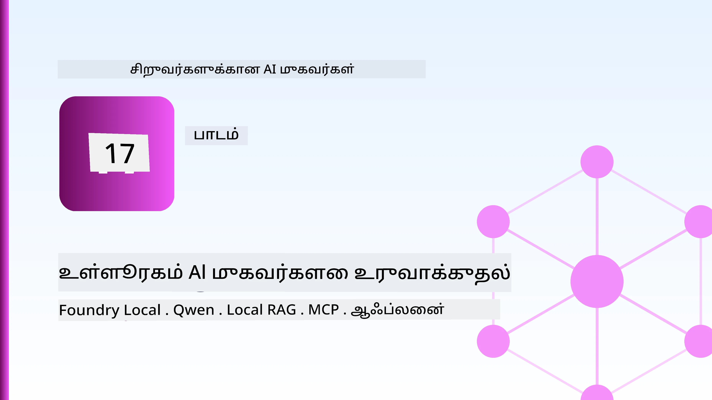
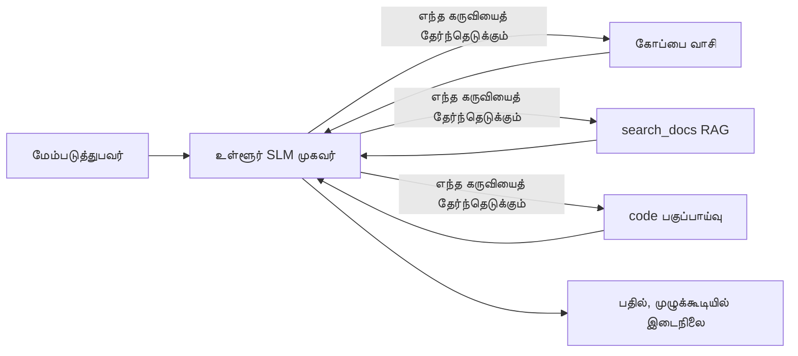
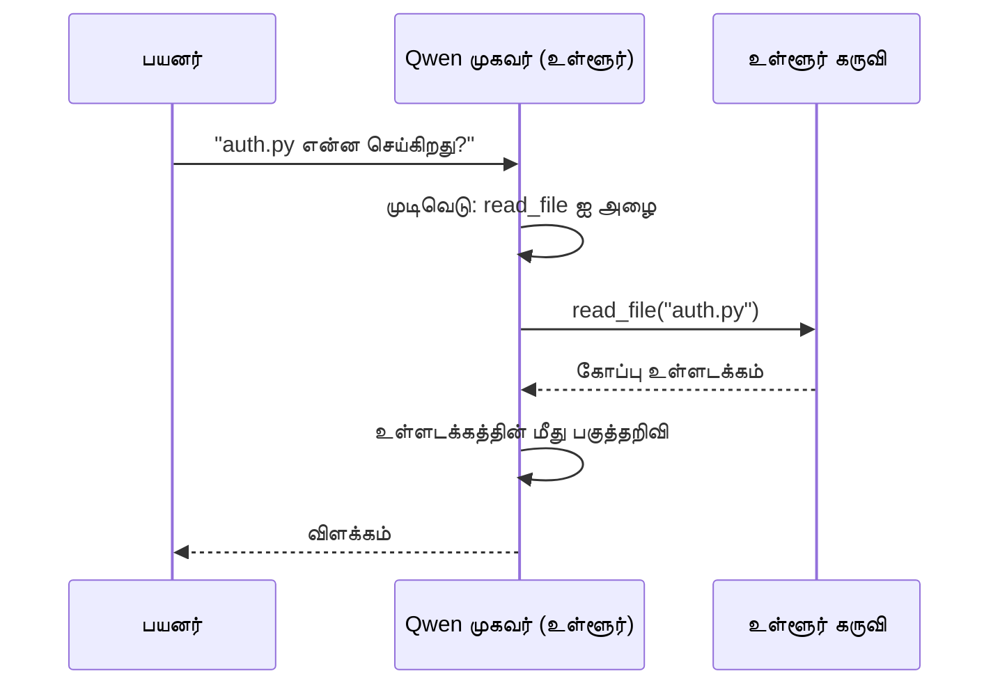
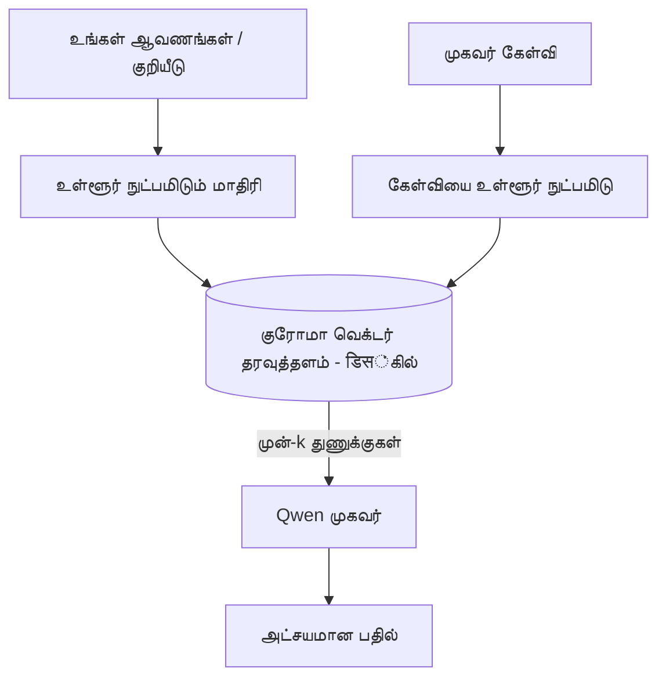
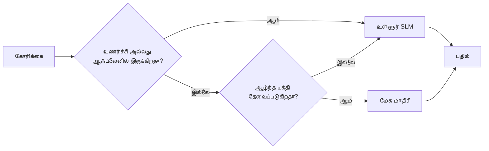

# Microsoft Foundry Local மற்றும் Qwen பயன்படுத்தி உள்ளூர் AI முகவர்கள் உருவாக்குதல்



முந்தைய பாடத்தில் முகவர்கள் மேகத்திற்கு *மேலே* விரிந்தனர். இப்பாடம் அவர்களை ஒரு இசைக்குழுவிற்கு *கீழே* கொண்டு வருகிறது. முடிவில், நீங்கள் ஒரு செயலாற்றும் பொறியியல் உதவியாளரை உருவாக்குவீர்கள், இது கருதுகோள் உருவாக்கி, கருவிகளை அழைத்து, உங்கள் ஆவணங்களை படித்து, உங்கள் ஆவணங்களை தேடும் — **ஒரு மேகத்தின் முறையான அழைப்பு இல்லாமல்.**

அதற்காக ஏன் வேண்டுமென்று கேட்கலாம்? பொறியியல் பணியில் அடிக்கடி வரும் மூன்று காரணங்கள்:

- **தனியுரிமை.** குறியீடுகள் மற்றும் ஆவணங்கள் இயந்திரத்தை விட்டு ஒருபோதும் வெளியே செல்லாது. எந்த அங்கீகாரம், துணுக்குகள், வாடிக்கையாளர் தரவு ஒரு நெட்வொர்க் எல்லையை கடக்காது.
- **செலவு.** உள்ளூர் கணிப்பு எந்த டோக்கன் கட்டணமும் இல்லை. மின் விலை செலவில் முழுநாளும் முயற்சிக்கலாம்.
- **ஆஃப்லைன்.** விமானத்தில், பாதுகாப்பான இடத்தில், அல்லது முறையிழப்பு நேரத்தில், முகவர் இன்னும் செயல்படுகிறது.

சிக்கல் இது நீங்கள் ஒரு முனைவாய்ந்த மேக மாதிரிக்கு பதிலாக உங்கள் CPU, GPU, அல்லது NPUயில் இயங்கும் **சிறிய மொழி மாதிரியை (SLM)** பயன்படுத்துகிறீர்கள். இந்த பாடம் அவ்வாறு செயலாற்றும் முகவர்களை கட்டுவது பற்றி, அந்த கட்டுப்பாடுகளை இல்லை என்று வதந்தி செய்யாமல்.

## அறிமுகம்

இந்த பாடம் இதில் கவனம் செலுத்தும்:

- **சிறிய மொழி மாதிரிகள் (SLMs)** — அவை என்ன, எப்போது சிறந்தவை மற்றும் எப்போது இல்லை.
- **Microsoft Foundry Local** — ஓர் ரன்டைம், இது மாதிரிகளை சாதனத்தில் பதிவிறக்கம் செய்து சேவை செய்கிறது **OpenAI-போன்ற API** மூலம்.
- **Qwen செயல்பாட்டு அழைப்பு மாதிரிகள்** — SLMகள், கருவிகள் அழைப்பின் துல்லியமான அழைப்புகளை உருவாக்கி உள்ளூர் *முகவர்களை* இயல்பாக்குகின்றன (உள்ளூர் உரையாடல் மட்டும் அல்ல).
- **உள்ளூர் கருவிகள், உள்ளூர் RAG மற்றும் உள்ளூர் MCP** — மேகமின்றி முகவருக்கு திறன் அளித்தல்.
- **இணைந்த முறைமைகள்** — எப்போது விஷயங்களை உள்ளூர் வைத்துக் கொள்ள வேண்டும், எப்போது மேகத்தைக் கொண்டு செல்ல வேண்டும்.

## கற்றல் இலக்குகள்

இந்தப் பாடத்தினை முடித்த பிறகு, நீங்கள்:

- SLMகளின் பரிமாற்றங்களை விளக்கி, பொருத்தமான உள்ளூர் முகவர் பயன்பாடுகளை தேர்ந்தெடுக்க தெரிந்துகொள்ளுவீர்கள்.
- Foundry Local மூலம் Qwen மாதிரியை உள்ளூரில் சேவை செய்து அதை OpenAI-போன்று இடைமுகத்தால் இணைக்க தெரிந்துகொள்ளுவீர்கள்.
- முழுமையாக உங்கள் வேலைநிலையத்தில் இயங்கி, கருவி அழைக்கும் முகவர்களை உருவாக்குவீர்கள்.
- உள்ளூர் வெக்டர் தரவுத்தளம் (Chroma) பயன்படுத்தி உங்கள் சொந்த ஆவணங்களில் உள்ளூர் RAG சேர்க்க.
- முகவரை உள்ளூர் MCP சேவையகத்துடன் இணைத்து, கலவையான உள்ளூர்/மேக வடிவமைப்புகளை பகிர்ந்து கொள்ள.

## முன் நிபந்தனைகள்

இந்த பாடம் முன்பு படித்த பாடங்களை முடித்திருக்கிறீர்கள் என்றும், கீழ்க்கண்டதில் நன்கு தேர்ச்சி பெற இருக்க வேண்டும் என்றும் கருதுகிறது:

- [கருவி பயன்பாடு](../04-tool-use/README.md) (பாடம் 4) மற்றும் [Agentic RAG](../05-agentic-rag/README.md) (பாடம் 5).
- [Agentic ஐக்கிய விதிமுறைகள் / MCP](../11-agentic-protocols/README.md) (பாடம் 11).
- [Microsoft முகவர்களைக் கட்டமைப்பு](../14-microsoft-agent-framework/README.md) (பாடம் 14).

இதையும் நீங்கள் தேவைப்படுகிறது:

- ஒரு டெவலப்பர் வேலைநிலை கணினி. **குறைந்தபட்சம் 8 GB RAM**; 16 GB+ வசதியானது. GPU அல்லது NPU உதவுகிறது, ஆனால் அவசியமில்லை.
- **Microsoft Foundry Local** நிறுவுதல் (கீழே உள்ள அமைப்பு பகுதி பார்க்கவும்).
- Python 3.12+ மற்றும் டெப்பிலுள்ள ஆகிய பைதான் தொகுப்புகள் [`requirements.txt`](../../../requirements.txt), கூடுதலாக `foundry-local-sdk`, `openai`, மற்றும் `chromadb` இந்த பாடத்திற்கு.

## சிறிய மொழி மாதிரிகள்: உள்ளூர் பணிக்கான சரியான கருவி

ஒரு முனைவாய்ந்த மேக மாதிரிக்கு நூக்கணக்கான பில்லியன் பரிமாணங்கள் உள்ளன மற்றும் ஒரு தரவுக்கூடம் பின்னணியாகப் உள்ளது. SLMக்கு சில பில்லியன் பரிமாணங்கள் மட்டும், மற்றும் உங்கள் லேப்டாப்பின் RAMல் பொருத்த வேண்டும். அந்த வேறுபாடு தெளிவான நம்பிக்கைகளை உருவாக்குகிறது.

**SLMs சிறப்பாக செய்கின்றன:**

- கட்டமைக்கப்பட்ட, வரையறுக்கப்பட்ட பணிகள் — வகைப்படுத்தல்,cstring, ஒரு அறியப்பட்ட ஆவணத்தின் சுருக்கம்.
- **கருவி அழைப்பு** — எந்த செயல்பாட்டை அழைக்கவேண்டும் மற்றும் எந்த argumentகளுடன் என்று முடிவு செய்வது.
- உங்களது சொந்த தரவில் விரைவான, மலிவு, தனிப்பட்ட முறையில் iteration செயல்.

**SLMs பலவீனமானவை:**

- திறந்த முடிவில்லா, பலதடவை காரணம் செய்யல் பெரிய உள்ளடக்கம் முழுவதும்.
- பரவலான உலக அறிவு (குறைந்த காண்பர், மேலும் மறக்கும்).

உள்ளூர் முகவர்களுக்கு வெற்றிகரமான திட்டம்: **SLM-ஐ ஒருங்கிணைக்கவிடவும், கருவிகள் பெருமளவான பணிகளை செய்யவிடவும்.** மாதிரி உங்கள் நிரலுக்கருவைக் *கட்டாயமாய்* அறிய வேண்டாம் — அது எப்போது `read_file` மற்றும் `search_docs` அழைக்கவேண்டும் தெரிந்திருக்க வேண்டும். இது SLM திறன்களுக்கு நேரடியாக பொருந்தும்.



## Microsoft Foundry Local

**Microsoft Foundry Local** என்பது உங்கள் இயந்திரத்தில் முழுமையாக மாதிரிகளை பதிவிறக்கம் செய்து, நிர்வகித்து, சேவை செய்யும் ஒரு மென்மையான ரன்டைம் ஆகும். முக்கிய அம்சம், இது ஒரு **OpenAI-போன்ற HTTP இடைமுகத்தை** வெளிப்படுத்துகிறது — அதாவது OpenAI SDK மற்றும் Microsoft முகவர் கட்டமைப்பின் OpenAI கிளையன்ட் `base_url` மட்டுமே மாற்றித் தொடர்ந்து வேலை செய்ய முடியும். முகவர்கள் கட்டுவதில் நீங்கள் கற்ற அனைத்தும் நேரடியாக செயல்படுகிறது; இடைமுகம் மேகத்திலிருந்தும் `localhost` ஆக மாறுகிறது.

Foundry Local தானாகவே உங்களது சாதனத்திற்கு சிறந்த மாதிரி கட்டிடத்தை தேர்வு செய்கிறது — CPU கட்டிடம், CUDA/GPU கட்டிடம் அல்லது NPU கட்டிடம் — உங்களுக்கு இயந்திரத்திற்கு ஒவ்வொன்றாக கட்டமைக்க தேவையில்லை.

### அமைப்பு

Foundry Local ஐ நிறுவவும் (உங்களது OSக்கான [ஆவணங்கள்](https://learn.microsoft.com/azure/ai-foundry/foundry-local/) பார்க), பின்னர் இது வேலை செய்கிறது என உறுதி செய்யவும்:

```bash
# நிறுவுக (உதாரணம்; உங்கள் தளவமைப்பிற்கான ஆவணங்களை பின்பற்றவும்)
winget install Microsoft.FoundryLocal      # விண்டோஸ்
# brew install microsoft/foundrylocal/foundrylocal   # macOS

# Qwen மாடலை பதிவிறக்கம் செய்து இயக்கவும், பிறகு உள்ளூரி சேவையை துவக்கவும்
foundry model run qwen2.5-7b-instruct
foundry service status
```

சேவை ஓட ஆரம்பித்ததும், உங்களுக்கு உள்ளூர் OpenAI-போன்ற இடைமுகம் கிடைக்கும் (பொதுவாக `http://localhost:PORT/v1`). நோட்டுபுக் `foundry-local-sdk` மூலம் இடைமுகத்தைக் கண்டறியும், எனவே நீங்கள் போர்ட்டை கையால் நிரல்படுத்த தேவையில்லை.

## Qwen செயல்பாட்டு அழைப்பு: அவசியம் ஏன்?

ஒரு முகவர் கருவிகளை அழைக்க வேண்டும்才 முகவராக கருதப்படும். பல SLMகள் உரையாட இயலும், ஆனால் தவறான, முறையேற்றப்பட்ட கருவி அழைப்புகளை உருவாக்கலாம். **Qwen** மாதிரிகள் செயல்பாட்டு அழைப்புக்கு பயிற்சி பெற்றுள்ளன மற்றும் நம்பகமான, சரியான கருவி அழைப்புக்களை இடையே வெளியிடுகின்றன — இது உள்ளூரான உரையாடல் மாதிரியை உள்ளூர் *முகவராக* மாற்றுகிறது.

புழக்கம் நீங்கள் அறிவதில் உள்ளடக்கிய சாதாரண கருவி அழைப்பு மடக்கு தான், சாதனத்தில் இயங்குவது மட்டுமே:



## உள்ளூர் RAG

ஆவணத் தேடல் உள்ளூர் முகவர்கள் நிலைத்திருக்கும் இடம். SLM உங்கள் கட்டமைப்புக் கையேடுகளை மனதில்கொள்ளுமாக நம்பாமல், நீங்கள் அந்த ஆவணங்களை **உள்ளூர் வெக்டர் தரவுத்தளத்தில்** இறுக்கி, முகவருக்கு தேவையான பகுதிகளை விரைவில் மீட்டெடுக்க அனுமதிக்கவும்.

நாம் **Chroma** பயன்படுத்துகிறோம், இது ஒரு இறுக்கப்பட்ட வெக்டர் சோதனை அங்கமாக இருக்கிறது, பராமரிப்புச் சேவையற்றது. முழு குழாய் உள்ளூர்: உள்ளூர் இறுக்கல் மாதிரி → உள்ளூர் வெக்டர் → உள்ளூர் வாசிப்பு → உள்ளூர் SLM.



இது Lesson 5 இல் இருந்த Agentic RAG மாதிரி தான்; வேறுபாடு என்னவென்றால் எல்லாம் உங்களது இயந்திரத்தில் இயங்கி থাকে.

## உள்ளூர் MCP சேவையகங்கள்

[MCP](../11-agentic-protocols/README.md) என்பது ஒரு கப்பல் சேவை அல்ல. MCP சேவையகம் `stdio`ல் உள்ளூர் செயலாக இயங்கி, வெறும் வழக்கு ஒப்பந்தத்திலேயே கருவிகளை முகவருக்கு வெளிப்படுத்துகிறது. இது வளர்ந்து வரும் MCP சேவையகத் தொகுப்புக்களை — கோப்பகம் அணுகல், git செயல்கள், தரவுத்தள விசாரணைகள் — முழுமையாக ஆஃப்லைனில் மீண்டும் பயன்பாடு செய்ய உதவுகிறது.

பாதுகாப்பு நிலை மேகத்திலிருந்து வேறுபடுவது இருந்தாலும் இல்லையல்ல: உள்ளூர் MCP சேவையகம் உங்கள் பயனர் அனுமதியுடன் இயங்குகிறது, எனவே அது அணிந்து கொள்ளக்கூடியவற்றை வரம்பிடவும் (ஒரு திட்ட அடைவு, உங்கள் வீட்டுமனை முழுமையாக அல்ல), அதன் வெளியீடுகளை உள்ளீடுகளாக வைத்து சரிபார்க்கவும்.

## கலவில் உள்ளூர் மற்றும் மேக முறைமைகள்

உள்ளூர் முதலில் என்பதில் உள்ளூர் மட்டும் அல்லென பொருள். வளர்ந்த அமைப்புகள் உணர்திறன் மற்றும் கடுமுத்தன்மை அடிப்படையில் வழிமோடு செய்கின்றன:

| சிக்கல் | எங்கே ஓடும் |
| --- | --- |
| உணர்ந்த குறியீடு/தரவு, அல்லது ஆஃப்லைன் | **உள்ளூர் SLM** |
| எளிய, வரையறுக்கப்பட்ட பணிகள் | **உள்ளூர் SLM** (சிறுத்தமிழை, வேகமான) |
| கடுமையான பலதடவை காரணமாற்றம் உணர்ந்த தரவு அல்லாமல் | **மேக மாதிரி** |
| எல்லா நேரமும், ஒரு முறையிழப்பு நடைபெறும் போது | **உள்ளூர் SLM** (மெல்லிய குன்றல்) |

இது பாடம் 16 இல் அறிமுகமான **மாதிரி வழிமுறையின்** ஒத்துச் சிந்தனை — ஆனாலும் இப்போது "மாதிரிகளுள்" ஒன்று உங்கள் இயந்திரம் ஆகும். வலுவான வடிவமைப்பு மேகத்துக்கு செல்ல முடியாவிட்டால் உள்ளூருக்கு வென்று முகவர் முழுமையாக தோல்வி அடைவதற்குப் பதிலாக தரத்துக்கு அடங்கும்.



## கையொப்ப பயிற்சி: உள்ளூர் பொறியியல் உதவியாளர்

[`code_samples/17-local-agent-foundry-local.ipynb`](./code_samples/17-local-agent-foundry-local.ipynb) திறந்து, அதை பின்பற்றவும். நீங்கள் முழுமையாக உங்கள் வேலைநிலையத்தில் இயங்கும் ஒரு **உள்ளூர் பொறியியல் உதவியாளரை** உருவாக்குவீர்கள், இது:

1. **கருவிகள் அழைக்கிறது** — Foundry Local மூலம் Qwen செயல்பாட்டு அழைப்பை உபயோகித்தல்.
2. **உள்ளூர் கோப்பு செயலிகளை செயல் படுத்தும்** — ஒரு திட்ட அடைவில் கோப்புகளை பட்டியலிட்டு வாசித்தல்.
3. **குறியீட்டை பகுப்பாய்வு செய்கிறது** — ஒரு மூலக் கோப்பின் அடிப்படைக் கணிதங்களைக் கணக்கிடுதல்.
4. **ஆவணங்களை தேடல் செய்கிறது** — Chroma உடன் உள்ளூர் RAG மூலம் ஆவண அடைவெல்லாம் தேடுதல்.
5. **MCP பயன்படுத்துகிறது** — உள்ளூர் MCP சேவையகத்தை (இல்லாவிட்டால் மென்மையாகத் தவிர்க்கும்) இணைத்தல்.

ஒருபோதும் மேக கணிப்பு பயன்படுத்தப்படுவதில்லை.

### நடைபயிற்சி

உதவியாளர் Foundry Local-இன் OpenAI-போன்ற இடைமுகத்துடன் இணைகிறது, ஆகவே முகவர் குறியீடு மேக பாடங்களுடன் மிகவும் ஒத்ததாகவே இருக்கும் — வாடிக்கையாளர் மட்டுமே மாறுகிறது:

```python
from foundry_local import FoundryLocalManager
from openai import OpenAI

# Foundry Local மாதிரியை கண்டறிந்து/பதிவிறக்கம் செய்து நமக்கு உள்ளூர் முடிவுறையை வழங்குகிறது.
manager = FoundryLocalManager(\"qwen2.5-7b-instruct\")
client = OpenAI(base_url=manager.endpoint, api_key=manager.api_key)  # api_key என்பது ஒரு உள்ளூர் இடைத்தொகை ஆகும்
```

கருவிகள் சாதாரண Python செயல்பாடுகள், திட்ட அடைவிற்குள் வரம்பிடப்பட்டுள்ளன:

```python
def read_file(path: str) -> str:
    \"\"\"Read a file, but only inside the sandboxed project directory.\"\"\"
    full = (PROJECT_ROOT / path).resolve()
    if PROJECT_ROOT not in full.parents and full != PROJECT_ROOT:
        return \"Access denied: path is outside the project directory.\"
    return full.read_text(encoding=\"utf-8\")
```

sandbox பரிசோதனையை கவனியுங்கள் — உள்ளூரிலும், சாதாரண பாதைகளைப் படிக்கும் கருவி ஆபத்தானது. நோட்டுபுக் ஒவ்வொரு கருவியையும் ஒரு திட்டத்தில் மட்டும் வரம்பிட்டிருக்கிறது.

## அறிவு பரிசோதனை

பணிச்சுமையை தொடும் முன் உங்கள் புரிதலை சோதியுங்கள்.

**1. முகவர்களை மேகத்தில் அல்லாமல் உள்ளூரில் இயக்குவதற்கான இரண்டு தெளிவான காரணங்களை கூறுக.**

<details>
<summary>பதிவு</summary>

எந்த இரண்டு: **தனியுரிமை** (குறியீடு மற்றும் தரவு இயந்திரத்தை விட்டு வெளியே செல்லாது), **செலவு** (டோக்கன் அளவிலான கட்டணம் இல்லை), மற்றும் **ஆஃப்லைன் திறன்** (நெட்வொர்க் இல்லாமல் வேலை செய்கிறது — விமானத்தில், பாதுகாப்பான இடத்தில், அல்லது முறையிழப்பில்). தரவு சாதனத்தை விட்டு அனுப்ப முடிவு செய்யாத விதிமுறைகள் மற்றும் ஒழுங்கமைப்புக் கட்டுப்பாடுகள் தனியுரிமை காரணமாக உள்ளன.
</details>

**2. உள்ளூர் முகவரில் SLM மற்றும் அதன் கருவிகளுக்கு இடையேயான பரிந்துரைக்கப்பட்ட வேலை பிரிவு என்ன மற்றும் ஏன்?**

<details>
<summary>பதிவு</summary>

SLM **ஒருங்கிணைக்கவும்** (எந்த கருவியை எப்போது அழைக்க வேண்டும் என்பதைக் கணிக்கவும்) மற்றும் **கருவிகள் பெருமளவு பணிகளை செய்யவிடவும்** (கோப்புக்களை வாசித்தல், ஆவணங்களை பெற்றல், முடிவுகளை கணக்கு செய்தல்). SLMகள் கருவி தேர்வு போன்ற வரையறுக்கப்பட்ட முடிவுகளில் வலுவானவை, ஆனால் பரவலான அறிவு மற்றும் நீண்ட தடவையான காரணமாற்றலில் பலவீனமானவை, எனவே கருவிகளைப் பயன்படுத்துவது அவர்களின் திறனுக்கு ஏற்றது.
</details>

**3. Foundry Local உடன் மேக முகவர் குறியீட்டை மீண்டும் பயன்படுத்தக்கூடியது எவ்வாறு?**

<details>
<summary>பதிவு</summary>

Foundry Local ஒரு **OpenAI-போன்ற HTTP இடைமுகத்தை** வெளிப்படுத்துகிறது. OpenAI SDK மற்றும் முகவர் கட்டமைப்பின் OpenAI கிளையன்ட் `base_url` மட்டும் மாற்றுவதால் அது வேலை செய்கிறது (உள்ளூர் API விசையை பயன்படுத்துவது). முகவர் குறியீட்டின் மற்ற அனைத்தும் அதேபோல் இருக்கும்.
</details>

**4. ஏன் SLM எதையும் பயன்படுத்துவது பதிலாக Qwen செயல்பாட்டு அழைப்பு மாதிரியை மட்டுமே தேர்வு செய்கிறோம்?**

<details>
<summary>பதிவு</summary>

ஏனென்றால் முகவர் நம்பகமான, சரியான **கருவி அழைப்புகளை** உருவாக்க வேண்டும். பல SLMகள் உரையாடுவதில் திறமையானாலும் தவறான அல்லது அசீரிய கருவி அழைப்புகளை உருவாக்குகின்றன. Qwen மாதிரிகள் செயல்பாட்டு அழைப்பில் பயிற்சி பெற்றுவ 있으며 இறுதியில் நிலையான கருவி அழைப்புகளை உருவாக்குகின்றன, இது உள்ளூர் உரையாடல் மாதிரியை செயல்படும் உள்ளூர் முகவராக மாற்றும்.
</details>

**5. உள்ளூர் RAG குழாயில் எந்த கூறுகள் இயந்திரத்தில் இயங்குகின்றன?**

<details>
<summary>பதிவு</summary>

அனைத்தும்: இறுக்கல் மாதிரி, வெக்டர் தரவுத்தளம் (Chroma, வட்டாரத்தில்), பெறும் கட்டமைப்பு, மற்றும் SLM. ஆவணங்கள் உள்ளூரில் இறுக்கப்படுகின்றன, உள்ளூரில் சேமிக்கப்படுகின்றன, உள்ளூரில் பெறப்படுகின்றன, மற்றும் உள்ளூர் மாதிரி மூலம் பரிசீலனை செய்யப்படுகின்றன — மேகத்தோடு எந்த தொடர்பும் இல்லை.
</details>

**6. உங்கள் இயந்திரத்தில் உள்ளூர் MCP சேவையகம் இயங்குகிறது. இது தானாகவே பாதுகாப்பானதா? நீங்கள் எது எச்சரிக்கையாக கவனிக்க வேண்டும்?**

<details>
<summary>பதிவு</summary>

இல்லை. உள்ளூர் MCP சேவையகம் உங்கள் பயனர் அனுமதியுடன் இயங்குகிறது, எனவே அது நீங்கள் அணியக்கூடிய அனைத்தையும் அணுக்கலாம். அதை தேவையானதற்கு மட்டும் வரம்பிட்டு (உதாரணத்திற்கு ஒரே திட்ட அடைவு; உங்கள் முழு வீட்டுமனை அல்ல) அதன் வெளியீடுகளை உள்ளீடுகளாக நிரூபித்து செயல்படுத்துங்கள்.
</details>

**7. உள்ளூர் மாதிரியைச் சேர்க்கும் கருத்துள்ள கலவி வழி வழிமுறையைக் விவரிக்கவும்.**

<details>
<summary>பதிவு</summary>

உணர்தன்மை கொண்ட அல்லது ஆஃப்லைன் கோரிக்கைகளை உள்ளூர் SLMக்கு வழிமோடு செய்யவும்; எளிய வரையறுக்கப்பட்ட பணிகளுக்கு வேகம் மற்றும் செலவுக்காக உள்ளூர் SLMக்கு வழிமோடு செய்யவும்; கடுமையான பலதடவை காரணமாற்றத்தை உணர்ந்த தரவு அல்லாதவைக்கு மேக மாதிரிக்கு வழிமோடு செய்யவும்; மேகத்துடன் இணைக்க முடியாவிட்டால் உள்ளூர் SLMக்கு மறு சேவையை வழங்கவும், இதுவே முகவர் தரத்தை மெதுவாக குறைச்சாலும் தவறாமல் செயல் படுத்தும். இது பாடம் 16 இன் மாதிரி வழிமுறை இயல்பே, உள்ளூர் இயந்திரத்தை ஒரு மாதிரியாகக் கொண்டு.
</details>

**8. இந்த பாடத்தில் உள்ளூர் முகவரைக்கான உண்மையான குறைந்தபட்ச RAM எவ்வளவு? மேலும் RAM உடன் என்ன கிடைக்கும்?**

<details>
<summary>பதிவு</summary>

சுமார் **8 GB** ஒரு உண்மையான குறைந்தபட்சம்; 16 GB+ வசதியானது. அதிக RAM மூலம் பெரிய திறமையான மாதிரிகளை இயக்கி நினைவில் அதிக உள்ளடக்கத்தை வைத்திருக்க முடியும். GPU அல்லது NPU கணிப்பை வேகமாக்க உதவுகிறது, ஆனால் அவசியமில்லை — Foundry Local சம்பந்தப்பட்ட கட்டமைப்பில் Accelerator இல்லாதபோது CPU கட்டிடத்தைத் தேர்ந்தெடுக்கிறது.
</details>

## பணி

உள்ளூர் பொறியியல் உதவியாளரை ஒரு தேர்ந்தெடுக்கப்பட்ட சிறிய திட்டத்திற்கான **உள்ளூர் ஆவண மதிப்பாய்வாளராக** விரிவாக்குங்கள் (இந்த தொகுப்பின் பாடத் தடங்கள் அளவில் ஒன்று பயன்படுத்தலாம்).

உங்கள் சமர்ப்பிப்பு:

1. குறைந்தது ஐந்து கோப்புகள் கொண்ட ஒரு உண்மை ஆவணங்கள்/குறியீட்டு அடைவை Chroma வில் குறியிட வேண்டும்.
2. திட்டத்தில் உள்ள `TODO`/`FIXME` கருத்துக்களைத் தேடும் `find_todos` கருவியைச் சேர்க்க வேண்டும், கோப்பு மற்றும் வரிசை எண்ணுடன் அவற்றை வழங்க வேண்டும் — `read_file` உடன் இருக்கும் sandbox பரிசோதனையைப் போல.

3. **அஜெண்டிடம் மூன்று கேள்விகளை கேளுங்கள்** அவை கருவிகளை இணைக்க வைக்கும்: ஒன்று தூய RAG கேள்வி, ஒன்று குறிப்பிட்ட கோப்பை படிக்க வேண்டிய கேள்வி, மற்றொன்று TODO-களை காண வேண்டிய கேள்வி.
4. **அதனை அளவிடுங்கள்**: மூன்று பதில்களும் எவ்வளவு நேரம் எடுத்துக்கொள்கின்றன என்பதை வெளியிடு மற்றும் அவற்றை ஒரு மார்க்டவுன செல்லில் குறிக்கவும். உங்கள் திட்டமிடலுக்கு ஏற்றவா என்று பின்னூட்டுங்கள்.

பிறகு இந்த மதிப்பாய்வாளர் உடனுக்குடன் **என்னவற்றை கிளவுடில் மாற்றுவீர்கள், என்னவற்றை உள்ளூரில் வைத்திருப்பீர்கள்** என்பதற்கான ஒரு குறுகிய பதிவை எழுதுங்கள், ஏனெனில். உள்ளூர்காணிகள் சரியாக இணைக்கப்பட்டுள்ளதா என்று மற்றும் உங்கள் கலப்பு காரணீயம் சரியானதா என்று மதிப்பீடு செய்யப்படும் — மாதிரி தரத்தின் மீது அல்ல.

## சுருக்கம்

இந்த பாடத்தில் நீங்கள் முழுக்க ஒரு கணினியில் இயங்கும் ஒரு அஜெண்டை கட்டியுள்ளீர்கள்:

- **SLMs** தனியுரிமை, செலவு மற்றும் ஆஃப்லைன் இயக்கத்திற்கு பரப்பளவை மாறுகின்றன — மேலும் அவை அறிவை தங்கள் உடம்பில் அழைத்து செல்லாமல் **கருவிகளை ஒருங்கிணைக்கும்போது** பிரகாசிக்கின்றன.
- **Foundry Local** மாடல்களை சாதனத்தில் சீர் பயன்பாடு செய்யும் **OpenAI-ஐ ஆதரிக்கும் முனையம்** மூலம் வழங்குகிறது, ஆகவே உங்கள் கிளவுட் அஜெண்ட் குறியீடு ஒரு வரி மாற்றத்துடன் மாற்றிக்கொள்ளலாம்.
- **Qwen function-calling models** நம்பகமான உள்ளூர் கருவி அழைப்பை — ஆகவே உள்ளூர் *அஜெண்டுகளை* — சாத்தியமாக்குகின்றன.
- **Local RAG** (Chroma) மற்றும் **local MCP** அஜெண்டுக்கு இயந்திரத்தை விட்டுவைக்காமல் செயல்திறனை வழங்குகின்றன.
- **கலப்பு மாதிரிகள்** உணர்ச்சி மற்றும் சிரமத்தின்படி வழிமாற்றங்களை அனுமதிக்கின்றன, உள்ளூர் வழி ஒரு மென்மையான மாற்றுப்படியாய் இருக்கிறது.

இது பின்வரும் நிகழ்ச்சியின் முடிவை குறிக்கிறது: பாடம் 16 மைக்ரோசாஃப்ட் Foundry-இல் அஜெண்டுகளை அதிகரித்தது, மற்றும் இந்த பாடம் அவற்றை ஒரே வேலைநிலையத்தில் குறைத்தது. அடுத்த பாடம் பாதுகாப்பானதாக அஜெண்டுகளை வைத்திருப்பதை நோக்குகிறது.

## கூடுதல் வளங்கள்

- <a href="https://learn.microsoft.com/azure/ai-foundry/foundry-local/" target="_blank">Microsoft Foundry Local ஆவணங்கள்</a>
- <a href="https://learn.microsoft.com/azure/ai-foundry/what-is-azure-ai-foundry" target="_blank">Microsoft Foundry ஆவணங்கள்</a>
- <a href="https://learn.microsoft.com/en-us/agent-framework/overview/?wt.mc_id=youtube_26688_organicsocial_reactor&pivots=programming-language-python" target="_blank">Microsoft Agent Framework</a>
- <a href="https://qwen.readthedocs.io/en/latest/framework/function_call.html" target="_blank">Qwen செயல்பாடு அழைப்புக்கான ஆவணங்கள்</a>
- <a href="https://modelcontextprotocol.io/" target="_blank">Model Context Protocol (MCP)</a>
- <a href="https://docs.trychroma.com/" target="_blank">Chroma வெக்டர் தரவுத்தளம்</a>

## முந்தைய பாடம்

[Deploying Scalable Agents](../16-deploying-scalable-agents/README.md)

## அடுத்த பாடம்

[Securing AI Agents](../18-securing-ai-agents/README.md)

---

<!-- CO-OP TRANSLATOR DISCLAIMER START -->
**மறுப்பு**:
இந்த ஆவணம் AI மொழிபெயர்ப்பு சேவை [Co-op Translator](https://github.com/Azure/co-op-translator) பயன்படுத்தி மொழிபெயர்க்கப்பட்டுள்ளது. நாங்கள் துல்லியத்திற்காக முயற்சி செய்துள்ளோம், ஆனால் தானாக செய்யப்படும் மொழிபெயர்ப்புகளில் பிழைகள் அல்லது தவறுகள் இருக்கலாம் என்பதை கவனத்தில் கொள்ளவும். அசல் ஆவணம் அதன் தாய்மொழியில் அதிகாரப்பூர்வ ஆதாரமாக கருதப்பட வேண்டும். முக்கியமான தகவல்களுக்கு, தொழில்நுட்பமான மனித மொழிபெயர்ப்பு பரிந்துரைக்கப்படுகிறது. இந்த மொழிபெயர்ப்பைப் பயன்படுத்துவதால் ஏற்படும் எந்த தவறான புரிதல்கள் அல்லது தவறான விளக்கத்திற்கும் நாங்கள் பொறுப்பில்வில்லை.
<!-- CO-OP TRANSLATOR DISCLAIMER END -->