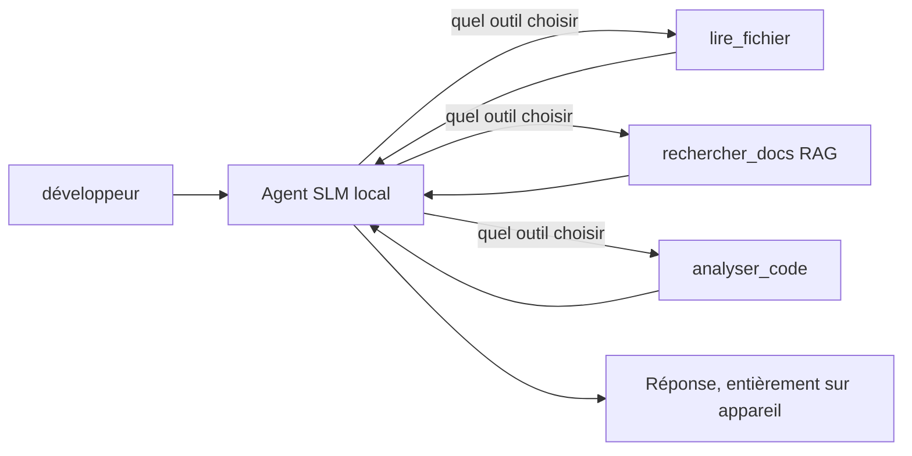
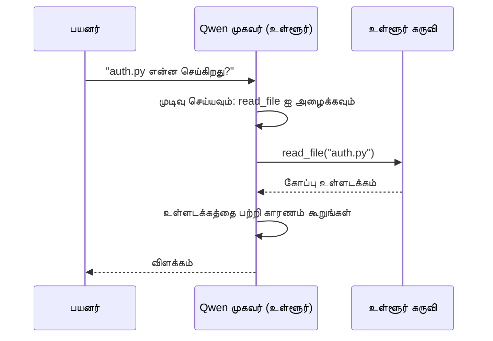
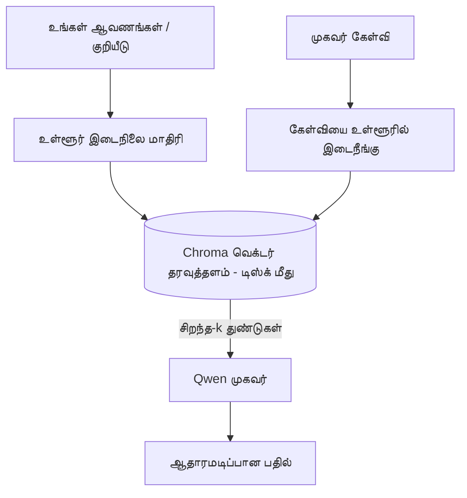
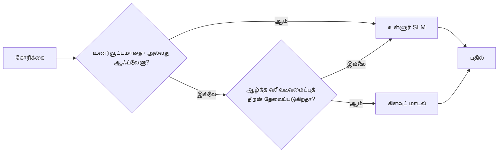

# Microsoft Foundry Local மற்றும் Qwen பயன்படுத்தி உள்ளூரான AI முகவர்களை உருவாக்குதல்


முந்தைய பாடம் முகவர்களை மேகத்துக்கு *மேல்* செருக்கியது. இது அவற்றை ஒரே இயந்திரத்தில் *கீழுக்கு* கொண்டுவருகிறது. முடிவில், நீங்கள் ஒரு இயங்கும் பொறியியல் உதவியாளரை உருவாக்குவீர்கள், அது காரணிப்பது, கருவிகளை அழைக்கும், உங்கள் கோப்புகளை வாசிக்கும், உங்கள் ஆவணங்களை தேடும் — **ஒரு கூடுதல் மேகத் தேர்வு அழைப்பும் இல்லாமல்.**

அதற்கு ஏன் விரும்ப வேண்டும்? சாதாரண பொறியியல் பணியில் அடிக்கடி வரும் மூன்று காரணிகள்:

- **தனியுரிமை.** குறியீடு மற்றும் ஆவணங்கள் இயந்திரத்தை இழக்காது. எந்த துருத்தல், எந்த துணுக்குப்பிரிவு, எந்த வாடிக்கையாளர் தரவுகளும் வலைப்பின்னல் வரம்பை கடக்காது.
- **செலவு.** உள்ளூர் தேர்வு ஒவ்வொரு குறியீட்டு கட்டணமும் இல்லாமல் நடைபெறுகிறது. மின்சார செலவில் தினமும் மீண்டும் முயற்சிக்கலாம்.
- **ஆஃப்லைன்.** விமானத்தில், ஒரு பாதுகாப்பான நிலையத்தில், அல்லது ஒரு இடையீட்டின் போது, முகவர் இன்னும் வேலை செய்கிறது.

முக்கியமானது நீங்கள் ஒரு முன்நிலை மேக மாதிரியை உங்கள் CPU, GPU, அல்லது NPU மீது இயங்கும் **சிறிய மொழி மாதிரி (SLM)** உடன் பரிமாறுகிறீர்கள். இந்த பாடம் அந்த கட்டுப்பாட்டின் கீழ் *நன்றாக* செயல்படும் முகவர்களை உருவாக்குவது பற்றி தான், கட்டுப்பாடு இல்லாதபடி நுணுக்கமாக நடிக்கவில்லை.

## அறிமுகம்

இந்த பாடத்தில் பார்க்கப்படும் விஷயங்கள்:

- **சிறிய மொழி மாதிரிகள் (SLMs)** — அவை என்ன, எங்கு சிறந்தவை, எங்கு இல்லை என்பதில்.
- **Microsoft Foundry Local** — ஒரு உரையாடல் நேரத்தில் மாதிரிகளை உங்கள் சாதனத்தில் பதிவிறக்கம் செய்து வழங்கும் **OpenAI-க்கு உகந்த API** கொண்ட ஓர் இயக்கம்.
- **Qwen செயல்பாட்டு அழைக்கும் மாதிரிகள்** — நம்பகத்தன்மையுள்ள கருவி அழைப்புகளை வழங்கும் SLMகள், இது உள்ளூர் *முகவர்களை* (பொதுவாக உள்ளூர் குறுஞ்செய்தியாக இல்லை) சாத்தியமாக்குகிறது.
- **உள்ளூர் கருவிகள், உள்ளூர் RAG, மற்றும் உள்ளூர் MCP** — மேகத்தின்றி முகவருக்கு திறனளிக்கிறது.
- **எலும்புக் கலவைக் கொள்கைகள்** — எப்போது உள்ளூரில் வைத்திருக்க வேண்டும் மற்றும் எப்போது மேகத்தை அணுக வேண்டும்.

## கற்றல் இலக்குகள்

இந்த பாடத்தை முடித்தவுடன், நீங்கள் தெரிந்துகொள்ள இருப்பது:

- SLMகளின் பரிமாற்றங்களை விளக்கவும் மற்றும் பொருத்தமான உள்ளூர்முகவர் பயன்பாடுகளை தேர்ந்தெடுக்கவும்.
- Foundry Local மூலம் உள்ளூராக Qwen மாதிரியை வழங்கவும் மற்றும் அதில் OpenAI-க்கு உகந்த முடக்கத்தை வழியாக இணைக்கவும்.
- உங்கள் வேலைப்பாய்ச்சியில் முழுமையாக இயங்கும் கருவி அழைக்கும் முகவரைக் கட்டமைக்கவும்.
- உள்ளூர் வெக்டர் தரவுத்தளத்தை (Chroma) பயன்படுத்தி உங்கள் சொந்த ஆவணங்களில் உள்ளூர் RAGஐச் சேர்க்கவும்.
- முகவரை உள்ளூர் MCP சேவையகத்துக்கு இணைக்கவும் மற்றும் கலவைக் உள்ளூர்/மேக வடிவமைப்புகளை அறிந்துகொள்ளவும்.

## தேவையான முன்னிலை

இந்த பாடம் நீங்கள் முந்தைய பாடங்களை முடித்திருப்பதாகவும் பின்வரும் விஷயங்களில் திறமைமிக்கதாகவும் கருதுகிறது:

- [கருவி பயன்பாடு](../04-tool-use/README.md) (பாடம் 4) மற்றும் [Agentic RAG](../05-agentic-rag/README.md) (பாடம் 5) கள்.
- [Agentic Protocols / MCP](../11-agentic-protocols/README.md) (பாடம் 11).
- [Microsoft Agent Framework](../14-microsoft-agent-framework/README.md) (பாடம் 14).

கூடுதலாக, உங்களுக்கு தேவையானவை:

- ஒரு டெவலப்பர் வேலைத் தளம். **8 GB RAM என்பது ஒரு உண்மையான குறைந்தபட்சம்**; 16 GB+ வசதியாக இருக்கும். GPU அல்லது NPU உதவியாக இருக்கும் ஆனால் அவசியம் இல்லை.
- **Microsoft Foundry Local** நிறுவல் (உங்கள் OSக்கான நிறுவல் பகுதிக்குச் கீழே பார்க்கவும்).
- Python 3.12+ மற்றும் கையேடில் உள்ள தொகுப்புகள் [`requirements.txt`](../../../requirements.txt), மற்றும் இந்த பாடத்திற்கான `foundry-local-sdk`, `openai`, மற்றும் `chromadb`.

## சிறிய மொழி மாதிரிகள்: உள்ளூர் பணிக்கான சரியான கருவி

ஒரு முன்நிலை மேக மாதிரிக்கு நூற்றுக்கணக்கான பில்லியன் அளவிலான அளவுகோல்கள் மற்றும் ஒரு தரவை பூட்டை உள்ளது. ஒரு SLM பல பில்லியன் அளவுகோல்கள் கொண்டது மற்றும் உங்கள் லேப்டாப் RAMவில் பொருந்த வேண்டும். அந்த வேறுபாடு தெளிவான எதிர்பார்ப்புகளை அமைக்கிறது.

**SLMகள் சிறந்தவை:**

- கட்டமைக்கப்பட்ட, வரம்பு உடைய பணிகள் — வகைப்பாடு, தேடல், ஏற்கனவே இருக்கும் ஆவணத்தின் சுருக்கம்.
- **கருவி அழைப்பு** — எந்த செயல்பாட்டை எப்போது எந்த அளவுகோல்களுடன் அழைக்க வேண்டும் என்று தீர்மானிப்பு.
- உங்கள் சொந்த தரவிலும் விரைவான, மலிவான, தனிப்பட்ட மறுபரிசோதனை.

**SLMகள் சற்றே பலவீனமானவை:**

- திறந்த முடிவில்லாத, நீண்ட ஆழமான காரணிப்பு பெரிய சூழலில்.
- பரவலான உலகத் தகவல்கள் (அவை குறைவாக கண்டு, அதிகம் மறக்கும்).

உள்ளூர் முகவர்களின் வெற்றி மூலமாகும் யுத்தம்: **SLM ஆவல் முன்னிலை இயக்கி ஆகட்டும், கருவிகள் கடுமையான பாரத்தை தூக்கட்டும்.** மாதிரிக்கு உங்கள் குறியீட்டை *அறிய* தேவையில்லை — அது `read_file` மற்றும் `search_docs` அழைக்க வேண்டும் என்றால் போதும். இது SLM இன் வலிமைகளுக்கு நேரடி மேலாண்மை.



## Microsoft Foundry Local

**Microsoft Foundry Local** என்பது ஒரு எளிய இயக்கம், அது மாதிரிகளை முழுமையாக உங்கள் இயந்திரத்தில் பதிவிறக்கம் செய்து, நிர்வகித்து, வழங்குகிறது. எங்களுக்கு முக்கியமான அம்சம் அது **OpenAI-ஐப்போன்ற ஒரு HTTP முடக்கத்தை** வெளிப்படுத்துகிறது — இதனால் OpenAI SDK மற்றும் Microsoft Agent Framework-இன் OpenAI கிளையன்ட், `base_url` மட்டும் மாற்றுவதன் மூலம் அதனை எதிர்கொள்கிறது. முகவர்களை உருவாக்கி கற்றுக்கொண்ட விளக்கம் முழுவதும் நேரடியாக பரிமாற்றப்படுகிறது; முடக்கம் மேகத்திலிருந்து `localhost`க்கு மாறுகிறது.

Foundry Local உங்கள் அகப்பகுதிக்குச் சிறந்த மாதிரி கட்டுமானத்தை தானாக தேர்ந்தெடுக்கிறது — CPU கட்டுமானம், CUDA/GPU கட்டுமானம் அல்லது NPU கட்டுமானம் — இயந்திரம் ஒன்றுக்கு-ஒன்று கைமுறையாக மேம்படுத்தத் தேவையில்லை.

### அமைப்பு

Foundry Local ஐ நிறுவுங்கள் ([ஆவணங்கள்](https://learn.microsoft.com/azure/ai-foundry/foundry-local/) உங்கள் OSக்கானவை), பிறகு அது செயல்படுவதை உறுதிசெய்யுங்கள்:

```bash
# நிறுவுக (உதாரணமாக; உங்கள் தளத்திற்கான ஆவணங்களை பின்பற்றவும்)
winget install Microsoft.FoundryLocal      # விண்டோஸ்
# brew install microsoft/foundrylocal/foundrylocal   # மெக்OS

# Qwen மாதிரியை பதிவிறக்கம் செய்து இயக்கவும், பின்னர் உள்ளூர் சேவையை துவங்கவும்
foundry model run qwen2.5-7b-instruct
foundry service status
```

சேவை இயங்க ஆரம்பித்தவுடன் நீங்கள் உள்ளூரில் OpenAI-க்கு இணக்கமான முடக்கத்தை பெற்றுள்ளீர்கள் (சாதாரணமாக `http://localhost:PORT/v1`). நோட்புக் `foundry-local-sdk` ஐ பயன்படுத்தி முடக்கத்தை தானாக கண்டுபிடிக்கும், அதனால் நீங்கள் போர்ட்டை கடுமையாக குறியிட வேண்டியதில்லை.

## Qwen செயல்பாட்டு அழைப்பு: ஏன் முக்கியம்

ஒரு முகவர் ஆக இருக்க, அது கருவிகளை அழைக்க முடிந்தால் தான். பல SLMகள் உரையாட முடியும் ஆனால் நம்பகமற்ற, பிழையான கருவி அழைப்புகளை வழங்குகின்றன. **Qwen** மாதிரிகள் செயல்பாட்டு அழைப்புக்குப் பயிற்சி பெற்றுள்ளன மற்றும் நன்றாக வடிவமைக்கப்பட்ட கருவி அழைப்புகளைக் தொடர்ந்து வழங்குகின்றன — இது உள்ளூர் உரையாடல் மாதிரியை உள்ளூர் *முகவராக* மாற்றுகிறது.

செயல்முறை நீங்கள் ஏற்கனவே அறிந்த உள்ளமைவு கருவி அழைக்கும் லூப்பே போலதான், ஆனால் சாதனத்தில் இயங்குகிறது:



## உள்ளூர் RAG

ஆவண தேடல் என்பது உள்ளூர் முகவர்கள் தங்கள் நிலையை நிரூபிக்கும் பகுதி. SLM உங்கள் கட்டமைப்பு ஆவணங்களை நினைவில் வைத்திருப்பதாக நம்ப வேண்டாமல், அந்த ஆவணங்களை **உள்ளூரான வெக்டர் தரவுத்தளத்தில்** நுழைத்து முகவருக்கு தேவையின் போது பொருத்தமான துண்டுகளை மீட்டெடுக்க விடுகிறீர்கள்.

நாங்கள் **Chroma**ஐ பயன்படுத்துகிறோம், இது ஒரு உள்வரிசை வெக்டர் சேமிப்பகமாகும், அது சேவையகம் இல்லாமலும் செயன்முறையுடன் இயங்குகிறது. உருவாக்கப்பட்ட துறை முற்றிலும் உள்ளூராக உள்ளது: உள்ளூர் எம்பெட்டிங் மாதிரி → உள்ளூர் வெக்டர்கள் → உள்ளூர் மீட்டெடுப்பு → உள்ளூர் SLM.



இது பாடம் 5இல் உள்ள அகடெரிக் RAG மாதிரியாகுத, வேறுநிலை என்னவென்றால் எல்லா கூறுகளும் உங்கள் இயந்திரத்தில் இயங்குகின்றன.

## உள்ளூர் MCP சேவையகங்கள்

[MCP](../11-agentic-protocols/README.md) என்பது ஒரு போக்குவரத்து முறையே, மேக சேவை அல்ல. ஒரு MCP சேவையகம் `stdio`வில் உள்ளூர்முறை செயல்படக்கூடியது, வழக்கு முறையில் கருவிகளை உங்கள் முகவருக்கு வழங்குகிறது. இது MCP சேவையகங்களின் விரிவடையும் சுற்றுப்புறத்தை மீண்டும் பயன்படுத்த உதவுகிறது — கோப்புறை அணுகல், git செயலாக்கங்கள், தரவுத்தள கேள்விகள் — முழுமையாக ஆஃப்லைனில்.

பாதுகாப்பு நிலை மேகத்திலிருந்து மாறுபாட்டுடன் இருக்கிறது, இணையம் கிடைக்காதபோதும் உள்ளூர் MCP சேவையகம் உங்கள் பயனர் அனுமதிகளுடன் இயங்கும், அதனால் அது தொடர்பு கொள்ளக்கூடியதை நிரந்தரமாக நிர்ணயிக்கவும் (ஒரு திட்ட கோப்புறை மட்டும், உங்கள் முழு வீட்டுத் தொகுதியை அல்ல) மற்றும் அதன் வெளியீடுகளை சரிபார்க்க உள்ளீடுகளாக நடத்தவும்.

## கலவையான மேகம்-உள்ளூர் வடிவமைப்புகள்

உள்ளூர் முதலில் என்பது உள்ளூர் மட்டும் என்று அர்த்தமில்லை. பரிபக்கவுடனான அமைப்புகள் உணர்வு மற்றும் கடினத்தன்மையால் வழிமாற்றம் செய்கின்றன:

| சூழல் | எங்கு இயங்கும் |
| --- | --- |
| உணர்வூட்டும் குறியீடு/தரவு, அல்லது ஆஃப்லைன் | **உள்ளூர் SLM** |
| எளிய, வரம்பு உடைய பணி | **உள்ளூர் SLM** (சலுகை, விரைவு) |
| கடினமான பல-தாவல் காரணிப்பு உணர்வில்லாத தரவு மீது | **மேக மாதிரி** |
| அனைத்தும், இடையீட்டு வேளையில் | **உள்ளூர் SLM** (மிகவும் நெகிழ்வான குறைவு) |

இது பாடம் 16லுள்ள **மாதிரி வழிமாற்றம்** கருத்தை பிரதிபலிக்கிறது — ஒரு "மாதிரி" இப்போது உங்கள் சொந்த இயந்திரம். உறுதியாக வடிவமைப்பு மேகம் கிடைக்காத போது உள்ளூரை திரும்பக் கொண்டுவருகிறது, அதனால் முகவர் முழுமையாக தோல்வி அடைவதற்கு பதிலை தரத்தை குறைக்கும்.



## கைநடை பயிற்சி: ஒரு உள்ளூர் பொறியியல் உதவியாளர்

[`code_samples/17-local-agent-foundry-local.ipynb`](./code_samples/17-local-agent-foundry-local.ipynb) ஐ திறக்கவும் மற்றும் அதில் பயிற்சி எடுங்கள். நீங்கள் உருவாக்கும் **உள்ளூர் பொறியியல் உதவியாளர்** உங்கள் வேலைத்தளத்தில் முழுமையாக இயங்கும் மற்றும் செய்ய முடியும்:

1. **கருவிகளை அழைக்கும்** — Foundry Local மூலம் Qwen செயல்பாட்டை அழைத்து.
2. **உள்ளூர் கோப்பு செயல்பாடுகளை செய்ய** — திட்ட கோப்புறையில் கோப்புகளை பட்டியலிட மற்றும் வாசிக்க.
3. **குறியீட்டைக் கவனிக்க** — ஒரு மூல கோப்பில் அடிப்படை அளவுகோல்களை அறிக்கை செய்ய.
4. **ஆவணத்தைக் தேடு** — Chroma உடன் ஆவணக் கோப்புறையில் உள்ளூர் RAG.
5. **MCP ஐப் பயன்படுத்து** — உள்ளூர் MCP சேவையகத்துடன் இணைத்து (ஒருவிதமாக எந்த சேவை இருக்காவிட்டாலும் துரித வீழ்ச்சி).

எந்த ஒரு புள்ளியிலும் மேகத் தேர்வு பயன்படுத்தப்படவில்லை.

### நடைமுறை விளக்கம்

உதவியாளர் OpenAI-க்கு உகந்த முடக்கத்தைக் கொண்டு Foundry Localக்கு இணைகிறது, ஆகையால் முகவர் குறியீடு மேக பாடங்களுடன் மிகவும் ஒத்ததாக இருப்பது — வாடிக்கையாளர் மட்டும் மாற்றம்:

```python
from foundry_local import FoundryLocalManager
from openai import OpenAI

# Foundry Local மாதிரியை கண்டுபிடித்து பதிவிறக்கம் செய்கிறது மற்றும் எங்களுக்கு உள்ளூர் இரண்டு முடிவை வழங்குகிறது.
manager = FoundryLocalManager(\"qwen2.5-7b-instruct\")
client = OpenAI(base_url=manager.endpoint, api_key=manager.api_key)  # api_key என்பது உள்ளூர் இடமாற்றி ஆகும்
```

கருவிகள் ஒரு திட்ட கோப்புறைக்கு வரம்பு உள்ள வழக்கு Python செயல்பாடுகள்:

```python
def read_file(path: str) -> str:
    \"\"\"Read a file, but only inside the sandboxed project directory.\"\"\"
    full = (PROJECT_ROOT / path).resolve()
    if PROJECT_ROOT not in full.parents and full != PROJECT_ROOT:
        return \"Access denied: path is outside the project directory.\"
    return full.read_text(encoding=\"utf-8\")
```

சந்திப்பு சரிபார்ப்பு கவனிக்கவும் — உள்ளூரிலும், ஏதேனும் பாதை வாசிக்கும் கருவி ஒரு பொறுப்பு. நோட்புக் ஒவ்வொரு கருவியும் ஒரே திட்ட ரூட் மட்டுமே அணுகும் வகையில் வைத்திருக்கிறது.

## அறிவு சோதனை

பணி திறம்பட செய்யும் முன் உங்கள் புரிதலைச் சோதியுங்கள்.

**1. ஒரு முகவரைப் பூமிக்கு பதிலாக உள்ளூரில் இயக்க இரண்டு ந Cupid முறை காரணங்களை வழங்கவும்.**

<details>
<summary>பதில்</summary>

எந்த இரண்டு காரணிகளும்: **தனியுரிமை** (குறியீடு மற்றும் தரவு இயந்திரத்தை விட்டு வெளியே செல்லாது), **செலவு** (ஒவ்வொரு குறியீட்டுக்கும் தேர்வு கட்டணம் இல்லை), மற்றும் **ஆஃப்லைன் திறன்** (வலை இல்லாமல் வேலை செய்கிறது — விமானத்தில், பாதுகாப்பான கட்டிடத்தில், அல்லது இடையீட்டின் போது). தரவுகளைக் கருவியில் இருந்து அனுப்புவதைக் தடுக்கும் ஒழுங்குரிமை/கட்டுப்பாட்டு விதிகள் தனியுரிமைக்கு அங்கீகாரம் அளிக்கும்.
</details>

**2. உள்ளூர் முகவரில் SLM மற்றும் அதன் கருவிகளுக்கிடையேயான பரிந்துரைக்கப்படும் வேலைப் பகிர்வு என்ன, ஏன்?**

<details>
<summary>பதில்</summary>

SLM **ஆர்கஸ்ட்ரேட் செய்யட்டும்** (எந்த கருவி கழைக்கப்பட வேண்டும், எந்த அளவுகோல்களுடன் என்பதை தீர்மானி) மற்றும் **கருவிகள் கடுமையான பணிகளை செய்யட்டும்** (கோப்புகளை வாசித்தல், ஆவணங்களை மீட்டெடுத்தல், கணக்கீடுகளை செய்யுதல்). SLMகள் கருவி தேர்வில் வலுவானவை, ஆனால் பரவலான அறிவில் மற்றும் நீண்ட காரணிப்பில் பலவீனமானவை, ஆகையால் கருவிகளை பயன்படுத்துதல் அவற்றின் வலிமைகளை ஊக்குவிக்கும்.
</details>

**3. Foundry Local உடன் மேக முகவர் குறியீட்டை மீண்டும் பயன்படுத்துவது எப்படி சாத்தியமாய் வருகிறது?**

<details>
<summary>பதில்</summary>

Foundry Local একটি **OpenAI-க்கு உகந்த HTTP முடக்கம்** வெளிப்படுத்துகிறது. OpenAI SDK மற்றும் Agent Frameworkஇன் OpenAI கிளையன்ட் `base_url` (மற்றும் உள்ளூர் நுழைவுத்தாவல் API விசையை) மாற்றுவதன் மூலம் அதற்க்கு எதிர்கொள்கிறது. முகவர் குறியீட்டின் மற்ற எல்லா அம்சங்களும் மாறாது.
</details>

**4. ஏன் நாம் குறிப்பாக Qwen செயல்பாட்டு அழைக்கும் மாதிரியை மட்டுமே பயன்படுத்துகிறோம், ஏன் எந்த SLMயும் அல்ல?**

<details>
<summary>பதில்</summary>

ஏனெனில் முகவர் நம்பகமான, நன்கு வடிவமைக்கப்பட்ட **கருவி அழைப்புகளை** உருவாக்க வேண்டும். பல SLMகள் உரையாடலாம், ஆனால் தவறான அல்லது ஒற்றுமையற்ற கருவி அழைப்புகளை வழங்குகின்றன. Qwen மாதிரிகள் செயல்பாட்டு அழைப்புக்கு பயிற்சி பெற்றவை மற்றும் தொடர்ச்சியான கருவி அழைப்புகளை உருவாக்குகின்றன, இது உள்ளூர் உரையாடல் மாதிரியை செயல்படும் உள்ளூர் முகவராக மாற்றுகிறது.
</details>

**5. உள்ளூர் RAG குழாயில், எந்த கூறுகள் இயந்திரத்தில் இயங்குகின்றன?**

<details>
<summary>பதில்</summary>

அனைத்தும்: எம்பெட்டிங் மாதிரி, வெக்டர் தரவுத்தளம் (Chroma, வட்டு), மீட்டெடுப்பு கட்டம் மற்றும் SLM. ஆவணங்கள் உள்ளூராக உருவாக்கப்படுகின்றன, உள்ளூராக சேமிக்கப்படுகின்றன, உள்ளூராக மீட்டெடுக்கப்படுகின்றன, மற்றும் உள்ளூர் மாதிரியால் பகுப்பாய்வு செய்யப்படுகின்றன — ஒரு கூறும் மேகத்தைச் சுவைபாக்காது.
</details>

**6. ஒரு உள்ளூர் MCP சேவையகம் உங்கள் இயந்திரத்தில் இயங்குகிறது. அது தானாகவே பாதுகாப்பானதா? நீங்கள் எது முன்னறிவுற வேண்டும்?**

<details>
<summary>பதில்</summary>

இல்லை. ஒரு உள்ளூர் MCP சேவையகம் உங்கள் பயனர் உரிமைகளுடன் இயங்கும், எனவே அது நீங்கள் அணுகக்கூடியதை அணுகும். அதில் தேவையானவை மட்டுமே (ஒரு திட்ட கோப்புறை மட்டும், உங்கள் முழு வீட்டுத் தொகுதியோடு değil) அணுக முதலீடு செய்யவும், அதன்பிறகு அதன் வெளியீடுகளை சரிபார்த்து செயல்படுத்தவும்.
</details>

**7. ஒரு உள்ளூர் மாதிரி அடங்கிய சிந்தனையான கலவையான வழிமாற்றக் கட்டளை விவரிக்கவும்.**

<details>
<summary>பதில்</summary>

உணர்வு அல்லது ஆஃப்லைன் கோரிக்கைகளை உள்ளூர் SLMக்கு வழிமாற்றவும்; எளிய வரம்பு பணிகளை வேகத்திற்கும் செலவிற்கு உள்ளூர் SLMக்கு அனுப்பவும்; கடினமான பல-தாவல் காரணிப்பை உணர்வில்லாத தரவிற்கு மேக மாதிரிக்கு அனுப்பவும்; மேகம் கிடைக்காதபோது உள்ளூர் SLMக்கு திரும்பவும், ஆகையால் முகவர் குறைந்த தரத்தில் இருந்து தோல்வி அடைவதில்லை. இது பாடம் 16லுள்ள மாதிரி வழிமாற்றம், உள்ளூர் இயந்திரம் அவற்றுள் ஒன்று.
</details>

**8. இந்த பாடத்தில் உள்ளூர் முகவருக்கு இயக்கத் தேவையான உண்மையான குறைந்தபட்ச RAM அளவு என்ன மற்றும் அதிக RAM என்ன அளிக்கின்றது?**

<details>
<summary>பதில்</summary>

சுமார் **8 GB** என்பது உண்மையான குறைந்தபட்சம்; 16 GB+ வசதியாக இருக்கும். அதிக RAM பெரிய, திறமையான மாதிரிகளை இயக்கவும் நினைவில் கூடுதல் சூழலை வைக்கவும் உதவுகிறது. GPU அல்லது NPU தேர்வு வேகத்தை மேம்படுத்துகிறது ஆனால் தேவையில்லை — Foundry Local எடுப்பை இல்லாதபோது CPU கட்டுமானத்தினைத் தேர்ந்தெடுக்கிறது.
</details>

## பணிக்கூறு

உள்ளூர் பொறியியல் உதவியாளரை ஒரு சிறிய திட்டத்திற்கான **உள்ளூர் ஆவண மதிப்பாய்வாளராக** நீட்டிக்கவும் (நீ விரும்பினால் இந்த கோப்பக முதற்பங்கள் ஒன்றை பயன்படுத்தலாம்).

உங்கள் சமர்ப்பிப்பு கீழ்காணுமாறு அமைய வேண்டும்:

1. உண்மையான ஆவணங்கள்/குறியீட்டு கோப்புறையைக் Chroma-வில் குறியீடு செய்யவும் (குறைந்தது ஐந்து கோப்புகள்).
2. திட்டத்தை `TODO` / `FIXME` கருத்துக்களுக்காகத் தேடும் `find_todos` கருவியைச் சேர்க்கவும் மற்றும் அவற்றை கோப்பு மற்றும் வரிசை எண் உடன் திரும்ப வழங்கவும் — `read_file` போலவே அதே சந்திப்புக் கட்டுப்பாட்டை வைத்திருக்கவும்.

3. **ஏஜெண்டிடம் மூன்று கேள்விகளை கேளுங்கள்** அவை கருவிகளை கலந்து பயன்படுத்தவைக்கும்: ஒன்று தற்செயல் RAG கேள்வி, ஒன்று குறிப்பிட்ட கோப்பை வாசிக்க வேண்டிய கேள்வி, மற்றும் ஒன்று TODOகளை கண்டுபிடிக்க வேண்டிய கேள்வி.
4. **அதனை அளவிடுங்கள்**: மூன்று பதில்களையும் நேரம் அளக்கவும் மற்றும் அவற்றை ஒரு மார்க்டவுன செலிலில் குறிப்பிடவும். உங்கள் திட்டமிடப்பட்ட வேலைநடவடிக்கைக்கு இந்த தாமதம் ஏற்றதாக உள்ளதா என்பதை பகிரவும்.

பின்னர், இந்த மதிப்பாய்வாளருக்காக **எதை கிளவுட்டுக்கு மாற்றுவீர்கள் மற்றும் எதை உள்ளூரில் வைத்திருப்பீர்கள்** என்பதைக் குறித்த ஒரு சிறிய வரைபடத்தை எழுதவும், மற்றும் ஏன் என்பதை விளக்கவும். உள்ளூரில் உள்ள கூறுகள் சரியாக இணைக்கப்பட்டுள்ளதா மற்றும் உங்கள் கலவை அறிவு நியாயம் தகுதியானதா என்றதைக் கொண்டு மதிப்பிடப்படுகிறீர்கள் — மாதிரி தரம் கருத்தில் கொள்ளப்படாது.

## சுருக்கம்

இந்த பாடத்தில் நீங்கள் முற்றிலும் உங்கள் சொந்த இயந்திரத்தில் இயங்கும் ஒரு ஏஜெண்ட்டை கட்டியுள்ளீர்கள்:

- **SLMs** தனியுரிமை, செலவு மற்றும் ஆஃப்லைன் இயங்கலை முன்னிலையில் வியாபாரத்தை குறைத்துக் கொண்டு — மற்றும் **கருவிகளை ஒருங்கினைப்பதில்** சிறந்தவை, தன்னுடைய அறிவை எல்லாம் கட்டிக்கொள்ளாமல்.
- **Foundry Local** **OpenAI-ஐப்போல் இணைப்பு** கொண்ட இடத்தில் மாதிரிகள் சாதனத்தில் சேவை செய்கின்றன, ஆகவே உங்கள் கிளவுட் ஏஜெண்ட் குறியீடு ஒரு வரி மாற்றத்துடன் மாற்றப்படுகிறது.
- **Qwen செயல்பாட்ட அழைப்புச் செய்யும் மாதிரிகள்** நம்பகமான உள்ளூரான கருவி அழைப்பை செய்யக்கூடியவை — எனவே உள்ளூரான *ஏஜெண்ட்களையும்*.
- **உள்ளூரான RAG** (Chroma) மற்றும் **உள்ளூரான MCP** இயந்திரத்தை விட்டு விலகாமல் ஏஜெண்ட்டுக்கு திறனளிக்கின்றன.
- **கலவை மாதிரிகள்** மிகவும் நுணுக்கவியல் மற்றும் சிக்கலுக்கு ஏற்ப வழிகாட்டுகின்றன, உள்ளூரானவை ஒரு அழகான தள்ளுபடியான விருப்பமாக இருக்கின்றன.

இது பரிமாற்ற சூழலை முடிக்கிறது: பாடம் 16 ஏஜெண்ட்களை மைக்ரோசாஃப்ட் Foundryக்கு உயர்த்தியது, இந்த பாடம் அவற்றை ஒரு ஒரே கணினியில் குறைத்தது. அடுத்த பாடம் பரிமாறப்பட்ட ஏஜெண்ட்களை பாதுகாப்பாக வைத்திருப்பதற்கு மாறும்.

## கூடுதல் வளங்கள்

- <a href="https://learn.microsoft.com/azure/ai-foundry/foundry-local/" target="_blank">Microsoft Foundry Local ஆவணம்</a>
- <a href="https://learn.microsoft.com/azure/ai-foundry/what-is-azure-ai-foundry" target="_blank">Microsoft Foundry ஆவணம்</a>
- <a href="https://learn.microsoft.com/en-us/agent-framework/overview/?wt.mc_id=youtube_26688_organicsocial_reactor&pivots=programming-language-python" target="_blank">Microsoft Agent Framework</a>
- <a href="https://qwen.readthedocs.io/en/latest/framework/function_call.html" target="_blank">Qwen செயல்பாட்டு அழைப்புக் குறிப்பு</a>
- <a href="https://modelcontextprotocol.io/" target="_blank">Model Context Protocol (MCP)</a>
- <a href="https://docs.trychroma.com/" target="_blank">Chroma வெக்டார் தரவுத்தளம்</a>

## முந்தைய பாடம்

[Deploying Scalable Agents](../16-deploying-scalable-agents/README.md)

## அடுத்த பாடம்

[Securing AI Agents](../18-securing-ai-agents/README.md)

---

<!-- CO-OP TRANSLATOR DISCLAIMER START -->
**மறுப்பு**:
இந்த ஆவணம் AI மொழிபெயர்ப்பு சேவை [Co-op Translator](https://github.com/Azure/co-op-translator) பயன்படுத்தி மொழிபெயர்க்கப்பட்டுள்ளது. நாங்கள் துல்லியத்திற்காக முயற்சி செய்துள்ளோம், ஆனால் தானாக செய்யப்படும் மொழிபெயர்ப்புகளில் பிழைகள் அல்லது தவறுகள் இருக்கலாம் என்பதை கவனத்தில் கொள்ளவும். அசல் ஆவணம் அதன் தாய்மொழியில் அதிகாரப்பூர்வ ஆதாரமாக கருதப்பட வேண்டும். முக்கியமான தகவல்களுக்கு, தொழில்நுட்பமான மனித மொழிபெயர்ப்பு பரிந்துரைக்கப்படுகிறது. இந்த மொழிபெயர்ப்பைப் பயன்படுத்துவதால் ஏற்படும் எந்த தவறான புரிதல்கள் அல்லது தவறான விளக்கத்திற்கும் நாங்கள் பொறுப்பில்வில்லை.
<!-- CO-OP TRANSLATOR DISCLAIMER END -->