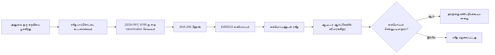
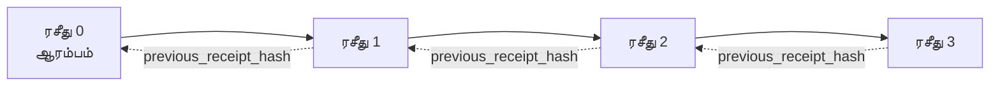

[பாடத்திட்ட வீடியோவை பாருங்கள்: கிரிப்டோகிராபிக் ரசீத்களுடன் AI முகவர்களை பாதுகாப்பது](https://youtu.be/PLACEHOLDER_VIDEO_ID)

> _(பாட வீடியோ மற்றும் சிறுபடம் மைக்ரோசாப்ட் உள்ளடக்கம் குழுவால் ஒன்றிணைக்கும் பிறகு, பாடம் 14 / 15 முறையை பின்பற்றிக் கூடியதாக சேர்க்கப்படும்.)_

# கிரிப்டோகிராபிக் ரசீத்களுடன் AI முகவர்களை பாதுகாப்பது

## அறிமுகம்

இந்த பாடத்தில் கையாளப்பட உள்ளது:

- ஒழுங்குமுறை, பிழை திருத்தம் மற்றும் நம்பிக்கைக்கான AI முகவர் கண்காணிப்பு தடங்கள் ஏன் முக்கியம்.
- ஒரு கிரிப்டோகிராபிக் ரசீதா என்ன மற்றும் அது கையெழுத்திடாத பதிவு வரிசை எவ்வாறு வேறுபடுகிறது.
- முகவரின் கருவி அழைப்புக்கு வெள்ளைப் பைதானில் கையெழுத்திடப்பட்ட ரசீதை உருவாக்குவது எப்படி.
- ரசீதை ஆஃப்லைனிட் சரிபார்க்கவும் மற்றும் மோசடிக்கான கண்டறிதலை செய்வது எப்படி.
- ஒரு ரசீதின் தொடர் முறைகளை தொடர்ச்சியாக சேர்ப்பது, ஒன்றை அகற்றல் அல்லது மறுஅமைத்தல் தொடர்பை உடைக்கும்.
- ரசீத்கள் என்ன நிரூபிக்கின்றன மற்றும் தெளிவாக என்ன நிரூபிக்கவில்லை.

## கற்றல் இலக்குகள்

இந்த பாடத்தை முடித்தவுடன், நீங்கள் எப்படி:

- முகவரின் செயல்களுக்கான கிரிப்டோகிராபிக் மூலம் உறுதியான தோல்வி முறைகளை அடையாளம் காண்பது.
- ஒரு Ed25519 கையெழுத்திட்ட canonical JSON தரவுக்கு ரசீதையை உருவாக்குதல்.
- கையெழுத்தாளரின் பொது விசையை மட்டும் பயன்படுத்தி ரசீதையை சுயமாக சரிபார்த்தல்.
- மாற்றம் செய்யப்பட்ட ரசீதத்தில் சரிபார்ப்பை மீண்டும் ஓட்டுவதன் மூலம் மோசடி கண்டறிதல்.
- ரசீத்களின் ஹாஷ் தொடர்ச்சியான தொடர் கட்டமைப்பை உருவாக்கி, அதற்கான காரணத்தை விளக்கும்.
- ரசீத்கள் நிரூபிக்கும் மூல வரம்புகள் (அடையாளம், முழுமை, வரிசை) மற்றும் நிரூபிக்காதவை (செயலின் துல்லியம், கொள்கையின் துல்லியம்) இடையே எல்லையை அறிதல்.

## சிக்கல்: உங்கள் முகவரின் கண்காணிப்பு தடம்

நீங்கள் Contoso Travel க்கு ஒரு AI முகவரைக் கோட்டுவிட்டீர்கள் என்று கற்பனை செய்யவும். முகவர் வாடிக்கையாளர் கோரிக்கைகளை வாசித்து, விமான APIகளை அழைத்து விருப்பங்களை பார்ப்பதற்கும், வாடிக்கையாளரின் சார்பாக இருக்கைகளை பதிவு செய்வதற்கும் பயன்படுகிறது. கடந்த கால நாற்பது ஆயிரம் பதிவு செய்யப்பட்டன.

இன்று ஒரு கண்காணிப்பாளர் வருகிறார். அவர் ஒரு எளிய கேள்வி கேட்கிறார்: "உங்கள் முகவர் என்ன செய்தார் என்பதைக் காண்பியுங்கள்."

நீங்கள் உங்கள் பதிவு கோப்புகளை ஒப்படைக்கிறார். கண்காணிப்பாளர் அவற்றை பார்த்து கடினமான கேள்வி கேட்டார்: "இந்த பதிவுகள் திருத்தப்படவில்லை என்பதை எப்படி அறிகிறேன்?"

இது கண்காணிப்பு தடம் சிக்கல். இன்று பெரும்பாலான முகவர் செயலாக்கங்கள் அமையும்:

- **பயன்பாட்டுக் குறிப்புகள்**: முகவரால் எழுதப்படுபவை, கோப்பு முறைமை அணுகல் கொண்டவர்கள் எவரும் திருத்தக்கூடியவை.
- **மேகம் பதிவேட்டுச் சேவைகள்**: தள மட்டத்தில் மோசடி கண்டறியும் ஆனால் கண்காணிப்பாளர் தள இயக்குனரை நம்பினால் மட்டுமே.
- **தரவுத்தளம் பரிவர்தனை பதிவுகள்**: தரவுத் தள மாற்றங்களுக்கு உகந்தவையாகவே இருந்தாலும் தற்செயல் கருவி அழைப்புகளுக்கு அல்ல.

இவை ஏதும், கண்காணிப்பாளரின் கேள்விக்கு பதில் அளிக்க அருகுநிலை நம்பிக்கையில்லாமல் இயலாது (நீங்கள், உங்கள் மேகம் வழங்குநர், உங்கள் தரவுத்தள விற்பனையாளர்). உள்ளக பயன்பாட்டிற்கான இதன் நம்பிக்கை பொதுவாக ஏற்றுக்கொள்ளக்கூடியது. ஒழுங்குபடுத்தப்பட்ட பணி (நிதி, சுகாதாரம், ஐரோப்பிய AI சட்டத்திற்குள்ளவை) இதற்கு இல்லை.

கிரிப்டோகிராபிக் ரசீத்கள் இதைத் தீர்க்கின்றன - ஒவ்வொரு முகவர் செயலும் சுயமாக சரிபார்க்க முடியும். கண்காணிப்பாளர் உங்களை நம்ப வேண்டியதில்லை. அவருக்கு உங்கள் பொது விசை மற்றும் ரசீதே போதும்.

## கிரிப்டோகிராபிக் ரசீதா என்றால் என்ன?

ஒரு ரசீதா என்பது முகவர் என்ன செய்ததென பதிவு செய்யும் ஒரு JSON பொருள் ஆகும், டிஜிட்டல் கையெழுத்துடன் கையெழுத்திடப்பட்டது.



குறைந்தபட்ச ரசீதா இவ்வாறு இருக்கும்:

```json
{
  "type": "agent.tool_call.v1",
  "agent_id": "contoso-travel-bot",
  "tool_name": "lookup_flights",
  "tool_args_hash": "sha256:a3f9c1...",
  "result_hash": "sha256:7b2e1d...",
  "policy_id": "contoso-travel-policy-v3",
  "timestamp": "2026-04-25T14:30:00Z",
  "sequence": 47,
  "previous_receipt_hash": "sha256:9d4e6a...",
  "signature": {
    "alg": "EdDSA",
    "sig": "c5af83...",
    "public_key": "8f3b2c..."
  }
}
```

மூன்று பணிகளை செய்கிற பண்புகள்:

1. **கையெழுத்து**. முகவரின் கேட்வே மூலம் Ed25519 தனியார் விசைப்படி ரசீதுக்கு கையெழுத்திடப்படுகிறது. தொடர்புடைய பொது விசையைக் கொண்ட ஒருவர் கையெழுத்தை ஆஃப்லைனில் சரிபார்க்க முடியும். எந்தப் புலத்திலும் மோசடி செய்து கையெழுத்தை செல்லாது செய்வது உள்ளது.

2. **Canonical குறியாக்கம்**. கையெழுத்திடுவதற்கு முன்பு, ரசீதா JSON Canonicalization Scheme (JCS, RFC 8785) பயன்படுத்தி தொடரின் நிரலாக்கமிடப்படுகிறது. இது ஒரே தரவைக் கையாளும் இரண்டு அமல்படுத்தல்கள் பைட்டுகளாக இயல்பான ஒரே வெளியீட்டை ஏற்படுத்துவதை உறுதி செய்கிறது. canonicalization இல்லாமல், வேறுபட்ட JSON உள்வாங்கிகள் ஒரே உள்ளடக்கத்திற்கு வேறுபட்ட கையெழுத்துகளை உருவாக்கும்.

3. **ஹாஷ் தொடர்**. `previous_receipt_hash` புலம் ஒவ்வொரு ரசீதையும் அதற்குப் பின் வரும் ஒன்றுடன் இணைக்கிறது. ஒரு ரசீதையை அகற்றவோ அல்லது மறுஅமைத்தலோ செய்வதால் அதற்குப்பின் வரும் அனைத்து ரசீதுகளின் சிக்கல் உடையும். தனியாக கையெழுத்துக்கள் தவிர்க்கப்பட்டாலும் தொடர் நிலை மோசடி தோன்றும்.

இவை மூன்றும் சேர்ந்து மூன்று உறுதிமொழிகளை வழங்குகின்றன:

- **அடையாளம்**: இந்த விசை இந்த உள்ளடக்கத்தை கையெழுத்திடியது.
- **முழுமை**: உள்ளடக்கம் கையெழுத்திடப்பட்டபின் மாற்றப்படவில்லை.
- **வரிசை**: இந்த ரசீதா அன்றைய ரசீதைக்குப் பின் வந்தது.

## பைத்தானில் ரசீதை உருவாக்குதல்

உங்கள் விருப்பத்துடன், ஒரு குறிப்பாய் நூலகம் தேவை இல்லை. கிரிப்டோகிராபிக் அடிப்படைகள் பொதுவாகக் கிடைக்கின்றன மற்றும் குழாயின் வரிகளின் எண்ணிக்கை குறைவாக உள்ளது.

`code_samples/18-signed-receipts.ipynb` கொண்ட செயல்முறை பயிற்சிகள் முழுமையான நடைமுறையை விளக்குகின்றன. சுருக்கமான பதிப்பு:

```python
import json
import hashlib
import base64
from nacl import signing
from jcs import canonicalize  # RFC 8785 கானானிக்கல் JSON

def b64url_nopad(data: bytes) -> str:
    return base64.urlsafe_b64encode(data).decode("ascii").rstrip("=")

def sha256_canonical(obj) -> str:
    """SHA-256 of a Python object's JCS-canonical JSON form."""
    return f"sha256:{hashlib.sha256(canonicalize(obj)).hexdigest()}"

# ஒரு கையொப்பத் திறவுகோலை உருவாக்கவும் அல்லது ஏற்றவும் (உற்பத்தியில், திறவுகோல் கிடையில் சேமிக்கவும்)
signing_key = signing.SigningKey.generate()
verify_key = signing_key.verify_key

# ரசீது பெய்லோடை கட்டறுக்கவும் (இப்போது கையொப்பு இல்லை)
tool_args = {"origin": "SYD", "destination": "LAX"}
tool_result = [{"flight": "QF11", "price": 1850, "stops": 0}]

payload = {
    "type": "agent.tool_call.v1",
    "agent_id": "contoso-travel-bot",
    "tool_name": "lookup_flights",
    "tool_args_hash": sha256_canonical(tool_args),
    "result_hash": sha256_canonical(tool_result),
    "policy_id": "contoso-travel-policy-v3",
    "timestamp": "2026-04-25T14:30:00Z",
    "sequence": 0,
    "previous_receipt_hash": None,
}

# கானானிகல் செய்யவும், ஹாஷ் செய்யவும், கையொப்பமிடவும்.
canonical_bytes = canonicalize(payload)
message_hash = hashlib.sha256(canonical_bytes).digest()
signature_bytes = signing_key.sign(message_hash).signature

# ஒரு கட்டமைக்கப்பட்ட கையொப்ப பொருளை இணைக்கவும்.
receipt = {
    **payload,
    "signature": {
        "alg": "EdDSA",
        "sig": b64url_nopad(signature_bytes),
        "public_key": b64url_nopad(bytes(verify_key)),
    },
}
```

இது முழுநேர கையெழுத்து குறியீடு. நோட்புக் செயல்முறைகளில் ஒவ்வொரு கட்டத்தையும் பயிற்சியாக ஒருங்கிணைக்கிறது.

## ரசீதையை சரிபார்த்து மோசடிக்கான கண்டறிதல்

சரிபார்ப்பு என்பது மாற்றம் செய்யப்பட்ட செயல்பாடு:

```python
import base64
import hashlib
from nacl import signing
from nacl.exceptions import BadSignatureError
from jcs import canonicalize

def b64url_decode(s: str) -> bytes:
    padding = "=" * ((4 - len(s) % 4) % 4)
    return base64.urlsafe_b64decode(s + padding)

def verify_receipt(receipt: dict) -> bool:
    # கையெழுத்து ஒரு அமைக்கப்பட்ட பொருள்: {"alg", "sig", "public_key"}.
    sig_obj = receipt.get("signature")
    if not sig_obj or sig_obj.get("alg") != "EdDSA":
        return False

    # உண்மையில் கையெழுத்திடப்பட்டayloadஐ மறுசீரமைக்கவும் (கையெழுத்தைதவிர அனைத்து தகவலும்).
    payload = {k: v for k, v in receipt.items() if k != "signature"}

    canonical_bytes = canonicalize(payload)
    message_hash = hashlib.sha256(canonical_bytes).digest()

    try:
        verify_key = signing.VerifyKey(b64url_decode(sig_obj["public_key"]))
        verify_key.verify(message_hash, b64url_decode(sig_obj["sig"]))
        return True
    except BadSignatureError:
        return False
```

இந்த செயல்முறை ஒரு ரசீதையை எடுத்துக் கொண்டு கையெழுத்து செல்லுபடியானதுவா என்றால் `True` வழங்கும், இல்லாவிட்டால் `False`. எந்தவொரு நெட்வொர்க் அழைப்பும், சேவை சார்ந்த தன்மையும் அல்லது மூன்றாம் நபர் நம்பிக்கையும் தேவையில்லை.

மோசடி கண்டறிதலை நோக்கி செயல்படுத்த:

1. செல்லுபடியான ரசீதையை உருவாக்கி சரிபார்ப்பு உறுதிப்படுத்துதல்.
2. `tool_args_hash` புலத்தில் ஒரு பைட்டை மாற்றுதல்.
3. சரிபார்ப்பை மீண்டும் ஓட்டி தோல்வி காணுதல்.

இது பிரயோகரீதமான காணிப்பு, ரசீத்கள் மோசடி தெரியும் என்பதைக் காட்டுகிறது: சிறிய மாற்றமும் கையெழுத்தைக் கெடுக்கிறது.

## பல படி முகவர்களுக்கான ரசீத்களை தொடர் இணைத்தல்

ஒரே கையெழுத்திடப்பட்ட ரசீதா ஒரு செயலைப் பாதுகாக்கின்றது. பல ரசீத்களின் தொடர் தொடர் பாதுகாப்பு வழங்குகிறது.



ஒவ்வொரு ரசீதையும் அதற்குப் பின் வருமான ரசீதாவின் ஹாஷ் பதிவை கொண்டுள்ளது. 2ஆம் ரசீதையை அமைதியாக நகர்த்த அனுகுமாறு ஒரு தாக்குதலாளர்:

- ரசீத 3 இன் `previous_receipt_hash` புலத்தை மாற்ற சிரமம் (ரசீத 3ல் கையெழுத்து செல்லாது ஆகும்), அல்லது
- மாற்றிய ரசீத 3க்கு புதிய கையெழுத்தை உருவாக்க (அதற்கான தனியார் விசை தேவை).

தனியார் விசை ஹார்ட்வேர் விசை வாங்கியதில் இருந்தால் மற்றும் பொது விசையை ஒவ்வொரு ரசீதுடன் வெளியிடியிருந்தால், அவ்விதமான தாக்குதல் கண்டறியாமல் இயலாது.

நோட்புக் செயல்முறைகள்:

1.  மூன்று ரசீத்களின் தொடர் கட்டமைப்பை உருவாக்குதல்.
2.  ஒவ்வொரு ரசீதின் `previous_receipt_hash` முன் ரசீதாவின் உண்மையான ஹாஷுடன் பொருந்துவதை சரிபார்த்தல்.
3.  நடுவில் ஒரு ரசீதை மாற்றி தொடர் இடம்பிடித்ததை காணுதல்.

இது வெளியூர் கண்காணிப்பாளர் உங்களை நம்பாமல் கண்காணிப்பு தடத்தை சரிபார்க்குமாறு எவ்வாறு உருவாக்குவது என்பதன் விளக்கம்.

## ரசீத்கள் எதை நிரூபிக்கின்றன (எழு என்ன நிரூபிக்கவில்லை)

இந்த பாடத்தின் மிகவும் முக்கியமான பகுதி இது. ரசீத்கள் சக்திவாய்ந்தவை ஆனால் அவற்றின் சக்தி பொருத்தமானது.

**ரசீத்கள் மூன்று விஷயங்களை நிரூபிக்கின்றன:**

1. **அடையாளம்**: ஒரு குறிப்பிட்ட விசை ஒரு குறிப்பிட்ட தரவை கையெழுத்திட்டது.
2. **முழுமை**: கையெழுத்திடுவதிலிருந்தே தரவு மாற்றப்படவில்லை.
3. **வரிசை**: இந்த ரசீதா அந்த ரசீதைக்குப் பின் ஹாஷ் தொடரில் உள்ளது.

**ரசீத்கள் நிரூபிக்கவில்லை:**

1. **துல்லியம்**: முகவரின் செயல் சரியான செயல் என்பதையில்லை. தவறான பதிலுக்குச் கூட ரசீதாக கையெழுத்திடலாம்.
2. **கொள்கை பின்தொடர்தல்**: `policy_id` பகுதியின் கொள்கை மதிப்பாய்வு செய்யப்பட்டதா, அல்லது காட்டப்பட்டால் அந்த செயலை அனுமதித்ததா என்பதல்ல. ரசீதம் கோரப்பட்டதை பதிவுசெய்கிறது, அமல்படுத்தியதல்ல.
3. **அடையாளத்துக்கு அப்பால்**: ரசீதம் "இந்த விசை இந்த உள்ளடக்கத்தை கையெழுத்திட்டது" எனச் சொல்கிறது. "இந்த மனிதர் அனுமதித்தார்" என்று கூறுவதில்லை. விசையைக் கணவன் அல்லது நிறுவனத்துடன் இணைப்பதற்கு தனியார் அடையாள கட்டமைப்பு தேவை (அடைவு, பொதுவான விசை பதிவேடு போன்றவை).
4. **உள்ளீடுகளின் உண்மை நிலை**: முகவர் மாற்றியமைக்கப்பட்ட முன்னோட்டத்தைப் பெற்று அதன்படி செயலாற்றினால், ரசீதம் செயலை நம்பிக்கையுடன் பதிவு செய்கிறது. ரசீத்கள் உள்ளீடு சரிபார்ப்பின் கீழ் உள்ளன, மாற்றுக்கருத்து அல்ல.

இது இரண்டு காரணங்களுக்காக அவசியம்:

- இது ரசீத்கள் எதற்கு பயன்படும் என்பதை விளக்குகிறது: முகவர் நடத்தை கண்காணிப்புடனும் மோசடிக்குத் தடையாகவும் மாற்றுச்சார்புகளுக்கு இடையே பயன்படும்.
- நீங்கள் இன்னும் தேவையான கூடுதல் அடுக்கு என்னென்ன என்பதை விளக்குகிறது: உள்ளீடு சரிபார்ப்பு (பாடம் 6), கொள்கை அமலாக்கம் (சுருக்கமாக கீழே), அடையாள கட்டமைப்பு (இவ்வருட்டில் இல்லை).

பொதுவான பிழை: "நமக்கு ரசீதுகள் உள்ளன" என்றால் "நாங்கள் ஆட்சி செய்கிறோம்" என்று நினைத்தல். அது இல்லை. ரசீதங்கள் அடித்தளம். ஆட்சி நீங்கள் கட்டும் அமைப்பு.

## உற்பத்தி குறிப்புகள்

இந்த பாடத்தில் உள்ள பைத்தான் குறியீடு குறைந்தபட்சமே; அதனால் ஒவ்வொரு வரியையும் நீங்கள் எளிதில் வாசித்து என்ன நடக்கிறது என்று புரிந்துகொள்ள முடியும். உற்பத்தியில் இரண்டு விருப்பங்கள் உண்டாகும்:

1. **கிரிப்டோகிராபிக் அடிப்படைகளில் நேரடியாக செயலாக்கு.** மேலே காட்டிய 50 வரிகள் பல பயன்பாடுகளுக்கு போதுமானது. PyNaCl (Ed25519) மற்றும் `jcs` தொகுப்பு (canonical JSON) பராமரிக்கப்படும் மற்றும் சான்றளிக்கப்பட்ட நூலகங்கள்.

2. **ஒரு உற்பத்தி ரசீத நூலகத்தை பயன்படுத்துக.** பல திறந்த ஊழிய திட்டங்கள் கூடுதல் அம்சங்களோடு ( விசை மறு சுழற்சி, தொகுப்பு சரிபார்ப்பு, JWK தொகுப்பு பகிர்வு, கொள்கை இயந்திரங்களுடன் ஒருங்கிணைப்பு) ஒத்த மாதிரியை செயல்படுத்துகின்றன:
   - இந்த பாடத்தில் பயன்படுத்தும் ரசீத வடிவம் தற்போதைய நிலையான செயல்முறையில் உள்ள IETF Internet-Draft (`draft-farley-acta-signed-receipts`) ஐ பின்பற்றுகிறது.
   - Microsoft Agent Governance Toolkit ரசீத்களை Cedar அடிப்படையிலான கொள்கை முடிவுகளுடன் ஒருங்கிணைக்கிறது; அந்த வலைத்தளத்தில் Tutorial 33 ஐப் பார்க்கவும்.
   - `protect-mcp` (npm) மற்றும் `@veritasacta/verify` (npm) தொகுப்புகள் Node அடிப்படையிலான ரசீத கையெழுத்து மற்றும் ஆஃப்லைன் சரிபார்ப்பு செயலாக்கங்களை வழங்குகின்றன, எந்த MCP சேவையையும் தவறான செயல்களுக்கு எதிரான கண்காணிப்பு தடத்துடன் சுற்றி பாதுகாக்கும் நோக்கில்.

உங்கள் சொந்த JWT நூலகத்தைக் கட்டமைக்குதல் மற்றும் ஒரு சோதனை செய்யப்பட்ட நூலகத்தைப் பயன்படுத்துதல் என்ற வெவ்வேறு கருத்துக்கள் இரண்டையும் இந்த தேர்வு பின்பற்றுகின்றது: இரண்டும் பொருத்தமானவை; நூலகம் நேரத்தையும் கண்காணிப்பு மேம்பாட்டையும் குறைக்கிறது; அறியாமல் ஆரம்பிப்பது ஒவ்வொரு அடிப்படையை நன்கு புரிந்துகொள்ள வைக்கும். இந்த பாடம் ஆரம்ப முதல் நடப்பை கற்பிக்கிறது; அதன் மூலம் உங்கள் விருப்பத்தை வலுப்படுத்தலாம்.

## அறிவுசார் பரீட்சை

பயிற்சிக்கு செல்லுமுன் உங்கள் புரிதலை சோதிக்கவும்.

**1. ஒரு ரசீதா முகவரின் தனியார் Ed25519 விசையால் கையெழுத்திடப்படுகிறது. கண்காணிப்பாளருக்கு பொது விசை மட்டுமே உள்ளது. கண்காணிப்பாளர் ரசீதாவை ஆஃப்லைனில் சரிபார்க்க முடியும் ஏன்?**

<details>
<summary>பதில்</summary>

ஆமாம். Ed25519 சரிபார்ப்பு பொது விசை மற்றும் கையெழுத்திடப்பட்ட பைட்டுகளை மட்டுமே தேவைபடுகிறது. எந்தவொரு நெட்வொர்க் அழைக்கும், சேவை சார்ந்த தன்மையும் தேவையில்லை. இது ரசீத்களை விமானத் தடை, பல நிறுவனர், குறைந்த நம்பிக்கை உள்ள கண்காணிப்பு சூழ்நிலைகளுக்கு பயனுள்ளதாகும்.
</details>

**2. ஒரு தாக்குதலாளர் ஒரு ரசீதின் `policy_id` புலத்தை மேலான அனுமதியுடன் மாற்றுகிறார். கையெழுத்து அசல் தரவுக்கு முன்னதாக நடைபெற்றது. சரிபார்ப்பின் போது என்ன நடக்கும்?**

<details>
<summary>பதில்</summary>

சரிபார்ப்பு தோல்வி அனுபவிக்கிறது. கையெழுத்து canonical பைட்டுகளின் மீது கணக்கிடப்பட்டுள்ளது; எந்த புலமும் மாற்றப்பட்டால் canonical பைட்டுகள் மாறி, SHA-256 ஹாஷ் மாறி, கையெழுத்து செல்லாது ஆகும். தாக்குதலாளர் புதிய செல்லுபடியான கையெழுத்தை உருவாக்க தனியார் விசையைத் தேவையுள்ளது, ஆனால் அவரிடம் அது இல்லை.
</details>

**3. ரசீதில் நிரலாக்கமற்ற பரிமாணங்கள் மற்றும் முடிவுகளாகாமல் `tool_args_hash` மற்றும் `result_hash` ஏன் சேர்க்கப்படுகிறது?**

<details>
<summary>பதில்</summary>

இரு காரணங்கள். முதலில், ரசீதா தற்செயல் தொடர்புடைய இடங்களில் (PII, வியாபாரத் தரவு) உள்ளடக்கத்தை வெளியிடுவது பிரச்சினை. ஹாஷிங் ரசீதையை சிறியதாக்கி உள்ளடக்கத்தை தனியுரிமையானதாக வைப்பதற்கு உதவும்; கண்காணிப்பாளர் விடத்தை வேறொரு இடத்தில் சேமித்து உள்ளடக்கம் பொருந்துவதை சரிபார்க்க முடியும். இரண்டாவதாக, ஹாஷுகளுக்கு முகப்பு அளவு இருக்கிறது; ஹாஷ் கொண்ட ரசீதா உள்ளீடுகளும் வெளியீடுகளும் அளவுக்கு சுயமாக கட்டுப்பட்டது.
</details>

**4. `previous_receipt_hash` புலம் ஒவ்வொரு ரசீதையையும் அதன் முன் ரசீதையுடன் இணைக்கிறது. ஒரு தாக்குதலாளர் தொடரின் நடுவில் ஒரு ரசீதையை அமைதியாக நீக்கினால் எது செல்லாது ஆகிறது?**

<details>
<summary>பதில்</summary>

அந்த நீக்கப்பட்ட ரசீதைக்குப் பின் உள்ள ஒவ்வொரு ரசீதும் செல்லாது ஆகும். அவற்றின் `previous_receipt_hash` புலங்கள் உண்மையான தொடருடன் பொருந்தாது (ஏனெனில் அவர்கள் குறிப்பிட்ட ரசீதா இனி இல்லை அல்லது தொடரில் வேறு முன் பெற்று இருக்கிறது). நீக்கத்தை மறைக்க, தாக்குதலாளர் ஒவ்வொரு பிறகு ரசீதையும் மறுகையெழுத்திட வேண்டியிருக்கும், இது தனியார் விசையை தேவைப்படுத்தும்.
</details>

**5. ஒரு ரசீதா சரியாக சரிபார்க்கப்பட்டது. இது முகவரின் செயல் சரியானது, துல்லியமானது அல்லது கொள்கைக்கு ஏற்ப உள்ளது என்பதைக் நிரூபிக்கிறதா?**

<details>
<summary>பதில்</summary>

இல்லை. செல்லுபடியான ரசீதா மூன்று விசைகளை நிரூபிக்கின்றது: அடையாளம் (இந்த விசை இந்த உள்ளடக்கத்தை கையெழுத்திட்டு உள்ளது), முழுமை (உள்ளடக்கம் மாறவில்லை), மற்றும் வரிசை (இந்த ரசீதா அந்த ரசீதைக்குப் பின் உள்ளது). இது செய்யல் சரி என்பதையும், கொள்கை `policy_id` இல் குறிப்பிடப்பட்டது மெதுவாய் பரிசீலிக்கப்பட்டதாகவும் எதிர்பார்க்காமல் இருக்கிறது. ரசீத்கள் முகவர் நடத்தை கண்காணிக்கப்படுவதற்கே உதவுகின்றன, உறுதி செய்வதற்கு அல்ல. இது பாடத்தின் மிக முக்கிய எல்லை.
</details>

## பயிற்சி பயிற்சி

`code_samples/18-signed-receipts.ipynb` ஐ திறந்து அனைத்துப் பகுதிகளையும் செய்யவும்:

1. **பகுதி 1**: உங்கள் முதல் ரசீதுக்கு கையெழுத்திடவும் அதை சரிபார்க்கவும்.
2. **பகுதி 2**: ரசீதத்தில் மாற்றம் செய்து சரிபார்ப்பு தோல்வியடைவதை கவனிக்கவும்.
3. **பகுதி 3**: மூன்று ரசீத்களுடைய தொடர் கட்டமைக்கவும் தொடர் முழுமையை சரிபார்க்கவும்.
4. **பகுதி 4**: மைக்ரோசாப்ட் முகவர் கட்டமைப்புடன் ஆன முகவருக்கு இந்த மாதிரியைப் பயன்படுத்தி கருவி அழைப்பில் ரசீத கையெழுத்தும், பிறகு அதனை சுயமாக சரிபார்க்கவும்.

**விரிவான சவால் 1:** ரசீத வடிவமைப்பை உங்கள் விருப்பமான கூடுதல் புலத்துடன் (உதாரணத்திற்கு, தொடர்தொடர்புக்கான கோரிக்கை ஐடி) விரிவுபடுத்தவும், canonical கையெழுத்திடும் நடைமுறையை புதுப்பித்து, ரசீதம் சரிபார்ப்பு மூலம் முறைமையாகச் சுழற்சியிடும் என்பதை உறுதிப்படுத்தவும். பின்னர் புலத்தை மாற்றி சரிபார்ப்பு தோல்வியடையும் என்பதை உறுதி செய்யவும். இது canonical குறியாக்கத்தின் ஒவ்வொரு பைட்டும் கையெழுத்துக்கு எப்படி பங்களிக்கிறது என்பதைப் புரிந்துகொள்ளச் செய்கிறது.
**பிரிவுடைய சவால் 2:** உங்கள் ரசீதுகள் இரண்டின் SHA-256 ஹாஷைப் (அவற்றின் canonical பைடுகளைக் கண்டிஷனல் ஒழுங்கில் இணைத்து) உருவாக்கி, மூன்றாவது ரசீதின் புதிய புலமாக அந்த ஹாஷிடை சேர்க்கவும், பிறகு அதை கையெழுத்திடவும். மூன்று ரசீதுகளும் இன்னும் சரியான முறையில் மிதக்கும் என்பதை உறுதிப்படுத்தவும். நீங்கள் இப்போது ஒரே படி உள்ளடக்க சான்றிதழை உருவாக்கி விட்டீர்கள்: மூன்றாவது ரசீதைக் கொண்டிருப்பவர்கள் முதல் இரண்டு ரசீதுகள் கையெழுத்தான நேரத்தில் இருந்துள்ளதை, அவற்றின் உள்ளடக்கத்தை வெளிப்படுத்தாமல் நிரூபிக்க முடியும். இது விருப்ப-வெளிப்படுத்தல் ரசீதுகள் பெரிய அளவில் பயன்படுத்தும் முறை ஆகும் (Merkle உறுதிமொழிகள், RFC 6962).

## முடிவு

கிரிப்டோகிராபிக் ரசீதுகள் AI முகவர்கள் ஒரு ஆய்வு பாதையை வழங்குகின்றன, அது:

- **சுயமாக சோதிக்கக்கூடியது**: பொதுக் குறியீடு கொண்ட எவருக்கும் சோதிப்பதற்கு முடியும், எந்த சேவை சார்பும் இல்லை.
- **கலப்பு-வினைப் பாடாயமாக இருக்கிறது**: எந்த திருத்தமும் கையெழுத்தை தவறாக ஆக்குகிறது.
- **சமர்த்தக்கூடியது**: ரசீதுகள் சிறிய JSON கோப்புகள்; அவைகளை ஆவணப்படுத்தவும், பரிமாறவும், எங்கும் சோதிக்கலாம்.
- **סטாண்டர்ட்ஸ் -வுடன் இணைந்துள்ளது**: Ed25519 (RFC 8032), JCS (RFC 8785), மற்றும் SHA-256 இல் கட்டமைக்கப்பட்டது, எல்லாம் பரவலாக பயன்படுத்தப்படுகின்ற அடிப்படைகள்.

இவை உள்ளீடு சரிபார்ப்பு, கொள்கை அமல்படுத்தல், அல்லது அடையாளச் கட்டமைப்பிற்கான மாற்றாக அல்ல. அவை அந்த அடுக்குகளுக்கான அடித்தளமாக இருக்கின்றன. நீங்கள் கட்டுப்படுத்தப்பட்ட சுமைகளுக்கு, பல-அமைப்பு பணியடுக்கு வழிகளுக்கு அல்லது எதிர்கால ஆய்வாளர்கள் உங்களை நம்ப முடியாத எந்த சூழலிலும் முகவர்களை வெளியிடும்போது, ரசீதுகள் ஆய்வு பாதையை நம்பகமானதாக ஆக்கும்.

மிக முக்கியமான கருத்து: ரசீதுகள் யார் எப்போது என்ன சொன்னார்கள் என்பதை நிரூபிக்கும். அவர்கள் சொல்லப்பட்டவை சரி அல்லது உண்மை என்று நிரூபித்துக் கொள்வதில்லை. அந்த வேறுபாட்டை வலுவாகப் பிடிக்கவும். இது நேர்மையான ஆதார அமைப்பு மற்றும் தவறாக வழி நடத்தும் அமைப்பின் இடையேயான வித்தியாசம் ஆகும்.

## தயாரிப்பு செய் பட்டியல்

இந்த பாடத்திலிருந்து卒業 செய்து ரசீத்களுடன் கையெழுத்திடப்பட்ட முகவர்கள் உண்மைப் சூழலில் கொண்டு செல்ல தயாராக இருக்கும்போது:

- [ ] **கையெழுத்து திறவுகோலை டெவலப்பர் லேப்டாப்பிலிருந்து அகற்று.** Azure Key Vault, AWS KMS, அல்லது ஹார்ட்வేర్ பாதுகாப்பு மோடியூலைப் பயன்படுத்தவும். உங்கள் ரசீதுகளை கையெழுத்திடும் தனிப்பட்ட திறவுகோல் ஒருபோதும் மூலக் களஞ்சியத்தில் அல்லது செயலி இயந்திரங்களில் தெளிவான உரையில் இருக்கக்கூடாது.
- [ ] **சோதனை பொதுக் குறியீட்டை வெளியிடவும்.** ஆய்வாளர்கள் அதை ஆஃப்லைனில் சோதிக்க தேவையானது. வகைமை சுழற்சி JWK தொகுப்பு ஒரு பிரபல URL-ல் (RFC 7517) உதாரணமாக, `https://your-org.example.com/.well-known/agent-keys.json`.
- [ ] **சங்கிலியை வெளிநேரில் முனையவும்.** காலப்போக்கில் சரியான சங்கிலியின் தலை ஹாஷைப் வெளிச்சம் பதிவு செய்யவும் (Sigstore Rekor, RFC 3161 நேரத் தொடர் அதிகாரம், அல்லது இரண்டாம் உள்ளக அமைப்பு) இதனால் வெளிப்புறக் கட்சி "இந்த சங்கிலி இந்த நேரத்தில் இருந்தது" என்பதை உறுதிப்படுத்த முடியும்.
- [ ] **ரசீதுகளை மாற்றமுடியாதவையாக சேமிக்கவும்.** சேர்க்கை மட்டும் இருக்கக்கூடிய ப்ளாப் சேமிப்பு (Azure சேமிப்பு மாற்றமுடியாத கொள்கைகள் கொண்டு, AWS S3 ஆப்ஜெக்ட் பூட்டு) உள்ளகக்காரர் வரலாற்றை மாற்றுவதை தடுக்கும்.
- [ ] **காப்பு நேரத்தை தீர்மானிக்கவும்.** பல ஒழுங்குமுறை திட்டங்களில் பல வருடங்கள் காப்பது தேவை. ரசீதின் வளர்ச்சிக்கு திட்டமிடவும் (ஒவ்வொரு ரசீதும் சுமார் 500 பைடுகள்; நாள் தோறும் 10,000 அழைப்புகள் செய்யும் முகவர் வருடத்திற்கு சுமார் 1.8 ஜிபி தரவு உருவாக்கும்).
- [ ] **ரசீதுகள் எதை கவரவில்லை என்பதைக் குறிப்பு செய்யவும்.** ரசீதுகள் சொந்தம், முழுமை, வரிசை ஆகியவற்றை நிரூபிக்கும். உங்கள் ஓடியல் புத்தகத்தில் உள்ளீடு சரிபார்ப்பு, கொள்கை அமல்படுத்தல், விகித வரம்பு, அடையாள கட்டமைப்பு போன்ற மேலதிக கட்டுப்பாடுகள் ரசீதுகளுடன் எப்படி இணைக்கப்படுவதை தெளிவாக பட்டியலிடவும்.

### AI முகவர்கள் பாதுகாப்புக்கு மேலும் கேள்விகள் உள்ளதா?

[Microsoft Foundry Discord](https://aka.ms/ai-agents/discord) இல் பங்கேற்று மற்றுயர்கள், அலுவலக நேரங்கள் மற்றும் உங்கள் AI முகவர் கேள்விகளுக்கு பதில்கள் பெறுங்கள்.

## இந்த பாடத்திற்குப் பின்

இந்த பாடம் ஒரே ரசீது கையெழுத்திடல் மற்றும் ஹாஷ் சங்கிலி வரிசைகளை கையாள்கிறது. ஒரே அடிப்படைகள் பல மேம்பட்ட முறைபாடுகளாக இணைக்கப்படலாம், உங்கள் நிர்வாக நிலைமைகள் வளரும்போது:

- **விருப்ப வெளிப்படைத்தன்மை.** ஒரு ரசீதின் புலங்கள் தனியாக உறுதிப்படுத்தப்பட்டால்(RFC 6962-வழி Merkle மரம்), நீங்கள் குறிப்பிட்ட புலங்களை குறிப்பிட்ட ஆய்வாளர்களுக்கு மட்டும் காட்டு முடியும் மற்றும் மற்றவை எதுவும் மாற்றப்படவில்லை என்று நிரூபிக்கலாம், அவற்றை வெளிப்படுத்தாமலும். ஒரே ரசீது முழுமையான ஆய்வுக்கு தேவையானதும் (முழுமையை விரும்பும்) GDPR போன்ற தரவு குறைக்கப்படல் விதிகளுக்கு தேவையானதும் (ஆய்வாளர்கள் தேவையற்றதை விட குறைவாகப் பார்க்க) பயன்படுத்தக்கூடியது.
- **ரசீது ரத்து செய்தல்.** கையெழுத்து திறவுகோல் உடைபட்டால், அதனால் கையெழுத்திடப்பட்ட அனைத்துப் ரசீதுகளும் குறிப்பிட்ட நேரத்திலிருந்து நம்பமுடியாதவை என்பதை குறிக்க ஒரு வழி தேவை. சாதாரண முறைகள்: குறுகிய வாழ்வு கொண்ட கையெழுத்துக் குறியீடுகள் மற்றும் வெளியிடப்பட்ட ரத்து பட்டியல், அல்லது ரத்து பதிவுகளுடன் ஒரு வெளிச்ச பட்டியல்.
- **இரு பக்க/பிளவுட்டிக் கையெழுத்து ரசீதுகள்.** சில அமலாக்கங்கள் கையெழுத்திடப்பட்ட தரவை முன்-செல்லும் (`authorization_*`) மற்றும் பின்-செல்லும் (`result_*`) பாதிகளாகப் பிரித்து தனித்தனியான கையெழுத்துக்களை வைத்திருக்கும்; இது அங்கீகாரம் மற்றும் பெறப்பட்ட முடிவுகள் வெவ்வேறு நபர்களால் அல்லது வேறு நேரங்களில் உருவாக்கப்பட்ட போது பயன்படும். இது இந்த பாடத்தில் கற்ற ரசீது வடிவத்தின் மீது சேர்க்கப்படும்.
- **தரவு தொகுப்பு.** `result_hash` இல் நீங்கள் இடும் பைடுகளை ஒரு ரசீது மூடுகிறது. உண்மையான தரவுகள் ஒன்று இல்லாமல் பல கூறுகள்- முன்கூட்டிய முடிவுமுறைகள் (மாதிரி கணிப்பு, பரிந்துரைகள், ஆதாரம் மற்றும் அதன் முழுமை, ஆபத்து நிலை, பொறுப்புத் தொடர், வாயிலின் முடிவு) அனைத்தும் ஒரு ரசீதின் உள்ளே இருக்கலாம். இது ரசீது வடிவத்தை குறைந்த அளவில் வைத்திருக்கும் போது, தரவு படிமங்களை துறைக்கு ஏற்ப வளர்த்துக்கொள்ள உதவும்.
- **ஓர் துறையில் பன்முகப்படுத்தல்.** ஒரே ரசீது வடிவின் பல சுயாதீன அமலாக்கங்கள் (Python, TypeScript, Rust, Go) பகிரப்பட்ட சோதனை வடிவங்கள் மூலம் ஒருவருக்கொருவர் சரிபார்க்கப்படுகின்றன. உங்கள் சொந்த அமலாக்கத்தை உருவாக்கினால், வெளியிடப்பட்ட வடிவுகளுடன் சரிபார்த்து இணைக்கை பொருந்தும் என்பதை உறுதிசெய்யவும்.
- **குவாண்டம் பிறகு இடமாற்றம்.** Ed25519 இன்றைய பரவலான கையெழுத்துக் குறியீடு ஆனால் குவாண்டம் எதிர்ப்பு அல்ல. ரசீது வடிவம் செயல்பாட்டுக் குரலவியன்மை: `signature.alg` புலம் `ML-DSA-65` (NIST குவாண்டம் கையெழுத்துக் குறியீடு தரகம்) உள்ளடக்கலாம். இடமாற்ற காலத்தை திட்டமிட்டு இரட்டைப் கையெழுத்திடப்பட்ட ரசீதுகளைத் தயாரியுங்கள்.

## கூடுதல் வளங்கள்

- <a href="https://datatracker.ietf.org/doc/draft-farley-acta-signed-receipts/" target="_blank">IETF Internet-Draft: Signed Decision Receipts for Machine-to-Machine Access Control</a>
- <a href="https://learn.microsoft.com/azure/ai-studio/responsible-use-of-ai-overview" target="_blank">பொறுப்பான AI கண்ணோட்டம் (Azure AI)</a>
- <a href="https://datatracker.ietf.org/doc/html/rfc8032" target="_blank">RFC 8032: Edwards-Curve Digital Signature Algorithm (EdDSA)</a>
- <a href="https://datatracker.ietf.org/doc/html/rfc8785" target="_blank">RFC 8785: JSON Canonicalization Scheme (JCS)</a>
- <a href="https://datatracker.ietf.org/doc/html/rfc6962" target="_blank">RFC 6962: சான்றிதழ் வெளிச்சம்</a> (Merkle-மரம் கட்டமைப்பு விருப்ப வெளிப்படுத்தல் ரசீதுகளுக்கு பயன்படுத்தப்படுகிறது)
- <a href="https://github.com/microsoft/agent-governance-toolkit/blob/main/docs/tutorials/33-offline-verifiable-receipts.md" target="_blank">Microsoft முகவர் நிர்வாக கருவி தொகுப்பு, பாடம் 33: ஆஃப்லைன் சோதிக்கக்கூடிய தீர்மான ரசீதுகள்</a>
- <a href="https://github.com/ScopeBlind/agent-governance-testvectors" target="_blank">இந்த பாடத்தில் பயன்படுத்தப்பட்ட ரசீது வடிவத்துக்கான பன்முகப்படுத்தல் சோதனை வடிவங்கள்</a> (Apache-2.0)
- <a href="https://pynacl.readthedocs.io/" target="_blank">PyNaCl ஆவணங்கள்</a> (Python இல் Ed25519)

## முந்தைய பாடம்

[கணினி பயன்படுத்தும் முகவர்கள் (CUA) கட்டமைத்தல்](../15-browser-use/README.md)

## அடுத்த பாடம்

_(பாடத்திட்ட பராமரிப்பாளர்களால் தீர்மானிக்கப்படும்)_

---

<!-- CO-OP TRANSLATOR DISCLAIMER START -->
**மறுப்பு**:
இந்த ஆவணம் AI மொழிபெயர்ப்பு சேவை [Co-op Translator](https://github.com/Azure/co-op-translator) பயன்படுத்தி மொழிபெயர்க்கப்பட்டுள்ளது. நாங்கள் துல்லியத்திற்காக முயற்சி செய்துள்ளோம், ஆனால் தானாக செய்யப்படும் மொழிபெயர்ப்புகளில் பிழைகள் அல்லது தவறுகள் இருக்கலாம் என்பதை கவனத்தில் கொள்ளவும். அசல் ஆவணம் அதன் தாய்மொழியில் அதிகாரப்பூர்வ ஆதாரமாக கருதப்பட வேண்டும். முக்கியமான தகவல்களுக்கு, தொழில்நுட்பமான மனித மொழிபெயர்ப்பு பரிந்துரைக்கப்படுகிறது. இந்த மொழிபெயர்ப்பைப் பயன்படுத்துவதால் ஏற்படும் எந்த தவறான புரிதல்கள் அல்லது தவறான விளக்கத்திற்கும் நாங்கள் பொறுப்பில்வில்லை.
<!-- CO-OP TRANSLATOR DISCLAIMER END -->