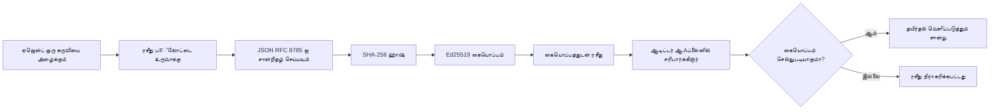
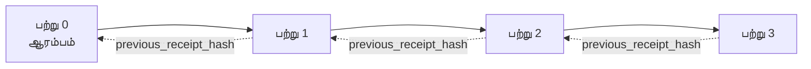

[பாடம் வீடியோவை பார்க்கவும்: குறியாக்க ரசீது மூலம் AI ஏஜென்ட்களை பாதுகாக்குதல்](https://youtu.be/PLACEHOLDER_VIDEO_ID)

> _(பாடம் வீடியோவும் சிறு படம் Microsoft உள்ளடக்க குழுவால் இணைப்புக்குப் பிறகு சேர்க்கப்படும், பாடம் 14 / 15 முறையை பின்பற்றுகிறது.)_

# குறியாக்க ரசீதுகளுடன் AI ஏஜென்ட்களை பாதுகாக்குதல்

## அறிமுகம்

இந்த பாடத்தில் இது பற்றிக் கற்கப்படும்:

- AI ஏஜென்ட்களுக்கு ஒப்புதல், போதுமான சீராய்வு மற்றும் நம்பிக்கைக்காக ஒடிடு பாதைகள் ஏன் முக்கியம் என்பதை.
- குறியாக்க ரசீது என்பது என்ன மற்றும் அது கையொப்பமிடாத பதிவு வரிசை எனப்படும் ஒன்றுக்கு எப்படி வேறுபடுகிறது.
- ஒரு ஏஜென்டின் கருவி அழைப்புக்கு எளிய பைதான் மூலம் கையொப்பமிடப்பட்ட ரசீதுகளை உருவாக்குவது எப்படி.
- ஒரு ரசீத்தை ஆஃப்லைனில் சரிபார்க்கவும் மிரட்டலை கண்டறிவதும் எப்படி.
- ஒரு ரசீதுகளை தொடர்களாக இணைத்து ஒன்று நீக்கப்பட அல்லது மறுதொடர்படுத்தப்பட வேண்டுமானால் தொடர் துண்டிக்கப்படும் எப்படி.
- ரசீதுகள் நிரூபிக்கும் விஷயங்கள் மற்றும் அவை வெளிப்படையாக நிரூபிக்காதவை என்னவென்பதை.

## கற்றல் இலக்குகள்

இந்த பாடத்தை முடித்தவுடன், நீங்கள் அறிவீர்கள் எப்படி:

- ஏஜென்ட் நடவடிக்கைகளுக்கு குறியாக்க அசல் உறுப்பு தேவைப்படுத்தும் தோற்பிழை முறைகளை அடையாளம் கண்டு கொள்ளது.
- ஒரு Ed25519 கையொப்பமிடப்பட்ட ரசீதைக் canonical JSON தரவுத் தொகுப்பில் உருவாக்குவது.
- கையொப்பதாரரின் பொதுக் கீயை மட்டும் பயன்படுத்தி ரசீதை தனிப்பட்ட முறையில் சரிபார்க்க.
- திருத்தத்தை மீண்டும் சரிபார்ப்பை இயக்கி கண்டறிய.
- ரசீதுகளின் ஹாஷ் தொடர்களைக் கட்டி, அந்தத் தொடர் ஏன் முக்கியமென்பதை விளக்க.
- ரசீதுகள் நிரூபிக்கும் (தகுதி, ஒருங்கிணைப்பு, வரிசை) மற்றும் நிரூபிக்காத (நடவடிக்கையின் சரியான தன்மை, கொள்கை வலுவு) எல்லைகளை வகைப்படுத்த.

## சிக்கல்: உங்கள் ஏஜென்டின் ஒடிடு பாதை

நீங்கள் Contoso Travelற்கு ஒரு AI ஏஜெண்டைப் பயன்படுத்தி வாடிக்கையாளர் கோரிக்கைகளை வாசித்து, விமான API அழைத்து, சீரமைப்புகளை செய்யப்பட்டு இருக்கிறீர்கள் என நினைக்கவும். கடந்த காலகட்டத்தில், அந்த ஏஜெண்ட் 50,000 முன்பதிவுகளை இயக்கியது.

இன்று ஒரு சீராய்வாளர் வருகிறார். அவருடைய கேள்வி: "உங்கள் ஏஜெண்ட் என்ன செய்தது என்று காண்பியுங்கள்."

நீங்கள் பதிவு கோப்புகளை ஒப்படைகிறீர்கள். சீராய்வாளர் அதை பார்த்து கேட்கிறார்: "இந்த பதிவுகள் திருத்தப்படவில்லை என்று நான் எப்படி அறிந்து கொள்வது?"

இது ஒடிடுபாதை சிக்கல். இன்று பெரும்பாலான ஏஜென்ட் பயன்பாடுகள் தலைமைக்கான நம்பிக்கையை சார்ந்துள்ளன:

- **விண்ணப்ப பதிவுகள்**: ஏஜெண்ட் தானே எழுதுகிறது, கோப்பு அமைப்பை அணிவதற்கு யாரும் திருத்தக்கூடியவை.
- **மேக பதிவு சேவைகள்**: மேட்சியாளர் மட்டத்தில் திருட்டை கண்டுபிடிக்க கூடியவையாக இருக்கின்றன, ஆனால் சீராய்வாளர் மேட்சியாளர் மேற்பார்வையாளர் மீது நம்பிக்கை வைக்குமானால் மட்டுமே.
- **தரவுத்தள பரிவர்த்தனை பதிவுகள்**: தரவுத்தள மாற்றங்களுக்கு பொருத்தமானவை, ஆனால் சீருடைக்கப் பயன்பாட்டிற்கு அல்ல.

இவை யாவும் சீராய்வாளரின் கேள்விக்கு பதிலளிக்க முடியாது அதற்கான நம்பிக்கை தேவையானவர்கள் (நீங்கள், உங்கள் மேக வழங்குநர், தரவுத்தள விற்பனையாளர்). உள்ளக பயன்பாட்டிற்கு நம்பிக்கை ஏற்றுக்கொள்ளத்தக்கது, ஆனாலும் ஒழுங்கு விதிக்கப்படும் பணிகளுக்கு (நிதி, மருத்துவம், ஐயுசி சட்டம் கீழ்) அது பொருந்தாது.

குறியீட்டுக் ரசீதுகள் ஒவ்வொரு ஏஜெண்ட் செயலையும் தனிப்பட்ட முறையில் சரிபார்க்கப்படும் வகையில் தீர்வு தருகின்றன. சீராய்வாளருக்கு உங்கள் மீது நம்பிக்கை தேவை இல்லை. அவர்களுக்கு மட்டுமே உங்கள் பொதுக் கீ மற்றும் ரசீது தேவை.

## குறியாக்க ரசீது என்றால் என்ன?

ஒரு ரசீது என்பது ஏஜெண்ட் என்ன செய்தது என்பதை பதிவு செய்த JSON பொருள், அதை டிஜிட்டல் கையொப்பம் மூலம் கையொப்பமிடுகிறது.



அதிகபட்ச ரசீது இதுபோல் இருக்கிறது:

```json
{
  "type": "agent.tool_call.v1",
  "agent_id": "contoso-travel-bot",
  "tool_name": "lookup_flights",
  "tool_args_hash": "sha256:a3f9c1...",
  "result_hash": "sha256:7b2e1d...",
  "policy_id": "contoso-travel-policy-v3",
  "timestamp": "2026-04-25T14:30:00Z",
  "sequence": 47,
  "previous_receipt_hash": "sha256:9d4e6a...",
  "signature": {
    "alg": "EdDSA",
    "sig": "c5af83...",
    "public_key": "8f3b2c..."
  }
}
```

மூன்று பணிகள் செய்கிற பண்புக்கூறுகள் உள்ளன:

1. **கையொப்பம்**. ரசீதை ஏஜெண்ட் வாயிலாக Ed25519 தனியார் விசை கொண்டு கையொப்பமிடுகிறது. பொதுக் கீயை வைத்திருக்கும் யாரும் அந்த கையொப்பத்தை ஆஃப்லைனில் சரிபார்க்க முடியும். எந்தவொரு புலத்தையும் திருத்தினால் கையொப்பம் தவறாகிறது.

2. **Canonical குறியாக்கம்**. கையொப்பம் விடும் முன்பு, ரசீதை JSON Canonicalization Scheme (JCS, RFC 8785) பயன்படுத்தி தொடரமைக்கப்படுகிறது. இதனால் ஒரே தவிர்க்க முடியாத காப்பீடு உருவாக்கப்படுகிறது. canonicalization இல்லாமல், JSON தொடர்கோப்பிகள் வெவ்வேறு கையொப்பங்களை உருவாக்குவார்கள்.

3. **ஹாஷ் தொடர்**. `previous_receipt_hash` புலம் ஒவ்வொரு ரசீதையும் முன் ரசீதுடன் இணைக்கிறது. ஒரு ரசீதைக் கலைத்தால் அல்லது மறுசீரமைத்தால் ஆன தொடரிலும் தோற்றம் வரும். தனிப்பட்ட கையொப்பங்களும் மீறப்பட்டால் கூட தொடரில் திருட்டு கண்டுபிடிக்கப்படும்.

இந்த பண்புகள் மூன்று உறுதிப்பத்திரங்களை வழங்குகின்றன:

- **முகவருத்தல்**: இந்த விசை இந்த உள்ளடக்கத்தை கையொப்பமிடியது.
- **ஒற்றுமை**: கையொப்பமிடப்பட்ட பிறகு உள்ளடக்கம் மாறவில்லை.
- **வரிசை**: இந்த ரசீது அந்த ரசீதுக்குப் பிறகு வந்தது.

## பைதான் மூலம் ரசீதை உருவாக்குதல்

ரசீதை உருவாக்க சிறப்பு நூலகம் தேவையில்லை. குறியீட்டு அடிப்படைகள் எளிதாகக் கிடைக்கின்றன, மேலும் கொஞ்சம் பைதான் கோடுகளுள் பதிவு செய்யக்கூடியது.

`code_samples/18-signed-receipts.ipynb` யில் கைமுறைகள் முழுவதும் உள்ளன. சுருக்கமான பதிப்பு:

```python
import json
import hashlib
import base64
from nacl import signing
from jcs import canonicalize  # RFC 8785 கனோனிக்கல் JSON

def b64url_nopad(data: bytes) -> str:
    return base64.urlsafe_b64encode(data).decode("ascii").rstrip("=")

def sha256_canonical(obj) -> str:
    """SHA-256 of a Python object's JCS-canonical JSON form."""
    return f"sha256:{hashlib.sha256(canonicalize(obj)).hexdigest()}"

# ஒரு கையொப்பமிடும் விசையை உருவாக்கவும் அல்லது ஏற்றவும் (உற்பத்தியில், விசை வளாகத்தில் சேமிக்கவும்)
signing_key = signing.SigningKey.generate()
verify_key = signing_key.verify_key

# ரசீது தகவலியக்கத்தை உருவாக்கவும் (இனிமேல் கையொப்பமிடவில்லை)
tool_args = {"origin": "SYD", "destination": "LAX"}
tool_result = [{"flight": "QF11", "price": 1850, "stops": 0}]

payload = {
    "type": "agent.tool_call.v1",
    "agent_id": "contoso-travel-bot",
    "tool_name": "lookup_flights",
    "tool_args_hash": sha256_canonical(tool_args),
    "result_hash": sha256_canonical(tool_result),
    "policy_id": "contoso-travel-policy-v3",
    "timestamp": "2026-04-25T14:30:00Z",
    "sequence": 0,
    "previous_receipt_hash": None,
}

# கனோனிகலைஸ் செய்து, ஹாஷ் செய்து, கையொப்பமிடவும்.
canonical_bytes = canonicalize(payload)
message_hash = hashlib.sha256(canonical_bytes).digest()
signature_bytes = signing_key.sign(message_hash).signature

# கட்டமைக்கப்பட்ட கையொப்பப் பொருளை இணைக்கவும்.
receipt = {
    **payload,
    "signature": {
        "alg": "EdDSA",
        "sig": b64url_nopad(signature_bytes),
        "public_key": b64url_nopad(bytes(verify_key)),
    },
}
```

இந்திய முறையே முழு கையொப்பத் துறையும். நோட்புக் exercícios ஒவ்வொரு படியையும் தெளிவுபடுத்துகின்றன.

## ரசீதை சரிபார்க்கும் மற்றும் திருட்டு கண்டறியும்

சரிபார்ப்பு செயல்முறை:

```python
import base64
import hashlib
from nacl import signing
from nacl.exceptions import BadSignatureError
from jcs import canonicalize

def b64url_decode(s: str) -> bytes:
    padding = "=" * ((4 - len(s) % 4) % 4)
    return base64.urlsafe_b64decode(s + padding)

def verify_receipt(receipt: dict) -> bool:
    # கையொப்பம் ஒரு கட்டமைக்கப்பட்ட பொருள்: {"alg", "sig", "public_key"}.
    sig_obj = receipt.get("signature")
    if not sig_obj or sig_obj.get("alg") != "EdDSA":
        return False

    # உண்மையில் கையொப்பமிட்ட பொருளை மீண்டும் கட்டமைக்கவும் (கையொப்பத்தைத் தவிர்ந்த அனைத்தும்).
    payload = {k: v for k, v in receipt.items() if k != "signature"}

    canonical_bytes = canonicalize(payload)
    message_hash = hashlib.sha256(canonical_bytes).digest()

    try:
        verify_key = signing.VerifyKey(b64url_decode(sig_obj["public_key"]))
        verify_key.verify(message_hash, b64url_decode(sig_obj["sig"]))
        return True
    except BadSignatureError:
        return False
```

இந்த செயலி ஒரு ரசீதைப் பெற்று, கையொப்பம் சரியானதானால் `True`, இல்லையெனில் `False` ஐத் திருப்பும். எந்த நெட்வொர்க் அழைப்பு, சேவை சார்பு அல்லது யாரையாவது நம்பிக்கை தேவைப்படும்.

திருட்டு கண்டறிதலை காண, நோட்புக் இதோடு செயல் படுத்துகிறது:

1. ஒரு செல்லுபடியான ரசீதை உருவாக்கி, சரிபார்ப்பு உறுதி செய்தல்.
2. `tool_args_hash` புலத்தில் ஒரு பைட் மாற்றுதல்.
3. மறுபடியும் சரிபார்த்து தோல்வி காட்டுதல்.

இது ரசீதுகள் திருட்டை வெளிப்படுத்துமென்பதை நடைமுறை சான்று செய்கிறது: சிறிய திருத்தமும் கையொப்பத்தை உடைக்கும்.

## பல படி ஏஜென்டுகளுக்கான ரசீதுகளை தொடர் இணைத்தல்

ஒரு கையொப்பமிடப்பட்ட ரசீது ஒரு நடவடிக்கையை மட்டுமே பாதுகாக்கிறது. எண்ணற்ற ரசீதுகளின் தொடர் தொடரை பாதுகாக்கிறது.



ஒவ்வொரு ரசீதும் முன் ரசீதின் ஹாஷைப் பதிவுசெய்கிறது. இரண்டு ரசீதுகளை அழிக்க விரும்புகிறால், தாக்குநர் செய்யவேண்டியது:

- ரசீது 3-ன் `previous_receipt_hash` புலத்தை மாற்றுவது (ரசீது 3-ன் கையொப்பம் முறியடையிறது), அல்லது
- திருத்திய ரசீது 3-ல் புதிய கையொப்பத்தை உருவாக்குவது (ஏஜெண்ட் தனியார் விசை தேவை).

தனியார் விசை ஹார்ட்வேர் விசை கோவிலில் இருந்தால் மற்றும் பொதுக் கீஒவ்வொரு ரசீதுடன் வெளியிடப்பட்டால், இந்த தாக்குதல் கண்டுபிடிக்கப்படாமல் இயலாது.

நோட்புக்:

1. மூன்று ரசீதுகளின் தொடர் அமைத்தல்.
2. ஒவ்வொரு ரசீதின் `previous_receipt_hash` முந்தைய ரசீதின் உண்மையான ஹாஷுடன் பொருந்தக்கூடாது என்பதை சரிபார்த்தல்.
3. நடுவிலுள்ள ஒரு ரசீதுடன் திருட்டு செய்து அந்த தொடர் உடைந்துவிடும் என்பதை காண்பித்தல்.

இது வெளிப்புற சீராய்வாளர்கள் உங்கள் மீது நம்பிக்கை வைக்காது சரிபார்க்கவிடும் ஒடிடுபாதையை உருவாக்கும் முறை.

## ரசீதுகள் நிரூபிக்கும் அவையும் நிரூபிக்காத அவையும்

இது இந்த பாடத்தின் மிக முக்கிய பகுதியாகும். ரசீதுகள் சக்திவாய்ந்தவையாகினும், அவற்றின் சக்தி வரையறுக்கப்பட்டுள்ளது.

**ரசீதுகள் நிரூபிக்கும் மூன்று விஷயங்கள்:**

1. **முகவருத்தல்**: ஒரு குறிப்பிட்ட விசை ஒரு payload ஐ கையொப்பமிட்டது.
2. **ஒற்றுமை**: கையொப்பமிடப்பட்ட பிறகு payload மாற்றப்படவில்லை.
3. **வரிசை**: இந்த ரசீது ஹாஷ் தொடரில் அந்த ரசீதுக்குப் பிறகு உள்ளது.

**ரசீதுகள் நிரூபிக்கவில்லை:**

1. **தரநிலை**: ஏஜெண்டின் செயல் சரியானது எனக் உறுதி செய்யாது. தவறான பதிலுக்கும் கையொப்பம் இவ்வளவு சுத்தமாக இருக்கலாம்.
2. **கொள்கை இணக்கம்**: `policy_id` யில் குறிப்பிடப்பட்ட கொள்கை உண்மையில் மதிப்பிடப்பட்டதா அல்லது பார்வைகள் வைத்திருந்தால் அனுமதிக்குமா என்பதைக் கூறாது. ரசீது கூறும் என்பது கோரப்பட்டதுதான், அமல்படுத்தப்பட்டதல்ல.
3. **தனிநபர் அடையாளம்**: ரசீது "இந்த விசை இந்த உள்ளடக்கத்தை கையொப்பமிட்டது" என கூறும். "இந்த மனிதர் அனுமதி அளித்தார்" எனச் சொல்லாது. விசையை நபர் அல்லது நிறுவனம் உடனான தொடர்பு தனித்த அடையாளத் தொழில்நுட்பம் தேவை.
4. **உள்ளீடுகளின் உண்மை தன்மை**: ஏஜெண்ட் மோசமான தூண்டுதலைப் பெற்று அதில் செயல்பட்டால், ரசீது நிகழ்வை உண்மையானவிதமாக பதிவு செய்கிறது. ரசீதுகள் உள்ளீடு சரிபார்ப்பின் பின்னாடி நிலை, அதற்குப் பதிலாக அல்ல.

இந்த எல்லை இரண்டு காரணங்களுக்காக முக்கியம்:

- ரசீதுக்கள் ஏஜெண்ட் நடத்தை கண்காணிப்பு மற்றும் திருட்டை வெளிப்படுத்தும் கருவி என்றதைக் காண்பிக்கும்.
- நீங்கள் இன்னும் தேவைப்படும் கூடுதல் அடுக்குகளை: உள்ளீடு சரிபார்ப்பு (பாடம் 6), கொள்கை அமலாக்கம் (கீழே சிறிது), மற்றும் அடையாள அமைப்பு (இந்த பாடத்திற்கு வெளியே).

"நமக்கு ரசீதுகள் உள்ளன" என்பது "நாம் நிர்வகிக்கப்படுகிறோம்" என்று தவறுதலான எண்ணத்தை தவிர்க்கவும். ரசீதுகள் அடித்தட்டு. நிர்வாகம் நீங்கள் கட்டியெடுத்து வருவதாகும்.

## உற்பத்தி குறிப்புகள்

இந்த பாடத்தில் பைதான் குறியீடு மிக எளிமையாக உள்ளது, ஒவ்வொரு வரியையும் படித்து புரிந்துகொள்ள. உற்பத்தியில், இரண்டு தேர்வுகள் உண்டு:

1. **குறியீட்டு அடிப்படைகளில் நேரடியாக கட்டமைக்க**. மேல் வைத்த 50 வரிகள் பல பயன்பாட்டிற்கு போதுமானது. PyNaCl (Ed25519) மற்றும் `jcs` (canonical JSON) புத்தகங்கள் நற்செயற்கை நன்கு பராமரிக்கப்படுகின்றன.

2. **உற்பத்தி ரசீது நூலகத்தைப் பயன்படுத்த**. பல ஓப்பன் சோர்ஸ் திட்டங்கள் கீ மாற்றம், தொகுதி சரிபார்ப்பு, JWK தொகுப்புகள் பகிர்வு, கொள்கை இயந்திரங்கள் இணைப்பு போன்ற கூடுதல் அம்சங்களை கொண்டத்துடன் உள்ளன.
   - இந்த பாடத்தில் பயன்படுத்திய ரசீது வடிவம் IETF Internet-Draft (`draft-farley-acta-signed-receipts`) ஆகும், தற்போழுது தரநிலையேற்றத்தில் உள்ளது.
   - Microsoft Agent Governance Toolkit ரசீதுகளை Cedar அடிப்படையிலான கொள்கை தீர்வுகளுடன் இணைக்கிறது; அந்த தொகுப்பின் Tutorial 33 இல் முழு உதாரணம் உள்ளது.
   - `protect-mcp` (npm) மற்றும் `@veritasacta/verify` (npm) Node அடிப்படையிலான ரசீது கையொப்பம் மற்றும் ஆஃப்லைன் சரிபார்ப்பு நூலகங்கள், MCP சேவையகத்தைப் பாதுகாப்பான ஒடிடு பாதை உடன் மூடும் வகையில்.
   - **[nobulex](https://github.com/arian-gogani/nobulex)** பைதான் SDK (`pip install nobulex`) Python இல் Ed25519 + JCS கையொப்ப மாதிரியை LangChain மற்றும் CrewAI உடன் ஒருங்கிணைக்கிறது, மாதிரிகளும், ஒத்திசைவுத் தேர்வு வெக்டர்களும் OWASP PR #2210 மூலம் கொடுக்கப்பட்டுள்ளது.

உங்கள் சொந்த JWT நூலகம் எழுதுவதும் ஆய்வூதிய நூலகத் தேர்வும், இரண்டும் சரியான வழிகள்; நூலகம் நேரம் சேமிக்க மற்றும் ஆய்வு கூடையேற்றத்தை குறைக்கிறது; தொடக்கத்திலிருந்து எழுதுதல் ஒவ்வொரு அடிப்படையையும் புரிந்து கொள்கின்றது. இந்த பாடம் தொடக்கப் பாதையை கற்பிக்கிறது என்பதனால் நீங்கள் இனிமேல் இரண்டு தேர்வுகளையும் தேர்வு செய்ய தயார்.

## அறிவு சோதனை

பயிற்சி செய்யும் முன் உங்கள் குறித்த அறிவைச் சோதிக்கவும்.

**1. ரசீதுகு ஏஜெண்டின் தனியார் Ed25519 விசையால் கையொப்பமிடப்பட்டுள்ளது. சீராய்வாளரிடம் பொது விசையே உள்ளதாம். சீராய்வாளர் ரசீதை ஆஃப்லைனில் சரிபார்க்க முடியுமா?**

<details>
<summary>பதில்</summary>

ஆம். Ed25519 சரிபார்ப்பு பொது விசை மற்றும் கையொப்ப இடம் மட்டும் தேவை. எந்த நெட்வொர்க் அழைப்பு, சேவை சார்பு இல்லை. இதுதான் ரசீதுகளை காற்றாடிப்புள்ள, பல அமைப்புகளில் பரவிய அல்லது குறைந்த நம்பிக்கை சூழல்களில் பயன்பாடாகச் செய்கிறது.
</details>

**2. தாக்குநர் `policy_id` புலத்தை மாற்றி அதில் ஒரு கூடுதல் அனுமதி கொள்கையை குறிக்கிறார். கையொப்பம் அசல் தரவுக்கு இதுவரை மட்டுமே. சரிபார்ப்பின் போது என்ன நடக்கும்?**

<details>
<summary>பதில்</summary>

சரிபார்ப்பு தோல்வி. கையொப்பம் canonical படி அசல் ஹாஷில் மட்டுமே இயங்கும்; எந்த புலமானாலும் மாற்றம் canonical ஹாஷை மாற்றும், இது SHA-256 ஹாஷை மாற்றும், அதனால் கையொப்பம் தவறும். தாக்குநருக்குத் தனியார் விசை இல்லாமல் புதிய செல்லுபடியான கையொப்பம் செய்ய முடியாது.
</details>

**3. ரசீதுக்கு 'tool_args_hash' மற்றும் 'result_hash' ஏன் சேர்க்கப்பட்டுள்ளது, மூல வார்த்தைகளும் முடிவுகளும் பதிலாக இல்லாமல்?**

<details>
<summary>பதில்</summary>

இரண்டு காரணங்கள்: முதல், ரசீதுகளை ஆவணம் செய்யவோ அல்லது கடத்தவோ செய்யும் சூழலில் அசல் உள்ளடக்கம் (பிரத்தியேக தகவல்கள் ஆகியவை) வெளியேறாமல் இருக்க வேண்டும். ஹாஷ் கான உள்ளடக்கம் சிறியதும், தனியுரிமை மரியாதை கொண்டதும் ஆகும்; சீராய்வாளர் அதே ஹாஷுடன் தனித்தனியான உள்ளடக்கம் ஒப்பன ஆகுமா என உறுதிசெய்ய முடியும். இரண்டாவது, ஹாஷ்கள் நிரந்தர அளவு; உள்ளீடுகளும் வெளியீடுகளும் இருக்கும் அளவை பொருத்தாது, ஹாஷ் உள்ள ரசீது அளவு கட்டுப்பட்டதாகும்.
</details>

**4. `previous_receipt_hash` புலம் ஒவ்வொரு ரசீதையும் முன் ரசீதுடன் இணைக்கிறது. ஒருத்தர் தொடரில் நடுவில் உள்ள ஒரு ரசீதை மௌனமாக நீக்கினால் என்ன தவறு?**

<details>
<summary>பதில்</summary>

அந்த நீக்கப்பட்ட ரசீதுக்கு பின் உள்ள ஒவ்வொரு ரசீதும் தவறாகிவிடும். அவற்றின் `previous_receipt_hash` புலம் உண்மையான தொடருடன் பொருந்தாது (ஏனெனில் அவை குறிப்பிட்ட ரசீது இனிமே இல்லை அல்லது தொடர் வேறு முறையாக இணைக்கப் பட்டுள்ளது). நீக்கத்தை மறைக்க, தாக்குநர் பின்னதாக வரும் ஒவ்வொரு ரசீதையும் மீண்டும் கையொப்பமிட வேண்டியிருக்கும், அதற்கு தனியார் விசை தேவை.
</details>

**5. ஒரு ரசீது சுத்தமாக சரிபார்க்கப்பட்டால், அதன் மூலம் ஏஜெண்டின் செயல் சரியானது, ஒழுங்கானது அல்லது கொள்கையுடன் இணங்கியதா என்பது நிரூபிக்கப்படுகிறதா?**

<details>
<summary>பதில்</summary>

இல்லை. செல்லுபடியான ரசீது மூன்று விஷயங்களை மட்டும் நிரூபிக்கிறது: முகவருத்தல் (இந்த விசை இந்த உள்ளடக்கத்தை கையொப்பமிட்டது), ஒருங்கிணைப்பு (உள்ளடக்கம் மாறவில்லை), வரிசை (இந்த ரசீது அந்தரசீதுக்குப் பிறகு வந்தது). இது செயல் சரியானது, கொள்கை மதிப்பீடு செய்யப்பட்டதா அல்லது அனைத்து விதிகளும் பின்பற்றப்பட்டதா என்பதைச் சொல்லாது. ரசீதுகள் ஏஜெண்ட் நடத்தை கண்காணிப்பு உத்தரவாதம் மட்டுமே, சரியான செயல் உறுதி அல்ல. இது பாடத்தின் மிக முக்கிய எல்லை.
</details>

## பயிற்சி பணி

`code_samples/18-signed-receipts.ipynb` திறந்து அனைத்து நான்கு பிரிவுகளையும் முடிக்கவும்:

1. **பிரிவு 1**: உங்கள் முதல் ரசீதை கையொப்பமிடி சரிபார்க்கவும்.
2. **பிரிவு 2**: ரசீதுடன் மோசடி செய்யவும் மற்றும் சரிபார்ப்பு தோல்வியாகும் என்பதை காணவும்.
3. **பிரிவு 3**: மூன்று ரசீதுகளின் தொடர் கட்டி its ஒற்றுமையை சரிபார்க்கவும்.
4. **பிரிவு 4**: Microsoft Agent Framework கொண்டு கட்டிய ஏஜெண்டுடன் மாதிரியை பயன்படுத்து; கருவி அழைப்பை ரசீது கையொப்பத்துடன் மூடி, பிறகு ரசீதை தனித்தனியாக சரிபார்க்கவும்.
**வளைவு பணி 1:** உங்கள் விருப்பப்படி ஒரு கூடுதல் புலத்துடன் ரசீதின் திட்டத்தை விரிவுபடுத்தவும் (உதாரணத்திற்கு, பின்தொடர்ச்சி கோரிக்கை ஐடி), அதைச் சேர்த்து கானோனிக்கல் கையொப்ப அமைப்பை புதுப்பிக்கவும், மற்றும் ரசீது இன்னும் சரிபார்ப்பு மூலம் முறையாக கடந்து செல்கிறது என்பதை உறுதிப்படுத்தவும். பின்னர் கையொப்பமிடும் பின் அந்த புலத்தை மாற்றி சரிபார்ப்பு தோல்வி அடையுமா என்பதை உறுதிப்படுத்தவும். இதனால் கானோனிக்கல் குறியாக்கத்தின் ஒவ்வொரு பைட் என்றென்றும் கையொப்பத்திற்கு எவ்வாறு பங்களிக்கிறது என்பதை நீங்கள் புரிந்துகொள்ள வேண்டும்.

**வளைவு பணி 2:** உங்கள் இரண்டு ரசீதுகளின் canonical பைட்டுகளை நிர்ணயமாக ஒன்றுடன் ஒன்று சேர்த்து SHA-256 ஹாஷ் செய்க, அதன் விளைவாக உருவான டைஜஸ்ட்டை மூன்றாவது ரசீதில் புதிய புலமாக சேர்க்கும்படி கையொப்ப இடுங்கள். அட்டச்சு செய்யப்பட்ட இந்த மூன்று ரசீதுக்கள் முழுமையாக சரிபார்க்கப்படுவதை உறுதிப்படுத்தவும். இப்போது நீங்கள் ஒரே படி உள்ளடக்கத் தூதுவை உருவாக்கியுள்ளீர்கள்: மூன்றாவது ரசீதைக் கொண்ட எந்த ஒருவனும் முதல் இரண்டு ரசீதுகள் கையொப்பமிடப்பட்ட சமயத்தில் இருந்தன என்பதை, அவற்றின் உள்ளடக்கங்களை வெளிப்படுத்தாமலே நிரூபிக்க முடியும். இது அளவுரு அடிப்படையிலான தெரிவு தகவல் வெளியீட்டு ரசீதுகளின் (Merkle உறுதிப்படுத்தல்கள், RFC 6962) பயன்படுத்தும் முறை.

## முடிவு

புதிர்கோட்படுத்தப்பட்ட ரசீதுகள் AI முகவர்களுக்கு பின்வரும் பண்புகளை கொண்ட ஒரு கணக்கு பாதையை வழங்குகின்றன:

- **சுயமாக சரிபார்க்கக்கூடியது**: பொது விசையை கொண்ட எந்த ஒரு தரப்பும் சேவையில் சார்பற்றமாக சரிபார்க்கலாம்.
- **தவறான மாற்றங்களை வெளிப்படுத்தும்**: எதுவும் மாற்றினால் கையொப்பம் செல்லுபடியாகாது.
- **கையடக்கமானது**: ஒரு ரசீது ஒரு சிறிய JSON கோப்பு; சேமிக்கவும், பரிமாறவும், மற்றும் எங்கு வேண்டுமானாலும் சரிபார்க்கவும் கிடைக்கும்.
- **அடிப்படையில் நெறிமுறைகளுடன் இணைந்தது**: Ed25519 (RFC 8032), JCS (RFC 8785), மற்றும் SHA-256 போன்ற பரவலாக பயன்படுத்தப்படும் அடிப்படை கருவிகளின் மீது கட்டப்பட்டுள்ளது.

இவை உள்ளீடு சரிபார்ப்பு, கொள்கை அமலாக்கம், அல்லது அடையாள அமைப்புக்கு பதில் அல்ல. இவை அந்த அடுக்குகளுக்கான அடித்தளம். நீங்கள் ஒழுங்குபடுத்தப்பட்ட பணி, பல நிறுவனர் வேலைவாய்ப்புகள் அல்லது எதிர்கால கணக்காய்வாளர் உங்களை நம்ப முடியாத சூழலில் முகவர்களை மாற்றDeploy செய்கிறீர்கள் என்றால், கணக்கு பாதையை நேர்மையானதாக வைத்திருக்க ரசீதுகள் உதவும்.

அதிக முக்கியமான புள்ளி: ரசீதுகள் யார் எப்போது என்ன சொன்னார்கள் என்பதை உறுதிப்படுத்துகின்றன. அவர்கள் சொன்னது உண்மையா அல்லது சரியானதா என்று நிரூபிக்கவில்லை. அந்த வேதனையை உருவாக்கி வைத்துக்கொள்ளுங்கள். இது நேர்மையான முன்னோட்ட அமைப்புக்கும் தவறான ஒன்றுக்கும் இடையேயான வேறுபாடு.

## உற்பத்தி அனுப்பும் பட்டியல்

இந்த பாடத்திலிருந்து இறங்கிச் சென்று உண்மையான சூழலில் ரசீத் கையொப்பு அடையாள முகவர்களை வழங்க தயாராகசெய்யும்போது:

- [ ] **கையொப்ப விசையை டெவலைப்பர் லேப்டாப்பிலிருந்து மாற்றவும்.** Azure Key Vault, AWS KMS, அல்லது ஒரு ஹார்ட்வேர் பாதுகாப்புக் கருவி பயன்படுத்தவும். உங்கள் ரசீதுகளை கையொப்பமிடும் தனிப்பட்ட விசை எப்போதும் மூலக் கட்டுப்பாட்டில் அல்லது பயன்பாட்டு இயந்திரங்களில் தெளிவான உரையில் இருக்கக்கூடாது.
- [ ] **சரிபார்ப்புக் குறிப்புகளுக்கான பொது விசையை வெளியிடவும்.** கணக்காய்வாளர்கள் அதை ஆஃப்லைனில் சரிபார்க்க தேவையாகும். சாதாரண நடைமுறை JWK தொகுப்பு ஒரு நன்கு அறிந்த URL இல் (RFC 7517), உதாரணம்: `https://your-org.example.com/.well-known/agent-keys.json`.
- [ ] ** சங்கிலியை வெளியீடு செய்யவும்.** குறைந்தது சமீபத்திய சங்கிலி தலை ஹாஷை மறைமுகச் சுருக்கை (Sigstore Rekor, RFC 3161 நேர அங்கீகாரம், அல்லது இரண்டாவது உள் அமைப்பு) கோரிக்கை இடுங்கள், இதனால் வெளிநாட்டு தரப்பினர் "இந்த சங்கிலி இந்த நேரத்தில் இருந்தது" என்பதை உறுதிப்படுத்த முடியும்.
- [ ] **ரசீதுகளை மாற்ற முடியாதவாறு சேமிக்கவும்.** குறிக்கப்பட்ட அணி மட்டுமே (Append-only) நிரலை சேமிப்பு (Azure சேமிப்பகம் நீக்க இயலாமை கொள்கைகள் அல்லது AWS S3 பொருள் பூட்டு) உங்கள் உள்ளகத்தினரால் வரலாறை மாற்ற முடியாமல் தடுக்கும்.
- [ ] **காப்பாற்றும் காலத்தை தீர்மானிக்கவும்.** பல ஒழுங்குமுறை அமைப்புகளில் பல வருடங்கள் காப்பாற்ற வேண்டியது கட்டாயம். ரசீதுகளின் வளர்ச்சிக்கான திட்டமிடலைத் தயாராக வைக்கவும் (ஒவ்வொரு ரசீதும் சுமார் 500 பைட்; ஒரு முகவர் தினசரி 10,000 அழைப்புகளைச் செய்யும் போது ஆண்டுக்கு சுமார் 1.8 GB).
- [ ] **ரசீதுகள் என்னை அளிக்குவது இல்லை என்பதை ஆவணப்படுத்தவும்.** ரசீதுகள் பகிர்வு, ஒருங்கிணைப்பு மற்றும் வரிசை ஆகியவற்றை நிரூபிக்கின்றன. உங்கள் இயக்க புத்தகத்தில் உள்ளீடு சரிபார்ப்பு, கொள்கை அமலாக்கம், வீத குறைத்தல், அடையாள அமைப்பு போல অতিরিক্ত கட்டுப்பாடுகள் ரசீதுகளுடன் இணைந்து உங்கள் ஆட்கவர்னென்ஸ் நிலையில் இருக்கும் என்பதை தெளிவாக குறிப்பிடுங்கள்.

### AI முகவர்களை பாதுகாக்க மேலும் கேள்விகள் உள்ளனவா?

[Microsoft Foundry Discord](https://aka.ms/ai-agents/discord) இல் சேர்ந்து மற்ற பயிற்சி நபர்களை சந்தியுங்கள், அலுவலக நேரத்தில் கலந்துகொள்ளுங்கள், மற்றும் உங்கள் AI முகவர்களுக்கான கேள்விகளுக்கு பதில் பெறுங்கள்.

## இந்த பாடத்தைத் தாண்டி

இந்த பாடம் தனி ரசீது கையொப்பம் மற்றும் ஹாஷ் சங்கிலி வரிசைகளைக் குறிப்பதாகும். அவ்வளவு முதன்முதலாக உள்ள அடிப்படைகள் நீங்கள் வளர்ந்துவரும் ஆட்கவர்னென்ஸ் முறையில் பல மேம்பட்ட முறைமைகளாக இணைக்கப்படலாம்:

- **தேர்ந்தெடுக்கப்பட்ட வெளிப்பாடு.** ஒரு ரசீது புலங்கள் தனித்தனியாக உறுதியாக இருந்தால் (RFC 6962 பாணியில் Merkle மரம்), நீங்கள் குறிப்பிட்ட புலங்களை குறிப்பிட்ட கணக்காய்வாளர்களுக்கு மட்டுமே வெளிப்படுத்தவ முடியும் மற்றும் மற்ற புலங்கள் மாற்றமின்றி உள்ளன என்பதை நிரூபிக்க முடியும். இதன் மூலம் அதே ரசீது முழுமையான கணக்காய்வுக்கு (அதில் முழுமை காணப்படுகிறது) மற்றும் தரவு குறைப்பு விதிமுறைக்கு (GDPR போன்ற, கணக்காய்வாளர் குறைவான தரவை மட்டும் பார்க்க வேண்டும்) ஒரே நேரத்தில் பூர்த்தி செய்யும்.
- **ரசீது ரத்து செய்தல்.** ஒரு கையொப்ப விசை திருடப்பட்டால், அந்த விசையால் கையொப்பமிடப்பட்ட அனைத்து ரசீதுகளும் அந்த நேரத்துக்குப் பிறகு நம்பாதது என குறி விட ஒரு முறை வேண்டும். சாதாரண நடைமுறைகள்: குறுகிய கால கையொப்ப விசைகள் மற்றும் வெளியிடப்பட்ட ரத்து பட்டியல் அல்லது ரத்து நுழைவுகளுடன் வெளிப்படைத்தன்மை பதிவு.
- **இரு முனை / பகிரப்பட்ட கையொப்ப ரசீதுகள்.** சில இயற்றல்கள் கையொப்பமிடப்பட்ட தரவுகளை முன் செயல் (authorization_*) மற்றும் பின் செயல் (result_*) என்ற இரண்டு பாதிகளாக பிரிக்கின்றன, சுதந்திர கையொப்பங்களுடன், இது அனுமதி முடிவு மற்றும் பெறப்பட்ட முடிவு வேறுபட்ட நேரம் அல்லது வேறுபட்ட செயற்பாட்டாளர்களிடமிருந்து வந்தால் பயனுள்ளது. இது இந்த பாடத்தில் கற்றுக்கொண்ட ரசீது வடிவத்தில் மேலதிகம் சேர்க்கப்படுகிறது.
- **தரவு தொகுப்பு.** ஒரு ரசீது `result_hash` இல் நீங்கள் வைக்கும் எந்தவொரு பைட்டுகளையும் சீல் செய்கிறது. உண்மை உலக தரவு ஒன்றா அதிகமானது: முதல் முடிவு முன்னோட்டம் (மாதிரி கணிப்பு, பரிந்துரைகள், ஆதாரம் மற்றும் அதன் முழுமை, ஆபத்து நிலை, கணக்கி சங்கிலி, வாயில்கோட்டை முடிவு) அனைத்தும் தரவுக்குள்ளே இருக்க முடியும், ஒரு ரசீதால் சீல் செய்யப்படுகிறது. இது ரசீது வடிவத்தை மிதமானதாக வைத்திருக்கவும், தரவு திட்டங்கள் பிராந்தியப்படி மாற்றப்பட உதவும்.
- **பல நடைமுறைகள் இணக்கப்படுத்தல்.** ஒரே ரசீது வடிவத்தின் பல சுயாதீன நடைமுறைகள் (Python, TypeScript, Rust, Go) பகிர்ந்து கொள்கின்ற சோதனை கழிவுகிகளுக்கு எதிராக பரிசோதனை செய்கின்றன. நீங்கள் உங்கள் சொந்த செயல_IMPLEMENTATION_ கட்டுமானம் செய்தால், வெளியிடப்பட்ட வடிவுகளை எதிர்த்து பொருந்துதலை பாதுக்காப்பு செய்கிறது.
- **பின்-குவாண்டம் மாற்றம்.** Ed25519 இன்று பரவலாக பயன்படுகின்றாலும் குவாண்டம் எதிர்ப்பு அல்ல. ரசீது வடிவம் விதிவிலக்கற்றது: `signature.alg` புலம் `ML-DSA-65` (NIST பின்-குவாண்டம் கையொப்பக் குறியீடு) ஐ ஏற்றுக்கொள்ளும் போது மாற்ற முடியும். ரசீதுகள் இரட்டை கையொப்பம் அடங்கிய காலத்திற்கு திட்டமிடல் செய்யவும்.

## கூடுதல் வளங்கள்

- <a href="https://datatracker.ietf.org/doc/draft-farley-acta-signed-receipts/" target="_blank">IETF Internet-Draft: Signed Decision Receipts for Machine-to-Machine Access Control</a>
- <a href="https://learn.microsoft.com/azure/ai-studio/responsible-use-of-ai-overview" target="_blank">பொறுப்பான AI கண்காணிப்பு (Azure AI)</a>
- <a href="https://datatracker.ietf.org/doc/html/rfc8032" target="_blank">RFC 8032: Edwards-Curve Digital Signature Algorithm (EdDSA)</a>
- <a href="https://datatracker.ietf.org/doc/html/rfc8785" target="_blank">RFC 8785: JSON Canonicalization Scheme (JCS)</a>
- <a href="https://datatracker.ietf.org/doc/html/rfc6962" target="_blank">RFC 6962: சான்றிதழ் வெளிப்படைத்தன்மை</a> (Merkle மர அமைப்பு தீர்வாக தெரிவு-வெளிப்பாடு ரசீதுகளில் பயன்படுத்தப்படும்)
- <a href="https://github.com/microsoft/agent-governance-toolkit/blob/main/docs/tutorials/33-offline-verifiable-receipts.md" target="_blank">Microsoft Agent Governance Toolkit, Tutorial 33: ஆஃப்லைன்-சரிபார்க்கக்கூடிய தீர்மான ரசீதுகள்</a>
- <a href="https://github.com/ScopeBlind/agent-governance-testvectors" target="_blank">இந்த பாடத்தில் பயன்படுத்திய ரசீது வடிவம் சார்ந்த பல நடைமுறை சோதனை அளவுகோல்கள்</a> (Apache-2.0)
- <a href="https://pynacl.readthedocs.io/" target="_blank">PyNaCl ஆவணம்</a> (Python இல் Ed25519)

## முந்தைய பாடம்

[கணினி பயன்பாட்டு முகவர்களை கட்டமைத்தல் (CUA)](../15-browser-use/README.md)

## அடுத்த பாடம்

_(படிக்கொண்டு மென்பொருள் நிர்வாகிகளால் தீர்மானிக்கப்பட உள்ளது)_

---

<!-- CO-OP TRANSLATOR DISCLAIMER START -->
**மறுப்பு**:
இந்த ஆவணம் AI மொழிபெயர்ப்பு சேவை [Co-op Translator](https://github.com/Azure/co-op-translator) பயன்படுத்தி மொழிபெயர்க்கப்பட்டுள்ளது. நாங்கள் துல்லியத்திற்காக முயற்சி செய்துள்ளோம், ஆனால் தானாக செய்யப்படும் மொழிபெயர்ப்புகளில் பிழைகள் அல்லது தவறுகள் இருக்கலாம் என்பதை கவனத்தில் கொள்ளவும். அசல் ஆவணம் அதன் தாய்மொழியில் அதிகாரப்பூர்வ ஆதாரமாக கருதப்பட வேண்டும். முக்கியமான தகவல்களுக்கு, தொழில்நுட்பமான மனித மொழிபெயர்ப்பு பரிந்துரைக்கப்படுகிறது. இந்த மொழிபெயர்ப்பைப் பயன்படுத்துவதால் ஏற்படும் எந்த தவறான புரிதல்கள் அல்லது தவறான விளக்கத்திற்கும் நாங்கள் பொறுப்பில்வில்லை.
<!-- CO-OP TRANSLATOR DISCLAIMER END -->