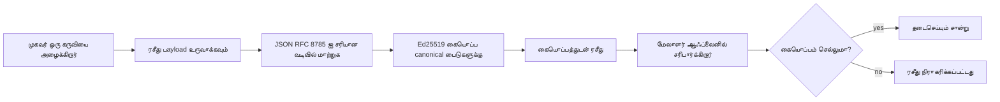
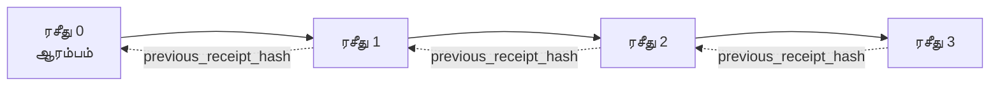

[பாடம் காணொளியை பார்க்கவும்: குறியாக்க ரசீடுகளுடன் AI முகவர்களை பாதுகாக்குதல்](https://youtu.be/PLACEHOLDER_VIDEO_ID)

> _(பாடம் காணொளியும் சிறிய படம் Microsoft உள்ளடக்கக் குழுவால் இணைக்கப்பட்ட பிறகே சேர்க்கப்படும், பாடம் 14 / 15 மாதிரிக்கு பொருந்தும்.)_

# குறியாக்க ரசீடுகளுடன் AI முகவர்களை பாதுகாக்குதல்

## அறிமுகம்

இந்த பாடம் விளக்கும்:

- AI முகவர்களுக்கான கண்டறிதல் பாதைகள் ஒத்துழைப்பு, பிழைத்திருத்தம் மற்றும் நம்பிக்கைக்கு ஏன் முக்கியமானவை.
- குறியாக்க ரசீடு என்ன மற்றும் அது கையொப்பமிடாத பதிவு வரியில் இருந்து எப்படி வேறுபடுகிறது.
- முகவரின் கருவி அழைப்புக்கான கையொப்பமிடப்பட்ட ரசீடுகளை சீரிய Python மூலம் எப்படி உருவாக்குவது.
- ரசீடுகளை ஆஃப்லைனில் சரிபார்க்கவும் மற்றும் திருத்தத்தை கண்டறியவும்.
- ஒரு ரசீடுகளை அகற்றுதல் அல்லது மறுபடியும் வரிசைப்படுத்துதல் தொடரை முறிப்பதை எப்படி தொடுப்பது.
- ரசீடுகள் என்ன நிரூபிக்கின்றன மற்றும் அவர்கள் தெளிவாக என்ன நிரூபிக்கவில்லை.

## கற்றல் குறிக்கோள்கள்

இந்த பாடத்தை முடித்த பிறகு, நீங்கள் தெரிந்து கொள்வீர்கள்:

- முகவர்களின் செயல்களுக்கு குறியாக்க ஆதாரம் தேவைப்படுகிற தோல்வி நிலைகளை அடையாளம் காண்பது.
- ஒரு உடையுள்ள Ed25519 கையொப்பமிடப்பட்ட ரசீடு உருவாக்குவது ஒரு நிர்ணய JSON பைகளில்.
- கையொப்பமிடுபவரின் பொது விசையை பயன்படுத்தி ஒரு ரசீட்டை தனித்தனியாக சரிபார்ப்பது.
- திருத்தம் கண்டுபிடிப்பு செய்கையில் மாற்றிய ரசீடுகளை மீண்டும் சரிபார்ப்பது.
- ரசீடுகளின் கட்ட அங்கங்களை கட்டி அதனால் தொடர் அவற்றின் நம்பகத்தன்மையை காக்கிறது.
- ரசீடுகள் நிரூபிக்கும் மற்றும் நிரூபிக்காதவற்றின் எல்லையை அடையாளம் காண்பது.

## பிரச்சனை: உங்கள் முகவரின் ஆடிட் பாதை

கொள்கலன் தான் Contoso பயணத்திற்காக ஒரு AI முகவர்னை நியமித்துள்ளீர்கள் என்று கருதுங்கள். அந்த முகவர் வாடிக்கையாளர் கோரிக்கைகளை வாசித்து, விமான API அழைத்து விருப்பங்களை தேடுகிறது மற்றும் வாடிக்கையாளரின் சார்பில் இருக்கைகளை முன்பதிவு செய்கிறது. கடந்த காலத்தில், அந்த முகவர் 50,000 முன்பதிவுகளை செயலாக்கியது.

இன்று ஒரு ஆடிட்டர் வருகிறார். அவருக்கு ஒரு எளிய கேள்வி: "உங்கள் முகவர் என்ன செய்தது என்பதை காட்டுங்கள்."

நீங்கள் உங்கள் பதிவு கோப்புகளை நன்கொடுத்து. ஆடிட்டர் அவற்றைக் கண்டு கடினமான கேள்வி கேட்கிறார்: "இந்த பதிவுகள் திருத்தப்படவில்லை என்று எப்படி எனக்கு தெரியும்?"

இதுவே ஆடிட்-பாதை பிரச்சனை. இன்று பெரும்பாலான முகவர் நடைமுறைகள் இதில் அமையைத்தமிழ்:

- **பயன்பாட்டு பதிவுகள்**: முகவர் தானே எழுதியவை, கோப்பு அமைப்பு அணுகல் உள்ள வேடியால் திருத்தக்கூடியவை.
- **மேகப்பதிவு சேவைகள்**: தள மட்டத்தில் திருத்த தடுப்பு உள்ளது, ஆனால் ஆடிட்டர் தள இயக்குனரை நம்பினால் மட்டுமே.
- **தரவுத்தள பரிவர்த்தனை பதிவு**: தரவுத்தள மாற்றங்களுக்கு சரியாக இருப்பது, ஆனால் இதயம் கருவி அழைப்புகளுக்கு இல்லை.

இந்த எதுவும் ஆடிட்டர் கேள்விக்கு பதிலளிக்க முடியாது ஆடிட்டருக்கு யாரையாவது நம்புவது (நீங்கள், மேக வழங்குனர், தரவுத்தள விற்பனையாளர்) தேவைப்படாமல். உள்துறை பயன்பாட்டிற்கு அந்த நம்பிக்கை ஏற்றுக்கொள்ளத்தக்கது. கட்டுப்படுத்தப்படும் பணிகளுக்கு (நிதி, சுகாதாரம், ஐரோப்பிய AI சட்ட பின்பற்றல்) அது ஏற்றுக்கொள்ளமுடியாது.

குறியாக்க ரசீடுகள் இதை தீர்க்கின்றன, ஒவ்வொரு முகவர் செயலும் தனித்தனியான சரிபார்ப்பு வாய்ந்ததாகிறது. ஆடிட்டருக்கு உங்களை நம்ப தேவையில்லை. அவர்களுக்கு உங்கள் பொது விசையும் ரசீடும் மட்டுமே தேவை.

## குறியாக்க ரசீடு என்ன?

ரசீடு என்பது ஒரு JSON பொருள், முகவர் என்ன செய்ததைக் பதிவு செய்கிறது, ஒரு டிஜிட்டல் கையொப்பத்தால் கையொப்பமிடப்பட்டது.


```mermaid
flowchart LR
    A[முகவர் ஒரு கருவியை அழைக்கிறார்] --> B[ரசீது பayload உருவாக்கவும்]
    B --> C[JSON RFC 8785 ஐ சரியான வடிவில் மாற்றுக]
    C --> E[Ed25519 கையொப்ப canonical பைடுகளுக்கு]
    E --> F[கையொப்பத்துடன் ரசீது]
    F --> G[மேலாளர் ஆஃப்லைனில் சரிபார்க்கிறார்]
    G --> H{கையொப்பம் செல்லுமா?}
    H -- yes --> I[தடைசெய்யும் சான்று]
    H -- no --> J[ரசீது நிராகரிக்கப்பட்டது]
```

குறைந்தபட்ச ரசீடு இதுபோன்று இருக்கும்:

```json
{
  "type": "agent.tool_call.v1",
  "agent_id": "contoso-travel-bot",
  "tool_name": "lookup_flights",
  "tool_args_hash": "sha256:a3f9c1...",
  "result_hash": "sha256:7b2e1d...",
  "policy_id": "contoso-travel-policy-v3",
  "timestamp": "2026-04-25T14:30:00Z",
  "sequence": 47,
  "previous_receipt_hash": "sha256:9d4e6a...",
  "signature": {
    "alg": "EdDSA",
    "sig": "c5af83...",
    "public_key": "8f3b2c..."
  }
}
```

மூன்று பண்புகள் வேலை செய்கின்றன:

1. **கையொப்பம்**. ரசீடு முகவரின் வாயிலில் இருந்து Ed25519 தனிப்பட்ட விசையால் கையொப்பமிடப்பட்டது. பொருத்தமான பொது விசை உள்ள எந்த ஒருவனும் கையொப்பத்தை ஆஃப்லைனில் சரிபார்க்க முடியும். எந்த ஒரு புலமும் திருத்தப்பட்டால் கையொப்பம் தவறானதாகும்.

2. **கண்டித்தல் குறியாக்கம்**. கையொப்பமிடுவதற்கு முன், ரசீடு JSON கண்டித்தல் திட்டத்தை (JCS, RFC 8785) பயன்படுத்தி தொடர் படுத்தப்பட்டது. இதனால் இரண்டு செயல்முறை செய்பவர்கள் அதே தர்க்கரீதியான ரசீடு உறுதியாக அதே பைட் வெளியீட்டை உருவாக்குவார்கள். கண்டித்தல் இல்லாமல் வேறுபட்ட JSON தொடராக்கிகள் அதே உள்ளடக்கத்திற்கு வேறுபட்ட கையொப்பங்களை உருவாக்குவார்கள்.

3. **ஹாஷ் தொடுப்பு**. `previous_receipt_hash` புலம் ஒவ்வொரு ரசீடும் முன்பு வந்த ரசீட்டுடன் இணைக்கிறது. ஒரு ரசீட்டை அகற்றுதல் அல்லது மறுசீரமைத்தல் அதன்பின் வரும் ஒவ்வொரு ரசீடையும் முறிப்பதாகும். தனிப்பட்ட கையொப்பங்கள் புறக்கணிக்கப்பட்டாலும் தொடரில் திருத்தத்தைக் கண்டறிய இயலும்.

இந்த பண்புகள் மூன்று உறுதிப்பாடுகளை வழங்குகின்றன:

- **அங்கீகாரம்**: இந்த விசை இந்த உள்ளடக்கத்தை கையொப்பமிட்டது.
- **நேர்த்தி**: கையொப்பமிடுதலுக்கு பின்னர் உள்ளடக்கம் மாறவில்லை.
- **வரிசை**: இந்த ரசீடு அந்த ரசீட்டுக்கு பிறகு தொடரில் வந்தது.

## Python-இல் ரசீடு உருவாக்கல்

ரசீடு உருவாக்க சிறப்பு நூலகம் தேவையில்லை. குறியாக்க அடிப்படைகள் பரவலாக கிடைக்கும், மற்றும் அது சில பத்திகளான Python குறியீட்டால் செய்யக்கூடியது.

`code_samples/18-signed-receipts.ipynb` இல் உள்ள நடைமுறை பயிற்சிகள் முழு ஓட்டத்தை விளக்குகின்றன. சுருக்கமான பதிப்பு:

```python
import json
import hashlib
import base64
from nacl import signing
from jcs import canonicalize  # RFC 8785 இசையான JSON

def b64url_nopad(data: bytes) -> str:
    return base64.urlsafe_b64encode(data).decode("ascii").rstrip("=")

def sha256_canonical(obj) -> str:
    """SHA-256 of a Python object's JCS-canonical JSON form."""
    return f"sha256:{hashlib.sha256(canonicalize(obj)).hexdigest()}"

# ஒரு கையொப்பத் திறவுகோலை உருவாக்கவும் அல்லது ஏற்றுகொள்ளவும் (உற்பத்தியில், அதை ஒரு திறவுச் சூடு அறையில் சேமிக்கவும்)
signing_key = signing.SigningKey.generate()
verify_key = signing_key.verify_key

# பெறுமானத்தை உருவாக்கவும் (இனிமேல் கையொப்பமில்லை)
tool_args = {"origin": "SYD", "destination": "LAX"}
tool_result = [{"flight": "QF11", "price": 1850, "stops": 0}]

payload = {
    "type": "agent.tool_call.v1",
    "agent_id": "contoso-travel-bot",
    "tool_name": "lookup_flights",
    "tool_args_hash": sha256_canonical(tool_args),
    "result_hash": sha256_canonical(tool_result),
    "policy_id": "contoso-travel-policy-v3",
    "timestamp": "2026-04-25T14:30:00Z",
    "sequence": 0,
    "previous_receipt_hash": None,
}

# JCS பைட்டுகளை நேரடியாக இசையாக மாற்றி கையொப்பமிடுக. PureEdDSA உள்ளகமாக ஹேஷ் செய்கிறது.
canonical_bytes = canonicalize(payload)
signature_bytes = signing_key.sign(canonical_bytes).signature

# ஒரு அமைந்த கையொப்ப பொருளை இணைக்கவும்.
receipt = {
    **payload,
    "signature": {
        "alg": "EdDSA",
        "sig": b64url_nopad(signature_bytes),
        "public_key": b64url_nopad(bytes(verify_key)),
    },
}
```

அது முழு கையொப்ப பைப்லைன். நோட்டுபுக் விதிகள் ஒவ்வொரு படியையும் யோசிக்கவைக்கின்றன.

## ரசீடு சரிபார்த்தல் மற்றும் திருத்தம் கண்டறிதல்

சரிபார்த்தல் என்பது எதிர்மறை செயல்பாடு:

```python
import base64
import hashlib
from nacl import signing
from nacl.exceptions import BadSignatureError
from jcs import canonicalize

def b64url_decode(s: str) -> bytes:
    padding = "=" * ((4 - len(s) % 4) % 4)
    return base64.urlsafe_b64decode(s + padding)

def verify_receipt(receipt: dict) -> bool:
    # கையொப்பம் ஒரு கட்டமைக்கப்பட்ட பொருளாகும்: {"alg", "sig", "public_key"}.
    sig_obj = receipt.get("signature")
    if not sig_obj or sig_obj.get("alg") != "EdDSA":
        return False

    # உண்மையில் கையொப்பமிடப்பட்ட புல்லாடையை (கையொப்பம் தவிர அனைத்தும்) மீண்டும் உருவாக்கவும்.
    payload = {k: v for k, v in receipt.items() if k != "signature"}

    canonical_bytes = canonicalize(payload)

    try:
        verify_key = signing.VerifyKey(b64url_decode(sig_obj["public_key"]))
        verify_key.verify(canonical_bytes, b64url_decode(sig_obj["sig"]))
        return True
    except BadSignatureError:
        return False
```

இந்த செயல்பாடு ஒரு ரசீட்டை எடுத்துக் கொண்டு கையொப்பம் செல்லுபடியானதா என்பதற்கு `True` ஐ, இல்லாவிட்டால் `False` ஐ அளிக்கிறது. எந்த வலை அழையும், எந்த சேவை சார்பும், எந்த மூன்றாம் தரப்பு நம்பிப்பும் தேவையில்லை.

திருத்தம் கண்டறிதல் செயல்பாட்டைப் பார்க்க, நோட்டுபுக் கீழ்காணும் படி செல்கிறது:

1. செல்லுபடியான ரசீடு உருவாக்கி சரிபார்க்கப்பட்டதை உறுதிப்படுத்தல்.
2. `tool_args_hash` புலத்தின் ஒரு பைட்டை மாற்றல்.
3. மறுகருத்தாய்வு செய்து தோல்வி காணுதல்.

இது தெளிவாக காண்பிக்கும்: ரசீடுகள் திருத்தத்திற்கு எதிரானவை; சின்ன மாற்றமும் கையொப்பத்தை முறிக்கிறது.

## பல படி முகவர்களுக்கான ரசீடுகளை தொடுப்பு

ஒரே கையொப்பமிடப்பட்ட ரசீடு ஒரு செயலை பாதுகாக்கிறது. ரசீடுகளின் தொடர் ஒரு வரிசையைக் காக்கிறது.


```mermaid
flowchart LR
    R0[ரசீது 0<br/>ஆரம்பம்] --> R1[ரசீது 1]
    R1 --> R2[ரசீது 2]
    R2 --> R3[ரசீது 3]
    R1 -. previous_receipt_hash .-> R0
    R2 -. previous_receipt_hash .-> R1
    R3 -. previous_receipt_hash .-> R2
```

ஒவ்வொரு ரசீடும் முன் வந்த ரசீட்டின் ஹாஷையும் பதிவு செய்கிறது. ரசீடு 2-ஐ அமைதியாக அகற்றுமாறு முயற்சியாளர் செய்ய வேண்டியது:

- ரசீடு 3 இன் `previous_receipt_hash` புலத்தை மாற்றுதல் (ரசீடு 3 கையொப்பத்தை முறிக்கும்), அல்லது
- மாற்றியுள்ள ரசீடு 3-க்கு புதிய கையொப்பத்தை புடைக்கல் (முகவரின் தனிப்பட்ட விசை தேவை).

தனிப்பட்ட விசை ஒரு கடவுச் சொல் காப்பகத்தில் இருந்தால் மற்றும் நீங்கள் பொது விசையை ஒவ்வொரு ரசீடும் வெளியீடு செய்தால், எதையும் கண்டறியாமல் மேற்கொண்ட தாக்குதல் சாத்தியமில்லை.

நோட்டுபுக் கீழ்வருமாறு செயல்படுகிறது:

1. மூன்று ரசீடுகளின் தொடரை உருவாக்குதல்.
2. ஒவ்வொரு ரசீட்டின் `previous_receipt_hash` முந்தைய ரசீட்டின் உண்மையான ஹாஷுடன் பொருந்துவதை சரிபார்த்தல்.
3. நடுவிலுள்ள ஒரு ரசீட்டில் திருத்தம் செய்து தொடரின் அந்த இடத்தில் முறிந்ததை காணுதல்.

இவ்வாறு நீங்கள் ஒரு வெளி ஆடிட்டர் உங்களை நம்பாமல் இதைப் பரிசோதிக்கக்கூடிய ஆடிட் பாதை உருவாக்கலாம்.

## ரசீடுகள் நிரூபிக்கும் (மற்றும் நிரூபிக்காத)வை

இது இந்த பாடத்தின் மிகவும் முக்கியமான பகுதி. ரசீடுகள் சக்திவாய்ந்தவை ஆனால் அவர்களின் சக்தி எல்லைப்படுத்தப்பட்டதுதான்.

**ரசீடுகள் மூன்று விஷயங்களை நிரூபிக்கின்றன:**

1. **அங்கீகாரம்**: ஒரு குறிப்பிட்ட விசை ஒரு குறிப்பிட்ட பைகளைக் கையொப்பமிடியது.
2. **நேர்த்தி**: பைல் கையொப்பமிடபட்ட பிறகு மாறவில்லை.
3. **வரிசை**: இந்த ரசீடு அந்த ரசீட்டுக்குப் பிறகு வந்தது.

**ரசீடுகள் நிரூபிக்க **மாட்டாது**:**

1. **சரியான செயல்முறை**: முகவரின் செயல் சரியானதாக இருந்தது என்றதில்லை. தவறான பதிலுக்கும் சாதாரணமாக ரசீடு கையொப்பமிடலாம்.
2. **கொள்கை அமல்படுத்தல்**: `policy_id`-ல் குறிப்பிடப்பட்ட கொள்கை பரிசீலிக்கப்பட்டதா, அல்லது இது பரிசோதிக்கப்பட்டிருந்தால் செயல்முறையை அனுமதிப்பதா என்பதை ரசீடு பதிவு செய்யாது. இது கூறியது, அமல்படுத்தியது அல்ல.
3. **விசையைத் தவிர அடையாளம்**: ரசீடு “இந்த விசை இந்த உள்ளடக்கத்தை கையொப்பமிட்டது” என்று கூறும்போது “ஒரு மனிதன் தன் அனுமதியை வழங்கின” என்று கூறாது. விசையை ஒருவரோ அல்லது நிறுவனமோ உடையவர் என்பதை தனித்தனிய அடையாள அமைப்பு தேவைப்படுகிறது (அட்டை, பொது விசை பதிவு, மற்றும் பிற).
4. **உள்ளீடுகளின் உண்மை தன்மை**: முகவர் திருத்தப்பட்ட உத்தரவான்றைப் பெற்று அதன்படி செயல்பட்டால், ரசீடு அந்த செயலையும் நேர் அளிக்கிறது. ரசீடுகள் உள்ளீடு சரிபார்ப்பு பிறகு நடைபெறும், அதற்குப் பதிலாக அல்ல.

இந்த எல்லை இரண்டு காரணங்களுக்கு முக்கியம்:

- இது ரசீடுகள் எதற்குப் பயனுள்ளதாக உள்ளன என்பதை தெரிவிக்கின்றது: முகவர் நடத்தை ஆடியேயிட மற்றும் திருத்தத்துக்கு எதிரானதாக ஆக்கியது, அமைப்புக்கு முந்தைய எல்லைகளுக்கு கூட.
- மேலும் எந்த அடுக்குகள் தேவை என்றும் தெரிவித்தல்: உள்ளீடு சரிபார்ப்பு (பாடம் 6), கொள்கை அமலில் (கீழே சுருக்கமாக உள்ளடக்கம்), மற்றும் அடையாள அமைப்பு (இந்த பாடத்துக்கு வெளியே).

பொதுவான தவறு “நமக்கு ரசீடுகள் இருக்கின்றன” என்றால் “நாம் ஆளுதல் உள்ள குழுவை அடைந்துள்ளோம்” என்று கருதுதல். அது தவறு. ரசீடுகள் ஒரு அடித்தளம். ஆளுதல் அதை மேலே நீங்கள் கட்டும் அமைப்பு.

## மனிதர் தேவையான திருப்தியான செயலை நிரூபித்தல்

மேலே உள்ள 3வது பொருள் தனிப்பட்ட பகுதி வேண்டும்: ஒரு செயலின் ரசீடு “இந்த விசை இந்த உள்ளடக்கத்தை கையொப்பமிட்டது” என்று சொல்கிறது, “ஒரு மனிதர் அனுமதித்தார்” என்று ஒருபோதும் சொல்லாது. உயர்ந்த ஆபத்தான செயல்களுக்கு (பணத் திரும்புதல்கள், அழிப்புகள், வலை பரிமாற்றங்கள்), ஆளுதல் அமைப்புகள் தொடர்ந்து அந்த மறைந்த உரையை கேட்கின்றன, இது இதுவரை நீங்கள் கற்றுக் கொண்ட அடிப்படைகளால் உருவாக்கக்கூடியது.

தொடர்ச்சியாக வந்த நோட்டுபுக் `code_samples/human-authorization-receipts.ipynb` இரண்டாவது ரசீடு வகையை சேர்க்கிறது, `human.approval.v1`, பாடத்தின் ரசீடுகளைப் போலவே ஒரு தற்செயல் பைல், Ed25519 கையொப்பம் பின்னர் canonical JCS பைட்கள், `signature` பொருள் கையொப்பதின் வெளியே இருக்கும். ஒருபெயர் வழங்கிய அங்கீகாரர் செயலின் முழு canonical பாகத்தையும் அதன் சுருக்கத்தையும் கையொப்பமிடுகிறார் முன்போது; முகவரின் செயல் ரசீடு அதே செயலின் சுருக்கத்தைக் கொண்டு உள்ளது மற்றும் `parent_approval_ref`, அங்கீகார ரசீடின் `receipt_hash`, மேல் உண்டான `previous_receipt_hash` போல செய்கிறது. ஒரு `verify_chain` இரு சான்றுகளையும் தனித்தனியாகச் சரிபார்க்கிறது (அங்கீகாரர் விசைகள் Vs முகவர் விசைகள்), எனவே குறியீடு பாதை பொதுவானது அல்ல ஆனால் அதிகாரிகள் ஒருபோதும் பொதுவானவர்கள் அல்ல.

இந்த கட்டுரை துல்லியமாக சொல்லும் சொத்தை வழங்குகிறது: *மனிதர் இந்த செயலுக்கு சரியான அனுமதியளித்தார், மற்றும் முகவர் அதே அனுமதியளிக்கப்பட்ட செயலையே சரியாகச் செயல்படுத்தினார்.* நோட்டுபுக் மறுப்புக் கட்டுரைகள் இந்த சொத்தை மெய்யாக்குகின்றன:

- பரம்பரை: திருத்தம், குழப்பப்பட்ட டெப்பி, மீண்டும் விளையாட்டு, எந்த பக்கத்திலும் உள்ள பொய்விசைகள், தவறான உள்ளீடு;
- **பழைய அதிகாரம்**: ஒரு கையொப்பம் இன்னும் சரிபார்க்கப்பட்டாலும், கொள்கை பதிப்பு நகர்ந்ததால், அங்கீகாரர் விசை வெளியேற்றப்பட்டதால் அல்லது அங்கீகாரம் நிறைவு பெற்றதால் மறுப்பாகும்;
- **சுருக்க மாற்றம்**: ஒரு செல்லுபடியாக கையொப்பமிடப்பட்ட செயல்முறை ரசீடு வேறொரு canonical செயலுக்கு பொருந்திய உண்மையான அங்கீகாரத்தைக் குறிக்கிறது.

ஒவ்வொரு தோல்வியும் தனித்துவ காரணத்துடன் மறுப்பாகிறது, எனவே ஒரு ஆடிட்டர் மறுப்பைப் படிப்பதன் மூலம் அதிகாரம் பழுகியதா அல்லது செயல்முறை மாறியதா என்று கூற முடியிறது. நோட்டுபுக் கற்றுக்கொள்ளும் விதி: கையொப்பமிடப்பட்ட அங்கீகாரம் தானாக அதிகாரமில்லை. அதிகாரம் இரண்டு ரசீடுகளும் செயல்படும் நேரத்தில் அதே canonical செயலுக்கு பாடுபட்ட சில நிலை உள்ளது. மனித அங்கீகார ரசீடு இந்த பாடத்தால் வரையறுக்கப்பட்ட கல்வி தொகுப்பு, `draft-farley-acta-signed-receipts` மூலம் வரையறுக்கப்படாத ரசீடு வகை.

## உற்பத்தி குறிப்புகள்

இந்த பாடத்தில் Python குறியீடு உங்களுக்கு ஒவ்வொரு வரியும் வாசித்து தெளிவும் பெறச் செய்ய அதிகமாக இல்லாதது. உற்பத்தியில், இரண்டு விருப்பங்களும் உண்டு:

1. **குறியாக்க அடிப்படைகளில் நேரடியாக கட்டமைக்கவும்.** மேலே பார்த்த 50 வரிகள் பல பயன்பாடுகளுக்கு போதும். PyNaCl (Ed25519) மற்றும் `jcs` தொகுப்பு (canonical JSON) பராமரிக்கப்பட்டு ஆய்வு செய்யப்பட்டவை.

2. **உற்பத்தி ரசீடு நூலகத்தை பயன்படுத்தவும்.** பல திறந்த மூல திட்டங்கள் மேலதிக அம்சங்களுடன் அதே முறைமை பின்பற்றுகின்றன (விசை சுழற்சி, தொகுப்பு சரிபார்ப்பு, JWK தொகுப்பு பகிர்வு, கொள்கை இயந்திரங்களுடன் இணைப்பு):
   - கையொப்ப பைப்லைன், JCS மற்றும் கையொப்ப பரப்பளவுரு ஒழுங்குகளை IETF Internet-Draft ([`draft-farley-acta-signed-receipts`](https://datatracker.ietf.org/doc/draft-farley-acta-signed-receipts/), பதிப்பு 02) வடிவில் பயன்படுத்துகிறது. இந்த பாடத்தின் சுருக்கமான கல்வி ரசீடு தொழில்நுட்பம் ரெண்டர் நிலையில் `{payload, signature}` பாதுகாப்பு விவரத்திலிருந்து வேறுபடுகிறது மற்றும் ஒத்துழைப்பு நடைமுறைப்படுத்தல் என்று வழங்கப்படவில்லை. அந்த வரைவு பகிரப்படும் ஒருங்குமுறை தொகுப்பு ([agent-governance-testvectors](https://github.com/ScopeBlind/agent-governance-testvectors)) அதன் வயர் வடிவத்தின் சோதனைக்கு.
   - Microsoft முகவர் ஆளுதல் கருவிப்பட்டியலில் Cedar அடிப்படையிலான கொள்கை முடிவுகளை கொண்டு ரசீடுகளை சேர்க்கிறது; அந்த அறிவுறுத்தல் தொகுப்பின் Tutorial 33ல் முழுமையான உதாரணம் உள்ளது.
   - `protect-mcp` (npm) மற்றும் `@veritasacta/verify` (npm) தொகுப்புகள் Node அடிப்படையில் ரசீடு கையொப்பம் மற்றும் ஆஃப்லைனில் சரிபார்ப்பு செயல்படுத்துவதை வழங்குகின்றன, எந்த MCP சர்வரையும் திருத்தமறுக்கக் கூடிய ஆடிட் பாதையுடன் ஆன்ட்-டுத்தல் உடன் ஊடாகவும், ஒரு நிறுத்தப்பட்ட செயல்திறன் அங்கீகாரம் ரசீட்டை வெளியிடும் (WebAuthn ஆதரவு டெஸ்க்டாப் வழியில்), மேலே மனித-அங்கீகார நோட்டுபுக் மாதிரி.
   - **[nobulex](https://github.com/arian-gogani/nobulex)** Python SDK (`pip install nobulex`) Pythonல் அதே Ed25519 + JCS கையொப்ப முறைபாடுகளை LangChain மற்றும் CrewAI இணைப்புகளுடன் வழங்குகிறது, வெளியிடப்பட்ட செங்குத்துச் சோதனை வெக்டர்களுடன் மற்றும் [OWASP PR #2210](https://github.com/OWASP/CheatSheetSeries/pull/2210) மூலம் பின்பற்றப்படும் இணக்கப் படிமுறையுடன்.

தனிப்பட்ட முறையில் கட்டுவதும் நூலகமொன்று பயன்படுத்துவதும் JWT நூலகத்தை எழுதுவதும் பயன்படுத்துவதும் போல முடிவு: இரண்டும் காரணமானவை; நூலகம் நேரம் சேமிக்கின்றது மற்றும் கண்காணிப்பு பரப்பை குறைக்கிறது; துவக்கம் வழிச் செயல்பாட்டில் நீங்கள் ஒவ்வொரு அடிப்படை அம்சத்தையும் புரிந்து கொள்ள வேண்டும். இந்த பாடம் துவக்கம் வழியை கற்றுத்தருகிறது, இதனால் இரு தேர்வுகளுக்கும் அடித்தளம் உண்டு.

## அறிவு சரிபார்த்தல்

நடைமுறை பயிற்சிக்கு முன்னால் உங்களது புரிதலை சோதிக்கவும்.

**1. ஒரு ரசீடு முகவரின் தனிப்பட்ட Ed25519 விசையால் கையொப்பமிடப்பட்டுள்ளது. ஆடிட்டரிடம் பொது விசையே உள்ளது. ஆடிட்டர் ரசீட்டை ஆஃப்லைனில் சரிபார்க்க முடியுமா?**

<details>
<summary>பதில்</summary>

ஆம். Ed25519 சரிபார்ப்பு பொது விசையும் கையொப்பப்பட்ட பைட்களும் மட்டுமே தேவை. எந்த வலை அழைப்பு, எந்த சேவை சார்பு தேவையில்லை. இதுதான் ரசீடுகளை காற்று-பிரிக்கப்பட்ட, பலகட்டமைப்பு, அல்லது குறைந்த நம்பிக்கை ஆடிட் சூழல்களில் பயனுள்ளதாகும்.
</details>

**2. ஒரு தாக்குதலกรர் ஒரு ரசீட்டின் `policy_id` புலத்தை மாற்றி அதனை அதிக அனுமதி கொடுக்கும் கொள்கை மூலம் ஆட்சி செய்யப்பட்டதாக கூற முயற்சிக்கிறார். கையொப்பம் அசல் பதிவுக்கு மேலாக உள்ளது. சரிபார்ப்பின் போது என்ன நடக்கும்?**

<details>
<summary>பதில்</summary>


சரிபார்ப்பு தோல்வியடைகிறது. கையொப்பம் அசல் பேலோடு canonical பைட்டுகளில் கணக்கிடப்பட்டது; எந்தவொரு புலத்தையும் மாற்றுவது அந்த பைட்டுக்களை மாற்றுகிறது, இது கையொப்பத்தை செல்லாததாக்கும். ஒரு தாக்குதலாளி புதிய சரியான கையொப்பத்தை உருவாக்க தனிப்பட்ட விசை தேவையாக இருக்கும், அதனை அவர்கள் உடையவர்கள் அல்ல.
</details>

**3. ஏன் ரசீதில் அசல்_arguments மற்றும் முடிவுகளை விட `tool_args_hash` மற்றும் `result_hash` உள்ளன?**

<details>
<summary>பதில்</summary>

இரு காரணங்கள். முதலில், ரசீது பாதுகாக்கப்படவோ அல்லது பகிரப்படவோ வேண்டிய சூழல்களில் அசல் உள்ளடக்கம் (PII, வணிக தகவல்) வெளியீடு பிரச்சனை ஏற்படுத்தும். ஹாஷ் மூலம் ரசீது சிறியதாகவும் உள்ளடக்கம் தனிப்பட்டதாகவும் இருக்கும்; ஆய்வாளர் தனித்தாக சேமிக்கப்பட்ட உண்மையான உள்ளடக்கத்தின் ஹாஷுடன் பொருந்துவதை சரிபார்க்கிறார். இரண்டாவதாக, ஹாஷ்களுக்கு நிலையான அளவு உள்ளது; ஹாஷ்களுடன் ஒரு ரசீது அதன் அளவு உள்ளீடுகள் மற்றும் வெளியீடுகள் எவ்வளவு பெரியவோ இருந்தாலும் பிணைப்பு வைக்கப்பட்டுள்ளது.
</details>

**4. `previous_receipt_hash` புலம் ஒவ்வொரு ரசீதையும் அதன் முன்னோட்டத்திற்கு இணைக்கிறது. ஒரு தாக்குதலாளி சங்கிலியின் நடுவில் உள்ள ஒரு ரசீதைக் குறிப்பில்லாமல் அழித்தால், என்ன செல்லாது ஆகும்?**

<details>
<summary>பதில்</summary>

அழிக்கப்பட்ட அதன் பின் வந்த ஒவ்வொரு ரசீதும். அவற்றின் `previous_receipt_hash` புலங்கள் உண்மையான சங்கிலியை பொருந்தாது (ஏனெனில் அவர்கள் குறிக்கும் ரசீது இனிமேல் இல்லை, அல்லது சங்கிலி இப்போது வேறு முன்னோட்டத்திற்கு சொடுக்குகிறது). அழிப்பதை மறைக்க, தாக்குதலாளி ஒவ்வொரு பிறகு வரும் ரசீதையும் மறுபடி கையொப்பம் செய்ய வேண்டி வரும், அதற்கு தனிப்பட்ட விசை தேவை.
</details>

**5. ஒரு ரசீது சுத்தமாக சரிபார்க்கப்படுகிறது. அதனால் πρά்செயலா செயல் சரியானது, தரமானது, அல்லது கொள்கைக்கு இணங்கியதா என்பது நிரூபிக்கப்படுகிறதா?**

<details>
<summary>பதில்</summary>

இல்லை. ஒரு செல்லுபடி ரசீது மூன்று விஷயங்களை நிரூபிக்கிறது: அனுமதி (இந்த விசை இந்த உள்ளடக்கத்தை கையொப்பமிட்டது), ஒருமைப்பாடு (உள்ளடக்கம் மாற்றப்படவில்லை), மற்றும் வரிசை (இந்த ரசீது அந்த ரசீதுக்கு பின் வந்தது). அது செயல் சரியானது என்பதை, `policy_id` இல் குறிப்பிடப்பட்ட கொள்கை உண்மையில் மதிப்பாய்வது என்பதை, அல்லது முகவர் அனைத்து விதிகளையும் பின்பற்றியதா என்பதை நிரூபிக்காது. ரசீதுகள் முகவர் நடத்தையை ஆய்வடையாளமாக்குகின்றன, அவை அவசியமாக நியாயமானவை அல்ல. இந்தப் பாடத்தில் இது மிக முக்கியமான எல்லையே.
</details>

## பயிற்சி செயல்பாடு

`code_samples/18-signed-receipts.ipynb` திறந்து அனைத்து நான்கு பகுதிகளையும் முடிக்கவும்:

1. **பகுதி 1**: உங்கள் முதன்மை ரசீதுக்கு கையொப்பமிடி மற்றும் அதை சரிபார்க்கவும்.
2. **பகுதி 2**: ரசீதுடன் துப்பாக்கியுடன் மோசடி செய்து சரிபார்ப்பு தோல்வியடைவதை காணவும்.
3. **பகுதி 3**: மூன்று ரசீதங்களின் சங்கிலியை உருவாக்கி சங்கிலி ஒருமைப்பாட்டை சரிபார்க்கவும்.
4. **பகுதி 4**: Microsoft Agent Framework உடன் கட்டிய முகவருடன் மாதிரியை பயன்படுத்தி: ரசீதுக்கு கையொப்பமிடும் போது ஒரு கருவி அழைப்பை சுற்றி அமைத்து, பின்னர் ரசீதைக் தனித்தனியாக சரிபார்க்கவும்.

**விரிவாக்க சவால் 1:** உங்கள் விருப்பமான கூடுதல் புலத்துடன் ரசீது வடிவமைப்பை விரிவாக்கவும் (எடுத்துக்காட்ட olarak, தொடர்ச்சி தொடர்பு ID ஐ பதிவுசெய்ய), canonical கையொப்பம் தர்க்கத்தை அதனுடன் புதுப்பிக்கவும், மற்றும் ரசீது இன்னும் சரிபார்ப்பில் சுற்றும் என்பதை உறுதிசெய்யவும். பிறகு கையொப்பம் பிறகு புலத்தை மாற்றி சரிபார்ப்பு தோல்வியடைவதை உறுதிப்படுத்தவும். இது canonical குறியாக்கத்தின் ஒவ்வொரு பைட்டும் கையொப்பத்திற்கு எவ்வாறு பங்களிக்கிறது என்பதை நீங்கள் புரிந்துகொள்ள வேண்டும்.

**விரிவாக்க சவால் 2:** உங்கள் இரு ரசீதுகளின் canonical பைட்டுகளை ஒரு தீர்மானமான வரிசையில் இணைத்து SHA-256 ஹாஷ் செய்து இந்த டைஜெஸ்ட்டை மூன்றாவது ரசீதத்தில் ஒரு புதிய புலமாகச் சேர்த்து கையொப்பமிடவும். மூன்று ரசீதுகளும் இன்னும் சுற்றிப் பெறப்படுகிறதா என்பதனை சரிபார்க்கவும். நீங்கள் ஒரு படி உட்படுத்துதல் சான்றை கட்டியுள்ளீர்கள்: மூன்றாவது ரசீதை வைத்திருக்கும் யாரும் முதல் இரண்டு ரசீதுகள் கையொப்பம் செய்யப்பட்ட நேரத்தில் இருந்ததை நிரூபிக்க முடியும், அவர்களின் உள்ளடக்கத்தை வெளிப்படுத்தாமல். இது தெரிவு-வெளியீடு ரசீதுகள் பெரிய அளவில் பயன்படுத்துகிற மாதிரியாகும் (Merkle உறுதிமொழிகள், RFC 6962).

## முடிவு

குறியாக்க ரசீதுகள் AI முகவர்களுக்கு கீழ்காணும் ஆய்வுப் பாதையைக் கொடுக்கும்:

- **தனித்தனியாக சரிபார்க்கக்கூடியவை**: பொதுவான விசையுடன் எந்தக் கட்சியும் சரிபார்க்கலாம், சேவை சார்பு இல்லை.
- **அளவுகுறிப்பை காட்டும்**: எந்தவொரு திருத்தமும் கையொப்பத்தை செல்லாது செய்யும்.
- **கையாளக்கூடியவை**: ரசீது சிறிய JSON கோப்பு; அதை சேமிக்கலாம், இறக்கிவைக்கலாம், எங்கே வேண்டுமானாலும் சரிபார்க்கலாம்.
- **நிலையான தரநிலைகள்**: Ed25519 (RFC 8032), JCS (RFC 8785), மற்றும் SHA-256 ஆகியவற்றில் கட்டமைக்கப்பட்டது; பரவலாக அமल்படுத்தப்பட்டுள்ளது.

அவை உள்ளீட்டு சரிபார்ப்பு, கொள்கை அமலாக்கம், அல்லது அடையாள முறைமைகளுக்கு மாற்றாக அல்ல. அவைகள் அந்த அடுக்குகளுக்கான அடித்தளம். நீங்கள் முகவர்களை கட்டுபடுத்தப்படும் பணி, பன்முக நிர்வாக பணிகள், அல்லது எதிர்கால ஆய்வாளர் உங்களை நம்புமென நம்ப முடியாத சூழலில் அமல்படுத்தும்போது, ரசீதுகள் ஆய்வுப் பாதையை நேர்மையாக வைத்திருக்க உதவும்.

மிக முக்கியமான எடுத்துக்காட்டு: ரசீதுகள் யார் எதை எப்போது கூறினான் என்பதை நிரூபிக்கின்றன. கூர்மையான உண்மையை அல்லது சரியானதை நிரூபிக்காது. அந்த வேறுபாட்டை மிகவும் தீவிரமாகக் கையாளுங்கள். இது நேர்மையான முன்னோட்ட முறைமையுடனும், தவிர்க்கக்கூடிய ஒன்றுடன் வேறுபாடு.

## உற்பத்தி பணிக் கையேடு

இந்த பாடத்தை முடித்து உண்மையான சூழலில் ரசீது-கையொப்பமிடப்பட்ட முகவர்களை உருவாக்க தயாராகும்போது:

- [ ] **கையொப்ப விசையை டெவலப்பர் லேப்டாப்பிலிருந்து நீக்கவும்.** Azure Key Vault, AWS KMS, அல்லது ஹார்ட்வேர் பாதுகாப்பு தொகுதியை பயன்படுத்தவும். உங்கள் ரசீதங்களுக்கு கையொப்பமிடும் தனிப்பட்ட விசை ஒருபோதும் மூலக் கட்டுப்பாட்டிலும் அல்லது plaintext ஆக பயன்பாட்டுப் கணினிகளில் இருக்க கூடாது.
- [ ] **சரிபார்ப்பு பொது விசையை வெளியிடவும்.** ஆய்வாளர்கள் அதை ஆஃப்லைனில் சரிபார்க்க வேண்டும். சாதாரண மாதிரி JWK தொகுப்பாக பரவலாக அறியப்பட்ட URL இல் (RFC 7517), உதாரணமாக `https://your-org.example.com/.well-known/agent-keys.json`.
- [ ] **சங்கிலியை வெளிப்புறமாக இடுகையிடவும்.** காலக்கெடுவில் சமீபத்திய சங்கிலி தலைமுடி ஹாஷை வெளிப்படைத்தன்மை பதிவில் எழுதவும் (Sigstore Rekor, RFC 3161 காலக்குறிப்பு அதிகாரம் அல்லது இரண்டாவது உள்ளக அமைப்பு) ஆகவே வெளிப்புற கட்சி "இந்த சங்கிலி இதுபோல இருந்தது" என்பதை உறுதி செய்ய.
- [ ] **ரசீதுகளை மாற்ற முடியாதவாறு சேமிக்கவும்.** சேர்க்கப்பட்ட மட்டும் புளாப் சேமிப்பு (Azure சேமிப்பு மாற்றமுடியாத கொள்கைகளுடன், AWS S3 பொருள் பூட்டு) சேமிப்பு அடுக்கில் உள்ளகர்கள் வரலாறை மறுபடியாக எழுதுவதை தடுக்கும்.
- [ ] **பதினிலை கொடுங்கள்.** பல ஒத்துழைப்பு நடைமுறைகள் பல வருட பதினிலை தேவைப்படுத்தும். ரசீது வளர்ச்சிக்குத் திட்டமிடுங்கள் (ஒவ்வொரு ரசீதமும் சுமார் 500 பைட்டுகள்; ஒரு முகவர் தினமும் 10 ஆயிரம் அழைப்புகளை உருவாக்குவதாக இருந்தால் வருடத்திற்கு சுமார் 1.8 GB).
- [ ] **ரசீதுகள் தொட்டுகொள்ளாததை பதிவு செய்யவும்.** ரசீதுகள் அனுமதி, ஒருமைப்பாடு, மற்றும் வரிசையை நிரூபிக்கின்றன. உங்கள் இயக்கப் புத்தகம் உள்ளீட்டு சரிபார்ப்பு, கொள்கை அமலாக்கம், வீதக் கட்டுப்பாடு, அடையாள அமைப்பு போன்ற மேலதிக கட்டுப்பாடுகள் ரசீதங்களுடன் உங்கள் நிர்வாக நிலைப்பாட்டில் உடன்படுகின்றன என தட்டிக்காட்ட வேண்டும்.

### AI முகவர்களை பாதுகாப்பதில் மேலும் கேள்விகள் உண்டா?

[Microsoft Foundry Discord](https://aka.ms/ai-agents/discord) இல் சேர்ந்து மற்ற மாணவர்களை சந்தித்து, அலுவலக நேரங்களில் கலந்து, உங்கள் AI முகவர் கேள்விகளுக்கு பதில் பெறுங்கள்.

## இந்த பாடத்துக்கு பின்

இந்த பாடத்தில் ஒரே ரசீது கையொப்பமிடல் மற்றும் ஹாஷ்-சங்கிலி தொடருகள் உள்ளன. இதே மூலம் உருவாக்கப்பட்ட பல மேம்பட்ட மாதிரிகள் உங்கள் நிர்வாக நிலைமை மேம்படும் போது சந்திக்கப்படலாம்:

- **தேர்ந்தெடுக்கும் வெளிப்பாடு.** ஒரு ரசீதின் புலங்கள் தனித்தனியாக உறுதிசெய்யப்பட்டால் (RFC 6962 மாதிரி Merkle மரம் வழி), நீங்கள் குறிப்பிட்ட புலங்களை குறிப்பிட்ட ஆய்வாளர்களுக்கு வெளிப்படுத்தி மற்றவை மாற்றப்படவில்லை என்பதை நிரூபிக்க முடியும். அதே ரசீதுதான் விரிவான ஆய்வுக்கு (முழுமை வேண்டும்) மற்றும் தரவு குறைக்கும் விதிமுறைகளுக்கு (ஆய்வாளர் தேவையான அளவுக்கு குறைத்து பார்க்க விரும்பும்) பூர்த்தி செய்யும் போது உதவும்.
- **ரசீது ரத்து செய்தல்.** கையொப்ப விசை கம்பியால், அந்த விசையே கையொப்பமிட்ட அனைத்துச் ரசீதுகளையும் குறிப்பிட்ட நேரத்திற்கு பிறகு நம்பப்படாத நிலையாக குறிக்க வழி தேவை. சாதாரண மாதிரிகள்: குறுகிய காலம் செல்லும் கையொப்ப விசைகள் மற்றும் வெளியிடப்பட்ட ரத்து பட்டியல் அல்லது வெளிப்படைத்தன்மை பதிவு ஏற்பட்டிகளுடன்.
- **இருதபாலப்பு / பிரிக்கப்பட்ட கையொப்ப ரசீது.** சில நடைமுறைகள் கையொப்பமிட்ட பேலோட்களை முன்-நடவடிக்கை (`authorization_*`) மற்றும் பிறகு-நடவடிக்கை (`result_*`) பாதியாக பிரித்து தனித்தனியான கையொப்பத்துடன், அனுமதி முடிவு மற்றும் கண்டறியப்பட்ட முடிவு வேறு செயலாளர்கள் அல்லது வேறு நேரங்களில் நிகழும் போது பயனுள்ளது. இது இந்த பாடத்தில் கற்றுக்கொடுக்கப்பட்ட ரசீது வடிவ அமைப்புக்கு மேல் கூட்டியமைக்கப்படுகிறது.
- **பேலோடு ஒத்துழைப்பு.** `result_hash` இல் நீங்கள் வைக்கும் எந்த பைட்டுகளையும் ரசீது பூட்டுகிறது. உண்மையான பேலோடுகள் ஒரே கருவி அழைப்பு முடிவுக்கு விடயமல்ல: முன் முடிவு காரணமொழி (மாதிரி தீர்மானம், கவனிக்கப்பட்ட தேர்வுகள், ஆதாரம் மற்றும் அவற்றின் முழுமை, ஆபத்து நிலை, பொறுப்பு சங்கிலி, கேட் முடிவு) அனைத்தும் பேலோட்டில் இருக்கலாம், ஒரே ரசீதால் பூட்டப்படுகின்றன. இது ரசீது வடிவத்தைக் குறைத்துவைக்கும் அதேசமயம் பேலோடு வடிவமைப்புகள் துறைவழி வளர்க்கப்பட வாய்ப்பளிக்கும்.
- **விளக்கமான நடைமுறைகளுக்கு ஒத்துழைப்பு.** பல சுதந்திரமான அமல்படுத்தல்கள் (Python, TypeScript, Rust, Go) ஒரே ரசீது வடிவமைப்பை பரஸ்பர சரிபார்க்கும் பகுப்பாய்வு வெகுச்சேர்க்கைகளை கொண்டுள்ளன. உங்கள் சொந்த அமல்படுத்தலை கட்டிய போது வெளிவிடப்பட்ட வெகுச்சேர்க்கைகள் மூலம் வைத்திடல் இணக்கமானதா என்பதை சோதிக்கவும்.
- **பிந்தைய-குவாண்டம் குடியிருப்புக்கு இடமாற்றம்.** Ed25519 இன்று பரவலாக பயன்படுத்தப்படுகிறது, ஆனாலும் குவாண்டம் எதிர்ப்பானது அல்ல. ரசீது வடிவமைப்பு அள்காரிதம்-மாற்றத்திற்கானது: `signature.alg` புலம் தேவையின் பேரில் `ML-DSA-65` (NIST பிந்தைய-குவாண்டம் கையொப்ப நெறிமுறை) கொண்டு செல்லலாம். அவர்களுடன் இரட்டை கையொப்பம் உள்ள பருவத்திற்கு திட்டமிடவும்.

## கூடுதல் வளங்கள்

- <a href="https://datatracker.ietf.org/doc/draft-farley-acta-signed-receipts/" target="_blank">IETF இணைய விவரிப்பு: இயந்திரம்-இரு-இயந்திர அணுகல் கட்டுப்பாட்டிற்கு கையொப்பமிடப்பட்ட முடிவு ரசீதுகள்</a>
- <a href="https://learn.microsoft.com/azure/ai-studio/responsible-use-of-ai-overview" target="_blank">பொறுப்பான AI விரிவுரைகள் (Azure AI)</a>
- <a href="https://datatracker.ietf.org/doc/html/rfc8032" target="_blank">RFC 8032: எட்வர்ட்ஸ்-வளைவு டிஜிட்டல் கையொப்ப அல்காரிதம் (EdDSA)</a>
- <a href="https://datatracker.ietf.org/doc/html/rfc8785" target="_blank">RFC 8785: JSON Canonicalization திட்டம் (JCS)</a>
- <a href="https://datatracker.ietf.org/doc/html/rfc6962" target="_blank">RFC 6962: சான்றிதழ் வெளிப்படைத்தன்மை</a> (தேர்ந்தெடுக்கும்-வெளியீடு ரசீதுகளில் பயன்படுத்தப்படும் Merkle மர கட்டமைப்பு)
- <a href="https://github.com/microsoft/agent-governance-toolkit/blob/main/docs/tutorials/33-offline-verifiable-receipts.md" target="_blank">Microsoft முகவர் நிர்வாக கருவிச் செட், பாடம் 33: ஆஃப்லைன்-சரிபார்க்கக்கூடிய முடிவு ரசீதுகள்</a>
- <a href="https://github.com/ScopeBlind/agent-governance-testvectors" target="_blank">இந்த பாடத்தில் பயன்படுத்தப்படும் ரசீது வடிவமைப்புக்கான பரஸ்பர-அமல்படுத்தல் ஒருங்கிணைப்பு சோதனை வெகுச்சேர்க்கைகள்</a> (Apache-2.0)
- <a href="https://pynacl.readthedocs.io/" target="_blank">PyNaCl ஆவணம்</a> (Python இல் Ed25519)

## முந்தைய பாடம்

[உள்ளூரு AI முகவர்களை உருவாக்குதல்](../17-creating-local-ai-agents/README.md)

---

<!-- CO-OP TRANSLATOR DISCLAIMER START -->
**மறுப்பு**:
இந்த ஆவணம் AI மொழிபெயர்ப்பு சேவை [Co-op Translator](https://github.com/Azure/co-op-translator) பயன்படுத்தி மொழிபெயர்க்கப்பட்டுள்ளது. நாங்கள் துல்லியத்திற்காக முயற்சி செய்துள்ளோம், ஆனால் தானாக செய்யப்படும் மொழிபெயர்ப்புகளில் பிழைகள் அல்லது தவறுகள் இருக்கலாம் என்பதை கவனத்தில் கொள்ளவும். அசல் ஆவணம் அதன் தாய்மொழியில் அதிகாரப்பூர்வ ஆதாரமாக கருதப்பட வேண்டும். முக்கியமான தகவல்களுக்கு, தொழில்நுட்பமான மனித மொழிபெயர்ப்பு பரிந்துரைக்கப்படுகிறது. இந்த மொழிபெயர்ப்பைப் பயன்படுத்துவதால் ஏற்படும் எந்த தவறான புரிதல்கள் அல்லது தவறான விளக்கத்திற்கும் நாங்கள் பொறுப்பில்வில்லை.
<!-- CO-OP TRANSLATOR DISCLAIMER END -->