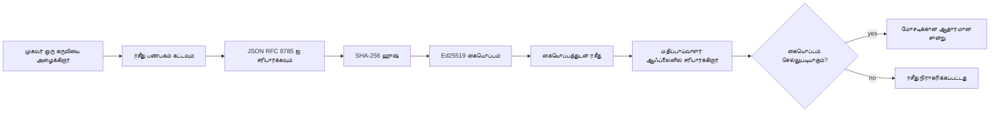
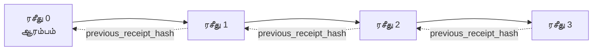

[பாடம் வீடியோவை பார்க்க: குறியாக்க ரசீத்களுடன் AI முகவரிகளை பாதுகாப்பது](https://youtu.be/PLACEHOLDER_VIDEO_ID)

> _(பாடம் வீடியோ மற்றும் சிற்று படத்தை மைக்ரோசாஃப்ட் உள்ளடக்க குழு கலந்தமையோடு சேர்க்கும், பாடம் 14 / 15 மாதிரியை இணைக்கும்.)_

# குறியாக்க ரசீத்களுடன் AI முகவரிகளை பாதுகாப்பது

## அறிமுகம்

இந்த பாடத்தில் விவரிக்கப்படும் தலைப்புகள்:

- AI முகவர்களுக்கான கணக்காய்வு தடயங்கள் பின்தொடர்தல் ஏன் பின்பற்றல், பிழை திருத்தம், மற்றும் நம்பிக்கைக்காக முக்கியமானவை என்பதை.
- குறியாக்க ரசீதின் பொருள் என்ன மற்றும் அது ஒப்பமையற்ற பதிவு வரியிலிருந்து எப்படி வேறுபடுகிறது என்பதை.
- ஒரு முகவரியின் கருவி அழைப்புக்கு கையெழுத்திடப்பட்ட ரசீதினை எளிய பைத்தானில் எவ்வாறு உருவாக்குவது என்பதை.
- ரசீதினை ஆஃப்லைனில் சரிபார்க்கும் முறை மற்றும் மாற்றங்களை கண்டறியும் முறையை.
- ரசீத்களை சங்கிலி வடிவில் இணைப்பது மற்றும் ஒன்றை அகற்றல் அல்லது மறுசீரமைப்பால் சங்கிலி முறியடைவதை.
- ரசீத்கள் என்ன சான்றளிக்கின்றன மற்றும் அவை தெளிவாக என்ன சான்றளிக்கவில்லை என்பதை.

## கற்றல் குறிக்கோள்கள்

இந்த பாடத்தை முடித்ததும், நீங்கள் தெரிந்துகொள்வீர்கள்:

- முகவர்களின் செயல்களுக்கு குறியாக்கத் தலைமுறை குறித்து ஊக்குவிக்கும் தோல்வி முறைகளை அடையாளம் காண.
- ஒரு அகவணுக்கான Ed25519 கையெழுத்திடப்பட்ட ரசீதினை canonical JSON தரவுக்கு உருவாக்க.
- ஒரு ரசீதினை அதன் கையெழுத்திடுபவரின் பொது திறவுகோலை மட்டுமே பயன்படுத்தி தனிப்பட்ட முறையில் சரிபார்க்க.
- மாற்றப்பட்ட ரசீதின் மீண்டும் சரிபார்த்தல் மூலம் திருட்டை கண்டறிய.
- ரசீத்களின் ஹாஷ் சங்கிலி வரிசையை உருவாக்கி சங்கிலியின் முக்கியத்துவத்தை விளக்கி அறிவு பெற.
- ரசீத்கள் சான்றளிக்கும் எல்லையை (ஏற்றுக்கொள்கை, நிலையமை, வரிசை) மற்றும் அவை சான்றளிக்காதவற்றை (செயல் சரியானது, கொள்கை நிலைத்தன்மை) அறிந்து கொள்.

## பிரச்சனை: உங்கள் முகவரியின் கணக்காய்வு தடயம்

புதியதாக ஒரு AI முகவரியை Contoso Travel உடன் விண்ணப்பித்துள்ளீர்கள் என்று கற்பனை செய்க. அந்த முகவர் வாடிக்கையாளர் கோரிக்கைகள் படித்து, விமானங்களுக்கான API அழைக்கிறது, மற்றும் வாடிக்கையாளர்களின் இடங்களை பதிவு செய்கிறது. கடந்த காலாண்டில் அந்த முகவர் 50,000 பதிவு செய்துள்ளது.

இன்று ஒரு கணக்காய்வாளர் வந்துள்ளார். அவர்கள் ஒரு எளிய கேள்வி கேட்கின்றனர்: "உங்கள் முகவர் என்ன செய்றான் என்று காட்டுங்கள்."

நீங்கள் உங்கள் பதிவுகளைக் கொடுக்கின்றீர்கள். கணக்காய்வாளர் அவற்றைப் பார்த்து கடினமான கேள்வி கேட்கின்றனர்: "இந்த பதிவுகள் திருத்தப்படவில்லை என்று என்னால் எப்படி உறுதி பெறலாம்?"

இதுதான் கணக்காய்வு தடயப் பிரச்சனை. பல முகவர் வடிவமைப்புகள் இன்று:

- **விண்ணப்பக் குறிப்புகள்**: முகவரி தானாக எழுதுவதாகவும், கோப்புச்சிஸ்டம் அணுகல் உள்ளவரால் எதுவும் திருத்தக்கூடியவையாகவும் இருக்கும்.
- **முகவரி கிளவுட் பதிவு சேவைகள்**: தள அளவில் மாற்றத்தைக் கண்டறியும் திறக்குடன் இருக்கின்றன, ஆனால் கணக்காய்வாளர் தள நிர்வாகியை நம்பினால் மட்டுமே.
- **தரவுத்தள பரிமாற்ற பதிவுகள்**: தரவுத்தள மாற்றங்களுக்கு பொருத்தமானவை, ஆனால் சாதாரண கருவி அழைப்புகளுக்கு பொருந்தாது.

இதில் எதுவும் கணக்காய்வாளரின் கேள்விக்குப் பதிலளிக்க முடியாது அவருக்கு யாரையும் நம்ப வேண்டிய தகுதி இல்லாமல் (நீங்கள், உங்க கிளவுட் வழங்குனர், உங்கள் தரவுத்தள வழங்குனர்). உள்ளக பயன்பாட்டுக்கு அந்த நம்பிக்கை ஏதாவது அளவில் ஏற்றுக்கொள்ளத்தக்கது. கட்டுப்படுத்தப்பட்ட பணி பகுதிகளில் (நிதி, சுகாதாரம், EU AI சட்டம் பின்பற்றல்) அது பொருந்தாது.

குறியாக்க ரசீத்கள் இதனைத் தீர்க்கின்றன, ஒவ்வொரு முகவர் செயலையும் தனித்துவமாகச் சரிபார்க்கக்கூடியதாகச் செய்கின்றன. கணக்காய்வாளர் உங்களை நம்ப தேவையில்லை. அவர்களுக்கு உங்கள் பொது திறவுகோலும் ரசீதும் மட்டுமே தேவை.

## குறியாக்க ரசீதா என்ன?

ரசீதானது ஒரு JSON பொருள் ஆகும், ஒரு முகவர் என்ன செய்ததென்பதை பதிவு செய்கிறது மற்றும் ஒரு டிஜிட்டல் கையெழுத்து உடன் கையெழுத்திடப்பட்டுள்ளது.


```mermaid
flowchart LR
    A[முகவர் ஒரு கருவியை அழைக்கிறார்] --> B[ரசீது பண்பகம் கட்டவும்]
    B --> C[JSON RFC 8785 ஐ சரிபார்க்கவும்]
    C --> D[SHA-256 ஹாஷ்]
    D --> E[Ed25519 கையொப்பம்]
    E --> F[கையொப்பத்துடன் ரசீது]
    F --> G[மதிப்பாய்வாளர் ஆஃப்லைனில் சரிபார்க்கிறார்]
    G --> H{கையொப்பம் செல்லுபடியாகும்?}
    H -- yes --> I[மோசடிக்கான ஆதாரமான சான்று]
    H -- no --> J[ரசீது நிராகரிக்கப்பட்டது]
```

மிகக் குறைந்த ரசீதானது இப்படிப்பட்டது:

```json
{
  "type": "agent.tool_call.v1",
  "agent_id": "contoso-travel-bot",
  "tool_name": "lookup_flights",
  "tool_args_hash": "sha256:a3f9c1...",
  "result_hash": "sha256:7b2e1d...",
  "policy_id": "contoso-travel-policy-v3",
  "timestamp": "2026-04-25T14:30:00Z",
  "sequence": 47,
  "previous_receipt_hash": "sha256:9d4e6a...",
  "signature": {
    "alg": "EdDSA",
    "sig": "c5af83...",
    "public_key": "8f3b2c..."
  }
}
```

மூன்று பண்புகள் இதில் செயற்படுகின்றன:

1. **கையெழுத்து**. ரசீதானது முகவரியின் வாயிலால் Ed25519 தனிப்பட்ட திறவுகோலைப் பயன்படுத்தி கையெழுத்திடப்பட்டுள்ளது. பொருத்த பொது திறவுகோல் கொண்டவர் யாரும் இந்த கையெழுத்தை ஆஃப்லைனில் சரிபார்க்க முடியும். எந்த புலமும் திருத்தப்பட்டால் கையெழுத்து செயலிழக்கும்.

2. **Canonical குறியாக்கம்**. கையெழுத்திடுவதற்கு முன், ரசீதானது JSON Canonicalization Scheme (JCS, RFC 8785) பயன்படுத்தி தொடர் வடிவில் மாற்றப்படுகிறது. இதனால் ஒரே தரமான ரசீதானை உற்பத்தி செய்யும் இரண்டு நடைமுறைகள் பைட் வரிசையாக ஒத்திருக்கின்றன. Canonicalization இல்லாமல், வெவ்வேறு JSON தொடர் மாற்றிகள் வெவ்வேறு கையெழுத்துக்களை உருவாக்குவார்கள்.

3. **ஹாஷ் சங்கிலி**. `previous_receipt_hash` புலம் ஒவ்வொரு ரசீதையும் அதன் முன்கூறப்பட்ட ரசீதோடு இணைக்கிறது. ஒரு ரசீதையை அகற்றுவது அல்லது மாற்றுவது அதன் பின்வரும் அனைத்து ரசீதுகளின் சங்கிலியையும் முறியடிக்கிறது. தனித்துவமான கையெழுத்துக்கள் தவிர்க்கப்பட்டாலும் சங்கிலி மட்டத்தில் திருட்டு தெளிவாகக் காணப்படும்.

இவை மூன்றும் சேர்ந்து மூன்று உறுதிமொழிகளை வழங்குகின்றன:

- **ஏற்றுக்கோள்**: இந்த திறவுகோல் இந்த உள்ளடக்கத்தை கையெழுத்திடியுள்ளது.
- **நிலையமை**: கையெழுத்திடப்பட்டபின்பும் உள்ளடக்கம் மாற்றப்படவில்லை.
- **வரிசை**: இந்த ரசீதானது அந்த ரசீதுக்குப் பொருந்துகிற சங்கிலியில் பிறகு வந்தது.

## பைத்தானில் ரசீதானை உருவாக்குவது

ரசீதானை உருவாக்க சிறப்பு நூலகம் தேவையில்லை. குறியாக்க அடிப்படைகள் பரவலாக கிடைக்கின்றன மற்றும் வழிகாட்டல் சிலத்தே பைத்தான் கோடுகளின் வரிசையாக இருக்கிறது.

`code_samples/18-signed-receipts.ipynb` இல் கைமுறைகளைப் பின்பற்றி முழு முறையை அறிந்துகொள்ளலாம். சுருக்கமாக:

```python
import json
import hashlib
import base64
from nacl import signing
from jcs import canonicalize  # RFC 8785 பழங்கூறு JSON

def b64url_nopad(data: bytes) -> str:
    return base64.urlsafe_b64encode(data).decode("ascii").rstrip("=")

def sha256_canonical(obj) -> str:
    """SHA-256 of a Python object's JCS-canonical JSON form."""
    return f"sha256:{hashlib.sha256(canonicalize(obj)).hexdigest()}"

# ஒரு கையெழுத்து விசையை உருவாக்கு அல்லது ஏற்றுக (உற்பத்தியில், ஒரு விசை கண்ணாடியில் சேமி)
signing_key = signing.SigningKey.generate()
verify_key = signing_key.verify_key

# ரசீதின் தரவுத்தொகுப்பை கட்டமைக்கவும் (கையெழுத்து இன்னும் இல்லை)
tool_args = {"origin": "SYD", "destination": "LAX"}
tool_result = [{"flight": "QF11", "price": 1850, "stops": 0}]

payload = {
    "type": "agent.tool_call.v1",
    "agent_id": "contoso-travel-bot",
    "tool_name": "lookup_flights",
    "tool_args_hash": sha256_canonical(tool_args),
    "result_hash": sha256_canonical(tool_result),
    "policy_id": "contoso-travel-policy-v3",
    "timestamp": "2026-04-25T14:30:00Z",
    "sequence": 0,
    "previous_receipt_hash": None,
}

# பழங்கூறாக்கவும், ஹாஷ் செய்யவும், கையெழுத்து வைக்கவும்.
canonical_bytes = canonicalize(payload)
message_hash = hashlib.sha256(canonical_bytes).digest()
signature_bytes = signing_key.sign(message_hash).signature

# ஒரு கட்டமைக்கப்பட்ட கையெழுத்து பொருளை இணைக்கவும்.
receipt = {
    **payload,
    "signature": {
        "alg": "EdDSA",
        "sig": b64url_nopad(signature_bytes),
        "public_key": b64url_nopad(bytes(verify_key)),
    },
}
```

இது முழு கையெழுத்து பணிமுறை. நோட்புக்கில் ஒவ்வொரு படியும் விளக்கமாக உள்ளது.

## ரசீதினை சரிபார்த்தல் மற்றும் திருட்டைக் கண்டறிதல்

சரிபா்தல் என்பது எதிர் செயல்பாடு:

```python
import base64
import hashlib
from nacl import signing
from nacl.exceptions import BadSignatureError
from jcs import canonicalize

def b64url_decode(s: str) -> bytes:
    padding = "=" * ((4 - len(s) % 4) % 4)
    return base64.urlsafe_b64decode(s + padding)

def verify_receipt(receipt: dict) -> bool:
    # கையொப்பம் ஒரு கட்டமைக்கப்பட்ட பொருளாகும்: {"alg", "sig", "public_key"}.
    sig_obj = receipt.get("signature")
    if not sig_obj or sig_obj.get("alg") != "EdDSA":
        return False

    # உண்மையில் கையெழுத்திடப்பட்டப் payload-ஐ மீண்டும் உருவாக்கவும் (கையொப்பத்தை தவிர எல்லாம்).
    payload = {k: v for k, v in receipt.items() if k != "signature"}

    canonical_bytes = canonicalize(payload)
    message_hash = hashlib.sha256(canonical_bytes).digest()

    try:
        verify_key = signing.VerifyKey(b64url_decode(sig_obj["public_key"]))
        verify_key.verify(message_hash, b64url_decode(sig_obj["sig"]))
        return True
    except BadSignatureError:
        return False
```

இந்த செயல்பாடு ஒரு ரசீதினை எடுத்துக் கொண்டு, கையெழுத்து செல்லுபடியாக இருந்தால் `True` வழங்கும், இல்லையெனில் `False`. எந்த நெட்வொர்க் அழைப்பு, சேவை சார்பு, மூன்றாம் பக்கம் நம்பிக்கை தேவையில்லை.

திருட்டைக் கண்டறிதல் செயல்பாட்டைப் பார்க்க, நோட்புக்கு பின்வரும் படிகளை மேற்கொள்கிறது:

1. செல்லுபடியாகும் ரசீதானை உருவாக்கி அதை சரிபார்க்க உறுதிப்படுத்தல்.
2. `tool_args_hash` புலத்தில் ஒரு பைட் மாற்றுதல்.
3. மீண்டும் சரிபார்த்து தோல்வியை காண்தல்.

இது ரசீத்கள் திருட்டு தெளிவாக இருப்பதை நிகழ்ச்சியாக எடுத்துக்காட்டுகிறது: சிறிய மாற்றமும் கையெழுத்தை முறியடிக்கும்.

## பல படிகள் உள்ள முகவர்களுக்கு ரசீத்கள் சங்கிலி கட்டமைத்தல்

ஒரே கையெழுத்திடப்பட்ட ரசீதான் ஒரு செயலை பாதுகாக்கிறது. ரசீத்களின் சங்கிலி ஒரு வரிசையை பாதுகாக்கிறது.


```mermaid
flowchart LR
    R0[ரசீது 0<br/>ஆரம்பம்] --> R1[ரசீது 1]
    R1 --> R2[ரசீது 2]
    R2 --> R3[ரசீது 3]
    R1 -. previous_receipt_hash .-> R0
    R2 -. previous_receipt_hash .-> R1
    R3 -. previous_receipt_hash .-> R2
```

ஒவ்வொரு ரசீதும் அதன் முன்கூறப்பட்ட ரசீதின் ஹாஷை பதிவு செய்கிறது. இரண்டு ரசீதின் சங்கிலியில் இரண்டாவது ரசீதானை அமைதியாக அகற்ற ஆளுமைச்சொல்லி செய்தால் அவன் செய்யவேண்டியவை:

- 3ஆம் ரசீதின் `previous_receipt_hash` புலத்தை மாற்றுதல் (3ஆம் ரசீதின் கையெழுத்து முறியடையும்), அல்லது
- மாற்றிய 3ஆம் ரசீதுக்கு ஒரு புதிய கையெழுத்தை உருவாக்குதல் (முகவரின் தனிப்பட்ட திறவுகோல் தேவை).

தனிப்பட்ட திறவுகோல் ஒரு ஹார்ட்வேர் திறவுகோல் மேசைத்தொகுதியில் இருந்தால், மற்றும் ஒவ்வொரு ரசீதுடனும் பொது திறவுகோலை வெளியிடினால், இரு முறைகேடுகளும் கண்டறியாமலிறப்பது சாத்தியமில்லாதது.

நோட்புக் பின்வரும் நடவடிக்கைகளை மேற்கொள்கிறது:

1. மூன்று ரசீத்களை சங்கிலி கட்டமைக்க.
2. ஒவ்வொரு ரசீதின் `previous_receipt_hash` முன்பு உள்ள ரசீதின் உண்மையான ஹாஷுடன் பொருந்துவதை சரிபார்க்க.
3. நடுவில் ஒரு ரசீதோடு திருட்டு செய்து சங்கிலி முறியடைவதை நீங்கள் பார்க்க.

இதுவே வெளிப்புற கணக்காய்வாளர் உங்களை நம்பாமல் சரிபார்க்க கூடிய கணக்காய்வு தடயத்தை உருவாக்கும் வழி.

## ரசீத்கள் சான்றளிக்கும் விஷயங்கள் (மற்றும் சான்றளிக்காதவை)

இது இந்த பாடத்தின் மிகவும் முக்கியமான பகுதி. ரசீத்கள் சக்திவாய்ந்தவை ஆனால் அவர்களின் சக்தி எல்லைப்படுத்தப்பட்டுள்ளது.

**ரசீத்கள் மூன்று விஷயங்களை சான்றளிக்கின்றன:**

1. **ஏற்றுக்கோள்**: ஒரு குறிப்பிட்ட திறவுகோல் ஒரு குறிப்பிட்ட தரவை கையெழுத்திட்டது.
2. **நிலையமை**: கையெழுத்திடப்பட்டபின்பு தரவு மாற்றப்படவில்லை.
3. **வரிசை**: இந்த ரசீதானது அந்த ரசீதுக்குப் பிறகு ஹாஷ் சங்கிலியில் வந்தது.

**ரசீத்கள் சான்றளிப்பதில்லை:**

1. **சரியான செயல்பாடு**: முகவரின் செயலல் சரியானது என்று. தவறு பதிலுக்கு ரசீதானை கையெழுத்திடலாம் போல சரியான பதிலுக்கு போல.
2. **கொள்கை பின்பற்றல்**: `policy_id`யில் குறிப்பிடப்பட்ட கொள்கை மதிப்பெண் செய்யப்பட்டதா, அல்லது அதுவே இந்த செயலை அனுமதிப்பதாக இருந்ததா என்பது. ரசீதானது என்ன கிழமைப்பட்டதோ அதையே பதிவு செய்கிறது; என்ன அமுல்படுத்தப்பட்டது அல்ல.
3. **திறவுகோலைரகமான அடையாளம்**: ரசீதானது "இந்த திறவுகோல் இந்த உள்ளடக்கத்தை கையெழுத்திட்டது" என்பதையே கூறுகிறது. "இந்த மனிதன் இது அனுமதித்தான்" என்பதைச் சொல்லாது. திறவுகோலை மனிதர் அல்லது நிறுவனம் உடன் இணைப்பது தனித்த அடையாள அமைப்பை (அட்டவணை, பொது திறவுகோல் பதிவக அமைப்பு, மற்றும் மற்றவை) கேட்கிறது.
4. **உள்ளீடுகளின் உண்மைத்தன்மை**: முகவர் மாற்றியுச் செய்யப்பட்ட உத்தரவினை பெறுவதும் அதற்கேற்ப செயல்படுவதும், ரசீதானது செயல்பாட்டை நம்பகமாக பதிவு செய்கிறது. ரசீத்கள் உள்ளீடு சரிபார்த்தலுக்கு பின் வருகிறது, அதற்கு மாற்றாக இல்லை.

இந்த எல்லை இரண்டு காரணத்திற்குப் பொருந்துகிறது:

- ரசீத்கள் அர்த்தமுள்ளதை தெரிவிக்கும்: முகவர் பழக்கவழக்கங்களை கணக்கெடுக்கும் மற்றும் திருட்டு தெளிவாக இருப்பதைக் காட்டுகிறது, கூடவே நிறுவன எல்லைகளை கடந்தாலும்.
- நீங்கள் இன்னும் தேவையான கூடுதல் அடுக்குகளை தெரிந்து கொள்க: உள்ளீடு சரிபார்த்தல் (பாடம் 6), கொள்கை அமல்படுத்தல் (கீழே சுருக்கமாக), மற்றும் அடையாள அமைப்பு (இந்த பாடத்துக்கு வெளியே).

பொதுவான பிழை "எங்களுக்கு ரசீத்கள் உண்டு" என்பதைக் குறியிடுவது "நாங்கள் கட்டுப்பாடுகளில் உள்ளோம்" என்று தவிர்க்கிறது. தினித்தாய். ரசீத்கள் அடித்தளம், கட்டுப்பாடு அதற்குப் மேலே கட்டப்படும் அமைப்பு.

## உற்பத்தியிலான குறிப்பு

இந்த பாடத்திலுள்ள பைத்தான் குறியீடு சீராக மிகக் குறைவாக உள்ளது, நீங்கள் ஒவ்வொரு வரியையும் வாசித்து சரியாக என்ன நடக்கிறது என்பதை புரிந்துகொள்ள. உற்பத்தி நிலைக்கு நீங்கள் இரண்டு வழிகளில் செல்லலாம்:

1. **குறியாக்க அடிப்படைகள் மீது நேரடியாக கட்டமைக்க**. மேலே 50 வரிகள் பல பயன்பாடுகளுக்கு போதுமானவை. PyNaCl (Ed25519) மற்றும் `jcs` தொகுப்பு (canonical JSON) நன்கு பராமரிக்கப்பட்ட மற்றும் ஆய்வு செய்யப்பட்ட நூலகங்கள்.

2. **உற்பத்தியிலான ரசீத நூலகம் பயன்படுத்த**. பல திறந்த மூல திட்டங்கள் அதே முறையை கூடுதல் அம்சங்களுடன் (திறவுகோல் மாற்றம், தொகுப்புச் சரிபார்ப்பு, JWK தொகுப்பு பகிர்வு, கொள்கை இயந்திரங்களுடன் இணைவு) செயல்படுத்துகின்றன:
   - இந்த பாடத்தில் பயன்படுத்தப்படும் ரசீத வடிவம் ஒரு IETF இணையத் தாளை (இணையக் காணொளி தொடர் வரைவு `draft-farley-acta-signed-receipts`) பின்பற்றுகிறது, தற்போது தரநிலைப் பிழைப்பாட்டில் உள்ளது.
   - Microsoft முகவர் ஆட்சி கருவிச்சங்கிலி ரசீத்களை Cedar அடிப்படையிலான கொள்கை முடிவுகளுடன் இணைக்கும்; அந்த களஞ்சியத்தில் பாடம் 33-இல் முழுமையான உதாரணம் உள்ளது.
   - `protect-mcp` (npm) மற்றும் `@veritasacta/verify` (npm) பொதுவான MCP சேவையகத்தை திருத்தமான கணக்காய்வு தடயத்துடன் மூடியுக்கொள்ள Node அடிப்படையிலான ரசீத கையெழுத்து மற்றும் ஆஃப்லைன் சரிபார்ப்பு வழங்கும்.
   - **[nobulex](https://github.com/arian-gogani/nobulex)** பைத்தான் SDK (`pip install nobulex`) அதே Ed25519 + JCS கையெழுத்து முறைமையை பைத்தானில் வழங்குகிறது, LangChain மற்றும் CrewAI ஒருங்கிணைப்புகளுடன், வெளியிடப்பட்ட குறுக்குச் சரிபார்ப்பு சோதனை வெக்கள் மற்றும் [OWASP PR #2210](https://github.com/OWASP/CheatSheetSeries/pull/2210) வழியாக பின்பற்றல் அமைப்பு தருகிறது.

உங்களே கையேடு அடி மென்பொருள் அல்லது நூலகம் பயன்படுத்துவது போன்ற முடிவுகள் JWT நூலகம் எழுதுவதோ மற்றும் சோதிக்கப்பட்ட ஒன்றைப் பயன்படுதுவதோ போன்றவை; இரண்டும் பொருத்தமானது; நூலகம் நேரத்தை மிச்சப்படுத்தி ஆய்வு பரப்பை குறைக்கும்; கையேடு முறையில் ஒவ்வொரு அடிப்படையையும் புரிந்து கொள்ள வேண்டும். இந்த பாடம் கையேடு முறையை கற்பிக்கும், அதனால் நீங்கள் இரு விருப்பத்திற்கும் அடித்தளமுடையவராக இருக்கலாம்.

## அறிவுப் பரிசோதனை

பயிற்சிப் பணி செய்ய முன்னர் உங்கள் புரிதலை சோதிக்கவும்.

**1. ஒரு ரசீதானது முகவரின் தனிப்பட்ட Ed25519 திறவுகோல் கொண்டு கையெழுத்திடப்படுகிறது. கணக்காய்வாளருக்கு பொது திறவுகோல் மட்டுமே உள்ளது. கணக்காய்வாளர் ரசீதின் கையெழுத்தை ஆஃப்லைனில் சரிபார்க்க முடியுமா?**

<details>
<summary>பதில்</summary>

ஆம். Ed25519 சரிபார்ப்பு பொது திறவுகோலும் கையெழுத்திட்ட பைட்டுச்சமூகமும் மட்டுமே தேவை. எந்த நெட்வொர்க் அழைப்பும், சேவை சார்ப்பையும் தேவையில்லை. இதுவே ரசீத்களை காற்றற்ற, பல-நிறுவன அல்லது குறைந்த நம்பிக்கை கொண்ட கணக்காய்வு சூழலில் பயனுள்ளதாகக் காண்பிக்கும் பண்பு.
</details>

**2. ஒரு முறைகேடுபவர் ரசீதின் `policy_id` புலத்தை மாற்றி அதை அதிக அனுமதி கொள்கையால் நிர்வகிக்கப்பட்டது என்று கூறுகிறான். கையெழுத்து அசல் தரவுக்காகவே இருந்தது. சரிபார்ப்பின் போது என்ன நடக்கும்?**

<details>
<summary>பதில்</summary>

சரிபார்ப்பு தோற்கிறது. கையெழுத்து அசல் தரவின் canonical பைட்டுகளின் மேல் கணக்கிடப்பட்டது; எந்த புலமும் மாற்றினால் canonical பைட்டுகள் மாறும், இது SHA-256 ஹாஷை மாற்றும், எனவே கையெழுத்து செல்லா ஆகும். முறைகேடுபவருக்கு புதிய செல்லுபடியாகும் கையெழுத்தை உருவாக்க தனிப்பட்ட திறவுகோல் தேவை, அது அவரிடம் இல்லை.
</details>

**3. ரசீதில் `tool_args_hash` மற்றும் `result_hash` உள்ளன, மூலக் குறி மற்றும் முடிவுகளைப் பதிலாக ஏன்?**

<details>
<summary>பதில்</summary>

இரண்டு காரணங்கள். முதலில், ரசீதுகள் காப்பகமோ அல்லது பரிமாற்ற இடங்களோ (PII, வணிக தரவு) வகையிலும் உள்ளடக்கம் வெளியேறுவது பிரச்சினை தரும் சூழலில் இருக்கலாம். ஹாஷ் ரசீதுகளின் அளவை சிறியது மற்றும் உள்ளடக்கம் தனிப்பட்டதாகக் காக்கும்; கணக்காய்வாளர் ஹாஷ் ராசிப்பை தனித்தனியாக சேமிக்கப்பட்ட உண்மையான உள்ளடக்கத்துடன் ஒப்பிடலாம். இரண்டாவது, ஹாஷ்களுக்கு நிரந்தர அளவுகள் உண்டு; உள்ளீடுகள் மற்றும் வெளியீடுகள் பெரியதே இருந்தாலும் ஹாஷுடன் ரசீதின் அளவு வரம்பு கொண்டதாக இருக்கும்.
</details>

**4. `previous_receipt_hash` புலம் ஒவ்வொரு ரசீதையும் அதன் முன்னையதுடன் இணைக்கிறது. ஒரு முறைகேடுபவர் சங்கிலியின் நடுவில் ஒரு ரசீதானை அமைதியாக நீக்கினால், என்ன தவறாகும்?**

<details>
<summary>பதில்</summary>

நீக்கப்பட்ட ரசீதுக்குப் பிறகு வந்த அனைத்து ரசீதுகளும் தவறானவை ஆகும். அவற்றின் `previous_receipt_hash` புலங்கள் உண்மையான சங்கிலியுடன் பொருந்தாது (ஏனெனில் அவர்கள் குறிப்பிட்ட ரசீதுகள் இனிமல் இல்லை, அல்லது சங்கிலி வேறு முன்னோடியைக் குறிக்கும்). நீக்கத்தை மறைக்க, முறைகேடுபவர் அடுத்த எல்லா ரசீதுகளையும் மீண்டும் கையெழுத்திட வேண்டியிருக்கும், அதற்கும் தனிப்பட்ட திறவுகோல் தேவை.
</details>

**5. ஒரு ரசீதானது சுத்தமாக சரிபார்க்கப்பட்டது. அது முகவரின் செயல் சரியானது, உரியவையொன்றா அல்லது கொள்கைக்கு ஏற்றதா என்பதை சான்றளிக்குமா?**

<details>
<summary>பதில்</summary>

இல்லை. செல்லுபடியான ரசீதானது மூன்று விஷயங்களை சான்றளிக்கிறது: ஏற்றுக்கோள் (இந்த திறவுகோல் இந்த உள்ளடக்கத்தை கையெழுத்திட்டது), நிலையமை (உள்ளடக்கம் மாற்றப்படவில்லை), மற்றும் வரிசை (இந்த ரசீதானது அந்த ரசீதுக்குப் பிறகு வந்தது). ஆனால் அது செயல் சரியானதா, `policy_id`யில் கொடுக்கப்பட்ட கொள்கை மதிப்பாய்வு செய்யப்பட்டதா, முகவர் ஒவ்வொரு விதியையும் பின்பற்றினாரா என்பதை சான்றளிப்பதில்லை. ரசீத்கள் முகவர் பழக்கவழக்கங்களை கணக்கெடுக்கும், அவை நிச்சயம் சரியானவை அல்ல. இது பாடத்தின் மிக முக்கிய எல்லையே.
</details>

## பயிற்சி பயிற்சி

`code_samples/18-signed-receipts.ipynb` திறந்து அனைத்து நான்கு பகுதிகளையும் முடிக்கவும்:

1. **பகுதி 1**: உங்கள் முதல் ரசீதினை கையெழுத்திட்டு சரிபார்க்கவும்.
2. **பகுதி 2**: ரசீதில் திருத்தம் செய்து சரிபார்ப்பு தோல்வியடையும் என்பதை கவனிக்கவும்.
3. **பகுதி 3**: மூன்று ரசீத்கள் சங்கிலி கட்டமைக்கவும் சங்கிலி நிலைமை சரிபார்க்கவும்.
4. **பகுதி 4**: Microsoft முகவர் கட்டமைப்புடன் உருவாக்கப்பட்ட முகவருக்கான மாதிரியை பயன்படுத்து: ஒரு கருவி அழைப்பை ரசீதுக்கையெழுத்துடன் மடக்கவும், பின்னர் ரசீதினை தனிநிலையில் சரிபார்க்கவும்.


**நீட்டிப்பு சவால் 1:** உங்கள் சொந்த தேர்வில் மேலதிக புலத்தைச் சேர்த்து ரசீதுப் பரிமாணத்தை விரிவாக்குங்கள் (உதாரணமாக, தடையாளத்திற்கான கோரிக்கை ஐடி), அதைச் சேர்க்க canonical கையொப்ப தத்துவத்தை புதுப்பிக்கவும், ரசீதின் சரிபார்ப்பு இன்னும் சுற்றுப்பாதையில் செயல்படுகிறதா என்பதை உறுதிப்படுத்தவும். பிறகு கையொப்பமிட்ட பிறகு அந்த புலத்தை மாற்றி சரிபார்ப்பு தோல்வியடையும் என்பதை உறுதிப்படுத்தவும். இது canonical குறியாக்கத்தின் ஒவ்வொரு பைட்டும் கையொப்பத்திற்கு எப்படி பங்களிக்கிறது என்பதை புரிந்து கொள்ள உதவுகிறது.

**நீட்டிப்பு சவால் 2:** உங்கள் இரண்டு ரசீதுகளை SHA-256 ஹாஷ் செய்யவும் (அவைகள் canonical பைட்டுகளை நிர்ணயிக்கப்பட்ட வரிசையில் ஒன்றாக இணைக்கவும்) மற்றும் மூன்றாம் ரசீதின் புதிய புலமாக அந்த ஹாஷ்சைக் கொண்டடுங்கள் பிறகு அதில் கையொப்பமிடவும். மூன்று ரசீதுகள் எல்லாம் இன்னும் சுற்றுப்பாதையில் செயல்படுகிறதா என்பதை சரிபார்க்கவும். நீங்கள் இப்போது ஒரே படி சேர்க்கை சான்றை உருவாக்கியிருக்கிறீர்கள்: மூன்றாம் ரசீதைக் கொண்டிருப்பவர் முதல் இரண்டு ரசீதுகள் கையொப்பமிடப்பட்ட நேரத்தில் இருந்ததை அதன் உள்ளடக்கங்களை வெளிப்படுத்தாமலே நிரூபிக்க முடியும். இது நிரந்தர வெளிப்படுத்தல் ரசீதுகள் அளவில் பயன்படுத்தும் முறை (Merkle உறுதிமொழிகள், RFC 6962).

## முடிவு

குறியாக்க ரசீதுகள் AI முகவரிகளுக்கு கீழ்க்காணும் கணக்கெடுப்பு பாதையை வழங்குகின்றன:

- **சுயமாக சரிபார்க்கக்கூடியவை:** பொதுக் திறவுகோல் கொண்ட எந்தக் கட்சியும் சரிபார்க்கலாம், சேவை சார்பற்றவை.
- **தவிர்க்க முடியாத மாற்றங்கள்:** எந்த மாற்றமும் கையொப்பத்தை செல்லாததாக்கும்.
- **போக்குவரத்துக்கு ஏற்றவை:** ரசீதுகள் சிறிய JSON கோப்புகள் ஆகும்; அவற்றை அகவைபடுத்தலாம், பரிமாறலாம், மற்றும் எங்கு வேண்டுமானாலும் சரிபார்க்கலாம்.
- **நிலைகள் பின்பற்றப்பட்டவை:** Ed25519 (RFC 8032), JCS (RFC 8785), மற்றும் SHA-256 ஆகிய பரவலாக பயன்படும் அடிப்படைகளின் மேல் கட்டப்பட்டவை.

அவை உள்ளீட்டு சரிபார்ப்பு, கொள்கை அமலாக்கம், அல்லது அடையாள அடிப்படையை மாற்றிக் கொள்ளாது. அவை அந்த அடித்தளங்களை உருவாக்குகின்றன. நீங்கள் ஒழுங்கு விதிக்கப்பட்ட பணிப்பெட்டிகளில், பல-நிறுவன வேலைப்பாடுகளில் அல்லது எதிர்கால கணக்குபார்வையாளர் உங்களை நம்புவார் என கருத முடியாத சூழலில் முகவரிகளை அமைக்கும்போது, ரசீதுகள் கணக்கெடுப்பு பாதையை நேர்மையாகக் கொண்டுவர உதவுகின்றன.

மிகவும் முக்கியமான எடுத்துக்காட்டு: ரசீதுகள் “யார் என்ன சொன்னார், எப்போது” என்பதை நிரூபிக்கின்றன. அது சொன்னது உண்மையாக இருந்தது அல்லது சரியானது என நிரூபிக்காது. அந்த வேறுபாட்டை கோடிசெய்ய வேண்டும். அது நேர்மையான தோற்றத்தையும் தவறாகக் காட்டும் தோற்றத்தையும் பிரிக்கிறது.

## உற்பத்தி கட்டுப்பாட்டு பட்டியல்

நீங்கள் இந்த பாடத்திலிருந்து எடுத்துக் கொண்டு உண்மையான சூழலில் ரசீதுடன் கையொப்பமிட்ட முகவரிகளை நிறுவ தயாராகும்போது:

- [ ] **கையொப்பமிடும் திறவுகோலை மேம்படுத்துநர் லேப்டாபிலிருந்து அகற்று.** Azure Key Vault, AWS KMS, அல்லது ஹார்ட்வேர் பாதுகாப்பு தொகுதி பயன்படுத்தவும். உங்கள் ரசீதுகளை கையொப்பமிடும் தனியார் திறவுகோல் நிரல் கட்டுப்பாட்டில் அல்லது பிளைன் உரையில் செயலித் தளங்களில் ஒருபோதும் இருக்கக் கூடாது.
- [ ] **சரிபார்ப்பு பொதுத் திறவுகோலை வெளியிடவும்.** கணக்குபார்வையாளர்கள் அதை ஆஃப்லைனில் சரிபார்க்க தேவையுள்ளது. பொதுவான முறை ஒரு JWK சீட் ஒரு பரவலாக அறியப்பட்ட URL இல் (RFC 7517), உதாரணமாக, `https://your-org.example.com/.well-known/agent-keys.json`.
- [ ] **சம்பந்தப்பட்ட சங்கிலியை வெளியிலேயே உறுதி செய்யவும்.** காலத்தோடு சமீபத்திய சங்கிலி தலை ஹாஷை ஒரு வெளிப்படை பதிவில் (Sigstore Rekor, RFC 3161 கால முத்திரை அதிகாரி, அல்லது இரண்டாவது உள்ளக அமைப்பு) பெறுபவர்களுக்கு "இந்த சங்கிலி இந்த நேரத்தில் இருந்தது" என உறுதி செய்ய.
- [ ] **ரசீதுகளை மாற்றமுடியாதவையாக சேமிக்கவும்.** இணைப்பு மட்டும் அடக்க நிலைத்தன்மை கொண்ட அட்டைகள் (Azure Storage மாற்றமுற்றுக் கொள்கைகளுடன், AWS S3 Object Lock) உள்ளக நபர் சேமிப்பு அடுக்கில் சரித்திரத்தை மறுபடியும் எழுதுவதைத் தடுக்கும்.
- [ ] **சேமிப்பு காலத்தை தீர்மானிக்கவும்.** பல ஒழுங்கு விதிவிலக்குகளுக்கு பல ஆண்டு சேமிப்புக் காலம் தேவை. ரசீதின் வளர்ச்சிக்கு திட்டமிடவும் (ஒவ்வொரு ரசீதும் சுமார் 500 பைட்டுகள்; ஒரு முகவர் தினமும் 10K அழைப்புகளைச் செய்கையில் ஆண்டுக்கு சுமார் 1.8 GB உருவாகும்).
- [ ] **ரசீதுகள் என்னை பொருந்தாது என்பதை ஆவணப்படுத்தவும்.** ரசீதுகள் உரிமை, ஒருங்கிணைப்பு, மற்றும் வரிசைப்படுத்தலை நிரூபிக்கின்றன. உங்கள் நடத்தல் வழிகாட்டி சேர்க்கப்பட்ட கட்டுப்பாடுகள் (உள்ளீட்டு சரிபார்ப்பு, கொள்கை அமலாக்கம், வீதக் கட்டுப்பாடு, அடையாள அடிப்படை) ரசீதுகளுடன் governance நிலைப்பாட்டிற்கு பக்கத்தில் இருக்கின்றன என்பதை தெளிவாக பட்டியலிட வேண்டும்.

### AI முகவரிகளை பாதுகாப்பது பற்றி கூடுதல் கேள்விகள் உள்ளனவா?

[Microsoft Foundry Discord](https://aka.ms/ai-agents/discord) இல் சேர்ந்து மற்ற கற்றலாளர்களுடன் சந்திக்கவும், அலுவலக நேரங்களில் கலந்து கொள்ளவும், உங்கள் AI முகவரிகளுக்கான கேள்விகளை பதிலளிக்கவும்.

## இந்த பாடத்துக்கு அப்பால்

இந்த பாடம் தனித் ரசீது கையொப்பமும் ஹாஷ்-சங்கிலி தொடர்களையும் படிக்கிறது. Governance நிலைப்பாட்டின் முன்னேற்றம் அடைவதன் போது வரும் சில மேம்பட்ட முறைமைகள் அதே அடிப்படைகளை அடிப்படையாகக் கொண்டவை:

- **தேர்வு வெளிப்படுத்தல்.** ஒரு ரசீதின் புலங்கள் சுயமாக உறுதி செய்யப்பட்ட போது (RFC 6962-பாணி Merkle மரம்), குறிப்பிட்ட புலங்களை குறிப்பிட்ட கணக்குபார்வையாளர்களுக்கு காட்டி மற்றவை மாறாமை நிரூபிக்க முடியும். ஒரே ரசீது முழுமையான கணக்கெடுப்பை (நற்செய்தி விரிவானதை விரும்பும்) மற்றும் தரவு குறைக்கும் விதிகள் (GDPR போன்ற, கணக்குபார்வையாளரை குறைந்தது பார்க்க விரும்பும்) இரண்டையும் பூர்த்தி செய்ய வேண்டும் என்றால் பயன்படும்.
- **ரசீது கைவிடுதல்.** கையொப்பமிடும் திறவுகோல் பதற்றமாக இருந்தால், அதனால் கையொப்பமிடப்பட்ட அனைத்து ரசீதுகளும் குறிப்பிட்ட நேரத்திலிருந்து நம்பகமற்றவையாக குறிக்க வேண்டிய வழி வேண்டும். நடுநிலை முறை: குறுகிய ஆயுள் கொண்ட கையொப்ப திறவுகோல்கள் மற்றும் ஒன்று வெளியிடப்பட்ட கைவிடல் பட்டியல், அல்லது வெளிப்படை பதிவு கைவிடல் பதிவுகளுடன்.
- **இருபக்கம் / பிரிக்கப்பட்ட கையொப்ப ரசீதுகள்.** சில செயல்பாடுகள் முன்ப_EXECUTION(`authorization_*`) மற்றும் பிறகு_EXECUTION(`result_*`) இரண்டு பகுதிகளாக பாகுபடுத்தப்பட்ட உள் வழங்கலை கையொப்பமிட்டு அதற்கு தனி கையொப்பம் அமைத்துவிடுகின்றன, இது உரிமைப்படுத்தல் தீர்வு மற்றும் காணப்பட்ட முடிவு வேறுவேறு நடிகர்களால் அல்லது வேறு நேரங்களில் தயாரிக்கப்படும்போது பயன்படும். இது இந்த பாடத்தில் கற்றுக் கொடுத்துள்ள ரசீதின் வடிவமைப்பில் மேலோட்டமாக சேர்க்கப்படுகிறது.
- **உளவமைப்பு சேர்க்கை.** ஒரு ரசீது நீங்கள் `result_hash` இல் வைத்துள்ள பைட்டுகளை முத்திரைப்படுத்தும். நிஜ உலக பயன்பாடுகள் ஒரு கருவி அழைப்பு முடிவுக்கு மேலானவை: முன்னணி தீர்வு காரணம் (மாடல் கணிப்பு, பரிசீலிக்கப்பட்ட விருப்பங்கள்,ஆதாரம் மற்றும் அதன் முழுமை, ஆபத்து நிலை, பொறுப்பு சங்கிலி, கதவு முடிவு) அனைத்தும்Payloadக்குள் இருக்க முடியும், ஒரே ரசீதால் முத்திரைப்படுத்தப்பட்டவை. இதனால் ரசீதின் வடிவமைப்பு குறைந்தபட்சமாக இருக்கும், ஆனால்Payload பரிமாணங்கள் துறையின்படி வளமாகவும்இருக்க முடியும்.
- **வெவ்வித செயல்பாட்டிற்கான ஒப்புதலான்மை.** ஒரே ரசீதின் படிவத்தின் பல சுயாதீன செயல்பாடுகள் (Python, TypeScript, Rust, Go) பகிர்ந்த சோதனை மாதிரிகளுடன் ஒத்திசைக்கின்றன. உங்கள் சொந்த செயல்பாட்டை கட்டுமானம் செய்யும்போது வெளியிடப்பட்ட மாதிரிகள் மீது சரிபார்த்தல் தொடர்பு பொருந்துதலை உறுதி செய்யும்.
- **பின்-குவாண்டம் மாற்றம்.** Ed25519 இப்போது பரவலாகவும் பயன்படுத்தப்படுகிறதாலும் அது குவாண்டத்தில் எதிர்ப்பதாக இல்லை. ரசீதின் வடிவம் கூற்றுத் திறனுள்ளதுபோல உள்ளது: `signature.alg` புலம் தேவையானபோது `ML-DSA-65` (NIST பின்-குவாண்டம் கையொப்ப தரநிலை) கொண்டு வரலாம். ரசீதுகள் இரட்டை கையொப்பமிடப்படும் மாற்றம் காலத்திற்கு திட்டமிடுங்கள்.

## கூடுதல் வளங்கள்

- <a href="https://datatracker.ietf.org/doc/draft-farley-acta-signed-receipts/" target="_blank">IETF இணைய-டிராஃப்ட்: இயந்திரத்திற்கிடையான அணுகல் கட்டுப்பாட்டிற்கான கையொப்பமிட்ட தீர்வு ரசீதுகள்</a>
- <a href="https://learn.microsoft.com/azure/ai-studio/responsible-use-of-ai-overview" target="_blank">பொறுப்பான AI அறிமுகம் (Azure AI)</a>
- <a href="https://datatracker.ietf.org/doc/html/rfc8032" target="_blank">RFC 8032: எட்வர்ட்ஸ்-வளைவு டிஜிட்டல் கையொப்பக் குறியீடு (EdDSA)</a>
- <a href="https://datatracker.ietf.org/doc/html/rfc8785" target="_blank">RFC 8785: JSON Canonicalization Scheme (JCS)</a>
- <a href="https://datatracker.ietf.org/doc/html/rfc6962" target="_blank">RFC 6962: சான்றிதழ் வெளிப்படைத்தன்மை</a> (தேர்வு வெளிப்படுத்தல் ரசீதுகள் பயன்படுத்தும் Merkle-மரம் கட்டமைப்பு)
- <a href="https://github.com/microsoft/agent-governance-toolkit/blob/main/docs/tutorials/33-offline-verifiable-receipts.md" target="_blank">Microsoft முகவர் ஆளுமை உதவிக்குறிகள் தொகுப்பு, பாட மாதிரி 33: ஆஃப்லைன்-சரிபார்க்கக்கூடிய தீர்வு ரசீதுகள்</a>
- <a href="https://github.com/ScopeBlind/agent-governance-testvectors" target="_blank">இந்த பாடத்தில் பயன்படுத்திய ரசீதின் படிவத்துக்கான செயல்பாட்டின் படி சோதனை மாதிரிகள்</a> (Apache-2.0)
- <a href="https://pynacl.readthedocs.io/" target="_blank">PyNaCl ஆவணம்</a> (Python இல் Ed25519)

## முந்தைய பாடம்

[கணினி பயன்பாட்டு முகவரிகளை உருவாக்குதல் (CUA)](../15-browser-use/README.md)

---

<!-- CO-OP TRANSLATOR DISCLAIMER START -->
**மறுப்பு**:
இந்த ஆவணம் AI மொழிபெயர்ப்பு சேவை [Co-op Translator](https://github.com/Azure/co-op-translator) பயன்படுத்தி மொழிபெயர்க்கப்பட்டுள்ளது. நாங்கள் துல்லியத்திற்காக முயற்சி செய்துள்ளோம், ஆனால் தானாக செய்யப்படும் மொழிபெயர்ப்புகளில் பிழைகள் அல்லது தவறுகள் இருக்கலாம் என்பதை கவனத்தில் கொள்ளவும். அசல் ஆவணம் அதன் தாய்மொழியில் அதிகாரப்பூர்வ ஆதாரமாக கருதப்பட வேண்டும். முக்கியமான தகவல்களுக்கு, தொழில்நுட்பமான மனித மொழிபெயர்ப்பு பரிந்துரைக்கப்படுகிறது. இந்த மொழிபெயர்ப்பைப் பயன்படுத்துவதால் ஏற்படும் எந்த தவறான புரிதல்கள் அல்லது தவறான விளக்கத்திற்கும் நாங்கள் பொறுப்பில்வில்லை.
<!-- CO-OP TRANSLATOR DISCLAIMER END -->