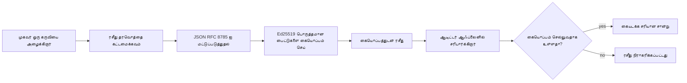
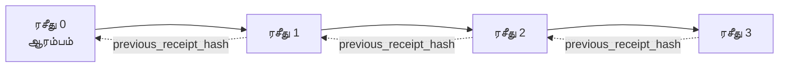

[பாடம் வீடியோவைப் பாருங்கள்: கிரிப்டோகிராபிக் ரசீது மூலம் AI முகவர்களை பாதுகாப்பது](https://youtu.be/PLACEHOLDER_VIDEO_ID)

> _(பாடம் வீடியோ மற்றும் தம்ப்நெயில் Microsoft உள்ளடக்க குழுவால் இணைப்புக்குப் பிறகு சேர்க்கப்படும், பாடம் 14 / 15 முறைபாட்டுடன் பொருந்தும்.)_

# கிரிப்டோகிராபிக் ரசீதுகளுடன் AI முகவர்களை பாதுகாப்பது

## அறிமுகம்

இந்த பாடத்தில் கையாளப்படும் விஷயங்கள்:

- நீங்கள் AI முகவர்களின் கணக்கெடுப்பு பாதைகள் சம்மந்தான அங்கீகாரம், பிழைத்திருத்தம் மற்றும் நம்பிக்கைக்காக ஏன் முக்கியம் என்பதை.
- ஒரு கிரிப்டோகிராபிக் ரசீது என்றால் என்ன மற்றும் அது துணையில்லாத பதிவீட்டு வரிகளுக்கு எப்படி வேறுபடுகிறது என்பதைக்.
- ஒரு முகவரின் கருவி அழைப்புக்கான கையொப்பம் பட்ட ரசீதை எளிய Python மூலம் எப்படி உருவாக்குவது என்பதைக்.
- ஒரு ரசீதை பூமி வெளிவாசல் முறையில் எப்படி சோதிக்கவும் மற்றும் திருட்டை கண்டறியவும்.
- ரசீதுகளை தொடுப்பதன் மூலம் ஒரையொன்றை அகற்ற அல்லது மறுசீரமைத்தால் தொடுப்பை உடைக்கும்.
- ரசீதுகள் என்ன சான்றிடுகின்றன மற்றும் அவை தெளிவாக என்ன சான்றிடுவதில்லை.

## கற்றல் இலக்குகள்

இந்த பாடத்தை முடித்த பிறகு நீங்கள் செய்யக்கூடியது:

- முகவர்களின் நடவடிக்கைகளுக்கான கிரிப்டோகிராபிக் ஆதாரம் தேவையான வெற்றிச் செயல்முறைகளை அடையாளம் காண்பது.
- ஒரு canonical JSON தகவலுக்கு Ed25519 கையொப்பப்பட்ட ரசீதை உருவாக்குவது.
- கையொப்பதாரரின் பொது திறவுகோலையொன்றை மட்டும் பயன்படுத்தி தனித்தனியே ரசீதை சரிபார்ப்பது.
- மாற்றியிருக்கலாம் என கணிக்கப்பட்ட ரசீதையொன்றை மீண்டும் சரிபார்த்து திருட்டு கண்டறிதல்.
- ரசீதுகளின் தொடுப்புச் சங்கிலியை கட்டமைத்து, தொடுப்பு ஏன் முக்கியமானது என்பதைக் விளக்குவது.
- ரசீதுகள் சான்றிடும் எல்லையை (கையொப்பம், ஒழுங்குமுறை, வரிசை) மற்றும் சான்றிடாதவைகள் (நடவடிக்கை சரியானதா, கொள்கை வலிமை) புரிந்துகொள்ளுதல்.

## பிரச்சனை: உங்கள் முகவரின் கணக்கெடுப்பு பாதை

Contoso பயணத்துக்கான AI முகவரை நீங்கள் வெளியிட்டதாக فرضியுங்கள். அந்த முகவர் வாடிக்கையாளர் கோரிக்கைகளைப் படித்து, விமானங்கள் API-ஐ அழைத்து விருப்பங்களைத் தேடும் மற்றும் வாடிக்கையாளர் சார்பாக இருக்கைகளை பதிவு செய்கிறது. கடந்த கால காலாண்டில், அந்த முகவர் 50,000 பதிவு செய்துள்ளார்.

இன்றைய தினத்தில் ஒரு ஆடிட்டர் வந்தார். அவன் ஒரு எளிய கேள்வி கேட்டார்: "உங்கள் முகவர் என்ன செய்தான் என்பதை காண்பியுங்கள்."

நீங்கள் உங்கள் பதிவு கோப்புகளை ஒப்படைத்தீர்கள். ஆடிட்டர் அவற்றைப் பார்த்து கடினமான கேள்வி கேட்டார்: "இவ்வாறு இருக்கும் பதிவுகள் திருத்தப்படாமல் இருப்பதை எப்படி உறுதிப்படுத்தலாம்?"

இதுதான் கணக்கெடுப்பு பாதை பிரச்சனை. இன்று பெரும்பாலும் முகவர் வேலைகள் reliance செய்கின்றன:

- **பயன்பாட்டு பதிவுகள்**: முகவர் தானே எழுதியவை, கோப்பு முறைமையை அணுகக்கூடிய எந்தவொருதான் திருத்த முடியும்.
- **மேக பதிவு சேவைகள்**: மேடையின் மட்டத்தில் திருட்டை வெளிப்படுத்துகிறது, ஆனால் ஆடிட்டர் அந்த மேடையின் இயக்குநருக்கு நம்பிக்கை வைப்பதற்கு மட்டும்.
- **தரவுத்தளம் பரிவர்த்தனை பதிவுகள்**: தரவுத்தள மாற்றங்களுக்கு சிறந்தது ஆனால் சாதாரண கருவி அழைப்புகளுக்கு அல்ல.

இவை எதுவும் ஆடிட்டர் கேள்விக்கு பதில் சொல்ல முடியாது அப்போது ஆடிட்டர் யாரோ ஒருவரை நம்ப வேண்டியிருக்கும் (நீங்கள், உங்கள் மேக சேவை வழங்குநர், உங்கள் தரவுத்தள விற்பனையாளர்). உள்ளக பயன்பாட்டிற்கு அந்த நம்பிக்கை ஏற்றுக்கொள்ளப்படக்கூடியது. ஆனாலும் கட்டுப்படுத்தப்பட்ட பணி (நிதி, சுகாதாரம், EU AI சட்டத்துக்கு உட்பட்டவை) சிலற்கானது இல்லை.

கிரிப்டோகிராபிக் ரசீதுகள் ஒவ்வொரு முகவர் நடவடிக்கையை தனித்தனியே சான்றளிக்கக்கூடியதாக மாற்றி இதை தீர்க்கின்றன. ஆடிட்டர் உங்களை நம்பத் தேவையில்லை. அவர்களுக்கு உங்கள் பொது திறவுகோல் மற்றும் ரசீதே போதும்.

## கிரிப்டோகிராபிக் ரசீது என்றால் என்ன?

ஒரு ரசீது என்பது ஒரு JSON பொருள் ஆகும், இது முகவர் என்ன செய்தார் என்பதைப் பதிவு செய்து அதனை டிஜிட்டல் கையொப்பத்துடன் கையொப்பமிடுகிறது.


```mermaid
flowchart LR
    A[முகவர் ஒரு கருவியை அழைக்கிறார்] --> B[ரசீது தரவொத்தை கட்டமைக்கவும்]
    B --> C[JSON RFC 8785 ஐ மட்டுப்படுத்துதல்]
    C --> E[Ed25519 பொருத்தமான பைட்டுகளை கையொப்பம் செய்]
    E --> F[கையொப்பத்துடன் ரசீது]
    F --> G[ஆடிட்டர் ஆஃப்லைனில் சரிபார்க்கிறார்]
    G --> H{கையொப்பம் செல்லுவதாக உள்ளதா?}
    H -- yes --> I[கையடக்க சரியான சான்று]
    H -- no --> J[ரசீது நிராகரிக்கப்பட்டது]
```

ஒரு குறைந்தபட்ச ரசீது இப்படிப்பட்டதாகக் காணப்படும்:

```json
{
  "type": "agent.tool_call.v1",
  "agent_id": "contoso-travel-bot",
  "tool_name": "lookup_flights",
  "tool_args_hash": "sha256:a3f9c1...",
  "result_hash": "sha256:7b2e1d...",
  "policy_id": "contoso-travel-policy-v3",
  "timestamp": "2026-04-25T14:30:00Z",
  "sequence": 47,
  "previous_receipt_hash": "sha256:9d4e6a...",
  "signature": {
    "alg": "EdDSA",
    "sig": "c5af83...",
    "public_key": "8f3b2c..."
  }
}
```

மூன்று பண்புகளும் வேலை செய்கின்றன:

1. **கையொப்பம்**. ரசீது Ed25519 தனிப்பட்ட திறவுகோலைப் பயன்படுத்தி முகவரின் வாயிலாக கையொப்பமிடப்பட்டுள்ளது. தொடர்புடைய பொது திறவுகோலை உடைய யாரும் அந்த கையொப்பத்தை பூமி வெளியில் சரிபார்க்க முடியும். எந்தவொரு புலமும் திருத்தப்படுவதைத் தொடர்ந்து கையொப்பம் செல்லாததாக மாறும்.

2. **அடிப்படையான குறியீட்டு முறையை** (Canonical encoding) குறியீட்டப்பட்ட JSON Canonicalization திட்டத்தை (JCS, RFC 8785) பயன்படுத்தி கையொப்பமிட்டிருக்கிறது. இதனால் உருப்படியொன்றுக்கு இரண்டு நடைமுறைகளாலும் ஐடியக்கேற்ப அவ்வாறே பைட் அடையாளம் செலுத்தும் வெளியீடு உருவாகின்றது. இதை பின்பற்றாமல் இருந்தால் வெவ்வேறு JSON குறியீட்டிகள் ஒரே உள்ளடக்கத்திற்கான வெவ்வேறு கையொப்பங்களை வழங்கும்.

3. **ஹாஷ் தொடுப்பம்**. `previous_receipt_hash` புலம் ஒவ்வொரு ரசீதையும் முன்பு வந்த ரசீதுவுடன் இணைக்கிறது. ஒரு ரசீதை அகற்றுதல் அல்லது மறுசீரமைத்தல் அதற்குப் பின் வந்த அனைத்து ரசீதுகளின் கையொப்பத்தையும் உடைக்கும். சித்திரவதுக்கும் ஒருங்கிணைப்புச் சங்கிலியில் தொலைவுகள் இருப்பதைக் காணப்படுத்தும்.

இந்த பண்புகள் ஒன்றிணைத்து மூன்று உறுதிப்பாடுகளை வழங்குகின்றன:

- **அடையாளம்**: இந்த திறவுகோல் இந்த உள்ளடக்கத்துக்கு கையொப்பமிட்டது.
- **தன்மைமை**: கையொப்பமிடுவதைத் தொடர்ந்து உள்ளடக்கம் மாறவில்லை.
- **வரிசை**: இது அந்த ரசீதுக்குப் பிறகு சங்கிலியில் வந்தது.

## Python-ல் ரசியை உருவாக்குதல்

ரசீதை உருவாக்க சிறப்பு நூலகம் தேவையில்லை. கிரிப்டோகிராபி அடிப்படைகள் பரவலாகக் கிடைக்கின்றன மற்றும் நம்முடைய லாஜிக் சில டசன்‌க்குறுகிய Python வரிகளாகும்.

`code_samples/18-signed-receipts.ipynb` என்ற திண்டாட்ட பயிற்சிகள் முழு ஓட்டத்தை நடைமுறைப்படுத்துகின்றன. சுருக்க நிலை:

```python
import json
import hashlib
import base64
from nacl import signing
from jcs import canonicalize  # RFC 8785 canonical JSON

def b64url_nopad(data: bytes) -> str:
    return base64.urlsafe_b64encode(data).decode("ascii").rstrip("=")

def sha256_canonical(obj) -> str:
    """SHA-256 of a Python object's JCS-canonical JSON form."""
    return f"sha256:{hashlib.sha256(canonicalize(obj)).hexdigest()}"

# ஒரு கையொப்ப விசையை உருவாக்க அல்லது ஏற்றவும் (உற்பத்தியில், ஒரு விசை வாயிலில் சேமிக்கவும்)
signing_key = signing.SigningKey.generate()
verify_key = signing_key.verify_key

# ரசீது தரவை கட்டமைக்கவும் (இப்போது எந்த கையொப்பமும் இல்லை)
tool_args = {"origin": "SYD", "destination": "LAX"}
tool_result = [{"flight": "QF11", "price": 1850, "stops": 0}]

payload = {
    "type": "agent.tool_call.v1",
    "agent_id": "contoso-travel-bot",
    "tool_name": "lookup_flights",
    "tool_args_hash": sha256_canonical(tool_args),
    "result_hash": sha256_canonical(tool_result),
    "policy_id": "contoso-travel-policy-v3",
    "timestamp": "2026-04-25T14:30:00Z",
    "sequence": 0,
    "previous_receipt_hash": None,
}

# JCS பைடுகளை நேரடியாகCanonicalize செய்து கையொப்பமிடவும். PureEdDSA அகற்றுகிறது உட்கட்டமைப்பாக.
canonical_bytes = canonicalize(payload)
signature_bytes = signing_key.sign(canonical_bytes).signature

# ஒரு கட்டமைக்கப்பட்ட கையொப்ப பொருளைattatch செய்யவும்.
receipt = {
    **payload,
    "signature": {
        "alg": "EdDSA",
        "sig": b64url_nopad(signature_bytes),
        "public_key": b64url_nopad(bytes(verify_key)),
    },
}
```

இது முழு கையொப்ப போக்குவரத்து ஆகும். நோட்புக்கில் ஒவ்வொரு படியையும் அடிக்கடி விளக்குகிறது.

## ரசீதை சரிபார்த்தல் மற்றும் திருப்பங்களை கண்டறிதல்

சரிபார்ப்பு என்பது எதிர் நடவடிக்கை:

```python
import base64
import hashlib
from nacl import signing
from nacl.exceptions import BadSignatureError
from jcs import canonicalize

def b64url_decode(s: str) -> bytes:
    padding = "=" * ((4 - len(s) % 4) % 4)
    return base64.urlsafe_b64decode(s + padding)

def verify_receipt(receipt: dict) -> bool:
    # கையெழுத்து என்பது ஒரு கட்டமைக்கப்பட்ட பொருள்: {"alg", "sig", "public_key"}.
    sig_obj = receipt.get("signature")
    if not sig_obj or sig_obj.get("alg") != "EdDSA":
        return False

    # உண்மையில் கையெழுத்திடப்பட்ட உள்ளடக்கத்தை மீட்டமைக்கவும் (கையெழுத்தை தவிர எல்லாம்).
    payload = {k: v for k, v in receipt.items() if k != "signature"}

    canonical_bytes = canonicalize(payload)

    try:
        verify_key = signing.VerifyKey(b64url_decode(sig_obj["public_key"]))
        verify_key.verify(canonical_bytes, b64url_decode(sig_obj["sig"]))
        return True
    except BadSignatureError:
        return False
```

இந்த செயல்பாடு ஒரு ரசீதை எடுத்து கையொப்பம் சரியானது என்றால் `True`, இல்லையெனில் `False` க்கு திருப்பும். எந்தவொரு நெட்வொர்க் அழையும், சேவை சார்பும், மூன்றாம் தரப்பில் நம்பிக்கை தேவையில்லை.

திருப்பப்படும் சோதனையை செயல்பாட்டில் காண, நோட்புக் செயல்முறை:

1. சரியான ரசீதை உருவாக்கி சரிபார்த்தல் உறுதிப்படுத்துதல்.
2. `tool_args_hash` புலத்தின் ஒரு பைட்டை மாற்றுதல்.
3. சரிபார்ப்பை மீண்டும் இயக்கி தோல்வி காண்தல்.

இதுவே ரசீதுக்கள் திருட்டை வெளிப்படுத்தும் என்பதை உண்மையில் காட்டும் சான்று : எந்தவொரு சிறிய மாற்றமும் கையொப்பத்தை உடைக்கும்.

## பல படி முகவர்களுக்கான ரசீதுகளை தொடரல்

ஒரு கையொப்பம் பட்ட ரசீது ஒரு நடவடிக்கையை பாதுகாக்கிறது. ரசீதுகளின் சங்கிலி ஒரு தொடர் நடவடிக்கைகளைக் காக்கிறது.


```mermaid
flowchart LR
    R0[ரசீது 0<br/>ஆரம்பம்] --> R1[ரசீது 1]
    R1 --> R2[ரசீது 2]
    R2 --> R3[ரசீது 3]
    R1 -. previous_receipt_hash .-> R0
    R2 -. previous_receipt_hash .-> R1
    R3 -. previous_receipt_hash .-> R2
```

ஒவ்வொரு ரசீதும் முன் உள்ள ரசீதின் ஹாஷை பதிவு செய்கிறது. ரசீது 2 ஐ அமைதியாக அகற்ற ஒரு ஹேக்கர் தேவையானது:

- ரசீது 3-ன் `previous_receipt_hash` புலத்தை மாற்றுதல் (ரசீது 3-ன் கையொப்பத்தை உடைக்கும்), அல்லது
- மாற்றிய ரசீது 3-ல் புதிய கையொப்பம் உருவாக்குதல் (முகவரின் தனிப்பட்ட திறவுகோலைக் கோருகிறது).

தனிப்பட்ட திறவுகோல் ஹார்ட்வேர் திறவுகோல் தங்குதடையிலிருந்தால் மற்றும் நீங்கள் ஒவ்வொரு ரசீதுக்கும் பொது திறவுகோலை பிரசுரித்தால், எந்தவொரு தாக்குதலுக்கும் கண்டறிதல் இல்லாமல் சாத்தியமில்லை.

நோட்புக் மூலம்:

1. மூன்று ரசீதுகளின் சங்கிலியை உருவாக்கல்.
2. ஒவ்வொரு ரசீதும் முன்பு வந்த ரசீதின் உண்மையான ஹாஷுடன் `previous_receipt_hash` பொருந்துவதை சரிபார்த்தல்.
3. இடையில் ஒரு ரசீதுடன் திருப்பம் செய்து சங்கிலி அந்தக் கட்டத்தில் துண்டிக்கப்படுவதை காண்தல்.

இதுவே வெளிப்புற ஆடிட்டர் உங்கள் மீது நம்பிக்கை வைக்காமல் சான்றளிக்கக்கூடிய கணக்கெடுப்பு பாதையை உருவாக்கும் முறை.

## ரசீதுகளால் சான்றளிக்கப்படும் மற்றும் சான்றளிக்காதவை

இப்பகுதி இந்த பாடத்தின் மிக முக்கியமானது. ரசீதுகள் சக்திவாய்ந்தவை ஆனால் அவற்றுக் காடப்படும் எல்லைகள் உள்ளன.

**ரசீதுகள் மூன்று விஷயங்களை சான்றுவிக்கின்றன:**

1. **அடையாளம்**: ஒரு குறிப்பிட்ட திறவுகோல் ஒரு குறிப்பிட்ட தகவலை கையொப்பமிட்டது.
2. **தன்மைமை**: அந்த தகவல் கையொப்பித்தபின் மாறவில்லை.
3. **வரிசை**: இந்த ரசீது அந்த ரசீதுக்குப் பிறகு ஹாஷ் சங்கிலியில் வந்தது.

**ரசீதுகள் சான்றளிக்காது:**

1. **தரமான தன்மை**: அந்த முகவரின் நடவடிக்கை சரியானது என்று. தவறான பதிலுக்கு கூட ரசீதுப் பத்திரம் கையொப்பமிடலாம்.
2. **கொள்கை ஒத்துழைப்பு**: `policy_id`-லில் குறிப்பிடப்பட்ட கொள்கை மெய்வாயாக மதிப்பீடு செய்யப்பட்டதா அல்லது அந்த செயலுக்கு அனுமதி தரப்பட்டதா என்பதில்லை. ரசீது பதிவுசெய்யும் அது என்ன கூறப்பட்டது என்பது, நிர்வகிக்கப்பட்டது அல்ல.
3. **திறவுகோலின் அப்பால் அடையாளம்**: ரசீது "இந்த திறவுகோல் இந்த உள்ளடக்கத்தை கையொப்பமிட்டது" என்று கூறுகிறது. "இந்த மனிதர் அனுமதி נתார்" என்பதைச் சொல்லவில்லை. திறவுகோலை மனிதர் அல்லது நிறுவனம் ஒன்றிற்கு இணைக்க தனித்துவ அடையாள வலைமை (அறிவியல், பொது திறவுகோல் பதிவு) தேவை.
4. **உள்ளீடுகளின் உண்மைத்தன்மை**: முகவர் மோசமாக மாற்றியவாறு சென்ற தெரிவை பெற்று அதில் செயல்பட்டால், ரசீது அதை விசுவாசமாக பதிவு செய்கிறது. ரசீதுகள் உள்ளீட்டு சரிபார்ப்பின் அடுத்த கட்டம், மாற்றுப்பொருள் இல்லை.

இந்த எல்லை இரண்டு காரணங்களுக்காக முக்கியம்:

- ரசீதுகள் எதற்கு பயனுள்ளன என்பதை கூறுகிறது: முகவர் நடத்தை கணக்கெடுப்புக்கு உட்படுத்தல் மற்றும் திரட்டல் வெளிப்படையாக ஆக்க மற்றும் நிறுவன எல்லைகளை கடந்தும்.
- நீங்கள் இன்னும் தேவைப்படும் கூடுதல் அடுக்குகளை கூறுகிறது: உள்ளீட்டு சரிபார்ப்பு (பாடம் 6), கொள்கை கடைபிடிப்பு (தாங்கிய விவரக்குறிப்பு), மற்றும் அடையாள அமைப்பு (இந்த பாடத்தின் பரப்பளவில் இல்லை).

பொதுவான பிழை "எங்களுக்கு ரசீதுகள் உள்ளன" என்று நினைத்தால் "நாம் ஆட்சி பெறுகிறோம்" என்று எண்ணபடும். அது அல்ல. ரசீதுகள் அடித்தளம். அண்மையில் நீங்கள் கட்டும் அமைப்பே ஆட்சி.

## ஒரு மனிதர் சரியான செயலுக்கு அனுமதி வழங்கியதை சான்றளித்தல்

மேலே உள்ள 3வது அம்சத்திற்கு தனிப்பட்ட பகுதி தேவை: ஒரு செயல்பாட்டு ரசீது "இந்த திறவுகோல் இந்த உள்ளடக்கத்தை கையொப்பம் இடியது" என்று சொல்கிறது, "ஒரு மனிதர் அதை அனுமதித்தார்" என அல்ல. அதிக ஆபத்தான நடவடிக்கைகளுக்கு (பின்னர் பணம் திரும்புதல், அழிப்புகள், வைர் மாற்றங்கள்) ஆட்சி அமைப்புகள் குறிப்பிட்ட அந்த இல்லாத கூற்றினை கோர்கின்றன, அது இப்பாடத்தில் நீங்கள் ஏற்கனவே உருவாக்கிய அடிப்படைகளுடன் தயாரிக்கக்கூடியது.

தொடரும் நோட்புக் `code_samples/human-authorization-receipts.ipynb` இரண்டாவது ரசீது வகை, `human.approval.v1`-ஐ அதே படிகபடையான வடிவில் சேர்க்கிறது (Ed25519 கையொப்பம் கண்டிப்பான JCS பைட்ட்களுடன், கையொப்பத்துடன் வெளியிருக்கும் `signature` பொருள் கொண்ட), ஒருவன் பெயருடைய approver முழு canonical செயலையும் அதனுடைய டைஜஸ்டையும் கையொப்பமிடுகிறார்; முகவரின் செயல்பாட்டு ரசீதில் அதே செயல்பாட்டு டைஜஸ்ட் மற்றும் `parent_approval_ref`, ஒப்புதல் ரசீதின் `receipt_hash` உள்ளது, அது நீங்கள் மேலே கட்டிய சங்கிலியில் உள்ளது போல `previous_receipt_hash` அடிப்படையில். ஒரு `verify_chain` இரண்டு ஆவணங்களையும் தனித்தனியான கையொப்ப கடவுள் பதிவுகளின் கீழ் (approver திறவுகோல்கள் vs முகவர் திறவுகோல்கள்) பரிசோதிக்கிறது, ஆகையால் குறியீட்டுப் பாதை பொதுவானவை ஆனாலும் அதிகாரிகள் ஒருபோதும் பொதுவானவர்களல்ல.

இது அந்த சொத்துக்கான முடிவு: *மனிதன் இந்த சரியான செயலுக்கு அனுமதி வழங்கினார், முகவர் அந்தச் செயல்பாட்டை துல்லியமாக நடைமுறைப்படுத்தின.* நோட்புக் நிராகரிப்பு வசதி இதன் உண்மையான தன்மையை உறுதி செய்கிறது:

- பாரம்பரியத் தொகுப்பு: திருட்டு, குழப்பப்பட்ட எதிரியாள், மீண்டும் ஆடல், இரு தரப்பிலும் கலப்புகளான திறவுகோல்கள், தவறான உள்ளீடு;
- **மண்மையான அதிகாரம்**: இன்னும் சரிபார்க்கக்கூடிய கையொப்பம், ஆனாலும் நிராகரிக்கப்பட்டது ஏனெனில் கொள்கை பதிப்பு நகர்த்தப்பட்டது, approver திறவுகோல் இணை மடக்கு பதிவில் இருந்து நீக்கப்பட்டது, அல்லது அனுமதி நிறைவு பெற்றிறது;
- **டிஜஸ்ட் மாற்றம்**: ஒரு செல்லுபடியான கையொப்பம் பட்ட செயல்பாட்டு ரசீது வேறு canonical செயலில் கட்டப்படும் ஒரு உண்மையான ஒப்புதலுக்குக் கண்காணிப்பதாக இருப்பது.

ஒவ்வொரு தோல்வியும் தனித்துவமான காரணத்துடன் நிராகரிக்கத் தவிர்க்கிறதனால், ஆடிட்டர் அதை வாசிக்கையில் அதிகாரம் பழுதடைந்ததா அல்லது செயல்பாடு மாறியதா என்பது தெளிகிறது. நோட்புக் கற்றுக்கொள்ளும் விதி: கையொப்பமிடப்பட்ட ஒப்புதல் அந்த அதிகாரம் அல்ல. அதிகாரம் இருப்பதைச் சேர்ந்தது இரு ரசீதுகளும் அவ்வாறே canonical செயலுடன் கட்டுப்பாட்டிற்கு உட்படும்போது மட்டுமே. மனித ஒப்புதல் ரசீது இப்பாடத்தால் உருவாக்கப்பட்ட கல்வி வடிவமைப்பு, `draft-farley-acta-signed-receipts` எனப்படும் ரசீதுகள் வகை அல்ல.

## உற்பத்தி குறிப்பு

இந்த பாடத்தில் Python குறியீடு குறைந்தது என்பதால் நீங்கள் ஒவ்வொரு வரியையும் பரibaliththu விளங்க முடிகிறது. உற்பத்தியில், விருப்பங்கள் இரண்டு:

1. **கிரிப்டோகிராபிக் அடிப்படைகளின் மீது நேரடியாக கட்டமைத்தல்.** மேல் 50 வரிகள் பல பயன்பாடுகளுக்கு போதுமானவை. PyNaCl (Ed25519) மற்றும் `jcs` தொகுப்பு (canonical JSON) நன்கு பராமரிக்கப்படும் மற்றும் ஆய்வு செய்யப்பட்ட நூலகங்கள்.

2. **உற்பத்தி ரசீது நூலகத்தைக் பயன்படுத்தல்.** பல திறந்த மூலத் திட்டங்கள் கூடுதல் அம்சங்களுடன் அதே வடிவ முறைபாடுகளை செயற்படுத்துகின்றன (திறவுகோல் மோதல், தொகுப்பு சரிபார்ப்பு, JWK தொகுப்பு பகிர்வு, கொள்கை இயந்திரங்களுடன் இணக்கம்):
   - கையொப்ப பொறுப்பு JCS மற்றும் கையொப்ப பரப்ப நிலைகளைக் கொண்ட தனியான IETF Internet-Draft ([`draft-farley-acta-signed-receipts`](https://datatracker.ietf.org/doc/draft-farley-acta-signed-receipts/), திருத்தம் 02). இந்த பாடம் உத்திகள் அடிப்படையிலான வசதி, அந்த வடிவமைப்பின் `{payload, signature}` கொலைப்பார்வைக்கு ஒத்துப்போகாது. அது பகிர்ந்த கான்ஃபாரமன்ஸ் தொகுப்பு ([agent-governance-testvectors](https://github.com/ScopeBlind/agent-governance-testvectors)) வெளியிடுகிறது.
   - Microsoft Agent Governance Toolkit ரசீதுகளை Cedar அடிப்படையிலான கொள்கை தீர்வுகளுடன் இணைக்கும்; அந்த நிரல человеку குறும்படமான Tutorial 33 ஐ பாருங்கள்.
   - `protect-mcp` (npm) மற்றும் `@veritasacta/verify` (npm) தொகுப்புகள் Node அடிப்படையிலான ரசீது கையொப்பம் மற்றும் பூமி வெளிக் சரிபார்ப்பை வழங்குகின்றன, அதுஅதே MCP சேவையகம் ஒரு திருப்ப கட்டுப்படுத்தப்பட்ட கணக்கெடுப்பு பாதையில், நிறுத்தப்பட்ட நடவடிக்கை ஒப்புதல் ரசீதுக் கட்டுப்பாட்டுடன் இணைக்கிறது (WebAuthn-ஆல் மேஜை வழியில் ஆதரவு), அதே மனித அங்கீகார நோட்புக் மாதிரியாக.
   - **[nobulex](https://github.com/arian-gogani/nobulex)** Python SDK (`pip install nobulex`) அதே Ed25519 + JCS கையொப்ப வடிவத்தை Python இல் LangChain மற்றும் CrewAI இணக்கமாக வழங்குகிறது, வெளியிடப்பட்ட குறுக்கு பரிசோதனை சோதனை தொகுப்பு மற்றும் ஒத்துழைப்பு வரைபடங்களை கொண்டுள்ளது [OWASP PR #2210](https://github.com/OWASP/CheatSheetSeries/pull/2210) மூலமாய்.

தம் சொந்த JWT நூலகம் எழுதிக் கொள்ளும் மற்றும் சோதனை செய்யப்பட்ட நூலகம் பயன்படுத்தும் இடையே உள்ள தீர்வு இப்படியே: இரண்டும் பொருத்தமானவை; நூலகம் நேரம் சேமிக்கிறது மற்றும் ஆய்வு பரப்பை குறைக்கும்; ஆரம்பத்திலிருந்து எழுப்பல் ஒவ்வொரு அடிப்படையையும் புரிந்து கொள்வதை வலுப்படுத்தும். இந்த பாடம் ஆரம்பத்திலிருந்து எழுப்பல் பாதையை கற்றுக்கொடுக்கிறது, நீங்கள் எது வேண்டுமானாலும் வர்த்தகத்தை அடிப்படையாகக் கற்றுக்கொள்ள.

## அறிவு சோதனை

நடைமுறை பயிற்சிக்குச் செல்லும் முன் உங்கள் புரிதலைப் பரிசோதிக்கவும்.

**1. ஒரு ரசீது முகவரின் தனிப்பட்ட Ed25519 திறவுகோல் கொண்டு கையொப்பமிடப்பட்டது. ஆடிட்டரிடம் பொது திறவுகோல் தான் உள்ளது. ஆடிட்டர் ரசீதை பூமி வெளியில் சரிபார்க்க முடியுமா?**

<details>
<summary>பதில்</summary>

ஆம். Ed25519 சரிபார்ப்புக்கு பொது திறவுகோல் மற்றும் கையொப்பப் பைட்கள்தான் தேவையானவை. எந்தவொரு நெட்வொர்க் அழைப்பு, சேவை சார்பு தேவையில்லை. இது ரசீதுகளை காற்றறைக்கப்பட்ட, பல்கூடிய அமைப்புகளுக்குள் அல்லது குறைந்த நம்பிக்கை கொண்ட கணக்கெடுப்பு சூழல்களில் பயனுள்ளதாக 만드는 பண்பு.
</details>

**2. ஒரு தாக்குபவர் ரசீதின் `policy_id` புலத்தை மாற்றி அது அதிக அனுமதி கொடுக்கும் கொள்கையால் ஆட்சி பெற்றதாகக் கூறுகிறார். கையொப்பம் அசல் தகவலுக்கு மட்டுமே ஆனது. சரிபார்ப்பின் போது என்ன நடக்கும்?**

<details>
<summary>பதில்</summary>


சரிபார்ப்பு தோல்வியடைகிறது. தயவுசெய்து அசல் பிலோடு மீதான கனொனிக்கல் பைட்டுகளின் மீது கையொப்பம் கணக்கிடப்பட்டது; எந்த புலத்தையும் மாற்றுவது அந்த பைட்டுக்களை மாற்றுகிறது, இது கையொப்பத்தை சரியானதல்லாததாக்கும். தாக்குதலை நடத்துபவர் புதிய செல்லுபடியான கையொப்பத்தை உருவாக்க தனிப்பட்ட விசை தேவைப்படும் என்பதால் அவர்கள் அவற்றை உடையவர்கள் அல்ல.
</details>

**3. ஏன் ரசீது `tool_args_hash` மற்றும் `result_hash` -ஐ கச்சா குறியீடுகளுக்கு மாற்றாமல் கொண்டுள்ளது?**

<details>
<summary>பதில்</summary>

இரண்டு காரணங்கள் உள்ளன. முதலில், ரசீது பெட்டிசெய்யப்படவோ அல்லது குறியாக்கம் செய்யப்படவோ செய்யப்படவேண்டிய சூழல்களில் அதன் அசல் உள்ளடக்கம் (PII, பலோட்டத் தரவு) வெளியேறுவது பிரச்சனையாக இருக்கலாம். ஹேஷிங் ரசீது சிறியதாகவும் உள்ளடக்கம் தனியுரிமையாகவும் வைக்க உதவுகிறது; ஆய்வாளர் ஹேஷ் தனிப்பட்ட முறையில் வைத்திருக்கும் உண்மையான உள்ளடக்கத்தின் நகலுடன் பொருந்துகிறதா என்று சரிபார்க்கிறார். இரண்டாவதாக, ஹேஷ்களுக்கு ஒரு நிலையான அளவு உள்ளது; உள்ளீடுகள் மற்றும் வெளியீடுகள் எவ்வளவு பெரியதாக இருந்தாலும் ஹேஷ்கள் கொண்ட ரசீது அளவை கட்டுப்படுத்துகிறது.
</details>

**4. `previous_receipt_hash` புலம் ஒவ்வொரு ரசீதையும் முன் சமூகத்திற்கு இணைக்கிறது. ஒரு தாக்குதலை நடத்துபவர் சங்கிலியின் நடுவே ஒரு ரசீதியை அமைதியாக நீக்கினால், என்ன தவறாக இருக்கும்?**

<details>
<summary>பதில்</summary>

நீக்கப்பட்ட ரசீதியுக்குப் பிற்படுத்த வந்த ஒவ்வொரு ரசீதும். அவற்றின் `previous_receipt_hash` புலங்கள் உண்மையான சங்கிலிக்கே பொருந்தாது (ஏனெனில் அவர்கள் குறிப்பிட்ட ரசீதிகள் இனி இல்லை அல்லது சங்கிலி வேறு முன் சமூகத்தைக் குறிப்பிடுகிறது). நீக்கத்தை மறைக்க, தாக்குதலை நடத்துபவர் பிறகு வரும் ஒவ்வொரு ரசீதையும் மீண்டும் கையொப்பமிட வேண்டியிருக்கிறது, அதற்கு தனிப்பட்ட விசை தேவை.
</details>

**5. ஒரு ரசீது முறையாக சரிபார்க்கப்படுகிறது. அதனால் முகவர் செயல் சரியானது, சடுதிச் செயல் அல்லது கொள்கைக்கு ஏற்பப்பட்டுள்ளது என நிரூபிக்குமா?**

<details>
<summary>பதில்</summary>

இல்லை. செல்லுபடியான ரசீது மூன்று விஷயங்களை நிரூபிக்கிறது: ஒதுக்கீடு (இந்த விசை இந்த உள்ளடக்கத்துக்கு கையொப்பமிட்டது), ஒருமைத்தன்மை (உள்ளடக்கம் மாற்றப்படவில்லை), மற்றும் வரிசை (இந்த ரசீது அந்த ரசீதைக்கு பிறகு வந்தது). இது செயல் சரியானதா, `policy_id`-யில் குறிப்பிடப்பட்ட கொள்கை உண்மையில் மதிப்பிடப்பட்டதா, அல்லது முகவர் ஒவ்வொரு விதியையும் பின்பற்றினார் என நிரூபிக்காது. ரசீது முகவரின் நடவடிக்கைகளை ஆய்விற்கு உகந்ததாகக் காட்டுகிறது, அவை அனைத்தும் சரி என்பதை அல்ல. இது பாடத்தின் மிக முக்கியமான எல்லை.
</details>

## பயிற்சி செயல்முறை

`code_samples/18-signed-receipts.ipynb`-ஐ திறந்துவிட்டு அனைத்து நான்கு பிரிவுகளையும் முடிக்கவும்:

1. **பிரிவு 1**: உங்கள் முதல் ரசீதுக்கு கையொப்பமிட்டு அதை சரிபார்க்கவும்.
2. **பிரிவு 2**: ரசீதுடன் மோசடி செய்து சரிபார்ப்பு தோல்வியை கவனிக்கவும்.
3. **பிரிவு 3**: மூன்று ரசீத்களின் சங்கிலியை உருவாக்கி சங்கிலி ஒருமைதன்மையை சரிபார்க்கவும்.
4. **பிரிவு 4**: Microsoft Agent கட்டமைப்பைப் பயன்படுத்தும் முகவருக்கு இந்த மாதிரியை பொருத்தி: ஒரு கருவி அழைப்பை ரசீது-கையொப்பத்தில் அலைப்பூசி சேர்க்கவும், பின்னர் தனித்தனியே ரசீதைக் சரிபார்க்கவும்.

**துணை சவால் 1:** உங்கள் விருப்பத்திற்கும் கூடுதல் புலமொன்றுடன் ரசீது அமைப்பினை விரிவாக்கு (உதாரணமாக, தேடலுக்கான கோரிக்கை ஐடி), கனொனிக்கல் கையொப்ப நிலையை அதில் சேர்க்கவும், மற்றும் ரசீது சரிபார்ப்பில் இன்னும் நடைப்பிரவேசமடைகிறது என்பதை உறுதிசெய்க. பிறகு கையொப்பம் செய்த பின் புலத்தை மாற்றி சரிபார்ப்பு தோல்வியை உறுதிப்படுத்துங்கள். இதனால் கனொனிக்கல் குறியாக்கத்தின் ஒவ்வொரு பைட்டும் கையொப்பத்திற்கு எப்படி பங்களிக்கிறது என்று நீங்கள் புரிந்து கொள்கின்றீர்கள்.

**துணை சவால் 2:** உங்கள் இரண்டு ரசீதுக்களின் SHA-256 ஹேஷ் செய்யவும் (அவர்களின் கனொனிக்கல் பைட்டுக்களை நிரந்தர வரிசையில் சேர்த்து) தீர்வைப் பெறப்பட்ட ஹேஷை மூன்றாவது ரசீதின் புதிய புலமாக சேர்க்கவும். மூன்று ரசீதுகளும் இன்னும் சரிபார்ப்பில் ஓடுகின்றன என்பதை உறுதிப்படுத்துங்கள். நீங்கள் இப்போது ஒரு படி சேர்க்கும் நிரூபிப்பை உருவாக்கியுள்ளீர்கள்: மூன்றாவது ரசீதுக்கு உடையவர் முதல் இரு ரசீதுகள் அப்போது இருந்தன என்பதை அவர்கள் உள்ளடக்கங்களை வெளியிடாமலேயே நிரூபிக்க முடியும். இது விருப்ப-வெளியீட்டு ரசீதுகள் அளவில் பயன்படுத்தும் மாதிரி (Merkle உறுதிப்பத்திரங்கள், RFC 6962).

## முடிவு

கிரிப்டோகிராபிக் ரசீதுகள் AI முகவர்களுக்கு auditable தடத்தை வழங்குகின்றன, அவை:

- **சுயமாக சரிபார்க்கக்கூடியவை**: பொதுவான விசை உடையவர்கள் யாரும் சரிபார்க்க முடியும், எந்த சேவை சார்பற்றுமானது.
- **மோசடி தெளிவாக**: எந்த மாற்றமும் கையொப்பத்தை செல்லாது ஆக செய்கிறது.
- **தொகுத்து போர்த்தக்கூடியவை**: ரசீது ஒரு சிறிய JSON கோப்பு; அதை சேமிக்கவும், பரிமாறவும், எங்கும் சரிபார்க்கவும் முடியும்.
- **தரநிலைகளுடன் ஒத்துப்போகும்**: Ed25519 (RFC 8032), JCS (RFC 8785), மற்றும் SHA-256 போன்ற பரவலாக பயன்படுத்தப்படும் அடிப்படைகள்.

அவை உள்ளீடு சரிபார்ப்பு, கொள்கை கடைபிடிப்பு, அல்லது அடையாள அமைப்புக்கு பதிலல்ல. அவை அவற்றுக்கான அடித்தளமாகும். நீங்கள் விதிகளால் கட்டுப்படும் பணிகள், பன்முகப்படுத்தப்பட்ட ஒருங்கிணைக்கும் பிரடிகளுக்கு முகவர்களை அனுப்பும் போது, எதிர்கால ஆய்வாளர் உங்களை நம்பாமலிருக்கக் கூடும் சூழலில் இதுவே audit தடத்தை நேர்மையாக வைப்பது.

மிக முக்கியமான எடுத்துக்காட்டு: ரசீத்கள் யார் என்ன சொன்னார் மற்றும் எப்போது சொன்னார்கள் என்பதை நிரூபிக்கின்றன. அவர்கள் சொன்னது உண்மை அல்லது சரியானது என்று நிரூபிக்காது. அந்த வேறுபாட்டை உறுதியாக கையோரத்தில் வைத்துக்கொள்ளுங்கள். இது ஒரு நேர்மையான மூலதனம் அமைப்புக்கும் தவறானதிற்குமான வித்தியாசம்.

## உற்பத்தி சோதனை பட்டியல்

இந்த பாடத்திலிருந்து வெளியேறி உண்மையான சூழலில் ரசீது-கையொப்ப முகவர்களை உருவாக்க தயாராகும்போது:

- [ ] **கையொப்ப விசையை டெவலப்பர் லேப்டாப்பிலிருந்து அகற்றவும்.** Azure Key Vault, AWS KMS, அல்லது ஹார்ட்வேர் பாதுகாப்பு முறை சாதனம் பயன்படுத்து. உங்கள் ரசீதுக்கு தனிப்பட்ட விசை ஒருபோதும் மூலக் கட்டுப்பாட்டில் அல்லது அப்பிளிகேஷன் ஊருணியில் சரள உரையாக இருக்கக்கூடாது.
- [ ] **சரிபார்ப்புப் பொதுவாரிய விசையை வெளியிடவும்.** ஆய்வாளர்கள் அதனை ஆஃப்லைனில் சரிபார்க்க வேண்டும். வழக்கமான மாதிரி JWK தொகுப்பு இறுதி URL-இல் (RFC 7517), உதாரணமாக, `https://your-org.example.com/.well-known/agent-keys.json`.
- [ ] **சங்கிலியை வெளியில் உறுதிப்படுத்தவும்.** சமயசார்ந்த போது சமீபத்திய சங்கிலி தலை ஹேஷை வெளிச்சுருக்கலை பதிவு செய்யவும் (Sigstore Rekor, RFC 3161 காலமுத்திரை அதிகாரி, அல்லது ஒரு இரண்டாம் உள் அமைப்பு) எனில் வெளிப்புற தரப்பினர் "இந்த சங்கிலி அந்த நேரத்தில் இருந்தது" என்பதை உறுதிப்படுத்தலாம்.
- [ ] **ரசீதுகளை மாற்றமில்லாமல் சேமிக்கவும்.** நேர்மறை மட்டும் சேமிப்பு (Azure Storage with immutability policies, AWS S3 Object Lock) உள்நாட்டு ஒருவரால் வரலாற்று திருத்தம் தடுக்கும்.
- [ ] **தக்க ஊதியம் திட்டமிடவும்.** பல பாதுகாப்பு விதிகள் பலாண்டு சேமிப்பை கேட்கின்றன. ரசீதின் வளர்ச்சியை திட்டமிடவும் (ஒவ்வொரு ரசீதும் சுமார் 500 பைட்டுகள்; ஒரு முகவர் 10,000 அழைப்புகள் நாளில் செய்யும் போது ஆண்டிற்கு சுமார் 1.8 GB தரவு உற்பத்தி).
- [ ] **ரசீதுகள் பணிகள் செய்யாததை ஆவணப்படுத்தவும்.** ரசீதுகள் ஒதுக்கீடு, ஒருமைத்தன்மை மற்றும் வரிசையை நிரூபிக்கின்றன. உங்கள் இயக்க திட்டத்தில் உள்ளீடு சரிபார்ப்பு, கொள்கை கடைபிடிப்பு, வீதம் கட்டுப்பாடு, அடையாள அமைப்புகள் போன்ற கூடுதல் கட்டுப்பாடுகளை இருப்பதை தெளிவாக எழுத்துச்செய்யவும்.

### AI முகவர்களை பாதுகாப்பதில் மேலும் கேள்விகள் உள்ளதா?

[Microsoft Foundry Discord](https://aka.ms/ai-agents/discord) சேர்ந்து மற்ற பயிற்சியாளர்களை சந்திக்கவும், அலுவலக நேரங்களுக்கு வரவும், உங்கள் AI முகவர் கேள்விகளுக்கு பதில்கள் பெறு.

## இந்த பாடத்திலிருந்து அடுத்த கட்டம்

இந்த பாடம் ஒரே ரசீது கையொப்பம் மற்றும் ஹேஷ் சங்கிலி தொடர்களை ஆள்கிறது. அதே அடிப்படைகள் பல மேம்பட்ட மாதிரிகளாக ஒரு தலையணையாக மாறி உங்களின் ஆட்சிக் கட்டமைப்பு வளர்ந்தபோது நீங்கள் சந்திக்கக்கூடியவை:

- **தேர்ந்தெடுக்கப்பட்ட வெளிப்படுத்தல்.** ஒரு ரசீது புலங்கள் சுயமாக உறுதிசெய்யப்பட்டபோது (RFC 6962-பாணி Merkle மரம்), நீங்கள் குறிப்பிட்ட புலங்களை குறிப்பிட்ட ஆய்வாளர்களுக்கு வெளிப்படுத்தி மற்றவை மாற்றப்படவில்லை என நிரூபிக்கலாம். அதே ரசீது ஒரு முழுமையான ஆய்வுக் கோரிக்கைக்கு (முழுமையை விரும்பும்) மற்றும் தரவு குறைப்பு விதிகளுக்கு (GDPR போன்றவைகள்) பொருந்தியிருக்கும் போது உதவும்.
- **ரசீது ரத்துசெய்தல்.** கையொப்ப விசை களங்கப்பட்டால், அந்த விசையால் கையொப்பமிடப்பட்ட அனைத்து ரசீதுகளையும் நேர்மறையாக இருந்து விலக்க நினைவாற்றல் வேண்டும். வழக்கமான மாதிரிகள்: குறுகிய ஆயுள் கையொப்ப விசைகள் மற்றும் வெளிப்படுத்தப்பட்ட ரத்துசெய்தல் பட்டியல்கள், அல்லது வெளிச்சுருக்கலில் உள்ள அளவுருக்கள்.
- **இருபுற/பகுதி கையொப்ப ரசீது.** சில செயலாக்கங்கள் கையொப்பம் வைக்கப்படும் பிலோடு-முன் (`authorization_*`) மற்றும் பிலோடு-பின் (`result_*`) பகுதிகளை சுயமான கையொப்பங்களுடன் பிரிக்கின்றன, இது ஒழுங்கு முடிவும், கண்டறியப்பட்ட முடிவும் வெவ்வேறு நபர்களால் அல்லது வேறு நேரங்களில் உருவாக்கப்பட்டபோது பயன்படும். இது பாடத்தில் கற்றுக் கொண்ட ரசீது வடிவங்கத்தினை மேலே சேர்க்கிறது.
- **பிலோடு தொகுப்பு.** ஒரு ரசீது நீங்கள் `result_hash`-இல் வைக்கும் பைட்டுக்களை பூட்டி வைக்கிறது. உண்மை உலக பிலோடுகள் பலமாக இருக்கலாம்: முன்கூட்டிய முடிவு காரணித்தல் (மாதிரி முன்னறிவு, பரிசீலிக்கப்பட்ட விருப்பங்கள், சான்றுகள் மற்றும் அவற்றின் நிறைவுச்செயல், அபாய நிலைமை, பொறுப்புமுறை சங்கிலி, கதவு முடிவு) அனைத்தும் ஒரு ரசீதில் அடைக்கலாம். இது ரசீது வடிவத்தை குறைந்தளவுடையவையாக வைத்திருக்கும் போதும் பிலோடு திட்டங்கள் துறை வியபாரமாக வளரச் செய்யும்.
- **இணை தேவை நிறைவேற்றம்.** ஒரே ரசீது வடிவத்தின் பல சுயாதீன செயலாக்கங்கள் (Python, TypeScript, Rust, Go) பகிர்ந்த சோதனை குறியைகளுக்கு எதிராக தங்கமாக சரிபார்க்கின்றன. நீங்கள் உங்கள் சொந்த செயலாக்கத்தை உருவாக்கினால், வெளியிடப்பட்ட குறியீடுகளுடன் ஒப்பிடுவது வயர் பொருந்துதலை உறுதிசெய்கிறது.
- **பிற்பகுதி-கொய்டிய பரிமாற்றம்.** Ed25519 இன்றைய பரவலான கையொப்பம் இருப்பினும் குவாண்டம் பொறுப்பற்றது. ரசீது வடிவம் ஆல்காரிதம்-சூழல் வளமைக்கூடியது: `signature.alg` புலம் தேவையான போது `ML-DSA-65` (NIST பிற்பகுதி-குவாண்டம் கையொப்ப நெறிமுறை) ஏற்றுக்கொள்ளலாம். ரசீதுகள் இரட்டை கையொப்பமாக இருக்கும் மாற்ற நெறிப்பட்டது திட்டமிடவும்.

## கூடுதல் வளங்கள்

- <a href="https://datatracker.ietf.org/doc/draft-farley-acta-signed-receipts/" target="_blank">IETF Internet-Draft: Signed Decision Receipts for Machine-to-Machine Access Control</a>
- <a href="https://learn.microsoft.com/azure/ai-studio/responsible-use-of-ai-overview" target="_blank">பொறுப்புச்சார் AI கண்ணோட்டம் (Azure AI)</a>
- <a href="https://datatracker.ietf.org/doc/html/rfc8032" target="_blank">RFC 8032: எட்வர்ட்ஸ்-வளைவு டிஜிட்டல் கையொப்ப அல்காரிதம் (EdDSA)</a>
- <a href="https://datatracker.ietf.org/doc/html/rfc8785" target="_blank">RFC 8785: JSON கனொனிக்கல் திட்டம் (JCS)</a>
- <a href="https://datatracker.ietf.org/doc/html/rfc6962" target="_blank">RFC 6962: சான்றிதழ் வெளிச்சுருக்கல்</a> (Merkle மரம் கட்டுமானம் தெரிவு-வெளியீட்டு ரசீதுகளுக்கு பயன்படுத்தப்படுகிறது)
- <a href="https://github.com/microsoft/agent-governance-toolkit/blob/main/docs/tutorials/33-offline-verifiable-receipts.md" target="_blank">Microsoft Agent Governance Toolkit, Tutorial 33: ஆஃப்லைன்-சரிபார்க்கக்கூடிய தீர்வு ரசீதுகள்</a>
- <a href="https://github.com/ScopeBlind/agent-governance-testvectors" target="_blank">இந்த பாடத்தில் பயன்படுத்தப்படும் ரசீதின் குறியீட்டு வடிவத்திற்கு மேற்கோள் சோதனை குறியீடுகள் (Apache-2.0)</a>
- <a href="https://pynacl.readthedocs.io/" target="_blank">PyNaCl ஆவணம்</a> (Python-இல் Ed25519)

## முந்தைய பாடம்

[உள்ளூர் AI முகவர்களை உருவாக்குதல்](../17-creating-local-ai-agents/README.md)

---

<!-- CO-OP TRANSLATOR DISCLAIMER START -->
**மறுப்பு**:
இந்த ஆவணம் AI மொழிபெயர்ப்பு சேவை [Co-op Translator](https://github.com/Azure/co-op-translator) பயன்படுத்தி மொழிபெயர்க்கப்பட்டுள்ளது. நாங்கள் துல்லியத்திற்காக முயற்சி செய்துள்ளோம், ஆனால் தானாக செய்யப்படும் மொழிபெயர்ப்புகளில் பிழைகள் அல்லது தவறுகள் இருக்கலாம் என்பதை கவனத்தில் கொள்ளவும். அசல் ஆவணம் அதன் தாய்மொழியில் அதிகாரப்பூர்வ ஆதாரமாக கருதப்பட வேண்டும். முக்கியமான தகவல்களுக்கு, தொழில்நுட்பமான மனித மொழிபெயர்ப்பு பரிந்துரைக்கப்படுகிறது. இந்த மொழிபெயர்ப்பைப் பயன்படுத்துவதால் ஏற்படும் எந்த தவறான புரிதல்கள் அல்லது தவறான விளக்கத்திற்கும் நாங்கள் பொறுப்பில்வில்லை.
<!-- CO-OP TRANSLATOR DISCLAIMER END -->