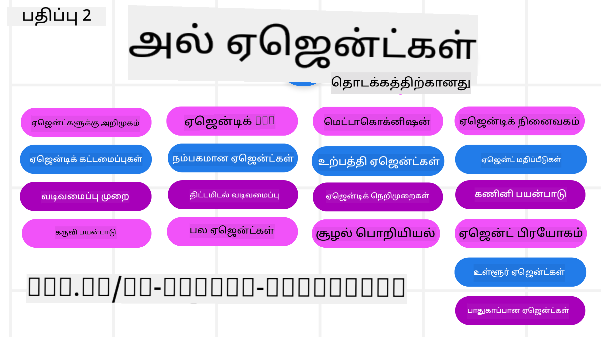

<!--
CO_OP_TRANSLATOR_METADATA:
{
  "original_hash": "b3581c11869b3563f33773adfb011949",
  "translation_date": "2025-12-25T00:25:11+00:00",
  "source_file": "README.md",
  "language_code": "ta"
}
-->
# ஆரம்பக்காரர்களுக்கான AI முகவர்கள் - ஒரு பாடநெறி

## AI முகவர்களை உருவாக்கத் தொடங்குவதற்குத் தேவையான அனைத்தையும் கற்பிக்கும் ஒரு பாடநெறி

### 🌐 பலமொழி ஆதரவு

#### GitHub Action மூலம் ஆதரிக்கப்படுகிறது (தானியக்கமாகவும் எப்போதும் புதுப்பிக்கப்பட்டதாகவும்)

<!-- CO-OP TRANSLATOR LANGUAGES TABLE START -->
[அரபு](../ar/README.md) | [பெங்காலி](../bn/README.md) | [பல்கேரியன்](../bg/README.md) | [பர்மீஸ் (மியான்மர்)](../my/README.md) | [சீன (சுருக்கப்பட்ட)](../zh/README.md) | [சீன (பாரம்பரிய, ஹாங்காங்)](../hk/README.md) | [சீன (பாரம்பரிய, மக்காவ்)](../mo/README.md) | [சீன (பாரம்பரிய, தைவான்)](../tw/README.md) | [குரோஷியன்](../hr/README.md) | [செக்](../cs/README.md) | [டேனிஷ்](../da/README.md) | [டச்சு](../nl/README.md) | [எஸ்டோனியன்](../et/README.md) | [பின்னிஷ்](../fi/README.md) | [பிரஞ்சு](../fr/README.md) | [ஜெர்மன்](../de/README.md) | [கிரேக்கம்](../el/README.md) | [ஹீப்ரூ](../he/README.md) | [ஹிந்தி](../hi/README.md) | [ஹங்கேரியன்](../hu/README.md) | [இந்தோனேஷியன்](../id/README.md) | [இத்தாலியன்](../it/README.md) | [ஜப்பானிய](../ja/README.md) | [கன்னடம்](../kn/README.md) | [கொரியன்](../ko/README.md) | [லிதுவேனியன்](../lt/README.md) | [மலாய்](../ms/README.md) | [மலையாளம்](../ml/README.md) | [மராத்தி](../mr/README.md) | [நேபாளி](../ne/README.md) | [நைஜீரியன் பிட்ஜின்](../pcm/README.md) | [நார்வேஜியன்](../no/README.md) | [பெர்ஷியன் (பார்ஸி)](../fa/README.md) | [போலிஷ்](../pl/README.md) | [போர்ச்சுகீஸ் (பிரேசில்)](../br/README.md) | [போர்ச்சுகீஸ் (போர்ச்சுகல்)](../pt/README.md) | [பஞ்சாபி (குர்முக்வி)](../pa/README.md) | [ரோமேனியன்](../ro/README.md) | [ரஷியன்](../ru/README.md) | [செர்பியன் (சிரிலிக்)](../sr/README.md) | [ஸ்லோவாக்](../sk/README.md) | [ஸ்லோவேனியன்](../sl/README.md) | [ஸ்பானிஷ்](../es/README.md) | [ஸ்வாஹிலி](../sw/README.md) | [ஸ்வீடிஷ்](../sv/README.md) | [டாகாலோக் (பிலிப்பினோ)](../tl/README.md) | [தமிழ்](./README.md) | [తെಲుగు](../te/README.md) | [தை](../th/README.md) | [துருக்கிஷ்](../tr/README.md) | [உக்ரைனியன்](../uk/README.md) | [உருது](../ur/README.md) | [வியட்நாமீஸ்](../vi/README.md)
<!-- CO-OP TRANSLATOR LANGUAGES TABLE END -->

**மேலும் மொழிபெயர்ப்புகளை விரும்பினால், ஆதரிக்கப்படும் மொழிகள் [இங்கே](https://github.com/Azure/co-op-translator/blob/main/getting_started/supported-languages.md) பட்டியலிடப்பட்டுள்ளன**

## 🌱 துவக்கம்

இந்த பாடநெறியில் AI முகவர்கள் கட்டமைப்பதற்கான அடிப்படகக் குறிப்பு பாடங்கள் உள்ளன. ஒவ்வொரு பாடமும் தனித்தொரு தலைப்பை கையாள்கிறது, ஆகையால் நீங்கள் விரும்பிய இடத்தில் தொடங்கலாம்!

இந்த பாடநெறிக்கு பலமொழி ஆதரவு உள்ளது. எங்கள் [கிடைக்கக்கூடிய மொழிகள் இங்கே](../..) சென்று பாருங்கள். 

இது Generative AI மாதிரிகளுடன் முதன்முறையாக கட்டமைக்குவது என்றால், 21 பாடங்கள் கொண்ட எங்கள் [Generative AI தொடக்கர்களுக்கான](https://aka.ms/genai-beginners) பாடநெறியைப் பார்க்கவும், இது GenAI-வுடன் கட்டமைப்பதற்கு சம்பந்தப்பட்ட பாடங்களை உள்ளடக்கியது.

இந்த ரெப்போகு [நட்சத்திரம் (🌟) செய்ய](https://docs.github.com/en/get-started/exploring-projects-on-github/saving-repositories-with-stars?WT.mc_id=academic-105485-koreyst) மற்றும் குறியீட்டை இயக்க உங்கள் நகலை உருவாக்க [இந்த ரெப்போகை ஃபோர்க் செய்ய](https://github.com/microsoft/ai-agents-for-beginners/fork) மறவாதீர்கள்.

### பிற பயிலாளர்களை சந்திக்கவும், உங்கள் கேள்விகளுக்கு பதில்கள் பெறுங்கள்

AI முகவர்கள் கட்டமைப்பதில் சிக்கினால் அல்லது கேள்விகள் இருந்தால், எங்கள் அர்ப்பணிக்கப்பட்ட Discord சேனலில் இணையுங்கள்: [Microsoft Foundry Discord](https://aka.ms/ai-agents/discord).

### தேவையானவை

இந்த பாடநெறியின் ஒவ்வொரு பாடத்திலும் code_samples கோப்பகத்தில் காணப்பெறும் குறியீட்டு உதாரணங்கள் உள்ளன. உங்கள் சொந்த நகலை உருவாக்க [இந்த ரெப்போகை ஃபோர்க் செய்ய](https://github.com/microsoft/ai-agents-for-beginners/fork)லாம்.  

இந்த பயிற்சி பயிற்சிகளிலுள்ள குறியீடு, மொழி மாதிரிகளுடன் தொடர்பு கொள்ள Azure AI Foundry மற்றும் GitHub Model Catalogs-ஐ பயன்படுத்துகிறது:

- [GitHub மாதிரிகள்](https://aka.ms/ai-agents-beginners/github-models) - இலவசம் / வரையறுக்கப்பட்டது
- [Azure AI Foundry](https://aka.ms/ai-agents-beginners/ai-foundry) - Azure கணக்கு தேவை

இந்த பாடநெறி மேலும் Microsoft வழங்கும் பின்தொடர்பான AI முகவர் ஃப்ரேம்வேர்கள் மற்றும் சேவைகளை பயன்படுத்துகிறது:

- [Microsoft Agent Framework (MAF) - புதியது!](https://aka.ms/ai-agents-beginners/agent-framewrok)
- [Azure AI Agent சேவை](https://aka.ms/ai-agents-beginners/ai-agent-service)
- [Semantic Kernel](https://aka.ms/ai-agents-beginners/semantic-kernel)
- [AutoGen](https://aka.ms/ai-agents/autogen)

க்யாமர்க் குறியீட்டை இப்பட்ட பாடநெறிக்காக இயக்குவதற்கான மேலதிக தகவலுக்கு, [பாடநெறி அமைப்பு](./00-course-setup/README.md) பக்கத்தை பார்க்கவும்.

## 🙏 உதவ விரும்புகிறீர்களா?

எந்தவொரு பரிந்துரைகள் அல்லது இலக்கண/குறியீட்டு பிழைகள் கண்டிருந்தீர்களா? [ஒரு பிரச்சனையை எழுப்பவும்](https://github.com/microsoft/ai-agents-for-beginners/issues?WT.mc_id=academic-105485-koreyst) அல்லது [ஒரு புல் கோரிக்கையை உருவாக்கவும்](https://github.com/microsoft/ai-agents-for-beginners/pulls?WT.mc_id=academic-105485-koreyst)

## 📂 ஒவ்வொரு பாடத்திலும் உள்ளவை

- README இல் உள்ள எழுதப்பட்ட பாடம் மற்றும் ஒரு குறுகிய காணொளி
- Azure AI Foundry மற்றும் GitHub மாதிரிகளை (இலவசம்) ஆதரிக்கும் Python குறியீடு உதாரணங்கள்
- மேலும் கற்க உதவும் வளங்களுக்கான இணைப்புகள்

## 🗃️ பாடங்கள்

| **பாடம்**                                   | **உரை மற்றும் குறியீடு**                            | **காணொளி**                                                  | **கூடுதல் கற்றல்**                                                                     |
|----------------------------------------------|----------------------------------------------------|------------------------------------------------------------|----------------------------------------------------------------------------------------|
| AI முகவர்களின் அறிமுகம் மற்றும் பயன்படுத்தும் வழிகள்       | [இணைப்பு](./01-intro-to-ai-agents/README.md)          | [காணொளி](https://youtu.be/3zgm60bXmQk?si=z8QygFvYQv-9WtO1)  | [இணைப்பு](https://aka.ms/ai-agents-beginners/collection?WT.mc_id=academic-105485-koreyst) |
| AI முகவரியல் கட்டமைப்புகளை ஆராய்தல்              | [இணைப்பு](./02-explore-agentic-frameworks/README.md)  | [காணொளி](https://youtu.be/ODwF-EZo_O8?si=Vawth4hzVaHv-u0H)  | [இணைப்பு](https://aka.ms/ai-agents-beginners/collection?WT.mc_id=academic-105485-koreyst) |
| AI முகவரியல் வடிவமைப்பு மாதிரிகளைப் புரிந்து கொள்வது     | [இணைப்பு](./03-agentic-design-patterns/README.md)     | [காணொளி](https://youtu.be/m9lM8qqoOEA?si=BIzHwzstTPL8o9GF)  | [இணைப்பு](https://aka.ms/ai-agents-beginners/collection?WT.mc_id=academic-105485-koreyst) |
| கருவி பயன்பாட்டு வடிவமைப்பு மாதிரி                      | [இணைப்பு](./04-tool-use/README.md)                    | [காணொளி](https://youtu.be/vieRiPRx-gI?si=2z6O2Xu2cu_Jz46N)  | [இணைப்பு](https://aka.ms/ai-agents-beginners/collection?WT.mc_id=academic-105485-koreyst) |
| முகவரியல் RAG                                  | [இணைப்பு](./05-agentic-rag/README.md)                 | [காணொளி](https://youtu.be/WcjAARvdL7I?si=gKPWsQpKiIlDH9A3)  | [இணைப்பு](https://aka.ms/ai-agents-beginners/collection?WT.mc_id=academic-105485-koreyst) |
| நம்பகமான AI முகவர்களை கட்டமைத்தல்               | [இணைப்பு](./06-building-trustworthy-agents/README.md) | [காணொளி](https://youtu.be/iZKkMEGBCUQ?si=jZjpiMnGFOE9L8OK ) | [இணைப்பு](https://aka.ms/ai-agents-beginners/collection?WT.mc_id=academic-105485-koreyst) |
| திட்டமிடல் வடிவமைப்பு மாதிரி                      | [இணைப்பு](./07-planning-design/README.md)             | [காணொளி](https://youtu.be/kPfJ2BrBCMY?si=6SC_iv_E5-mzucnC)  | [இணைப்பு](https://aka.ms/ai-agents-beginners/collection?WT.mc_id=academic-105485-koreyst) |
| பல முகவர்கள் வடிவமைப்பு மாதிரி                   | [இணைப்பு](./08-multi-agent/README.md)                 | [காணொளி](https://youtu.be/V6HpE9hZEx0?si=rMgDhEu7wXo2uo6g)  | [இணைப்பு](https://aka.ms/ai-agents-beginners/collection?WT.mc_id=academic-105485-koreyst) |
| மெட்டகாக்னிஷன் வடிவமைப்பு மாதிரி                 | [இணைப்பு](./09-metacognition/README.md)               | [காணொளி](https://youtu.be/His9R6gw6Ec?si=8gck6vvdSNCt6OcF)  | [இணைப்பு](https://aka.ms/ai-agents-beginners/collection?WT.mc_id=academic-105485-koreyst) |
| தயாரிப்பில் உள்ள AI முகவர்கள்                      | [இணைப்பு](./10-ai-agents-production/README.md)        | [வீடியோ](https://youtu.be/l4TP6IyJxmQ?si=31dnhexRo6yLRJDl)  | [இணைப்பு](https://aka.ms/ai-agents-beginners/collection?WT.mc_id=academic-105485-koreyst) |
| எஜென்டிக் நெறிமுறைகள் (MCP, A2A மற்றும் NLWeb) பயன்படுத்துதல் | [இணைப்பு](./11-agentic-protocols/README.md)           | [வீடியோ](https://youtu.be/X-Dh9R3Opn8)                                 | [இணைப்பு](https://aka.ms/ai-agents-beginners/collection?WT.mc_id=academic-105485-koreyst) |
| AI முகவர்களுக்கு சூழல் பொறியியல்            | [இணைப்பு](./12-context-engineering/README.md)         | [வீடியோ](https://youtu.be/F5zqRV7gEag)                                 | [இணைப்பு](https://aka.ms/ai-agents-beginners/collection?WT.mc_id=academic-105485-koreyst) |
| எஜென்டிக் நினைவக மேலாண்மை                      | [இணைப்பு](./13-agent-memory/README.md)     |      [வீடியோ](https://youtu.be/QrYbHesIxpw?si=vZkVwKrQ4ieCcIPx)                                                      |                                                                                        |
| Microsoft Agent Framework-ஐ ஆராய்தல்                         | [இணைப்பு](./14-microsoft-agent-framework/README.md)                            |                                                            |                                                                                        |
| கணினி பயன்பாட்டு முகவர்கள் (CUA) உருவாக்குதல்           | விரைவில் வரும்                            |                                                            |                                                                                        |
| விரிவாக்கக்கூடிய முகவர்களை அமைத்தல்                    | விரைவில் வரும்                            |                                                            |                                                                                        |
| உள்ளூர் AI முகவர்களை உருவாக்குதல்                     | விரைவில் வரும்                               |                                                            |                                                                                        |
| AI முகவர்களை பாதுகாப்பு                           | விரைவில் வரும்                               |                                                            |                                                                                        |

## 🎒 மற்ற பாடநெறிகள்

எங்கள் குழு பிற பாடநெறிகளை தயாரிக்கிறது! பார்க்கவும்:

<!-- CO-OP TRANSLATOR OTHER COURSES START -->
### LangChain

---

### Azure / Edge / MCP / Agents

---
 
### Generative AI Series

[-9333EA?style=for-the-badge&labelColor=E5E7EB&color=9333EA)](https://github.com/microsoft/Generative-AI-for-beginners-dotnet?WT.mc_id=academic-105485-koreyst)
[-C084FC?style=for-the-badge&labelColor=E5E7EB&color=C084FC)](https://github.com/microsoft/generative-ai-for-beginners-java?WT.mc_id=academic-105485-koreyst)
[-E879F9?style=for-the-badge&labelColor=E5E7EB&color=E879F9)](https://github.com/microsoft/generative-ai-with-javascript?WT.mc_id=academic-105485-koreyst)

---
 
### Core Learning

---
 
### Copilot Series

<!-- CO-OP TRANSLATOR OTHER COURSES END -->

## 🌟 சமூக நன்றிகள்

Agentic RAG-ஐ விளக்கும் முக்கிய குறியீட்டு மாதிரிகளை வழங்கிய [Shivam Goyal](https://www.linkedin.com/in/shivam2003/) அவருக்கு நன்றி. 

## பங்களிப்பு

இந்த திட்டம் பங்களிப்புகளையும் பரிந்துரைகளையும் வரவேற்கிறது. பெரும்பாலான பங்களிப்புகள் Contributor License Agreement (CLA) ஐ நீங்கள் ஒப்புக்கொள்ள வேண்டியதைக் கோரும்; அதில் நீங்கள் உங்கள் பங்களிப்பைப் பயன்படுத்துவதற்கான உரிமையை கொண்டிருப்பதாகவும், உண்மையில் அதை நமக்கு வழங்குவதாகவும் அறிவிக்கப்பட வேண்டும். விவரங்களுக்கு, <https://cla.opensource.microsoft.com> ஐப் பாருங்கள்.

ஒரு pull request சமர்ப்பிக்கும்போது, ஒரு CLA bot தானாகவே நீங்கள் CLA ஐ வழங்க வேண்டுமா என்று தீர்மானித்து PR-ஐ சரியாக குறிச்சொற்களால் (உதாரணத்திற்கு, நிலைச் சரிபார்ப்பு, கருத்து) அலங்கரிக்கும். bot வழங்கும் வழிமுறைகளைப் பின்பற்றுங்கள். எங்கள் CLA-யை பயன்படுத்தும் அனைத்து தொகுப்புக் களிலும் இதை நீங்கள் ஒருமுறை மட்டும் செய்ய வேண்டியிருக்கும்.

இந்தத் திட்டம் [Microsoft Open Source Code of Conduct](https://opensource.microsoft.com/codeofconduct/) ஐ ஏற்றுக்கொண்டது.
மேலும் தகவலுக்கு [Code of Conduct FAQ](https://opensource.microsoft.com/codeofconduct/faq/) ஐப் பாருங்கள் அல்லது கூடுதல் கேள்விகள் அல்லது கருத்துகளுக்காக [opencode@microsoft.com](mailto:opencode@microsoft.com) என்ற மின்னஞ்சலை தொடர்பு கொள்ளுங்கள்.

## வர்த்தக அடையாளங்கள்

இந்தத் திட்டத்தில் திட்டங்கள், தயாரிப்புகள் அல்லது சேவைகளுக்கான வர்த்தக அடையாளங்கள் அல்லது லோகோக்கள் இருக்கலாம். Microsoft வர்த்தக அடையாளங்கள் அல்லது லோகோக்களின் அங்கீகரிக்கப்பட்ட பயன்பாடு [Microsoft's Trademark & Brand Guidelines](https://www.microsoft.com/legal/intellectualproperty/trademarks/usage/general) ஐ பின்பற்றுவதற்கு உட்பட்டது மற்றும் அவற்றுக்கு அமையும். இந்தத் திட்டத்தின் மாற்றியமைக்கப்பட்ட பதிப்புகளில் Microsoft வர்த்தக அடையாளங்கள் அல்லது லோகோக்கள் பயன்படுத்தப்படும்போது குழப்பத்தை ஏற்படுத்தக்கூடாது அல்லது Microsoft ஆதரவைக் குறிக்கக் கூடாது. மூன்றாம் கட்சி வர்த்தக அடையாளங்கள் அல்லது லோகோக்களின் எந்தவொரு பயன்பாடும் அந்த மூன்றாம் கட்சிகளின் கொள்கைகளுக்கு உட்பட்டதாகும்.

## உதவி பெறுதல்

If you get stuck or have any questions about building AI apps, join:

If you have product feedback or errors while building visit:

---

<!-- CO-OP TRANSLATOR DISCLAIMER START -->
மறுப்புரை:
இந்த ஆவணம் AI மொழிபெயர்ப்பு சேவை [Co-op Translator](https://github.com/Azure/co-op-translator) மூலம் மொழிபெயர்க்கப்பட்டுள்ளது. நாங்கள் துல்லியத்திற்காக முயற்சித்திருந்தாலும், தானாக செய்யப்பட்ட மொழிபெயர்ப்புகளில் பிழைகள் அல்லது தவறுகள் இருக்கக்கூடும் என்பதை தயவுசெய்து கவனத்தில் கொள்ளுங்கள். மூல ஆவணம் அதன் சொந்த மொழியில் அதிகாரப்பூர்வ ஆதாரமாகக் கருதப்பட வேண்டும். முக்கியமான தகவல்களுக்கு, தொழில்முறை மனித மொழிபெயர்ப்பை பரிந்துரைக்கிறோம். இந்த மொழிபெயர்ப்பின் பயன்பாட்டால் ஏற்படும் எந்தவொரு தவறான புரிதலிற்கோ அல்லது தவறான விளக்கத்திற்கோ நாங்கள் பொறுப்பேற்பதில்லை.
<!-- CO-OP TRANSLATOR DISCLAIMER END -->