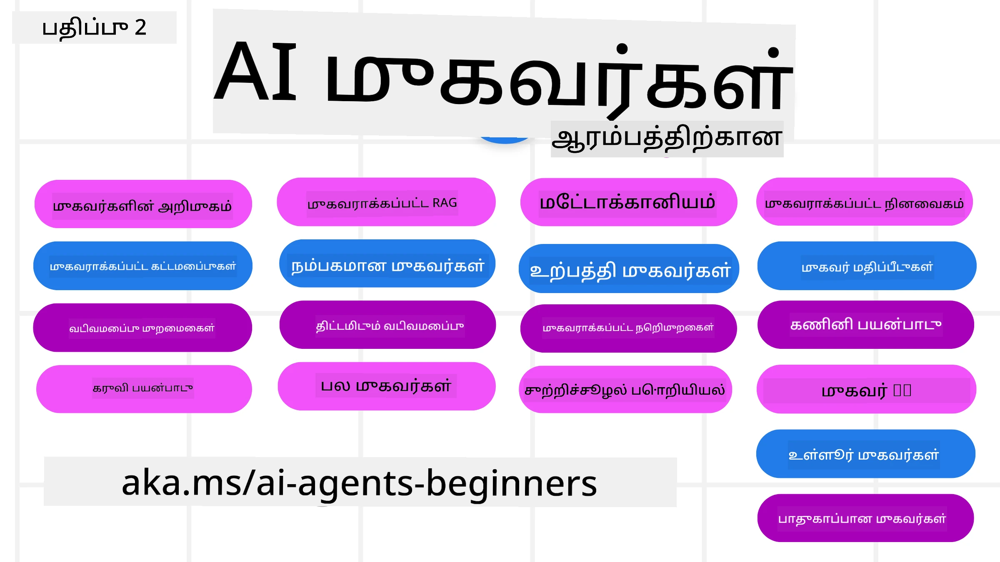

# ஆரம்ப நிலை AI முகவர்கள் - ஒரு பாடநெறி



## AI முகவர்கள் கட்டமைக்கத் தொடங்க தேவையான அனைத்தையும் கற்பிக்கும் ஒரு பாடநெறி

[](https://github.com/microsoft/ai-agents-for-beginners/blob/master/LICENSE?WT.mc_id=academic-105485-koreyst)
[](https://GitHub.com/microsoft/ai-agents-for-beginners/graphs/contributors/?WT.mc_id=academic-105485-koreyst)
[](https://GitHub.com/microsoft/ai-agents-for-beginners/issues/?WT.mc_id=academic-105485-koreyst)
[](https://GitHub.com/microsoft/ai-agents-for-beginners/pulls/?WT.mc_id=academic-105485-koreyst)
[](http://makeapullrequest.com?WT.mc_id=academic-105485-koreyst)

### 🌐 பல மொழிகளுக்கு ஆதரவுடன்

#### GitHub செயல் மூலம் ஆதரவு (தானியங்கிய மற்றும் எப்போதும் புதுப்பித்தல்)

<!-- CO-OP TRANSLATOR LANGUAGES TABLE START -->
[அரபிக்](../ar/README.md) | [வங்காளி](../bn/README.md) | [புல்கேரியன்](../bg/README.md) | [பர்மி (மியான்மர்)](../my/README.md) | [சீன(எளிதாக்கப்பட்ட)](../zh-CN/README.md) | [சீன (பாரம்பரிய, ஹாங்காங்)](../zh-HK/README.md) | [சீன (பாரம்பரிய, மேகாவ்)](../zh-MO/README.md) | [சீன (பாரம்பரிய, தைவான்)](../zh-TW/README.md) | [குரோஷியன்](../hr/README.md) | [செக்](../cs/README.md) | [டேனிஷ்](../da/README.md) | [டச்சு](../nl/README.md) | [எஸ்டோனியன்](../et/README.md) | [பின்னிஷ்](../fi/README.md) | [பிரெஞ்சு](../fr/README.md) | [ஜெர்மன்](../de/README.md) | [கிரேக்கு](../el/README.md) | [ஹீப்ரூ](../he/README.md) | [ஹிந்தி](../hi/README.md) | [ஹங்கேரியன்](../hu/README.md) | [இந்தோனேஷியன்](../id/README.md) | [இத்தாலியன்](../it/README.md) | [ஜப்பானீஸ்](../ja/README.md) | [கன்னடம்](../kn/README.md) | [கொரியன்](../ko/README.md) | [லிதுவேனியன்](../lt/README.md) | [மலாய்](../ms/README.md) | [மலையாளம்](../ml/README.md) | [மராத்தி](../mr/README.md) | [நேபாளி](../ne/README.md) | [நைஜீரியன் பைட்கின்](../pcm/README.md) | [நார்வேஜியன்](../no/README.md) | [பெர்ஷியன் (பார்சி)](../fa/README.md) | [போலிஷ்](../pl/README.md) | [போர்த்துகீசியன் (பிரேசில்)](../pt-BR/README.md) | [போர்த்துகீசியன் (போர்ச்சுகல்)](../pt-PT/README.md) | [பஞ்சாபி (குருமுகி)](../pa/README.md) | [ரோமேனியன்](../ro/README.md) | [ரஷியன்](../ru/README.md) | [செர்பியன் (சிரிலிக்)](../sr/README.md) | [ஸ்லோவாக்](../sk/README.md) | [ஸ்லோவேனியன்](../sl/README.md) | [ஸ்பானிஷ்](../es/README.md) | [ஸ்வாஹிலி](../sw/README.md) | [ஸ்வீடிஷ்](../sv/README.md) | [டகலாக் (பிலிப்பினோ)](../tl/README.md) | [தமிழ்](./README.md) | [తెలుగు](../te/README.md) | [தை](../th/README.md) | [துருக்கி](../tr/README.md) | [உக்ரைனியன்](../uk/README.md) | [உருது](../ur/README.md) | [வியட்நாமீஸ்](../vi/README.md)

> **உள்ளூரில் கிளோன் செய்ய விரும்புகிறீர்களா?**
>
> இந்த தளத்தில் 50+ மொழி மொழிபெயர்ப்புகள் உள்ளன, இது பதிவிறக்கும் அளவை பெரிதும் அதிகரிக்கிறது. மொழிபெயர்ப்புகள் இல்லாமல் கிளோன் செய்வதற்கு, sparse checkout பயன்படுத்தவும்:
>
> **Bash / macOS / Linux:**
> ```bash
> git clone --filter=blob:none --sparse https://github.com/microsoft/ai-agents-for-beginners.git
> cd ai-agents-for-beginners
> git sparse-checkout set --no-cone '/*' '!translations' '!translated_images'
> ```
>
> **CMD (Windows):**
> ```cmd
> git clone --filter=blob:none --sparse https://github.com/microsoft/ai-agents-for-beginners.git
> cd ai-agents-for-beginners
> git sparse-checkout set --no-cone "/*" "!translations" "!translated_images"
> ```
>
> இது பாடநெறியை முடிக்கத் தேவையான அனைத்தையும் மிக விரைவான பதிவிறக்கத்துடன் வழங்கும்.
<!-- CO-OP TRANSLATOR LANGUAGES TABLE END -->

**மேல் மொழிச் சிறப்பாக தேவையெனில், ஆதரிக்கப்பட்ட மொழிகள் இங்கே பெற்று கொள்ளலாம் [here](https://github.com/Azure/co-op-translator/blob/main/getting_started/supported-languages.md)**

[](https://GitHub.com/microsoft/ai-agents-for-beginners/watchers/?WT.mc_id=academic-105485-koreyst)
[](https://GitHub.com/microsoft/ai-agents-for-beginners/network/?WT.mc_id=academic-105485-koreyst)
[](https://GitHub.com/microsoft/ai-agents-for-beginners/stargazers/?WT.mc_id=academic-105485-koreyst)

[](https://discord.gg/nTYy5BXMWG)


## 🌱 தொடங்கி பார்க்க

இந்த பாடநெறியில் AI முகவர்கள் கட்டமைப்புக்கான அடிப்படைகளை பற்றிய பாடங்கள் உள்ளன. ஒவ்வொரு பாடமும் அதன் சொந்த தலைப்பை கொண்டுள்ளது, ஆகவே விரும்பும் இடத்தில் இருந்து தொடங்கலாம்!

இந்த பாடநெறிக்கான பல மொழி ஆதரவு உண்டு. எங்கள் [இங்கே கிடைக்கும் மொழிகள்](../..) பக்கம் பார்க்கவும். 

இது உங்கள் முதன்முறையான Generative AI மாதிரிகளுடன் கட்டமைப்பாக இருந்தால், எங்கள் [தூண்டுகோல் AI ஆரம்ப நிலைக்கான பாடநெறியை](https://aka.ms/genai-beginners) பார்க்கவும், இது GenAI உடன் கட்டமைப்பதற்கான 21 பாடங்களை கொண்டுள்ளது.

இந்த கிடையென்று [இந்த நிரல்தொடரமைவை (repo) நட்சத்திரம் (🌟) வைத்து](https://docs.github.com/en/get-started/exploring-projects-on-github/saving-repositories-with-stars?WT.mc_id=academic-105485-koreyst) மற்றும் [fork செய்யவும்](https://github.com/microsoft/ai-agents-for-beginners/fork) குறியீட்டை இயக்க.

### பிற கற்றவர்கள் சந்தித்துப், கேள்விகளுக்கு பதில் பெறுங்கள்

AI முகவர்கள் கட்டமைப்பதில் சிக்கல் அல்லது கேள்விகள் இருந்தால், எங்கள் Microsoft Foundry Discord உள்ள [நீங்களுக்கான Discord சேனல்](https://aka.ms/ai-agents/discord) சேரவும்.

### உங்களுக்கு தேவையானவை

இந்த பாடநெறியின் ஒவ்வொரு பாடத்திலும் குறியீடு எடுத்துக்காட்டுகள் உள்ளன, அவை code_samples கோப்புறையில் கிடைக்கின்றன. உங்கள் சொந்த நகலை உருவாக்க [இந்த நிரல்தொடரமைவை fork செய்யவும்](https://github.com/microsoft/ai-agents-for-beginners/fork).  

இந்த பயிற்சிகளில் உள்ள குறியீடு எடுத்துக்காட்டுகள் Microsoft Agent Framework உடன் Azure AI Foundry Agent Service V2 பயன்படுத்துகிறது:

- [Microsoft Foundry](https://aka.ms/ai-agents-beginners/ai-foundry) - Azure கணக்கு தேவை

இந்த பாடநெறி கீழ்க்காணும் Microsoft AI முகவர் கோட்பாடுகள் மற்றும் சேவைகளைப் பயன்படுத்துகிறது:

- [Microsoft Agent Framework (MAF)](https://aka.ms/ai-agents-beginners/agent-framewrok)
- [Azure AI Foundry Agent Service V2](https://aka.ms/ai-agents-beginners/ai-agent-service)


இந்த பாடநெறியின் குறியீட்டை இயக்க மேலதிக தகவலுக்கு, [பாடநெறி அமைப்பு](./00-course-setup/README.md) பக்கம் பார்க்கவும்.

## 🙏 உதவ விரும்புகிறீர்களா?

பரிந்துரைகள் அல்லது எழுத்து பிழைகள் அல்லது குறியீடு பிழைகள் கண்டுபிடித்தீர்களா? [ஒருIssue எழுப்பவும்](https://github.com/microsoft/ai-agents-for-beginners/issues?WT.mc_id=academic-105485-koreyst) அல்லது [ஒரு pull request உருவாக்கவும்](https://github.com/microsoft/ai-agents-for-beginners/pulls?WT.mc_id=academic-105485-koreyst)


## 📂 ஒவ்வொரு பாடத்திலும் உள்ளவை

- README இல் எழுதப்பட்ட பாடம் மற்றும் ஒரு குறுகிய காட்சி படம்
- Microsoft Agent Framework உடன் Azure AI Foundry கையாளும் Python குறியீடு எடுத்துக்காட்டுகள்
- உங்கள் கற்றலை தொடரவேண்டிய கூடுதல் வளங்களுக்கான இணைப்புகள்


## 🗃️ பாடங்கள்

| **பாடம்**                                   | **எழுத்து மற்றும் குறியீடு**                            | **காட்சி படம்**                                               | **கூடுதல் கற்றல்**                                                                       |
|----------------------------------------------|---------------------------------------------------------|--------------------------------------------------------------|------------------------------------------------------------------------------------------|
| AI முகவர்களுக்கும் முகவர் பயன்படுத்தும் வழிகளுக்கும் அறிமுகம்  | [இணைப்பு](./01-intro-to-ai-agents/README.md)             | [காட்சி படம்](https://youtu.be/3zgm60bXmQk?si=z8QygFvYQv-9WtO1) | [இணைப்பு](https://aka.ms/ai-agents-beginners/collection?WT.mc_id=academic-105485-koreyst) |
| AI முகவர் கட்டமைப்புகளை ஆராய்ச்சி செய்வது                  | [இணைப்பு](./02-explore-agentic-frameworks/README.md)       | [காட்சி படம்](https://youtu.be/ODwF-EZo_O8?si=Vawth4hzVaHv-u0H) | [இணைப்பு](https://aka.ms/ai-agents-beginners/collection?WT.mc_id=academic-105485-koreyst) |
| AI முகவர் வடிவமைப்பு மாதிரிகளை புரிந்துகொள்வது                 | [இணைப்பு](./03-agentic-design-patterns/README.md)          | [காட்சி படம்](https://youtu.be/m9lM8qqoOEA?si=BIzHwzstTPL8o9GF) | [இணைப்பு](https://aka.ms/ai-agents-beginners/collection?WT.mc_id=academic-105485-koreyst) |
| கருவி பயன்படுத்தும் வடிவமைப்பு மாதிரி                         | [இணைப்பு](./04-tool-use/README.md)                        | [காட்சி படம்](https://youtu.be/vieRiPRx-gI?si=2z6O2Xu2cu_Jz46N) | [இணைப்பு](https://aka.ms/ai-agents-beginners/collection?WT.mc_id=academic-105485-koreyst) |
| முகவர் RAG                                            | [இணைப்பு](./05-agentic-rag/README.md)                     | [காட்சி படம்](https://youtu.be/WcjAARvdL7I?si=gKPWsQpKiIlDH9A3) | [இணைப்பு](https://aka.ms/ai-agents-beginners/collection?WT.mc_id=academic-105485-koreyst) |
| நம்பகமான AI முகவர்களை உருவாக்குதல்                           | [இணைப்பு](./06-building-trustworthy-agents/README.md)     | [காட்சி படம்](https://youtu.be/iZKkMEGBCUQ?si=jZjpiMnGFOE9L8OK ) | [இணைப்பு](https://aka.ms/ai-agents-beginners/collection?WT.mc_id=academic-105485-koreyst) |
| திட்டமிடலின் வடிவமைப்பு மாதிரி                               | [இணைப்பு](./07-planning-design/README.md)                  | [காட்சி படம்](https://youtu.be/kPfJ2BrBCMY?si=6SC_iv_E5-mzucnC) | [இணைப்பு](https://aka.ms/ai-agents-beginners/collection?WT.mc_id=academic-105485-koreyst) |
| பன்முகவர் வடிவமைப்பு மாதிரி                                 | [இணைப்பு](./08-multi-agent/README.md)                     | [காட்சி படம்](https://youtu.be/V6HpE9hZEx0?si=rMgDhEu7wXo2uo6g) | [இணைப்பு](https://aka.ms/ai-agents-beginners/collection?WT.mc_id=academic-105485-koreyst) |
| மெனக்கட்டுபாடு வடிவமைப்பு மாதிரி                              | [இணைப்பு](./09-metacognition/README.md)                   | [காட்சி படம்](https://youtu.be/His9R6gw6Ec?si=8gck6vvdSNCt6OcF) | [இணைப்பு](https://aka.ms/ai-agents-beginners/collection?WT.mc_id=academic-105485-koreyst) |
| உற்பத்தியில் AI முகவர்கள்                      | [Link](./10-ai-agents-production/README.md)        | [Video](https://youtu.be/l4TP6IyJxmQ?si=31dnhexRo6yLRJDl)  | [Link](https://aka.ms/ai-agents-beginners/collection?WT.mc_id=academic-105485-koreyst) |
| முகவர்கள் ப்ரொடோக்கால்கள் (MCP, A2A மற்றும் NLWeb) பயன்படுத்துதல் | [Link](./11-agentic-protocols/README.md)           | [Video](https://youtu.be/X-Dh9R3Opn8)                                 | [Link](https://aka.ms/ai-agents-beginners/collection?WT.mc_id=academic-105485-koreyst) |
| AI முகவர்களுக்கான சூழல் பொறியியல்            | [Link](./12-context-engineering/README.md)         | [Video](https://youtu.be/F5zqRV7gEag)                                 | [Link](https://aka.ms/ai-agents-beginners/collection?WT.mc_id=academic-105485-koreyst) |
| முகவர் நினைவகத்தை நிர்வகித்தல்                      | [Link](./13-agent-memory/README.md)     |      [Video](https://youtu.be/QrYbHesIxpw?si=vZkVwKrQ4ieCcIPx)                                                      |                                                                                        |
| Microsoft முகவர் அமைப்பை ஆராய்தல்                         | [Link](./14-microsoft-agent-framework/README.md)                            |                                                            |                                                                                        |
| கணினி பயன்பாட்டு முகவர்களை உருவாக்குதல் (CUA)           | விரைவில் வருகிறது                            |                                                            |                                                                                        |
| விரிவாக்கக்கூடிய முகவர்களை 배치 செய்வது                    | விரைவில் வருகிறது                            |                                                            |                                                                                        |
| உள்ளூர் AI முகவர்களை உருவாக்குதல்                     | விரைவில் வருகிறது                               |                                                            |                                                                                        |
| AI முகவர்களை பாதுகாப்பது                           | விரைவில் வருகிறது                               |                                                            |                                                                                        |

## 🎒 பிற பாடங்கள்

எங்கள் குழு மற்ற பாடங்களையும் தயாரிக்கின்றது! பார்க்கவும்:

<!-- CO-OP TRANSLATOR OTHER COURSES START -->
### LangChain
[](https://aka.ms/langchain4j-for-beginners)
[](https://aka.ms/langchainjs-for-beginners?WT.mc_id=m365-94501-dwahlin)
[](https://github.com/microsoft/langchain-for-beginners?WT.mc_id=m365-94501-dwahlin)
---

### Azure / Edge / MCP / முகவர்கள்
[](https://github.com/microsoft/AZD-for-beginners?WT.mc_id=academic-105485-koreyst)
[](https://github.com/microsoft/edgeai-for-beginners?WT.mc_id=academic-105485-koreyst)
[](https://github.com/microsoft/mcp-for-beginners?WT.mc_id=academic-105485-koreyst)
[](https://github.com/microsoft/ai-agents-for-beginners?WT.mc_id=academic-105485-koreyst)

---
 
### உருவாக்கும் AI தொடர்
[](https://github.com/microsoft/generative-ai-for-beginners?WT.mc_id=academic-105485-koreyst)
[-9333EA?style=for-the-badge&labelColor=E5E7EB&color=9333EA)](https://github.com/microsoft/Generative-AI-for-beginners-dotnet?WT.mc_id=academic-105485-koreyst)
[-C084FC?style=for-the-badge&labelColor=E5E7EB&color=C084FC)](https://github.com/microsoft/generative-ai-for-beginners-java?WT.mc_id=academic-105485-koreyst)
[-E879F9?style=for-the-badge&labelColor=E5E7EB&color=E879F9)](https://github.com/microsoft/generative-ai-with-javascript?WT.mc_id=academic-105485-koreyst)

---
 
### முதன்மை கற்றல்
[](https://aka.ms/ml-beginners?WT.mc_id=academic-105485-koreyst)
[](https://aka.ms/datascience-beginners?WT.mc_id=academic-105485-koreyst)
[](https://aka.ms/ai-beginners?WT.mc_id=academic-105485-koreyst)
[](https://github.com/microsoft/Security-101?WT.mc_id=academic-96948-sayoung)
[](https://aka.ms/webdev-beginners?WT.mc_id=academic-105485-koreyst)
[](https://aka.ms/iot-beginners?WT.mc_id=academic-105485-koreyst)
[](https://github.com/microsoft/xr-development-for-beginners?WT.mc_id=academic-105485-koreyst)

---
 
### ஒத்தசெயல்படுத்தும் தொடர்
[](https://aka.ms/GitHubCopilotAI?WT.mc_id=academic-105485-koreyst)
[](https://github.com/microsoft/mastering-github-copilot-for-dotnet-csharp-developers?WT.mc_id=academic-105485-koreyst)
[](https://github.com/microsoft/CopilotAdventures?WT.mc_id=academic-105485-koreyst)
<!-- CO-OP TRANSLATOR OTHER COURSES END -->

## 🌟 சமூக நன்றிகள்

Agentic RAG ஐ காட்டும் முக்கிய குறியீடு எடுத்துக்காட்டுகளை வழங்கிய [Shivam Goyal](https://www.linkedin.com/in/shivam2003/) அவர்களுக்கு நன்றி.

## பங்களிப்பு

இந்த திட்டம் பங்களிப்புகளையும் பரிந்துரைகளையும் வரவேற்கிறது. பெரும்பாலான பங்களிப்புகள் உங்களை ஒரு
பங்களிப்பாளர் உரிமம் ஒப்பந்தம் (CLA) உடன்பட வேண்டும் என்று வேண்டுகிறது, அதில் நீங்கள் உரிமை உள்ளீர்கள் மற்றும் உங்கள் பங்களிப்பை பயன்படுத்தும் உரிமையை வழங்குகிறீர்கள் என்கிறது. விவரங்களுக்கு, <https://cla.opensource.microsoft.com> ஐ பார்வையிடவும்.

நீங்கள் ஒரு புல் கோரிக்கையை சமர்ப்பிக்கும்போது, CLA பாட்டி தானாகவே நீங்கள் CLA வழங்க வேண்டுமா என்பதைத் தீர்மானித்து PR ஐ உரிய வகையில் அலங்கரிக்கும் (எ.கா., நிலை சோதனை, கருத்து). பாட்டியின் வழங்கிய வழிமுறைகளை பின்பற்ற வேண்டும். எங்கள் CLA பயன்படுத்தும் அனைத்து ரெப்போக்களிலும் இதை ஒரே முறையே செய்ய வேண்டும்.

இந்த திட்டம் [Microsoft Open Source Code of Conduct](https://opensource.microsoft.com/codeofconduct/) ஐ ஏற்றுக்கொண்டுள்ளது.
மேலும் தகவலுக்கு [Code of Conduct FAQ](https://opensource.microsoft.com/codeofconduct/faq/) அல்லது
[opencode@microsoft.com](mailto:opencode@microsoft.com) -இல் தொடர்பு கொள்ளவும்.

## வர்த்தகச்சீட்டுக்கள்

இந்த திட்டம் திட்டங்கள், தயாரிப்புகள் அல்லது சேவைகளுக்கான வர்த்தகச்சீட்டுக்கள் அல்லது லோகோக்களை கொண்டிருக்கும். Microsoft
வர்த்தகச்சீட்டுக்களை அல்லது லோகோக்களை அங்கீகரிக்கப்பட்ட பயன்பாடு [Microsoft's Trademark & Brand Guidelines](https://www.microsoft.com/legal/intellectualproperty/trademarks/usage/general) அவர்களது விதிமுறைகளை பின்பற்ற வேண்டும்.
Microsoft வர்த்தகச்சீட்டுக்கள் அல்லது லோகோக்கள் மாற்றியமைக்கப்பட்ட பதிப்புகளில் பயன்படுத்தும்போது குழப்பத்தை ஏற்படுத்தவோ அல்லது Microsoft அனுமதியை குறிப்பதாகவோ இருக்கக்கூடாது.
மூன்றாம் தரப்பின் வர்த்தகச்சீட்டுக்கள் அல்லது லோகோக்கள் பயன்படுத்தப்படும் போது அந்த மூன்றாம் தரப்பின் கொள்கைகளுக்கு உட்பட்டவை.

## உதவி பெறல்


AI செயலிகளை உருவாக்கும் போது சிக்கலுக்கு சிக்கினால் அல்லது கேள்விகள் இருந்தால், பங்கேற்கவும்:

[](https://aka.ms/foundry/discord)

தயாரிப்புத் கருத்து அல்லது கட்டுமான பிழைகள் இருந்தால் பார்வையிடவும்:

[](https://aka.ms/foundry/forum)

---

<!-- CO-OP TRANSLATOR DISCLAIMER START -->
**பிரதி விடுப்பு**:  
இந்த ஆவணம் AI மொழிமாற்ற சேவை [Co-op Translator](https://github.com/Azure/co-op-translator) மூலம் மொழிபெயர்க்கப்பட்டுள்ளது. நாங்கள் துல்லியத்துக்கு முயற்சிக்கின்றபோதிலும், தானியங்கி மொழிபெயர்ப்புகளில் பிழைகள் அல்லது தவிர்க்க முடியாத தவறுகள் இருக்க வாய்ப்பு உள்ளதாக நினைவில் கொள்ளவும். உள்ளூர் மொழியிலுள்ள மூல ஆவணம் அதிகாரப்பூர்வமான ஆதாரமாக கருதப்பட வேண்டும். முக்கியமான தகவல்களுக்கு, ப்ரொஃபஷனல் மனித மொழிபெயர்ப்பு பரிந்துரைக்கப்படுகிறது. இந்த மொழிபெயர்ப்பின் பயனிலிருந்து ஏற்பட்ட ஏதாவது தவறான அர்த்தங்கள் அல்லது புரிதல் பிழைகளுக்கு எங்களை பொறுப்பாக கொள்ளக் கூடாது.
<!-- CO-OP TRANSLATOR DISCLAIMER END -->