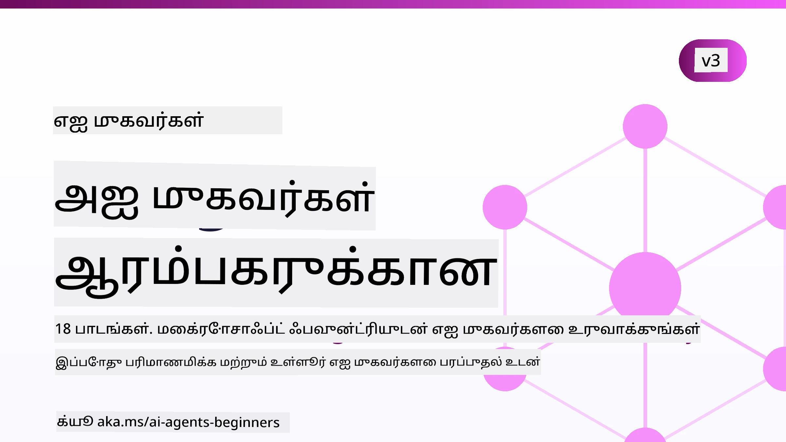

# புதிதாக ஆரம்பிக்கும்வர்களுக்கு AI முகவர்கள் - ஒரு பாடநெறி



## AI முகவர்கள் உருவாக்குவதற்கான தேவையான அனைத்தையும் கற்றுக் கொள்ள ஒரு பாடநெறி

[](https://github.com/microsoft/ai-agents-for-beginners/blob/master/LICENSE?WT.mc_id=academic-105485-koreyst)
[](https://GitHub.com/microsoft/ai-agents-for-beginners/graphs/contributors/?WT.mc_id=academic-105485-koreyst)
[](https://GitHub.com/microsoft/ai-agents-for-beginners/issues/?WT.mc_id=academic-105485-koreyst)
[](https://GitHub.com/microsoft/ai-agents-for-beginners/pulls/?WT.mc_id=academic-105485-koreyst)
[](http://makeapullrequest.com?WT.mc_id=academic-105485-koreyst)

### 🌐 பலமொழி ஆதரவு

#### GitHub நடவடிக்கையின் மூலம் ஆதரிக்கப்படுகிறது (தானாகவும் எப்போதும் புதுப்பித்து இருக்கும்)

<!-- CO-OP TRANSLATOR LANGUAGES TABLE START -->
[Arabic](../ar/README.md) | [Bengali](../bn/README.md) | [Bulgarian](../bg/README.md) | [Burmese (Myanmar)](../my/README.md) | [Chinese (Simplified)](../zh-CN/README.md) | [Chinese (Traditional, Hong Kong)](../zh-HK/README.md) | [Chinese (Traditional, Macau)](../zh-MO/README.md) | [Chinese (Traditional, Taiwan)](../zh-TW/README.md) | [Croatian](../hr/README.md) | [Czech](../cs/README.md) | [Danish](../da/README.md) | [Dutch](../nl/README.md) | [Estonian](../et/README.md) | [Finnish](../fi/README.md) | [French](../fr/README.md) | [German](../de/README.md) | [Greek](../el/README.md) | [Hebrew](../he/README.md) | [Hindi](../hi/README.md) | [Hungarian](../hu/README.md) | [Indonesian](../id/README.md) | [Italian](../it/README.md) | [Japanese](../ja/README.md) | [Kannada](../kn/README.md) | [Khmer](../km/README.md) | [Korean](../ko/README.md) | [Lithuanian](../lt/README.md) | [Malay](../ms/README.md) | [Malayalam](../ml/README.md) | [Marathi](../mr/README.md) | [Nepali](../ne/README.md) | [Nigerian Pidgin](../pcm/README.md) | [Norwegian](../no/README.md) | [Persian (Farsi)](../fa/README.md) | [Polish](../pl/README.md) | [Portuguese (Brazil)](../pt-BR/README.md) | [Portuguese (Portugal)](../pt-PT/README.md) | [Punjabi (Gurmukhi)](../pa/README.md) | [Romanian](../ro/README.md) | [Russian](../ru/README.md) | [Serbian (Cyrillic)](../sr/README.md) | [Slovak](../sk/README.md) | [Slovenian](../sl/README.md) | [Spanish](../es/README.md) | [Swahili](../sw/README.md) | [Swedish](../sv/README.md) | [Tagalog (Filipino)](../tl/README.md) | [Tamil](./README.md) | [Telugu](../te/README.md) | [Thai](../th/README.md) | [Turkish](../tr/README.md) | [Ukrainian](../uk/README.md) | [Urdu](../ur/README.md) | [Vietnamese](../vi/README.md)

> **உள்ளூரில் கிளோன் செய்வது விரும்புகிறீர்களா?**
>
> இந்த கோப்பகத்தில் 50+ மொழி மொழிபெயர்ப்புகள் உள்ளன, இது பதிவிறக்கும் அளவை முக்கியமாக அதிகரிக்கிறது. மொழிபெயர்ப்புகளின்றி கிளோன் செய்ய, sparse checkout ஐ பயன்படுத்தவும்:
>
> **Bash / macOS / Linux:**
> ```bash
> git clone --filter=blob:none --sparse https://github.com/microsoft/ai-agents-for-beginners.git
> cd ai-agents-for-beginners
> git sparse-checkout set --no-cone '/*' '!translations' '!translated_images'
> ```
>
> **CMD (Windows):**
> ```cmd
> git clone --filter=blob:none --sparse https://github.com/microsoft/ai-agents-for-beginners.git
> cd ai-agents-for-beginners
> git sparse-checkout set --no-cone "/*" "!translations" "!translated_images"
> ```
>
> இதனால் பாடநெறியை நிறைவு செய்ய தேவையான அனைத்தும் மிக விரைவான பதிவிறக்கத்துடன் கிடைக்கும்.
<!-- CO-OP TRANSLATOR LANGUAGES TABLE END -->

**கூடுதல் மொழிபெயர்ப்பு மொழிகள் ஆதரிக்க வேண்டுமெனில், அவை இங்கே பட்டியலிடப்பட்டுள்ளன [இங்கே](https://github.com/Azure/co-op-translator/blob/main/getting_started/supported-languages.md).**

[](https://GitHub.com/microsoft/ai-agents-for-beginners/watchers/?WT.mc_id=academic-105485-koreyst)
[](https://GitHub.com/microsoft/ai-agents-for-beginners/network/?WT.mc_id=academic-105485-koreyst)
[](https://GitHub.com/microsoft/ai-agents-for-beginners/stargazers/?WT.mc_id=academic-105485-koreyst)

[](https://discord.com/invite/ATgtXmAS5D)


## 🌱 தொடங்குதல்

இந்த பாடநெறி AI முகவர்கள் உருவாக்க அடிப்படைகளை உள்ளடக்கிய பாடங்களைக் கொண்டுள்ளது. ஒவ்வொரு பாடமும் தன்னுடைய தலைப்பைக் கையாள்கிறது, ஆகவே நீங்கள் விரும்பிய இடத்தில் தொடங்குங்கள்!

இந்த பாடநெறிக்கு பலமொழி ஆதரவு உள்ளது. எங்கள் [கிடைக்கக்கூடிய மொழிகள் இங்கே](#-multi-language-support) பார்க்கவும்.

நீங்கள் முதன்முறையாக Generative AI மாதிரிகளுடன் உருவாக்குகிறீர்களானால், 21 பாடங்களையும் உள்ளடக்கிய எங்கள் [புதிதாக தொடங்குபவர்களுக்கான Generative AI](https://aka.ms/genai-beginners) பாடநெறியை பாருங்கள்.

இந்த களஞ்சியத்தை [நட்சத்திரம் (🌟) வழங்க ](https://docs.github.com/en/get-started/exploring-projects-on-github/saving-repositories-with-stars?WT.mc_id=academic-105485-koreyst) மறக்க வேண்டாமே மற்றும் [இந்தக் கோப்பகத்தை கிளோன் செய்யவும்](https://github.com/microsoft/ai-agents-for-beginners/fork) என்றால் குறியீட்டை இயக்கலாம்.

### மற்ற கற்கையாளர்களைக் சந்திக்கவும், உங்கள் கேள்விகளுக்கு பதில் பெறவும்

நீங்கள் வழுவடிக்கிறீர்களா அல்லது AI முகவர்கள் உருவாக்குவதில் ஏதேனும் கேள்விகள் இருந்தால், எங்கள் [Microsoft Foundry Discord](https://aka.ms/ai-agents/discord) இல் உள்ள அர்ப்பணிக்கப்பட்ட Discord சேனலுக்கு இணைக.

### உங்கள் தேவைகள்

இந்த பாடநெறியின் ஒவ்வொரு பாடமும் குறியீட்டு உதாரணங்களைக் கொண்டுள்ளது, அவை code_samples அடைவில் காணலாம். நீங்கள் [இந்தக் கோப்பகத்தை கிளோன் செய்யக்கூடியது](https://github.com/microsoft/ai-agents-for-beginners/fork).

இந்த பயிற்சிகளில் உள்ள குறியீட்டு உதாரணங்கள் Microsoft Agent Framework-ஐ Microsoft Foundry Agent Service V2 உடன் பயன்படுத்துகின்றன:

- [Microsoft Foundry](https://aka.ms/ai-agents-beginners/ai-foundry) - Azure கணக்கு தேவையானது

இந்த பாடநெறி கல்விக்கான Microsoft AI முகவர் கட்டமைப்புகள் மற்றும் சேவைகளை பயன்படுத்துகிறது:

- [Microsoft Agent Framework (MAF)](https://learn.microsoft.com/agent-framework/overview/)
- [Microsoft Foundry Agent Service V2](https://aka.ms/ai-agents-beginners/ai-agent-service)

சில குறியீட்டு உதாரணங்கள் [MiniMax](https://platform.minimaxi.com/) போன்ற மாற்று OpenAI-உகந்த வழங்குநர்களையும் ஆதரிக்கின்றன, இது பெரிய முன்னணி மாதிரிகளை (முதல் 204K டோக்கன்கள் வரை) வழங்குகிறது. அமைப்பு விவரங்களுக்கு [Course Setup](./00-course-setup/README.md)-ஐப் பாருங்கள்.

இந்த பாடநெறிக்கான குறியீட்டை இயக்க மேலதிகத் தகவலுக்கு [Course Setup](./00-course-setup/README.md) பக்கத்துக்கு செல்லவும்.

## 🙏 உதவ விரும்புகிறீர்களா?

உங்களிடம் பரிந்துரைகள் உள்ளனவா அல்லது எழுத்துப்பிழைகள் அல்லது குறியீட்டு பிழைகள் கண்டுபிடித்தீர்களா? [ஒரு பிரச்சினையை பதிவு செய்யவும்](https://github.com/microsoft/ai-agents-for-beginners/issues?WT.mc_id=academic-105485-koreyst) அல்லது [ஒரு புல் வேண்டுகோலை உருவாக்கவும்](https://github.com/microsoft/ai-agents-for-beginners/pulls?WT.mc_id=academic-105485-koreyst)


## 📂 ஒவ்வொரு பாடத்தையும் உள்ளடக்கியது

- README-யில் உள்ள ஒரு எழுதப்பட்ட பாடம் மற்றும் ஒரு சிறிய வீடியோ
- Microsoft Agent Framework மற்றும் Microsoft Foundry உடன் Python குறியீட்டு உதாரணங்கள்
- உங்கள் கற்றலை தொடர்வதற்கான கூடுதல் வளங்களுக்கான இணைப்புகள்


## 🗃️ பாடங்கள்

| **பாடம்**                                    | **உரை மற்றும் குறியீடு**                              | **வீடியோ**                                                  | **கூடுதல் கற்றல்**                                                                      |
|----------------------------------------------|----------------------------------------------------|------------------------------------------------------------|----------------------------------------------------------------------------------------|
| AI முகவர்களின் அறிமுகமும் முகவர் பயன்பாட்டு வழக்குகளும்    | [இணைப்பு](./01-intro-to-ai-agents/README.md)            | [வீடியோ](https://youtu.be/3zgm60bXmQk?si=z8QygFvYQv-9WtO1)  | [இணைப்பு](https://aka.ms/ai-agents-beginners/collection?WT.mc_id=academic-105485-koreyst)  |
| AI முகவர் கட்டமைப்புகளை ஆய்வு செய்தல்                    | [இணைப்பு](./02-explore-agentic-frameworks/README.md)    | [வீடியோ](https://youtu.be/ODwF-EZo_O8?si=Vawth4hzVaHv-u0H)  | [இணைப்பு](https://aka.ms/ai-agents-beginners/collection?WT.mc_id=academic-105485-koreyst)  |
| AI முகவர் வடிவமைப்பு வடிவங்கள் புரிதல்                       | [இணைப்பு](./03-agentic-design-patterns/README.md)       | [வீடியோ](https://youtu.be/m9lM8qqoOEA?si=BIzHwzstTPL8o9GF)  | [இணைப்பு](https://aka.ms/ai-agents-beginners/collection?WT.mc_id=academic-105485-koreyst)  |
| கருவி பயன்பாட்டு வடிவமைப்பு வடிவம்                          | [இணைப்பு](./04-tool-use/README.md)                      | [வீடியோ](https://youtu.be/vieRiPRx-gI?si=2z6O2Xu2cu_Jz46N)  | [இணைப்பு](https://aka.ms/ai-agents-beginners/collection?WT.mc_id=academic-105485-koreyst)  |
| முகவர்களின் RAG                                          | [இணைப்பு](./05-agentic-rag/README.md)                   | [வீடியோ](https://youtu.be/WcjAARvdL7I?si=gKPWsQpKiIlDH9A3)  | [இணைப்பு](https://aka.ms/ai-agents-beginners/collection?WT.mc_id=academic-105485-koreyst)  |
| நம்பகமான AI முகவர்களை கட்டுதல்                        | [இணைப்பு](./06-building-trustworthy-agents/README.md)   | [வீடியோ](https://youtu.be/iZKkMEGBCUQ?si=jZjpiMnGFOE9L8OK ) | [இணைப்பு](https://aka.ms/ai-agents-beginners/collection?WT.mc_id=academic-105485-koreyst)  |
| திட்டமிடல் வடிவமைப்பு வடிவம்                              | [இணைப்பு](./07-planning-design/README.md)               | [வீடியோ](https://youtu.be/kPfJ2BrBCMY?si=6SC_iv_E5-mzucnC)  | [இணைப்பு](https://aka.ms/ai-agents-beginners/collection?WT.mc_id=academic-105485-koreyst)  |
| பல முகவர் வடிவமைப்பு வடிவம்                               | [இணைப்பு](./08-multi-agent/README.md)                   | [வீடியோ](https://youtu.be/V6HpE9hZEx0?si=rMgDhEu7wXo2uo6g)  | [இணைப்பு](https://aka.ms/ai-agents-beginners/collection?WT.mc_id=academic-105485-koreyst)  |

| மெடாகாச்னிஷன் வடிவமைப்பு பகுப்பு           | [Link](./09-metacognition/README.md)               | [Video](https://youtu.be/His9R6gw6Ec?si=8gck6vvdSNCt6OcF)  | [Link](https://aka.ms/ai-agents-beginners/collection?WT.mc_id=academic-105485-koreyst) |
| தயாரிப்பில் AI முகவரிகள்                    | [Link](./10-ai-agents-production/README.md)        | [Video](https://youtu.be/l4TP6IyJxmQ?si=31dnhexRo6yLRJDl)  | [Link](https://aka.ms/ai-agents-beginners/collection?WT.mc_id=academic-105485-koreyst) |
| ஏஜென்டிக் நெறிமுறைகளைப் பயன்படுத்துதல் (MCP, A2A மற்றும் NLWeb) | [Link](./11-agentic-protocols/README.md)           | [Video](https://youtu.be/X-Dh9R3Opn8)                                 | [Link](https://aka.ms/ai-agents-beginners/collection?WT.mc_id=academic-105485-koreyst) |
| AI முகவரிகளுக்கான சூழல் பொறியியல்          | [Link](./12-context-engineering/README.md)         | [Video](https://youtu.be/F5zqRV7gEag)                                 | [Link](https://aka.ms/ai-agents-beginners/collection?WT.mc_id=academic-105485-koreyst) |
| ஏஜென்டிக் நினைவகத்தை நிர்வகித்தல்             | [Link](./13-agent-memory/README.md)     |      [Video](https://youtu.be/QrYbHesIxpw?si=vZkVwKrQ4ieCcIPx)                                                      |                                                                                        |
| Microsoft ஏஜென்ட் கட்டமைப்பை ஆராய்தல்                  | [Link](./14-microsoft-agent-framework/README.md)                            |                                                            |                                                                                        |
| கம்ப்யூட்டர் பயன்பாட்டு முகவரிகள் (CUA) உருவாக்குதல்       | [Link](./15-browser-use/README.md)     |                                                            | [Link](https://docs.browser-use.com/examples/templates/playwright-integration)         |
| விரிவாக்கக்கூடிய முகவரிகளைக் கொண்டு செல்லுதல்           | [Link](./16-deploying-scalable-agents/README.md) |                                                    | [Link](https://learn.microsoft.com/azure/ai-foundry/agents/overview)                   |
| உள்ளூர் AI முகவரிகளை உருவாக்குதல்                   | [Link](./17-creating-local-ai-agents/README.md)  |                                                    | [Link](https://learn.microsoft.com/azure/ai-foundry/foundry-local/)                    |
| AI முகவரிகளை பாதுகாப்பது                        | [Link](./18-securing-ai-agents/README.md)  |                                                            | [Link](https://aka.ms/ai-agents-beginners/collection?WT.mc_id=academic-105485-koreyst) |

## 🎒 பிற பாடநெறிகள்

எங்கள் குழு பிற பாடநெறிகளையும் தயாரிக்கிறது! இதைப் பார்க்கவும்:

<!-- CO-OP TRANSLATOR OTHER COURSES START -->
### லாங்ச்செயின்
[](https://aka.ms/langchain4j-for-beginners)
[](https://aka.ms/langchainjs-for-beginners?WT.mc_id=m365-94501-dwahlin)
[](https://github.com/microsoft/langchain-for-beginners?WT.mc_id=m365-94501-dwahlin)
---

### Azure / Edge / MCP / முகவர்கள்
[](https://github.com/microsoft/AZD-for-beginners?WT.mc_id=academic-105485-koreyst)
[](https://github.com/microsoft/edgeai-for-beginners?WT.mc_id=academic-105485-koreyst)
[](https://github.com/microsoft/mcp-for-beginners?WT.mc_id=academic-105485-koreyst)
[](https://github.com/microsoft/ai-agents-for-beginners?WT.mc_id=academic-105485-koreyst)

---
 
### உருவாக்கல் AI தொடர்
[](https://github.com/microsoft/generative-ai-for-beginners?WT.mc_id=academic-105485-koreyst)
[-9333EA?style=for-the-badge&labelColor=E5E7EB&color=9333EA)](https://github.com/microsoft/Generative-AI-for-beginners-dotnet?WT.mc_id=academic-105485-koreyst)
[-C084FC?style=for-the-badge&labelColor=E5E7EB&color=C084FC)](https://github.com/microsoft/generative-ai-for-beginners-java?WT.mc_id=academic-105485-koreyst)
[-E879F9?style=for-the-badge&labelColor=E5E7EB&color=E879F9)](https://github.com/microsoft/generative-ai-with-javascript?WT.mc_id=academic-105485-koreyst)

---
 
### முக்கியக் கற்றல்
[](https://aka.ms/ml-beginners?WT.mc_id=academic-105485-koreyst)
[](https://aka.ms/datascience-beginners?WT.mc_id=academic-105485-koreyst)
[](https://aka.ms/ai-beginners?WT.mc_id=academic-105485-koreyst)
[](https://github.com/microsoft/Security-101?WT.mc_id=academic-96948-sayoung)
[](https://aka.ms/webdev-beginners?WT.mc_id=academic-105485-koreyst)
[](https://aka.ms/iot-beginners?WT.mc_id=academic-105485-koreyst)
[](https://github.com/microsoft/xr-development-for-beginners?WT.mc_id=academic-105485-koreyst)

---
 
### கோப்பைலட் தொடர்ச்சி
[](https://aka.ms/GitHubCopilotAI?WT.mc_id=academic-105485-koreyst)
[](https://github.com/microsoft/mastering-github-copilot-for-dotnet-csharp-developers?WT.mc_id=academic-105485-koreyst)
[](https://github.com/microsoft/CopilotAdventures?WT.mc_id=academic-105485-koreyst)
<!-- CO-OP TRANSLATOR OTHER COURSES END -->

## 🌟 சமூக நன்றி

Agentic RAG-ஐ வெளிப்படுத்தும் முக்கியமான குறியீட்டு உதாரணங்களை வழங்கிய [Shivam Goyal](https://www.linkedin.com/in/shivam2003/) அவர்களுக்கு நன்றி.

## பங்களிப்பு

இந்த திட்டம் பங்களிப்புகளையும் பரிந்துரைகளையும் வரவேற்கிறது. பெரும்பாலான பங்களிப்புகளுக்கு நீங்கள் பின்பற்ற வேண்டியது
பங்களிப்பாளர் உரிமம் உடன்படிக்கை (CLA) ஆகும், இது நீங்கள் உரிமை கொண்டதாகவும், உண்மையில் பங்களிப்பை நமக்கு அனுமதிக்கிறீர்கள் என்று தெரிவிக்கும்.
விரிவான தகவலுக்கு <https://cla.opensource.microsoft.com> என்றதிற்குப் பாருங்கள்.

நீங்கள் ஒரு pull request சமர்ப்பிக்கும் பொழுது, ஒரு CLA புக்‌பாட் தானாகவே நீங்கள் CLA வழங்க வேண்டுமா என்பதையும் PR ஐ பொருத்ததாக அலங்கரிக்கும் (உதா., நிலை சரிபார்ப்பு, கருத்து). புக்‌பாட் வழங்கும் வழிமுறைகளை பின்பற்றுங்கள். இந்த செயல்முறையை அனைத்து ரெப்போகளிலும் ஒருமுறை மட்டும் செய்யவேண்டும்.


இந்த திட்டம் [Microsoft Open Source Code of Conduct](https://opensource.microsoft.com/codeofconduct/) ஐ ஏற்றுக்கொண்டுள்ளது.
கூடுதல் தகவலுக்கு [Code of Conduct FAQ](https://opensource.microsoft.com/codeofconduct/faq/) அல்லது
[opencode@microsoft.com](mailto:opencode@microsoft.com) இனை தொடர்பு கொள்ளவும்.

## வர்த்தகचின்னங்கள்

இந்த திட்டத்தில் திட்டங்கள், தயாரிப்புகள் அல்லது சேவைகள் தொடர்பான வர்த்தகச் சின்னங்கள் அல்லது லோகோக்கள் இருக்கலாம். Microsoft
வர்த்தகச் சின்னங்களின் அங்கீகாரப் பயன்பாடு மற்றும் Microsoft இன்
[Trademark & Brand Guidelines](https://www.microsoft.com/legal/intellectualproperty/trademarks/usage/general) ஐ பின்பற்ற வேண்டும்.
Microsoft வர்த்தகசின்னங்கள் அல்லது லோகோக்களுக்கு மாற்றப்பட்ட பதிப்புகளில் பயன்படுத்துவதால் குழப்பம் இல்லாமல் இருக்கவும் அல்லது Microsoft ஆதரவைக் குறிக்க கூடாது.
மூன்றாம் தரப்பின் வர்த்தகசின்னம் அல்லது லோகோக்களின் பயன்பாடு அந்த மூன்றாம் தரப்பின் கொள்கைகளுக்கு உட்பட்டது.

## உதவி பெறல்


AI செயலிகள் உருவாக்குவதில் சிக்கல் ஏற்பட்டால் அல்லது கேள்விகள் இருந்தால், இணைக:

[](https://aka.ms/foundry/discord)

தயாரிப்புக் கருத்து அல்லது பிழைகள் இருந்தால், கட்டுமானத்தில்:

[](https://aka.ms/foundry/forum)

---

<!-- CO-OP TRANSLATOR DISCLAIMER START -->
**மறுப்பு**:
இந்த ஆவணம் AI மொழிபெயர்ப்பு சேவை [Co-op Translator](https://github.com/Azure/co-op-translator) பயன்படுத்தி மொழிபெயர்க்கப்பட்டுள்ளது. நாங்கள் துல்லியத்திற்காக முயற்சி செய்துள்ளோம், ஆனால் தானாக செய்யப்படும் மொழிபெயர்ப்புகளில் பிழைகள் அல்லது தவறுகள் இருக்கலாம் என்பதை கவனத்தில் கொள்ளவும். அசல் ஆவணம் அதன் தாய்மொழியில் அதிகாரப்பூர்வ ஆதாரமாக கருதப்பட வேண்டும். முக்கியமான தகவல்களுக்கு, தொழில்நுட்பமான மனித மொழிபெயர்ப்பு பரிந்துரைக்கப்படுகிறது. இந்த மொழிபெயர்ப்பைப் பயன்படுத்துவதால் ஏற்படும் எந்த தவறான புரிதல்கள் அல்லது தவறான விளக்கத்திற்கும் நாங்கள் பொறுப்பில்வில்லை.
<!-- CO-OP TRANSLATOR DISCLAIMER END -->