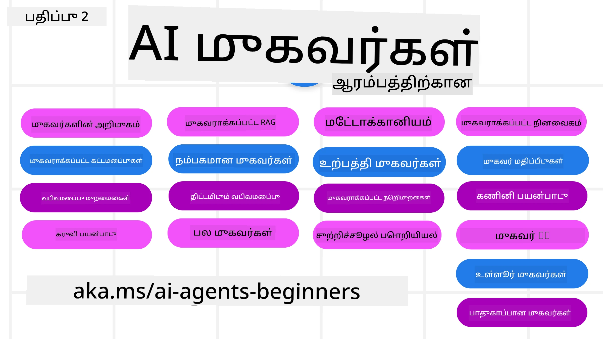

# எய்ஐ முகவர்கள் துவக்கக்காரர்களுக்கு - ஒரு பாடம்



## எய்ஐ முகவர்கள் உருவாக்க தொடங்க தேவையான அனைத்தையும் கற்பிக்கும் பாடநெறி

[](https://github.com/microsoft/ai-agents-for-beginners/blob/master/LICENSE?WT.mc_id=academic-105485-koreyst)
[](https://GitHub.com/microsoft/ai-agents-for-beginners/graphs/contributors/?WT.mc_id=academic-105485-koreyst)
[](https://GitHub.com/microsoft/ai-agents-for-beginners/issues/?WT.mc_id=academic-105485-koreyst)
[](https://GitHub.com/microsoft/ai-agents-for-beginners/pulls/?WT.mc_id=academic-105485-koreyst)
[](http://makeapullrequest.com?WT.mc_id=academic-105485-koreyst)

### 🌐 பன்மொழி ஆதரவு

#### GitHub Action மூலம் ஆதரிக்கப்படுகிறது (தானியங்கி மற்றும் எப்போதும் புதுப்பிக்கப்பட்டது)

<!-- CO-OP TRANSLATOR LANGUAGES TABLE START -->
[Arabic](../ar/README.md) | [Bengali](../bn/README.md) | [Bulgarian](../bg/README.md) | [Burmese (Myanmar)](../my/README.md) | [Chinese (Simplified)](../zh-CN/README.md) | [Chinese (Traditional, Hong Kong)](../zh-HK/README.md) | [Chinese (Traditional, Macau)](../zh-MO/README.md) | [Chinese (Traditional, Taiwan)](../zh-TW/README.md) | [Croatian](../hr/README.md) | [Czech](../cs/README.md) | [Danish](../da/README.md) | [Dutch](../nl/README.md) | [Estonian](../et/README.md) | [Finnish](../fi/README.md) | [French](../fr/README.md) | [German](../de/README.md) | [Greek](../el/README.md) | [Hebrew](../he/README.md) | [Hindi](../hi/README.md) | [Hungarian](../hu/README.md) | [Indonesian](../id/README.md) | [Italian](../it/README.md) | [Japanese](../ja/README.md) | [Kannada](../kn/README.md) | [Khmer](../km/README.md) | [Korean](../ko/README.md) | [Lithuanian](../lt/README.md) | [Malay](../ms/README.md) | [Malayalam](../ml/README.md) | [Marathi](../mr/README.md) | [Nepali](../ne/README.md) | [Nigerian Pidgin](../pcm/README.md) | [Norwegian](../no/README.md) | [Persian (Farsi)](../fa/README.md) | [Polish](../pl/README.md) | [Portuguese (Brazil)](../pt-BR/README.md) | [Portuguese (Portugal)](../pt-PT/README.md) | [Punjabi (Gurmukhi)](../pa/README.md) | [Romanian](../ro/README.md) | [Russian](../ru/README.md) | [Serbian (Cyrillic)](../sr/README.md) | [Slovak](../sk/README.md) | [Slovenian](../sl/README.md) | [Spanish](../es/README.md) | [Swahili](../sw/README.md) | [Swedish](../sv/README.md) | [Tagalog (Filipino)](../tl/README.md) | [Tamil](./README.md) | [Telugu](../te/README.md) | [Thai](../th/README.md) | [Turkish](../tr/README.md) | [Ukrainian](../uk/README.md) | [Urdu](../ur/README.md) | [Vietnamese](../vi/README.md)

> **உள்ளூர் சேமிப்பாக கிளோன் செய்ய விரும்புவீர்களா?**
>
> இந்த சேமிப்பகம் 50+ மொழி மொழிபெயர்ப்புகளை உள்ளடக்கியதால் பதிவிறக்க அளவு மிகவும் அதிகம். மொழிபெயர்ப்புகள் இல்லாமல் கிளோன் செய்ய, sparse checkout பயன்படுத்தவும்:
>
> **Bash / macOS / Linux:**
> ```bash
> git clone --filter=blob:none --sparse https://github.com/microsoft/ai-agents-for-beginners.git
> cd ai-agents-for-beginners
> git sparse-checkout set --no-cone '/*' '!translations' '!translated_images'
> ```
>
> **CMD (Windows):**
> ```cmd
> git clone --filter=blob:none --sparse https://github.com/microsoft/ai-agents-for-beginners.git
> cd ai-agents-for-beginners
> git sparse-checkout set --no-cone "/*" "!translations" "!translated_images"
> ```
>
> இது பாடநெறியை விரைவாக முடிக்க தேவையான அனைத்தையும் தரும்.
<!-- CO-OP TRANSLATOR LANGUAGES TABLE END -->

**மேலும் மொழிபெயர்ப்பு மொழிகள் ஆதரவு தேவைப்பட்டால் அவை [இங்கே](https://github.com/Azure/co-op-translator/blob/main/getting_started/supported-languages.md) பட்டியலிடப்பட்டுள்ளன.**

[](https://GitHub.com/microsoft/ai-agents-for-beginners/watchers/?WT.mc_id=academic-105485-koreyst)
[](https://GitHub.com/microsoft/ai-agents-for-beginners/network/?WT.mc_id=academic-105485-koreyst)
[](https://GitHub.com/microsoft/ai-agents-for-beginners/stargazers/?WT.mc_id=academic-105485-koreyst)

[](https://discord.com/invite/ATgtXmAS5D)


## 🌱 துவக்கம்

இந்த பாடநெறி எய்ஐ முகவர்கள் உருவாக்க அடிப்படைகளை உள்ளடக்கிய பாடங்களை கொண்டுள்ளது. ஒவ்வொரு பாடமும் தனித்தென தலைப்பைக் கொண்டிருப்பதால் நீங்கள் விரும்பிய இடத்திலிருந்து தொடங்கலாம்!

இந்த பாடநெறிக்குப் பன்மொழி ஆதரவு உள்ளது. எங்கள் [கிடைக்கும் மொழிகள் இங்கே](#-multi-language-support) பார்க்கவும்.

உங்களது முதன்முறையாக உருவாக்கும் Generative AI மாதிரிகளுடன் பணியாற்றினால், [Generative AI For Beginners](https://aka.ms/genai-beginners) பாடநெறியை பார்க்கவும், இதில் GenAI உடன் உருவாக்க 21 பாடங்கள் உள்ளன.

இந்த சேமிப்பகத்துக்கு [ஸ்டார் (🌟) அளிப்பதையும்](https://docs.github.com/en/get-started/exploring-projects-on-github/saving-repositories-with-stars?WT.mc_id=academic-105485-koreyst) [Fork செய்யவும்](https://github.com/microsoft/ai-agents-for-beginners/fork) குறியீட்டை இயக்க.

### பிற பயனாளர்களை மாலை நக்காணுங்கள், உங்கள் கேள்விகளுக்கு பதில்கள் பெறுங்கள்

எய்ஐ முகவர்களை உருவாக்கி இருக்கையில் சிக்கல் ஏற்படுமானால் அல்லது ஏதேனும் கேள்விகள் உண்டானால், [Microsoft Foundry Discord](https://aka.ms/ai-agents/discord) இல் உள்ள நமது ஒதுக்கப்பட்ட Discord சேனலில் சேருக.

### உங்களுக்கு தேவை

இந்த பாடநெறி ஒவ்வொரு பாடத்திலும் குறியீட்டு உதாரணங்கள் உள்ளன, அவை code_samples கோப்பகத்தில் காணலாம். நீங்கள் இந்த சேமிப்பகத்தை [Fork செய்து](https://github.com/microsoft/ai-agents-for-beginners/fork) உங்கள் சொந்த நகலை உருவாக்கலாம்.  

இந்த பயிற்சிகளுக்கு உள்ள குறியீடு உதாரணங்கள் Microsoft Agent Framework மற்றும் Microsoft Foundry Agent Service V2 பயன்படுத்துகிறது:

- [Microsoft Foundry](https://aka.ms/ai-agents-beginners/ai-foundry) - Azure கணக்கு தேவை

இந்த பாடநெறி Microsoft வழங்கும் பின்வரும் AI முகவர் கட்டமைப்புகள் மற்றும் சேவைகளை பயன்படுத்துகிறது:

- [Microsoft Agent Framework (MAF)](https://aka.ms/ai-agents-beginners/agent-framework)
- [Microsoft Foundry Agent Service V2](https://aka.ms/ai-agents-beginners/ai-agent-service)

சில குறியீடு உதாரணங்கள் OpenAI-ஐ பின்பற்றும் வேறு வழங்குநர்களை, உதாரணமாக மிகப்பெரிய பார்வை கொண்ட மாதிரிகள் (204K டோக்கன்கள் வரை) வழங்கும் [MiniMax](https://platform.minimaxi.com/) போன்றவற்றையும் ஆதரிக்கின்றன. அமைப்புக்கான விவரங்களுக்கு [Course Setup](./00-course-setup/README.md) பார்க்கவும்.

இந்த பாடநெறிக்கான குறியீடு இயக்குவதற்கான மேலதிக தகவலுக்கு [Course Setup](./00-course-setup/README.md) பார்க்கவும்.

## 🙏 உதவ விரும்புகிறீர்களா?

பரிந்துரைகள் உள்ளதா அல்லது எழுத்து தவறுகள், குறியீடு பிழைகள் கண்டுபிடித்தீர்களா? [ஒரு issue உருவாக்கவும்](https://github.com/microsoft/ai-agents-for-beginners/issues?WT.mc_id=academic-105485-koreyst) அல்லது [pull request செய்து](https://github.com/microsoft/ai-agents-for-beginners/pulls?WT.mc_id=academic-105485-koreyst)


## 📂 ஒவ்வொரு பாடம் கொண்டுள்ளன

- README இல் உள்ள எழுத்துச் பாடம் மற்றும் குறுகிய வீடியோ
- Microsoft Agent Framework மற்றும் Microsoft Foundry பயன்படுத்தி பைத்தான் குறியீடு உதாரணங்கள்
- உங்கள் கற்றலை தொடர சிறந்த வழிகாட்டல்கள்


## 🗃️ பாடங்கள்

| **பாடம்**                                   | **உரை & குறியீடு**                                    | **வீடியோ**                                                  | **மற்ற கற்றல்**                                                                     |
|----------------------------------------------|----------------------------------------------------|------------------------------------------------------------|----------------------------------------------------------------------------------------|
| AI முகவர்களுக்கான அறிமுகமும் பயன்பாடுகளும்       | [இணைப்பு](./01-intro-to-ai-agents/README.md)          | [வீடியோ](https://youtu.be/3zgm60bXmQk?si=z8QygFvYQv-9WtO1)  | [இணைப்பு](https://aka.ms/ai-agents-beginners/collection?WT.mc_id=academic-105485-koreyst) |
| AI முகவர் கட்டமைப்புகளை ஆராய்தல்              | [இணைப்பு](./02-explore-agentic-frameworks/README.md)  | [வீடியோ](https://youtu.be/ODwF-EZo_O8?si=Vawth4hzVaHv-u0H)  | [இணைப்பு](https://aka.ms/ai-agents-beginners/collection?WT.mc_id=academic-105485-koreyst) |
| AI முகவர் வடிவமைப்பு வடிவங்களை புரிதல்     | [இணைப்பு](./03-agentic-design-patterns/README.md)     | [வீடியோ](https://youtu.be/m9lM8qqoOEA?si=BIzHwzstTPL8o9GF)  | [இணைப்பு](https://aka.ms/ai-agents-beginners/collection?WT.mc_id=academic-105485-koreyst) |
| கருவி பயன்பாட்டு வடிவமைப்பு வடிவம்                      | [இணைப்பு](./04-tool-use/README.md)                    | [வீடியோ](https://youtu.be/vieRiPRx-gI?si=2z6O2Xu2cu_Jz46N)  | [இணைப்பு](https://aka.ms/ai-agents-beginners/collection?WT.mc_id=academic-105485-koreyst) |
| முகவர் RAG                                  | [இணைப்பு](./05-agentic-rag/README.md)                 | [வீடியோ](https://youtu.be/WcjAARvdL7I?si=gKPWsQpKiIlDH9A3)  | [இணைப்பு](https://aka.ms/ai-agents-beginners/collection?WT.mc_id=academic-105485-koreyst) |
| நம்பகமான எய்ஐ முகவர்கள் உருவாக்கல்               | [இணைப்பு](./06-building-trustworthy-agents/README.md) | [வீடியோ](https://youtu.be/iZKkMEGBCUQ?si=jZjpiMnGFOE9L8OK ) | [இணைப்பு](https://aka.ms/ai-agents-beginners/collection?WT.mc_id=academic-105485-koreyst) |
| திட்டமிடல் வடிவமைப்பு வடிவம்                      | [இணைப்பு](./07-planning-design/README.md)             | [வீடியோ](https://youtu.be/kPfJ2BrBCMY?si=6SC_iv_E5-mzucnC)  | [இணைப்பு](https://aka.ms/ai-agents-beginners/collection?WT.mc_id=academic-105485-koreyst) |
| பன்முகவர் வடிவமைப்பு வடிவம்                   | [இணைப்பு](./08-multi-agent/README.md)                 | [வீடியோ](https://youtu.be/V6HpE9hZEx0?si=rMgDhEu7wXo2uo6g)  | [இணைப்பு](https://aka.ms/ai-agents-beginners/collection?WT.mc_id=academic-105485-koreyst) |

| மெட்டாகாக்னிஷன் வடிவமைப்பு வடிவம்                   | [Link](./09-metacognition/README.md)               | [Video](https://youtu.be/His9R6gw6Ec?si=8gck6vvdSNCt6OcF)  | [Link](https://aka.ms/ai-agents-beginners/collection?WT.mc_id=academic-105485-koreyst) |
| தயாரிப்பில் ஏஐ முகவர்கள்                       | [Link](./10-ai-agents-production/README.md)        | [Video](https://youtu.be/l4TP6IyJxmQ?si=31dnhexRo6yLRJDl)  | [Link](https://aka.ms/ai-agents-beginners/collection?WT.mc_id=academic-105485-koreyst) |
| ஏஜென்டிக் புரோட்டோகால்களை பயன்படுத்துதல் (MCP, A2A மற்றும் NLWeb) | [Link](./11-agentic-protocols/README.md)           | [Video](https://youtu.be/X-Dh9R3Opn8)                                 | [Link](https://aka.ms/ai-agents-beginners/collection?WT.mc_id=academic-105485-koreyst) |
| ஏஐ முகவர்களுக்கான சூழல் பொறியியல்            | [Link](./12-context-engineering/README.md)         | [Video](https://youtu.be/F5zqRV7gEag)                                 | [Link](https://aka.ms/ai-agents-beginners/collection?WT.mc_id=academic-105485-koreyst) |
| ஏஜென்டிக் நினைவக மேலாண்மை                      | [Link](./13-agent-memory/README.md)     |      [Video](https://youtu.be/QrYbHesIxpw?si=vZkVwKrQ4ieCcIPx)                                                      |                                                                                        |
| மைக்ரோசாஃப்ட் ஏஜென்ட் கட்டமைப்பைப் பின்பற்றுதல்                         | [Link](./14-microsoft-agent-framework/README.md)                            |                                                            |                                                                                        |
| கணினி பயன்பாட்டு முகவர்களை கட்டமைத்தல் (CUA)           | [Link](./15-browser-use/README.md)     |                                                            | [Link](https://docs.browser-use.com/examples/templates/playwright-integration)         |
| பரப்பளவுக்கு ஏற்ற முகவர்களை பணிபுரிவித்தல்                    | விரைவில் வரவுள்ளது                            |                                                            |                                                                                        |
| உள்ளூர் ஏஐ முகவர்களை உருவாக்குதல்                     | விரைவில் வரவுள்ளது                               |                                                            |                                                                                        |
| ஏஐ முகவர்களை பாதுகாத்தல்                           | [Link](./18-securing-ai-agents/README.md)  |                                                            | [Link](https://aka.ms/ai-agents-beginners/collection?WT.mc_id=academic-105485-koreyst) |

## 🎒 மற்ற படிப்புகள்

எங்கள் குழுவின் மற்ற படிப்புகளை பரிசீலிக்கவும்! பாருங்கள்:

<!-- CO-OP TRANSLATOR OTHER COURSES START -->
### லேங்க்செயின்
[](https://aka.ms/langchain4j-for-beginners)
[](https://aka.ms/langchainjs-for-beginners?WT.mc_id=m365-94501-dwahlin)
[](https://github.com/microsoft/langchain-for-beginners?WT.mc_id=m365-94501-dwahlin)
---

### அசூர் / எஜ் / MCP / முகவர்கள்
[](https://github.com/microsoft/AZD-for-beginners?WT.mc_id=academic-105485-koreyst)
[](https://github.com/microsoft/edgeai-for-beginners?WT.mc_id=academic-105485-koreyst)
[](https://github.com/microsoft/mcp-for-beginners?WT.mc_id=academic-105485-koreyst)
[](https://github.com/microsoft/ai-agents-for-beginners?WT.mc_id=academic-105485-koreyst)

---
 
### உருவாக்கும் ஏஐ தொடர்
[](https://github.com/microsoft/generative-ai-for-beginners?WT.mc_id=academic-105485-koreyst)
[-9333EA?style=for-the-badge&labelColor=E5E7EB&color=9333EA)](https://github.com/microsoft/Generative-AI-for-beginners-dotnet?WT.mc_id=academic-105485-koreyst)
[-C084FC?style=for-the-badge&labelColor=E5E7EB&color=C084FC)](https://github.com/microsoft/generative-ai-for-beginners-java?WT.mc_id=academic-105485-koreyst)

[-E879F9?style=for-the-badge&labelColor=E5E7EB&color=E879F9)](https://github.com/microsoft/generative-ai-with-javascript?WT.mc_id=academic-105485-koreyst)

---
 
### முதன்மை கற்றல்
[](https://aka.ms/ml-beginners?WT.mc_id=academic-105485-koreyst)
[](https://aka.ms/datascience-beginners?WT.mc_id=academic-105485-koreyst)
[](https://aka.ms/ai-beginners?WT.mc_id=academic-105485-koreyst)
[](https://github.com/microsoft/Security-101?WT.mc_id=academic-96948-sayoung)
[](https://aka.ms/webdev-beginners?WT.mc_id=academic-105485-koreyst)
[](https://aka.ms/iot-beginners?WT.mc_id=academic-105485-koreyst)
[](https://github.com/microsoft/xr-development-for-beginners?WT.mc_id=academic-105485-koreyst)

---
 
### கோபைலட் தொடர்

[](https://aka.ms/GitHubCopilotAI?WT.mc_id=academic-105485-koreyst)
[](https://github.com/microsoft/mastering-github-copilot-for-dotnet-csharp-developers?WT.mc_id=academic-105485-koreyst)
[](https://github.com/microsoft/CopilotAdventures?WT.mc_id=academic-105485-koreyst)
<!-- CO-OP TRANSLATOR OTHER COURSES END -->

## 🌟 சமூக நன்றி

முகவரி குறிக்கும் பிரதானக் குறியீட்டு எடுத்துக்காட்டுகளை வழங்கியதற்கு [Shivam Goyal](https://www.linkedin.com/in/shivam2003/) அவர்களுக்கு நன்றி.

## பங்களிக்க

இந்த திட்டம் பங்களிப்புகளையும் பரிந்துரைகளையும் வரவேற்கிறது. பெரும்பாலான பங்களிப்புகள் நீங்கள்
பங்களிப்பை பயன்படுத்தியுள்ள உண்மையை, உரிமைகளை பெற்றுள்ளீர்கள் என்பதை உறுதிப்படுத்தும்
Contributor License Agreement (CLA) உடன் ஒப்புக்கொள்வதை தேவையாக்கிறது. விவரங்களுக்கு, <https://cla.opensource.microsoft.com> பார்வையிடவும்.

நீங்கள் ஒரு pull request சமர்ப்பித்தால், CLA பாக்ஸ் இயந்திரம் தானாகவே
CLA தேவையானது என்பதை தீர்மானித்து அது சார்ந்த நிலைமைகள் (எ.கா., நிலை சரிபார்ப்பு, கருத்து) இவற்றை குறிக்கும். பாக்ஸ் வழங்கிய வழிமுறைகளை மட்டும் பின்பற்றவும்.
அனைத்து repository களிலும் ஒருமுறையே இது தேவையாகும்.

இந்த திட்டம் [Microsoft Open Source Code of Conduct](https://opensource.microsoft.com/codeofconduct/)ஐ ஏற்றுக் கொண்டுள்ளது.
மேலதிக தகவல்களுக்கு [Code of Conduct FAQ](https://opensource.microsoft.com/codeofconduct/faq/) ஐ பார்வையிட அல்லது
மேலதிக கேள்விகள் அல்லது கருத்துகளுக்காக [opencode@microsoft.com](mailto:opencode@microsoft.com) தொடர்பு கொள்ளவும்.

## வர்த்தக அடையாளங்கள்

இந்த திட்டத்தில் திட்டங்கள், தயாரிப்புகள் அல்லது சேவைகளுக்கான வர்த்தக அடையாளங்கள் அல்லது லோகோக்கள் இருக்கலாம். Microsoft
வர்த்தக அடையாளங்கள் அல்லது லோகோக்கள் பயன்படுத்தும் உரிமைகள் Microsoft இன் வர்த்தக அடையாளம் மற்றும் பிராண்ட் வழிகாட்டி
[Microsoft's Trademark & Brand Guidelines](https://www.microsoft.com/legal/intellectualproperty/trademarks/usage/general) உடன் ஒத்துப்போக வேண்டும்.
இந்த திட்டத்தின் மாற்றியமைக்கப்பட்ட பதிப்புகளில் Microsoft வர்த்தக அடையாளங்கள் அல்லது லோகோக்களைப் பயன்படுத்துவதால் குழப்பம் ஏற்படக்கூடாது அல்லது Microsoft ஆதரவைக் கடைப்பிடிக்கக் கூடாது.
மூன்றாம் தரப்பு வர்த்தக அடையாளங்கள் அல்லது லோகோக்கள் ஆகியவற்றின் எந்தவொரு பயன்பாடும் அந்த மூன்றாம் தரப்பினுடைய கொள்கைகளுக்கு உட்பட்டது.

## உதவி பெறுதல்


நீங்கள் தடையோடு சந்திக்கிறீர்கள் அல்லது AI பயன்பாடுகளை உருவாக்குவதில் கேள்விகள் இருந்தால், இணையுங்கள்:

[](https://aka.ms/foundry/discord)

உங்கள் தயாரிப்பு பின்னூட்டங்கள் அல்லது பிழைகள் இருந்தால், பார்க்கவும்:


[](https://aka.ms/foundry/forum)

---

<!-- CO-OP TRANSLATOR DISCLAIMER START -->
**மறுப்பு**:
இந்த ஆவணம் AI மொழிபெயர்ப்பு சேவை [Co-op Translator](https://github.com/Azure/co-op-translator) பயன்படுத்தி மொழிபெயர்க்கப்பட்டுள்ளது. நாங்கள் துல்லியத்திற்காக முயற்சி செய்துள்ளோம், ஆனால் தானாக செய்யப்படும் மொழிபெயர்ப்புகளில் பிழைகள் அல்லது தவறுகள் இருக்கலாம் என்பதை கவனத்தில் கொள்ளவும். அசல் ஆவணம் அதன் தாய்மொழியில் அதிகாரப்பூர்வ ஆதாரமாக கருதப்பட வேண்டும். முக்கியமான தகவல்களுக்கு, தொழில்நுட்பமான மனித மொழிபெயர்ப்பு பரிந்துரைக்கப்படுகிறது. இந்த மொழிபெயர்ப்பைப் பயன்படுத்துவதால் ஏற்படும் எந்த தவறான புரிதல்கள் அல்லது தவறான விளக்கத்திற்கும் நாங்கள் பொறுப்பில்வில்லை.
<!-- CO-OP TRANSLATOR DISCLAIMER END -->